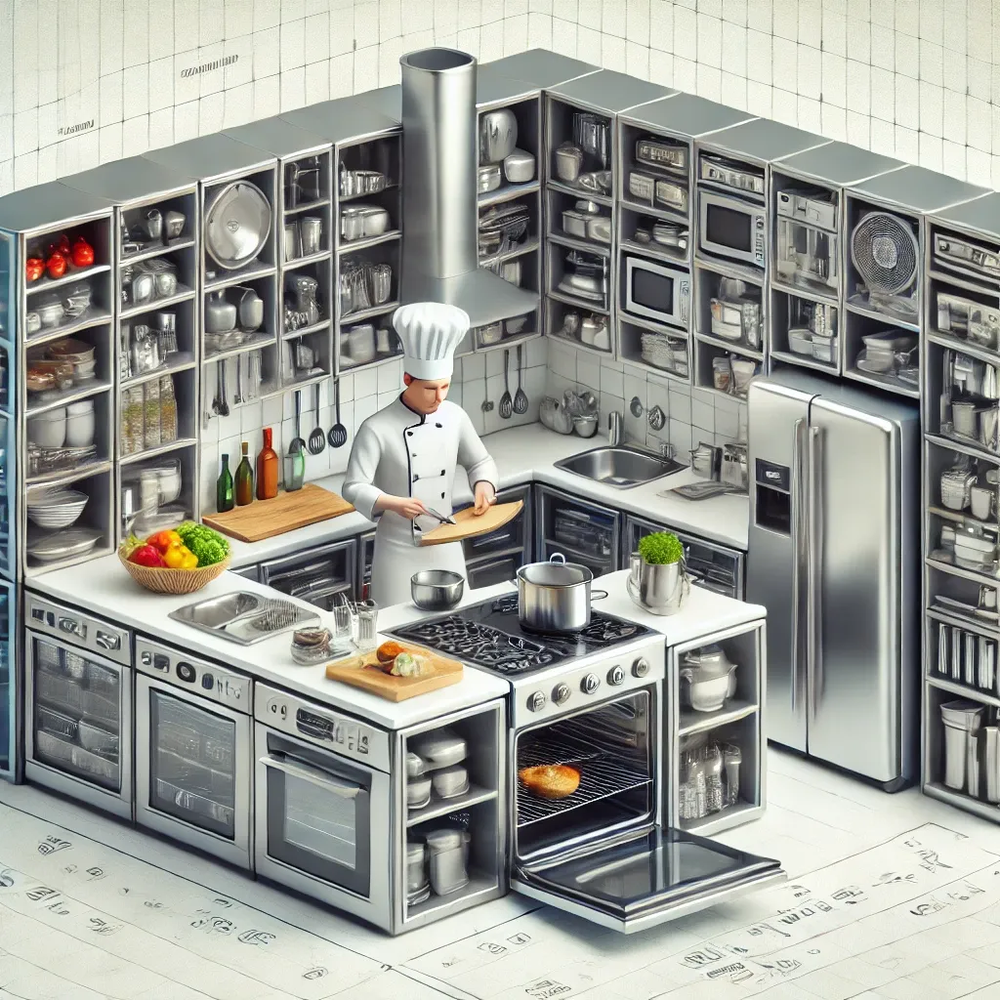
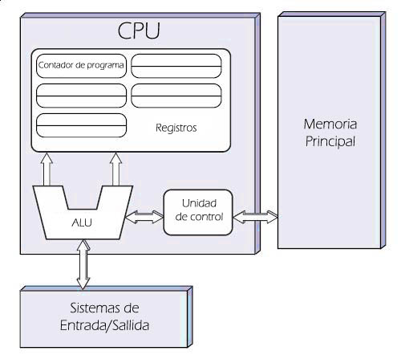
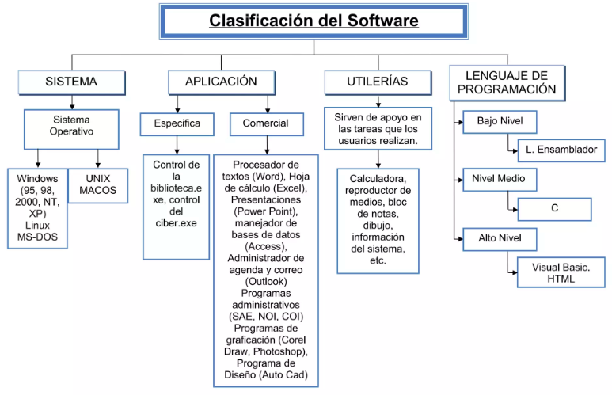

## 1.1 Relación entre el Software y el Hardware (CE 1.a)

Imagina que un ordenador es como una cocina muy moderna. Los **componentes físicos** (hardware) serían los electrodomésticos, la **memoria** es como los armarios donde guardas los ingredientes, el **procesador** sería el chef que realiza las tareas, y los **periféricos** (teclado, ratón, pantalla, impresora) serían como los utensilios y aparatos que usas para interactuar con la cocina (tus manos, ollas, horno, etc.). Ahora, el **software** serían las **recetas** que el chef sigue para cocinar un plato. Las instrucciones (o pasos) en esa receta son lo que le dicen al chef qué hacer exactamente en la cocina.

Para que un ordenador pueda "cocinar" (o ejecutar un programa), el software necesita comunicarse con el hardware, siguiendo unos pasos muy específicos.  Al igual que una receta no tiene sentido sin alguien que la cocina, y alguien que cocina no tiene sentido sin receta. El hardware y el software se necesitan uno al otro.

<figure markdown>
  
  <figcaption>Hardware y software</figcaption>
</figure>

Un pc, portátil o dispositivo móvil, como teléfono móvil o tablet, está compuesto principalmente por un hardware y un software. A continuación, vamos a ver que es el hardware y el software y cómo trabajan juntos.

### 1. ¿Qué es el Hardware?

La Real Academia Española describe al hardware como el “conjunto de los componentes que integran la parte material de una computadora”, es decir, todas las partes físicas que la constituyen, aquellas que puedes ver y tocar, por tanto el disco duro, teclado, monitor, ratón, circuitos, como la tarjeta de memoria, el microprocesador o CPU, entre otros, conforman el hardware.

Aquí tienes los componentes más importantes:

- **Procesador (CPU)**: Es el cerebro del ordenador. Toma las instrucciones de un programa y las ejecuta. Por ejemplo, si en un videojuego tu personaje debe saltar, el procesador es quien se encarga de realizar los cálculos necesarios para que eso ocurra.
- **Memoria RAM**: Es donde el ordenador guarda temporalmente la información que necesita rápidamente. Si sigues con el ejemplo del videojuego, la RAM sería el lugar donde se guarda qué tan alto salta el personaje o en qué parte del nivel está. Cuando apagas el ordenador, esta información desaparece.
- **Disco duro o SSD**: Es donde el ordenador guarda información a largo plazo, como el propio videojuego o los documentos que escribes en un editor de texto. A diferencia de la memoria RAM, los datos aquí se mantienen incluso si apagas el equipo.
- **Periféricos**: Son todos los dispositivos que permiten que el usuario se comunique con el ordenador, como el teclado, el ratón o la pantalla. También incluye dispositivos que se conectan al ordenador, como impresoras o memorias USB.

<figure markdown>
   
  <figcaption>Maquina Von Neumann</figcaption>
</figure>

### 2. ¿Qué es el Software?
El *software*, por su parte, de acuerdo con el IEEE: “es el conjunto de los programas de cómputo, procedimientos, reglas, documentación y datos asociados, que forman parte de las operaciones de un sistema de computación”.

Dicho en otras palabras, son todos los programas o aplicaciones que integran un dispositivo y que le permiten realizar tareas específicas gracias al lenguaje de programación.

El *software* le da instrucciones al hardware de la forma como debe realizar una tarea, por esta razón, todos los programas que usamos en un dispositivo son software. Algunos ejemplos de software son:

* Navegador web como Google Chrome o Mozilla Firefox.
* Sistemas operativos como Windows, Mac OS, Linux, entre otros.
* Antivirus.
* Aplicaciones de ofimática como Microsoft Word.
* Sistemas empresariales como un BPMS, ERP, CRM, entre otros.

Una posible clasificación del software es:

* **De sistema** (Sistema operativo, drivers -controladores-)
* **De aplicación** (Suite ofimática, Navegador, Edición de imagen, ...)
* **De desarrollo** (Editores, compiladores, interpretes, ...)

Aunque existen muchos tipos de software, uno de los más importante es el **sistema operativo** (como Windows, macOS o Linux), que actúa como el intermediario entre el hardware y los programas que usamos.  Piensa en el sistema operativo como el jefe de cocina. Cuando pides un plato (por ejemplo, abrir un archivo de texto), el sistema operativo se asegura de que el chef (procesador) tenga todo lo que necesita (ingredientes en la RAM) y los utensilios adecuados (acceso a disco duro o teclado) para completar la tarea.

<figure markdown>
  
  <figcaption>Tipos de Software</figcaption>
</figure>

### 3. ¿Cómo se Comunican el Software y el Hardware?

La relación entre el *software* y el *hardware* se pueden describir de la siguiente forma:

- **Disco duro**: almacena de forma permanente los archivos ejecutables y los archivos de datos.
- **Memoria RAM**: almacena de forma temporal el código binario de los archivos ejecutables y los archivos de datos necesarios.
- **CPU**: lee y ejecuta instrucciones almacenadas en memoria RAM, así como los datos necesarios.
- **E/S**: recoge nuevos datos desde la entrada, se muestran los resultados, se leen/guardan a disco, ...

> El disco duro se considera un periférico de E/S (Entrada/Salida).  
> La CPU se llama también UPC (en castellano:  Unidad de Procesamiento Central), procesador o microprocesador.

Cada vez que ejecutamos un programa en el ordenador, este se carga en la **memoria RAM**, y la **CPU** va recuperando una a una las **instrucciones** y ésta las va ejecutando, llevando a cabo las tareas que el software tenia programadas. Por ejemplo:

* **Cuando escribes en un procesador de textos**, como Word, el software envía instrucciones al teclado (periférico) para captar las letras que estás presionando.
* **Cuando guardas el documento**, el software envía instrucciones al disco duro para almacenar el archivo en un lugar específico.

El procesador es quien recibe estas instrucciones y las ejecuta. El proceso se divide en pequeños pasos que el procesador sigue de manera muy rápida (millones de veces por segundo).

### 4. Ejemplo: El Juego del Tetris

Vamos a imaginar un ejemplo práctico con un videojuego muy sencillo: **Tetris**.

- **Interacción con el hardware**:
    - Cuando presionas las flechas del teclado para mover las piezas, el teclado (periférico) envía una señal al procesador.
    - El procesador calcula cómo debe moverse la pieza en la pantalla.
    - La memoria RAM guarda temporalmente la posición de las piezas mientras el juego sigue corriendo.
    - Si decides guardar tu partida, el procesador enviará instrucciones al disco duro para almacenar la partida y poder recuperarla más tarde.
- **Cómo se Comunican el software y el hardware**:
    - El **software del juego Tetris** da las instrucciones (código) de cómo deben comportarse las piezas cuando las mueves.
    - El **procesador** ejecuta esas instrucciones, mostrando las piezas en la **pantalla**.
    - Cuando pierdes, el **sistema operativo** se encarga de liberar la memoria y recursos que el juego estaba usando.

### 5. ¿Por Qué es Importante Entender Esta Relación?

Entender cómo se comunican el software y el hardware es esencial para poder desarrollar aplicaciones eficientes. Si sabes qué recursos utiliza un programa, puedes optimizar el uso del procesador o la memoria, haciendo que el software funcione de manera más rápida y eficiente.

Por ejemplo:

- Si sabes que tu programa va a necesitar **mucha memoria** (como un editor de videos), podrías optimizarlo para que utilice la **RAM** de manera eficiente, evitando que se quede sin recursos.
- Si desarrollas un programa para un **teléfono móvil**, debes tener en cuenta que el procesador de un móvil es menos potente que el de un ordenador, por lo que tu software debe ser más ligero y eficiente.

### 6. Conclusión

El software y el hardware están estrechamente relacionados. El software da las instrucciones y el hardware las ejecuta, pero para que esto ocurra de manera eficiente, como desarrolladores, debemos entender cómo funciona cada componente. Al diseñar aplicaciones, debemos tener en cuenta qué recursos (memoria, procesador, periféricos) utilizamos y cómo optimizarlos.

Con este conocimiento, ya podemos adentrarnos en conceptos más técnicos como la diferencia entre el **código fuente**, el **código objeto** y el **código ejecutable**, que es el siguiente paso en el desarrollo de software.

