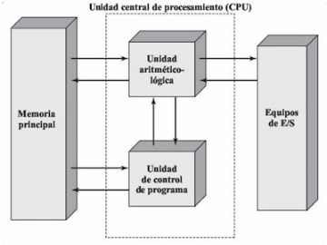

## ¿De que se compone cualquier dispositivo actual?
Un pc, portátil o dispositivo móvil, como teléfono móvil o tablet, está compuesto principalmente por un hardware y un software.

El *hardware* se compone de todos los materiales físicos que hacen posible que este aparato encienda y se ejecute.

Por su parte, el *software* es todo lo que no se ve; en otras palabras, son los programas y aplicaciones que están dentro del dispositivo y que le brindan valor a estas herramientas, gracias al trabajo que han realizado los programadores desarrollando este software.

### ¿Qué es hardware?
La Real Academia Española describe al *hardware* como el “conjunto de los componentes que integran la parte material de una computadora”, es decir, todas las partes físicas que la constituyen, aquellas que puedes ver.

Elementos como el disco duro, teclado, monitor, ratón, circuitos, como la tarjeta de memoria, el microprocesador o CPU, entre otros, conforman el hardware.

### ¿Qué es software?
El *software*, por su parte, de acuerdo con el IEEE: “es el conjunto de los programas de cómputo, procedimientos, reglas, documentación y datos asociados, que forman parte de las operaciones de un sistema de computación”.

Dicho en otras palabras, son todos los programas o aplicaciones que integran un dispositivo y que le permiten realizar tareas específicas gracias al lenguaje de programación.

El *software* le da instrucciones al hardware de la forma como debe realizar una tarea, por esta razón, todos los programas que usamos en un dispositivo son software, por ejemplo:

* Navegador web como Google Chrome o Mozilla Firefox.
* Sistemas operativos como Windows, Mac OS, Linux, entre otros.
* Antivirus.
* Aplicaciones de ofimática como Microsoft Word.
* Sistemas empresariales como un BPMS, ERP, CRM, entre otros.

#### Tipos de software
- **De sistema** (Sistema operativo, drivers -controladores-)
- **De aplicación** (Suite ofimática, Navegador, Edición de imagen, ...)
- **De desarrollo** (Editores, compiladores, interpretes, ...)

>> Los drivers son los controladores de dispositivos.

## Relación Hardware-Software
La relación entre el *software* y el *hardware* se pueden describir de la siguiente forma: 
- **Disco duro**: almacena de forma permanente los archivos ejecutables y los archivos de datos.
- **Memoria RAM**: almacena de forma temporal el código binario de los archivos ejecutables y los archivos de datos necesarios.
- **CPU**: lee y ejecuta instrucciones almacenadas en memoria RAM, así como los datos necesarios.
- **E/S**: recoge nuevos datos desde la entrada, se muestran los resultados, se leen/guardan a disco, ...

El disco duro se considera un periférico de E/S (Entrada/Salida).

La CPU se llama también UCP (en inglés), procesador o microprocesador.