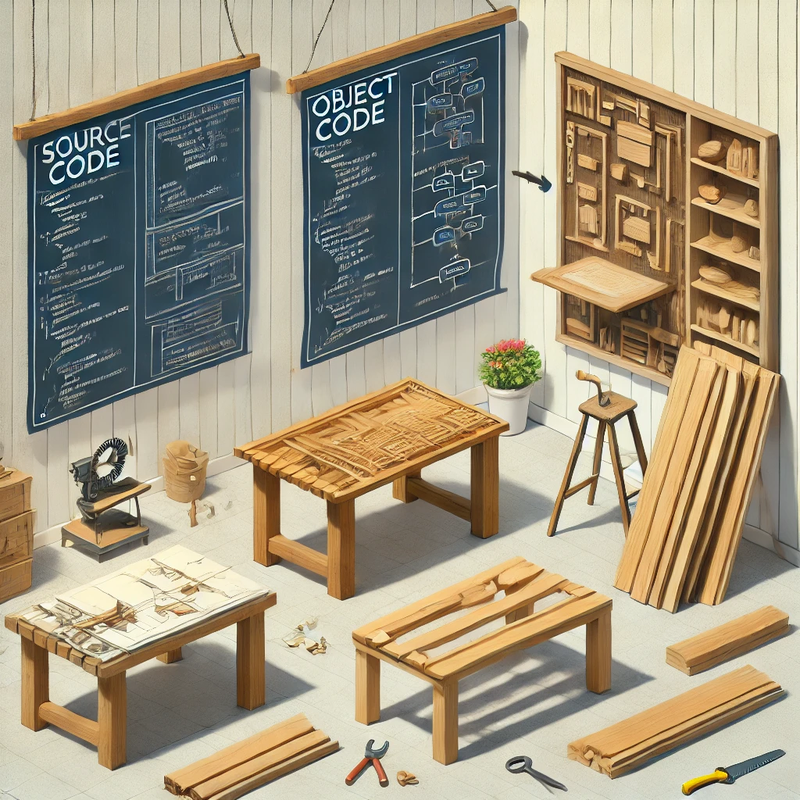

## 1.2 Código Fuente, Objeto y Ejecutable 

En esta unidad vamos a estudiar el proceso de creación de un programa, desde la escritura del código fuente hasta la ejecución del programa.
Imagina que quieres construir una **mesa**. Primero, haces un **plano** de cómo se verá la mesa y cómo la vas a armar. Luego, cortas las piezas de madera según el plano y finalmente, ensamblas la mesa para que puedas usarla. En el mundo de la programación, este proceso es muy similar a cómo un programa informático pasa por diferentes etapas antes de estar listo para ejecutarse en un ordenador.

Estas tres etapas principales son:

1. **Código fuente** (el "plano" que el programador escribe).
2. **Código objeto** (las "piezas de madera" ya cortadas y listas para ensamblar).
3. **Código ejecutable** (la "mesa ensamblada" que puedes usar).

<figure markdown>
  
  <figcaption>Código fuente, objeto, ejecutable </figcaption>
</figure>


Cada una de estas etapas tiene un propósito específico, y es importante entender qué ocurre en cada una de ellas.


### 1. ¿Qué es el Código Fuente?

El **código fuente** es el conjunto de instrucciones que el programador escribe utilizando un **lenguaje de programación** que los humanos pueden leer y comprender, como **Python, Java, C, C++**, entre otros. Este código no puede ser directamente ejecutado por la máquina, ya que los ordenadores solo entienden el **lenguaje de máquina** (una serie de unos y ceros).

- **Ejemplo**: Si estás programando en **C**, tu código fuente podría verse así:

    ```c
    #include <stdio.h>int main() {
        printf("Hola, mundo!\n");
        return 0;
    }
    
    ```

  Este código fuente en **C** contiene instrucciones que le dicen al ordenador que muestre el mensaje "Hola, mundo!" en la pantalla. Este es el punto de partida, pero todavía no puede ser entendido por la máquina.

- **En qué lenguajes se escribe**: Los lenguajes como **Java, Python, C, C++** o **JavaScript** son utilizados por los desarrolladores para escribir código fuente. Cada lenguaje tiene su propia sintaxis y características.


### 2. ¿Qué es el Código Objeto?

El **código objeto** es una versión **intermedia** del código fuente. Una vez que el programador termina de escribir el código fuente, este es **compilado** (traducido) por un programa llamado **compilador**, que transforma el código fuente en un formato que la máquina está más cerca de entender, pero aún no es completamente ejecutable.

- **Ejemplo**: Si compilas el código fuente en **C** que mostramos anteriormente, obtendrás un archivo de código objeto. Este archivo contiene las instrucciones traducidas al lenguaje de máquina, pero sin unir todos los módulos necesarios para que el programa funcione de forma completa.
- **Importancia del código objeto**: Imagina que tu programa tiene muchas partes. El código objeto contiene las instrucciones traducidas de una sola parte. Luego, todas las partes deben ser "ensambladas" en la siguiente etapa.
- **Concepto de enlazado (linking)**: El **enlazador** es una herramienta que toma los archivos de código objeto y los une en un solo archivo ejecutable. El enlazado también incluye las bibliotecas necesarias para que el programa funcione correctamente.


### 3. ¿Qué es el Código Ejecutable?

El **código ejecutable** es la versión final del programa que el ordenador puede **ejecutar directamente**. Este archivo contiene todas las instrucciones en el formato que el procesador entiende, es decir, en lenguaje de máquina (unos y ceros). El sistema operativo puede cargar este archivo y hacer que el programa funcione.

- **Ejemplo**: Si el código fuente en **C** fue compilado correctamente, el archivo ejecutable resultante podría ser algo como **hola.exe** (en Windows) o simplemente **hola** (en Linux o macOS). Ahora puedes hacer doble clic en ese archivo, y el programa mostrará "Hola, mundo!" en la pantalla.
- **Características del ejecutable**: El código ejecutable no es entendible por los humanos, pero es lo que el ordenador necesita para realizar las tareas del programa.


### 4. Ejemplo Visual: El Proceso de Traducción de Código

Imaginemos que estás traduciendo una receta para un robot que solo entiende órdenes muy específicas:

1. **Código Fuente (La receta)**: Tú escribes la receta en español. Es clara para cualquier humano que la lea, pero el robot no puede entenderla directamente.
  - *Ejemplo en C*:

      ```
      printf("Hola, mundo!\n");
      
      ```

2. **Código Objeto (Traducción intermedia)**: Alguien traduce parte de la receta al lenguaje que el robot casi entiende. Ahora está en pasos más detallados, pero aún falta enlazarla con otros ingredientes y utensilios que el robot necesita.
  - *Ejemplo en binario* (que el procesador entiende, aunque no es completo):

      ```
      1100101010101110...
      
      ```

3. **Código Ejecutable (Instrucciones finales para el robot)**: Finalmente, se prepara una versión totalmente detallada y específica de la receta para el robot, utilizando solo las instrucciones que él entiende. El robot puede ejecutar la receta y obtener el resultado final.
  - *Ejemplo en binario (que el procesador entiende)*:

      ```
      1100101010101110...
      
      ```


### 5. Proceso de Conversión: Compilación y Ejecución

Para que un programa pase de **código fuente** a **código ejecutable**, el proceso que sigue generalmente es el siguiente:

1. **Escribir el código fuente** en un lenguaje como C o Java. Aunque no todos los lenguajes siguen el mismo proceso, es mas claro verlo en C.
2. **Compilar** el código fuente. El compilador traduce el código fuente en **código objeto**.
3. **Enlazar** los archivos de código objeto para generar un **código ejecutable**.
4. **Ejecutar** el código ejecutable. Este es el programa final que puede correr en el ordenador.


### 4. Conclusión

La diferenciación entre **código fuente**, **código objeto** y **código ejecutable** es esencial para entender cómo un programa pasa de ser un conjunto de instrucciones escritas por un programador a algo que el ordenador puede ejecutar.

- El **código fuente** es lo que los programadores escriben.
- El **código objeto** es una versión intermedia que aún necesita ser ensamblada.
- El **código ejecutable** es la versión final que el ordenador puede correr.

Comprender estos tres niveles te ayudará a trabajar mejor con herramientas como compiladores y enlazadores, y a entender cómo los programas se convierten en aplicaciones funcionales.


