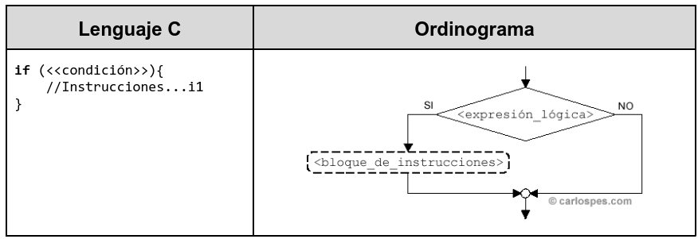
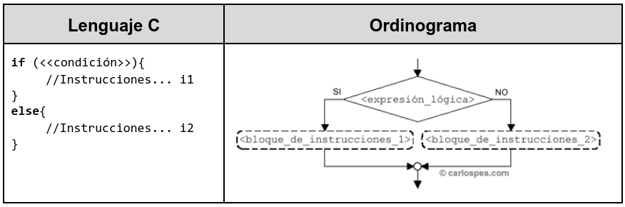
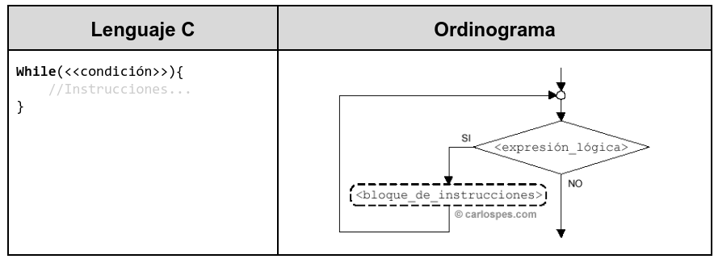
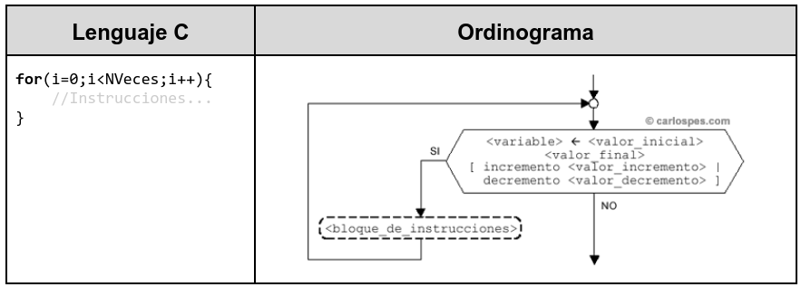

## Lenguaje de programación 
Los lenguajes de programación nos permiten comunicarnos con la máquina gracias a una estandarización que permite expresar instrucciones que el ordenador es capaz de ejecutar. Al igual que el lenguaje natural, los lenguajes de programación vienen definidos por:

* **Léxico**: determinan el conjunto de símbolos y caracteres que se pueden emplear. La conjunción de estos caracteres formarán identificadores, constantes, operadores, instrucciones, etc.
* **Sintaxis**: conjunto de reglas que determinan las construcciones válidas que se pueden realizar con los elementos anteriores.
* **Semántica**: define el significado de las construcciones anteriores.


## Tipos de lenguajes
Hoy en día existen multitud de lenguajes de programación, donde cada uno de ellos tiene sus propias características y esto da lugar a multitud de clasificaciones. A continuación comentaremos algunas de ellas.

### Según su nivel de abstracción
En orden de mayor a menor dependencia a la máquina tenemos:

* Bajo nivel: dependencia total con la arquitectura física, por ejemplo, lenguaje máquina
* Ensamblador: instrucciones legibles pero cercanas a la arquitectura con una notación simbólica o nemotécnica, por ejemplo
  ```
  ADD R1,5 (R1←  R1+5)
  ```
* Alto nivel: son aquellos cercanos al lenguaje humano, por ejemplo php, java, kotlin, javaScript, typeScript, python, etc.

### Según el paradigma de programación
El paradigma de programación nos marca un método que ha de seguirse para llevar a cabo la programación, es decir, una manera de estructurar y organizar los programas. Algunos de estos paradigmas:

#### Imperativo
En este paradigma se expresa como debe solucionarse un problema especificando una secuencia de acciones a realizar. La Programación OO y estructurada son subclases que han evolucionado con objeto de mejorar la mantenibilidad y calidad de los programas imperativos

##### Estructurada
Paradigma orientado a mejorar la claridad y calidad y tiempo de desarrollo de un programa de computadora recurriendo únicamente a subrutinas y tres estructuras básicas: secuencia, selección (if y switch) e iteración (bucles for y while); Pascal, C, Fortran son un ejemplo.

##### Orientado a objetos:
Paradigma que se caracteriza por la forma de manejar la información mediante estructuras que encapsulan propiedades y métodos. Se manejan tres conceptos claves: Clases, Objetos, La herencia. Ejemplo de este paradigma encontramos C++, C#, Java, Smalltalk, Ruby, .NET entre otros.

Veamos un ejemplo con Java:

```java
//Elimina todos los elementos de un almacén.
almacen.vaciarlo()
```

#### Declarativo
En este paradigma el énfasis está en el *qué hacer*, el problema, y NO en el *cómo hacerlo*, los pasos hasta llegar a la solución. Hay dos subtipos:

##### Lenguajes funcionales
Todas las construcciones son funciones en el sentido matemático del término. Haskell , Lisp. Veamos un ejemplo en LISP:

```Lisp
(+ 2 (* 2 2));; =  2*2+2 
```

##### Lenguajes lógicos

Se basan en restricciones de predicados de primer orden. Programación declarativa: Como ejemplo tenemos PROLOG.

#### Concurrentes

Destacan por dividir la ejecución del programa en hilos, los cuales se pueden ejecutar de manera desordenada o parcial. ADA u Occam son lenguajes utilizados con este paradigma. Este aspecto está inmerso en la mayoría de los lenguajes actuales.

#### Multiparadigma

Como su nombre indica, existen lenguajes que soportan varios paradigmas de programación, es decir, varios estilos de programación. La mayoría de los lenguajes de programación actuales soportan varios paradigmas. Por ejemplo, java o Javascript son lenguajes que se adaptan a varios de estos paradigmas, como el orientado a objetos y reactiva.

## Elementos del lenguaje de programación

Los lenguajes de programación están compuestos por un conjunto de elementos, pasamos a enumerar algunos de los que se repiten en la mayoria de los lenguajes:

* **Datos**: Los datos es la información de entrada con la que trabajan los programas, estos pueden ser simples: numéricos, alfanuméricos o lógicos o estructurados: arrays, registros, ficheros (imágenes, vídeos, sonido).
* **Constantes y variables**: Los datos son almacenados en variables y constantes, que son porciones de memoria que contienen un identificador (nombre de la variable) y un valor. El tamaño de esta porción de memoria dependerá del tipo de dato que almacene (datos simples o estructuras de datos).
* **Expresiones y operadores**: Los operadores son elementos que realizan alguna acción y forman parte de las expresiones, encontramos:
    * Aritméticos: +, -, *, /, (MOD) módulo, (DIV) división entera, ^ (potencia)
    * Alfanuméricos: + (concatenación)
    * Condicionales: =, <, >, <=, >=, !=
    * Paréntesis: () se utilizan para anidar expresiones
    * Lógicos: NOT (negación), AND (“y” lógico), OR (“o” lógico)
* **Instrucciones**: Una secuencia de instrucciones dan lugar al proceso del algoritmo. Estas instrucciones siguen estas estructuras:
    * Simples
        * Declarativas: Son las encargadas de declarar variables simples o complejas y  constantes y de reservar la memoria necesaria para almacenar los datos.
        * Primitivas: Instrucciones encargadas de asignar valores a las variables o de leer e imprimir los datos.
    * Estructura secuencial: Se ejecutan una instrucción tras otra, sin que haya opción a saltarse ninguna de ellas.
    * Estructuras condicionales: Permiten la ejecución o no de un grupo de instrucciones dependiendo de si se cumple o no una determinada condición. Existen tres tipos: simple:  if; doble:  if else; multiple: switch.
    
    
    
    * Estructura repetitiva: Permiten la ejecución repetida de un grupo de instrucciones un número determinado de veces o hasta que se cumpla una determinada condición. Existen tres tipos: Repetir mientras: While; Repetir hasta: do-while; Para: For.
    
    
    
    * Comentarios: Estas instrucciones se incluyen para hacer aclaraciones sobre el código para guiar al programador o para documentarlo. Al ser compilado estas líneas se omiten ya que no aportan ningún valor al código ejecutable.

## Tendencia en lenguajes de programación
[TIOBE Index](https://www.tiobe.com/tiobe-index) es un ranking de los lenguajes de programación más utilizados que se actualiza mensualmente. Para realizar este ranking, se consultan los 25 motores de búsqueda mejor clasificados por Alexa (software de Amazon utilizado para SEO: hacer análisis de datos en sitios web a gran escala), de entre los que destacan Google, Bing y Yahoo.
Basándose en los resultados actuales de este ranking y la evolución que ha ido teniendo los 10 primeros puestos con los datos de 2019 y 2020, se observa que los lenguajes utilizados para el desarrollo web como Java, Python, Visual Basic, JavaScript y PHP son bastante demandados, acompañados de C, C++, C# y Objetive-C, SQL, Assembly language.

Relacionado con las tendencias, aunque aún siguen surgiendo nuevos lenguajes, como por ejemplo Kotlin para las plataformas Android, Swift para IOS, existen lenguajes bastante consolidados que evolucionan mediante las revisiones propias del lenguaje o adaptándose a las diferentes necesidades mediante la aparición de frameworks, como, por ejemplo, los frameworks Spring, Hibernate para Java, o Angular 5 y React para Javascript. Incluso lenguajes que se amplían su espacio de aplicación al entorno servidor, como javascript en Node.js.

