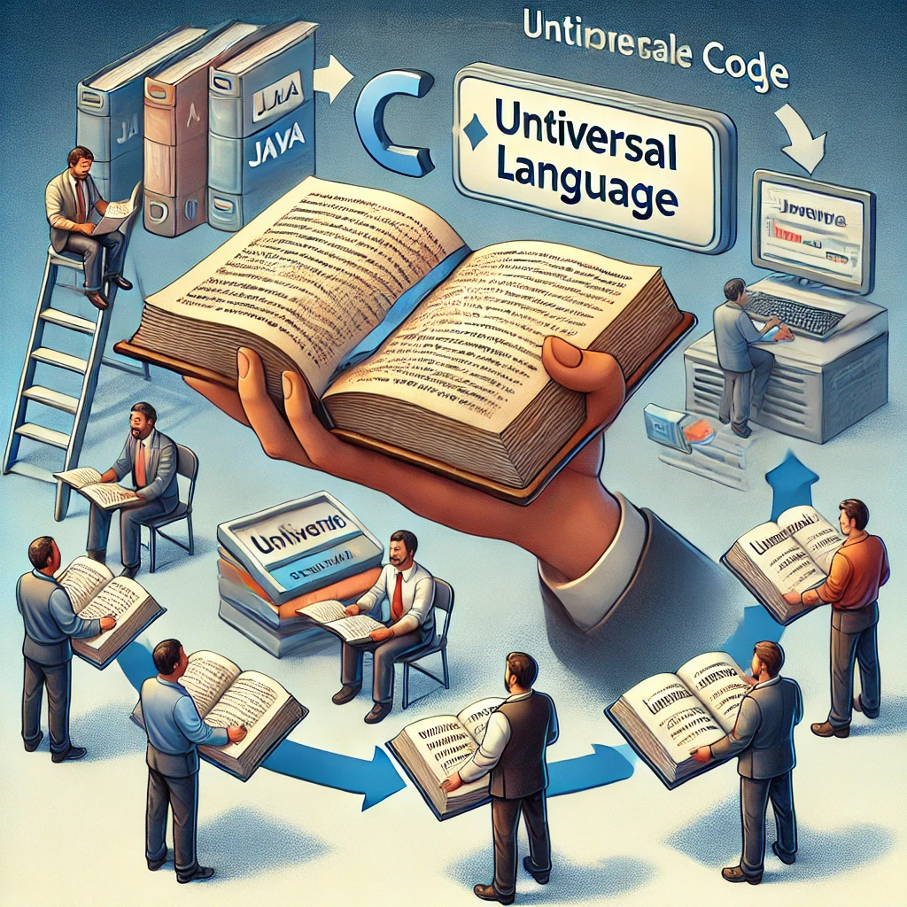

## 1.3 Código intermedio

Imagina que tienes un libro escrito en tu idioma nativo y quieres que personas de otros países lo puedan leer, pero no hablas sus lenguas. En lugar de traducir el libro a cada uno de esos idiomas, decides usar un intermediario: escribes el libro en un lenguaje universal que un intérprete local en cada país pueda traducir a su idioma. Esto es exactamente lo que hacen algunas tecnologías en el desarrollo de software: generan **código intermedio** que puede ser **ejecutado por diferentes máquinas virtuales**, permitiendo que el programa funcione en diversos sistemas operativos o plataformas.

<figure markdown>
  
  <figcaption>Código intermedio</figcaption>
</figure>

Este concepto es fundamental para lenguajes que se ejecutan sobre las plataformas de **JVM (java, kotlin)** o **(.NET) (C#)**, que no se compilan directamente a **código ejecutable** (que es específico para una máquina), sino a un **código intermedio** que es independiente de la plataforma.


### 1. ¿Qué es el Código Intermedio?

El **código intermedio** es un código generado después de la compilación del **código fuente**, pero que no está listo para ser ejecutado directamente por el procesador. En lugar de ser específico para una arquitectura de hardware (como un procesador Intel o ARM), el código intermedio está diseñado para ser ejecutado en una **máquina virtual**.

- **Máquina Virtual (VM)**: Una máquina virtual es un programa que actúa como un "intérprete" o "mediador" entre el código intermedio y el hardware. Las máquinas virtuales se encargan de ejecutar el código intermedio, traduciendo este código a instrucciones que el procesador pueda entender.
- **Ejemplos comunes**:
    - **Java** genera un código intermedio llamado **bytecode**, que es ejecutado por la **JVM (Java Virtual Machine)**.
    - **C#** genera **CIL (Common Intermediate Language)**, que es ejecutado por la máquina virtual **CLR (Common Language Runtime)** de .NET.

### 2. ¿Cómo Funciona la Generación de Código Intermedio?

Cuando programas en lenguajes como **Java** o **C#**, el proceso sigue una ruta específica:

1. **Escribir el Código Fuente**: El programador escribe el código en un lenguaje como **Java**. Este código es legible para los humanos.
    - **Ejemplo en Java**:

        ```java
        
        public class HolaMundo {
            public static void main(String[] args) {
                System.out.println("¡Hola, mundo!");
            }
        }
        
        ```

2. **Compilar a Código Intermedio**: Cuando el código fuente se **compila**, en lugar de generar código máquina específico para una plataforma (como lo haríamos con C o C++), se genera un **código intermedio**. En Java, este código intermedio es llamado **bytecode** y se guarda en un archivo **.class**.
    - **Ejemplo de bytecode generado por la JVM** (en binario):

        ```
        
        CA FE BA BE 00 00 00 34 00 0F 01 00 16 ...
        
        ```

    Este código bytecode no puede ser ejecutado directamente por el procesador del ordenador, pero está diseñado para ser ejecutado por una **máquina virtual** (como la JVM en el caso de Java).

3. **Ejecución en la Máquina Virtual**: Cuando ejecutas el programa en tu ordenador, la **máquina virtual** (en este caso, la JVM) toma el **bytecode** y lo interpreta, traduciéndolo en instrucciones de bajo nivel que el procesador de tu máquina pueda entender.
    - **Máquinas virtuales en acción**:
        - Si ejecutas el programa Java en **Windows**, la **JVM** instalada en Windows traducirá el bytecode al lenguaje de máquina específico de un procesador Intel/AMD.
        - Si ejecutas el mismo programa en **macOS** o **Linux**, la JVM correspondiente en esas plataformas traducirá el mismo bytecode a instrucciones específicas de su hardware.


### 3. ¿Por Qué Usar Código Intermedio?

El uso de **código intermedio** tiene varias ventajas:

- **Portabilidad**: El mismo programa puede correr en diferentes sistemas operativos sin necesidad de recompilar el código. Solo necesitas una máquina virtual para cada plataforma.
    - **Ejemplo**: Un programa escrito en Java puede ejecutarse en **Windows**, **Linux** y **macOS** con solo tener instalada la JVM correspondiente en cada sistema. El bytecode generado no cambia, pero la JVM se encarga de adaptarlo.
- **Seguridad**: Las máquinas virtuales, como la **JVM**, pueden agregar capas de seguridad, ya que verifican y controlan el acceso del código intermedio al sistema operativo y al hardware. Esto evita que programas maliciosos accedan a áreas no autorizadas del sistema.
- **Optimización en Tiempo de Ejecución**: Algunas máquinas virtuales utilizan técnicas como **compilación Just-In-Time (JIT)**, que convierte el código intermedio en código de máquina justo antes de que sea ejecutado, optimizando el rendimiento del programa.

### 4. Ejemplo Completo: Java y la JVM

Veamos el ciclo completo de generación de código intermedio utilizando **Java** como ejemplo:

1. **Escribir el Código Fuente (Java)**:

    ```java
    
    public class Suma {
        public static void main(String[] args) {
            int num1 = 5;
            int num2 = 3;
            int resultado = num1 + num2;
            System.out.println("El resultado es: " + resultado);
        }
    }
    
    ```

2. **Compilar el Código**: El compilador de Java (javac) toma el archivo **Suma.java** y lo convierte en **bytecode** que se almacena en un archivo **Suma.class**.

    ```bash
    
    > javac Suma.java   # Este comando genera el archivo Suma.class
    
    ```

3. **Generar Código Intermedio (Bytecode)**: El archivo **Suma.class** contiene el código **bytecode**, que se ve algo así:

    ```r
    ����7.
    	
    <init>()VCodeLineNumberTablemain([Ljava/lang/String;)V
    SourceFile	Suma.java
                            �
                             ootstrapMethods
                                            !
                                             "#Sumajava/lang/Objectjava/lang/SystemoutLjava/io/PrintStream;
    $%El resultado es: makeConcatWithConstants(I)Ljava/lang/String;java/io/PrintStreamprintln(Ljava/lang/String;)V&
                                   *$java/lang/invoke/StringConcatFactory,Lookup
                                                                                InnerClasses�(Ljava/lang/invoke/MethodHandles$Lookup;Ljava/lang/String;Ljava/lang/invoke/MethodType;Ljava/lang/String;[Ljava/lang/Object;)Ljava/lang/invoke/CallSite;-%java/lang/invoke/MethodHandles$Lookupjava/lang/invoke/MethodHandles! *��
    	
    
            	<=>����
    )
    
    ```

4. **Ejecutar en la Máquina Virtual (JVM)**: Para ejecutar el programa, se utiliza el comando:

    ```bash
    
    > java Suma   # Ejecuta el programa con la JVM
    
    ```

   La **JVM** traduce el bytecode en lenguaje de máquina específico para la plataforma y muestra el resultado en pantalla:

    ```text
    El resultado es: 8
    
    ```


### 5. ¿Qué Ocurre si No Usamos Código Intermedio?

- **Compilación directa**: En lenguajes como **C** o **C++**, el código fuente se compila directamente a **código ejecutable** específico de una máquina. Esto significa que si el programa fue compilado en **Windows**, no se podrá ejecutar en **Linux** o **macOS** sin volver a compilarlo para esos sistemas.
- **Portabilidad reducida**: Sin el código intermedio, necesitarías crear versiones diferentes de tu programa para cada sistema operativo y cada tipo de procesador, lo que puede ser laborioso y aumentar el riesgo de errores.

### 6. Resumen Visual: Ciclo de Código Intermedio en Java

1. **Código Fuente (Java)** → Escribes el código en Java.
2. **Compilación a Bytecode** → El compilador genera el **bytecode** (código intermedio).
3. **Ejecución en la JVM** → La **JVM** interpreta el bytecode y lo convierte a lenguaje de máquina específico para el sistema operativo.

### 7. Conclusión

La **generación de código intermedio** permite que los programas sean **portables** y puedan ejecutarse en diferentes plataformas sin necesidad de recompilar el código. Las máquinas virtuales, como la **JVM** para Java, toman este código intermedio y lo ejecutan de manera eficiente, garantizando la portabilidad y seguridad del software. Este enfoque es fundamental en lenguajes modernos como **Java** y **C#**, que han sido diseñados para funcionar en múltiples entornos de manera eficiente.


