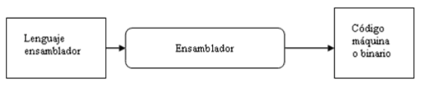

## Software e Ingeniería del software

**Software** es el conjunto de instrucciones y datos en formato binario almacenados dentro la memoria principal, si el software está en ejecución, que indica a una computadora qué debe hacer y cómo. El software se dirige al hardware y es la parte lógica del sistema informático.

La **Ingeniería del software** es la puesta en común de un conjunto de medios, conocimientos, herramientas, procesos, métodos de la ingeniería a fin de obtener software de la mejor forma, para que sea rentable, fiable y que cumpla con las especificaciones acordadas.

## El desarrollo de software
En lo que respecta al proceso del desarrollo del software, tras el nacimiento de la ingeniería del software, se definió el ciclo de vida del desarrollo de un producto software. Por esa época se estableció el modelo clásico que proponía un **ciclo en cascada** con las fases Análisis, Diseño, Desarrollo, Pruebas, Mantenimiento. En los modelos más actuales, las metodologías ágiles como **scrum**, proponen hacer pequeños ciclos de forma iterativa e incremental en los que se contemplan acciones de las anteriores fases, teniendo como principal objetivo entregar lo antes posible funcionalidad que aporte valor al usuario.

## Utilidades para el desarrollo y pruebas de programas
A continuación se listan las funcionalidades que nos ofrecen algunas de las utilidades necesarias en el proceso de creación de software durante las fases de desarrollo y pruebas.

Durante las fases de desarrollo y pruebas se realizan los trabajos de desarrollo de software en base a los diseños realizados y posteriormente se testean con objeto de obtener un software de calidad.

Tradicionalmente, los programas que se han venido usando en estas fases han sido editores, intérpretes y compiladores (codificación y generación de ejecutables) y los depuradores (pruebas), si bien posteriormente surgió el concepto de CASE (Computer Aided Software Engineering) que aglutina todas las etapas.

Cuando programamos en lenguajes de alto nivel, y desde una perspectiva clásica, estamos generando mediante un programa de edición el **código fuente** del software final. Los editores suelen incorporar un coloreado de la sintaxis, indentación automática y otras funcionalidades que ayudan al programador.

El código fuente se suele guardar en uno o varios archivos con una extensión concreta según el lenguaje utilizado y debe ser traducido a binario para que las instrucciones puedan ser entendidas y ejecutadas por la máquina. Para esto existe otro programa encargado de realizar la traducción llamado **traductor**, y pueden ser: ensambladores, compiladores e interpretes.

* Los **ensambladores** son los encargados de traducir los programas escritos en lenguaje ensamblador a lenguaje máquina.

* Los **compiladores** son programas que leen el código fuente y lo traducen o convierten a otro lenguaje. Estos programas te muestran los errores existentes en el **código fuente**, y una vez solucionados generan el **código objeto**.

* Otro sistema para la ejecución de nuestro código fuente es mediante el uso de **intérpretes**. Los intérpretes realizan la traducción y ejecución de forma simultánea, es decir, un intérprete lee el código fuente y lo va ejecutando al mismo tiempo sin generar código objeto.

Una vez tenemos el código objeto, mediante el linkado, que puede ser dinámico (quedan enlazados los distintos ficheros binarios, pero en archivos diferentes) o estático (se añade todos los binarios a un único fichero) quedan enlazados los distintos códigos objetos y se genera un *ejecutable*.

Una vez tenemos el *ejecutable*, el software está listo para ser ejecutado y se entra el proceso de pruebas, detección y solución de errores, para el que podemos usar frameworks de testeo para diseñar e implementar pruebas que detecten los errores, programas de depuración para encontrar el origen de los errores, así como otros programas de monitorización y seguimiento que se encargan de monitorizar el funcionamiento de las aplicaciones para ver el comportamiento que tienen en cuanto a rendimiento. 

Si se identifican errores, para solucionarlos se tendrá que pasar por los pasos anteriores de generación de código fuente y compilación hasta generar de nuevo ejecutable.-

A continuación se enumeran algunas herramientas que se pueden utilizar durante el proceso descrito anteriormente:

### Herramientas Clásicas

Relacionados con la fase de desarrollo de software, las herramientas que podemos usar dependen del lenguaje de programación.  Un ejemplo de estas pueden ser las  siguientes:

#### Editores

* vi, vim: Disponible en prácticamente todos los sitemas UNIX, es un editor de textos potente que funciona mediante combinación de teclas. Soporta los lenguajes de programación más usados.
* nano: Disponible en prácticamente todos los sistemas linux. Más sencillo y amigable que vi, aunque menos potente. Compatible con gran número de lenguajes de programación y resaltado de sintaxis.
* Notepad + +: Disponible para windows y con soporte para gran número de lenguajes de programación y resaltado de sintaxis.
* Sublime Text, Atom: Editores más de actualidad, multiplataforma y con soporte sobre todo para lenguajes relacionados con el desarrollo Web

#### Compiladores

* GCC: Compilador del proyecto GNU para múltiples lenguajes entre ellos c y c++. Libre y multiplataforma. Es el estándar, el que te funciona en todos los sistemas operativos (también móviles y embebidos). Los SO Linux y XCode en Mac traen GCC preinstalado.
* CLang: La alternativa a GCC. Compila más rápido y los mensajes de error se entienden más, pero soporta menos el estándar. Hay comparaciones que puedes googlear.
* MinGW: (Minimalist GNU for Windows) Incluye GCC y otras utilidades para poder usarlo en Windows.
* Javac: Compilador estándar de Java que trae el Java Development Kit. Se ejecuta desde línea de comandos. Genera un código intermedio llamado *byte-codes*.

#### Interpretes

* Java: Usando su comando java desde línea de comandos se accede a la Máquina Virtual Java que interpreta el código intermedio (byte-code) creado por javac.
* Javascript es interpretado por los motores de javascript incluidos en los navegadores y últimamente en la plataforma node. No obstante, las herramientas nativas llamadas *Developer Tools* que traen integradas los navegadores incluyen una interfaz con el motor de javascript.

#### Otras herramientas

* Make GNU es una utilidad disponible normalmente en Linux que agiliza la tarea de compilar código desde la terminal. Nos evita tener que escribir los comandos de compilación a mano, que suelen ser muy largos, y en cambio nos permite escribir algo mucho más corto que al final hace lo mismo.
* Maven y Ant son herramientas de automatización facilitar la compilación y creación de programas Java;
* SVC, subversion, git: Sistemas de control de versiones que permiten realizar un seguimiento de los cambios que se realizan en el software.
* Herramientas de refactorización: incluidas como funcionalidades avanzadas de editores, permiten realizar cambios en el código fuente para hacerlo más legible, fácil de mantener y eficiente sin cambiar la funcionalidad.

De la misma forma, durante la fase de pruebas, las herramientas estarán influenciadas por el lenguaje de programación. Un ejemplo de estas son:

#### Depuradores

* GDB o GNU Debugger es el depurador estándar para el compilador GNU. Es un depurador de línea de comandos, que funciona en varias plataformas Unix y usado para C, C++ y Fortran.
* JDB es el depurador estándar de Java que trae el *Java Development Kit*. Se ejecuta desde línea de comandos.
* Para JavaScript podemos utilizar las herramientas nativas llamadas *Developer Tools* que traen integradas los navegadores, y que incluyen herramientas para depurar.

#### Frameworks de Pruebas
* Junit: Marco de trabajo para realizar pruebas de unidad en java.
* Mocha y jest: Marcos de trabajo para realizar pruebas de unidad en Javascript.

#### Análisis y monitorización del software.
* SonarQube: es una herramienta libre para evaluar código fuente. Usa diversas herramientas de análisis estático de código fuente para obtener métricas que pueden ayudar a mejorar la calidad del código de un programa.
* Jmeter: herramienta de prueba de carga para analizar y medir el rendimiento de distintas partes de una aplicación (Conexiones JDBC, Web Services, etc).

En cualquiera de los lenguajes de ejemplo anteriores el volcado a consola de información y mensajes es una herramienta más durante las depuración del software.

