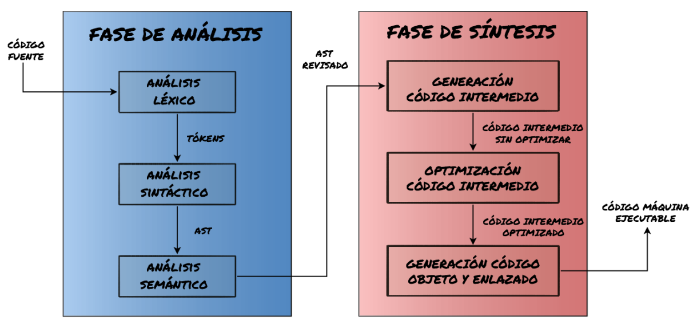
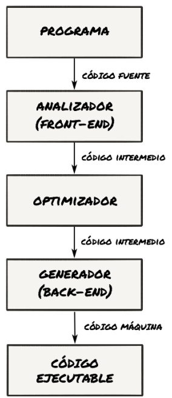

## Traductores de lenguajes de alto nivel

Como ya adelantamos previamente, existen dos tipos generales de traducción: la compilación y la interpretación. Cada lenguaje de alto nivel opta por una de ellas, una combinación de ambas o deja elegir al
desarrollador según sus necesidades.

### Compilación

La compilación es la conversión de código en un lenguaje de programación a código en otro lenguaje como paso previo a su ejecución. Normalmente cuando pensamos en compilación hablamos de su versión más tangible, aquella que nos da un programa ejecutable como salida. Se suele denominar compilación anticipada o mediante sus siglas inglesas compilación AOT (Ahead-Of-Time).

Muchos de los lenguajes clásicos y más rápidos utilizan la compilación anticipada: desde Fortran hasta Rust, pasando por C y C++.
Este tipo de compilación permite realizar optimizaciones complejas, por muy costosas que sean, y adaptar el ejecutable final a la máquina donde se va a ejecutar.

Algunos lenguajes realizan un paso de pre-compilación intermedia que no genera código máquina sino bytecode o código portable. En ese paso se trata de producir un código de bajo nivel independiente de la plataforma de ejecución que luego pueda ser interpretado de forma eficiente por una máquina virtual.

Conocidos lenguajes que suelen utilizar compilación a bytecode son Java o la plataforma .NET.

Por otro lado, cuando la compilación no genera un binario en código máquina sino un resultado en otro lenguaje de programación, se trata de una compilación fuente-a-fuente (source-to-source). A estos compiladores se le llaman transpiladores.

Los casos más comunes de este tipo los encontramos en tecnologías web, ya que los navegadores principalmente permiten ejecutar código JavaScript. Si queremos programar para el navegador con otro lenguaje debemos compilar a JavaScript. Algunos lenguajes que usan compilación fuente a fuente son TypeScript, PureScript, kotlin o Dart.

#### El proceso de compilación

La compilación es un proceso complejo que se realiza en dos fases:

* **Análisis**: Se comprueba la corrección del código fuente. Esta fase incluye:

  * **Análisis léxico**: Se asimila cada elemento del código fuente a una serie de categorías denominadas tokens.
  * **Análisis sintáctico**: Se crean representaciones abstractas de la estructura del código fuente. Estas representaciones suelen ser árboles de sintaxis abstracta (AST). Si recordamos el análisis sintáctico de la asignatura de lengua nos haremos una idea.
  * **Análisis semántico**: Se revisan los árboles de sintaxis en busca de expresiones sin sentido, aunque correctas a nivel sintáctico.
* **Síntesis**: Se trata de generar el código ejecutable. Suele incluir:

  * **Generación de código intermedio**: A partir de los AST revisados resultantes de la fase de análisis.
  * **Optimización de código**: Sin modificar el sentido del código, se modifica el código intermedio buscando optimizar su ejecución.
  * **Generación de código objeto y enlazado**: Se genera el código máquina a partir del código intermedio y se añaden las librerías de códigos necesarias para crear un ejecutable.

#### Estructura de un Compilador

En la actualidad los compiladores se estructuran en tres programas que se encargan de llevar a cabo una o varias fases del proceso de compilación: Analizador (Frontend), optimizador y generador (Backend).

El analizador es genérico para todas las plataformas de destino, mientras que el optimizador puede ser común a varios lenguajes y plataformas. El generador es propio de cada plataforma, ya que genera código máquina a partir de código intermedio.

### Interpretación y lenguajes interpretados

La forma alternativa de ejecutar un programa a partir del código en un lenguaje de programación es no generar una traducción a código máquina, sino analizar el código y realizar los cómputos que éste indique, bien directamente o bien a partir algún tipo de representación intermedia que no constituya un programa en código máquina. En este caso se dice que el programa es interpretado.

Mientras se produce la interpretación, debe ejecutarse en el sistema el programa que la realiza, es decir, el intérprete del lenguaje. Las representaciones intermedias que puede generar el intérprete son generalmente de dos tipos: un código de bajo nivel o una estructura de datos.

El código de bajo nivel suele ser bytecode en la actualidad y las estructuras de datos suelen ser árboles de sintaxis abstracta (AST) que se van recorriendo para obtener los resultados de la ejecución. Estas últimas no son tan utilizadas ya que producen mayores sobrecostes que los códigos de bajo nivel.

Ejemplos de lenguajes típicamente interpretados son Python (con bytecode), Ruby (usaba ASTs hasta la versión 1.8), PHP (con bytecode) y Perl (utiliza ASTs).

### Compilación en tiempo de ejecución

Conocida por sus siglas inglesas JIT (Just-In-Time), es una técnica para mejorar el rendimiento de sistemas que compilan a bytecode consistente en traducir el bytecode a código máquina en tiempo de ejecución.
Este tipo de compilación se denomina compilación dinámica, y permite analizar el código durante su ejecución y mejorar los resultados de un intérprete de bytecode convencional o hasta de una compilación anticipada tradicional (AOT).
