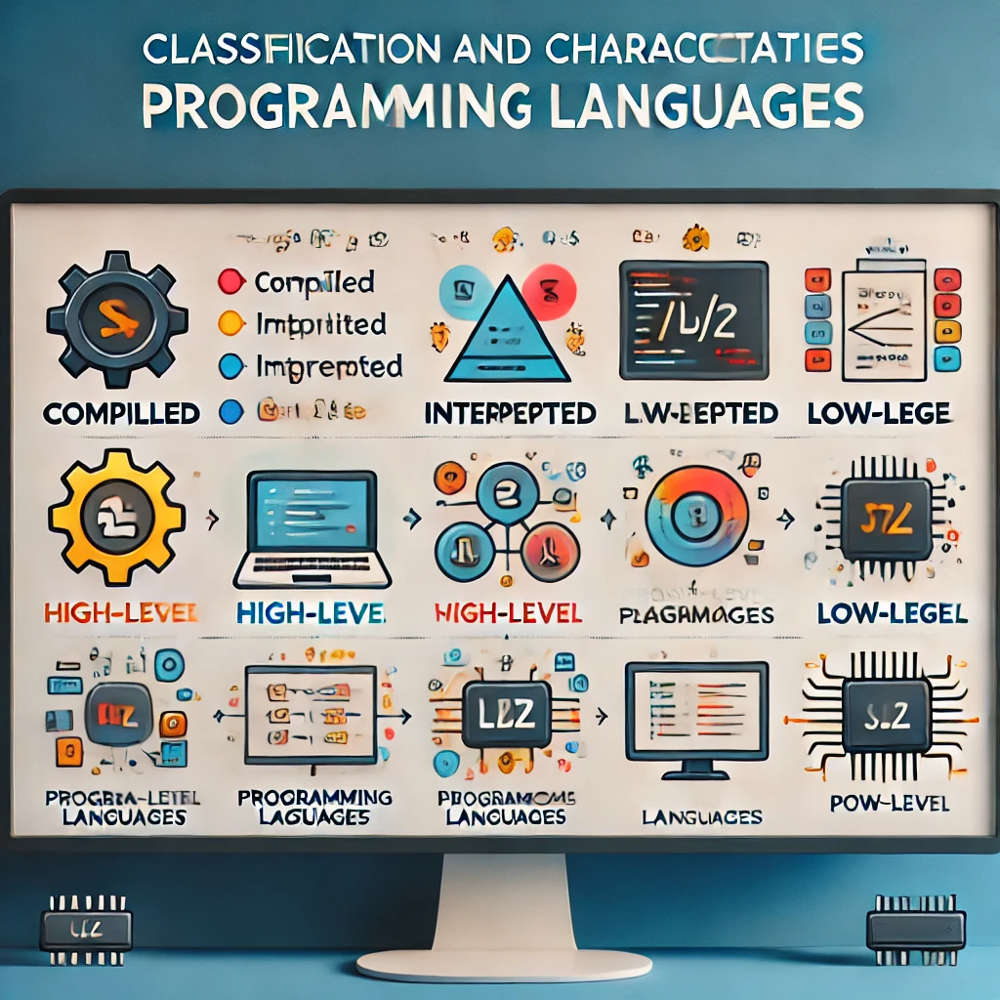
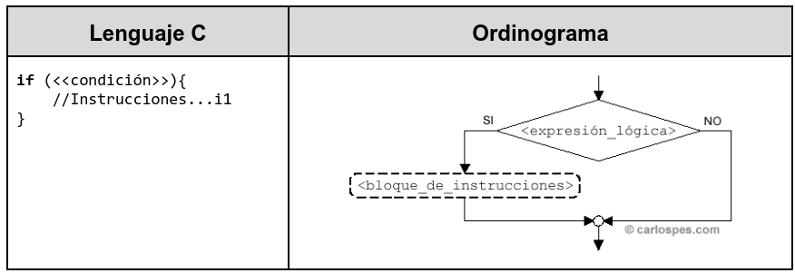
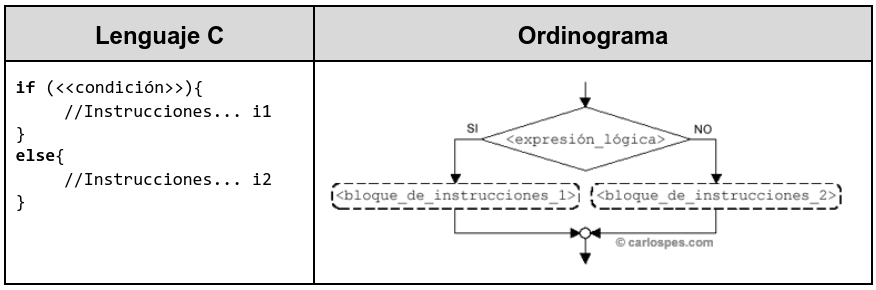
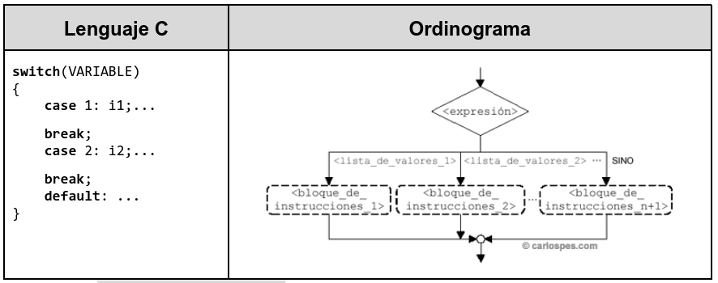
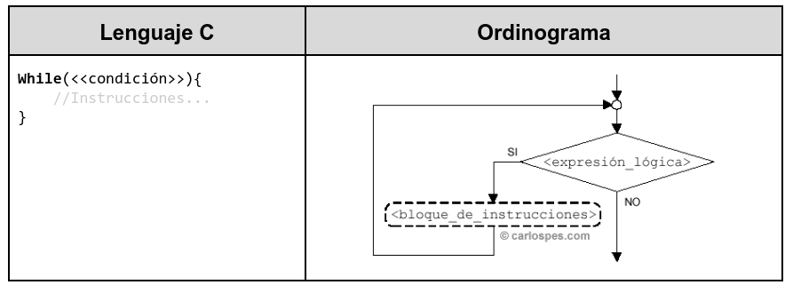
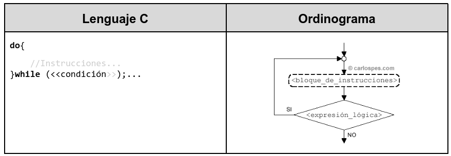
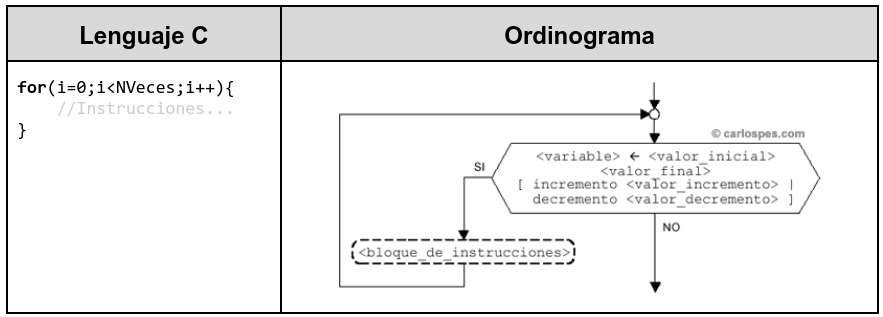

## 1.5 Lenguajes de programación

Imagina que estás construyendo una casa. Para cada tarea necesitas herramientas diferentes: una sierra para cortar madera, un martillo para clavar, y una brocha para pintar. En programación ocurre algo similar: hay diferentes **lenguajes de programación**, y cada uno está diseñado para un propósito o un tipo de tarea específico. Algunos lenguajes son más adecuados para el desarrollo de aplicaciones web, otros para el desarrollo de sistemas, y algunos para proyectos científicos o inteligencia artificial.

<figure markdown>
  
  <figcaption>Lenguajes</figcaption>
</figure>

En este punto vamos a clasificar y explicar las características de los lenguajes de programación más comunes, entendiendo en qué situaciones es mejor usar cada uno de ellos.

### 1. ¿Qué es un lenguaje de programación?

Los lenguajes de programación nos permiten comunicarnos con la máquina gracias a una estandarización que permite expresar instrucciones que el ordenador es capaz de ejecutar. Al igual que el lenguaje natural, los lenguajes de programación vienen definidos por:

* **Léxico**: determinan el conjunto de símbolos y caracteres que se pueden emplear. La conjunción de estos caracteres formarán identificadores, constantes, operadores, instrucciones, etc.
* **Sintaxis**: conjunto de reglas que determinan las construcciones válidas que se pueden realizar con los elementos anteriores.
* **Semántica**: define el significado de las construcciones anteriores.


### 2. Tipos de lenguajes 
Hoy en día existen multitud de lenguajes de programación, donde cada uno de ellos tiene sus propias características y esto da lugar a multitud de clasificaciones. A continuación comentaremos algunas de ellas.    

#### 2.1. Según el Modo de Ejecución: Lenguajes Compilados vs Interpretados    

1. **Lenguajes Compilados**:
  - **Definición**: En estos lenguajes, el **código fuente** que escriben los programadores es **compilado** (traducido) a código máquina específico de una plataforma antes de ser ejecutado. Una vez compilado, se genera un archivo **ejecutable** que el procesador puede entender y ejecutar directamente.   
  - **Características**:   
    - Más rápidos en tiempo de ejecución, ya que el código ya ha sido traducido a instrucciones máquina.   
    - Necesitan ser recompilados para cada plataforma.   
  - **Ejemplos**: **C**, **C++**, **Go**, **Rust**.   
  - **Ejemplo**:   
    - **C**: Cuando escribes un programa en C, como este:Debes compilarlo usando un compilador (como **GCC**), lo que genera un archivo ejecutable que el ordenador puede ejecutar directamente.    

        ```c
        
        #include <stdio.h>int main() {
            printf("Hola, mundo!\n");
            return 0;
        }
        
        ```

2. **Lenguajes Interpretados**:
  - **Definición**: En estos lenguajes, el código fuente es **interpretado** por un programa llamado **intérprete**, que lo lee línea por línea y lo ejecuta al instante, sin necesidad de compilar todo el código antes.   
  - **Características**:   
    - Son más lentos en tiempo de ejecución porque el código es traducido línea por línea en tiempo real.   
    - Más flexibles y fáciles de probar, ya que no es necesario compilar.   
  - **Ejemplos**: **Python**, **JavaScript**, **Ruby**, **PHP**.   
  - **Ejemplo**:   
    - **Python**: En Python, puedes escribir un programa como este:Y ejecutarlo directamente con el intérprete de Python sin necesidad de compilarlo.   

        ```python
        
        print("Hola, mundo!")
        
        ```


#### 2.2. Según el Nivel de Abstracción: Lenguajes de Alto Nivel vs Lenguajes de Bajo Nivel

1. **Lenguajes de Alto Nivel**:
  - **Definición**: Son lenguajes diseñados para ser fáciles de entender por los humanos. Son más abstractos y ofrecen muchas funcionalidades que ayudan a los desarrolladores, como la gestión de memoria automática.  
  - **Características**:  
    - Más fáciles de escribir y entender, ya que se acercan al lenguaje humano.  
    - Menos control sobre los detalles de bajo nivel del hardware.  
  - **Ejemplos**: **Python**, **Java**, **C#**, **JavaScript**.  
  - **Ejemplo**:  
    - En Python, sumar dos números es tan simple como:  

        ```python
        
        num1 = 5
        num2 = 7
        resultado = num1 + num2
        print("El resultado es:", resultado)
        
        ```

2. **Lenguajes de Bajo Nivel**:   
  - **Definición**: Son lenguajes que están más cerca del **lenguaje de máquina**. Proporcionan un control directo sobre el hardware, como la memoria y los registros del procesador.   
  - **Características**:   
    - Ofrecen mucho control y eficiencia, pero son más difíciles de escribir y entender.   
    - Se utilizan cuando se necesita alto rendimiento o acceso directo a los recursos del sistema.    
  - **Ejemplos**: **Assembly**, **C**.    
  - **Ejemplo**:   
    - Un código en **Assembly** puede verse así:   

        ```
        
        MOV AX, 0005h  ; Cargar el valor 5 en el registro AX
        MOV BX, 0003h  ; Cargar el valor 3 en el registro BX
        ADD AX, BX     ; Sumar los valores en AX y BX
        
        ```


---

#### 2.3. Según el Paradigma de Programación: Imperativos vs Funcionales vs Orientados a Objetos**

1. **Lenguajes Imperativos**:   
  - **Definición**: En estos lenguajes, el programador da instrucciones detalladas sobre **cómo** el programa debe ejecutar las tareas. Se enfoca en el **estado** del programa y cómo cambia.   
  - **Ejemplos**: **C**, **C++**, **java, kotlin**,**Python** (puede ser usado en estilo imperativo).    
  - **Ejemplo**:    
    - Un programa en C que calcula la suma de dos números es imperativo porque especifica los pasos exactos:    

        ```c
        
        int num1 = 5;
        int num2 = 7;
        int resultado = num1 + num2;
        
        ```

2. **Lenguajes Funcionales**:    
  - **Definición**: Se basan en la idea de que las funciones son unidades fundamentales de programación. En lugar de dar instrucciones sobre cómo cambiar el estado, las funciones toman entradas y producen salidas sin cambiar el estado del programa.    
  - **Ejemplos**: **Haskell**, **Lisp**, **Erlang**, **Scala** (también puede ser usado como orientado a objetos).    
  - **Ejemplo**:    
    - En Haskell, la suma de dos números se define de manera funcional:    

        ```haskell
        
        suma :: Int -> Int -> Int
        suma num1 num2 = num1 + num2
        
        ```

3. **Lenguajes Orientados a Objetos (OOP)**:
  - **Definición**: Estos lenguajes organizan el código en **objetos**, que son instancias de **clases**. Los objetos encapsulan datos y comportamientos. Es útil cuando se desea modelar elementos del mundo real dentro del software.    
  - **Ejemplos**: **Java**, **C#**, **Python** (puede ser usado en estilo orientado a objetos).    
  - **Ejemplo**:    
    - En **Java**, puedes crear una clase y un objeto:    

        ```java
        
        class Coche {
            String marca;
            int velocidad;
        
            void acelerar() {
                velocidad += 10;
            }
        }
        
        public class Main {
            public static void main(String[] args) {
                Coche miCoche = new Coche();
                miCoche.marca = "Toyota";
                miCoche.acelerar();
                System.out.println("Velocidad: " + miCoche.velocidad);
            }
        }
        
        ```


### 3. Características de los Lenguajes de Programación más Comunes**

Aquí describimos algunas de las características de los lenguajes más populares hoy en día:

- **Python**:
  - **Nivel**: Alto nivel.
  - **Modo de ejecución**: Interpretado.
  - **Paradigma**: Soporta múltiples paradigmas (imperativo, orientado a objetos, funcional).
  - **Características**: Muy fácil de leer y escribir, excelente para principiantes. Usado en ciencia de datos, automatización, desarrollo web.
- **Java**:
  - **Nivel**: Alto nivel.
  - **Modo de ejecución**: Compilado a **bytecode** y ejecutado en la JVM.
  - **Paradigma**: Orientado a objetos.
  - **Características**: Portátil gracias a la JVM, ampliamente utilizado en desarrollo empresarial, aplicaciones móviles (Android) y sistemas backend.
- **C**:
  - **Nivel**: Bajo nivel.
  - **Modo de ejecución**: Compilado.
  - **Paradigma**: Imperativo.
  - **Características**: Rápido y eficiente, permite un control detallado del hardware. Utilizado para desarrollo de sistemas operativos, controladores y aplicaciones que requieren alto rendimiento.
- **JavaScript**:
  - **Nivel**: Alto nivel.
  - **Modo de ejecución**: Interpretado.
  - **Paradigma**: Imperativo y orientado a objetos.
  - **Características**: El lenguaje de la web, utilizado para hacer páginas interactivas. También se utiliza en desarrollo backend con Node.js.


### 4. Elementos del lenguaje de programación

Los lenguajes de programación están compuestos por un conjunto de elementos, pasamos a enumerar algunos de los que se repiten en la mayoria de los lenguajes:

* **Datos**: Los datos es la información de entrada con la que trabajan los programas, estos pueden ser simples: numéricos, alfanuméricos o lógicos o estructurados: arrays, registros, ficheros (imágenes, vídeos, sonido).    
* **Constantes y variables**: Los datos son almacenados en variables y constantes, que son porciones de memoria que contienen un identificador (nombre de la variable) y un valor. El tamaño de esta porción de memoria dependerá del tipo de dato que almacene (datos simples o estructuras de datos).     
* **Expresiones y operadores**: Los operadores son elementos que realizan alguna acción y forman parte de las expresiones, encontramos:    
  * **Aritméticos**: +, -, *, /, (MOD) módulo, (DIV) división entera, ^ (potencia)    
  * **Alfanuméricos**: + (concatenación)    
  * **Condicionales**: =, <, >, <=, >=, !=    
  * **Paréntesis**: () se utilizan para anidar expresiones    
  * **Lógicos**: NOT (negación), AND (“y” lógico), OR (“o” lógico)    
* **Instrucciones**: Una secuencia de instrucciones dan lugar al proceso del algoritmo. Estas instrucciones siguen estas estructuras:    
  * Simples    
    * **Declarativas**: Son las encargadas de declarar variables simples o complejas y  constantes y de reservar la memoria necesaria para almacenar los datos.    
    * **Primitivas**: Instrucciones encargadas de asignar valores a las variables o de leer e imprimir los datos.   
  * **Estructura secuencial**: Se ejecutan una instrucción tras otra, sin que haya opción a saltarse ninguna de ellas.   
  * **Estructuras condicionales**: Permiten la ejecución o no de un grupo de instrucciones dependiendo de si se cumple o no una determinada condición. Existen tres tipos: simple:  `if`; doble:  `if else`; multiple: `switch`.    
    
    
    
  * **Estructura repetitiva**: Permiten la ejecución repetida de un grupo de instrucciones un número determinado de veces o hasta que se cumpla una determinada condición. Existen tres tipos: Repetir mientras: `While`; Repetir hasta: `do-while`; Para: `For`.    
    
    
    
  * **Comentarios**: Estas instrucciones se incluyen para hacer aclaraciones sobre el código para guiar al programador o para documentarlo. Al ser compilado estas líneas se omiten ya que no aportan ningún valor al código ejecutable.    

### 5. Tendencia en lenguajes de programación
[TIOBE Index](https://www.tiobe.com/tiobe-index) es un ranking de los lenguajes de programación más utilizados que se actualiza mensualmente. Para realizar este ranking, se consultan los 25 motores de búsqueda mejor clasificados por Alexa (software de Amazon utilizado para SEO: hacer análisis de datos en sitios web a gran escala), de entre los que destacan Google, Bing y Yahoo.
Basándose en los resultados actuales de este ranking y la evolución que ha ido teniendo los 10 primeros puestos con los datos de 2019 y 2020, se observa que los lenguajes utilizados para el desarrollo web como Java, Python, Visual Basic, JavaScript y PHP son bastante demandados, acompañados de C, C++, C# y Objetive-C, SQL, Assembly language.

Relacionado con las tendencias, aunque aún siguen surgiendo nuevos lenguajes, como por ejemplo Kotlin para las plataformas Android, Swift para IOS, existen lenguajes bastante consolidados que evolucionan mediante las revisiones propias del lenguaje o adaptándose a las diferentes necesidades mediante la aparición de frameworks, como, por ejemplo, los frameworks Spring, Hibernate para Java, o Angular 5 y React para Javascript. Incluso lenguajes que se amplían su espacio de aplicación al entorno servidor, como javascript en Node.js.

### 6. Conclusión

Entender las **diferentes clasificaciones y características de los lenguajes de programación** es fundamental para escoger el lenguaje correcto según el tipo de proyecto que quieras desarrollar. Algunos lenguajes son rápidos y eficientes, pero más difíciles de manejar (como C), mientras que otros son más fáciles y flexibles, pero menos eficientes en términos de rendimiento (como Python).

Elegir el lenguaje adecuado dependerá de lo que necesites: velocidad, portabilidad, seguridad o facilidad de uso.
