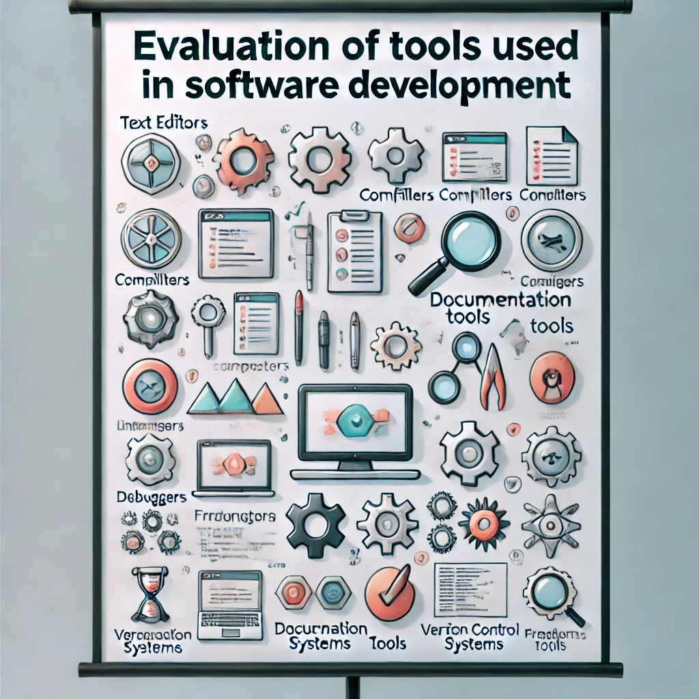

## 1.6 Herramientas para el desarrollo del software.

Las herramientas de desarrollo de software son programas que ayudan a los programadores a escribir, probar y depurar código entre otras tareas. Estas herramientas pueden ser editores de texto, compiladores, depuradores, frameworks de pruebas, entre otros.

Al desarrollar software, los programadores se apoyan en una gran variedad de herramientas para escribir, compilar, probar, documentar y gestionar su código. La elección de la herramienta adecuada es fundamental para mejorar la **productividad**, **calidad** y **mantenimiento** del software. En este punto, vamos a analizar y evaluar las herramientas más utilizadas en el desarrollo de software, excluyendo los entornos integrados de desarrollo (IDEs), que se verán en la siguiente unidad. Nos centraremos en herramientas independientes que cumplen funciones específicas en el ciclo de desarrollo de software, como editores de texto, compiladores, intérpretes, sistemas de gestión de versiones, frameworks y herramientas de pruebas y calidad.

<figure markdown>
  
  <figcaption>Utilidades para el desarrollo de software</figcaption>
</figure>

### 1. El Software y la Ingeniería del Software
El **Software** es el conjunto de instrucciones y datos en formato binario, almacenados dentro la memoria principal cuando éste está en ejecución, que indica a una computadora qué debe hacer y cómo. El software se dirige al hardware y es la parte lógica del sistema informático.

La **Ingeniería del software** es la puesta en común de un conjunto de medios, conocimientos, herramientas, procesos y métodos de la ingeniería a fin de obtener software de la mejor forma, para que sea rentable, fiable y que cumpla con las especificaciones acordadas.

#### 1.1. El desarrollo de software
En lo que respecta al proceso del desarrollo del software, tras el nacimiento de la ingeniería del software, se definió el ciclo de vida del desarrollo de un producto software. Por esa época se estableció el modelo clásico que proponía un **ciclo en cascada** con las fases Análisis, Diseño, Desarrollo, Pruebas, Mantenimiento. En los modelos más actuales, las metodologías ágiles como **scrum**, proponen hacer pequeños ciclos de forma iterativa e incremental en los que se contemplan acciones de las anteriores fases, teniendo como principal objetivo entregar lo antes posible funcionalidad que aporte valor al usuario.

<figure markdown>
  
  <figcaption>Proceso de desarrollo</figcaption>
</figure>

#### 1.2. El proceso de desarrollo y prueba de software y las utilidades necesarias

Durante las fases de desarrollo y pruebas se realizan los trabajos de desarrollo de software en base a los diseños realizados y posteriormente se testea con objeto de obtener un software de calidad.

Tradicionalmente, los programas que se han venido usando en estas fases han sido editores, intérpretes y compiladores (codificación y generación de ejecutables) y los depuradores (pruebas), si bien posteriormente surgió el concepto de CASE (Computer Aided Software Engineering) que aglutina todas las etapas.

Cuando programamos en lenguajes de alto nivel, y desde una perspectiva clásica, estamos generando mediante un programa de edición el **código fuente** del software final. Los editores suelen incorporar un coloreado de la sintaxis, indentación automática y otras funcionalidades que ayudan al programador.

El código fuente se suele guardar en uno o varios archivos con una extensión concreta según el lenguaje utilizado y debe ser traducido a binario para que las instrucciones puedan ser entendidas y ejecutadas por la máquina. Para esto existe otro programa encargado de realizar la traducción llamado **traductor**, y pueden ser: ensambladores, compiladores e interpretes.

Por último, existen otros traductores que producen un código intermedio entre el código fuente y el máquina. Son por tanto, una mezcla de interpretados y compilados. En el lenguaje Java y kotlin por ejemplo, se genera un recurso bytecode: código precompilado que necesita interpretarse por la JVM o máquina virtual de Java para ejecutarse.

Una vez tenemos el código objeto, mediante el linkado, que puede ser dinámico (quedan enlazados los distintos ficheros binarios, pero en archivos diferentes) o estático (se añade todos los binarios a un único fichero) quedan enlazados los distintos códigos objetos y se genera un *ejecutable*.

Una vez tenemos el *ejecutable*, el software está listo para ser ejecutado y se entra el proceso de pruebas, detección y solución de errores, para el que podemos usar frameworks de testeo para diseñar e implementar pruebas que detecten los errores, programas de depuración para encontrar el origen de los errores, así como otros programas de monitorización y seguimiento que se encargan de monitorizar el funcionamiento de las aplicaciones para ver el comportamiento que tienen en cuanto a rendimiento.

Si se identifican errores, para solucionarlos se tendrá que pasar por los pasos anteriores de generación de código fuente y compilación hasta generar de nuevo ejecutable.-

A continuación se enumeran algunas herramientas que se pueden utilizar durante el proceso descrito anteriormente:

### 2. Utilidades para el desarrollo y pruebas de programas
A continuación se listan algunas de las utilidades necesarias en el proceso de creación de software durante las fases de desarrollo y pruebas.

#### 2.1. Editores de Texto y su Uso en el Desarrollo de Software

Un **editor de texto** es una herramienta básica utilizada para escribir y modificar el código fuente de los programas. Aunque su funcionalidad es simple en comparación con un IDE, los editores de texto son versátiles y ligeros, lo que los hace ideales para editar rápidamente archivos de código en diferentes lenguajes.

- **Ejemplos**:
    - **Sublime Text**: Un editor de texto ligero con soporte para múltiples lenguajes, resaltado de sintaxis y plugins que se pueden añadir para aumentar su funcionalidad.
    - **Notepad++**: Ideal para trabajar con archivos de texto de bajo peso y ediciones rápidas. Permite comparar archivos y cuenta con plugins para añadir soporte a más lenguajes.
- **Aplicación**: Se suelen usar para edición rápida de código fuente, scripts o archivos de configuración (como `config.yml`). También son útiles en sistemas embebidos o cuando se necesita realizar cambios directamente en el servidor.
- **Ventajas**:
    - **Ligereza**: Consumen pocos recursos, lo que los hace útiles en sistemas con poca capacidad de procesamiento.
    - **Flexibilidad**: Pueden ser utilizados en sistemas donde no es práctico instalar un IDE completo.

#### 2.2. Compiladores: Traducción del Código Fuente a Código Máquina

Un **compilador** es una herramienta que traduce el código fuente escrito en lenguajes como C o C++ a **código máquina** (un conjunto de instrucciones que el procesador pueda entender). El código generado es específico para el sistema operativo y la arquitectura de la máquina donde se ejecuta.

- **Ejemplos**:
    - **GCC (GNU Compiler Collection)**: Un compilador de código abierto compatible con varios lenguajes (C, C++, Fortran, etc.). Se utiliza tanto en sistemas Windows como en Linux para generar ejecutables eficientes.
    - **Clang**: Un compilador moderno para C y C++ que ofrece un análisis más detallado de errores y advertencias, además de generar código optimizado.
- **Aplicación**: Los compiladores se usan cuando se necesita generar programas con **alto rendimiento**, que aprovechen al máximo los recursos del hardware y sean ejecutables directamente sin necesidad de intérpretes.
- **Ventajas**:
    - Generan código ejecutable de alto rendimiento.
    - Ofrecen más control sobre la optimización del código.

#### 2.3. Intérpretes: Ejecución Directa del Código Fuente

Un **intérprete** ejecuta el código fuente línea por línea, sin necesidad de compilarlo previamente a código máquina. Esto permite una mayor **flexibilidad** y **rapidez** en la modificación y prueba del código.

- **Ejemplos**:
    - **Python Interpreter**: Ejecuta directamente el código fuente en Python, ideal para desarrollo rápido y prototipado.
    - **Node.js**: Interprete de JavaScript orientado al backend. Permite ejecutar código JavaScript fuera del navegador y es ampliamente utilizado en desarrollo de aplicaciones web.
- **Aplicación**: Se usan principalmente para **prototipado rápido**, scripts de automatización, y cuando se necesita un entorno de desarrollo dinámico en el que probar cambios de forma inmediata.
- **Ventajas**:
    - Permiten ejecutar código de manera interactiva, ideal para depuración y pruebas rápidas.
    - No requieren un proceso de compilación, lo que facilita la edición y ejecución inmediata del código.

#### 2.4. Herramientas de Documentación: Generación de Documentos a Partir del Código

La **documentación** es crucial para mantener la claridad del código y facilitar su comprensión. Existen herramientas que analizan el código fuente y generan documentación automáticamente a partir de comentarios y anotaciones.

- **Ejemplos**:
    - **Doxygen**: Genera documentación a partir de comentarios en el código para lenguajes como C++, C y Java.
    - **JSDoc**: Utilizado para documentar proyectos en JavaScript. Genera documentación en formato HTML a partir de comentarios estructurados.
- **Aplicación**: Se usan para crear guías de uso, referencias de API y documentación técnica de los proyectos, facilitando así la colaboración entre equipos y la comprensión del código.
- **Ventajas**:
    - Automatizan la creación de documentación, reduciendo el esfuerzo manual.
    - Aseguran que la documentación se mantenga actualizada con el código.

#### 2.5. Depuradores: Análisis del Comportamiento del Programa en Tiempo de Ejecución

Los **depuradores** son herramientas que permiten detener la ejecución de un programa en puntos específicos y examinar su estado interno (variables, memoria, flujo de control) para detectar errores lógicos y fallos.

- **Ejemplos**:
    - **GDB (GNU Debugger)**: Un depurador potente para lenguajes como C y C++. Permite ejecutar el programa línea por línea, inspeccionar variables y modificar su valor en tiempo real.
    - **PDB (Python Debugger)**: Un depurador integrado en Python que permite ejecutar el código paso a paso, establecer puntos de interrupción y explorar el estado del programa.
- **Aplicación**: Se utilizan para identificar y corregir errores lógicos o de ejecución en programas que no producen el resultado esperado.
- **Ventajas**:
    - Facilitan la identificación de errores complejos.
    - Permiten explorar el estado del programa en tiempo real.

#### 2.6. Sistemas de Gestión de Versiones: Control de Cambios en el Código

Los **sistemas de gestión de versiones** permiten a los desarrolladores rastrear los cambios en su código, trabajar en diferentes ramas de desarrollo y colaborar sin riesgo de sobrescribir el trabajo de otros.

- **Ejemplos**:
    - **Git**: El sistema de control de versiones más popular, utilizado junto con plataformas como GitHub y GitLab.
    - **Mercurial**: Similar a Git, pero con una interfaz más sencilla para usuarios menos experimentados.
- **Aplicación**: Facilitan la colaboración en equipo, permiten gestionar diferentes versiones del código y garantizan la trazabilidad de los cambios.
- **Ventajas**:
    - Permiten trabajar en equipo de manera eficiente y segura.
    - Facilitan el seguimiento y revertido de cambios.

#### 2.7. Frameworks: Plantillas y Librerías que Facilitan el Desarrollo

Los **frameworks** proporcionan una estructura predefinida para desarrollar aplicaciones, facilitando la creación de proyectos mediante librerías y plantillas reutilizables.

- **Ejemplos**:
    - **Django**: Un framework para desarrollar aplicaciones web en Python. Ofrece una estructura completa que incluye bases de datos, autenticación y manejo de rutas.
    - **Spring**: Un framework para desarrollo de aplicaciones empresariales en Java.
- **Aplicación**: Se usan para acelerar el desarrollo de proyectos proporcionando un conjunto de herramientas preconfiguradas que reducen el esfuerzo de codificación desde cero.
- **Ventajas**:
    - Ahorro de tiempo en el desarrollo al reutilizar componentes.
    - Estandarizan la estructura y organización del código.

#### 2.8. Herramientas para Pruebas y Calidad de Código

Las **herramientas de pruebas** aseguran que el software funcione como se espera. Pueden realizar pruebas automáticas de diferentes aspectos del software, desde pruebas unitarias hasta pruebas de carga y rendimiento.

- **Ejemplos**:
    - **SonarQube**: Analiza la calidad del código y detecta posibles errores o malas prácticas. También mide la deuda técnica y la cobertura de pruebas.
    - **JMeter**: Realiza pruebas de carga y rendimiento para aplicaciones web, simulando múltiples usuarios concurrentes.
    - **ESLint**: Un linter para JavaScript que analiza el código en busca de errores de sintaxis y estilo.
- **Aplicación**: Se utilizan para verificar que el software cumple con los requisitos funcionales y no presenta errores de calidad o rendimiento.
- **Ventajas**:
    - Detectan errores y malas prácticas antes de que lleguen al entorno de producción.
    - Mejoran la mantenibilidad y legibilidad del código.

#### 2.9. Otras herramientas   

Existen otras herramientas que pueden ser útiles en el desarrollo de software, como:    

- **Make GNU**: Utilidad disponible normalmente en Linux que agiliza la tarea de compilar código desde la terminal. Nos evita tener que escribir los comandos de compilación a mano, que suelen ser muy largos, y en cambio nos permite escribir algo mucho más corto que al final hace lo mismo.   
- **Maven** y **Ant**: Herramientas de automatización facilitar la compilación y creación de programas Java   
- **Herramientas de refactorización**: Incluidas como funcionalidades avanzadas de editores, permiten realizar cambios en el código fuente para hacerlo más legible, fácil de mantener y eficiente sin cambiar la funcionalidad.   

### 3. Conclusión

Elegir las herramientas adecuadas para cada etapa del desarrollo es esencial para garantizar la **calidad**, **productividad** y **eficiencia** del software. Comprender las características y funciones de cada una permite a los desarrolladores optimizar su flujo de trabajo y entregar productos de mejor calidad. La evaluación de estas herramientas es una habilidad fundamental para cualquier programador que desee maximizar su rendimiento y colaborar de manera efectiva en proyectos de software.
