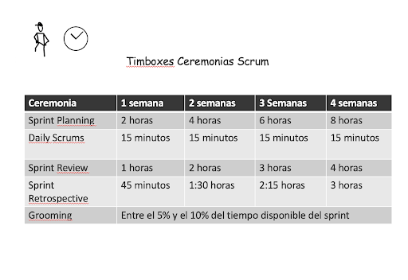
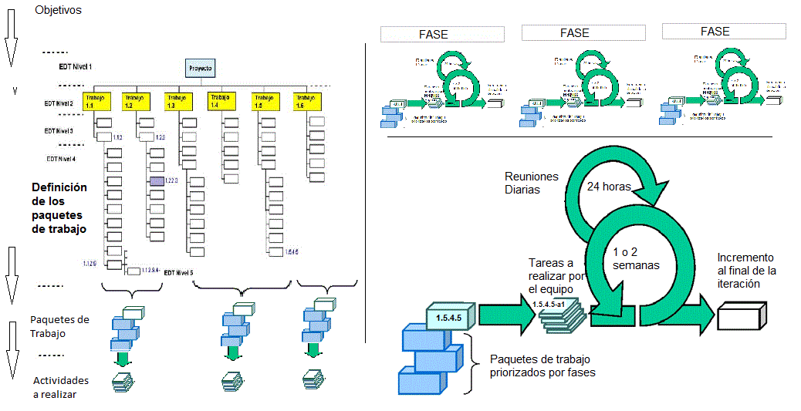

# Fases del proceso de desarrollo del software

Antes de nada, definamos lo siguiente:

- **Ingeniera del software**: se define como la ciencia y el arte de especificar, diseñar y desarrollar programas, documentación y procedimientos operativos.    
- **Proceso de Desarrollo de Software**: El conjunto de fases o pasos que ocurren desde que se concibe una idea hasta que ese software está implantado en un dispositivo y funcionando*.      
  

El proceso de desarrollo, que en un principio puede parecer una tarea simple, consta de una serie de pasos de obligado cumplimiento, pues sólo así podremos garantizar que los programas creados son eficientes, fiables, seguros y responden a las necesidades de los usuarios finales (aquellos que van a utilizar el programa). Esta última parte, la de responder a las necesidades finales de los usuarios, es compleja de conseguir y da lugar a multiples problemas durante este proceso de desarrollo, lo que provoca, en muchos casos, el fracaso o directamente cancelación de los proyectos.

El desarrollo de software es un proceso que conlleva una serie de pasos. Genéricamente, estos pasos son los siguientes:

## 1. Fases del desarrollo del Software

- **Planificación**: en esta fase se establecen los objetivos del proyecto, se define el alcance del mismo y se realiza un estudio de viabilidad y costes.
- **Análisis del problema**: Consiste en ver y comprender **qué** tarea se quiere resolver. Es imprescindible partir de una especificación de requisitos lo más exacta y detallada posible. El proceso de comprensión y simplificación del mundo real se llama análisis del problema y lo que se obtiene tras el análisis es el modelo.
- **Diseño de una solución**: Consiste en **cómo** se va a resolver el problema, suele consistir en dividir el problema principal en problemas más sencillos cuya combinación resuelve la tarea final.
- **Codificación**: Una vez definidos los algoritmos, los traducimos al lenguaje de programación que tengamos que usar. Un lenguaje de programación es un conjunto de símbolos y reglas sintácticas especialmente diseñado para transmitir ordenes al ordenador (C, Java, Pascal…).
- **Pruebas**: Servirán para identificar y corregir posibles errores, tendremos varios tipos de errores:     
    - Sintácticos: Errores sintácticos, producidos por un mal uso del lenguaje.     
    - Semánticos: Lo que está equivocado es la solución que yo he ideado. (Durante la ejecución p. ej: división entre 0, o de lógica p ej: mal diseño algoritmo.)     
- **Despliegue**: una vez que el programa está terminado, se debe implantar en el dispositivo o infraestructura del usuario final sobre la que se ejecutará.
- **Mantenimiento**: Hay tres tipos de mantenimiento:    
    - Correctivo: Sirve para corregir posibles errores o fallos del programa.    
    - Perfectivo: Se usa para perfeccionarlo.    
    - Adaptativo: Sirve para adaptarlo a nuevas situaciones.    

## 2. Modelos de desarrollo de software
Los modelos de desarrollo de software son marcos metodológicos utilizados para estructurar, planificar y controlar el proceso de desarrollo de un sistema informático. Hay varios modelos, y cada uno tiene sus propias características, ventajas y desventajas. 

### 2.1. Modelo en cascada 
Consiste en dividir el proceso de desarrollo en fases, cada una de las cuales se ejecuta una vez que la anterior ha finalizado. El modelo en cascada es un modelo secuencial, es decir, **las fases se ejecutan una tras otra**.     

- **Sin realimentación**: es el modelo de vida clásico del software. Es prácticamente imposible que se pueda utilizar, ya que requiere conocer de antemano todos los requisitos del sistema. Sólo es aplicable a pequeños desarrollos, ya que las etapas pasan de una a otra sin retorno posible. (se presupone que no habrá errores ni variaciones del software).    

- **Con realimentación**: es uno de los modelos más utilizados. Proviene del modelo anterior, pero se introduce una realimentación entre etapas, de forma que podamos volver atrás en cualquier momento para corregir, modificar o depurar algún aspecto. No obstante, si se preveén muchos cambios durante el desarrollo no es el modelo más idóneo. Es el modelo perfecto si el proyecto es rígido (pocos cambios, poco evolutivo) y los requisitos están claros.  

### 2.2. Modelo evolutivo
Tiene en cuenta la naturaleza cambiante y evolutiva del software. La idea detrás de este modelo es:    

- El desarrollo y entrega de partes funcionales del sistema de forma temprana.   
- Exponer estos desarrollos a los comentarios del usuario/cliente.    
- Refinarla en N versiones hasta que se desarrolle el sistema adecuado.     

Una ventaja de este modelo es que se obtiene una rápida realimentación del usuario, ya que las fases de especificación, desarrollo y pruebas se ejecutan en cada iteración no necesariamente en cascada. 

Destaca en estos modelos el carácter **iterativo** e **incremental** del proceso seguido:      

- En un desarrollo iterativo e incremental el proyecto se planifica en diversos bloques temporales (en el caso de Scrum de un mes natural o hasta de dos semanas, si así se necesita) llamados iteraciones. Las iteraciones se pueden entender como miniproyectos: en todas las iteraciones se repite un proceso de trabajo similar (de ahí el nombre “iterativo”) para proporcionar un resultado parcial, pero funcional, sobre producto final, de manera que el cliente pueda obtener los beneficios del proyecto de forma incremental. Para ello, cada requisito se debe completar en una única iteración: el equipo debe realizar todas las tareas necesarias para completarlo (incluyendo pruebas y documentación) y asegurar que esté preparado para ser entregado al cliente con el mínimo esfuerzo necesario. De esta manera no se deja para el final del proyecto ninguna actividad arriesgada relacionada con la entrega de requisitos.    

- En cada iteración el equipo evoluciona el producto de dos formas, haciendo una entrega:     
    - **incremental**: a partir de los resultados completados en las iteraciones anteriores, añade nuevos objetivos/requisitos.      
    - **iterativa**:  partir de los resultados completados en las iteraciones anteriores, y basándose en la retroalimentación que le ha dado el usuario final sobre las funcionalidades ya entregadas, se revisan para mejorarlas y adaptarlas a las necesidades de estos.          
    - Un aspecto fundamental para guiar el desarrollo iterativo e incremental es la priorización de los objetivos/requisitos en función del valor que aportan al cliente.     

Destacamos las metodologías aǵiles, **XP (eXtreme Programming)** y frameworks como **Scrum** como su máximo exponente.

## 3. Scrum: qué es y cómo funciona este marco de trabajo

A la hora de poner en marcha un proyecto, toda empresa debe asegurar que el equipo implicado conoce sus tareas y plazos de tiempo de entrega. Scrum es un marco de trabajo que nos ayuda a conseguirlo y que, además, permite agilizar la entrega de valor al cliente en iteraciones cortas de tiempo.

Scrum es un framework que se utiliza dentro de [equipos](https://www.wearemarketing.com/es/blog/equipos-virtuales-y-metodologia-agil-y-scrum-la-asociacion-del-futuro.html) que manejan proyectos de alta incertidumbre.  **Se trata de un marco de trabajo por el cual las personas pueden abordar problemas complejos adaptativos**, a la vez que entregar productos del máximo valor posible productiva y creativamente. Scrum es liviano y fácil de entender pero, a la vez, difícil de dominar del todo. **Este framework favorece el time to market** y la entrega rápida de MVP (mínimos productos viables).

### 3.1. ¿Cuál es el origen de Scrum?

En el año 2001, en Salt Lake City, un grupo de desarrolladores capitaneados por el ingeniero de software Kent Beck se reunieron para compartir sus frustraciones sode ficherosbre las metodologías de entrega de software y los marcos de trabajo que existían hasta entonces (PMI, CMMI o SPICE). De este encuentro salió el **Manifiesto Ágil**, que resume sus intenciones en los siguientes 4 valores:

- Valorar a los **individuos y su interacción** por encima de los procesos y herramientas.
- Valorar el **software que funciona** por encima de la documentación exhaustiva.
- Valorar la **colaboración con el cliente** por encima de la negociación contractual
- Valorar la **respuesta al cambio** por encima del seguimiento de un plan.

#### 3.1.1 Los 12 principios del Manifiesto Ágil

Además de los 4 valores mencionados anteriormente, los firmantes del Manifiesto Ágil desglosaron 12 principios que se derivan de ellos y que son igualmente importantes. Son los siguientes:

1. Nuestra mayor prioridad es satisfacer al cliente mediante la  **entrega temprana y continua de software con valor** .
2. **Aceptamos que los requisitos cambien** , incluso en etapas tardías del desarrollo. Los procesos ágiles aprovechan el cambio para proporcionar ventaja competitiva al cliente.
3. Entregamos software funcional frecuentemente, entre dos semanas y dos meses, con **preferencia al periodo de tiempo más corto posible**.
4. Los responsables de negocio y los desarrolladores trabajamos juntos de forma cotidiana durante todo el proyecto.
5. **Los proyectos se desarrollan en torno a individuos motivados**. Hay que darles el entorno y el apoyo que necesitan, y confiarles la ejecución del trabajo.
6. El método más eficiente y efectivo de comunicar información al equipo de desarrollo y entre sus miembros es la **conversación** cara a cara.
7. El **software funcionando** **es la medida principal** de progreso.
8. Los **procesos ágiles** promueven el desarrollo sostenible. Los promotores, desarrolladores y usuarios debemos ser capaces de mantener un ritmo constante de forma indefinida.
9. La **atención continua a la excelencia técnica** y al buen diseño mejora la agilidad.
10. La **simplicidad**, o el arte de maximizar la cantidad de trabajo no realizado, es esencial.
11. Las mejores arquitecturas, requisitos y diseños emergen de **equipos auto-organizados.**
12. A intervalos regulares **el equipo reflexiona sobre cómo ser más efectivo** para a continuación ajustar y perfeccionar su comportamiento en consecuencia.

#### 3.2.2 Los 5 valores Scrum

El **Manifiesto Ágil y Scrum** van de la mano para ofrecer una guía clara a los equipos de desarrollo a la hora de afrontar un nuevo proyecto. En este sentido, hay una serie de valores que se asocian al **framework Scrum** y que vale la pena tener en consideración:

- **Coraje**. Tener la valentía para hacer lo correcto y resolver problemas complejos.
- **Foco**. La organización del trabajo en sprints da certidumbre y permite centrar los esfuerzos en objetivos alcanzables.
- **Compromiso**. Para que el framework Scrum funcione necesita el compromiso de todos los miembros involucrados.
- **Sinceridad**. El equipo Scrum debe de ser transparente en cuanto al trabajo y los obstáculos que encuentra en el camino.
- **Respeto**. Tratarse de forma adecuada entre compañeros y valorar las ideas y esfuerzos de cada uno es imprescindible.

### 3.2. ¿En qué se basa el marco de trabajo Scrum?

Al estar enmarcada dentro de las [metodologías agile](https://www.wearemarketing.com/es/blog/que-es-la-metodologia-agile-y-que-beneficios-tiene-para-tu-empresa.html), Scrum se basa en aspectos como:

- La **flexibilidad** en la adopción de cambios y nuevos requisitos durante un proyecto complejo.
- El **factor humano**.
- La **colaboración** e interacción con el cliente.
- El **desarrollo iterativo** como forma de asegurar buenos resultados.

Los pilares o **características del framework Scrum** más importantes son tres:

1. **Transparencia**. Con el marco Scrum todos los implicados tienen conocimiento de qué ocurre en el proyecto y cómo ocurre. Esto hace que haya un entendimiento “común” del proyecto, una visión global.
2. **Inspección** . Los miembros del equipo Scrum frecuentemente inspeccionan el progreso para detectar posibles problemas. La inspección no es un examen diario, sino una forma de saber que el trabajo fluye y que el equipo funciona de manera auto-organizada.
3. **Adaptación** . Cuando hay algo que cambiar, el equipo se ajusta para conseguir el objetivo del sprint. Esta es la clave para conseguir el éxito en proyectos complejos, donde los requisitos son cambiantes o poco definidos y en donde la adaptación, la innovación, la complejidad y flexibilidad son fundamentales.

### 3.3. Los roles en el equipo Scrum

Si seguimos los  **valores y principios Scrum** , el equipo tiene como foco entregar valor y ofrecer resultados de calidad que permitan cumplir los objetivos de negocio del cliente.

Para ello, **los equipos de Scrum son auto-organizados y multifuncionales**. Es decir, cada uno es responsable de unas tareas determinadas y de terminarlas en los tiempos acordados. Esto garantiza la entrega de valor del equipo completo, sin necesidad de ayuda o la supervisión minuciosa de otros miembros de la organización.

A continuación desglosamos los 3 roles más importantes en un equipo de trabajo Scrum.

#### 3.3.1. Product owner

Es el responsable de **maximizar el valor del trabajo** , que  viene de la mano de una buena gestión del  **Product Backlog**, el cual explicaremos más adelante.

El Product Owner es el único perfil que habla constantemente con el cliente, lo que le obliga a tener muchos conocimientos sobre el negocio.

Para finalizar, **un equipo Scrum debe tener solo un Product Owner** y este puede ser parte del equipo de desarrollo.

#### 3.3.2. Scrum Master

Es el **responsable de que las técnicas Scrum sean comprendidas y aplicadas** en la organización. Es el **manager de Scrum**, un líder que se encarga de eliminar impedimentos o inconvenientes que tenga el equipo dentro de un sprint (que ya revisaremos en detalle más adelante), aplicando las mejores [técnicas para fortalecer el equipo de marketing digital](https://www.wearemarketing.com/es/blog/las-mejores-practicas-para-fortalecer-tu-equipo-de-marketing-digital.html).

Dentro de la organización, el Scrum Master tiene la labor de ayudar en la adopción del framework en todos los equipos.

#### 3.3.3. Equipo de desarrollo

Son los encargados de **realizar las tareas priorizadas por el Product Owner**. Es un equipo multifuncional y auto-organizado. Son los únicos que estiman las tareas del product backlog, sin dejarse influenciar por nadie.

Los equipos de desarrollo no tienen sub-equipos o especialistas. La finalidad de esto es transmitir la responsabilidad compartida si no se llegan a realizar todas las tareas de un sprint.

### 3.4. Los eventos del equipo Scrum

Este timebox refleja las diferentes ceremonias Scrum y su peso en horas según se avanza en semanas de trabajo. El desarrollo iterativo se realiza en un sprint que contiene los siguientes eventos Scrum: Sprint Planning, Daily Meeting, Sprint Review, Sprint Retrospective y Grooming.

Antes de profundizar en los diferentes eventos, es importante definir qué es un sprint en Scrum. El sprint es el corazón de este marco de trabajo, el contenedor de los demás hitos del proceso. Todo lo que ocurre en una iteración para entregar valor está dentro de un sprint. La duración máxima es de un mes, el tiempo se determina en base al nivel de comunicación que el cliente quiere tener con el equipo. **Los sprints largos pueden hacer que se pierda feedback valioso** del cliente y poner en peligro el proyecto.

#### 3.4.1. Sprint Planning

En esta reunión todo el **equipo Scrum define qué tareas se van a abordar y cuál será el objetivo del sprint**. La primera reunión que se hace en el sprint puede llegar a tener una duración de 8 horas para sprints de un mes.

El equipo se hace las siguientes preguntas:

- ¿**Qué se va a hacer en el sprint**? En base a ello, se eligen tareas del Product Backlog. Este trabajo es responsabilidad del Producto Owner.
- ¿**Cómo lo vamos a hacer**? El equipo de desarrollo define las tareas necesarias para completar cada ítem elegido del Product Backlog.

La definición de qué se va a hacer implica que el equipo tenga un objetivo y se encuentre comprometido con la entrega de valor que se hará al cliente al final del sprint. A esto se le llama **Sprint Goal**.

El resultado de esta reunión es el Sprint Goal y un **Sprint Backlog** (que revisaremos más adelante).

#### 3.4.2. Daily Meeting

Es una reunión diaria dentro del sprint que tiene como **máximo 15 minutos de duración**. En ella deben participar, sí o sí, el equipo de desarrollo y el Scrum Master. El Product Owner no tiene la necesidad de estar presente.

En esta reunión diaria el equipo de desarrollo hace las siguientes **3 preguntas**:

- ¿Qué hice ayer?
- ¿Qué voy a hacer hoy?
- ¿Tengo algún impedimento que necesito que me solucionen?

Una **Daily Scrum** es el lugar más oportuno para poder **inspeccionar el trabajo** y poder adaptarse en caso de que haya cambio de tareas dentro de un sprint.

#### 3.4.3. Sprint Review

La review del valor que vamos a entregar al cliente se hace en esta reunión, al final de cada sprint. Su duración es de 4 horas para sprints de un mes y es la **única reunión de Scrum a la que puede asistir el cliente**.

En esta reunión **el Product Owner presenta lo desarrollado al cliente** y el equipo de desarrollo muestra su funcionamiento. El cliente valida los cambios realizados y además brinda feedback sobre nuevas tareas que el Product Owner tendrá que agregar al Product Backlog.

#### 3.4.4. Sprint Retrospective

La retrospectiva es el último evento de Scrum, tiene una duración de 3 horas para sprints de un mes, y es la reunión del equipo en la que se hace una **evaluación de cómo se ha implementado el framework Scrum** en el último sprint.

Es una gran **oportunidad para el equipo Scrum** de inspeccionarse a sí mismo, proponiendo mejoras para el siguiente sprint. El resultado es una lista de mejoras que debe aplicar el siguiente día, ya que al finalizar la retrospectiva, inmediatamente comienza un nuevo sprint, que incluye los mismos eventos mencionados anteriormente.

#### 3.4.5. Grooming

El **Grooming en Scrum** es el tiempo de revisión que se dedica dentro de los equipos durante los sprints para refinar los requerimientos. Es una reunión que **no debe ocupar más del 10% del tiempo disponible del sprint**. Las tareas de usuario se revisan con un par de sprints de ventaja para que cuando llegue el equipo ya esté todo listo para el desarrollo de la tarea.

### 3.5. Los artefactos Scrum

Los **eventos y artefactos de Scrum** están definidos para maximizar la transparencia dentro del equipo; es decir, que todos tengan una misma visión de lo que está ocurriendo en el proyecto.

Si te preguntas **qué son los artefactos Scrum**, a continuación explicamos los 3 clave: Product Backlog, Sprint Backlog e Incremento.

#### 3.5.1. Product Backlog

Básicamente, el Product Backlog es el **listado de tareas que engloba todo un proyecto**. Cualquier cosa que debamos hacer debe estar en el Product Backlog y con un tiempo estimado por el equipo de desarrollo.

La responsabilidad exclusiva de ordenar el Product Backlog es del  **Product Owner**, que se encuentra en constante comunicación con el cliente para asegurarse de que las prioridades están bien establecidas.

La ordenación también es 100% responsabilidad del Product Owner, por lo que las tareas que están más arriba deben de ser las de **mayor prioridad**. El equipo de desarrollo elige tareas del Product Backlog en el Sprint Planning para generar tanto el Sprint Backlog como el Sprint Goal.

#### 3.5.2. Sprint Backlog

Es el grupo de tareas del Product Backlog que el equipo de desarrollo elige en el Sprint Planning junto con el plan para poder desarrollarlas. Debe ser conocido por todo el equipo, para asegurarse de que el foco debe estar en este grupo de tareas.

**El Sprint Planning no cambia durante el sprint**, solo se permite cambiar el plan para poder desarrollarlas.

#### 3.5.3. Incremento

El [Product Increment](https://blog.comparasoftware.com/incremento-de-producto-scrum/#:~:text=El%20incremento%20de%20Scrum%20es,dentro%20de%20un%20mismo%20Sprint.) o incremento de Scrum es el resultado de **sumar todos los elementos del Product Backlog** **completados** durante el sprint actual, añadiendo también el valor de todos los sprints anteriores. El incremento generado al final del sprint se presenta en el Sprint Review.

### 3.6 Ventajas y desventajas del marco Scrum

Una vez sabemos  **cómo funciona Scrum**, hablemos de sus ventajas y desventajas:

####  3.6.1. Ventajas de la metodología Scrum

- Scrum es muy fácil de aprender: los roles, hitos y artefactos son claros y tienen un objetivo, por lo que es un método muy relacionado con nuestra manera diaria de trabajar.
- El cliente puede comenzar a usar el producto rápidamente.
- Se agiliza el proceso, ya que la entrega de valor es muy frecuente.
- Menor probabilidad de sorpresas o imprevistos, porque el cliente está viendo frecuentemente el proyecto.

####  3.6.2. Desventajas de la metodología Scrum

- Aunque Scrum sea fácil de aprender, es muy difícil implementarlo. Esto supone una predisposición y un **cambio de cultura de la organización** que debe ir desde los altos mandos hasta los clientes.
- **La necesidad de tener equipos multidisciplinares** puede ser un problema, ya que es difícil encontrar personas que sean capaces de hacer todo el trabajo de un equipo.
- El equipo puede **tender a realizar el camino más corto** para conseguir el objetivo de un sprint, el cual no siempre ofrece resultados de calidad.

Resumiendo, **el marco de trabajo Scrum es especialmente útil cuando se trabaja en entornos de alta incertidumbre**, en los que la probabilidad de que haya cambios durante el proyecto es alta. Si los requisitos no están claros, si el cliente tiene prisa en sacar un producto al mercado o necesita un MVP, Scrum es el framework perfecto. Este marco nos permite entregar un proyecto en varias partes funcionales e independientes entre sí, a un ritmo rápido y con capacidad de corregir errores en el momento.

## Fuentes
- [GitHub de Jose Luis González Sánchez](https://github.com/joseluisgs/EntornosDesarrollo-01-2022-2023)
- https://intelequia.com/blog/post/2083/ciclo-de-vida-del-software-todo-lo-que-necesitas-saber
- https://www.monografias.com/docs114/modelos-desarrollo/modelos-desarrollo
- https://proyectosagiles.org/desarrollo-iterativo-incremental/
- [Scrum: qué es y cómo funciona este marco de trabajo](https://www.wearemarketing.com/es/blog/metodologia-scrum-que-es-y-como-funciona.html)
