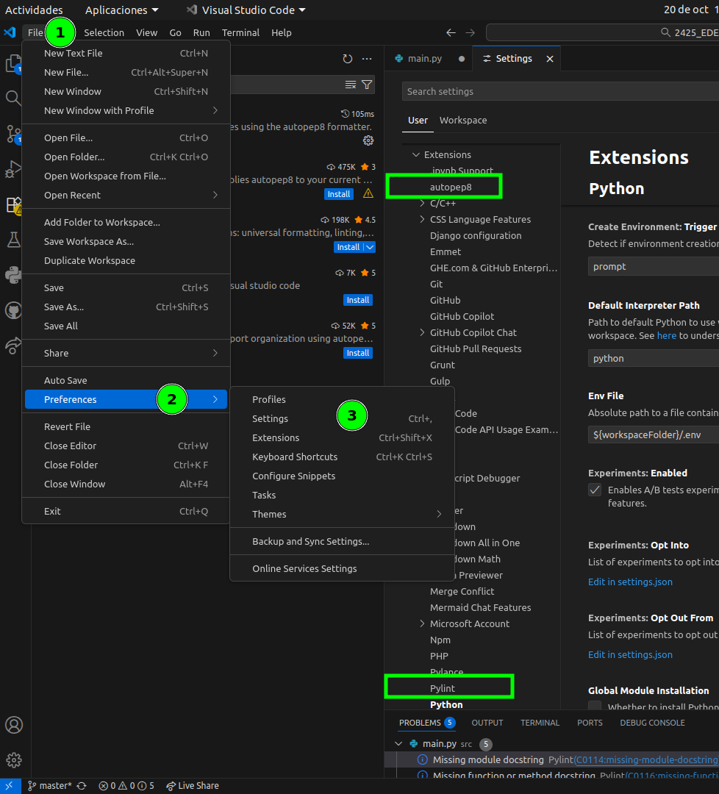
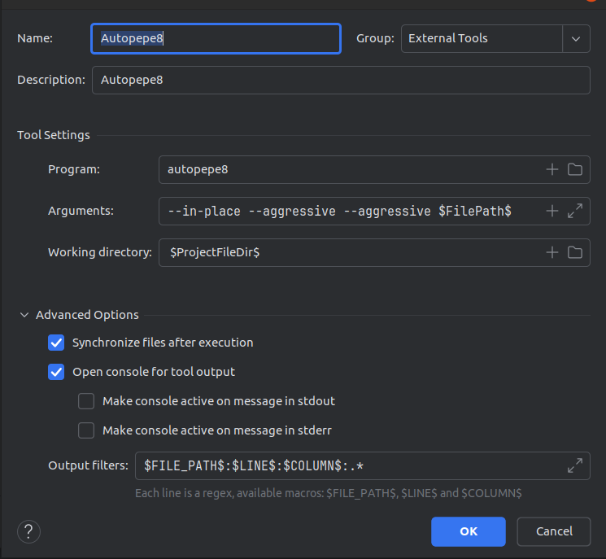
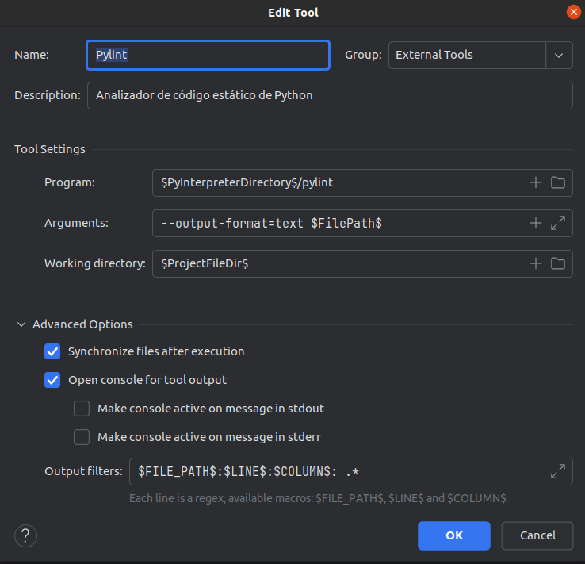
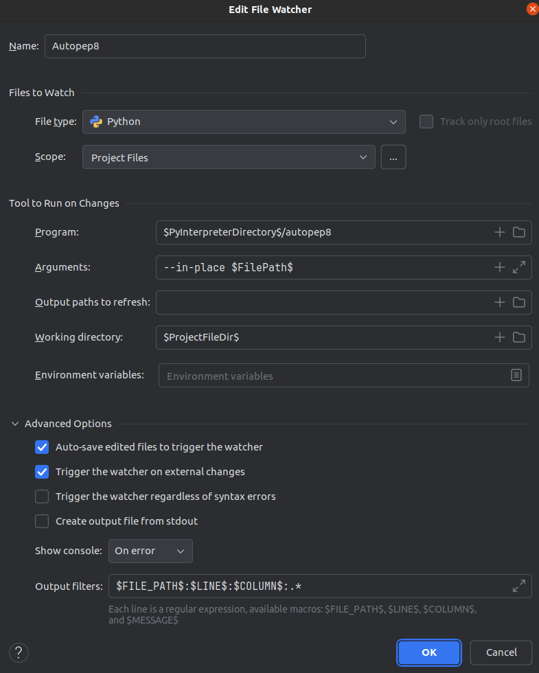
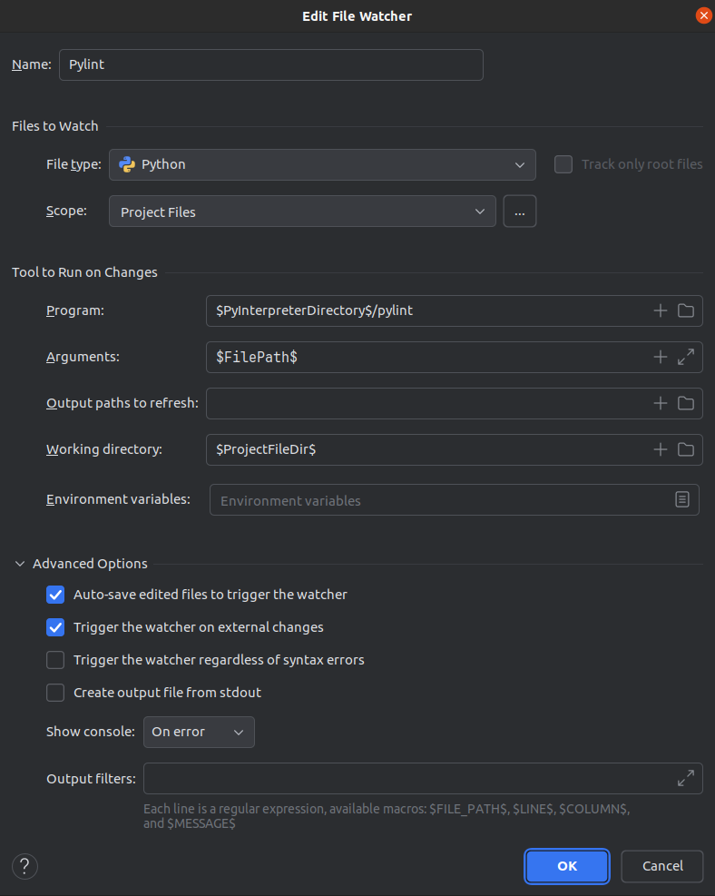

## 2.2. Gestión de módulos y extensiones

Los **módulos** y **extensiones** son pequeños complementos o "plugins" que puedes agregar a tu IDE para dotarlo de nuevas funcionalidades.

En este punto aprenderemos qué son los módulos y extensiones, cómo instalarlos, gestionarlos y por qué son fundamentales para mejorar nuestra productividad.

### 1. Introducción

Cuando trabajamos con entornos de desarrollo integrados (IDEs, aunque alguna veces nos referiremos con IDES tambien a editores potentes como Visual Studio Code, Fleet) como **Visual Studio Code** o los de **JetBrains** (IntelliJ IDEA, PyCharm, Fleet), una de sus grandes ventajas es la **flexibilidad**. Esta flexibilidad se consigue a través de los **módulos** y **extensiones** que podemos añadir para personalizar y ampliar las capacidades del IDE.

### 2. ¿Qué son los módulos y las extensiones?

#### 2.1. Definición

Los **módulos** y **extensiones** son pequeños complementos o "plugins" que puedes agregar a tu IDE para dotarlo de nuevas funcionalidades. Estas funcionalidades pueden incluir:

- Soporte para nuevos lenguajes de programación.
- Herramientas de depuración avanzadas.
- Integración con frameworks populares (como React o Django).
- Herramientas de diseño de interfaces gráficas.
- Herramientas de formateo y linting de código.
- Conexión con bases de datos o servidores.

En resumen, permiten **personalizar** el entorno según tus necesidades, añadiendo únicamente las herramientas que vas a utilizar en tu proyecto. Así, no sobrecargas el IDE con funciones que no necesitas.

#### 2.2. Ejemplo práctico de extensiones en Visual Studio Code

Visual Studio Code es conocido por ser un **editor** ligero y altamente extensible. Por defecto, cuando lo instalas, solo incluye las herramientas más básicas, pero puedes adaptarlo a casi cualquier tipo de desarrollo añadiendo extensiones.

**Ejemplo**: Imagina que quieres desarrollar una página web utilizando **HTML, CSS y JavaScript**. Al abrir Visual Studio Code, notarás que el soporte para estos lenguajes es básico. Sin embargo, al agregar extensiones específicas, puedes tener un entorno completamente optimizado para el desarrollo web.

### 3. Instalación de extensiones en Visual Studio Code

Aunque se dan instrucciones para instalar extensiones y módulos en distintos IDES, al final se proporcionan enlaces a la documentación oficial de los productos para seguir los pasos. Esta información puede variar con el tiempo, por lo que es recomendable consultar la documentación oficial para obtener la información más actualizada.

#### 3.1. Acceso al Marketplace de extensiones

1. Abre Visual Studio Code.
2. En el panel de la izquierda, verás un ícono de **cuadrado** con otro más pequeño en la esquina (es el icono del **Marketplace de Extensiones**). Haz clic en él.
3. Se abrirá una barra de búsqueda donde podrás buscar extensiones para añadir.

#### 3.2. Instalación de una extensión

Supongamos que estás desarrollando en **Python** y necesitas añadir soporte completo para este lenguaje.

1. En el Marketplace de Extensiones, escribe "Python" en la barra de búsqueda.
2. Selecciona la extensión llamada **Python** (desarrollada por Microsoft) de los resultados.
3. Haz clic en el botón **Instalar**. En unos segundos, tu IDE tendrá completo soporte para Python, incluyendo autocompletado, depuración y análisis de errores.

#### 3.3. Instalación de linting y formateadores de código

Los **linters** y **formateadores de código** son extensiones que te ayudan a mantener un código limpio y consistente.

- linters: Verifican tu código en busca de errores y malas prácticas. Por ejemplo, si escribiste una variable que nunca usas, el linter te lo indicará, o por ejemplo si tienes una variable que no sigue la convención de nombres.
- Formateadores: Ajustan automáticamente el formato de tu código según unas reglas predefinidas. Por ejemplo si tienes un código con sangrías incorrectas, el formateador lo corregirá.

Existen extensiones que te permiten utilizar estas herramientas en Visual Studio Code. La forma de instalarlas es similar a la de cualquier otra extensión. Luego puedes acceder a su configuración para ajustarlas a tus preferencias.

Estas extensiones no solo te ayudarán a escribir código más rápido, sino que también te aseguran que sigues buenas prácticas en tu proyecto.

Como ejemplo, si estás trabajando con **Python**, podrías instalar las siguientes extensiones:

- **Pylint**: Un linter popular para Python que te ayuda a identificar errores y mejorar la calidad de tu código.
- **AutoPEP8**: Un formateador que ajusta tu código para que siga las convenciones de estilo PEP 8.

Busca estas extensiones en el Marketplace de Visual Studio Code e instálalas siguiendo los pasos mencionados anteriormente. Luego, configura cada extensión según tus necesidades para aprovechar al máximo sus funcionalidades. (`File > Preferences > Settings > Extensions`). 

Por ejemplo, puedes configurar **Pylint** y **AutoPEP8** para que muestre siempre las notificaciones, estableciendo "Show Notifications" a "always" y así estar al tanto de los problemas y correcciones sugeridas por estas herramientas.




### 4. Gestión de módulos en JetBrains (IntelliJ IDEA, PyCharm)

Los entornos de JetBrains también permiten una gran personalización mediante **módulos** y **plugins**. Estos módulos se instalan y gestionan directamente desde el IDE, y están orientados a proyectos más complejos o lenguajes específicos.

#### 4.1. ¿Qué es un módulo en JetBrains?

Un **módulo** en JetBrains es un conjunto de archivos y configuraciones que añaden soporte para ciertos lenguajes o frameworks en tu proyecto. Si trabajas con **Python**, puedes instalar el módulo de Python, y además añadir un módulo para **Django** si trabajas con este framework para el desarrollo de aplicaciones web. O si estas en IntelliJ IDEA  y trabajas con **Java** o **kotlin**, puedes instalar un módulo para soportar el framework **Spring**. IntelliJ IDEA y PyCharm tienen módulos específicos para cada lenguaje y framework, lo que te permite personalizar tu entorno de desarrollo según tus necesidades.

#### 4.2. Instalación de módulos en IntelliJ IDEA

1. Abre IntelliJ IDEA.
2. Dirígete a la barra superior y selecciona `File > Project Structure`.
3. En la ventana de estructura de proyecto, selecciona la opción **Modules** y haz clic en **+** para añadir un nuevo módulo.
4. Elige el tipo de módulo que quieres instalar, por ejemplo, **Java**, **Kotlin**, o **Spring**. Sigue las indicaciones del asistente para configurarlo.

#### 4.3. Instalación de plugins en JetBrains (PyCharm)

Además de los módulos, JetBrains permite la instalación de **plugins** que amplían las capacidades de su IDE de forma similar a las extensiones de Visual Studio Code.

1. En la barra superior, ve a `File > Settings` (o `Preferences` en Mac).
2. Selecciona la opción **Plugins**.
3. En el campo de búsqueda, escribe el nombre del plugin que necesitas. Por ejemplo, si trabajas con Kotest (framework de pruebas unitarias para kotlin), puedes buscar el plugin Kotest.
4. Haz clic en **Instalar** y reinicia el IDE para que los cambios se apliquen.

#### 4.3. Instalación de linting y formateadores de código

Como hemos dicho, los **linters** y **formateadores de código** son extensiones que te ayudan a mantener un código limpio y consistente.

Existen extensiones que te permiten utilizar estas herramientas en Pycharm. A continuación te explico cómo configurarlas tanto para ejecutarlas manualmente (External Tools) como automáticamente al guardar (File Watchers).

##### 4.3.1. Instalar las herramientas en el intérprete del proyecto

Antes de nada, debes instalar las aplicaciones..

```bash
pip install autopep8 pylint
```

> Consejo: instala en el mismo venv que usa PyCharm para el proyecto. Es decir, recuerda hacerlo dentro de tu entorno virtual, así funcionará con `$PyInterpreterDirectory$`.


##### 4.3.2.  External Tool – **autopep8**



**Ruta:** *Settings / Preferences → Tools → External Tools → (+)*

* **Name:** `Autopep8`
* **Group:** `External Tools`
* **Description:** `Autopep8`
* **Program:** `autopep8`
  *(Alternativa más robusta: `$PyInterpreterDirectory$/autopep8` o `$PyInterpreterDirectory$/python` con `-m autopep8`)*
* **Arguments:** `--in-place --aggressive --aggressive $FilePath$`
* **Working directory:** `$ProjectFileDir$`

**Advanced Options**

* ☑ **Synchronize files after execution**
* ☑ **Open console for tool output**
* ☐ Make console active on message in stdout
* ☐ Make console active on message in stderr
* **Output filters:**
  
  ```
  $FILE_PATH$:$LINE$:$COLUMN$:.* 
  ```

> Uso: *Tools → External Tools → Autopep8* sobre el fichero abierto.


##### 4.3.3. External Tool – **pylint**




**Ruta:** *Settings / Preferences → Tools → External Tools → (+)*

* **Name:** `Pylint`
* **Group:** `External Tools`
* **Description:** `Analizador de código estático de Python`
* **Program:** `$PyInterpreterDirectory$/pylint`
  *(Alternativa universal: `$PyInterpreterDirectory$/python` con `-m pylint`)*
* **Arguments:** `--output-format=text $FilePath$`
* **Working directory:** `$ProjectFileDir$`

**Advanced Options**

* ☑ **Synchronize files after execution**
* ☑ **Open console for tool output**
* **Output filters:**
  
  ```
  $FILE_PATH$:$LINE$:$COLUMN$:.* 
  ```

> Uso: *Tools → External Tools → Pylint*. Podrás hacer clic en `ruta.py:línea:columna` gracias al filtro.


##### 4.3.4. File Watcher – **autopep8** (formateo al guardar)




**Ruta:** *Settings / Preferences → Tools → File Watchers → (+) → Custom*

**Files to Watch**

* **File type:** `Python`
* **Scope:** `Project Files`

**Tool to Run on Changes**

* **Program:** `$PyInterpreterDirectory$/autopep8`
* **Arguments:** `--in-place $FilePath$`
* **Output paths to refresh:** *(vacío)*
* **Working directory:** `$ProjectFileDir$`
* **Environment variables:** *(vacío)*

**Advanced Options**

* ☑ **Auto-save edited files to trigger the watcher**
* ☑ **Trigger the watcher on external changes**
* ☐ Trigger the watcher regardless of syntax errors
* ☐ Create output file from stdout
* **Show console:** `On error`
* **Output filters:**
  
  ```
  $FILE_PATH$:$LINE$:$COLUMN$:.* 
  ```

> Efecto: cada vez que guardes un `.py`, autopep8 reescribe el archivo con el formato PEP 8.


##### 4.3.5.  File Watcher – **pylint** (lint al guardar)




**Ruta:** *Settings / Preferences → Tools → File Watchers → (+) → Custom*

**Files to Watch**

* **File type:** `Python`
* **Scope:** `Project Files`

**Tool to Run on Changes**

* **Program:** `$PyInterpreterDirectory$/pylint`
* **Arguments:** `$FilePath$`
* **Output paths to refresh:** *(vacío)*
* **Working directory:** `$ProjectFileDir$`

**Advanced Options**

* ☑ **Auto-save edited files to trigger the watcher**
* ☑ **Trigger the watcher on external changes**
* **Show console:** `On error`
* **Output filters:** *(puedes dejarlo vacío o usar el mismo patrón de antes para que PyCharm enlace a línea/columna)*


### 5. Desinstalación y actualización de extensiones y módulos

#### 5.1. Desinstalación en Visual Studio Code

Si en algún momento ya no necesitas una extensión, puedes desinstalarla fácilmente.

1. Abre el panel de extensiones en Visual Studio Code (`Ctrl + Shift + X`).
2. Encuentra la extensión que deseas desinstalar.
3. Haz clic en el botón de la **papelera** que aparece junto a su nombre.

#### 5.2. Actualización de extensiones en Visual Studio Code

Visual Studio Code te notificará automáticamente cuando haya actualizaciones disponibles para tus extensiones. Solo tienes que hacer clic en el botón de **Actualizar** que aparecerá junto a la extensión en el Marketplace.

#### 5.3. Gestión de módulos y plugins en JetBrains

Desde `File > Settings > Plugins`, puedes gestionar tus plugins instalados: desactivarlos temporalmente, actualizarlos o desinstalarlos por completo. Esto te permite mantener tu IDE optimizado y evitar sobrecargarlo con funcionalidades innecesarias.

### 6. Enlaces y recursos de interés

Siguiendo los siguientes enlaces podrás instalar extensiones y plugins en Visual Studio Code y los IDEs de JetBrains:

#### 6.1. Extensiónes en Visual Studio Code

- [Extensiones en markeplace](https://code.visualstudio.com/docs/editor/extension-marketplace)
- [Using extensions in Visual Studio Code](https://code.visualstudio.com/docs/introvideos/extend)
- [Instalación de la extensión de Python](https://learn.microsoft.com/es-es/training/modules/python-install-vscode/5-exercise-install-python-extension?pivots=linux)
- [Visual Studio Code Marketplace](https://marketplace.visualstudio.com/)
- [Extensiones recomendadas para Python en Visual Studio Code](https://code.visualstudio.com/docs/python/environments)
- [Extensiones recomendadas para Kotlin en Visual Studio Code](https://marketplace.visualstudio.com/items?itemName=mathiasfrohlich.Kotlin)

#### 6.2. Extensiónes en herramientas Jetbrains

- [Instalando plugins en pycharm](https://www.jetbrains.com/help/pycharm/managing-plugins.html)
- [Plugins en pycharm](https://www.jetbrains.com/help/pycharm/plugins-settings.html)
- [Instalando plugins en IDEA](https://www.jetbrains.com/help/idea/managing-plugins.html)
- [Plugins en IDEA](https://www.jetbrains.com/help/idea/plugins-settings.html)
- [Extensiones recomendadas para Python en PyCharm](https://www.jetbrains.com/help/pycharm/python.html)


### 7. Conclusión

La gestión de **módulos** y **extensiones** es una parte fundamental para personalizar tu entorno de desarrollo y ajustarlo a las necesidades de tu proyecto. Tanto en **Visual Studio Code** como en los **IDEs de JetBrains**, puedes añadir o eliminar funcionalidades según lo que vayas necesitando. Esto te permite trabajar de forma más eficiente, ahorrando tiempo y mejorando la calidad de tu código. ¡Aprovecha todas las herramientas a tu disposición para hacer que tu entorno de desarrollo sea perfecto para ti!
