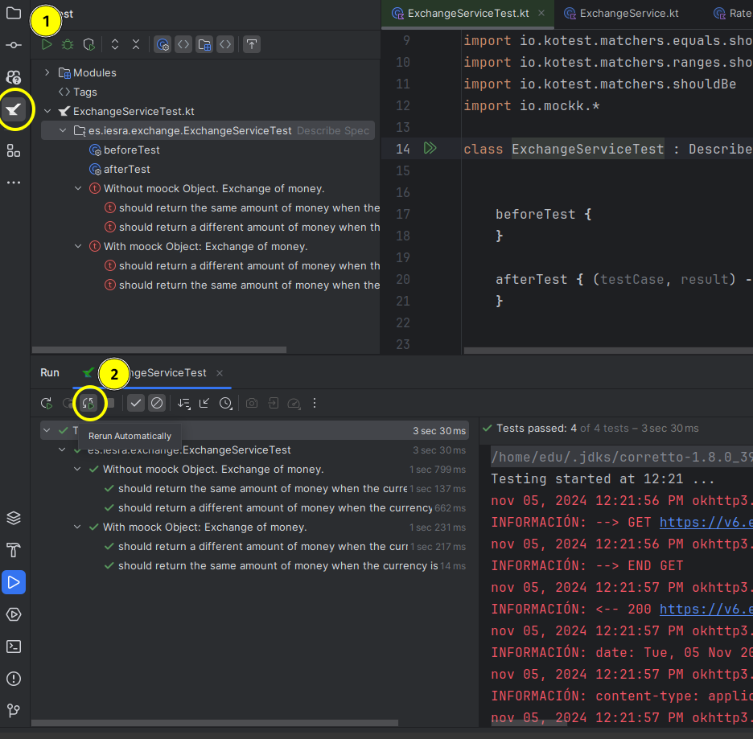

## 2.3. Personalización del entorno
La **personalización** y **automatización** del entorno de desarrollo son esenciales para maximizar la productividad y optimizar el flujo de trabajo.  En este punto veremos cómo personalizar y automatizar estos IDEs para que trabajen de la manera que mejor se ajuste a tus necesidades.


### 1. Introducción

Uno de los aspectos más importantes a la hora de trabajar en un entorno de desarrollo es la **personalización** y **automatización** del mismo. Adaptar el entorno de trabajo a nuestras preferencias y automatizar tareas repetitivas nos ayuda a ser más eficientes y productivos. Tanto **JetBrains** como **Visual Studio Code** ofrecen muchas opciones para personalizar la apariencia, atajos de teclado y automatizar tareas como la compilación, ejecución de scripts o ejecución de pruebas son pasos clave que te permitirán centrarte en lo que realmente importa: escribir buen código. 
### 2. Personalización del entorno

Cada desarrollador tiene preferencias distintas, desde la forma en que se muestra el código hasta los atajos de teclado. Personalizar el entorno puede hacer que te sientas más cómodo y trabajes de manera más fluida.   

Aunque se darán instrucciones sobre cómo personalizar los IDES, al final del punto se incluirán enlaces a los productos oficiales de Visual Studio Code y JetBrains ya que los pasos pueden cambiar con el tiempo.

#### 2.1. Personalización de Visual Studio Code

Visual Studio Code es muy flexible y permite modificar casi cualquier aspecto del entorno.   

##### 2.1.1. **Cambiar el tema de color**

1. Para cambiar el **tema de color** del editor, ve a `Archivo > Preferencias > Tema de color` o utiliza el atajo `Ctrl + K + T`.    
2. Aparecerá una lista de temas preinstalados. Puedes elegir entre opciones como **Claro**, **Oscuro**, o temas personalizados como **Monokai**.   
    - **Ejemplo**: Si prefieres trabajar con un tema oscuro que reduce la fatiga visual,  selecciona el tema **Dark+ (predeterminado oscuro)**.   

##### 2.1.2. **Cambiar la fuente y el tamaño del texto**

1. Dirígete a `Archivo > Preferencias > Configuración` o usa `Ctrl + ,`.   
2. En la barra de búsqueda, escribe "font size" para encontrar la opción de cambiar el tamaño de la fuente.   
    - **Ejemplo**: Puedes aumentar el tamaño de la fuente a 14px para que sea más cómodo trabajar en pantallas pequeñas.   

##### 2.1.3. **Atajos de teclado personalizados**

1. Si hay combinaciones de teclas que usas frecuentemente, puedes crear **atajos de teclado personalizados**.   
2. Ve a `Archivo > Preferencias > Atajos de teclado` o usa `Ctrl + K + S`.   
3. Busca la acción que deseas personalizar y asigna una nueva combinación de teclas.   
    - **Ejemplo**: Puedes configurar el atajo `Ctrl + Alt + F` para formatear automáticamente el código de acuerdo a tus reglas.   

##### 2.1.4. **Panel de extensiones**

1. Si trabajas en diferentes tipos de proyectos, puedes instalar extensiones específicas y activar solo las necesarias.   
    - **Ejemplo**: Si estás trabajando en un proyecto con **Python**, puedes instalar la extensión de Python y desactivar otras extensiones como las de HTML o CSS para mantener el IDE ligero y optimizado.   

#### 2.2. Personalización de JetBrains (IntelliJ IDEA, PyCharm, Fleet)

Los entornos de JetBrains también ofrecen muchas opciones para personalizar tu espacio de trabajo.   

##### 2.2.1. **Cambiar el tema de JetBrains**

1. En la barra superior, selecciona `File > Settings` (o `Preferences` en Mac).  
2. Navega hasta `Appearance & Behavior > Appearance` y selecciona un nuevo tema.   
    - **Ejemplo**: Si prefieres un tema oscuro, puedes seleccionar **Darcula**, que es un tema popular entre los programadores por ser cómodo a la vista en entornos con poca luz.   

##### 2.2.2. **Ajustar los atajos de teclado**

JetBrains tiene una serie de **esquemas de teclas** que puedes elegir, o puedes crear el tuyo propio.   

1. Ve a `File > Settings > Keymap`.  
2. Aquí puedes seleccionar un esquema predefinido, como el esquema de **Visual Studio** si ya estás acostumbrado a él.   
3. También puedes hacer clic derecho sobre cualquier acción y asignar tu propio atajo.  
    - **Ejemplo**: Si prefieres ejecutar el código con `Ctrl + R` en lugar del atajo predeterminado, puedes reasignar esa acción a ese comando.   

##### 2.2.3. **Personalización del editor de código**

1. En `File > Settings > Editor > General > Code Folding`, puedes activar o desactivar el plegado de código para secciones que no necesitas ver constantemente.   
2. También puedes activar el ajuste de línea automático para que el código se vea completo en la pantalla sin necesidad de desplazarte horizontalmente.   

### 3. Automatización del entorno

La **automatización** te permite reducir tareas repetitivas, como ejecutar pruebas, compilar o ejecutar scripts, haciendo que el IDE haga esto por ti automáticamente en momentos clave.   

#### 3.1. Automatización en Visual Studio Code

Visual Studio Code soporta la ejecución de **tareas automatizadas** a través de su sistema de "tasks". Esto es especialmente útil para automatizar procesos como la compilación o ejecución de pruebas.   

##### 3.1.1. **Crear una tarea de ejecución automática**

1. Dirígete a `Terminal > Configurar tarea`.   
2. Selecciona el tipo de tarea que quieres automatizar, por ejemplo, **compilación**. Visual Studio Code generará un archivo `tasks.json`.   
3. Configura el script de compilación que deseas automatizar. Aquí puedes definir que, al guardar el archivo (`Ctrl + S`), se ejecute automáticamente la compilación.   
    - **Ejemplo**: Si estás trabajando en un proyecto en python, puedes configurar una tarea  para que se ejecute tu código automáticamente después de cada cambio.
   
     ```json
     {
         "version": "2.0.0",
         "tasks": [
             {
                 "label": "Run Python",
                 "type": "shell",
                 "command": "python3",
                 "args": [
                     "${file}"
                 ],
                 "group": {
                     "kind": "build",
                     "isDefault": true
                 }
             }
         ]
     }
     ```    
4. Ve a Preferencias > Teclado y busca el comando Run Task. Asigna un atajo de teclado, por ejemplo `Ctrl + S`, para que cuando guardes el archivo, también ejecute la tarea.


##### 3.1.2. **Automatización de pruebas**

1. Si usas frameworks como **Pytest** para pruebas en Python, puedes configurar Visual Studio Code para ejecutar las pruebas automáticamente cada vez que guardes un archivo.   
2. Para ello, instala la extensión de pytest y configura el archivo `tasks.json` para que ejecute las pruebas cada vez que haya cambios.   

#### 3.2. Automatización en JetBrains (IntelliJ IDEA, PyCharm)

JetBrains incluye herramientas que facilitan la automatización de tareas comunes, como la compilación, la ejecución de pruebas y la integración continua.   

##### 3.2.1. **Ejecución automática de pruebas**

1. En JetBrains, puedes configurar la ejecución automática de pruebas unitarias cada vez que hagas un cambio en el código.   
2. Para ello, instala el plugin **Continuous Testing** en `File > Settings > Plugins`.   
3. Activa la opción para que cada vez que guardes el archivo, las pruebas se ejecuten automáticamente.   
    - **Ejemplo**: Si estás desarrollando una aplicación en **Java** con **JUnit**, cada vez que guardes un archivo de prueba, el IDE ejecutará automáticamente las pruebas y mostrará los resultados en el panel de salida.   

Otra opción es configurar un **automatización de test** en el IDE después de realizar cualquier cambio, a través del plugin Kotest. En la siguiente imagen se muestra un ejemplo de cómo configurar un test en un proyecto Kotlin.

<figure markdown>
  
  <figcaption>Automatización test</figcaption>
</figure>

##### 3.2.2. **Configuración de tareas previas a la ejecución**

1. Si necesitas realizar una serie de tareas previas a la ejecución de tu proyecto, como limpiar archivos temporales o reiniciar un servidor, JetBrains te permite configurar **Before Launch Tasks**.   
2. Ve a `Run > Edit Configurations` y, en el apartado **Before launch**, puedes añadir las tareas que deseas que se ejecuten antes de ejecutar el proyecto.   
    - **Ejemplo**: Puedes configurar el IDE para que antes de cada ejecución en Python, se limpie la caché de los archivos temporales.   

### 4. Enlaces y recursos de interés
En los siguientes enlaces encontrarás más información sobre cómo personalizar y automatizar tu entorno de desarrollo:   
  
#### 4.1. Personalizar Visual Studio Code

- [Get started with Visual Studio Code](https://code.visualstudio.com/docs/getstarted/getting-started)

#### 4.2. Personalizar herramientas Jetbrains

- [Configuring PyCharm settings](https://www.jetbrains.com/help/pycharm/configuring-project-and-ide-settings.html)
- [Configuring the IDE](https://www.jetbrains.com/help/idea/configuring-project-and-ide-settings.html)

### 5. Conclusión

La **personalización** y **automatización** del entorno de desarrollo son esenciales para maximizar la productividad y optimizar el flujo de trabajo. Tanto Visual Studio Code como los IDEs de JetBrains ofrecen un amplio conjunto de herramientas para adaptar el entorno a tus preferencias y para automatizar tareas repetitivas. Personalizar temas, atajos de teclado y automatizar procesos como la compilación o ejecución de pruebas son pasos clave que te permitirán centrarte en lo que realmente importa: escribir buen código. ¡Aprovecha estas herramientas y ajusta tu entorno de desarrollo para que trabaje a tu favor!