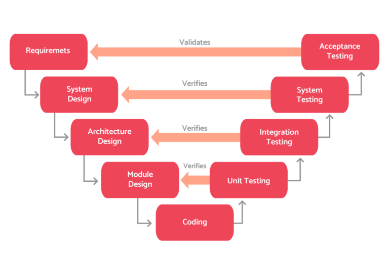

## Pruebas (En construcción)

Se pretente estudiar algunas técnicas de verificación y pruebas de programas, se comenzará por los principios básicos, ciclo de vida y niveles y tipos de pruebas, posteriormente profundizaremos en algunas técnicas de prueba más usadas para posteriormente mencionar algunas de las herramientas usadas para las pruebas.

### Introducción
Las pruebas de software son el proceso de evaluación de un sistema o aplicación para determinar si cumple con los requisitos especificados y funciona correctamente. El objetivo principal de las pruebas de software es garantizar la calidad del software y minimizar el riesgo de errores en el producto final.

#### Importancia de las pruebas de software

Las pruebas de software son una parte crucial del proceso de desarrollo de software, ya que ayudan a identificar problemas y errores en una etapa temprana. Esto permite a los desarrolladores corregir los errores antes de que el software se lance al mercado, lo que puede ahorrar tiempo, costos y reducir la frustración del usuario final.

Las pruebas de software son importantes porque permiten detectar errores y problemas que pueden tener un impacto significativo en la funcionalidad del software. Estos errores pueden incluir fallos de seguridad, problemas de rendimiento, problemas de usabilidad, errores de lógica y otros errores que pueden afectar la calidad del software y la satisfacción del usuario final.

#### Beneficios de realizar pruebas de software

Los beneficios de realizar pruebas de software incluyen:

- Identificación temprana de errores y problemas en el software.
- Mejora de la calidad del software y la satisfacción del usuario.
- Reducción de costos y tiempos de corrección de errores.
- Reducción del riesgo de errores en el software en producción.
- Mejora de la confianza en el software y la marca de la empresa.

En conclusión, las pruebas de software son una parte esencial del proceso de desarrollo de software que ayudan a garantizar la calidad del producto final y a reducir el riesgo de errores en producción.

### Verificación y prueba de programas

La ISTQB (International Software Testing Qualifications Board), una organización especializada en el campo de las pruebas y la industria del software define la verificación y pruebas de programas como:

> Proceso que consiste en todas las actividades del ciclo de vida del software, tanto estáticas como dinámicas, concernientes con la planificación, preparación y evaluación de productos software y los trabajos relacionados para determinar que éstos satisfacen los requisitos especificados, para demostrar que se ajustan al propósito y para detectar defectos.

#### Principios básicos

Los principios básicos que rigen el proceso de verificación y prueba de los programas son los siguientes:

- Las pruebas demuestran la presencia de defectos no la ausencia de ellos.
- Las pruebas exhaustivas no existen (salvo en casos triviales).
- Las pruebas tempranas ayudan a reducir costes.
- Agrupación de defectos: Normalmente, la mayor parte de los defectos detectados se concentran en un número reducido de módulos.
- Paradoja del pesticida (de Bruce Beizer): La eficacia en la detección de errores de las mismas pruebas disminuye con el paso del tiempo.
- Las pruebas dependen del contexto: Así por ejemplo, la forma de probar un software crítico de una central nuclear es diferente a  la página web de una frutería.
- La falacia de la ausencia de errores: La detección y corrección de defectos no servirá de nada si el sistema no es usable y no cumple con las expectativas de los usuarios.

#### El ciclo de vida

El ciclo de vida en el proceso de pruebas consta de las siguientes actividades principales:

1. Planificación y control: Se establecen los objetivos y el plan de pruebas y se controla el avance con respecto a lo planificado.
2. Análisis y diseño: los objetivos se transforman en casos de prueba tangibles
3. Implementación y ejecución: Se configuran, desarrollan y ejecutan las pruebas.
4. Evaluación de los criterios de salida: En este punto se evalúa los resultados de las pruebas respecto a los objetivos definidos y se decide sobre reproceso.
5. Actividades de cierre de pruebas: Aquí se realizan varias tareas finales, tales como analizar lecciones aprendidas, documentar la aceptación del sistema, etc.

#### Niveles

Según el ISTQB, el proceso de prueba se puede ejecutar en los siguientes niveles:

* Pruebas unitarias: Realizadas por el equipo de desarrollo, tienen como objeto comprobar el funcionamiento de un único componente.
* Pruebas de integración: Realizadas por el equipo de desarrollo, su objetivo principal es comprobar la interacción de diferentes partes de un sistema, validando la comunicación entre sus interfaces.
* Pruebas de sistema: Realizadas por el equipo de pruebas, buscan probar el sistema como un todo y si los componentes de un sistema son compatibles e  interactúan correctamente.
* Pruebas de aceptación de usuario: Realizadas por el usuario final, el objetivo de estas pruebas es validar la disposición de un sistema para su despliegue y uso.

Los niveles de las pruebas están estrechamente relacionados con las fases del ciclo de desarrollo del software, así en el modelo o método en V se establece dicha relación de forma explícita:

### Técnicas de verificación y prueba de programas

Las técnicas pueden ser de dos tipos dependiendo de si el código de la aplicación es ejecutado o no.

#### Técnicas dinámicas

Las pruebas dinámicas se clasifican, a su vez, en técnicas de pruebas de caja negra, en las que se desconoce el código fuente del componente y de caja blanca, en donde sí se conoce:

##### Pruebas de caja negra

En las que los casos se diseñan considerando las entradas y salidas sin conocer la estructura interna. Las pruebas funcionales y no funcionales y de regresión suelen utilizar esta técnica.

* Partición equivalente: La idea es dividir los valores válidos y no válidos para entradas y salidas en un número reducido de particiones de forma que, el comportamiento del software sea el mismo para cualquier valor contenido en una partición particular. Así se reduce el número de casos que hay que probar. Por ejemplo, para las notas de un alumno tendríamos 3 clases de equivalencia (particionando los número enteros)

| Clases             | Valores inferiores a los válidos | Valores válidos | Valores superiores a los válidos |
| ------------------ | --------------------------------- | ---------------- | --------------------------------- |
| V. representativos | -1                                | 1,10             | 11                                |

* Análisis de valores límites: Los casos de prueba que exploran las condiciones límites de un programa producen buenos resultados. Para el ejemplo anterior, los valores límites serían (-1,0, y 10,11).
* Pruebas de transición de estado: En este caso se considera el sistema como una máquina de estados, y se diseñan pruebas para cubrir secuencias típicas de estados, o cubrir todos los estados, transiciones o probar transiciones inválidas.**	**
* Pruebas de caso de uso: Consisten en ejecutar escenarios que describen el uso que los usuarios van a darle al software. Son de gran utilidad para diseñar las pruebas de aceptación con la participación del cliente.
* Pruebas según la experiencia: Consisten en la generación de casos de prueba a partir de la intuición y la experiencia.

##### Pruebas de caja blanca

Permiten examinar la estructura interna de un sistema, se centran en los detalles procedimentales, como las pruebas de software estructurales:

* Pruebas de camino básico: Consiste en hacer uso del grafo de flujo del código (nodos: bloques de código, y aristas: flujo de ejecución de esos bloques) y complejidad ciclomática que nos indica el número  de caminos independientes de ejecución y diseñar casos de prueba para verificar que todas las instrucciones del programa se ejecutan por lo menos una vez y los resultados son los esperados.
* Pruebas de coberturas de sentencias: La cobertura nos indica el porcentaje de sentencias en el código cubierto por un conjunto de pruebas (“test suite”)

Con esta técnica se pretende diseñar casos de prueba que aumenten la  cobertura.

#### Técnicas estáticas

Al contrario que las pruebas dinámicas, que exigen la ejecución de software, las técnicas de pruebas estáticas se basan en el examen manual (revisiones) y en el análisis automatizado (análisis estático) del código sin ejecutar el código. A este respecto, se pueden utilizar herramientas como SonarQube.

### Tipos de pruebas de software

1. Pruebas unitarias: Las pruebas unitarias son un tipo de prueba que se enfoca en evaluar el funcionamiento individual de cada unidad de código del software, como funciones o métodos. Las pruebas unitarias se realizan en un ambiente aislado del resto del software para evaluar el comportamiento de una unidad de código específica y detectar errores en su funcionamiento. 
EJEMPLO: En una aplicación de gestión de tareas, se realiza una prueba unitaria en el módulo de creación de tareas para verificar que se crean correctamente con la información proporcionada y que se pueden guardar en la base de datos. Se verifica que la creación de tareas genera una respuesta de éxito y que la tarea se encuentra en la base de datos.
2. Pruebas de integración: Las pruebas de integración son un tipo de prueba que se enfoa en evaluar cómo las diferentes unidades de código se integran y trabajan juntas como un todo. Este tipo de prueba se suele realizar después de las pruebas unitarias para detectar problemas en la interacción entre las diferentes unidades de código.  
EJEMPLO: En una aplicación de e-commerce, se realiza una prueba de integración para verificar que el módulo de pago interactúa correctamente con el módulo de compras. Se verifica que los datos de pago se envían correctamente a la pasarela de pago y que se actualiza el estado del pedido en la base de datos.
3. Pruebas de sistema: Las pruebas de sistema son un tipo de prueba que se enfoca en evaluar el funcionamiento del software como un sistema completo. Este tipo de prueba se realiza después de las pruebas de integración para evaluar la funcionalidad del software en un ambiente más realista.  
EJEMPLO: En una aplicación de chat en tiempo real, se realiza una prueba de sistema para verificar que el servicio de chat funciona correctamente con varios usuarios conectados al mismo tiempo. Se verifica que los mensajes se envían y reciben correctamente, y que se mantienen las conexiones entre los usuarios.
4. Pruebas de aceptación: Las pruebas de aceptación son un tipo de prueba que se enfoca en evaluar si el software cumple con los requisitos y las expectativas del usuario final. Estas pruebas suelen ser realizadas por el cliente o el usuario final para evaluar si el software cumple con los requisitos establecidos.  
EJEMPLO: En una aplicación de reserva de vuelos, se realiza una prueba de aceptación para verificar que se cumplen los requisitos del cliente. Se verifica que los usuarios pueden buscar vuelos disponibles, seleccionar asientos y reservar los vuelos seleccionados.
5. Pruebas de regresión: Las pruebas de regresión son un tipo de prueba que se enfoca en evaluar que el sistema sigue funcionando adecuadamente tras la realización de nuevos cambios. Estas pruebas se realizan para asegurarnos que las modificaciones realizadas en el software no han introducido errores en áreas que antes funcionaban correctamente. Normalmente suelen ser automatizadas y se ejecutan cada vez que se genera una nueva versión para asegurarnos que las modificaciones se integran sin causar problemas.   
EJEMPLO: En una aplicación de edición de imágenes, se realiza una prueba de regresión después de una actualización de software para verificar que las funcionalidades que funcionaban antes de la actualización siguen funcionando correctamente después. Se verifica que la edición de imágenes, la aplicación de efectos y la exportación de imágenes siguen funcionando sin errores.
6. Pruebas de carga: Las pruebas de carga son un tipo de prueba que se enfoca en evaluar el comportamiento del software en condiciones de alta demanda. Estas pruebas se realizan para evaluar la capacidad del software para manejar una gran cantidad de usuarios o procesos simultáneamente.  
EJEMPLO: En una aplicación web, simular un gran número de usuarios que acceden a esta de forma simultánea, y monitorizar cómo el software responde a esta carga. Se podrían medir aspectos como el tiempo de respuesta de la aplicación, el número de errores producidos y la tasa de transacciones completadas con éxito.
7. Pruebas de rendimiento: Las pruebas de rendimiento son un tipo de prueba que se enfoca en evaluar la velocidad, la estabilidad y la escalabilidad del software en diferentes situaciones y cargas de trabajo.  
EJEMPLO: En una aplicación de streaming de video, se realiza una prueba de rendimiento para verificar que la aplicación puede manejar la carga de usuarios concurrentes y ofrecer una experiencia de visualización sin interrupciones. Se miden tiempos de carga, calidad de imagen y velocidad de reproducción en diferentes resoluciones.
8. Pruebas de seguridad: Las pruebas de seguridad son un tipo de prueba que se enfoca en evaluar la capacidad del software para proteger los datos y el sistema contra posibles amenazas y ataques externos.  
EJEMPLO: En una aplicación de gestión de contraseñas, se realiza una prueba de seguridad para verificar que los datos de los usuarios están protegidos contra posibles amenazas externas. Se verifica la fortaleza de las contraseñas, la encriptación de los datos y la seguridad de los servidores de almacenamiento de contraseñas.

Como has podido observar, existen varios tipos de pruebas de software que se pueden realizar para evaluar diferentes aspectos de la funcionalidad y la calidad del software. Es importante elegir el tipo de prueba adecuado para cada situación y realizar pruebas continuas durante todo el proceso de desarrollo para garantizar la calidad del software.

### Plan de pruebas

Un plan de pruebas es un documento que describe cómo se realizarán las pruebas de software y cuáles serán los objetivos y las expectativas de estas pruebas. El plan de pruebas es esencial para garantizar que las pruebas se realicen de manera efectiva y se puedan evaluar los resultados.
La identificación de los objetivos de las pruebas nos permitirá acotar los puntos que forman el plan de pruebas. Por ejemplo, el objetivo puede ser identificar y corregir errores en el software, evaluar si el software cumple con los requisitos establecidos o evaluar la calidad y la funcionalidad del software, evaluar el rendimiento en horas de alta carga, etc.

A continuación, se describen los elementos más comunes de un plan de pruebas:

1. Definición del alcance de las pruebas

En este punto, se deben establecer los límites de las pruebas y definir cuáles son los componentes y funcionalidades del software que se van a probar. Es importante que esta definición sea lo suficientemente amplia como para cubrir todas las áreas críticas del software, pero también lo suficientemente específica como para asegurarse de que se están probando todas las funcionalidades de manera exhaustiva.

Se establece que el alcance de las pruebas para una aplicación web de comercio electrónico incluye el registro de usuarios, el proceso de compra, la gestión de la cuenta de usuario, la gestión de productos y la integración con pasarelas de pago.

2. Identificación de los recursos necesarios para las pruebas

Identificar los recursos necesarios para realizar las pruebas es otro de los aspectos importantes del plan de pruebas. Los recursos pueden incluir hardware, software, personal de pruebas y cualquier otro tipo de recurso que se necesite para ejecutar las pruebas de manera efectiva. Es importante identificar y asignar los recursos adecuados para garantizar que las pruebas se puedan realizar sin problemas.

Se identifica que se necesitan 2 equipos para ejecutar las pruebas, cada equipo con diferentes navegadores y sistemas operativos. También se necesitan datos de prueba para simular la interacción del usuario con la aplicación, y un servidor para alojar la aplicación y las herramientas de pruebas.

3. Selección de herramientas de pruebas

La selección de las herramientas de pruebas adecuadas es crucial para asegurar que las pruebas se realicen de manera efectiva. Las herramientas de pruebas pueden incluir software para la creación de casos de prueba, herramientas para la automatización de pruebas, herramientas para la gestión de defectos, entre otras. Es importante seleccionar las herramientas adecuadas para las necesidades específicas del proyecto.

Se seleccionan las herramientas Selenium y JMeter para realizar las pruebas funcionales y de rendimiento respectivamente, y MockK y Kotest para realizar pruebas unitarias, de integración y aceptación. Además, se decide utilizar Git como sistema de control de versiones para el código de la aplicación y los scripts de pruebas.

4. Diseño de casos de prueba

Los casos de prueba describen los pasos específicos que deben seguirse para evaluar el software y verificar si cumple con los requisitos establecidos. El diseño de casos de prueba debe ser exhaustivo para cubrir todas las áreas críticas del software y asegurar que todas las funcionalidades se prueben adecuadamente.

Se elaboran casos de prueba para verificar la funcionalidad de la aplicación en diferentes escenarios, tales como pruebas de navegación, formularios, funcionalidad de compra, validaciones de datos y seguridad.

Por ejemplo, para verificar la funcionalidad de una aplicación de gestión de tareas:

- Casos de prueba de creación de tareas:
  - Verificación de que se pueden crear tareas con éxito. 
  - Verificación de que se pueden asignar tareas a usuarios específicos. 
  - Verificación de que se pueden establecer fechas de vencimiento para las tareas. 
- Casos de prueba de edición de tareas:
  - Verificación de que se pueden editar tareas existentes. 
  - Verificación de que se pueden actualizar los datos de la tarea, como la fecha de vencimiento y la asignación de usuarios. 
- Casos de prueba de eliminación de tareas:
  - Verificación de que se pueden eliminar tareas con éxito. 
  - Verificación de que no se pueden eliminar tareas asignadas a otros usuarios.

5. Asignación de responsabilidades

La asignación de responsabilidades es crucial para garantizar que las pruebas se realicen de manera efectiva. En este punto, se deben definir los roles y responsabilidades de cada miembro del equipo de pruebas, así como los roles y responsabilidades de cualquier otro miembro del equipo que esté involucrado en el proceso de pruebas. Esto asegura que cada persona tenga claro lo que se espera de él o ella durante el proceso de pruebas.

Se asignan responsabilidades a los miembros del equipo de pruebas, por ejemplo, un tester será responsable de la ejecución de las pruebas de integración, otro tester será responsable de las pruebas de sistema, y un tercero será responsable de las pruebas de aceptación.

6. Cronograma de pruebas

El cronograma debe incluir la duración de cada fase de pruebas y los plazos de entrega para cada etapa. También debe tener en cuenta los plazos y recursos disponibles para el proyecto en su totalidad. El cronograma de pruebas ayuda a asegurar que las pruebas se realicen dentro de los plazos establecidos y que el proyecto se entregue en tiempo y forma.

Se establece un cronograma que indica cuándo se llevarán a cabo las diferentes pruebas y quién será responsable de su ejecución, y el proceso mediante el cual el equipo de desarrollo debe corregir las incidencias reportadas durante las pruebas, por ejemplo,  antes de que se inicie la siguiente fase de pruebas.

En ejemplo simple de cronograma:

- Semana 1:
    - Revisión y aprobación de casos de prueba por el desarrollador.
    - Configuración del entorno de prueba.
    - Ejecución de pruebas unitarias.
- Semana 2:
    - Ejecución de pruebas de interfaz de usuario.
    - Ejecución de pruebas de rendimiento.
- Semana 3:
    - Ejecución de pruebas de aceptación.
    - Documentación de los resultados de las pruebas.
- Semana 4:
    - Revisión de resultados de pruebas y toma de decisiones sobre la aprobación de la entrega.

En definitiva, un plan de pruebas es esencial para garantizar que las pruebas de software se realicen de manera efectiva y se puedan evaluar los resultados. Un plan de pruebas detallado debe incluir los objetivos de las pruebas, el alcance de las pruebas, el cronograma y los recursos, el plan de pruebas detallado, los roles y las responsabilidades y el proceso de seguimiento y documentación de errores.

### Pruebas de integración

a. Definición de pruebas de integración

Las pruebas de integración son un tipo de prueba de software que se enfoca en probar cómo diferentes componentes de software interactúan entre sí cuando se integran. Estas pruebas se realizan después de haber completado las pruebas unitarias y antes de realizar las pruebas del sistema. El objetivo de las pruebas de integración es detectar problemas de integración entre los diferentes componentes de software para garantizar que el sistema completo funcione correctamente.

b. Tipos de pruebas de integración

Existen diferentes tipos de pruebas de integración, que se pueden clasificar según el nivel de integración que se está probando:

- Pruebas de integración ascendente: se inician con las unidades de menor nivel (módulos o componentes) y se van integrando hacia arriba, hasta llegar al nivel de sistema completo.
- Pruebas de integración descendente: se inician con los módulos de más alto nivel y se van integrando hacia abajo, hasta llegar a las unidades de menor nivel.
- Pruebas de integración híbridas: combinan los dos enfoques anteriores, empezando por un grupo de módulos y luego continuando hacia arriba y hacia abajo simultáneamente.

Además, las pruebas de integración también se pueden clasificar según la estrategia que se utilice para realizarlas.

c. Estrategias para realizar pruebas de integración

Existen diferentes estrategias que se pueden utilizar para realizar pruebas de integración. Algunas de las más comunes son:

- Pruebas Big-Bang: en esta estrategia, se integran todos los componentes a la vez y se realizan pruebas para verificar que funcionen correctamente. Esta estrategia es rápida y sencilla de realizar, pero puede ser difícil detectar los problemas de integración si hay muchos componentes.
- Pruebas por módulos: esta estrategia consiste en integrar los componentes de software en módulos lógicos y realizar pruebas en cada uno de ellos. Luego, se integran los módulos y se realizan pruebas en el sistema completo.
- Pruebas de fachada: esta estrategia consiste en crear fachadas (interfaces) para los componentes que aún no se han desarrollado y realizar pruebas con estas interfaces, para simular el comportamiento de los componentes reales que aún no están disponibles.
- Pruebas de stub y driver: esta estrategia consiste en utilizar stubs (programas que simulan la funcionalidad de los componentes faltantes) y drivers (programas que simulan la entrada y salida de los componentes faltantes) para realizar pruebas en los componentes que aún no están disponibles.

Un ejemplo en de prueba de integración ascendente en la que se sigue una estrategia por modulos:

Supongamos que estamos desarrollando un sistema de compras en línea que consta de tres módulos: el módulo de autenticación de usuarios, el módulo de gestión de carritos de compras y el módulo de procesamiento de pagos. Cada uno de estos módulos ha sido desarrollado por un equipo diferente de desarrolladores.

Para realizar pruebas de integración ascendente, comenzamos con el módulo más bajo en la jerarquía y vamos subiendo gradualmente. En este caso, comenzaríamos con el módulo de autenticación de usuarios.

1. Se desarrollan y prueban los componentes individuales del módulo de autenticación de usuarios, como la validación de la dirección de correo electrónico y la contraseña del usuario.
2. Luego, se integran los componentes individuales del módulo y se prueban los flujos de trabajo completos, como el registro de nuevos usuarios y la autenticación de usuarios existentes.
3. Una vez que se ha probado el módulo de autenticación de usuarios por completo, se procede a integrar el módulo de gestión de carritos de compras.
4. Se siguen los mismos pasos que con el módulo de autenticación de usuarios: se prueban los componentes individuales del módulo, luego se integran y se prueban los flujos de trabajo completos.
5. Finalmente, se integra el módulo de procesamiento de pagos y se prueban los flujos de trabajo completos, desde la selección de productos hasta la finalización del pago.

De esta manera, se van integrando gradualmente los distintos módulos del sistema y se prueban los flujos de trabajo completos, asegurando que no hay conflictos o errores en la interacción entre los distintos componentes. Este proceso se denomina "ascendente" ya que se comienza con los módulos más bajos en la jerarquía y se va avanzando hacia arriba.

En resumen, las pruebas de integración son un tipo de prueba de software que se enfoca en probar la integración de los diferentes componentes del software. Para realizarlas, se pueden utilizar diferentes estrategias, como pruebas Big-Bang, por módulos, de fachada y de stub y driver. El objetivo es detectar problemas stubde integración para garantizar que el sistema completo funcione correctamente.

### Pruebas de sistema

a. Definición de pruebas de sistema

Las pruebas de sistema son una etapa importante del proceso de prueba de software en la que se evalúa el sistema completo para asegurarse de que cumple con los requisitos y especificaciones definidos. Estas pruebas se realizan después de las pruebas de integración y antes de las pruebas de aceptación.

b. Tipos de pruebas de sistema

Los tipos de pruebas de sistema que se pueden realizar son los siguientes:

1. Pruebas de funcionalidad: se asegura que todas las funciones del sistema estén funcionando correctamente.
2. Pruebas de rendimiento: se verifica que el sistema cumpla con los requisitos de rendimiento definidos, como la velocidad de respuesta, el tiempo de carga, etc.
3. Pruebas de carga: se comprueba la capacidad del sistema para manejar grandes volúmenes de datos o usuarios simultáneos.
4. Pruebas de seguridad: se evalúa la seguridad del sistema y se verifica que cumple con los requisitos de seguridad definidos.
5. Pruebas de compatibilidad: se verifica la capacidad del sistema para trabajar con diferentes entornos de hardware, software y configuraciones de red.
6. Pruebas de usabilidad: se evalúa la facilidad de uso y la experiencia del usuario.

c. Estrategias para realizar pruebas de sistema   

Las estrategias comunes para realizar pruebas de sistema son:

1. Pruebas de casos de uso: se prueban los casos de uso definidos y se verifica que el sistema funcione según lo previsto en cada caso.
2. Pruebas de escenarios: se prueban los diferentes escenarios de uso del sistema, incluyendo los casos de uso complejos y poco comunes.
3. Pruebas de extremo a extremo: se prueban las funcionalidades del sistema desde el inicio hasta el final, incluyendo todas las interacciones entre los diferentes módulos y componentes del sistema.
4. Pruebas de seguridad: se realizan diferentes tipos de pruebas de seguridad, como pruebas de penetración, pruebas de vulnerabilidad, etc., para evaluar la seguridad del sistema.
5. Pruebas de compatibilidad: se realizan pruebas en diferentes entornos de hardware y software para verificar la compatibilidad del sistema.
6. Pruebas de estrés: se prueban las capacidades del sistema en situaciones de alta carga o bajo condiciones extremas para verificar su capacidad para manejar tales situaciones.

En resumen, las pruebas de sistema son críticas para garantizar que el sistema cumpla con los requisitos y especificaciones definidos antes de que sea entregado al cliente. Para ello, se deben definir diferentes tipos de pruebas y estrategias apropiadas para realizarlas de manera efectiva.

### Pruebas de aceptación

Definición de pruebas de aceptación
Tipos de pruebas de aceptación
Estrategias para realizar pruebas de aceptación

### Documentación de incidencias

Definición de incidencias
Proceso de documentación de incidencias
Clasificación de incidencias
Ejemplos de herramientas de seguimiento de incidencias

### Conclusiones

Resumen de los puntos más importantes
Importancia de la colaboración entre desarrolladores y testers
La importancia de la mejora continua en el proceso de pruebas de software