## 3.2 Diagrama de Clases en UML

### 1. Introducción

El **diagrama de clases** es uno de los diagramas incluidos en UML 2.5 clasificado dentro de los **diagramas de estructura** y, como tal, se utiliza para representar los elementos que componen un sistema de información desde un punto de vista **estático**.

> 📌 **Punto clave**: Este diagrama NO incluye la forma en que se comportan los elementos a lo largo de la ejecución. Esa función la cumplen los diagramas de comportamiento (diagrama de secuencia, casos de uso, etc.).

#### 1.1. Características principales

- **Orientado a objetos**: Define las clases que se utilizarán en la fase de construcción
- **Vista estática**: Muestra la estructura, no el comportamiento dinámico
- **Modelo lógico**: Similar al diagrama Entidad-Relación (E/R) en bases de datos
- **Fundamental**: Es uno de los diagramas más importantes y utilizados en UML

#### 1.2. ¿Qué describe el diagrama de clases?

El diagrama de clases describe:

- Los tipos de objetos que hay en el sistema
- Las diversas clases de relaciones estáticas que existen entre ellos
- Los atributos y operaciones (métodos) de una clase
- Las restricciones según la forma en que se conecten los objetos

#### 1.3. Comparación con otros modelos

El diagrama de clases se puede equiparar, salvando las distancias, al famoso **diagrama de modelo Entidad-Relación (E/R)** (no recogido en UML). Ambos diagramas:

- Muestran el modelo lógico de los datos de un sistema
- Representan datos y su interacción
- Tienen una utilidad similar en sus respectivos contextos

#### 1.4. Objetivo según la fase

Los diagramas de clases pueden ser desarrollados en diferentes fases del ciclo de vida del software:

- **Durante el análisis del sistema**: El diagrama se desarrolla buscando una solución ideal
- **Durante el diseño**: Se usa el mismo diagrama y se modifica para satisfacer los detalles de las implementaciones

### 2. Elementos del Diagrama de Clases

El diagrama UML de clases está formado por tres elementos principales:

1. **Clases**
2. **Relaciones**
3. **Interfaces**

#### 2.1. Clases

Las **clases** son el elemento principal del diagrama y representan una clase dentro del paradigma de la orientación a objetos.

##### 2.1.1. ¿Qué representa una clase?

Una clase describe un conjunto de objetos con un rol o roles equivalentes en un sistema. Representa:

- Conceptos o entidades del «negocio»
- Define un grupo de objetos que comparten características, condiciones y significado
- Ejemplo: Animal, Persona, Mensaje, Expediente, Usuario, Producto...

##### 2.1.2. Objetos y clases

Un **objeto** es:

- La pieza básica de la POO (Programación Orientada a Objetos)
- Representa un objeto del mundo real, por ejemplo: un automóvil, un estudiante, una cuenta bancaria
- Cada objeto es especializado y solo se encarga de su tarea
- Pueden ser entidades físicas y conceptuales
- Se comunican con otros objetos pasándose mensajes

Los objetos y su división en clases a menudo derivan de:

1. **Cosas tangibles o "del mundo real"**: Avión, auto, televisor, computador, etc.
2. **Roles o Papeles**: Gerente, cliente, vendedor, profesor, etc.
3. **Organizaciones**: Universidad, empresa, departamento, etc.
4. **Interacciones**: Transacción, matrícula, contrato, etc.
5. **Eventos o incidencias**: Vuelo, accidente, suceso, etc.

> **Nota**: Estas categorías se solapan, y las dos primeras son fuentes de objetos y de clases mucho más comunes que las dos últimas.

### 3. Estructura de una Clase

Una clase está compuesta por **tres elementos**:

1. **Nombre de la clase**
2. **Atributos**
3. **Métodos/Funciones**

#### 3.1. Representación gráfica

La clase se representa con una **caja dividida en tres zonas** mediante líneas horizontales:


```
┌─────────────────────────┐
│    Nombre de Clase      │  ← 1ª zona: Nombre
├─────────────────────────┤
│    Atributos            │  ← 2ª zona: Atributos
├─────────────────────────┤
│    Métodos              │  ← 3ª zona: Métodos
└─────────────────────────┘
```

#### 3.2. Zona 1: Nombre de la Clase

La primera zona contiene el **nombre de la clase**, y se escribe siguiendo estas reglas:

- Se escribe en la primera zona de la caja
- **Clases abstractas**: El nombre se escribe en *cursiva*
- Convenio: Primera letra en mayúscula (PascalCase)

#### 3.3. Zona 2: Atributos

En la segunda zona se escriben los **atributos** de la clase, uno por línea. 

##### 3.3.1. Formato de atributos

* **Formato oficial:**

    ```
    visibilidad nombre_atributo : tipo = valor-inicial { propiedades }
    ```

* **Formato simplificado (común):**

    ```
    nombre_atributo : tipo
    ```

    o incluso solo:

    ```
    nombre_atributo
    ```

**Ejemplo**:
```
- nombre : String
- edad : Int = 0
- activo : Boolean
```

##### 3.3.2. Tipos de Atributos

**Atributos de clase**

Son aquellos que representan valores comunes a todas las instancias de una clase. Pueden tener un valor inicial.

**Ejemplos en Kotlin:**
```kotlin
companion object {
    private var promedioEdades: Double = 0.0
    private var numeroAlumnos: Int = 0
}
```

**Atributos de instancia**

Son aquellos que representan valores propios de un solo objeto que lo diferencia de otros elementos de su misma clase.

**Ejemplos en Kotlin:**
```kotlin
private var nombre: String = ""
private var numeroPuertas: Int = 4
```

**Constantes**

Representan valores inmutables en tiempo y espacio. En Kotlin se definen con `const val` o `val`.

**Ejemplos en Kotlin:**
```kotlin
const val MAX: Int = 20

companion object {
    const val PI: Double = 3.1415
}
```

> **Convención**: El nombre de las constantes debe escribirse totalmente en mayúsculas.

#### 3.4. Zona 3: Métodos

En la tercera zona se escriben los **métodos** o funciones de la clase, también uno por línea.

##### 3.4.1. Formato de métodos

* **Formato oficial:**

    ```
    visibilidad nombre_funcion(parametros) : tipo-devuelto { propiedades }
    ```

* **Formato simplificado (común):**

    ```
    nombre_funcion(parametros) : tipo-devuelto
    ```

**Ejemplo**:
```
+ getNombre() : String
+ setEdad(edad: Int) : Unit
+ calcularDescuento(precio: Double) : Double
```

##### 3.4.2. Tipos de Métodos

**Métodos de clase**

Son acciones que no requieren de un objeto específico para su realización. Los métodos de clase solo tienen acceso a los atributos de clase.

**Ejemplo en Kotlin:**
```kotlin
companion object {
    fun sumar(x: Int, y: Int): Int {
        return x + y
    }
}
```

**Métodos de instancia**

Son acciones que requieren de un objeto específico. Los métodos de instancia tienen acceso a todos los miembros de la clase.

**Ejemplo en Kotlin:**
```kotlin
fun getNombre(): String {
    return nombre
}
```

#### 3.5. Visibilidad

Tanto los atributos como los métodos incluyen un símbolo que indica su **visibilidad**:

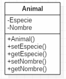

| Símbolo  | Visibilidad   | Descripción                                                  |
|----------|---------------|--------------------------------------------------------------|
| `+`      | **Pública**   | Se puede acceder desde cualquier lugar de la aplicación      |
| `-`      | **Privada**   | Solo accesible desde la misma clase                          |
| `#`      | **Protegida** | Accesible desde la misma clase o clases derivadas (herencia) |
| `~`      | **Paquete**   | Accesible desde clases del mismo paquete (menos común)       |
| `/`      | **Derivado**  | Atributo calculado a partir de otros (menos común)           |

> **Nota**: Los tres primeros (`+`, `-`, `#`) son los más comunes y universales.

#### 3.6. Miembros Estáticos

Los **atributos o métodos estáticos** se representan **subrayando** su nombre.

**Definición**: Una característica estática es **compartida por toda la clase** y **no se instancia para cada objeto**.

**Ejemplo**:
```
┌──────────────────────────────────────┐
│            Contador                  │
├──────────────────────────────────────┤
│ - <u>numeroInstancias : Int</u>      │  ← Estático (subrayado)
│ - id : Int                           │  ← No estático
├──────────────────────────────────────┤
│ + <u>getNumeroInstancias() : Int</u> │  ← Estático (subrayado)
│ + getId() : Int                      │  ← No estático
└──────────────────────────────────────┘
```

En Kotlin:
```kotlin
class Contador {
    private val id: Int = ++numeroInstancias
    
    companion object {
        private var numeroInstancias: Int = 0
        
        fun getNumeroInstancias(): Int = numeroInstancias
    }
}
```

#### 3.7. Ejemplo Completo de Clase

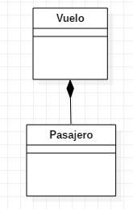

**Ejemplo: Clase Producto**

```
┌──────────────────────────────────────┐
│            Producto                  │
├──────────────────────────────────────┤
│ - idProducto : Int                   │
│ - nombre : String                    │
│ - precio : Double                    │
│ - stock : Int                        │
├──────────────────────────────────────┤
│ + Producto(nombre, precio)           │
│ + getNombre() : String               │
│ + setPrecio(precio: Double) : Unit   │
│ + hayStock() : Boolean               │
│ + calcularDescuento(porcentaje: Double) : Double │
└──────────────────────────────────────┘
```

**Ejemplo: Clase Libro**


```
┌────────────────────────────────────────┐
│                 Libro                  │
├────────────────────────────────────────┤
│ - autor : String                       │
│ - titulo : String                      │
│ - cantidadLibros : Int                 │
├────────────────────────────────────────┤
│ + Libro()                              │
│ + Libro(autor: String, titulo: String) │
│ + setAutor(autor: String) : Unit       │
│ + getAutor() : String                  │
│ + setTitulo(titulo: String) : Unit     │
│ + getTitulo() : String                 │
│ + getNumeroEjemplares() : Int          │
│ + toString() : String                  │
└────────────────────────────────────────┘
```

**Implementación en Kotlin:**

```kotlin
class Libro {
    private var autor: String
    private var titulo: String
    
    companion object {
        private var cantidadLibros: Int = 0
        
        fun getCantidadLibros(): Int = cantidadLibros
    }
    
    constructor() : this("NA", "NT")
    
    constructor(autor: String, titulo: String) {
        this.autor = autor
        this.titulo = titulo
        cantidadLibros++
    }
    
    fun setAutor(autor: String) {
        this.autor = autor
    }
    
    fun getAutor(): String = autor
    
    fun setTitulo(titulo: String) {
        this.titulo = titulo
    }
    
    fun getTitulo(): String = titulo
    
    override fun toString(): String {
        return "Datos de libro: $titulo\n$autor"
    }
}
```

### 4. Relaciones entre Clases

Una **relación** identifica una **dependencia** entre clases. Puede ser:

- Entre dos o más clases (más común)
- De una clase hacia sí misma - **dependencia reflexiva** (menos común)

Las relaciones se representan con **líneas** que unen las clases. El tipo de línea varía según el tipo de relación.


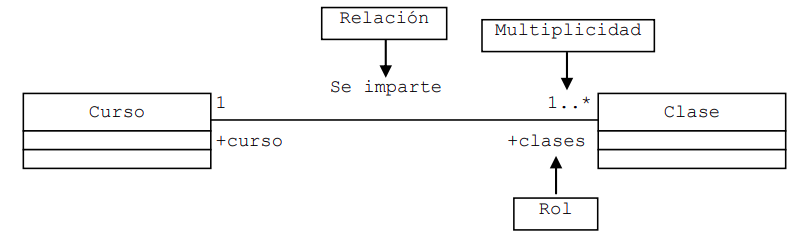

#### 4.1. Propiedades de las Relaciones

Cada relación puede tener las siguientes propiedades:

##### 4.1.1. Multiplicidad (Cardinalidad)

Indica el **número de elementos** de una clase que participan en una relación.


| Notación     | Significado                       |
|--------------|-----------------------------------|
| `1`          | Exactamente uno (uno y solo uno)  |
| `0..1`       | Cero o uno                        |
| `*` o `0..*` | Cero o muchos (muchos)            |
| `1..*`       | Uno o muchos (al menos uno)       |
| `n`          | Exactamente n (número específico) |
| `m..n`       | Desde m hasta n                   |

##### 4.1.2. Nombre de la Asociación

Se puede escribir una indicación que ayuda a entender la relación. Suelen utilizarse **verbos**.

**Ejemplo**: "Una empresa **contrata** a n empleados"

##### 4.1.3. Rol

Indica el papel que juega cada clase en la relación. Es decir, describe la semántica que tiene la relación en el sentido indicado.

**Ejemplo de notación:**

```
┌─────────┐   Se imparte   ┌─────────┐
│  Curso  │1 ───────────→ *│  Clase  │
└─────────┘+curso   +clases└─────────┘
```

En el ejemplo anterior:

* El rol de la clase `Curso` es `curso`, y el rol de la clase `Clase` es `clases`. 
* La multiplicidad indica que un `curso` puede impartir muchas `clases`, pero cada `clase` pertenece a un solo `curso`.

### 5. Tipos de Relaciones

#### 5.1. Asociación

**Definición**: Representa una dependencia semántica. Es el tipo de relación más común y general.

**Representación**: Línea continua simple que une las clases.

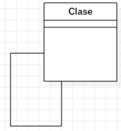

##### 5.1.1. Asociación Binaria

Una asociación binaria conecta dos clases. Se representa con una línea sólida entre las dos clases.

**Ejemplo**: "Una mascota pertenece a una persona"

```
┌──────────┐           ┌──────────┐
│ Persona  │1 ────── * │ Mascota  │
└──────────┘           └──────────┘
    tiene
```

**En Kotlin**:

```kotlin
class Persona(val nombre: String) {
    private val mascotas: MutableList<Mascota> = mutableListOf()
    
    fun agregarMascota(mascota: Mascota) {
        mascotas.add(mascota)
    }
}

class Mascota(val nombre: String, val dueno: Persona)
```

**Otro ejemplo**: "Una matrícula consta de cursos"

```
┌────────────┐  Consta De   ┌─────────┐
│ Matricula  │1 ─────────→ *│  Curso  │
└────────────┘              └─────────┘
  -matricula                  -cursos
```

**Implementación en Kotlin:**

```kotlin
class Matricula(n: Int) {
    private val cursos: Array<Curso?> = arrayOfNulls(n)
    
    // ... resto de métodos
}

class Curso(private val matricula: Matricula) {
    // ... resto de métodos
}
```

##### 5.1.2. Asociación Reflexiva

Una clase se relaciona consigo misma.

**Diagrama:**

```
┌──────────────┐
│  Trabajador  │
└──────────────┘
  ↑           ↓
  │           │ Supervisor De
  │           │
-jefe 0..1  0..* -subordinado
```

**Implementación en Kotlin:**

```kotlin
class Trabajador(
    private val jefe: Trabajador?,
    n: Int
) {
    private val subordinados: Array<Trabajador?> = arrayOfNulls(n)
    
    // ... resto de métodos
}
```

##### 5.1.3. Asociación N-aria

Involucra más de dos clases.

**Diagrama:**

```
┌──────────┐  Contenido En    ┌──────────────┐
│ Articulo │1 ─────────────→ *│ OrdenCompra  │
└──────────┘                  └──────────────┘
  -articulo                     -ordenC
                                   │
                                ┌──┴────┐
                                │ItemOC │
                                └───────┘
```

**Implementación en Kotlin:**

```kotlin
class Articulo {
    // ... atributos y métodos
}

class OrdenCompra {
    private val items: Array<ItemOC?> = arrayOfNulls(100)
    
    inner class ItemOC(private val articulo: Articulo) {
        // ... métodos de ItemOC
    }
}
```

#### 5.2. Agregación

**Definición**: Representa una relación jerárquica donde un objeto es parte de otro, pero **puede existir independientemente**.

**Representación**: Línea con un **rombo vacío** en la clase contenedora.

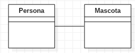

**Ejemplo 1**: "Las mesas están formadas por tablas de madera y tornillos"

```
┌──────────┐         ┌──────────┐
│   Mesa   │◇──────  │ Tornillo │
└──────────┘         └──────────┘
   contiene
```

> **Nota**: El tornillo puede formar parte de más objetos (silla, estantería...), por lo que tiene existencia independiente.

**Ejemplo 2**: "Un automóvil es accesorio de una radio"

```
┌───────────┐  Es Accesorio De    ┌────────┐
│ Automovil │◇──────────────────→ │ Radio  │
└───────────┘                     └────────┘
  -automovil 1     0..1 -radio
```

**En Kotlin**:

```kotlin
class Mesa {
    private val tornillos: List<Tornillo> = listOf()
}

class Tornillo(val tipo: String) {
    // Puede existir sin estar en una mesa
}

// Otro ejemplo
class Automovil(private val radio: Radio?) {
    // ... resto de métodos
}

class Radio {
    // ... atributos y métodos
}
```

> **Nota**: En la agregación, la radio puede existir independientemente del automóvil.

#### 5.3. Composición

**Definición**: Representa una relación jerárquica donde las partes **NO pueden existir sin el todo**. Es una forma más fuerte de agregación.

**Representación**: Línea con un **rombo relleno** en la clase contenedora.

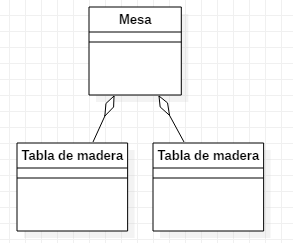

**Ejemplo**: "Un automóvil está compuesto por un motor"

```
┌────────────┐       ┌────────┐
│ Automovil  │♦────  │ Motor  │
└────────────┘       └────────┘
   contiene
```

> **Nota**: El motor es parte integral del automóvil. Si se destruye el automóvil, el motor también deja de existir en este contexto.

**En Kotlin**:

```kotlin
class Automovil {
    private val motor: Motor = Motor()  // Creado dentro
    
    inner class Motor {
        // Motor como clase interna
        // No puede existir sin el Automovil
    }
}
```

**Diferencia clave entre Agregación y Composición**:

| Agregación                                    | Composición                                    |
|-----------------------------------------------|------------------------------------------------|
| ◇ Rombo vacío                                 | ♦ Rombo relleno                                |
| Las partes pueden existir independientemente  | Las partes NO existen sin el todo              |
| Relación débil                                | Relación fuerte                                |
| Ejemplo: Mesa-Tornillo, Automóvil-Radio       | Ejemplo: Automóvil-Motor                       |

#### 5.4. Herencia (Generalización/Especialización)

**Definición**: Representa una relación de tipo "es un". La clase hija hereda características de la clase padre.

**Representación**: Línea con un **triángulo vacío** apuntando a la superclase.

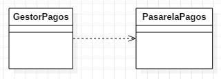

**Ejemplo**: "Un perro es un animal"

```
       ┌──────────┐
       │  Animal  │
       └──────────┘
            △
            │
       ┌────┴────┐
       │  Perro  │
       └─────────┘
```

**Otro ejemplo**: "Un libro es una publicación"

```
         ┌──────────────┐
         │ Publicacion  │
         └──────────────┘
                △
                │ Generalización
                │
         ┌──────┴──────┐
         │    Libro    │
         └─────────────┘
       Especialización
```

**En Kotlin**:

```kotlin
open class Animal(val nombre: String) {
    open fun hacerSonido() {
        println("Sonido de animal")
    }
}

class Perro(nombre: String) : Animal(nombre) {
    override fun hacerSonido() {
        println("Guau!")
    }
}

// Otro ejemplo
open class Publicacion {
    // ... atributos y métodos base
}

class Libro : Publicacion() {
    // ... atributos y métodos específicos
    
    init {
        // Llama al constructor de la superclase
    }
}
```

> **Principio**: La subclase hereda todos los atributos y métodos de la superclase.

#### 5.5. Dependencia

**Definición**: Indica que una clase **usa** temporalmente otra clase. Es la relación más débil.

**Representación**: Línea **discontinua con flecha**.


**Ejemplo**: "Una clase usa un servicio externo"

```
┌─────────────┐       ┌──────────────┐
│  Calculadora│- - - →│  Math        │
└─────────────┘       └──────────────┘
      usa

┌───────────┐       ┌────────────────────────────┐
│ Potencia  │- - - →│         Math               │
└───────────┘       ├────────────────────────────┤
                    │ pow(a:Double, b:Double)    │
                    └────────────────────────────┘
```

**En Kotlin**:

```kotlin
import kotlin.math.pow

class Calculadora {
    fun calcularPotencia(base: Double, exponente: Double): Double {
        return base.pow(exponente)  // Usa Math temporalmente
    }
}

// Otro ejemplo
class Potencia {
    companion object {
        @JvmStatic
        fun main(args: Array<String>) {
            val x = 5.0
            val y = 2.0
            val z = x.pow(y)
            println("El cuadrado de 5 es: $z")
        }
    }
}
```

**Características**:

- No mantiene una referencia permanente
- Uso temporal o puntual
- Puede ser por parámetro, variable local, etc.

> **Nota**: La dependencia es más débil que otras relaciones. La clase simplemente usa la funcionalidad de otra, pero no mantiene una referencia permanente.

#### 5.6. Implementación (Realización)

**Definición**: Representa que una clase **implementa** una interfaz o clase abstracta.

**Representación**: Línea **discontinua con triángulo vacío**.

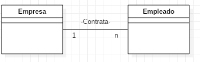

**Ejemplo**: "Una clase implementa una interfaz"

```
       ┌───────────────┐
       │<<interface>>  │
       │  IVolador     │
       └───────────────┘
            △
            ┆
       ┌────┴────┐
       │  Avion  │
       └─────────┘
```

**En Kotlin**:
```kotlin
interface IVolador {
    fun volar()
    fun aterrizar()
}

class Avion : IVolador {
    override fun volar() {
        println("El avión está volando")
    }
    
    override fun aterrizar() {
        println("El avión está aterrizando")
    }
}
```

#### 5.7. Resumen de Relaciones

| Relación           | Símbolo  | Fuerza       | Descripción                            | Ejemplo                 |
|--------------------|----------|--------------|----------------------------------------|-------------------------|
| **Dependencia**    | `- - →`  | Muy débil    | Uso temporal                           | Calculadora - Math      |
| **Asociación**     | `───`    | Débil        | Relación general                       | Persona - Mascota       |
| **Agregación**     | `◇───`   | Media        | "Tiene un" (independiente)             | Mesa - Tornillo         |
| **Composición**    | `♦───`   | Fuerte       | "Es parte de" (dependiente)            | Coche - Motor           |
| **Herencia**       | `───▷`   | Muy fuerte   | "Es un"                                | Perro - Animal          |
| **Implementación** | `- - ▷`  | Muy fuerte   | Implementa interfaz                    | Avion - IVolador        |

### 6. Ejemplos Completos de Diagramas de Clases

#### 6.1. Sistema de Tienda Online

A continuación, un ejemplo detallado de las clases con sus atributos para un sistema de **tienda online**:

##### 6.1.1. Clase Usuario

```kotlin
class Usuario(
    val idUsuario: Int,
    var nombre: String,
    var correoElectronico: String,
    private var contraseña: String,
    var direccion: String,
    var metodoDePago: String
) {
    fun validarCredenciales(pass: String): Boolean {
        return contraseña == pass
    }
}
```

**Atributos**:

- `idUsuario`: Identificador único del usuario
- `nombre`: Nombre completo del usuario
- `correoElectronico`: Dirección de correo electrónico
- `contraseña`: Contraseña del usuario (privada)
- `direccion`: Dirección de envío
- `metodoDePago`: Método de pago preferido

##### 6.1.2. Clase Producto

```kotlin
class Producto(
    val idProducto: Int,
    var nombre: String,
    var descripcion: String,
    var precio: Double,
    var stock: Int
) {
    fun hayStock(): Boolean {
        return stock > 0
    }
    
    fun reducirStock(cantidad: Int) {
        if (cantidad <= stock) {
            stock -= cantidad
        }
    }
}
```

**Atributos**:

- `idProducto`: Identificador único del producto
- `nombre`: Nombre del producto
- `descripcion`: Descripción detallada
- `precio`: Precio del producto
- `stock`: Cantidad disponible en inventario

##### 6.1.3. Clase Carrito de Compras

```kotlin
class CarritoCompras(
    val idCarrito: Int,
    val usuario: Usuario
) {
    private val productos: MutableList<ProductoCarrito> = mutableListOf()
    var subtotal: Double = 0.0
        private set
    var impuestos: Double = 0.0
        private set
    
    fun agregarProducto(producto: Producto, cantidad: Int) {
        productos.add(ProductoCarrito(producto, cantidad))
        calcularSubtotal()
    }
    
    private fun calcularSubtotal() {
        subtotal = productos.sumOf { it.producto.precio * it.cantidad }
        impuestos = subtotal * 0.21  // IVA del 21%
    }
    
    fun getTotal(): Double = subtotal + impuestos
}

data class ProductoCarrito(val producto: Producto, val cantidad: Int)
```

**Atributos**:

- `idCarrito`: Identificador único del carrito
- `productos`: Lista de productos añadidos
- `subtotal`: Monto total antes de impuestos
- `impuestos`: Monto total de impuestos

##### 6.1.4. Clase Orden de Compra

```kotlin
class OrdenCompra(
    val idOrden: Int,
    val usuario: Usuario,
    productos: List<ProductoCarrito>
) {
    private val productos: List<ProductoCarrito> = productos.toList()
    var subtotal: Double = 0.0
        private set
    var impuestos: Double = 0.0
        private set
    var envio: Double = 0.0
    var total: Double = 0.0
        private set
    
    init {
        calcularTotales()
    }
    
    private fun calcularTotales() {
        subtotal = productos.sumOf { it.producto.precio * it.cantidad }
        impuestos = subtotal * 0.21
        total = subtotal + impuestos + envio
    }
}
```

**Atributos**:

- `idOrden`: Identificador único de la orden
- `productos`: Lista de productos comprados
- `subtotal`: Monto antes de impuestos y envío
- `impuestos`: Monto de impuestos
- `envio`: Costo de envío
- `total`: Monto total final

##### 6.1.5. Clase Categoría

```kotlin
class Categoria(
    val idCategoria: Int,
    var nombre: String
) {
    private val productos: MutableList<Producto> = mutableListOf()
    
    fun agregarProducto(producto: Producto) {
        productos.add(producto)
    }
    
    fun getProductos(): List<Producto> = productos.toList()
}
```

**Atributos**:

- `idCategoria`: Identificador único de la categoría
- `nombre`: Nombre de la categoría

##### 6.1.6. Clase Comentarios

```kotlin
class Comentario(
    val idComentario: Int,
    val producto: Producto,
    val usuario: Usuario,
    var comentario: String,
    val fecha: Date
) {
    var calificacion: Int = 0
        set(value) {
            field = if (value in 1..5) value else 0
        }
}
```

**Atributos**:

- `idComentario`: Identificador único del comentario
- `producto`: Referencia al producto
- `usuario`: Usuario que escribió el comentario
- `comentario`: Contenido del comentario
- `fecha`: Fecha de creación
- `calificacion`: Puntuación del 1 al 5

##### 6.1.7. Diagrama de Clases Simplificado

```
┌─────────────┐       ┌──────────────┐       ┌────────────────┐
│   Usuario   │1────* │CarritoCompras│1────* │ProductoCarrito │
└─────────────┘       └──────────────┘       └────────────────┘
       │1                                              │*
       │                                               │
       │1                                              │
┌─────────────┐                              ┌────────────────┐
│OrdenCompra  │*────────────────────────────*│   Producto     │
└─────────────┘                              └────────────────┘
                                                      │*
                                                      │
                                                      │*
                                              ┌────────────────┐
                                              │   Categoria    │
                                              └────────────────┘
```

#### 6.2. Otros Ejemplos de Sistemas

##### 6.2.1. Clínica Veterinaria

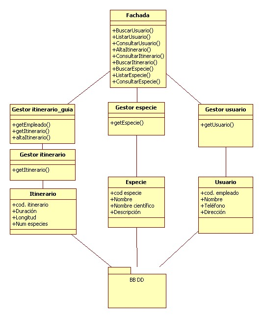

**Clases principales**:

- Cliente
- Mascota
- Veterinario
- Cita
- Tratamiento

##### 6.2.2. Zoológico

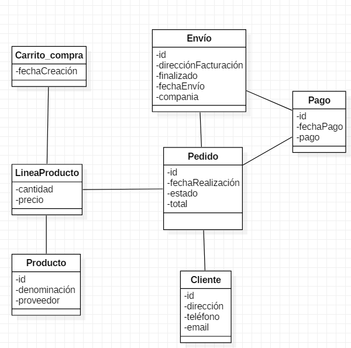

**Clases principales**:

- Animal
- Hábitat
- Cuidador
- Visitante
- Recinto

##### 6.2.3. Tienda


**Clases principales**:

- Producto
- Cliente
- Pedido
- Categoría
- Pago

##### 6.2.4. Gestión de Biblioteca


**Clases principales**:

- Libro
- Usuario
- Préstamo
- Autor
- Editorial

##### 6.2.5. Centro Educativo

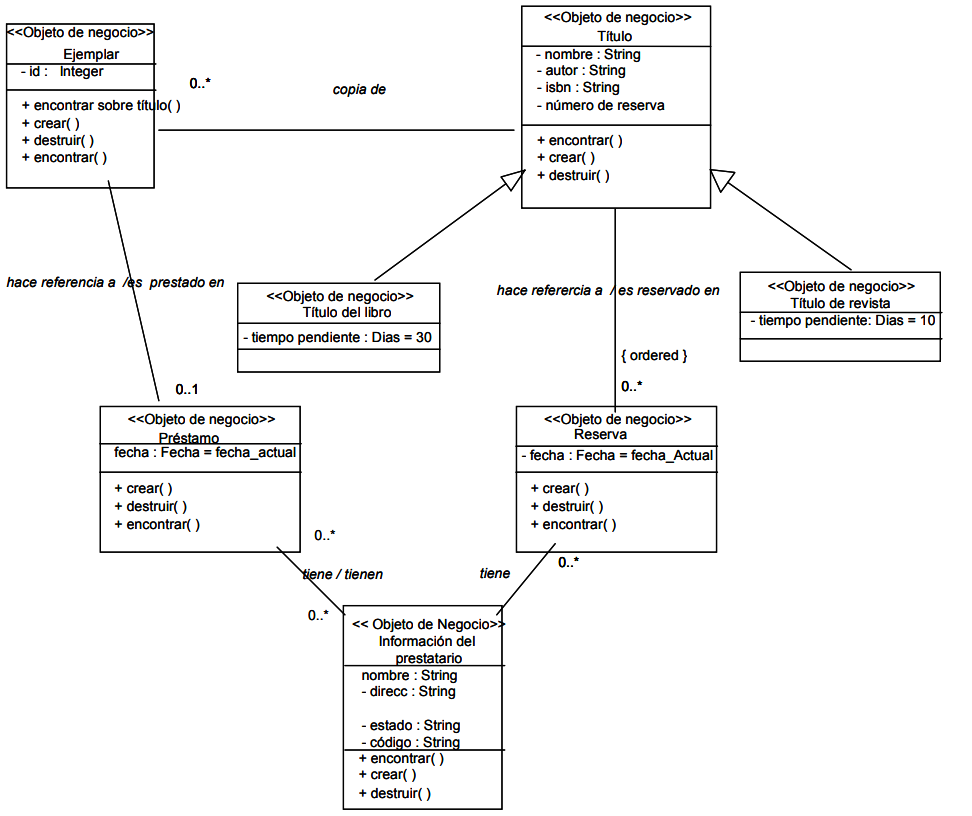

**Clases principales**:

- Estudiante
- Profesor
- Curso
- Matrícula
- Calificación

### 7. Mejores Prácticas en Diagramas de Clases

Para crear diagramas de clases efectivos, es importante seguir ciertas recomendaciones:

#### 7.1. División de Diagramas

**Recomendado**: Dividir diagramas grandes en otros más pequeños que se puedan vincular.

**Evitar**: Crear diagramas gigantes e incoherentes.

**Razón**: Los diagramas tienden a volverse incoherentes a medida que crecen.

#### 7.2. Niveles de Detalle

Lo ideal en cuanto a los niveles de detalle es:

- **Vista de alto nivel**: Usar notación simple de clases
- **Vista detallada**: Crear diagramas separados según necesidad
- **Vinculación**: Los diagramas detallados pueden vincularse a los de alto nivel

#### 7.3. Claridad Visual

**Hacer**:

- Evitar que las líneas se crucen (en la medida de lo posible)
- Usar colores para agrupar módulos comunes
- Mantener una distribución ordenada

**Evitar**:

- Líneas que se superponen excesivamente
- Diagramas abarrotados
- Mezclar demasiados conceptos en un solo diagrama

#### 7.4. Uso de Color

Usar **diferentes colores** para diferentes grupos de clases:

- 🔵 **Azul**: Clases de modelo/dominio
- 🟢 **Verde**: Clases de servicios
- 🟡 **Amarillo**: Clases de utilidades
- 🔴 **Rojo**: Clases de excepciones

Esto ayuda al lector a diferenciar entre los diversos grupos.

### 8. Herramientas para Crear Diagramas de Clases

Existen diversas herramientas para crear diagramas de clases UML, tanto online como de escritorio. El uso de estas herramientas facilita la creación, edición y mantenimiento de los diagramas, pero a la vez también es posible dibujarlos a manos, siendo algo mas rápido para bocetos iniciales.

Existen otras herramientas declarativas que permiten generar diagramas de clases a partir del código fuente, lo que puede ser útil para documentación automática y que al final nos ahorra tiempo. Una de ellas es PlantUML, que permite crear diagramas a partir de un lenguaje de texto sencillo.

#### 8.1. Herramientas Online

- **Draw.io** (diagrams.net): Gratuito, sin registro
- **Lucidchart**: Versión gratuita limitada
- **Creately**: Plantillas predefinidas
- **PlantUML Online**: Diagramas mediante texto

#### 8.2. Herramientas de Escritorio

- **Visual Paradigm**: Profesional, versión community gratuita
- **StarUML**: Open source
- **Enterprise Architect**: Profesional de pago
- **Umbrello**: Para Linux, open source

#### 8.3. Integradas en IDEs

- **IntelliJ IDEA**: Plugin de diagramas UML
- **Eclipse**: Papyrus UML
- **Visual Studio**: Class Designer
- **NetBeans**: UML plugin

#### 8.4. Generación desde Código

- **PlantUML**: Genera diagramas desde texto
- **Mermaid**: Diagramas en markdown
- **IntelliJ IDEA**: Genera diagramas desde código Kotlin/Java

### 9. Puntos Clave para Recordar

Los siguientes puntos son esenciales para trabajar con diagramas de clases:

**Sobre la notación**:    

- Una clase se representa con una caja de tres compartimentos
- Los atributos llevan visibilidad (+, -, #) y tipo
- Los métodos especifican parámetros y tipo de retorno
- Los miembros estáticos se subrayan
- Las clases abstractas se escriben en *cursiva*

**Sobre las relaciones**:    

- Asociación (`───`): Relación general
- Agregación (`◇───`): Partes independientes
- Composición (`♦───`): Partes dependientes
- Herencia (`───▷`): Relación "es un"
- Dependencia (`- - →`): Uso temporal
- Implementación (`- - ▷`): Realiza interfaz

**Sobre multiplicidad**:

- `1`: Exactamente uno
- `0..1`: Opcional
- `*`: Cero o muchos
- `1..*`: Al menos uno

**Mejores prácticas**:

- Dividir diagramas grandes en módulos
- Evitar cruzar líneas innecesariamente
- Usar colores para agrupar conceptos
- Mantener consistencia en la notación

### 10. Conclusiones

- El diagrama de clases es **fundamental** en el diseño orientado a objetos
- Representa la **estructura estática** del sistema
- Es el diagrama más utilizado en el desarrollo de software
- Permite visualizar clases, atributos, métodos y relaciones
- Facilita la **comunicación** entre analistas, desarrolladores y clientes
- Sirve como **documentación** del sistema
- Es la base para la **implementación** del código
- Dominar la notación UML es esencial para cualquier desarrollador

### 11. Recursos y Referencias

- [Sitio oficial UML - OMG](https://www.uml.org/)
- [Diagramas UML](https://diagramasuml.com/)
- [PlantUML](https://plantuml.com/)
- [Draw.io](https://app.diagrams.net/)
- [Kotlin Programming Language](https://kotlinlang.org/)
