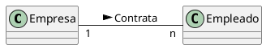
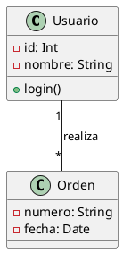
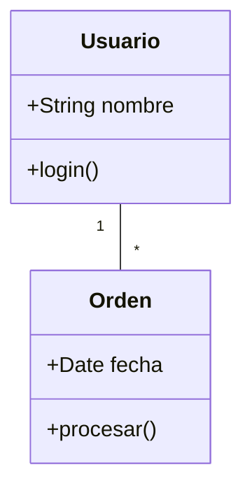

## 3.2 Diagrama de Clases en UML

### 1. Introducción

El **diagrama de clases** es uno de los diagramas incluidos en UML 2.5 clasificado dentro de los **diagramas de estructura** y, como tal, se utiliza para representar los elementos que componen un sistema de información desde un punto de vista **estático**.

!!! note "Punto clave"
    Este diagrama NO incluye la forma en que se comportan los elementos a lo largo de la ejecución. Esa función la cumplen los diagramas de comportamiento (diagrama de secuencia, casos de uso, etc.).

#### 1.1. Aspectos principales

Los aspectos principales del diagrama de clases son:

- **Orientado a objetos**: Define las clases que se utilizarán en la fase de construcción
- **Vista estática**: Muestra la estructura, no el comportamiento dinámico
- **Modelo lógico**: Similar al diagrama Entidad-Relación (E/R) en bases de datos
- **Fundamental**: Es uno de los diagramas más importantes y utilizados en UML

#### 1.2. ¿Qué describe el diagrama de clases?

El diagrama de clases describe:

- Los tipos de objetos (clases) que hay en el sistema
- Las diversas tipos de relaciones estáticas que existen entre las clases
- Los atributos y operaciones (métodos, funciones) de una clase
- Las restricciones según la forma en que se conecten los objetos

#### 1.3. Comparación con otros modelos

El diagrama de clases se puede equiparar, salvando las distancias, al famoso **diagrama de modelo Entidad-Relación (E/R)** (no recogido en UML). Ambos diagramas:

- Muestran el modelo lógico de los datos de un sistema
- Representan datos y su interacción
- Tienen una utilidad similar en sus respectivos contextos

!!! note "Punto clave"
    Este diagrama de clases es similiar al diagrama E/R, por tanto ten presente lo que ya sabes sobre el para entender mejor los diagramas de clases.

#### 1.4. Objetivo de estos diagrams según la fase

Los diagramas de clases pueden ser desarrollados en diferentes fases del ciclo de vida del software:

- **Durante el análisis del sistema**: El diagrama se desarrolla buscando el modelado del dominio del problema en el mundo real, para entender los requisitos y posteriormente diseñar la solución técnica
- **Durante el diseño**: Se usa el mismo diagrama, pero se modifica para satisfacer los detalles de las implementaciones, tecnologías y restricciones del sistema

### 2. Elementos del Diagrama de Clases

El diagrama UML de clases está formado por tres elementos principales que trabajan conjuntamente para representar la estructura de un sistema orientado a objetos:

1. **Clases**: Representan los objetos y conceptos del mundo real que existirán en nuestro sistema. Son los "actores" principales.

2. **Relaciones**: Representan las asociaciones y dependencias entre las clases, mostrando cómo se interrelacionan e interactúan. Sin las relaciones, las clases estarían aisladas y no formarían un sistema coherente.

3. **Interfaces**: Representan contratos que las clases pueden implementar, definiendo un conjunto de métodos sin implementación. Las interfaces establecen expectativas sobre qué debe hacer una clase, sin especificar cómo debe hacerlo.

Cada uno de estos elementos será examinado en detalle a lo largo de esta unidad. La comprensión profunda de cada uno es fundamental para crear diagramas de clases efectivos.

### 3. Clases

Las **clases** son el elemento principal del diagrama y representan una clase dentro del paradigma de la orientación a objetos.

#### 3.1 ¿Qué representa una clase?

Una clase describe un conjunto de objetos con responsabilidades y características comunes dentro de un sistema. En el dominio del «negocio» puede representar conceptos como Paciente, Doctor, Cita o Expediente Médico. A la vez, agrupa objetos que comparten atributos y comportamientos; por ejemplo, todos los objetos de la clase Coche comparten propiedades y operaciones comunes.

En un sistema software, una clase:

- Es la pieza básica de la POO.
- Representa objetos del mundo real o conceptos del dominio (p.ej., automóvil, estudiante, cuenta bancaria).
- Define atributos y comportamientos comunes a sus instancias.
- Favorece objetos especializados con responsabilidad única y comunicación mediante mensajes.

Los objetos y su clasificación en clases suelen derivar de:

1. **Cosas tangibles o "del mundo real"**: Avión, auto, televisor, computador, etc.
2. **Roles o Papeles**: Gerente, cliente, vendedor, profesor, etc.
3. **Organizaciones**: Universidad, empresa, departamento, etc.
4. **Interacciones**: Transacción, matrícula, contrato, etc.
5. **Eventos o incidencias**: Vuelo, accidente, suceso, etc.

!!! note "Nota"
    Estas categorías se solapan, y las dos primeras son fuentes de objetos y de clases mucho más comunes que las últimas.

#### 3.2. ¿Como se representa?

Una clase está compuesta por **tres elementos**:

1. **Nombre de la clase**: Identificador único de la clase, que representa el concepto o entidad que modela.
2. **Atributos**: Características o propiedades que describen el estado de los objetos de la clase. 
3. **Métodos/Funciones**: Comportamientos o acciones que los objetos de la clase pueden realizar.

La clase se representa con una **caja dividida en tres zonas** mediante líneas horizontales, y cada elemento dentro de una zona:

<figure markdown="span">
  
  <figcaption>Estructura de una clase simple</figcaption>
</figure>

```
┌─────────────────────────┐
│    Nombre de Clase      │  ← 1ª zona: Nombre
├─────────────────────────┤
│    Atributos            │  ← 2ª zona: Atributos
├─────────────────────────┤
│    Métodos              │  ← 3ª zona: Métodos
└─────────────────────────┘
```

Esta clase se representa en kotlin de la siguiente manera:

```kotlin   
class NombreDeClase {
    // Atributos
    private var atributo1: Tipo
    private var atributo2: Tipo

    // Métodos
    fun metodo1(parametros): TipoDevuelto {
        // Implementación
    }

    fun metodo2(parametros): TipoDevuelto {
        // Implementación
    }
}
``` 


##### 3.2.1. Zona 1: Nombre de la Clase

La primera zona contiene el **nombre de la clase**, que es el identificador único y fundamental de la clase. El nombre debe ser representativo de lo que la clase modela en el dominio del problema.

**Reglas para escribir nombres de clases**:

- Se escribe en la primera zona de la caja
- **Clases abstractas**: El nombre se escribe en *cursiva* para indicar que no pueden instanciarse directamente
- Convenio: Primera letra en mayúscula (**PascalCase**)

    - Correcto: `Usuario`, `CarritoCompras`, `OrdenDePago`
    - Incorrecto: `usuario`, `CarritoCompra` (inconsistencia), `user` (en inglés)

- Los nombres deben ser **sustantivos singulares**, no verbos ni formas plurales

    - Correcto: `Libro`
    - Incorrecto: `Libros` (plural), `CrearLibro` (verbo)

!!! note "Punto clave"
    **Por qué PascalCase**: Esta convención de nombres ayuda a diferenciar visualmente los nombres de clases del resto del código, mejorando la legibilidad de los diagramas.

##### 3.2.2. Zona 2: Atributos

En la segunda zona se escriben los **atributos** de la clase, uno por línea. Los atributos representan el **estado** de un objeto, es decir, la información que el objeto "recuerda" en todo momento. Por ejemplo, un objeto `Cliente` tiene atributos como `nombre`, `email` y `fechaRegistro` que lo caracterizan.

El formato completo de un atributo es:

* **Formato oficial:**

    ```
    visibilidad nombre_atributo : tipo = valor-inicial { propiedades }
    ```

    Donde:

    - `visibilidad`: Indica quién puede acceder al atributo (+, -, #, ~, /)
    - `nombre_atributo`: Nombre descriptivo del atributo en camelCase
    - `tipo`: Tipo de dato (String, Int, Double, Date, etc.)
    - `valor-inicial`: (Opcional) Valor con el que se inicializa el atributo
    - `{propiedades}`: (Opcional) Propiedades adicionales como `{readOnly}` o `{unique}`

* **Formato simplificado (común en diagramas):**

    ```
    nombre_atributo : tipo
    ```

    o incluso solo:

    ```
    nombre_atributo
    ```

**Ejemplos prácticos**:

```
- nombre : String
- edad : Int = 0
- activo : Boolean
- fechaRegistro : Date
# coordenadas : List<Double>
+ ID : Int {unique}
```

En el ejemplo anterior:

- `nombre` es privado y de tipo String
- `edad` es privado, Int, e inicializa a 0
- `coordenadas` es protegida (accesible por subclases)
- `ID` es público y debe ser único

###### 3.2.2.1 Tipos de Atributos

Existen varios tipos de atributos según su naturaleza y función dentro de la clase:

**Atributos de clase o estáticos**

Son aquellos que representan valores comunes a todas las instancias (Objetos) de una clase. Todos los objetos comparten el mismo valor para este atributo, por tanto cualquier cambio en un atributo de clase afecta a todas las instancias.

**Ejemplos en Kotlin:** Se representan dentro del bloque `companion object`
```kotlin
companion object {
    private var promedioEdades: Double = 0.0
    private var numeroAlumnos: Int = 0
}
```

**Atributos de instancia**

Son aquellos que representan valores propios de un solo objeto que lo diferencia de otros elementos de su misma clase.

**Ejemplos en Kotlin:**
```kotlin
private var nombre: String = ""
private var numeroPuertas: Int = 4
```

**Constantes**

Representan valores inmutables en tiempo y espacio. En Kotlin se definen con `const val` o `val`, la diferencia es que `const val` es una constante de tiempo de compilación (constante real), mientras que `val` es inmutable pero puede ser asignada en tiempo de ejecución.

**Ejemplos en Kotlin:**
```kotlin
const val MAX: Int = 20

companion object {
    const val PI: Double = 3.1415
}
```

!!! tip "Convención"
    El nombre de las constantes debe escribirse totalmente en mayúsculas.

##### 3.2.3. Zona 3: Métodos

En la tercera zona se escriben los **métodos** o funciones de la clase, también uno por línea. Los métodos representan el **comportamiento** o **responsabilidades** de la clase, es decir, las acciones que un objeto puede realizar.

El formato completo de un método es:

* **Formato oficial:**

    ```
    visibilidad nombre_funcion(parametros) : tipo-devuelto { propiedades }
    ```

    Donde:

    - `visibilidad`: Indica quién puede llamar al método (+, -, #, ~, /)
    - `nombre_funcion`: Nombre del método en camelCase, típicamente un verbo o frase con verbo
    - `parametros`: Lista de parámetros formales con sus tipos (nombre: Tipo)
    - `tipo-devuelto`: Tipo de dato que devuelve el método (o Unit si no devuelve nada)
    - `{propiedades}`: (Opcional) Propiedades como `{abstract}` o `{final}`

* **Formato simplificado (común en diagramas):**

    ```
    nombre_funcion(parametros) : tipo-devuelto
    ```

**Ejemplos prácticos**:

```
+ getNombre() : String
+ setEdad(edad: Int) : Unit
+ calcularDescuento(precio: Double, porcentaje: Double) : Double
# validarEmail(email: String) : Boolean
- procesarDatos() : void
+ esMayorDeEdad(edad: Int) : Boolean
```

En los ejemplos anteriores:

- `getNombre()` es público, no toma parámetros y devuelve String
- `setEdad()` es público, toma un Int y no devuelve nada (Unit)
- `calcularDescuento()` toma dos Doubles y devuelve un Double
- `validarEmail()` es protegida, toma String y devuelve Boolean
- `procesarDatos()` es privada y no devuelve nada

**Convenciones de nomenclatura para métodos**:

- Getters (obtener valores): `getNombreAtributo()`
- Setters (establecer valores): `setNombreAtributo(valor)`
- Validación: `validar...()`, `es...()`, `tiene...()`, `puede...()`
- Acciones: `crear...()`, `actualizar...()`, `eliminar...()`, `procesar...()`

!!! note "Punto clave"
    Veremos que en kotlin, los getters y setters se generan automáticamente al definir propiedades, y por tanto no es necesario definirlos explícitamente. En java sí es necesario definirlos.


###### 3.2.3.1 Tipos de Métodos

**Métodos de clase o estáticos**

Son acciones que **no requieren de un objeto** específico para su realización. Los métodos de clase solo tienen acceso a los atributos de clase.

**Ejemplo en Kotlin:**
```kotlin
companion object {
    fun sumar(x: Int, y: Int): Int {
        return x + y
    }
}
```

**Métodos de instancia**

Son acciones que requieren de un objeto específico. Los métodos de instancia tienen acceso a todos los miembros de la clase ya sean estáticos o de instancia.

**Ejemplo en Kotlin:**
```kotlin
fun getNombre(): String {
    return nombre
}
```

#### 3.3. Visibilidad

Tanto los atributos como los métodos incluyen un símbolo que indica su **visibilidad**:

<figure markdown="span">
  
  <figcaption>Símbolos de visibilidad en UML</figcaption>
</figure>

| Símbolo  | Visibilidad   | Descripción                                                  |
|----------|---------------|--------------------------------------------------------------|
| `+`      | **Pública**   | Se puede acceder desde cualquier lugar de la aplicación      |
| `-`      | **Privada**   | Solo accesible desde la misma clase                          |
| `#`      | **Protegida** | Accesible desde la misma clase o clases derivadas (herencia) |
| `~`      | **Paquete**   | Accesible desde clases del mismo paquete (menos común)       |
| `/`      | **Derivado**  | Atributo calculado a partir de otros (menos común)           |

!!! note "Nota"
    Los tres primeros (`+`, `-`, `#`) son los más comunes y universales.

#### 3.4. Miembros Estáticos

Los **atributos o métodos estáticos** se representan **subrayando** su nombre.

**Definición**: Una característica estática (o de clase) **pertecece a la clase** y **no se instancia para cada objeto**. Todos los objetos estarían accediendo al mismo miembro estático.


[](https://editor.plantuml.com/uml/fPCzRiCm38LtduAZZI8Ny9GYNGi4AD2TbHI7W4qQafmbo64wTkuHVB5IZTlAgOC6g0P1F-3to4Tf7IBwE7HjOLeC0JPYzWwE1S0TTEWDGWrFqHCty3DMAq0zUncY00ku4CVNI4QWxCK3iJBP45PdYbZNoWBcPefYZhhHkvFoUWbaIFXPMkJeSd1Ep716kbwB92kGo2r2gjLLS-x0PD4-q2Jx7-vKTuWU_KPuHytWCULSLZCVbDkDRr7ifG7IknGmlZDODpSqozXyeVrM_1OfbBrEtmf9wo1aPpfNHQRKJqN1egvwQlOHP7T-47Nz-HPK_dwfOuLZ2odiIl15otBCpOmbEnNqkE3VNwXVlcMS1SXQL-c3V000)

En Kotlin:
```kotlin
class Coche(val marca: String, val modelo: String) {

    // Método no estático que muestra la configuración del coche (acceso a propiedades de instancia y estáticas)
    fun mostrarConfiguracion(): String {
        return "Coche: $marca $modelo, Volante: ${posicionVolante}, Unidad de distancia: ${unidadDistancia}"
    }

    companion object {
        // Atributos estáticos, compartidos por toda la clase
        var posicionVolante: String = "Izquierda"
        var unidadDistancia: String = "Kilómetros"

        // Método estático que configura la clase según el país
        fun configurarPorPais(pais: String) {
            when (pais.lowercase()) {
                "españa" -> {
                    posicionVolante = "Izquierda"
                    unidadDistancia = "Kilómetros"
                }
                "eeuu", "estados unidos" -> {
                    posicionVolante = "Derecha"
                    unidadDistancia = "Millas"
                }
                "japón" -> {
                    posicionVolante = "Derecha"
                    unidadDistancia = "Kilómetros"
                }
                else -> {
                    posicionVolante = "Izquierda"
                    unidadDistancia = "Kilómetros"
                }
            }
        }
    }
}
```

#### 3.5. Ejemplo Completo de Clase


[](https://editor.plantuml.com/uml/ZPDDJiCm44RtFSNiQ0HSeAiYXDW0GYeNCFPG6JcUo9wmgNgOBbbm0RQv66FdfsdQecPd9VFylfd9Ch8AN9TkffsA4PxiUo3Op01kGTLC0HQmuc3z6ewUAtWDL5aqoe11i5vONbkrw2eDEd29bsbikNPq7dUUnirFBjtp1BYHrsprLiXQURPIbjsZt60zJu0OkTd9vqBJDNfMmCJAfOjSMwK3AaCneQ_RBioBuyY3wps9NwXrobdbh1yeXr5rxa6VzgQBtv-BAKEJXqg5PbSYYqxcHEIx13b45HBmYwmv8RL2PamkxG0oPDr3YdycEOOyde28oLlsdqzZd7GPctJ3wrqwp4KoOvSzPXXyvhtK9GPw-CIoSYfWpEHs_YFES_FDP6XO0mdWczzKETs3xCdKkbtSivv_kBSboNYLw2iMy7QsH6_Id_O7){.center}


El diagrama anterior incluye:

- Atributos privados de instancia: `autor` y `titulo`.
- Atributo estático privado: `cantidadLibros` (contador global).
- Constructores para crear objetos.
- Getters y setters para manejar las propiedades de instancia (aunque en Kotlin no suelen ser necesarios).
- Método estático para obtener el número total de libros.
- Método `toString()` para representar el objeto.

El método y atributo estático pertenecen a la clase, no a instancias. En plantUML se marcan con `{static}` para diferenciar al nivel de diagrama.

La traducción a Kotlin se realiza de la siguiente manera:

```kotlin
class Libro {
    // Propiedades privadas de instancia
    private var autor: String
    private var titulo: String

    companion object {
        // Contador estático, compartido por todas las instancias
        private var cantidadLibros: Int = 0

        // Método estático para obtener número total de instancias creadas
        fun getNumeroEjemplares(): Int = cantidadLibros
    }

    // Constructor por defecto (llama al secundario con valores por defecto)
    constructor() : this("NA", "NT")

    // Constructor que inicializa propiedades e incrementa el contador global
    constructor(autor: String, titulo: String) {
        this.autor = autor
        this.titulo = titulo
        cantidadLibros++
    }

    // Getters y setters explícitos (para fines didácticos, aunque se recomienda usar propiedades)
    fun setAutor(autor: String) { this.autor = autor }
    fun getAutor(): String = autor

    fun setTitulo(titulo: String) { this.titulo = titulo }
    fun getTitulo(): String = titulo

    // Método para mostrar información del libro
    override fun toString(): String = "Datos de libro: $titulo\n$autor"
}
```

Como comentamos ya, en Kotlin, los getters y setters explícitos no son necesarios porque el lenguaje genera acceso automáticamente para las propiedades `var`.

Aquí se incluyen para facilitar la transición desde lenguajes que requieren métodos explícitos y para que resulte mas sencillo entender mejor el encapsulamiento y control de acceso.

La distinción clara entre miembros estáticos (`companion object`) y miembros de instancia se mantiene y queda reflejada tanto en UML como en el código Kotlin.


<!-- FIN DEL COMENTARIO. ESPOSIBLE QUE SE PUEDA BORRAR
<figure markdown="span">
  
  <figcaption>Ejemplo de clase completa con todos sus elementos</figcaption>
</figure>

**Ejemplo: Clase Producto**

```
┌──────────────────────────────────────┐
│            Producto                  │
├──────────────────────────────────────┤
│ - idProducto : Int                   │
│ - nombre : String                    │
│ - precio : Double                    │
│ - stock : Int                        │
├──────────────────────────────────────┤
│ + Producto(nombre, precio)           │
│ + getNombre() : String               │
│ + setPrecio(precio: Double) : Unit   │
│ + hayStock() : Boolean               │
│ + calcularDescuento(porcentaje: Double) : Double │
└──────────────────────────────────────┘
```

**Ejemplo: Clase Libro**

<figure markdown="span">
  
  <figcaption>Diagrama de clase Libro con atributos y métodos</figcaption>
</figure>

```
┌────────────────────────────────────────┐
│                 Libro                  │
├────────────────────────────────────────┤
│ - autor : String                       │
│ - titulo : String                      │
│ - cantidadLibros : Int                 │
├────────────────────────────────────────┤
│ + Libro()                              │
│ + Libro(autor: String, titulo: String) │
│ + setAutor(autor: String) : Unit       │
│ + getAutor() : String                  │
│ + setTitulo(titulo: String) : Unit     │
│ + getTitulo() : String                 │
│ + getNumeroEjemplares() : Int          │
│ + toString() : String                  │
└────────────────────────────────────────┘
```

**Implementación en Kotlin:**

```kotlin
class Libro {
    private var autor: String
    private var titulo: String
    
    companion object {
        private var cantidadLibros: Int = 0
        
        fun getCantidadLibros(): Int = cantidadLibros
    }
    
    constructor() : this("NA", "NT")
    
    constructor(autor: String, titulo: String) {
        this.autor = autor
        this.titulo = titulo
        cantidadLibros++
    }
    
    fun setAutor(autor: String) {
        this.autor = autor
    }
    
    fun getAutor(): String = autor
    
    fun setTitulo(titulo: String) {
        this.titulo = titulo
    }
    
    fun getTitulo(): String = titulo
    
    override fun toString(): String {
        return "Datos de libro: $titulo\n$autor"
    }
}
```
FIN DEL COMENTARIO -->

### 4. Interfaces: Contratos de comportamiento

Una **interfaz** es un concepto fundamental en la programación orientada a objetos que define un **contrato** que las clases pueden (o deben) implementar. No es una clase concreta con implementación, sino una especificación de qué debe hacer una clase sin especificar cómo lo hace.

#### 4.1. ¿Qué es una interfaz y por qué es importante?

**Definición**: Una interfaz define un conjunto de métodos (operaciones) que una clase debe implementar, sin proporcionar la implementación de estos métodos. Es como un contrato que dice "si implementas esta interfaz, te comprometes a proporcionar estos comportamientos".

**¿Por qué son importantes las interfaces?**

1. **Polimorfismo**: Permiten tratar objetos de diferentes clases de forma uniforme si implementan la misma interfaz
2. **Desacoplamiento**: Reducen la dependencia entre componentes del sistema
3. **Extensibilidad**: Facilitan agregar nuevas funcionalidades sin modificar código existente
4. **Contratos claros**: Documentan qué comportamiento se espera

**Analogía del mundo real**:

Imagina que tienes un enchufe eléctrico (interfaz). El enchufe especifica: "cualquier dispositivo que quiera conectarse debe tener estas características: 2 pines, voltaje X, etc.". No le importa si es una lámpara, un televisor o una computadora (clases concretas), simplemente especifica el contrato que deben cumplir.

#### 4.2. Representación de una Interfaz en UML

Una interfaz se representa con una caja similar a una clase, pero con dos diferencias clave:

1. Se añade el estereotipo `<<interface>>` encima del nombre
2. No tiene atributos (solo métodos)


!!! note "Nota"
    En kotlin, las interfaces pueden tener tanto código como atributos. Sin embargo, en UML se representan sin atributos para mantener la claridad del contrato. Aunque puede tener alguna anotación adicional si es necesario que indique información adicional

**Cuando usar interfaces**: Las interfaces son ideales cuando quieres definir un comportamiento común que puede ser compartido por clases no relacionadas en la jerarquía de herencia.

**Representación básica**:

```
┌─────────────────────────┐
│     <<interface>>       │
│    NombreInterfaz       │
├─────────────────────────┤
│    + metodo1()          │
│    + metodo2()          │
└─────────────────────────┘
```

**Ejemplo real**:

```
┌─────────────────────────┐
│     <<interface>>       │
│       IVolador          │
├─────────────────────────┤
│ + volar() : Unit        │
│ + aterrizar() : Unit    │
│ + getAltitud() : Double │
└─────────────────────────┘
```

#### 4.3. Ejemplo práctico: Sistema de pagos

Imagina un sistema de comercio electrónico que acepta múltiples formas de pago. En vez de que cada clase dependa de implementaciones específicas, definimos una interfaz:

**Interfaz IProcesadorPago**: Cuyo objetivo es definir los métodos que cualquier procesador de pagos debe implementar.

La representación UML la que se muestra a continuación. Durante la explicación de las relaciones entre clases volveremos a hablar y explicar el detalle la relación de implementación entre interfaces y clases.

**En el diagrama de clases**:

```
        ┌───────────────────────┐
        │    <<interface>>      │
        │   IProcesadorPago     │
        ├───────────────────────┤
        │ + procesarPago()      │
        │ + reembolsar()        │
        │ + verificarFondos()   │
        └───────────────────────┘
                    △
                    ┆
        ┌───────────┴───────────┐
        ┆                       ┆
┌───────┴───────┐     ┌─────────┴─────────┐
│ProcesadorTarj │     │ ProcesadorPayPal  │
│     eta       │     │                   │
└───────────────┘     └───────────────────┘
```

La representación en plantUML:

[](https://editor.plantuml.com/uml/pLBBJiD03BplL_XO1EG3LWXLW2fnYrJu07VZLaQxwyZhHEBrxpGX0XfUrnvtTcpFsBCiXcfTYivnDj8j1eBRMYLGmKQqnft0imCuXVOT7A55acpYuKQwJQGJ3rSYaJ2FH2LA6ubxwf-qdfIt751NaXiflt9VdGiHIu5FLNUe3sGu2Zk7t2LIcJ0FQrFEk_4dzFsNzr5PgF6nnZWve8GSZqlfceljPGtponG09OpyX7ejgLLSj1zU_3mnPp3lVv_PXkRpQ5syLDKFX_N0gOsKA1l-LpDjyg3aG7rLNNwBj8Uke7DBoiqG_ZS0).{center}


**En Kotlin**:

```kotlin
interface IProcesadorPago {
    fun procesarPago(monto: Double): Boolean
    fun reembolsar(monto: Double): Boolean
    fun verificarFondos(monto: Double): Boolean
}
```

**Implementaciones concretas**:

```kotlin
// Implementación para tarjeta de crédito
class ProcesadorTarjeta : IProcesadorPago {
    private var numeroTarjeta: String = ""
    private var cvv: String = ""
    
    override fun procesarPago(monto: Double): Boolean {
        // Lógica específica para tarjeta de crédito
        println("Procesando pago de $$monto con tarjeta $numeroTarjeta")
        return true
    }
    
    override fun reembolsar(monto: Double): Boolean {
        println("Reembolsando $$monto a tarjeta $numeroTarjeta")
        return true
    }
    
    override fun verificarFondos(monto: Double): Boolean {
        // Verificar con banco
        return true
    }
}

// Implementación para PayPal
class ProcesadorPayPal : IProcesadorPago {
    private var email: String = ""
    
    override fun procesarPago(monto: Double): Boolean {
        // Lógica específica para PayPal
        println("Procesando pago de $$monto con PayPal ($email)")
        return true
    }
    
    override fun reembolsar(monto: Double): Boolean {
        println("Reembolsando $$monto a PayPal ($email)")
        return true
    }
    
    override fun verificarFondos(monto: Double): Boolean {
        // Verificar con PayPal
        return true
    }
}
```

**Ventaja**: Ahora el sistema de pagos puede trabajar con cualquier procesador sin conocer los detalles:

```kotlin
class SistemaPagos {
    fun realizarCompra(procesador: IProcesadorPago, monto: Double) {
        if (procesador.verificarFondos(monto)) {
            procesador.procesarPago(monto)
            println("Compra completada")
        } else {
            println("Fondos insuficientes")
        }
    }
}
```


#### 4.4. Interfaces vs Clases Abstractas

Es común confundir interfaces con clases abstractas. Aquí está la diferencia:

| **Característica**    | **Interfaz**                                          | **Clase Abstracta**                            |
|-----------------------|-------------------------------------------------------|------------------------------------------------|
| **Implementación**    | Solo firma de métodos                                 | Puede tener métodos implementados              |
| **Atributos**         | No puede tener                                        | Sí puede tener                                 |
| **Herencia múltiple** | Sí (una clase puede implementar múltiples interfaces) | No (una clase solo puede heredar de una clase) |
| **Propósito**         | Definir contrato de comportamiento                    | Proporcionar implementación base común         |
| **Uso**               | "Puede hacer"                                         | "Es un tipo de"                                |

**Ejemplo**: Uso de Interfaz y Clase Abstracta juntos

Vamos a ver cómo una clase puede combinar herencia de una clase abstracta y la implementación de una o más interfaces.

Representa en PlantUML lo siguiente:

- **`IVolador`** es una interfaz (solo define métodos sin implementación).
- **`Animal`** es una clase abstracta que:

    - Tiene un atributo `nombre`.
    - Define un método abstracto `hacerSonido()` (marcado con `{abstract}`).
    - Tiene un método concreto `dormir()` con implementación.
  
- **`Pajaro`** hereda de `Animal` (línea sólida con triángulo) e implementa `IVolador` (línea discontinua con triángulo).

Vamos a ilustrar la diferencia entre interfaces (solo contrato) y clases abstractas (contrato + implementación parcial):

[](https://editor.plantuml.com/uml/TP1D3e9038NtFKMN6WC782nmwSw4wBumeuoP7zEfRe2xEofWZ77PzlLxhwsY4ClDMG3ZHVE9MesxOx2a0cCFY1kyfufNwm8FtWYC0DH4OMe5MqinujORHtOI--0QrWNMmiQVNwr-re_O9JpNmHiL5k1JaioS-V9ue_Tq8GuJ-j_oJxufK3basKmeiDEi5S5oMpda-MTgtDLgfxqGGAMzIXzv0000).{center}

**En Kotlin**:

```kotlin
// Interfaz: Define QUÉ debe hacer
interface IVolador {
    fun volar()  // Sin implementación
}

// Clase abstracta: Define QUÉ y CÓMO (parcialmente)
abstract class Animal(val nombre: String) {
    // Tiene atributos
    abstract fun hacerSonido()  // Sin implementación
    
    // Puede tener métodos con implementación
    fun dormir() {
        println("$nombre está durmiendo")
    }
}

// Una clase puede heredar de una clase abstracta E implementar interfaces
class Pajaro(nombre: String) : Animal(nombre), IVolador {
    override fun hacerSonido() {
        println("$nombre hace: pío pío")
    }
    
    override fun volar() {
        println("$nombre está volando")
    }
}
```

!!! tip "Cuándo usar interfaz vs clase abstracta"
    - **Usa interfaz** cuando quieras definir un contrato de comportamiento que múltiples clases no relacionadas puedan implementar
    - **Usa clase abstracta** cuando quieras proporcionar implementación común a clases relacionadas jerárquicamente


### 5. Relaciones entre Clases e Interfaces

Una **relación** identifica una **dependencia** entre clases. Puede ser:

- Entre dos o más clases (más común)
- De una clase hacia sí misma - **dependencia reflexiva** (menos común)

Las relaciones se representan con **líneas** que unen las clases. El tipo de línea varía según el tipo de relación.

<figure markdown="span">
  
  <figcaption>Representación gráfica de relaciones</figcaption>
</figure>


En plantUML sería:

[](https://editor.plantuml.com/uml/ROz12i9034NtESMdIwM2swuAtg1ktPHfrC5ffioaA_5K7i6BcMb54Do4d_p7Jz9cxPFEOw30PuL697-vAWQVsAcFGkH2dpCESyeHTtgGH6K3fmPT3AZXYaDVpYh_vugJYTQaQd-IxI8hrBMrkzt69YjKVM8Q71b-dEn4jWrBOXG4BpSGq77edNyzvOTZ6L18ejPaUUqD ){.center}

#### 5.1. Propiedades de las Relaciones

Cuando representamos relaciones en un diagrama de clases, necesitamos expresar varios atributos que caracterizan esa relación. Estos atributos nos permiten comunicar de manera precisa y completa cómo dos clases se relacionan, respondiendo preguntas como: ¿cuántos objetos de una clase se relacionan con objetos de otra? ¿Cuál es el significado de esa relación? ¿Qué papel juega cada clase?

##### 5.1.1. Multiplicidad (Cardinalidad)

Indica el **número de elementos** de una clase que participan en una relación. Es la propiedad más fundamental de una relación, ya que determina si la relación es de uno-a-uno, uno-a-muchos, etc.

**¿Por qué es importante?** La multiplicidad nos ayuda a entender las restricciones del dominio del problema. Por ejemplo:

- Un cliente debe tener **al menos una** dirección de entrega
- Un cliente puede tener **múltiples** órdenes de compra
- Un producto pertenece a **exactamente una** categoría

En el ejemplo anterior hemos visto que la multiplicidad se representa mediante **números o rangos** escritos cerca de las líneas de relación, en ambos extremos.

La multiplicidad en la relación entre las clases `Curso` y `Clase` describe cuántas instancias de cada una pueden asociarse entre sí en el contexto del modelo.

- En el extremo de Curso, la multiplicidad es **1**. Esto significa que **cada `Clase` se imparte en exactamente un `Curso`**.
- En el extremo de Clase, la multiplicidad es **1..***. Esto significa que **un `Curso` puede tener asociadas una o más `Clase`** (es obligatorio que haya al menos una Clase para un Curso, pero puede haber muchas)

Esto se traduce en que:

- **Un Curso está compuesto por una o más Clase.**
- **Cada Clase pertenece a un solo Curso.**

Este tipo de multiplicidad se conoce como “uno a muchos” (**1 a varios**), y en UML se representa con la notación **1..*** en el extremo correspondiente. Es clave para indicar las restricciones de la relación en el modelo de datos y en la implementación del sistema.

En la siguiente tabla se resumen las notaciones más comunes para expresar la multiplicidad:

| Notación     | Significado                       | Ejemplo práctico                           |
|--------------|-----------------------------------|--------------------------------------------|
| `1`          | Exactamente uno (uno y solo uno)  | Cada persona tiene exactamente un DNI      |
| `0..1`       | Cero o uno                        | Un cliente puede tener cero o un descuento |
| `*` o `0..*` | Cero o muchos (muchos)            | Un usuario puede tener cero o más órdenes  |
| `1..*`       | Uno o muchos (al menos uno)       | Un equipo tiene al menos un miembro        |
| `n`          | Exactamente n (número específico) | Un dado tiene exactamente 6 caras          |
| `m..n`       | Desde m hasta n                   | Un automóvil tiene entre 2 y 10 ruedas     |

La traducción a Kotlin de la multiplicidad se refleja en la forma en que se definen las propiedades y colecciones dentro de las clases. Por ejemplo:

La relación entre Curso y Clase (uno a muchos — un curso tiene varias clases, cada clase pertenece a un curso) se traduce en Kotlin utilizando composición con listas y una referencia inversa.

Aquí tienes una traducción fiel en código Kotlin:

```kotlin
// Clase principal: Curso
class Curso(val nombre: String) {
    // Un curso tiene una o más clases asociadas
    val clases: MutableList<Clase> = mutableListOf()

    fun agregarClase(clase: Clase) {
        clases.add(clase)
    }
}

// Clase secundaria: Clase
class Clase(val nombre: String, val curso: Curso) {
    // Cada clase pertenece a un solo curso
}

fun main() {
    // Ejemplo de uso:
    val cursoMatematicas = Curso("Matemáticas")
    val claseA = Clase("A", cursoMatematicas)
    val claseB = Clase("B", cursoMatematicas)

    cursoMatematicas.agregarClase(claseA)
    cursoMatematicas.agregarClase(claseB)

    println("Curso: ${cursoMatematicas.nombre}")
    cursoMatematicas.clases.forEach { println(" - Clase: ${it.nombre}") }
}
```

- La clase Curso contiene una lista de objetos Clase representando la multiplicidad 1..* (uno a muchos).
- Cada objeto Clase tiene una referencia a su Curso (representa el "1" del otro extremo de la relación).
- El método `agregarClase` mantiene la composición entre las clases, asegurando integridad referencial en el modelo.


##### 5.1.2. Nombre de la Asociación

Se puede escribir una indicación que ayuda a entender el significado de la relación. Suelen utilizarse **verbos** para describir la naturaleza de la relación.

**¿Por qué es importante?** El nombre aclara la semántica de la relación, respondiendo la pregunta "¿qué significa esta conexión entre las clases?". Sin el nombre, podría haber ambigüedad.

**Ejemplos**:

- "Una empresa **contrata** a n empleados"
- "Un profesor **imparte** m clases"
- "Un cliente **realiza** múltiples pedidos"

El verbo debe leerse en la dirección de la flecha o relación. Si la relación no tiene dirección clara, se puede leer en ambas direcciones con verbos apropiados.

##### 5.1.3. Rol

Indica el papel que juega cada clase en la relación. Es decir, describe la semántica específica que tiene la relación desde el punto de vista de cada clase. El rol nos ayuda a entender la "función" que una clase juega en relación con otra.

**¿Cuándo es importante?** El rol es especialmente útil cuando:

- La relación podría ser ambigua sin él
- Una clase se relaciona consigo misma (relaciones reflexivas)
- La misma clase participa en múltiples relaciones de diferentes tipos

A tener en cuenta a la hora de representar el rol:

- Aparece cerca del extremo de la línea de relación, junto a la multiplicidad y en la parte de la clase a la que se refiere.
- Se escribe con un nombre descriptivo, típicamente un sustantivo o frase nominal, ya que posiblemente se convertira en el nombre de una propiedad en la clase opuesta a la que se refiere.
- Puede incluir un signo `+` o `-` para indicar si el rol es "visible" o "oculto" desde la perspectiva de la clase. Marca la visibilidad.
- Puede ser opcional si la relación es clara sin él


**Ejemplo de notación:**

```
┌─────────┐   Se imparte   ┌─────────┐
│  Curso  │1 ───────────→ *│  Clase  │
└─────────┘+curso   +clases└─────────┘
```

En el ejemplo anterior:

* El rol de la clase `Curso` es `+curso`, indicando que cada `Clase` pertenece a un `Curso`
* El rol de la clase `Clase` es `+clases`, indicando que un `Curso` puede impartir múltiples `Clases`
* La multiplicidad indica que:

    - Un `curso` puede impartir **muchas** `clases` (1 a *)
    - Cada `clase` pertenece a **un solo** `curso` (1 a 1 desde el lado de Clase)

**Otro ejemplo**: Relación reflexiva de Trabajador-Jefe

```
        ┌──────────────┐
        │  Trabajador  │
        └──────────────┘
          ↑           ↓
          │           │ Supervisa
          │           │
    -jefe │           │ +subordinados
    0..1  │           │ 0..*
          └───────────┘
```

Aquí, los roles `jefe` y `subordinados` clarifican la naturaleza de la relación reflexiva, indicando que un trabajador puede ser jefe de múltiples subordinados, pero cada subordinado tiene como máximo un jefe. El signo + en subordinados (Rol:+subordinados), nos indica que es jefe quien ve a su lista de subordinados. 

#### 5.2. Tipos de Relaciones

##### 5.2.1. Asociación

**Definición**: Representa una dependencia semántica donde dos o más clases están conectadas mediante una relación lógica del dominio del problema. Es el tipo de relación más común y general, y establece que dos clases están relacionadas pero sin implicar herencia, composición o agregación.

**Cuándo usarla**: Usa asociación cuando dos clases necesitan "conocerse" mutuamente o una clase necesita acceder a instancias de otra, pero no hay una relación más específica (herencia, composición, agregación).

**Representación**: Línea continua simple que une las clases, opcionalmente con una flecha que indica dirección de navegación.


<figure markdown="span">
  
  <figcaption>Ejemplo de relación de asociación: Reflexiva</figcaption>
</figure>

###### 5.2.1.1. Asociación Binaria

Una asociación binaria conecta dos clases. Es la forma más común de asociación.


**Ejemplo 1**: "Una empresa contrata a varios empleados"

<figure markdown="span">
  
  <figcaption>Ejemplo de reación: Asociación binaria</figcaption>
</figure>


La imagen anterior representa una **relación de asociación binaria simple** entre las clases `Empresa` y `Empleado`, en el contexto de un diagrama de clases.

Los elementos que nos podemos encontrar son:

- **Tipo de relación:** Asociación (línea simple que conecta ambas clases).
- **Nombre de la relación:** "Contrata" indica que una Empresa contrata a Empleados.
- **Multiplicidad:**

    - Del lado de `Empresa`: **1** (cada empleado trabaja para una empresa).
    - Del lado de `Empleado`: **n** (una empresa puede contratar muchos empleados).

Esta relación representa que:

- Una empresa puede contratar **varios empleados** (multiplicidad `n` o `*`).
- Cada empleado trabaja en **una sola empresa** (multiplicidad `1`).

A continuación vemos como representarlo en https://editor.plantuml.com/uml


**En Kotlin**:

```kotlin
class Empresa(val nombre: String) {
    val empleados: MutableList<Empleado> = mutableListOf()

    fun contratarEmpleado(empleado: Empleado) {
        empleados.add(empleado)
        empleado.empresa = this
    }
}

class Empleado(val nombre: String) {
    var empresa: Empresa? = null
}

fun main() {
    val empresa = Empresa("Tech Solutions")
    val empleado1 = Empleado("Ana")
    val empleado2 = Empleado("Luis")

    empresa.contratarEmpleado(empleado1)
    empresa.contratarEmpleado(empleado2)

    println("Empleados de ${empresa.nombre}:")
    empresa.empleados.forEach { println("  - ${it.nombre}") }
}
```

A destacar que:

- La clase `Empresa` mantiene una lista de `Empleado` (multiplicidad `1` a `n`).
- Cada `Empleado` tiene una referencia a una `Empresa` (multiplicidad `n` a `1`).
- El método `contratarEmpleado` establece la relación bidireccional entre ambas clases.
- Esta implementación refleja la asociación "Contrata" del diagrama UML, mostrando cómo una empresa puede tener múltiples empleados y cada empleado pertenece a una empresa.


**Ejemplo 2**: "Una mascota pertenece a una persona"

```
┌──────────┐           ┌──────────┐
│ Persona  │1 ────── * │ Mascota  │
└──────────┘   tiene   └──────────┘
  -persona                 +mascotas
```

En este ejemplo:

- Una `Persona` puede tener **múltiples** mascotas (multiplicidad 1 a *). 
- Cada `Mascota` pertenece a **una sola** persona (multiplicidad * a 1).
- La palabra "tiene" describe el significado de la relación

**En Kotlin (bidireccional)**:

```kotlin
class Persona(val nombre: String) {
    private val mascotas: MutableList<Mascota> = mutableListOf()
    
    fun agregarMascota(mascota: Mascota) {
        mascotas.add(mascota)
        mascota.dueno = this  // Mantener consistencia bidireccional
    }
    
    fun getMascotas(): List<Mascota> = mascotas.toList()
}

class Mascota(val nombre: String) {
    var dueno: Persona? = null
}
```

**Ejemplo 3**: "Una matrícula consta de cursos"

```
┌────────────┐  Consta De   ┌─────────┐
│ Matricula  │1 ─────────→ *│  Curso  │
└────────────┘              └─────────┘
  -matricula                  -cursos
```

En este ejemplo, la asociación es **unidireccional**: `Matricula` conoce sus cursos, pero `Curso` no necesita conocer sus matrículas.

**En Kotlin (unidireccional)**:

```kotlin
class Matricula(val estudianteID: Int, n: Int) {
    private val cursos: Array<Curso?> = arrayOfNulls(n)
    private var cantidad = 0
    
    fun agregarCurso(curso: Curso) {
        if (cantidad < cursos.size) {
            cursos[cantidad++] = curso
        }
    }
    
    fun getCursos(): List<Curso> = cursos.filterNotNull()
}

class Curso(val codigoAsignatura: String, val nombre: String) {
    // Este no conoce sus matrículas
}
```

###### 5.2.1.2. Asociación Reflexiva

Una clase se relaciona consigo misma.

**Ejemplo**: "Un trabajar supervisa otros trabajadores"

```
    ┌──────────────┐
    │  Trabajador  │
    └──────────────┘
      ↑           ↓
      │           │ Supervisor de
      │           │
-jefe │           │ -subordinados
 0..1 │           │     0..*
      └───────────┘
```

**Implementación en Kotlin:**

```kotlin
class Trabajador(
    private val jefe: Trabajador?,
    n: Int
) {
    private val subordinados: Array<Trabajador?> = arrayOfNulls(n)
    
    // ... resto de métodos
}
```

###### 5.2.1.3. Asociación N-aria

Involucra más de dos clases.

**Ejemplo 1**: "Un articulo está contenido en una orden de compra mediante un ítem de orden de compra"

```
┌──────────┐  Contenido En    ┌──────────────┐
│ Articulo │1 ─────────────→ *│ OrdenCompra  │
└──────────┘                  └──────────────┘
  -articulo                     -ordenC
                                   │
                                ┌──┴────┐
                                │ItemOC │
                                └───────┘
```

**Implementación en Kotlin:**

```kotlin
class Articulo {
    // ... atributos y métodos
}

class OrdenCompra {
    private val items: Array<ItemOC?> = arrayOfNulls(100)
    
    inner class ItemOC(private val articulo: Articulo) {
        // ... métodos de ItemOC
    }
}
```

##### 5.2.3. Agregación

**Definición**: Representa una relación jerárquica donde un objeto es parte de otro, pero **puede existir independientemente**.

**Cuándo usarla**: Usa agregación cuando una clase "contiene" otra, pero la parte puede existir sin el todo.

**Representación**: Línea con un **rombo vacío** en la clase contenedora.


<figure markdown="span">
  
  <figcaption>Ejemplo de relación de agregación</figcaption>
</figure>

**Ejemplo 1**: "Las mesas están formadas por tablas de madera y tornillos"

```
┌──────────┐           ┌──────────┐
│   Mesa   │◇──────────│ Tornillo │
└──────────┘ contiene  └──────────┘
   
```

<figure markdown="span">
  
  <figcaption>Ejemplo de relación de agregación</figcaption>
</figure>


!!! note "Nota"
    El tornillo puede formar parte de más objetos (silla, estantería...), por lo que tiene existencia independiente.


**En Kotlin**:

```kotlin
class Mesa {
    private val tornillos: List<Tornillo> = listOf()
}

class Tornillo(val tipo: String) {
    // Puede existir sin estar en una mesa
}

// Otro ejemplo
class Automovil(private val radio: Radio?) {
    // ... resto de métodos
}

class Radio {
    // ... atributos y métodos
}
```


**Ejemplo 2**: "Un automóvil es accesorio de una radio"

[](https://editor.plantuml.com/uml/JOwn2W8n44JxVCMILkxGzWevqI_mMfibMS-5P1ToUpRYlsk4gDCDytZCk1WMMtDoYQu6fb1ulXb4BXICLPmB2PS53gjfrZidU3Y03MIDb7I0oGhBx9wDEsDaFPuQXINWF_JJ-Dr5i3KFdsZNWT_s_NigrUE_kW62YZ49LMxlHf9ONxy0).{center}

!!! note "Nota"
    En la agregación, la radio puede existir independientemente del automóvil.

Si nos lo llevamos a Kotlin :

```kotlin
class Automovil(val modelo: String) {
    var radioCD: RadioCD? = null  // Un automóvil puede tener o no un RadioCD

    fun instalarRadio(radio: RadioCD) {
        radioCD = radio
    }
}

class RadioCD(val marca: String)

fun main() {
    val auto = Automovil("Sedán")
    val radio = RadioCD("Sony")

    auto.instalarRadio(radio)

    println("Auto modelo: ${auto.modelo} tiene Radio: ${auto.radioCD?.marca}")
}
```

- En esta implementación, `Automovil` **agrega** un objeto `RadioCD` opcional (`radioCD` puede ser nulo).
- Se mantiene la independencia de la instancia `RadioCD`; existe fuera del contexto del automóvil.
- El método `instalarRadio` permite asignar el radio al automóvil, reflejando la relación de agregación débil y opcional.


##### 5.2.4. Composición

**Definición**: Representa una relación jerárquica donde las partes **NO pueden existir sin el todo**. Es una forma más fuerte de agregación.

**Cuándo usarla**: Usa composición cuando una clase "contiene" otra, y la parte no puede existir sin el todo.

**Representación**: Línea con un **rombo relleno** en la clase contenedora.

**Ejemplo**: "Un automóvil está compuesto por un motor"

```
┌────────────┐       ┌────────┐
│ Automovil  │♦────  │ Motor  │
└────────────┘       └────────┘
   contiene
```


[](https://editor.plantuml.com/uml/LOun3i8m40JxUyNA9IW5RGeK7a15InFPHpZ9laFs9GtYxmGf255jCpFQeVbOVIwPCjySRgWotHr9AaSNKwAOnzPmcjsABPBn962FOecpzRXu5PtezUNEvbOtnkNnH_mQuH2mwxfrhre-HjZ47j7KXPLnf84rhTVU).{center}

!!! note "Nota"
    El motor es parte integral del automóvil. Si se destruye el automóvil, el motor también deja de existir en este contexto. Es posible que en el contexto de un desguace el motor pueda reutilizarse, y darle sentido sin el vehículo, pero en el modelo de dominio de un sistema para un concesionario, el motor no tiene existencia independiente.

**En Kotlin**:

```kotlin
class Automovil(val modelo: String) {
    val motor: Motor = Motor("V8")  // Motor ligado al ciclo de vida del automóvil

    inner class Motor(val tipo: String) {
        fun motorInfo() = "Motor tipo: $tipo del automóvil $modelo"
    }

    fun mostrarDatos() {
        println("Automóvil modelo: $modelo con ${motor.motorInfo()}")
    }
}

fun main() {
    val auto = Automovil("Deportivo")
    auto.mostrarDatos()
}

```

Se he usado una inner class para `Motor` dentro de `Automovil` porque es una forma natural en Kotlin de reflejar que el motor es parte inseparable del automóvil, pero no es estrictamente necesario.

La inner class permite que el motor tenga acceso a las propiedades del automóvil, reforzando la idea de dependencia fuerte propia de la composición.

Sin embargo, la composición también puede modelarse con dos clases separadas si se prefiere. Lo importante es que la instancia del motor exista y se gestione junto con el automóvil, manteniendo la relación de vida conjunta que define la composición.

Así que, aunque la inner class es un buen recurso idiomático para la composición en Kotlin, lo fundamental es la semántica de la relación y la dependencia, no tanto la forma concreta de definir las clases.


**Diferencia clave entre Agregación y Composición**:

| Agregación                                    | Composición                                    |
|-----------------------------------------------|------------------------------------------------|
| ◇ Rombo vacío                                 | ♦ Rombo relleno                                |
| Las partes pueden existir independientemente  | Las partes NO existen sin el todo              |
| Relación débil                                | Relación fuerte                                |
| Ejemplo: Mesa-Tornillo, Automóvil-Radio       | Ejemplo: Automóvil-Motor                       |


##### 5.2.5. Herencia (Generalización/Especialización)

**Definición**: Representa una relación de tipo "es un". La clase hija hereda características de la clase padre.

**Cuándo usarla**: Usa herencia cuando una clase es una especialización de otra y comparte atributos y comportamientos comunes.

**Representación**: Línea con un **triángulo vacío** apuntando a la superclase.

<figure markdown="span">
  
  <figcaption>Ejemplo de relación de herencia</figcaption>
</figure>

**Ejemplo 1**: "Un libro es una publicación"

```
       ┌──────────────┐
       │ Publicacion  │
       └──────────────┘
              △
              │ Generalización
              │
       ┌──────┴──────┐
       │    Libro    │
       └─────────────┘
       Especialización
```

**En Kotlin**:
```
open class Publicacion {
    // ... atributos y métodos base
}

class Libro : Publicacion() {
    // ... atributos y métodos específicos
    
    init {
        // Llama al constructor de la superclase
    }
}
```

**Ejemplo 2**: "Un perro es un animal"

<figure markdown="span">
  
  <figcaption>Ejemplo de relación de dependencia</figcaption>
</figure>

Una representación en plantUML sería:

[](https://editor.plantuml.com/uml/LSv12eCm48NX_PpYBPMI2uGkz0Q5uW567IIGJ60IDxRUlIsa2xSFFju_bCfMznI9biYbODIGEE95W8FcD9juFAi5tRxJ3KjEObtlCMceTFxPGynoKyO7NqparVY2silzxLoZ7bAmAz4WklvwFW00).{center}


**En Kotlin**:

```kotlin
open class Animal(private val nombre: String) {

    fun comer() {
        println("$nombre está comiendo.")
    }
}

class Perro(private val raza: String, nombre: String) : Animal(nombre) {

    fun ladrar() {
        println("El perro de raza $raza ladra.")
    }
}

fun main() {
    val miPerro = Perro("Labrador", "Max")
    miPerro.comer()
    miPerro.ladrar()
}
```

Lo mas destacable es que:

- `Animal` es una clase abierta (`open`) para permitir herencia.
- `nombre` y `raza` son propiedades privadas. A efectos didácticos, se mantienen privadas para ilustrar el encapsulamiento.
- La clase `Perro` hereda de `Animal` (relación "es un").
- Los métodos `comer` y `ladrar` son públicos y accesibles.


!!! tip "Principio"
    La subclase hereda todos los atributos y métodos de la superclase. El objeto miPerro puede usar tanto los métodos de Perro como los heredados de Animal.

##### 5.2.6. Dependencia

**Definición**: Indica que una clase **usa** temporalmente otra clase. Es la relación más débil.

**Cuándo usarla**: Usa dependencia cuando una clase necesita utilizar otra clase de forma puntual, sin mantener una referencia permanente. Hay que tener cuidado de no confundirla con asociación. La principal diferencia es que en la dependencia, la clase que usa no mantiene una referencia a la clase usada. Esta relacción se puede dar en muchos contextos, por tanto solo tendremos que representarla cuando queramos destacar que una clase usa a otra de forma puntual.

**Representación**: Línea **discontinua con flecha**.


**Ejemplo**: "Una clase usa un servicio externo"

```
┌─────────────┐       ┌──────────────┐
│  Calculadora│- - - →│  Math        │
└─────────────┘       └──────────────┘
      usa

┌───────────┐       ┌────────────────────────────┐
│ Potencia  │- - - →│         Math               │
└───────────┘       ├────────────────────────────┤
                    │ pow(a:Double, b:Double)    │
                    └────────────────────────────┘
```

**En Kotlin**:

```kotlin
import kotlin.math.pow

class Calculadora {
    fun calcularPotencia(base: Double, exponente: Double): Double {
        return base.pow(exponente)  // Usa Math temporalmente
    }
}

// Otro ejemplo
class Potencia {
    companion object {
        @JvmStatic
        fun main(args: Array<String>) {
            val x = 5.0
            val y = 2.0
            val z = x.pow(y)
            println("El cuadrado de 5 es: $z")
        }
    }
}
```

**Características**:

- No mantiene una referencia permanente
- Uso temporal o puntual
- Puede ser por parámetro, variable local, etc.

!!! note "Nota"
    La dependencia es más débil que otras relaciones. La clase simplemente usa la funcionalidad de otra, pero no mantiene una referencia permanente.

##### 5.2.7. Implementación (Realización)

**Definición**: Representa que una clase **implementa** una interfaz o clase abstracta.

**Cuándo usarla**: Usa implementación cuando una clase concreta proporciona la funcionalidad definida por una interfaz o clase abstracta.

**Representación**: Línea **discontinua con triángulo vacío**.


**Ejemplo**: "Una clase implementa una interfaz"

```
    ┌───────────────┐
    │ <<interface>> │
    │    IVolador   │
    └───────────────┘
            △
            ┆
       ┌────┴────┐
       │  Avion  │
       └─────────┘
```

**En Kotlin**:
```kotlin
interface IVolador {
    fun volar()
    fun aterrizar()
}

class Avion : IVolador {
    override fun volar() {
        println("El avión está volando")
    }
    
    override fun aterrizar() {
        println("El avión está aterrizando")
    }
}
```

A destacar:

- IVolador es una interfaz que define los métodos `volar` y `aterrizar`. 
- La clase `Avion` implementa la interfaz `IVolador`, proporcionando las implementaciones concretas de los métodos `volar` y `aterrizar`.
- La relación de implementación indica que `Avion` cumple con el contrato definido por `IVolador`.
- Esto permite que `Avion` pueda ser tratado como un `IVolador`, facilitando el polimorfismo y la flexibilidad en el diseño del sistema.
- La implementación es una relación fuerte, ya que la clase concreta debe proporcionar todas las funcionalidades definidas en la interfaz.
 

#### 5.3. Resumen de Relaciones

| Relación           | Símbolo  | Fuerza       | Descripción                            | Ejemplo                 |
|--------------------|----------|--------------|----------------------------------------|-------------------------|
| **Dependencia**    | `- - →`  | Muy débil    | Uso temporal                           | Calculadora - Math      |
| **Asociación**     | `───`    | Débil        | Relación general                       | Persona - Mascota       |
| **Agregación**     | `◇───`   | Media        | "Tiene un" (independiente)             | Mesa - Tornillo         |
| **Composición**    | `♦───`   | Fuerte       | "Es parte de" (dependiente)            | Coche - Motor           |
| **Herencia**       | `───▷`   | Muy fuerte   | "Es un"                                | Perro - Animal          |
| **Implementación** | `- - ▷`  | Muy fuerte   | Implementa interfaz                    | Avion - IVolador        |


### 6. Mejores Prácticas en Diagramas de Clases

Crear un buen diagrama de clases no es solo conocer la notación UML - es entender cuándo, cómo y por qué usarla. Estas prácticas te ayudarán a crear diagramas efectivos y útiles.

#### 6.1. Principio de Responsabilidad Única (SRP)

**Definición**: Cada clase debe tener una única responsabilidad o razón para cambiar.

**Error común**: Clases que hacen "demasiado"

```kotlin
// ❌ MAL: Clase con múltiples responsabilidades
class Usuario {
    // Gestión de usuario
    fun login()
    fun logout()
    fun cambiarPassword()
    
    // Gestión de permisos
    fun tienePermiso(recurso: String): Boolean
    fun agregarPermiso(recurso: String)
    
    // Notificaciones
    fun enviarEmail(mensaje: String)
    fun enviarSMS(mensaje: String)
    
    // Persistencia
    fun guardarEnBaseDatos()
    fun cargarDesdeBaseDatos()
}
```

**Mejor enfoque**: Separar responsabilidades

```kotlin
// ✅ BIEN: Cada clase tiene una responsabilidad
class Usuario(
    val id: Int,
    var nombre: String,
    var email: String
) {
    fun cambiarPassword(nuevaPassword: String) {
        // Solo gestión de usuario
    }
}

class GestorPermisos {
    fun tienePermiso(usuario: Usuario, recurso: String): Boolean {
        // Solo gestión de permisos
    }
}

class ServicioNotificaciones {
    fun enviarEmail(usuario: Usuario, mensaje: String) {
        // Solo notificaciones
    }
}

class RepositorioUsuario {
    fun guardar(usuario: Usuario) {
        // Solo persistencia
    }
}
```

**En el diagrama**:

```
┌──────────┐     usa    ┌─────────────────┐
│ Usuario  │────────────│ GestorPermisos  │
└──────────┘            └─────────────────┘
     │
     │ usa
     │
  ┌──┴───────────────────┐
  │ServicioNotificaciones│
  └──────────────────────┘
```

#### 6.2. Gestión de Complejidad: Divide y Vencerás

**Problema**: Diagramas con 50+ clases son ilegibles

**Solución**: Crear múltiples diagramas organizados por:

1. **Módulos o paquetes**
   - Diagrama de "Vista General" (alto nivel)
   - Diagramas detallados por módulo

2. **Capas de arquitectura**
   - Diagrama de capa de presentación
   - Diagrama de capa de negocio
   - Diagrama de capa de datos

3. **Casos de uso o funcionalidades**
   - Diagrama del módulo de "Autenticación"
   - Diagrama del módulo de "Carrito de Compras"
   - Diagrama del módulo de "Pagos"

**Ejemplo de organización**:

```
Sistema de E-Commerce (Vista General)
     │
     ├─ Módulo Usuarios
     │    └─ Diagrama detallado: Usuario, Autenticación, Permisos
     │
     ├─ Módulo Productos
     │    └─ Diagrama detallado: Producto, Categoría, Inventario
     │
     ├─ Módulo Ventas
     │    └─ Diagrama detallado: Carrito, Orden, Pago
     │
     └─ Módulo Envíos
          └─ Diagrama detallado: Dirección, Transportista, Seguimiento
```

!!! tip "Regla práctica"
    Si tu diagrama no cabe cómodamente en una hoja A4 o pantalla sin hacer zoom, probablemente necesita dividirse.

#### 6.3. Claridad Visual: La estética importa

Un buen diagrama no solo es correcto técnicamente, sino también visualmente claro.

**Hacer**:

**Evitar cruces de líneas**

- Reorganiza las clases para minimizar líneas cruzadas
- Usa colores o estilos diferentes para diferentes tipos de relaciones

**Agrupar clases relacionadas**

- Clases del mismo módulo/paquete cerca unas de otras
- Usa cuadros de color para delimitar grupos

**Distribución equilibrada**

- No amontonar todo en una esquina
- Dejar espacio en blanco (whitespace)

**Evitar**:

**Diagramas abarrotados**: Espacio insuficiente entre elementos
**Líneas superpuestas**: Dificultan seguir las relaciones
**Mezclar niveles de detalle**: No mezclar diagramas de alto nivel con detalles de implementación

**Ejemplo de buena vs mala distribución**:

```
MAL: Amontonado
┌─────┐┌─────┐┌─────┐
│  A  ││  B  ││  C  │
└─────┘└─────┘└─────┘
┌─────┐┌─────┐
│  D  ││  E  │
└─────┘└─────┘

BIEN: Espaciado
┌─────┐         ┌─────┐
│  A  │─────────│  B  │
└─────┘         └─────┘
   │               │
   │               │
┌──┴───┐        ┌──┴───┐
│  D   │        │  C   │
└──────┘        └──────┘
                   │
               ┌───┴───┐
               │   E   │
               └───────┘
```

#### 6.4. Uso Estratégico del Color

Los colores mejoran significativamente la legibilidad cuando se usan con propósito.

**Esquema recomendado**:

- 🔵 **Azul**: Clases del dominio/modelo (entidades del negocio)
- 🟢 **Verde**: Clases de servicios/lógica de negocio
- 🟡 **Amarillo**: Clases de utilidades/helpers
- 🔴 **Rojo**: Clases de excepciones/errores
- 🟣 **Púrpura**: Interfaces
- ⚫ **Gris**: Clases del framework o librerías externas

**Ejemplo**:

```
     ┌────────────────┐
     │  <<interface>> │  (Púrpura)
     │  IRepositorio  │
     └────────────────┘
            △
            │
     ┌──────┴────────┐
     │  (Verde)      │
     │ ServicioUser  │
     └───────────────┘
            │ usa
     ┌──────┴────────┐
     │  (Azul)       │
     │   Usuario     │
     └───────────────┘
```

!!! warning "Precaución con colores"
    - No uses demasiados colores (máximo 5-6)
    - Asegúrate de que funciona en impresión blanco y negro
    - Incluye una leyenda explicando qué significa cada color

#### 6.5. Nombrado Consistente y Significativo

**Convenciones de nombres**:

1. **Clases**: PascalCase, sustantivos singulares

    - `Usuario`, `CarritoCompras`, `OrdenDePago`
    - `usuario`, `Carritos`, `crearOrden`

2. **Interfaces**: Prefijo `I` o sufijo descriptivo

    - `IRepositorio`, `IProcesador`, `Serializable`
    - `InterfazRepositorio`, `ImpRepositorio`

3. **Métodos**: camelCase, verbos

    - `calcularTotal()`, `enviarEmail()`, `esValido()`
    - `CalcularTotal()`, `total()`, `validacion()`

4. **Atributos**: camelCase, sustantivos

    - `nombre`, `fechaCreacion`, `precioUnitario`
    - `Nombre`, `fecha_creacion`, `precio$unitario`

**Nombres descriptivos vs genéricos**:

```kotlin
// Nombres genéricos
class Gestor {
    fun procesar(datos: Any): Any
}

// Nombres descriptivos
class GestorFacturas {
    fun procesarFactura(factura: Factura): ResultadoProceso
}
```

#### 6.6. Documentación del Diagrama

Un buen diagrama incluye:

1. **Título**: Qué representa el diagrama
2. **Versión/Fecha**: Cuándo se creó o actualizó
3. **Autor**: Quién lo creó
4. **Leyenda**: Explicación de símbolos no estándar o colores
5. **Notas**: Decisiones de diseño importantes
6. **Nivel de detalle**: ¿Es conceptual, lógico o físico?

**Ejemplo de encabezado**:

```
┌────────────────────────────────────────────────────────┐
│ Sistema de E-Commerce - Módulo de Ventas               │
│ Versión: 2.1                    Fecha: 2024-03-15      │
│ Autor: Equipo de Arquitectura                          │
│ Nivel: Diseño Lógico (con detalles de implementación)  │
└────────────────────────────────────────────────────────┘

Leyenda:
  🔵 Clases del dominio
  🟢 Servicios
  🟡 Utilidades
```

#### 6.7. Iteración y Refinamiento

**Los diagramas evolucionan**. No intentes crear el diagrama perfecto en el primer intento.

**Proceso iterativo recomendado**:

1. **Boceto inicial** (5-10 min): Clases principales, relaciones básicas
2. **Primera revisión** (30 min): Añadir atributos y métodos clave
3. **Segunda revisión** (1 hora): Refinar relaciones, multiplicidad
4. **Validación** (con equipo): ¿Falta algo? ¿Hay algo innecesario?
5. **Refinamiento final**: Claridad visual, documentación

!!! tip "Consejo práctico"
    Usa pizarra o papel para los primeros bocetos. Las herramientas digitales vienen después, cuando la estructura esté más clara.


### 7. Ejemplos Completos de Diagramas de Clases

Los ejemplos son fundamentales para entender cómo aplicar la teoría en práctica. A continuación, presentamos tres ejemplos completos de diferentes dominios, cada uno con su diagrama UML y código Kotlin correspondiente.

#### 7.1. Sistema de Biblioteca

Este ejemplo modela una biblioteca con libros, usuarios, préstamos y multas.

##### 7.1.1. Diagrama UML

```
┌─────────────────┐                    ┌─────────────────┐
│    Biblioteca   │1                  *│      Libro      │
│─────────────────│◆───────────────────│─────────────────│
│ - nombre        │   contiene         │ - isbn          │
│ - direccion     │                    │ - titulo        │
│─────────────────│                    │ - autor         │
│ + buscarLibro() │                    │ - disponible    │
└─────────────────┘                    │─────────────────│
                                       │ + prestar()     │
┌─────────────────┐                    │ + devolver()    │
│    Usuario      │                    └─────────────────┘
│─────────────────│                           △
│ - id            │                           │
│ - nombre        │                           │ presta
│ - email         │1                         *│
│─────────────────│◇───────────────────────── │
│ + prestarLibro()│   tiene                   │
│ + devolverLibro │                    ┌──────┴──────────┐
└─────────────────┘                    │    Prestamo     │
        │                              │─────────────────│
        │ genera                       │ - fechaPrestamo │
        │                              │ - fechaDevol    │
        │1                            *│ - estado        │
        │                              │─────────────────│
        └──────────────────────────────│ + calcularMult()│
                                       └─────────────────┘
```

##### 7.1.2. Implementación en Kotlin

```kotlin
data class Libro(
    val isbn: String,
    val titulo: String,
    val autor: String,
    var disponible: Boolean = true
) {
    fun prestar(): Boolean {
        return if (disponible) {
            disponible = false
            true
        } else {
            false
        }
    }
    
    fun devolver() {
        disponible = true
    }
}

class Usuario(
    val id: Int,
    var nombre: String,
    var email: String
) {
    private val prestamos: MutableList<Prestamo> = mutableListOf()
    
    fun prestarLibro(libro: Libro): Prestamo? {
        return if (libro.prestar()) {
            val prestamo = Prestamo(this, libro)
            prestamos.add(prestamo)
            prestamo
        } else {
            null
        }
    }
    
    fun devolverLibro(prestamo: Prestamo) {
        prestamo.libro.devolver()
        prestamos.remove(prestamo)
    }
}

class Prestamo(
    val usuario: Usuario,
    val libro: Libro,
    val fechaPrestamo: LocalDate = LocalDate.now()
) {
    var fechaDevolucion: LocalDate? = null
    var estado: String = "ACTIVO"
    
    fun calcularMulta(): Double {
        val diasMaximos = 14
        val fechaLimite = fechaPrestamo.plusDays(diasMaximos.toLong())
        val hoy = LocalDate.now()
        
        return if (hoy.isAfter(fechaLimite)) {
            val diasRetraso = ChronoUnit.DAYS.between(fechaLimite, hoy)
            diasRetraso * 0.50  // 0.50€ por día
        } else {
            0.0
        }
    }
}

class Biblioteca(
    val nombre: String,
    val direccion: String
) {
    private val libros: MutableList<Libro> = mutableListOf()
    
    fun agregarLibro(libro: Libro) {
        libros.add(libro)
    }
    
    fun buscarLibro(titulo: String): List<Libro> {
        return libros.filter { 
            it.titulo.contains(titulo, ignoreCase = true) 
        }
    }
}
```

**Explicación del ejemplo**:

- **Composición (♦)**: La Biblioteca contiene Libros. Si se elimina la biblioteca, conceptualmente los libros "desaparecen" del sistema
- **Agregación (◇)**: Un Usuario tiene Préstamos. Si eliminamos al usuario, los préstamos históricos podrían seguir existiendo
- **Asociación**: Libro y Préstamo están asociados

#### 7.2. Sistema de Gestión Universitaria

Este ejemplo modela estudiantes, cursos, profesores y matrículas.

##### 7.2.1. Diagrama UML

```
┌──────────────┐                ┌──────────────┐
│   Persona    │                │    Curso     │
│──────────────│                │──────────────│
│ - dni        │                │ - codigo     │
│ - nombre     │                │ - nombre     │
│ - apellido   │                │ - creditos   │
│──────────────│                │──────────────│
│ + getDatos() │                │ + getInfo()  │
└──────────────┘                └──────────────┘
       △                               △
       │                               │
    ┌──┴──┐                    ┌───────┴────────┐
    │     │                    │                │
┌───┴──┐ ┌┴────────┐          *│               1│
│Estud.│ │Profesor │    ┌──────┴────────┐       │
│──────│ │─────────│    │   Matricula   │───────┘
│- mat │ │- depto  │    │───────────────│ imparte
│──────│ │─────────│    │- fecha        │
│      │ │+ ense   │   *│- semestre     │
└──────┘ └─────────┘    │───────────────│
    *│                  │               │1
     └──────────────────┤+ calcularNot()│
        se matricula en └───────────────┘
```

##### 7.2.2. Implementación en Kotlin

```kotlin
abstract class Persona(
    val dni: String,
    var nombre: String,
    var apellido: String
) {
    fun getDatos(): String {
        return "$nombre $apellido (DNI: $dni)"
    }
}

class Estudiante(
    dni: String,
    nombre: String,
    apellido: String,
    val matricula: String
) : Persona(dni, nombre, apellido) {
    private val matriculas: MutableList<Matricula> = mutableListOf()
    
    fun matricularseEn(curso: Curso): Matricula {
        val matricula = Matricula(this, curso)
        matriculas.add(matricula)
        return matricula
    }
}

class Profesor(
    dni: String,
    nombre: String,
    apellido: String,
    val departamento: String
) : Persona(dni, nombre, apellido) {
    private val cursosImpartidos: MutableList<Curso> = mutableListOf()
    
    fun enseñar(curso: Curso) {
        cursosImpartidos.add(curso)
    }
}

class Curso(
    val codigo: String,
    val nombre: String,
    val creditos: Int,
    val profesor: Profesor
) {
    fun getInfo(): String {
        return "$nombre ($codigo) - $creditos créditos - Prof: ${profesor.getDatos()}"
    }
}

class Matricula(
    val estudiante: Estudiante,
    val curso: Curso,
    val fecha: LocalDate = LocalDate.now(),
    var semestre: String = "2024-1"
) {
    private val notas: MutableMap<String, Double> = mutableMapOf()
    
    fun agregarNota(evaluacion: String, nota: Double) {
        notas[evaluacion] = nota
    }
    
    fun calcularNotaFinal(): Double {
        return if (notas.isNotEmpty()) {
            notas.values.average()
        } else {
            0.0
        }
    }
}
```

**Explicación del ejemplo**:

- **Herencia (▷)**: Estudiante y Profesor heredan de Persona
- **Asociación**: Estudiante se matricula en Curso a través de Matricula
- **Asociación**: Profesor imparte Curso

#### 7.3. Sistema de Comercio Electrónico

Sistema completo de tienda online con usuarios, productos, carritos y órdenes.

##### 7.3.1. Diagrama UML

```
┌──────────────┐                    ┌──────────────┐
│   Usuario    │1                  1│   Carrito    │
│──────────────│◆───────────────────│──────────────│
│ - id         │   tiene            │ - id         │
│ - nombre     │                    │ - total      │
│ - email      │                    │──────────────│
│──────────────│                    │ + agregar()  │
│ + login()    │                    │ + calcular() │
│ + comprar()  │                    └──────────────┘
└──────────────┘                           │
       │                                  *│ contiene
       │                                   │
       │1 realiza                   ┌──────┴──────────┐
       │                            │  ItemCarrito    │
       │                           *│─────────────────│
       │                            │ - cantidad      │
       └────────────────────────┐   │ - subtotal      │
                               1│   └─────────────────┘
                         ┌──────┴──────────┐     │
                         │     Orden       │     │*
                         │─────────────────│     │
                         │ - numero        │     │
                         │ - fecha         │     │1
                         │ - estado        │     │
                         │─────────────────│     │
                         │ + procesar()    │┌────┴────────┐
                         │ + cancelar()    ││  Producto   │
                         └─────────────────┘│─────────────│
                                            │ - id        │
                                            │ - nombre    │
                                            │ - precio    │
                                            │ - stock     │
                                            │─────────────│
                                            │ + hayStock()│
                                            └─────────────┘
```

##### 7.3.2. Implementación en Kotlin (simplificada)

```kotlin
class Usuario(
    val id: Int,
    var nombre: String,
    var email: String
) {
    val carrito: Carrito = Carrito(this)
    private val ordenes: MutableList<Orden> = mutableListOf()
    
    fun login(password: String): Boolean {
        // Lógica de autenticación
        return true
    }
    
    fun comprar(): Orden? {
        val orden = carrito.crearOrden()
        if (orden != null) {
            ordenes.add(orden)
            carrito.vaciar()
        }
        return orden
    }
}

class Producto(
    val id: Int,
    var nombre: String,
    var precio: Double,
    var stock: Int
) {
    fun hayStock(cantidad: Int = 1): Boolean {
        return stock >= cantidad
    }
    
    fun reducirStock(cantidad: Int) {
        if (hayStock(cantidad)) {
            stock -= cantidad
        }
    }
}

class ItemCarrito(
    val producto: Producto,
    var cantidad: Int
) {
    val subtotal: Double
        get() = producto.precio * cantidad
}

class Carrito(val usuario: Usuario) {
    private val items: MutableList<ItemCarrito> = mutableListOf()
    val total: Double
        get() = items.sumOf { it.subtotal }
    
    fun agregarProducto(producto: Producto, cantidad: Int) {
        val itemExistente = items.find { it.producto.id == producto.id }
        if (itemExistente != null) {
            itemExistente.cantidad += cantidad
        } else {
            items.add(ItemCarrito(producto, cantidad))
        }
    }
    
    fun calcularTotal(): Double = total
    
    fun crearOrden(): Orden? {
        return if (items.isNotEmpty()) {
            Orden(usuario, items.toList())
        } else {
            null
        }
    }
    
    fun vaciar() {
        items.clear()
    }
}

class Orden(
    val usuario: Usuario,
    items: List<ItemCarrito>,
    val numero: String = generarNumeroOrden(),
    val fecha: LocalDateTime = LocalDateTime.now()
) {
    var estado: String = "PENDIENTE"
    private val items: List<ItemCarrito> = items.toList()
    
    val total: Double = items.sumOf { it.subtotal }
    
    fun procesar(): Boolean {
        // Verificar stock
        val todosDisponibles = items.all { 
            it.producto.hayStock(it.cantidad) 
        }
        
        return if (todosDisponibles) {
            // Reducir stock
            items.forEach { 
                it.producto.reducirStock(it.cantidad) 
            }
            estado = "PROCESADA"
            true
        } else {
            estado = "CANCELADA"
            false
        }
    }
    
    fun cancelar() {
        estado = "CANCELADA"
    }
    
    companion object {
        private var contador = 0
        fun generarNumeroOrden(): String {
            return "ORD-${++contador}"
        }
    }
}
```

**Explicación del ejemplo**:

- **Composición (♦)**: Usuario tiene Carrito (composición fuerte)
- **Asociación**: Usuario realiza Orden
- **Agregación**: Carrito contiene ItemCarrito, que referencia Producto

!!! note "Punto importante"
Estos ejemplos muestran cómo los diagramas UML se traducen directamente a código. La estructura del diagrama guía la implementación, estableciendo las relaciones entre clases, los atributos y métodos necesarios.


### 8. Herramientas para Crear Diagramas de Clases

La elección de herramienta afecta tu productividad y la calidad del resultado. No existe una herramienta perfecta para todos los casos.

#### 8.1. Herramientas Online (En la nube)

**Draw.io / Diagrams.net**

- **Precio**: Gratuito
- **Ventajas**:

    - No requiere instalación ni registro
    - Integración con Google Drive, OneDrive
    - Exporta a múltiples formatos (PNG, SVG, PDF)
    - Muy flexible, no solo UML

- **Desventajas**:

    - No valida UML (puedes crear diagramas incorrectos)
    - Sin generación automática desde código
  
- **Cuándo usar**: Proyectos pequeños, bocetos rápidos, equipos sin presupuesto

**Lucidchart**

- **Precio**: Freemium (planes desde $7.95/mes)
- **Ventajas**:

    - Colaboración en tiempo real
    - Plantillas predefinidas excelentes
    - Integración con Confluence, Google Workspace
    - Historial de versiones

- **Desventajas**:

    - Límite de documentos en versión gratuita
    - Requiere conexión a internet
  
- **Cuándo usar**: Equipos distribuidos, presentaciones profesionales

**PlantUML Online**

- **Precio**: Gratuito
- **Ventajas**:

    - Basado en texto (fácil de versionar en Git)
    - Generación automática del layout
    - Sintaxis simple y rápida

- **Desventajas**:

    - Control limitado sobre posicionamiento
    - Curva de aprendizaje para la sintaxis
  
- **Cuándo usar**: Documentación en código, CI/CD, desarrolladores técnicos

**Ejemplo PlantUML**:



#### 8.2. Herramientas de Escritorio (Instalables)

**Visual Paradigm**

- **Precio**: Community Edition gratuita, Professional desde $99
- **Ventajas**:

    - Muy completo, soporte para todos los diagramas UML
    - Generación de código bidireccional (Java, C++, C#, Python)
    - Ingeniería inversa desde código existente
    - Validación de UML

- **Desventajas**:

    - Interfaz puede ser abrumadora para principiantes
    - Versión gratuita con limitaciones
  
- **Cuándo usar**: Proyectos profesionales grandes, necesidad de generación de código

**StarUML**

- **Precio**: $89 licencia perpetua (o gratuito con limitaciones)
- **Ventajas**:

    - Interfaz moderna e intuitiva
    - Soporte para extensiones
    - Generación de código (Java, C++, C#, Python)

- **Desventajas**:

    - Sin colaboración en tiempo real
    - Comunidad más pequeña que otras herramientas
  
- **Cuándo usar**: Desarrolladores individuales, proyectos medianos

**Enterprise Architect (Sparx)**

- **Precio**: Desde €130 por usuario
- **Ventajas**:

    - Estándar de la industria
    - Soporte completo de UML 2.5
    - Gestión de requisitos, trazabilidad
    - Trabajo en equipo con repositorio compartido
  
- **Desventajas**:

    - Curva de aprendizaje pronunciada
    - Interfaz anticuada
    - Caro para equipos pequeños
  
- **Cuándo usar**: Empresas grandes, proyectos complejos, cumplimiento de estándares

**Umbrello (Linux)**

- **Precio**: Gratuito (open source)
- **Ventajas**:

    - Integrado en ecosistema KDE
    - Ligero y rápido
    - Generación de código

- **Desventajas**:

    - Menos features que alternativas comerciales
    - Solo para Linux

- **Cuándo usar**: Usuarios de Linux, proyectos open source

#### 8.3. Integradas en IDEs (Para desarrolladores)

**IntelliJ IDEA (JetBrains)**

- **Características**:

    - Plugin nativo de diagramas UML
    - Generación desde código Kotlin/Java existente
    - Navegación código ↔ diagrama
    - Refactoring visual

- **Ventajas**:

    - Siempre sincronizado con el código
    - No requiere herramienta adicional

- **Desventajas**:

    - Solo disponible en versión Professional (de pago)
    - Menos opciones de formato que herramientas dedicadas

- **Cuándo usar**: Desarrollo diario en Kotlin/Java

**Eclipse + Papyrus**

- **Características**:

    - Plugin gratuito Papyrus para UML 2.5
    - Soporte completo de diagramas
    - Generación de código Java

- **Ventajas**:

    - Gratuito y open source
    - Muy completo

- **Desventajas**:

    - Configuración compleja
    - Rendimiento puede ser lento

- **Cuándo usar**: Proyectos Java con Eclipse

**Visual Studio + Class Designer**

- **Características**:

    - Class Designer nativo en Visual Studio
    - Generación desde código C#/VB.NET
    - Sincronización bidireccional

- **Ventajas**: 

    - Integrado nativamente
    - Visual Studio Community es gratuito

- **Desventajas**:

    - Solo diagramas de clases (no otros UML)
    - Solo para .NET

- **Cuándo usar**: Desarrollo .NET

#### 8.4. Generación Automática desde Código

**PlantUML (modo local)**

- **Instalación**: `brew install plantuml` (Mac) o descarga JAR
- **Uso**: Crea archivo `.puml` y genera PNG/SVG
- **Integración**: Plugins para VSCode, IntelliJ, Eclipse
- **Ventaja**: Versionable en Git junto al código

**Mermaid**

- **Uso**: Sintaxis Markdown para diagramas
- **Integración**: GitHub, GitLab, Notion
- **Ejemplo**:



**IntelliJ IDEA Diagram Generator**

- **Uso**: Click derecho en clase → "Diagrams" → "Show Diagram"
- **Ventaja**: Genera automáticamente desde código existente
- **Limitación**: Solo para código Kotlin/Java en el proyecto

#### 8.5. Recomendaciones por Contexto

| Contexto                    | Herramienta Recomendada  | Alternativa          |
|-----------------------------|--------------------------|----------------------|
| **Aprendizaje UML**         | Draw.io                  | Lucidchart (Free)    |
| **Bocetos rápidos**         | Pizarra/Papel            | Draw.io              |
| **Proyecto pequeño**        | Draw.io, PlantUML        | StarUML              |
| **Equipo distribuido**      | Lucidchart               | Miro + Draw.io       |
| **Proyecto profesional**    | Visual Paradigm          | Enterprise Architect |
| **Documentación en código** | PlantUML                 | Mermaid              |
| **Desarrollo diario**       | IDE integrado            | PlantUML             |
| **Presentaciones**          | Lucidchart               | PowerPoint + Draw.io |

!!! tip "Consejo final"
    Comienza simple (Draw.io o papel). A medida que tu proyecto crece y necesitas features avanzadas (generación de código, colaboración, versionado), entonces invierte en herramientas más robustas.


### 9. Puntos Clave para Recordar: Resumen Ejecutivo

Estos son los conceptos fundamentales que debes dominar sobre diagramas de clases. Revisa esta sección antes de crear cualquier diagrama.

#### 9.1. Sobre la Notación Básica

**Estructura de una clase**:
```
┌─────────────────────┐
│   NombreClase       │ ← PascalCase, sustantivo singular
├─────────────────────┤
│ - atributo: Tipo    │ ← Visibilidad + nombre + tipo
│ # otroAtrib: Tipo   │
├─────────────────────┤
│ + metodo(): Tipo    │ ← Visibilidad + nombre + parámetros + retorno
│ - privado(): Unit   │
└─────────────────────┘
```

**Visibilidad**:

- `+` public: Accesible desde cualquier lugar
- `-` private: Solo dentro de la clase
- `#` protected: Clase y subclases
- `~` package: Dentro del mismo paquete

**Elementos especiales**:

- *Cursiva*: Clase abstracta o método abstracto
- <u>Subrayado</u>: Miembro estático
- `<<stereotype>>`: Estereotipo (interface, abstract, etc.)

#### 9.2. Sobre las Relaciones: Guía Rápida

| Relación           | Símbolo  | Cuándo usar                | Ejemplo                   | Fuerza     |
|--------------------|----------|----------------------------|---------------------------|------------|
| **Dependencia**    | `- - →`  | Uso temporal               | Calculadora usa Math      | Muy débil  |
| **Asociación**     | `───`    | Conexión general           | Persona tiene Mascota     | Débil      |
| **Agregación**     | `◇───`   | "Tiene un" (independiente) | Equipo tiene Jugador      | Media      |
| **Composición**    | `♦───`   | "Parte de" (dependiente)   | Coche tiene Motor         | Fuerte     |
| **Herencia**       | `───▷`   | "Es un"                    | Perro es Animal           | Muy fuerte |
| **Implementación** | `- - ▷`  | Implementa interfaz        | Avion implementa IVolador | Muy fuerte |

**Regla mnemotécnica para relaciones**:

- **Flecha sólida (───▷)**: Herencia ("es un")
- **Flecha discontinua (- - ▷)**: Implementación de interfaz
- **Rombo vacío (◇)**: Agregación ("tiene un", independiente)
- **Rombo lleno (♦)**: Composición ("parte de", dependiente)
- **Línea simple (───)**: Asociación (general)
- **Línea discontinua (- - →)**: Dependencia (uso temporal)

#### 9.3. Sobre Multiplicidad

```
A ───────────────── B
   1             *
```

| Notación     | Significado                 | Ejemplo                                     |
|--------------|-----------------------------|---------------------------------------------|
| `1`          | Exactamente uno             | Cada persona tiene exactamente un DNI       |
| `0..1`       | Cero o uno (opcional)       | Un cliente puede tener 0 o 1 carrito activo |
| `*` o `0..*` | Cero o muchos               | Un usuario puede tener 0 o más órdenes      |
| `1..*`       | Uno o muchos (al menos uno) | Un equipo tiene al menos 1 jugador          |
| `n`          | Exactamente n               | Un dado tiene exactamente 6 caras           |
| `m..n`       | Rango específico            | Un coche tiene entre 2 y 10 ruedas          |

**Cómo leer**: 

```
Usuario  1 ─────── * Orden
```
Se lee: "Un Usuario realiza 0 o muchas Órdenes" y "Una Orden pertenece a exactamente 1 Usuario"

#### 9.4. Mejores Prácticas: Checklist

Antes de finalizar tu diagrama, verifica:

**Estructura**:

- [ ] ¿Cada clase tiene un nombre significativo y único?
- [ ] ¿Los atributos tienen visibilidad y tipo especificados?
- [ ] ¿Los métodos tienen parámetros y tipo de retorno?
- [ ] ¿Los miembros estáticos están subrayados?
- [ ] ¿Las clases abstractas están en cursiva?

**Relaciones**:

- [ ] ¿Cada relación tiene su tipo correcto?
- [ ] ¿La multiplicidad está indicada en ambos extremos?
- [ ] ¿Los roles están nombrados cuando es necesario?
- [ ] ¿Las direcciones de navegación son correctas?

**Claridad**:

- [ ] ¿El diagrama cabe en una página/pantalla sin scroll?
- [ ] ¿Las líneas se cruzan lo mínimo posible?
- [ ] ¿Hay espacio suficiente entre elementos?
- [ ] ¿Se usan colores de forma consistente?

**Contenido**:

- [ ] ¿Están todas las clases importantes?
- [ ] ¿Hay clases innecesarias?
- [ ] ¿El nivel de detalle es consistente?
- [ ] ¿Hay documentación/leyenda?

#### 9.5. Errores Comunes a Evitar

| Error                         | Problema                              | Solución                             |
|-------------------------------|---------------------------------------|--------------------------------------|
| **Sobrecarga de información** | Diagrama con 50+ clases               | Dividir en módulos                   |
| **Falta de multiplicidad**    | Relaciones sin `1`, `*`, etc.         | Siempre especificar multiplicidad    |
| **Relación incorrecta**       | Usar asociación en vez de composición | Entender diferencia entre relaciones |
| **Nombres genéricos**         | Clases como "Gestor", "Manager"       | Usar nombres descriptivos            |
| **Mezclar niveles**           | Clases de dominio con clases UI       | Separar por capas                    |
| **Sin visibilidad**           | Atributos/métodos sin `+`, `-`, etc.  | Siempre especificar visibilidad      |
| **Dependencias circulares**   | A depende de B que depende de A       | Refactorizar para romper ciclo       |

### 10. Conclusiones: El Valor de los Diagramas de Clases

Los diagramas de clases son mucho más que simples dibujos técnicos. Son la **herramienta fundamental** para comunicar, diseñar y documentar sistemas orientados a objetos.

#### 10.1. Recapitulación de Conceptos Clave

A lo largo de este documento has aprendido:

1. **Fundamentos**: 

    - Los diagramas de clases representan la estructura estática de un sistema
    - Son la base para la implementación del código
    - Utilizan notación UML estándar reconocida mundialmente

2. **Elementos**:

    - **Clases**: Tres compartimentos (nombre, atributos, métodos)
    - **Relaciones**: Seis tipos con diferentes niveles de acoplamiento
    - **Interfaces**: Contratos de comportamiento

3. **Relaciones**:

    - Herencia (es-un): Para especialización
    - Composición (parte-de): Relación fuerte de todo-parte
    - Agregación (tiene-un): Relación débil de contención
    - Asociación: Conexión general
    - Dependencia: Uso temporal
    - Implementación: Realización de interfaz

4. **Mejores prácticas**:

    - Responsabilidad única por clase
    - Dividir diagramas complejos
    - Usar colores estratégicamente
    - Mantener claridad visual
    - Documentar decisiones importantes

#### 10.2. Importancia en el Desarrollo de Software

**Comunicación**: Los diagramas de clases facilitan la comunicación entre:

- Analistas y desarrolladores
- Desarrolladores experimentados y juniors
- Equipos distribuidos geográficamente
- Stakeholders técnicos y no técnicos

**Diseño**: Permiten:

- Planificar la arquitectura antes de codificar
- Identificar problemas de diseño tempranamente
- Explorar alternativas de diseño rápidamente
- Validar que el diseño cumple los requisitos

**Documentación**: Sirven como:

- Referencia permanente del sistema
- Guía para nuevos desarrolladores
- Base para el mantenimiento futuro
- Documentación que "no miente" (si se mantiene actualizada)

**Implementación**: Facilitan:

- Generación de código desde diagramas
- Ingeniería inversa desde código existente
- Refactorización guiada
- Detección de code smells

#### 10.3. Habilidades que has Desarrollado

Al dominar los diagramas de clases, has desarrollado:

- **Pensamiento abstracto**: Capacidad de modelar conceptos del mundo real
- **Diseño orientado a objetos**: Aplicar principios SOLID y patrones
- **Comunicación técnica**: Expresar ideas complejas visualmente
- **Análisis de sistemas**: Descomponer problemas en componentes manejables

#### 10.4. Próximos Pasos

Para seguir mejorando tus habilidades:

1. **Practica regularmente**: 

    - Diseña diagramas para proyectos personales
    - Revisa código existente y crea diagramas retrospectivos
    - Participa en sesiones de diseño colaborativas

2. **Estudia patrones de diseño**:

    - Gang of Four (GoF) patterns
    - Arquitecturas por capas
    - Domain-Driven Design (DDD)

3. **Aprende otros diagramas UML**:

    - Diagramas de secuencia (comportamiento)
    - Diagramas de casos de uso (requisitos)
    - Diagramas de componentes (arquitectura)

4. **Refactoriza diagramas existentes**:

    - Identifica clases con múltiples responsabilidades
    - Busca oportunidades de aplicar patrones
    - Mejora la claridad y organización

#### 10.5. Reflexión Final

Los diagramas de clases son una habilidad que trasciende tecnologías y lenguajes de programación. Un buen diseño de clases es independiente de si se implementa en Java, Kotlin, Python o C#. Los principios de diseño orientado a objetos permanecen constantes.

La inversión en tiempo que dedicas a aprender y practicar diagramas de clases se traducirá en:

- **Código más mantenible**: Sistemas mejor estructurados
- **Menos bugs**: Diseños validados antes de implementar
- **Mayor productividad**: Menos tiempo refactorizando
- **Mejor colaboración**: Comunicación más efectiva en equipos

!!! tip "Consejo final"
    Los mejores desarrolladores no son necesariamente los que escriben más código, sino los que diseñan mejor antes de escribir. Los diagramas de clases son tu herramienta para diseñar mejor.

### 11. Recursos y Referencias

#### 11.1. Especificaciones y Estándares

- **[OMG UML Specification](https://www.uml.org/)**: Especificación oficial de UML 2.5
- **[UML Class Diagram Tutorial](https://www.visual-paradigm.com/guide/uml-unified-modeling-language/what-is-class-diagram/)**: Guía completa de Visual Paradigm

#### 11.2. Libros Recomendados

**Para principiantes**:

- **"UML Distilled"** - Martin Fowler: Guía concisa y práctica de UML
- **"Head First Object-Oriented Analysis & Design"** - Brett McLaughlin: Aprendizaje visual

**Para nivel avanzado**:

- **"Applying UML and Patterns"** - Craig Larman: Enfoque práctico con casos de estudio
- **"Domain-Driven Design"** - Eric Evans: Modelado del dominio
- **"Object-Oriented Software Engineering"** - Ivar Jacobson: Clásico de OO

#### 11.3. Herramientas

**Online**:

- [Draw.io / Diagrams.net](https://app.diagrams.net/): Gratuito, sin registro
- [Lucidchart](https://www.lucidchart.com/): Colaborativo, freemium
- [PlantUML Online](https://www.plantuml.com/plantuml/): Diagramas desde texto

**Escritorio**:

- [Visual Paradigm](https://www.visual-paradigm.com/): Community Edition gratuita
- [StarUML](https://staruml.io/): Open source, $89 licencia
- [Enterprise Architect](https://sparxsystems.com/): Estándar de la industria

**IDEs**:

- IntelliJ IDEA: Plugin UML nativo
- Eclipse + Papyrus: Gratuito, completo
- Visual Studio: Class Designer integrado

#### 11.4. Recursos de Aprendizaje

**Tutoriales online**:

- [Diagramas UML](https://diagramasuml.com/): Tutoriales en español
- [UML Tutorial - Guru99](https://www.guru99.com/uml-tutorial.html): Completo y bien explicado
- [Refactoring Guru - UML](https://refactoring.guru/es/uml): Con foco en patrones

**Videos**:

- [YouTube: Derek Banas - UML Class Diagram](https://www.youtube.com/watch?v=3cmzqZzwNDM): Tutorial completo
- [YouTube: freeCodeCamp - UML](https://www.youtube.com/results?search_query=uml+class+diagram+tutorial): Varios tutoriales

**Práctica**:

- [Exercism](https://exercism.org/): Practica diseño OO con ejercicios
- [CodeWars](https://www.codewars.com/): Desafíos de programación
- [GitHub](https://github.com/): Busca proyectos open source y estudia sus diagramas

#### 11.5. Documentación de Kotlin

- [Kotlin Programming Language](https://kotlinlang.org/): Documentación oficial
- [Kotlin for Java Developers](https://kotlinlang.org/docs/java-to-kotlin-interop.html): Transición desde Java
- [Kotlin Koans](https://play.kotlinlang.org/koans/): Ejercicios interactivos

#### 11.6. Comunidades y Foros

- **Stack Overflow**: Tag `uml` y `class-diagram` para preguntas específicas
- **Reddit**: 

    - r/learnjava
    - r/kotlin
    - r/softwareengineering
  
- **Discord**: Kotlin Language (servidor oficial)
- **LinkedIn Groups**: UML Modeling, Software Architecture

!!! note "Nota final"
    La mejor forma de aprender es practicando. No te limites a leer - crea tus propios diagramas, experimenta con diferentes diseños, y solicita feedback de desarrolladores más experimentados. ¡Adelante!


