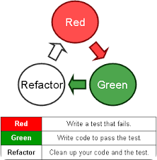
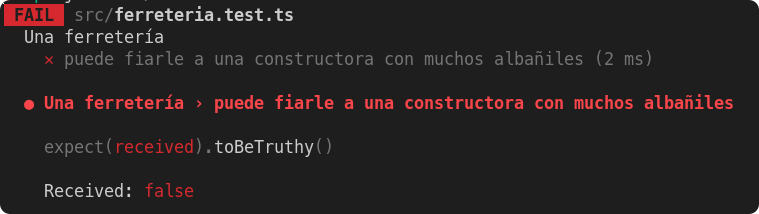

## Test de unidad y TDD

### Test de unidad

Las **pruebas unitarias** o **unit testing** son una forma de comprobar que un fragmento de código funciona correctamente. Es un procedimiento más de los que se llevan a cabo dentro de una metodología ágil de trabajo.

Si nunca te has atrevido con ellas o no sabes por dónde empezar, es el momento de descubrir cómo las pruebas unitarias pueden ayudarte a  **mejorar el resultado final de tu aplicación** .

Las pruebas unitarias consisten en  **aislar una parte del código y comprobar que funciona a la perfección** . Son pequeños *tests* que validan el comportamiento de un objeto y la lógica.
El *unit testing* suele realizarse durante la fase de desarrollo de aplicaciones de software o móviles. Normalmente las llevan a cabo los  **desarrolladores** , aunque en la práctica, también pueden realizarlas los  **responsables de QA** .
Hay una especie de mito respecto a las pruebas unitarias. Algunos desarrolladores están convencidos de que son una pérdida de tiempo y las evitan buscando ahorrar tiempo.
**Nada más alejado de la realidad.**
Con ellas se **detectan antes errores** que, sin las pruebas unitarias, no se podrían detectar hasta fases más avanzadas como las pruebas de sistema, de integración e incluso en la beta.
Realizar pruebas unitarias con regularidad supone, al final, un ahorro de tiempo y dinero.


#### Motivos para realizar un test unitario

Si todavía no estás del todo seguro de por qué debes incorporar las *unit testing* a tu día a día como desarrollador, te damos algunos motivos:

* Las pruebas unitarias demuestran que la **lógica del código** está en buen estado y que funcionará en todos los casos.
* Aumentan la **legibilidad del código** y ayudan a los desarrolladores a entender el código base, lo que facilita hacer cambios más rápidamente.
* Los test unitarios bien realizados sirven como **documentación** del proyecto.
* Se realizan en  **pocos milisegundos** , por lo que podrás realizar cientos de ellas en muy poco tiempo.
* Las *unit testing* permiten al desarrollador **refactorizar el código** más adelante y tener la garantía de que el módulo sigue funcionando correctamente. Para ello se escriben casos de prueba para todas las funciones y métodos, para que cada vez que un cambio provoque un error, sea posible identificarlo y repararlo rápidamente.
* La **calidad final del código** mejorará ya que, al estar realizando pruebas de manera continua, al finalizar el código será limpio y de calidad.
* Como las pruebas unitarias dividen el código en pequeños fragmentos, es posible **probar distintas partes del proyecto** sin tener que esperar a que otras estén completadas.

### TDD

Probablemente, la técnica que hasta hoy conoces (y practicas) a la hora de programar consiste en escribir código y luego, con algo de suerte, probarlo para ver si efectivamente hace lo que tiene que hacer. Esta prueba puede ser manual (por ejemplo, mediante un REPL o sencillamente apretando botones) o automatizada (mediante pruebas unitarias, end-to-end, lo que sea).

En este punto proponemos algo que puede resultar disruptivo y hasta molesto (al menos al principio): comenzar por las
pruebas y luego escribir el código necesario para que ellas pasen. No ahondaremos aquí en las ventajas y desventajas de
la práctica (hay mucho escrito en internet) pero sí diremos que TDD es una muy buena forma de encarar un problema que no
tenemos mucha idea de cómo resolver, y de poner especial atención a las pruebas automatizadas… lo cual nos interesa
especialmente en este momento.

Aunque el nombre pueda sugerir otra cosa, el desarrollo guiado por pruebas, test driven development o TDD es una técnica
de desarrollo que nos propone escribir las pruebas antes que el código. Sin dudas, una de las consecuencias de usarla es
que al finalizar contaremos con una buena batería de pruebas, aunque no es ese su objetivo principal.

Es un práctica de diseño de software orientado a objetos, aunque extensible a otros paradigmas y lenguajes.
Plantea un flujo de trabajo claro y simple basado en la creación de test de unidad.
Pensar primero en el uso y luego en la implementación. Partir de las pruebas, el uso de tus unidades funcionales,
interfaces, nombres, parámetros, etc, para elaborar un diseño del software que nos permita implementarlo.

OJO, TDD no son pruebas, aunque el obtener las pruebas es una consecuencia. TDD nos permite diseñar nuestro código
pensando en el uso que se le va a dar.

La técnica se puede resumir en dos reglas de oro:

> Nunca escribas funcionalidad sin una prueba que falle antes. - Kent Beck.

Esto nos quiere ayudar a pensar en el uso, ya que si la prueba funciona, es porque ya existe.

> Si no puedes escribir una prueba para lo vas a implementar, entonces no deberías estar pensando en la implementación.

- Dave Chaplin.

Si no podemos escribir una prueba es porque no está claro lo que quieres hacer, quizás falte aclarar requisitos.

La técnica tiene 3 pasos:

1. RED: Escribe un test que falla, ver como muestra el error.
2. GREEN: Escribe el código mínimo necesario y simple para que el test no falle. Esto nos permitirá realizar un diseño
   simple, sin sobrediseñar.
3. REFACTOR: Refactoriza tu código y tu test. Mejorar el código sin modificar lo que hace este.
   

Este ciclo se repite continuamente. Aunque no indica cuando parar y cuando refactorizar. Estas decisiones las tomaremos
e iremos mejorando conforme vayamos

En lo que a prácticas se refiere, ver a alguien hacerlo puede resultar mucho más educativo que una explicación teórica
sobre en qué consiste la misma.

Y si bien cada lenguaje y framework tiene sus particularidades, esta técnica es agnóstica de la tecnología.

#### Diseño de casos de prueba

Presentaremos algunas guías para desarrollar los casos de prueba, asumiendo que ya conocés el concepto de
pruebas automatizadas y algún framework para implementarlas.

##### Descripción del dominio

Todo el apunte estará elaborado en base al siguiente dominio:

> REQUERIMIENTO: Una ferretería tiene en cuenta ciertos aspectos para decidir si le puede fiar a un cliente o no.
>
>* Al cliente particular le fia solo si no adeuda nada, es decir si su deuda es de $0.
>* A las constructoras les fia dependiendo de cuántos albañiles trabajen en la obra:
>  * si son 5 o más albañiles, le fía hasta $10.000,
>  * de lo contrario sólo hasta $5.000.

##### Definiendo los escenarios

Para armar los escenarios de prueba, vamos a tomar prestado un concepto de la matemática
llamado  **[clase de equivalencia](https://es.wikipedia.org/wiki/Clase_de_equivalencia)** . Clasificar a los distintos
escenarios según las características que comparten nos va a permitir contemplar todas las opciones posibles sin tener
que escribir infinitas pruebas.

Para un **cliente particular** tenemos dos casos:

* o que no deba nada.
* que deba algo. Si debe $1 ó $50.000 no nos importa, porque está en la misma clase de equivalencia (la deuda es mayor a
  $0).

Para una  **empresa constructora** , tenemos más variantes:

* si tiene **menos de 5** albañiles, podemos decir que son `"pocos"` albañiles,
* si tiene **5 o más** albañiles, podemos decir que son `"muchos"` albañiles.

Combinando eso con las posibles deudas, podríamos definir los siguientes escenarios:

* Dado un cliente particular:
  * **Si debe algo:** no se le puede fiar.
  * **Si no debe nada:** se le puede fiar.
* Dada una constructora con muchos (5) albañiles:
  * **Si la obra debe más de $10.000:** no se le puede fiar.
  * **Si la obra debe menos de $10.000:** se le puede fiar.
* Dada una constructora con pocos (4) albañiles:
  * **Si la obra debe más de $5.000:** no se le puede fiar.
  * **Si la obra debe menos de $5.000:** se le puede fiar.

En el caso de la constructora, elegimos la cantidad de obreros en base al  **valor límite** : como 5 es el número que
distingue entre *pocos* y  *muchos* , elegimos 4 para representar al caso *pocos* y 5 para el caso  *muchos* .

Sin dudas podríamos haber elegido otros números, pero es importante que los tests sean simples y fáciles de comprender.
Por esta razón, vamos a preferir siempre utilizar valores que nos resulten fáciles de razonar para representar a cada
escenario.

#### Escribiendo los tests

Necesitamos:

* Un cliente particular.
* Una empresa constructora con 5 albañiles.
* Otra empresa constructora con 4 albañiles.

A los que podemos configurar diferentes grados de deuda.

> ATENCIÓN: Los ejemplos de código que vienen a continuación asumen que se utiliza Kotest (en el caso de Kotlin). La agrupación que proponemos no puede imitarse fácilmente en frameworks como JUnit.

##### ¿Cómo agrupar los escenarios?

En frameworks como [Jest](https://jestjs.io/) o [Kotest](https://kotest.io/) tenemos la posibilidad de jerarquizar
nuestras pruebas, utilizando las funciones `describe` e `it` para crear estas agrupaciones.

Podríamos también tener todo junto, sin ningún tipo de agrupamiento. Pero esto no resulta ser una buena práctica,
porque:

* dificulta diferenciar los escenarios: estarán todas las variables de los tests mezcladas,
* si construimos un fixture con cada uno de los tipos de cliente, estamos penalizando a cada uno de los tests por lo que
  necesitan los demás: ¿tiene sentido crear una constructora con 5 albañiles si estoy testeando una que tiene 4?,
* se pierde  **cohesión** : un solo método (o función, en este caso) está cubriendo todos los casos de prueba.

Volviendo al ejemplo, hay varias opciones posibles:

* hacer un `describe` para clientes particulares y otro para constructoras,
* hacer un `describe` para clientes particulares, otro para constructoras con pocos albañiles y otro para constructoras
  con muchos albañiles.

Elegiremos la ultima opción y agruparemos las pruebas de la siguiente forma:

```kotlin
    describe("Un cliente particular") {  // ...}
    describe("Una constructora con pocos albañiles") {  // ...}
    describe("Una constructora con muchos albañiles") {  // ...}
```

Es importante que no haya demasiados detalles de implementación en los nombres: `Una constructora con 5 albañiles`
o `Una constructora con 10 albañiles` están sujetos a que cualquier cambio del negocio respecto a lo que son “muchos” o
“pocos” albañiles necesite modificar el nombre del test. Además, un nombre así nos obliga a ir a revisar el código (o el
requerimiento, si es que está escrito en algún lado) para comprender que se trata de dos escenarios diferentes.

##### Expresividad: nombres acorde a lo que representan

Al empezar a diseñar los casos de prueba es usual imaginar algún ejemplo más o menos realista,
como `La Constructora Hurlingham tiene 5 albañiles y una deuda de 7000 pesos`.

Intentando traducir esto a código, tal vez nos saldría un tests como el siguiente:

```kotlin
class FerreteriaTest : DescribeSpec(
    {
        describe("Una ferretería") {
            it("puede fiarle a la Constructora Hurlingham") {
                val constructoraHurlingham = EmpresaConstructora(albaniles = 5,deuda = 7000) 
                constructoraHurlingham.puedePedirFiado().shouldBeTrue()
            }
        }
    })
```

Pero ¿qué pasa si hay un error en el código y el test falla? Supongamos esta implementación, donde la
clase `EmpresaConstructora` tiene la definición de la deuda como un entero:

```kotlin
class EmpresaConstructora(val cantidadAlbaniles: Int, deuda: Int) : Cliente(deuda) {  
        // Debería ser >= 5  
        fun montoMaximoDeuda() = if (cantidadAlbaniles > 5) 10000 else 5000
        override fun puedePedirFiado() = deuda <= this.montoMaximoDeuda()
}
```


Cuando ejecutamos el test tenemos muy poca información relevante:

* la constante `constructorHurlingham` no está revelando que es una constructora con muchos albañiles,
* y tampoco está claro por qué no puede pedir fiado.

Al fallar, tenemos que bucear en el código y extraer este dato para determinar si el error está en el test o en el código de negocio.

##### Otra oportunidad

Vamos a mejorar la semántica del test, renombrando la constante `constructoraHurlingham` por un nombre más
representativo de la clase de equivalencia que estamos modelando y cambiando el nombre del test:

```kotlin
class FerreteriaTest : DescribeSpec({
    describe("Una ferretería") {
        it("puede fiarle a una constructora con muchos albañiles") {
            val constructoraMuchosAlbaniles = EmpresaConstructora(
                albaniles = 5,
                deuda = 7000
            ) constructoraMuchosAlbaniles . puedePedirFiado ().shouldBeTrue()
        }
    }
})
```



Ahora al fallar el test sabemos más cosas:

* qué es lo que estamos testeando, tratando de no entrar en detalles para no duplicar lo que dice el código,
* qué se esperaba que pasara y no pasó, en un formato *más o menos* legible para un usuario: “Una ferretería puede fiarle a una constructora con muchos albañiles”.

#### Buenas prácticas

Más allá de lo explicado hasta aquí, compartimos también algunas buenas prácticas que pueden ser útiles a la hora de armar nuestras pruebas.

##### El patrón AAA: Arrange-Act-Assert

Una de las formas más comunes de estructurar las pruebas es utilizando el patrón AAA:  *Arrange*, *Act* y *Assert*.

No es necesario cumplirlo a rajatabla - y de hecho el ejemplo de este apunte no lo cumple 😅 -, pero tenerlo en mente puede ayudarnos a entender si nuestro test tiene todo lo que debería tener.

Según este patrón, cada test se puede dividir en tres "momentos":

* **Arrange**: que podría traducirse como *arreglar* o *gestionar*, en donde se instancian los objetos a testear, en este ejemplo la ferreteria y sus clientes. Cuando estos objetos son compartidos entre varios tests, los frameworks nos
  permiten ubicarlos en algún lugar común, por ejemplo dentro de un mismo `describe`. La desventaja de esta técnica es que para tener una idea general de los elementos que participan en el test debemos mirar el test **y además** el código de inicialización en el que está enmarcado.
* **Act**: que podría traducirse como *actuar*. Son operaciones que tienen algún efecto sobre los objetos creados, y que posteriormente vamos a querer comprobar que hicieron lo que debían. Hay tests, como los de este apunte, que no necesitan disparar acciones, y está bien que eso ocurra.
* **Assert**: que podría traducirse como *afirmar*. Es la parte donde escribimos lo que esperamos que pase, generalmente asociado a las respuestas que da el envío de un mensaje al objeto testeado.

Veamos un ejemplo sencillo que puede desglosarse fácilmente en esos tres componentes:

```kotlin
describe("Un ave") { 
  it("pierde energía al volar") {
    // ARRANGE: se crea el objeto  
    val pepita = Ave(1000)
    // ACT: se realizan las acciones  
    pepita.volar()
    // ASSERT: se verifica el efecto  
    pepita.energia.shouldBe(900)  
  }
}
```

## Recursos

* [¿Qué es TDD?](https://www.digite.com/es/agile/desarrollo-dirigido-por-pruebas-tdd/)
* [¿Cómo elaborar casos de prueba?](https://surprograma.github.io/libro-disenio-oop/docs/pruebas-automatizadas/elaborar-casos-prueba/)
* [Test unitario avanzado](http://wiki.uqbar.org/wiki/articles/testeo-unitario-avanzado.html)
* [Diseño de Software](https://surprograma.github.io/libro-disenio-oop/docs/intro/)

## Fuente

* [TDD Veloz](https://www.youtube.com/watch?v=8MGtLPFtbQ8)
