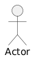
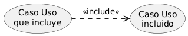
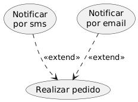
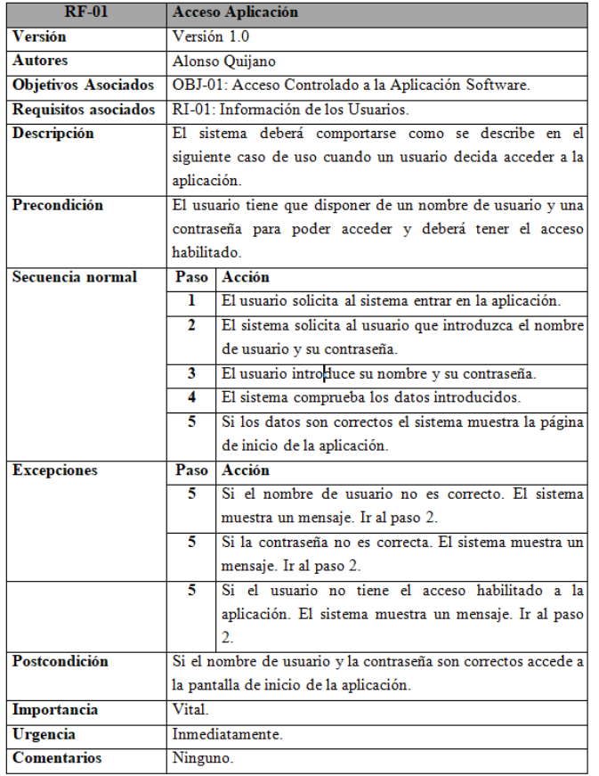
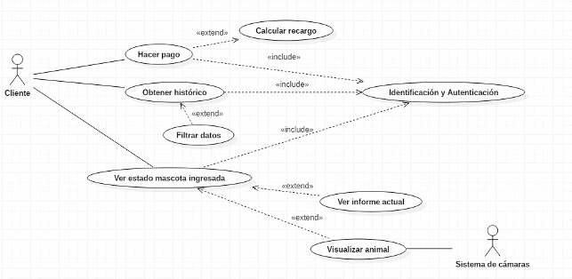
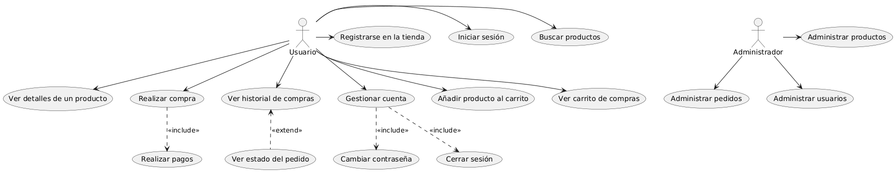

## 4.1. Diagramas de Casos de Uso

### 1. Introducción

El **diagrama de casos de uso** es uno de los diagramas incluidos en UML 2.5, estando este clasificado dentro del grupo de diagramas de comportamiento. Es, con total seguridad, el diagrama más conocido y es utilizado para representar los actores externos que interactúan con el sistema de información y a través de qué funcionalidades (casos de uso o requisitos funcionales) se relacionan. Dicho de otra manera, muestra de manera visual las distintas funciones que puede realizar un usuario (más bien un tipo de usuario) de un Sistema de Información.

En este documento se incluye información sobre cómo construir este diagrama.

Lo primero es saber cuál es su finalidad. El diagrama de casos de uso, dependiendo de la profundidad que le demos, puede ser utilizado para muchos fines, entre ellos podemos encontrar los siguientes:

- **Representar los requisitos funcionales.** Es decir, funcionalidades que va a tener nuestro sistema.
- **Representar los actores que se comunican con el sistema.** Normalmente los actores del sistema son los usuarios y otros sistemas externos que se relacionan con el sistema. En el caso de los usuarios hay que entender el actor como un "perfil", pudiendo existir varios usuarios que actúan como el mismo actor.
- **Representar las relaciones entre requisitos funcionales y actores.** Que relación tienen funcionalidades con otras funcionalidades y con actores.
- **Guiar el desarrollo del sistema.** Crear un punto de partida sobre el que empezar a desarrollar el sistema. Puedes elegir un grupo de funcionalidades básicas con las que comenzar el desarrollo.
- **Comunicarse de forma precisa entre cliente y desarrollador.** Simplifica la forma en que todos los partícipes del desarrollo, incluyendo el cliente, perciben cómo el sistema funcionará y ofrecerá una visión general común del mismo.

### 2. Elementos de un diagrama de casos de uso

Un diagrama de casos de uso está compuesto, principalmente, de 3 elementos: **Actores**, **Casos de uso** y **Relaciones**.

Puedes consultar [la especificación de los casos de uso en plantuml](https://plantuml.com/es/use-case-diagram)

#### 2.1. Actor

Como ya hemos comentado en la presentación, un **actor** es algo o alguien **externo al sistema** que interactúa de forma directa con el sistema. Cuando decimos que interactúa nos referimos a que aporta información, recibe información, inicia una acción...

Se representan con una imagen de un "muñeco de palo" con el nombre del actor debajo.

<figure markdown>
  
  <figcaption>Representación de un actor</figcaption>
</figure>

Existen dos tipos de actores: Los **usuarios** y los **sistemas**.

No hay que entender los usuarios como personas singulares, sino como **"perfiles o roles"** que identifican a un tipo de usuario, pero no al usuario en sí. Por ejemplo, en una aplicación de gestión de nóminas, un actor de este tipo podría ser "gestor de nóminas" que se encarga de emitir y firmar nóminas. Este rol podría ser tomado, por ejemplo, por cualquier individuo del personal de recursos humanos y, además, por el jefe de la empresa. Es un ejemplo muy sencillo, pero como puedes ver, un actor no representa a una única persona o a un único usuario.

<figure markdown>
  
  <figcaption>Ejemplo de actor en un diagrama</figcaption>
</figure>

Por otro lado, los actores pueden ser **otros sistemas** que también interactúan con nuestro propio sistema. Un ejemplo podría ser, en nuestra aplicación de nóminas, un sistema que almacene las nóminas firmadas a modo de archivo. En este caso cuando se firma la nómina se recibe la misma por el sistema de archivo, por tanto el caso de uso se relaciona con el actor.

En ocasiones este tipo de actores no se representa con un "hombre de palo" porque puede dar la sensación de que es un usuario y queda poco intuitivo.

#### 2.2. Caso de uso

Un **caso de uso** se utiliza para representar una de las funcionalidades que realiza el sistema. Es una secuencia de acciones que hace el sistema y que producen un resultado que puede percibir un usuario.

Formalmente hablando, un caso de uso es una clasificación de comportamiento que especifica una unidad de funcionalidad completa y que está realizada por uno o más sujetos que se relacionan con el caso de uso colaborando para ello con uno o más actores y que produce un resultado que tiene alguna utilidad para cualquier de esos actores.

Se representan con una elipse que incluye en su interior el nombre del caso de uso.

<figure markdown>
  
  <figcaption>Representación de un caso de uso</figcaption>
</figure>

Existen muchos ejemplos de casos de uso. Algunos podrían ser: **Crear pedido**, **Listar productos**, **Enviar correo**. Cualquier acción que realice la aplicación.

!!! note "Nota importante sobre UML 2.5"
    Las especificaciones anteriores a UML 2.5 requerían que un caso de uso sea invocado por un actor. En UML 2.5 esto se eliminó, lo que significa que podría haber algunas situaciones en las que la funcionalidad del sistema la inicie el propio sistema y, al mismo tiempo, brinde resultados útiles a un actor. Por ejemplo, el sistema podría notificar a un cliente que se envió la orden, programar la limpieza y el archivo de la información del usuario, solicitar información de otro sistema, etc.

#### 2.3. Relaciones

Las **relaciones** conectan los casos de uso con los actores o los casos de uso entre sí.

Cuando conectan un actor con un caso de uso representa que ese actor interactúa de alguna manera con ese caso de uso y se representa con una línea continua con la identificación `<<communicates>>`.

<figure markdown>
  
  <figcaption>Una actor comunica con un caso de uso</figcaption>
</figure>

Cuando conectan casos de uso entre sí se pueden diferenciar dos tipos de relaciones: `<<include>>` y `<<extends>>`. En español a veces se usa la nomenclatura `<<usa>>` y `<<extiende>>`:

##### 2.3.1 Relación include

`<<include>>`: Se utiliza para representar que un caso de uso utiliza siempre a otro caso de uso. Es decir, un caso de uso se ejecutará obligatoriamente (lo incluye, lo usa). Se representa con una flecha discontinua que va desde el caso de uso de origen al caso de uso que se incluye.

<figure markdown>
  
  <figcaption>Relación include entre dos casos de uso</figcaption>
</figure>

Un uso típico de este tipo de relaciones se produce cuando dos casos de uso comparten una funcionalidad. Esa funcionalidad es extraída de los dos y se crea un caso de uso nuevo que se relaciona con los anteriores con un include.

<figure markdown>
  
  <figcaption>Ejemplo de uso de include</figcaption>
</figure>

En este ejemplo, los casos de uso **emitir factura** y **enviar producto** ejecutarán ambos el caso de uso **autenticación**.

##### 2.3.2. Relación extend

`<<extend>>`: Este tipo de relaciones se utilizan cuando un caso de uso tiene un comportamiento opcional, reflejado en otro caso de uso. Es decir, un caso de uso puede ejecutar, normalmente dependiendo de alguna condición o flujo del programa, otro caso de uso. Se representa con una flecha discontinua que va desde el caso de uso opcional al original.

<figure markdown>
  
  <figcaption>Relación extend entre dos casos de uso</figcaption>
</figure>

Un ejemplo de esta relación podría ser la siguiente:

<figure markdown>
  
  <figcaption>Ejemplo de relaciones extend</figcaption>
</figure>

En este supuesto el caso de uso **Hacer pedido** puede dar lugar (o no) a otros dos casos de uso: **Enviar notificación SMS** y **Enviar notificación email**. Se supone que, cuando un usuario hace un pedido, el sistema le permite elegir si quiere que se envíe una notificación de ese pedido por SMS o por email.

##### 2.3.3. Relación de generalización

**Generalización**: existe otra relación denominada generalización que consiste en hacer que un elemento herede el comportamiento de otro. Aunque se puede utilizar entre casos de uso, es más común utilizarlo entre actores, haciendo que uno de los actores tenga acceso a las funcionalidades de otro. Se representa con una flecha con la punta hueca que va desde el elemento que hereda al elemento heredado:

<figure markdown>
  
  <figcaption>Generalización entre dos actores</figcaption>
</figure>

### 3. Como dibujar un diagrama de casos de uso

A la hora de dibujar un diagrama de casos de uso se recomienda que compruebes que has realizado previamente todas estas tareas, respondiendo a las preguntas que se listan a continuación:

- Recopilar fuentes de información: ¿cómo se supone que debo saber eso?
- Identificar actores potenciales: ¿qué usuarios utilizan los bienes y servicios del sistema empresarial?.
- Identificar posibles casos de uso: ¿a qué bienes y servicios pueden recurrir los actores?
- Conectar los casos de uso: ¿quién puede hacer uso de los bienes y servicios del sistema empresarial?
- Describir actores: ¿a quién o qué representan los actores?
- Buscar más casos de uso: ¿Qué más debe hacer el sistema?
- Documentar casos de uso: ¿qué sucede exactamente en cada caso de uso?
- Relacionar modelos entre casos de uso empresarial: ¿qué actividades se realizan repetidamente?
- Verificar la vista, ¿todo es correcto?

Los pasos se han escrito en este orden a propósito, ya que es la forma lógica de seguirlos. Sin embargo, este orden no es obligatorio, ya que en la práctica, los pasos individuales a menudo se superponen unos con otros.

Para poder seguir los pasos de una forma óptima, es importante comprender el negocio/sistema para conseguir seguir cada paso individual. En algunos casos también es necesario consultar a los expertos o consultores del negocio. No tiene sentido aferrarse a la visión personal del analista, si este no tiene mucho conocimiento del área de negocio de la aplicación.

Como soporte para responder a las preguntas anteriores, a continuación se propone unas pequeña guia para identificar actores y casos de uso, según la metodología de desarrollo RUP (Rational Unified Process).

Se ha dividido la entrada en tres apartados:

1. Identificar actores.
2. Identificar casos de uso.
3. Describir cómo interactúan los actores y los casos de uso.

#### 3.1. Identificar actores

Encontrar actores es uno de los primeros pasos para definir los casos de uso del sistema. Cada tipo de fenómeno externo con el que el sistema debe interactuar está representado por un actor.

Como ya comentamos durante la explicación de qué es un diagrama de casos de uso, un actor es cualquier cosa que intercambia datos con el sistema. Un actor puede ser un usuario, un hardware externo u otro sistema.

Las siguientes preguntas nos ayudarán a encontrar los actores que interactuarán con el sistema:

- ¿Qué grupos de usuarios requieren ayuda del sistema para realizar sus tareas?
- ¿Qué grupos de usuarios se necesitan para ejecutar las funciones principales más obvias del sistema?
- ¿Qué grupos de usuarios están obligados a realizar funciones secundarias, como el mantenimiento y la administración del sistema?
- ¿Con qué hardware externo debe interactuar el sistema?
- ¿Con qué otros sistemas debe interactuar el sistema?
- ¿Alguna entidad (usuario u otro sistema) necesita ser informado sobre los cambios que ocurren dentro del sistema?

Estas preguntas nos pueden ayudar a encontrar actores. También podemos consultar el documento de requisitos funcionales del sistema, si existiese, para complementar la lista de actores identificados y casos de uso a los que daría lugar.

Cualquier individuo, grupo o fenómeno que se ajuste a una o más de estas categorías es un candidato para un actor.

Para determinar si tiene los actores adecuados (humanos), puede intentar nombrar dos o tres personas que puedan actuar como actores, y luego ver si su conjunto de actores es suficiente para sus necesidades.
Puede ser difícil al principio encontrar los actores más adecuados, y no es probable que los encuentres a todos de inmediato porque no están aun identificados todos los casos de uso. Posteriormente, es posible que sea necesario revisar el modelo original, porque al principio hay una tendencia a modelar demasiados actores.

Tenga cuidado cuando cambie actores; los cambios que introduzca también pueden afectar los casos de uso. Recuerde que cualquier modificación a los actores constituye una alteración importante en las interfaces y el comportamiento del sistema.

El nombre del actor debe indicar claramente el papel del actor. Asegúrese de que habrá poco riesgo en una etapa futura de confundir el nombre de un actor con otro.

Defina a cada actor escribiendo una breve descripción que incluya el área de responsabilidad del actor y para lo que el actor necesita el sistema. Debido a que los actores representan cosas fuera del sistema, no es necesario que los describa en detalle.

#### 3.2. Identificar casos de uso

Cuando se completa el primer esquema de los actores, el siguiente paso es buscar los casos de uso del sistema. Los primeros casos de uso son muy preliminares, y sin duda tendrás que cambiarlos varias veces hasta que sean estables. Si la visión o los requisitos del sistema son deficientes, o si el análisis del sistema es impreciso, la funcionalidad del sistema no será clara. Por lo tanto, debes preguntarte constantemente si has encontrado los casos de uso correctos. Además, debes estar preparado para agregar, eliminar, combinar y dividir los casos de uso antes de llegar a una versión final. Obtendrás una mejor comprensión de los casos de uso una vez que los hayas descrito en detalle.

La mejor forma de encontrar casos de uso es considerar lo que cada actor requiere del sistema. Recuerde que el sistema existe solo para sus usuarios y, por lo tanto, debe basarse en las necesidades de los usuarios. Reconocerás muchas de las necesidades de los actores a través de los requisitos funcionales establecidos en el sistema. Para cada actor, sea humano o no, hay que hacer las siguientes preguntas:

- ¿Cuáles son las tareas principales que el actor quiere que realice el sistema?
- ¿El actor creará, almacenará, cambiará, eliminará o leerá datos en el sistema?
- ¿El actor necesitará informar al sistema sobre cambios repentinos y externos?
- ¿El actor necesita ser informado sobre ciertas ocurrencias en el sistema?
- ¿El actor realizará un arranque o apagado del sistema?

Las respuestas a estas preguntas representan los flujos de eventos que identifican casos de uso candidatos. No todos constituyen casos de uso separados; algunos pueden modelarse como variantes del mismo caso de uso. No siempre es fácil decir qué es una variante y qué es un caso de uso separado y distinto. Dependerá, en gran medida, del nivel de granularidad que queramos dar al esquema.

Además de los requisitos, el modelo empresarial de su organización es una valiosa fuente de información para determinar los casos de uso. El modelo de empresa describe cómo se puede incorporar el sistema de información en las operaciones existentes y, por lo tanto, le da una buena idea del entorno del sistema.

Un sistema puede tener varios modelos de casos de uso posibles. La mejor manera de encontrar el modelo «óptimo» es desarrollar dos o tres modelos, elegir el que prefiera y luego desarrollarlo más. Desarrollar varios modelos alternativos también lo ayuda a comprender mejor el sistema.

Cuando haya delineado su primer modelo de caso de uso, debe verificar que el modelo de caso de uso aborde todos los requisitos funcionales. Examine cuidadosamente los requisitos para asegurarse de que todos los casos de uso cumplan con todos los requisitos.

Cada caso de uso debe tener un nombre que indique lo que se logra mediante sus interacciones con el (los) actor (es). El nombre debe tener varias palabras para ser entendido. No hay dos casos de uso que puedan tener el mismo nombre.

#### 3.3. Interacción entre los actores y los casos de uso

Debido a que es importante mostrar cómo se relacionan los actores con el caso de uso, al encontrar un caso de uso, debe establecer qué actores interactuarán con él. Para hacer esto, debe definir una asociación de comunicaciones que sea navegable en la misma dirección que la transmisión de señal entre el actor y el caso de uso.
Las transmisiones de señal generalmente van en ambas direcciones. Cuando este es el caso, debe permitir que las asociaciones de comunicaciones sean navegables en ambas direcciones. Defina, a lo sumo, una asociación de comunicación para cada par de actor y caso de uso.
También es recomendable describir brevemente cada asociación de comunicación que defina.

### 4. Documentación de los casos de uso

#### 4.1. Requisitos funcionale vs No funcionales

Es común en este tipo de diagramas describir cada caso de uso junto con la secuencia de pasos necesaria para completarlo y las posibles excepciones hasta definir todas las situaciones posibles. Esta descripción servirá de guía para el desarrollo, la profundidad de las situaciones que se traten dependerá de cada fase del proyecto o de cada situación en particular.

Existen dos tipos de requisitos:

- Requisitos funcionales: los relativos a aspectos relacionados con la funcionalidad que tiene que aportar el software.
- Requisitos no funcionales: los relativos a otros aspectos, como pueden ser de tiempo de respuesta, seguridad, sistemas de despliegue y ejecución, etc.

| **Caracteristicas**          | **Requisitos funcianales**                                                                    | **Requisitos no funcionales**                                                                             |
|------------------------------|-----------------------------------------------------------------------------------------------|-----------------------------------------------------------------------------------------------------------|
| **¿Qué describen?**          | Lo que el sistema debe hacer (funcionalidad y comportamiento).                                | Cómo debe funcionar el sistema (rendimiento, seguridad, usabilidad, etc.).                                |
| Ejemplo en una tienda online | "El usuario debe poder registrarse en la tienda."                                             | "El sistema debe cargar la página en menos de 2 segundos."                                                |
| **¿Son obligatorios?**       | Sí, son esenciales para que el sistema funcione.                                              | No siempre, pero mejoran la experiencia y eficiencia del sistema.                                         |
| **¿Cómo se validan?**        | Se prueban mediante casos de uso y pruebas funcionales.                                       | Se prueban con métricas como tiempo de respuesta, seguridad y accesibilidad.                              |
| Ejemplos generales           | Iniciar sesión; Procesar pagos; Agregar productos al carrito; Enviar notificaciones de pedido | Tiempo de respuesta < 3 segundos; Seguridad en transacciones; Diseño responsivo; Disponibilidad del 99.9% |

Los requisitos funcionales se suelen representar mediante casos de uso, y suelen ser plasmados junto a la especificación del caso de uso.

<figure markdown>
  
  <figcaption>Requisitos funcionales</figcaption>
</figure>

<figure markdown>
  
  <figcaption>Requisitos no funcionales</figcaption>
</figure>

#### 4.2. Especificación de casos de uso

Una vez que se hayan identificado actores y casos de uso, es importante escribir al menos un breve resumen de cada uno. Es común que esta descripción se realice en formato de **especificación de casos de uso**.

La especificación de un caso de uso describe cómo interactúan los actores con el sistema. La descripción se centra en el comportamiento que es visible para el actor. No describe los detalles de cómo el sistema implementará ese comportamiento; eso lo hará en etapas posteriores del desarrollo, cuando entremos en el diseño del sistema.

El nivel de detalle de una especificación de casos de uso varía mucho. En algunos casos, una oración puede ser suficiente. En otros casos, se necesita más información. En la mayoría de los casos, tenemos un formato normal donde describimos los distintos campos de la especificación de un caso de uso.

Una especificación típica de un caso de uso incluye toda o parte de la siguiente información:

- **Nombre del caso de uso**: Un nombre breve, descriptivo y único.   
- **Versión**: Qué versión del documento es.   
- **Autores**: Quién redacta el contenido.   
- **Objetivos asociados**: Debe hacer referencia a los objetivos del software que están asociados a este requisito.   
- **Requisitos asociados**: Debe hacer referencia a otros requisitos que están asociados a este requisito.  
- **Requisitos especiales**: Requisitos no funcionales que se aplican al caso de uso (rendimiento, seguridad, etc.). 
- **Descripción**: Descripción mas amplia del caso de uso. Este campo debe completarse de forma distinta en función de si el caso de uso es abstracto o concreto.    
- **Actores**: Los actores que participan en el caso de uso.    
- **Precondiciones**: Condiciones que deben cumplirse para que el caso de uso pueda iniciarse.    
- **Flujo principal**: Una descripción de paso a paso de lo que ocurre durante el caso de uso, centrada en la interacción entre el sistema y los actores.    
- **Flujos alternativos**: Variaciones del flujo principal debido a decisiones o excepciones.    
- **Postcondiciones**: Condiciones que serán verdaderas al finalizar el caso de uso.    
- Excepciones: Especifica el comportamiento del sistema en el caso de que se produzca alguna situación excepcional durante la realización de un paso determinado, lo que modifica el flujo «normal» del caso de uso.    
- **Importancia**: La importancia que tiene este requisito.    
- **Urgencia**: La urgencia que tiene este requisito.     
- **Comentarios**: Cualquier comentario adicional.    

A continuación se muestra un ejemplo de especificación de caso de uso:

**Caso de Uso: Realizar Préstamo**

**Descripción:**
Este caso de uso describe el proceso mediante el cual un bibliotecario registra un préstamo de un libro a un socio.

**Actores:**

- Bibliotecario (Actor Principal)
- Socio (Actor Secundario)

**Precondiciones:**

- El socio debe estar registrado en el sistema.
- El libro debe estar disponible para préstamo.
- El socio no debe tener más de 3 libros prestados simultáneamente.
- El socio no debe tener multas pendientes.

**Flujo Principal:**

1. El bibliotecario inicia el proceso de préstamo.
2. El sistema solicita la identificación del socio.
3. El bibliotecario introduce el código del socio.
4. El sistema verifica que el socio existe y muestra su información.
5. El sistema solicita la identificación del libro.
6. El bibliotecario introduce el código del libro.
7. El sistema verifica que el libro está disponible.
8. El sistema registra el préstamo con la fecha actual y calcula la fecha de devolución (15 días).
9. El sistema actualiza el estado del libro a "prestado".
10. El sistema muestra un mensaje de confirmación con la fecha de devolución.
11. El caso de uso finaliza.

**Flujos Alternativos:**

**A1: El socio no existe (paso 4)**

1. El sistema muestra un mensaje de error indicando que el socio no está registrado.
2. El sistema vuelve al paso 2.

**A2: El socio tiene multas pendientes (paso 4)**

1. El sistema muestra un mensaje indicando que el socio tiene multas pendientes.
2. El sistema pregunta si se desea gestionar las multas.
3. El caso de uso finaliza.

**A3: El libro no está disponible (paso 7)**

1. El sistema muestra un mensaje indicando que el libro no está disponible.
2. El sistema ofrece la opción de reservar el libro.
3. El caso de uso finaliza.

**A4: El socio ha alcanzado el límite de préstamos (paso 4)**

1. El sistema muestra un mensaje indicando que el socio tiene el máximo de libros prestados.
2. El caso de uso finaliza.

**Postcondiciones:**

- El préstamo queda registrado en el sistema.
- El libro cambia su estado a "prestado".
- Se ha establecido una fecha de devolución.

**Requisitos Especiales:**

- El sistema debe responder en menos de 2 segundos para cada operación.
- Todas las operaciones deben quedar registradas en un log para auditoría.

### 5. Ejemplo: Clinica veterinaria

A modo de ejemplo se propone un ejercicio de un diagrama de casos de uso que consiste en el diseño de una aplicación que gestione los tramites a realizar en una clínica veterinaria en base a las siguientes premisas:

La clínica veterinaria almacena datos de contacto de todos sus clientes como pueden ser: Nombre, Apellidos, DNI, Fecha de nacimiento, Teléfono o Email. Estos datos son introducidos y gestionados por los auxiliares, que ejercen las funciones administrativas.

Además se almacena información de cada uno de las mascotas de las que es dueño cada cliente. Obviamente, cada cliente puede tener más de una mascota, pero cada mascota solo puede pertenecer a un único cliente. Se permite, además, cambiar el dueño de una mascota por otro.

Al dar de alta un nuevo animal, se comprobará en el registro del REIAC (Red Española de Identificación de Animales de Compañía) si el animal está correctamente dado de alta. Este proceso unicamente se hará en animales que tengan la obligación de estar identificados.

Cada vez que un veterinario realiza una consulta sobre un animal, esta queda almacenada incluyendo datos básicos como: Tiempo de consulta, Identificación de la persona que lo ha tratado, Animal tratado, Importe total, Resolución, Recetas… Para calcular el tiempo de la consulta el veterinario tendrá un botón en la aplicación donde pueda pulsar cuando comienza la consulta para calcular el tiempo a modo de cronómetro y otro botón para finalizar.

En caso de que el animal se quede ingresado en la clínica, el cliente debe ser capaz de acceder al estado en tiempo real del animal. Además podrá comunicarse con una cámara que tendrá el animal colocada, donde podrá ver su situación actual. La gestión de estas cámaras no corresponde al sistema, sino que se utilizará una aplicación ya presente en el veterinario.

Las recetas y otros documentos relacionados con el servicio se incluirán en un gestor de contenidos que ya está en funcionamiento en la clínica veterinaria.

Una vez terminado el servicio, el cliente no tiene por qué realizar inmediatamente el pago, sino que puede identificarse posteriormente en la aplicación vía web y realizar el pago. Si el cliente tarda más de una semana se efectuará un recargo sobre el precio inicial.

Además, el cliente debe ser capaz de obtener un histórico de todas las consultas que ha recibido cualquiera de sus mascotas.

No obstante, dependiendo del nivel de profundidad, el diagrama puede variar significativamente descomponiendo, añadiendo, omitiendo o fusionando alguno de los casos de uso que se han expuesto.

<figure markdown>
  
  <figcaption>Veterinaria 1</figcaption>
</figure>

<figure markdown>
  
  <figcaption>Veterinaria 2</figcaption>
</figure>

<figure markdown>
  
  <figcaption>Veterinaria 3</figcaption>
</figure>

### 5. Ejemplo: Sistema de tienda online

Vamos a ver un ejemplo completo de un diagrama de casos de uso para un sistema de tienda online.

#### **Descripción del Sistema:**

Una tienda online que permite a los usuarios buscar productos, añadirlos al carrito y realizar compras. Los administradores pueden gestionar productos, pedidos y usuarios.

#### **Funcionalidades Principales:**

**Registrarse en la tienda:** Un nuevo usuario puede crear una cuenta proporcionando su correo electrónico y una contraseña.

**Iniciar sesión:** Un usuario registrado puede iniciar sesión en la tienda para acceder a su cuenta y realizar compras.

**Buscar productos:** Los usuarios pueden buscar productos por nombre, categoría o precio.

**Ver detalles de un producto:** Al seleccionar un producto, el sistema muestra información detallada como descripción, precio, disponibilidad y opiniones de otros clientes.

**Añadir producto al carrito:** Los usuarios pueden agregar productos al carrito de compras.

**Ver carrito de compras:** Los usuarios pueden revisar los productos que han añadido al carrito antes de proceder con la compra.

**Realizar compra:** Los usuarios pueden finalizar su compra proporcionando información de pago y dirección de envío. Este proceso incluye realizar el pago.

**Realizar pagos:** El sistema procesa el pago usando una pasarela de pago externa.

**Ver historial de compras:** Los usuarios pueden consultar un listado de todas las compras realizadas anteriormente.

**Ver estado del pedido:** Si el usuario está consultando el historial de compras, puede seleccionar un pedido específico para ver su estado actual (en preparación, enviado, entregado).

**Cambiar contraseña:** Los usuarios pueden actualizar su contraseña desde la configuración de su cuenta.

**Cerrar sesión:** Los usuarios pueden cerrar su sesión de manera segura.

**Gestionar cuenta:** Los usuarios pueden acceder a la configuración de su cuenta, donde pueden cambiar su contraseña o cerrar sesión.

**Administrar productos:** El administrador puede agregar nuevos productos, eliminar productos existentes o actualizar la información de los productos.

**Administrar pedidos:** El administrador de la tienda puede ver y actualizar el estado de los pedidos de los clientes.

**Administrar usuarios:** El administrador de la tienda puede ver y actualizar los datos de los usuarios registrados en la tienda.

#### **Actores:**

- **Usuario:** Cliente que navega y compra en la tienda.
- **Administrador:** Gestiona productos, pedidos y usuarios.

#### **Casos de Uso Principales:**

**Para el Usuario:**

- Registrarse en la tienda
- Iniciar sesión
- Buscar productos y ver detalles de un producto
- Añadir productos al carrito y ver carrito de compras
- Realizar compra (incluye realizar pagos)
- Ver historial de compras
- Ver estado del pedido (extiende historial de compras)
- Gestionar cuenta (incluye cambiar contraseña y cerrar sesión)

**Para el Administrador:**

- Administrar productos (agregar, eliminar, actualizar productos)
- Administrar pedidos (actualizar estado de pedidos)
- Administrar usuarios (gestionar clientes registrados)

#### **Relaciones Clave:**

**include:**

- Realizar compra → Incluye Realizar pagos
- Gestionar cuenta → Incluye Cambiar contraseña y Cerrar sesión

**extend:**

- Ver estado del pedido → extiende Ver historial de compras

<figure markdown>
  
  <figcaption>Diagrama de casos de uso completo de un sistema de tienda online</figcaption>
</figure>

El diagrama representa de manera clara cómo los usuarios interactúan con la tienda online y cómo el administrador gestiona la plataforma.

### 7. Herramientas para crear diagramas de casos de uso

Para crear diagramas de casos de uso, existen diversas herramientas que facilitan el proceso de modelado:

- **PlantUML:** Permite crear diagramas mediante código, lo que facilita el versionado y la integración con sistemas de control de versiones.
- **Draw.io:** Herramienta visual gratuita y online que permite crear diagramas de forma intuitiva.
- **Visual Paradigm:** Suite completa de modelado UML con funcionalidades avanzadas para desarrollo profesional.
- **StarUML:** Herramienta de modelado UML con soporte para múltiples tipos de diagramas.
- **Lucidchart:** Herramienta colaborativa online que permite trabajar en equipo en tiempo real.
- **Enterprise Architect:** Herramienta profesional completa para modelado de sistemas empresariales.

!!! tip "Recomendación"
    Para estudiantes y proyectos pequeños, se recomienda comenzar con herramientas gratuitas como PlantUML o Draw.io. Para proyectos profesionales y empresariales, herramientas como Visual Paradigm o Enterprise Architect ofrecen funcionalidades más avanzadas.

## Referencias y bibliografía

- Jacobson, I. (1992). *Object-Oriented Software Engineering: A Use Case Driven Approach*. Addison-Wesley.
- Rumbaugh, J., Jacobson, I., & Booch, G. (2004). *The Unified Modeling Language Reference Manual* (2nd ed.). Addison-Wesley.
- Rational Software Corporation. *Rational Unified Process: Best Practices for Software Development Teams*.
- [UML Use Case Diagrams - Visual Paradigm](https://www.visual-paradigm.com/guide/uml-unified-modeling-language/what-is-use-case-diagram/)
- [PlantUML - Use Case Diagram](https://plantuml.com/es/use-case-diagram)
- [Use Case Diagram Tutorial - Lucidchart](https://www.lucidchart.com/pages/uml-use-case-diagram)
