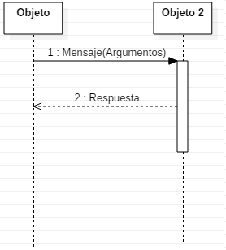
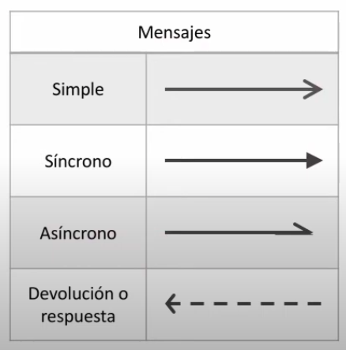
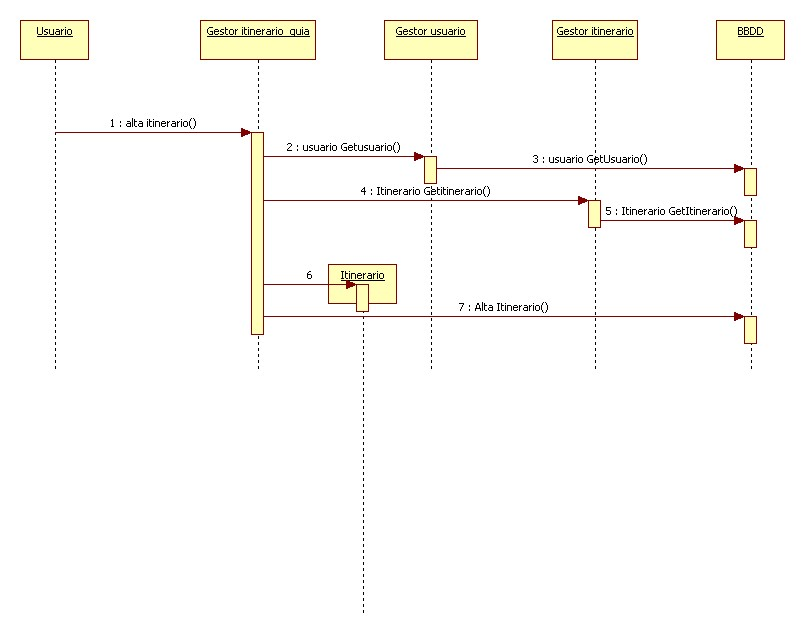

## 4.3. Diagramas de Secuencia

### 1. Introducción

El **diagrama de secuencia** es un tipo de diagrama de interacción contenido en UML 2.5. Su objetivo es representar el intercambio de mensajes entre los distintos objetos del sistema a través del tiempo para cumplir con la funcionalidad que se intenta modelar. Define, por tanto, el comportamiento dinámico del sistema de información.

Normalmente es utilizado para definir cómo se realiza un caso de uso, por lo que es comúnmente utilizado junto al diagrama de casos de uso. También se suele construir para comprender mejor el diagrama de clases, ya que el diagrama de secuencia muestra cómo objetos de esas clases interactúan haciendo intercambio de mensajes.

### 2. Beneficios de utilizar diagramas de secuencia

Los diagramas de secuencia aportan múltiples ventajas en el desarrollo de software:

- **Claridad en la interacción de objetos**: Permiten visualizar de manera detallada cómo los objetos colaboran entre sí para cumplir una función.

- **Documentación precisa**: Sirven como referencia para desarrolladores y stakeholders, facilitando la comprensión y el mantenimiento del sistema.

- **Detección de inconsistencias**: Ayudan a identificar posibles problemas en el flujo de mensajes o en la lógica del proceso antes de la implementación.

### 3. Aplicaciones comunes

Los diagramas de secuencia se utilizan habitualmente en diversos contextos:

- **Modelado de casos de uso**: Desglosan escenarios específicos, mostrando cómo los actores externos interactúan con el sistema.

- **Diseño de funcionalidades complejas**: Detallan la lógica interna de operaciones o métodos específicos, asegurando que todos los componentes trabajen en armonía.

- **Análisis de sistemas existentes**: Proporcionan una visión clara del comportamiento actual del sistema, útil para tareas de refactorización o mejora.

### 4. Construcción del diagrama de secuencia

El diagrama de secuencia está construido a partir de dos dimensiones:

#### 4.1. Dimensión horizontal

Representa los objetos que participan en la secuencia, y que van intercambiando mensajes.

- **Mensajes**: Flechas horizontales que muestran la comunicación entre objetos.

#### 4.2. Dimensión vertical

Representa la línea de tiempo sobre la que los elementos actúan. Va de arriba (menor tiempo) hacia abajo (mayor tiempo).

No es común "reglar" esta dimensión mediante una escala para poner tiempos específicos, a excepción de sistemas de tiempo real donde la velocidad para llevar a cabo la funcionalidad sí es relevante.

En esta línea de tiempo, se representan:

- **Líneas de vida**: Representan la existencia de un objeto durante la interacción. Se dibujan como líneas verticales discontinuas que se extienden hacia abajo, indicando el paso del tiempo.

- **Barras de activación**: Rectángulos delgados superpuestos a las líneas de vida que indican el período durante el cual un objeto está realizando una acción o proceso.

- **Fragmentos combinados**: Elementos que encapsulan comportamientos condicionales o repetitivos, como bucles (loop), alternativas (alt) u opciones (opt).

<figure markdown>
  
  <figcaption>Dimensiones del diagrama de secuencia: horizontal (objetos) y vertical (tiempo)</figcaption>
</figure>

### 5. Elementos del diagrama de secuencia

El diagrama de secuencia está compuesto por dos elementos principales: **Objetos** y **Mensajes**.

#### 5.1. Actores

Entidad externa que interactúa con el sistema. Representa un usuario, un sistema externo u otro componente que inicia o recibe acciones dentro del sistema.

**Las características de un actor en UML:**

- **Entidad externa**: No forma parte del sistema pero interactúa con él.

- **Rol, no persona**: Representa un rol en el sistema, no a un individuo específico. Por ejemplo, un "Cliente" en un e-commerce.

- **Puede ser humano o máquina**: Un actor puede ser un usuario humano, una API externa, una base de datos, etc.

#### 5.2. Objeto

Un objeto representa a un participante en la interacción. Un objeto puede ser una instancia de una clase, un módulo, un grupo de clases... en definitiva, un objeto es un componente software que tiene una funcionalidad específica. Dependerá del nivel de abstracción la representación de cada objeto.

Es importante destacar que, en el diagrama de secuencia y a diferencia de otros diagramas, cada uno de los objetos añadidos al diagrama representa solamente una instancia de ese objeto y no varias. En caso de tratarse de un elemento multivaluado, se debe dejar constancia de cuál es el elemento que está trabajando.

Un objeto se representa mediante un rectángulo que incluye un identificador en su interior y del que sale una línea de forma vertical hacia abajo. Esta línea se llama **línea de vida** y representa el tiempo en el que un objeto está presente.

<figure markdown>
  
  <figcaption>Notación de un objeto en el diagrama de secuencia</figcaption>
</figure>

Los objetos que existen previamente al comienzo de la interacción se sitúan en el eje horizontal, mientras que los objetos que se crean durante el transcurso de la misma se sitúan en el momento de la creación, inicio de línea de vida del objeto (Estereotipo `<<Create>>`).

El final de un punto de vida se representa con un aspa al final de la línea de vida, aunque puede no ser eliminado nunca, prolongando su línea de vida hasta el final del diagrama.

Los objetos contienen el denominado **foco de control** (Barras de activación) que no es más que el tiempo en el que tal objeto está llevando a cabo algún trabajo. Se representa mediante un rectángulo superpuesto a la línea de vida.

<figure markdown>
  
  <figcaption>Foco de control o barra de activación</figcaption>
</figure>

#### 5.3. Mensaje

Se utiliza un mensaje en el diagrama de secuencia para representar el paso de un mensaje entre dos objetos o entre un objeto y sí mismo.

##### 5.3.1. Tipos de mensajes

- **Simple**: Representa la transferencia de control de un objeto a otro sin que el remitente espere una respuesta inmediata. Se ilustra con una línea continua y una punta de flecha abierta.

- **Síncrono**: El remitente envía un mensaje y espera una respuesta antes de continuar. Se representa con una línea continua y una punta de flecha sólida.

- **Asíncrono**: El remitente envía un mensaje y continúa su proceso sin esperar una respuesta. Se ilustra con una línea continua y una punta de flecha abierta.

- **Respuesta**: Indica la devolución de información desde el receptor al remitente tras procesar un mensaje. Se muestra con una línea discontinua y una punta de flecha abierta.

Los detalles suelen llevar una etiqueta que puede variar dependiendo del grado de detalle:

- `nombreMensaje()`
- `nombreMensaje(parametro1, parametro2)`
- `nombreMensaje(tipo:parametro1=valor predeterminado)`

El estereotipo `<<Crear>>` se utiliza para indicar la creación de un objeto.

Como hemos visto, los mensajes se representan utilizando una flecha que incluye el nombre del mensaje y los argumentos que incluye, y que va desde el objeto que envía el mensaje hasta el objeto que lo recibe.

<figure markdown>
  
  <figcaption>Notación de un mensaje en el diagrama de secuencia</figcaption>
</figure>

A veces el objeto que recibe el mensaje envía una respuesta. Esta respuesta se representa con una flecha discontinua.

<figure markdown>
  
  <figcaption>Notación de una respuesta en el diagrama de secuencia</figcaption>
</figure>

Un ejemplo de mensajes podría ser el siguiente:

<figure markdown>
  
  <figcaption>Ejemplo de intercambio de mensajes</figcaption>
</figure>

Como hemos visto antes, un objeto puede ser creado a mitad de la interacción. Esta creación se hace a través de otro objeto mediante una llamada `create`. También existe la posibilidad de que un objeto destruya otro. Ambas acciones se representan de la siguiente manera:

<figure markdown>
  
  <figcaption>Notación de creación y destrucción de objetos</figcaption>
</figure>

### 6. Estereotipos de objeto

En UML, los estereotipos de objeto ayudan a clasificar los diferentes tipos de participantes en un diagrama de secuencia. Los tres estereotipos más comunes son:

#### 6.1. Boundary (Interfaz o Límite)

Representa la interfaz entre el usuario (o sistema externo) y la aplicación. Se encarga de manejar la interacción con los actores.

**Ejemplos:**

- Pantallas de usuario (UI)
- Formularios de entrada
- API o servicios web expuestos a otros sistemas

#### 6.2. Control (Lógica de negocio)

Representa la lógica del sistema. Se encarga de coordinar el flujo entre la interfaz (boundary) y las entidades (datos).

**Ejemplos:**

- Un controlador en un patrón MVC
- Un servicio que gestiona reglas de negocio

#### 6.3. Entity (Modelo de datos)

Representa los datos persistentes o entidades del sistema. Se encarga de almacenar y recuperar información.

**Ejemplos:**

- Bases de datos
- Modelos de negocio (en MVC)
- Archivos de almacenamiento

!!! example "Ejemplo de estereotipos"
    En este caso, **UI** (boundary) representa la pantalla donde el usuario ingresa datos.
    
    **SA** (control) valida la autenticación antes de acceder a la base de datos (UsuarioDB).
    
    ```plantuml
    @startuml
    actor Usuario
    boundary UI
    control ServicioAutenticacion as SA
    entity UsuarioDB
    
    Usuario -> UI: Ingresa credenciales
    UI -> SA: Validar usuario
    SA -> UsuarioDB: Buscar usuario
    @enduml
    ```

<figure markdown>
  
  <figcaption>Ejemplo de uso de estereotipos boundary, control y entity</figcaption>
</figure>

### 7. Bloques de control

Los **Bloques de Control** en Diagramas de Secuencia UML permiten representar estructuras condicionales, alternativas y repeticiones dentro del flujo de un diagrama de secuencia.

#### 7.1. Tipos de Bloques de Control

- **Alternativa (alt)**: Representa una estructura de decisión con múltiples caminos (if-else).

- **Opción (opt)**: Se usa para modelar una acción opcional (equivalente a un if sin else).

- **Bucle (loop)**: Representa la ejecución repetitiva de una acción (while, for, etc.).

- **Paralelo (par)**: Indica que múltiples eventos pueden ocurrir en paralelo.

#### 7.2. Ejemplo: Autenticación de Usuario con Intentos Limitados

**Contexto:**

Un usuario intenta autenticarse en un sistema. El sistema permite un número limitado de intentos antes de bloquear el acceso temporalmente. Cada intento es registrado por el sistema.

**Flujo del Escenario:**

1. El usuario ingresa sus credenciales e intenta iniciar sesión.

2. Mientras haya intentos disponibles y el acceso no haya sido concedido:
    
    - El sistema verifica las credenciales.
    - Si las credenciales son correctas, se concede el acceso al usuario y el proceso termina.
    - Si las credenciales son incorrectas, el sistema niega el acceso y registra el intento fallido.

3. Si el usuario agota todos los intentos sin éxito, el sistema podría bloquear el acceso temporalmente o requerir una acción adicional (como restablecer la contraseña).

**Reglas del Negocio:**

- El usuario tiene un número máximo de intentos (`Intentos_restantes`).
- Cada intento se registra en el sistema.
- Si las credenciales son correctas, el usuario obtiene acceso y el proceso finaliza.
- Si las credenciales son incorrectas, el intento se registra y el usuario puede volver a intentarlo hasta agotar los intentos.

**Descripción del Diagrama:**

**Actores y participantes:**

- **Usuario**: Actor que intenta iniciar sesión.
- **Sistema (S)**: Participante que procesa el inicio de sesión.

**Bucle (loop):**

La autenticación se repite mientras haya intentos restantes (`Intentos_restantes > 0`) y el acceso no haya sido concedido (`not Acceso permitido`).

Esto significa que si el usuario ingresa credenciales incorrectas, el flujo se repetirá hasta que se acaben los intentos.

**Estructura alternativa (alt):**

- Si las credenciales son correctas, el sistema permite el acceso al usuario.
- Si las credenciales son incorrectas, el sistema le niega el acceso.

**Registro del intento:**

Independientemente del resultado, el sistema se registra a sí mismo el intento realizado con la línea `S -> S: Registro intento`.

Esto podría representar la actualización de un contador de intentos o el almacenamiento de un evento de inicio de sesión.

<figure markdown>
  
  <figcaption>Ejemplo de autenticación con bucle y alternativa</figcaption>
</figure>

### 8. Ejemplos de diagramas de secuencia

#### 8.1. Ejemplo 1: Contratar servicio

A continuación se muestra un ejemplo de un diagrama de secuencia de la funcionalidad "contratar servicio".

<figure markdown>
  
  <figcaption>Ejemplo completo de diagrama de secuencia para contratar un servicio</figcaption>
</figure>

#### 8.2. Ejemplo 2: Gestionar itinerario

Este es otro ejemplo, para un caso de uso "gestionar itinerario":

<figure markdown>
  
  <figcaption>Ejemplo de diagrama de secuencia para gestionar itinerario</figcaption>
</figure>

## Referencias y bibliografía

- [Diagrama de secuencia - DiagramasUML.com](https://diagramasuml.com/)
- [PlantUML - Sequence Diagram](https://plantuml.com/es/sequence-diagram)
- [Video tutorial sobre diagramas de secuencia](https://youtu.be/EoJ1-B7PJ5Q?si=ldN2kfTNVin9SsAf)
- [Diagramas de secuencia en UML](https://www.youtube.com/watch?v=Q1kH7XKxK5I)
