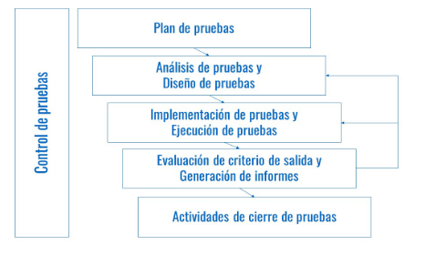
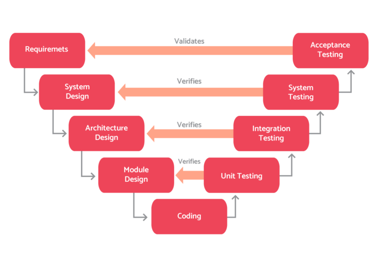

## 5.1 Pruebas

Las pruebas forman parte del trabajo normal de desarrollo. No son una fase "extra" que se hace al final, sino un conjunto de actividades que ayudan a comprobar si el software cumple su objetivo y si puede evolucionar con un nivel de riesgo razonable.

En esta parte de la unidad vamos a construir la base conceptual que después necesitaremos para trabajar pruebas unitarias, automatización y depuración. La idea no es memorizar una lista de nombres, sino entender **qué problema resuelve cada tipo de prueba** y **cuándo tiene sentido usarla**.

> Probar software consiste en planificar, diseñar y ejecutar comprobaciones para detectar defectos, validar comportamientos esperados y decidir si un producto está listo para pasar al siguiente nivel de uso.

| Código | Referencia literal trabajada |
| --- | --- |
| RA 3 | Verifica el funcionamiento de programas diseñando y realizando pruebas. |
| CE a | Se han identificado los diferentes tipos de pruebas. |
| CE b | Se han definido casos de prueba. |
| CE c | Se han identificado las herramientas de depuración y prueba de aplicaciones ofrecidas por el entorno de desarrollo. |
| CE f | Se han efectuado pruebas unitarias de clases y funciones. |
| CE g | Se han implementado pruebas automáticas. |
| CE h | Se han documentado las incidencias detectadas. |
| CE i | Se han utilizado dobles de prueba para aislar los componentes durante las pruebas. |

!!! abstract "Qué debes entender al terminar este tema"
    - Qué aportan las pruebas dentro del desarrollo de software.
    - Cómo se relacionan niveles, técnicas y tipos de prueba.
    - Cómo se diseñan casos de prueba razonables sin intentar probarlo todo.
    - Qué debe incluir un plan de pruebas para que resulte útil de verdad.

### 1. Introducción

Las pruebas de software son el proceso de evaluación de un sistema o aplicación para determinar si cumple los requisitos especificados y funciona correctamente. Su objetivo principal es doble:

1. Garantizar la calidad del software.
2. Minimizar el riesgo de errores en el producto final.

Cuando hablamos de **calidad del software**, no nos referimos solo a que "funcione". También hablamos de usabilidad, rendimiento, seguridad, mantenibilidad y capacidad para responder bien en diferentes contextos de uso.

#### 1.1. Importancia de las pruebas de software

Las pruebas son uno de los puntos más importantes del proceso de desarrollo porque ayudan a localizar problemas en etapas tempranas. Eso tiene una consecuencia muy práctica: corregir un error antes de entregar el producto suele costar mucho menos que detectarlo cuando ya está en producción.

Los problemas que se pueden detectar con pruebas incluyen, entre otros:

- incumplimientos de requisitos;
- fallos de seguridad;
- problemas de rendimiento;
- problemas de usabilidad;
- errores de lógica;
- comportamientos inesperados al integrar componentes.

#### 1.2. Beneficios de realizar pruebas de software

Trabajar con pruebas aporta beneficios concretos:

- identificación temprana de errores;
- mejora de la calidad del producto;
- reducción de costes de corrección;
- reducción del riesgo en producción;
- mayor confianza del equipo y del cliente.

!!! note "Idea importante"
    Una prueba no demuestra que el software esté libre de errores. Lo que demuestra es que, en los escenarios comprobados, el sistema ha respondido como se esperaba.

### 2. Verificación y prueba de programas

La **ISTQB** (*International Software Testing Qualifications Board*) define la verificación y prueba de programas como el proceso que abarca actividades estáticas y dinámicas relacionadas con la planificación, preparación y evaluación de productos software para comprobar si satisfacen los requisitos y para detectar defectos.

Dicho de forma más sencilla: probar no es solo ejecutar tests. También implica revisar documentación, pensar casos, preparar datos, analizar resultados y decidir si el sistema está listo para avanzar.

#### 2.1. Principios básicos

Los principios básicos que orientan el proceso de pruebas son los siguientes:

- Las pruebas demuestran la **presencia** de defectos, no la ausencia total de ellos.
- Las pruebas exhaustivas no existen, salvo en casos muy triviales.
- Las pruebas tempranas ayudan a reducir costes.
- Los defectos suelen concentrarse en un número reducido de módulos.
- Repetir siempre los mismos casos de prueba acaba perdiendo eficacia.
- Las pruebas dependen del contexto del proyecto.
- Corregir errores no basta si el sistema sigue sin cubrir necesidades reales de uso.

Estas ideas obligan a pensar con criterio. No se trata de probar más por probar, sino de **probar mejor**.

#### 2.2. El ciclo de vida de las pruebas

Las pruebas también tienen su propio ciclo de trabajo. No empiezan en el momento de pulsar "ejecutar test", sino antes, cuando el equipo decide qué debe comprobar, con qué prioridad y bajo qué criterio de salida.

<figure markdown>
  
  <figcaption>Ciclo de vida de las pruebas: planificación, diseño, ejecución, evaluación y cierre.</figcaption>
</figure>

Las actividades principales del ciclo de vida son:

1. **Planificación y control**: se establecen objetivos, alcance, estrategia y seguimiento.
2. **Análisis y diseño**: se transforman los objetivos en condiciones y casos de prueba tangibles.
3. **Implementación y ejecución**: se preparan datos, entornos, scripts y se lanzan las pruebas.
4. **Evaluación de criterios de salida**: se comparan resultados y se decide si hay que repetir, corregir o cerrar.
5. **Actividades de cierre**: se documentan incidencias, aceptación, lecciones aprendidas y estado final.


#### 2.3. Niveles

Según ISTQB, el proceso de prueba puede ejecutarse en varios niveles:

- **Pruebas unitarias**: comprueban el funcionamiento de una unidad pequeña de código.
- **Pruebas de integración**: validan la interacción entre varias partes del sistema.
- **Pruebas de sistema**: revisan el comportamiento del sistema completo.
- **Pruebas de aceptación**: verifican si el producto está listo para su despliegue y uso real.

Los niveles de prueba están relacionados con las fases del desarrollo. Esa relación suele explicarse con el modelo V:

<figure markdown>
  
  <figcaption>Relación entre fases de desarrollo y niveles de prueba en el modelo V.</figcaption>
</figure>

!!! tip "Cómo recordar los niveles"
    Cuanto más abajo estás, más pequeña y técnica es la unidad que pruebas. Cuanto más arriba estás, más se parece la prueba al uso real del sistema.

### 3. Técnicas de verificación y prueba de programas

Las técnicas pueden clasificarse según si el código se ejecuta o no durante la comprobación.

#### 3.1. Técnicas dinámicas

Las técnicas dinámicas requieren ejecutar el software para observar su comportamiento. Dentro de ellas suelen diferenciarse las pruebas de caja negra y las de caja blanca.

##### 3.1.1. Pruebas de caja negra

En las pruebas de caja negra se diseñan casos a partir de entradas y salidas, sin apoyarse en la estructura interna del código. Son muy habituales en pruebas funcionales, no funcionales y de regresión.

Algunas técnicas frecuentes son estas:

- **Partición equivalente**: divide entradas válidas y no válidas en grupos de comportamiento similar.
- **Análisis de valores límite**: se centra en los extremos donde suelen aparecer fallos.
- **Pruebas de transición de estado**: analizan cambios de estado válidos e inválidos.
- **Pruebas de caso de uso**: siguen escenarios de uso real del sistema.
- **Pruebas según la experiencia**: se apoyan en intuición y experiencia previa para detectar riesgos.

Por ejemplo, si una nota válida debe estar entre `0` y `10`, una partición equivalente sencilla sería esta:

| Clases | Valores inferiores a los válidos | Valores válidos | Valores superiores a los válidos |
| --- | --- | --- | --- |
| Valores representativos | `-1` | `0`, `10` | `11` |

Lo importante aquí es entender que no hace falta probar todos los enteros posibles. Basta con escoger representantes útiles de cada grupo y cubrir los límites relevantes.

##### 3.1.2. Pruebas de caja blanca

En las pruebas de caja blanca sí interesa la estructura interna del sistema. Se trabaja sobre rutas, decisiones, condiciones y cobertura de código.

Entre las técnicas más utilizadas están:

- **Pruebas de camino básico**: usan el grafo de flujo y la complejidad ciclomática para definir caminos de ejecución independientes.
- **Cobertura de sentencias**: mide qué porcentaje de instrucciones del código han sido ejecutadas por la batería de pruebas.
- **Cobertura de ramas**: comprueba si se han recorrido las distintas decisiones posibles.

Estas técnicas son útiles cuando queremos saber no solo si el sistema "parece funcionar", sino también qué partes del código han sido realmente ejercitadas por los tests.

#### 3.2. Técnicas estáticas

Las técnicas estáticas no requieren ejecutar el programa. Se basan en revisar, inspeccionar o analizar artefactos del proyecto.

Ejemplos habituales:

##### 3.2.1. Revisión de código

Consiste en inspeccionar manualmente el código fuente para detectar errores, problemas de estilo o mejoras posibles.

##### 3.2.2. Análisis estático automatizado

Utiliza herramientas como **SonarQube** o distintos **linters** para localizar defectos potenciales, problemas de calidad o incumplimientos de reglas.

##### 3.2.3. Inspecciones

Son revisiones más formales, con preparación previa y roles definidos dentro del equipo.

##### 3.2.4. Caminatas de código

El autor del código guía al resto del equipo por la solución para explicar la lógica y recibir retroalimentación.

##### 3.2.5. Auditorías

Comprueban si código, documentación y procedimientos cumplen normas o requisitos establecidos.

##### 3.2.6. Análisis de documentación y requisitos

Revisan requisitos, diseños y documentación para detectar ambigüedades, omisiones e inconsistencias antes de que lleguen al código.

!!! note "Complementariedad"
    Las pruebas estáticas y las dinámicas no compiten entre sí. Las primeras ayudan a detectar problemas pronto; las segundas comprueban el comportamiento en ejecución.

### 4. Tipos de pruebas de software

Además del nivel y de la técnica, en clase conviene distinguir **qué aspecto del sistema queremos validar**. A continuación se recogen los tipos más habituales que ya aparecían en el material base.

#### 4.1. Pruebas unitarias

Las pruebas unitarias evalúan el funcionamiento individual de una unidad de código, como una función, un método o una clase. Normalmente se realizan en aislamiento para comprobar si esa pieza responde correctamente.

**Ejemplo**: en una aplicación de gestión de tareas, una prueba unitaria puede comprobar que la función de creación de tareas genera correctamente una tarea válida a partir de unos datos de entrada.

#### 4.2. Pruebas de integración

Las pruebas de integración evalúan cómo varias unidades de código colaboran entre sí. Buscan detectar fallos en interfaces, intercambio de datos y secuencia de llamadas.

**Ejemplo**: en una aplicación de comercio electrónico, una prueba de integración puede comprobar que el módulo de pago y el módulo de compras actualizan correctamente el pedido tras una transacción.

#### 4.3. Pruebas de sistema

Las pruebas de sistema evalúan el software como un producto completo, en un entorno más realista que el de las pruebas unitarias o de integración.

**Ejemplo**: en una aplicación de chat, una prueba de sistema puede comprobar que varios usuarios se conectan, envían mensajes y mantienen la sesión de forma estable.

#### 4.4. Pruebas de aceptación

Las pruebas de aceptación verifican si el sistema cumple con los requisitos y expectativas del usuario final o del cliente.

**Ejemplo**: en una aplicación de reservas de vuelos, una prueba de aceptación puede validar que el usuario busca vuelos, selecciona asiento y finaliza la reserva correctamente.

#### 4.5. Pruebas de regresión

Las pruebas de regresión comprueban que un cambio reciente no ha roto funciones que antes sí funcionaban.

**Ejemplo**: tras modificar un editor de imágenes, se revisa que la exportación, la aplicación de filtros y la edición básica siguen funcionando.

#### 4.6. Pruebas de carga

Las pruebas de carga evalúan el comportamiento del sistema cuando soporta una demanda elevada, normalmente dentro de escenarios esperables.

**Ejemplo**: simular cientos de usuarios concurrentes sobre una aplicación web y medir tiempos de respuesta, errores y transacciones completadas.

#### 4.7. Pruebas de rendimiento

Las pruebas de rendimiento se centran en la velocidad, estabilidad y escalabilidad del sistema bajo distintas cargas de trabajo.

**Ejemplo**: en una plataforma de *streaming*, comprobar tiempos de carga, calidad de reproducción y comportamiento en varias resoluciones.

#### 4.8. Pruebas de seguridad

Las pruebas de seguridad evalúan la capacidad del software para proteger datos, accesos y recursos frente a usos indebidos o ataques.

**Ejemplo**: en una aplicación de contraseñas, verificar fortaleza de claves, cifrado de datos y políticas de acceso.

Como ves, estos tipos de pruebas no se excluyen entre sí. Una misma prueba puede ser de integración y, al mismo tiempo, funcional o de seguridad, según qué queramos medir.

### 5. Plan de pruebas

Un plan de pruebas es el documento que describe cómo se realizarán las pruebas, qué objetivos persiguen y qué expectativas deben cumplirse. No tiene por qué ser enorme, pero sí debe dejar claro **qué se va a probar, cómo, con qué medios y con qué criterio se considerará suficiente**.

#### 5.1. Definición del alcance de las pruebas

Aquí se establecen los límites: qué funcionalidades, módulos o flujos forman parte del esfuerzo de pruebas y cuáles quedan fuera.

**Ejemplo**: en una tienda *online*, el alcance puede incluir registro de usuarios, carrito, pago, gestión de cuenta y catálogo de productos.

#### 5.2. Identificación de los recursos necesarios para las pruebas

Hay que identificar qué personas, equipos, datos, entornos y herramientas se necesitan para ejecutar las pruebas de forma realista.

**Ejemplo**: varios navegadores, sistemas operativos distintos, datos de prueba y un servidor de preproducción.

#### 5.3. Selección de herramientas de pruebas

La elección de herramientas debe responder a necesidades concretas del proyecto.

**Ejemplo**: Selenium para pruebas funcionales web, JMeter para carga, y Kotest o MockK para pruebas automatizadas en Kotlin.

#### 5.4. Diseño de casos de prueba

Los casos de prueba describen pasos, datos, precondiciones y resultados esperados para validar el comportamiento del software.

Un caso de prueba bien planteado suele responder a estas preguntas:

- ¿qué quiero comprobar?;
- ¿en qué condiciones iniciales?;
- ¿qué datos uso?;
- ¿qué acción ejecuto?;
- ¿qué resultado espero?;
- ¿cómo sabré si ha fallado?

Por ejemplo, en una aplicación de gestión de tareas podrían definirse casos como:

- creación correcta de tareas;
- asignación de tareas a usuarios;
- edición de fechas y responsables;
- eliminación permitida y eliminación restringida según contexto.

#### 5.5. Asignación de responsabilidades

Conviene dejar claro quién diseña, ejecuta, revisa y documenta cada parte del proceso de pruebas.

**Ejemplo**: una persona del equipo puede encargarse de integración, otra de sistema y otra de aceptación o de registro de incidencias.

#### 5.6. Cronograma de pruebas

El cronograma organiza fases, plazos y dependencias entre actividades.

Un ejemplo simple podría ser:

- **Semana 1**: revisión de casos de prueba, configuración del entorno y pruebas unitarias.
- **Semana 2**: pruebas de interfaz y de rendimiento.
- **Semana 3**: pruebas de aceptación y documentación de resultados.
- **Semana 4**: revisión final y decisión sobre la entrega.

#### 5.7. Plantilla mínima de un caso de prueba

| Campo | Ejemplo |
| --- | --- |
| Identificador | CP-VAL-01 |
| Objetivo | Verificar que la nota mínima válida es `0` |
| Precondición | La función recibe un entero |
| Entrada | `0` |
| Resultado esperado | Devuelve `true` |
| Estado | Pendiente / superado / fallido |

#### 5.8. Ejemplo rápido con valores límite

Supón esta función:

```kotlin
fun notaValida(nota: Int): Boolean = nota in 0..10
```

Si pensamos como docentes y no solo como programadores, no basta con probar un `5`. Lo razonable es cubrir:

- un valor claramente válido, como `5`;
- el límite inferior, `0`;
- el límite superior, `10`;
- un valor por debajo, `-1`;
- un valor por encima, `11`.

Ese razonamiento ataca justo donde suelen aparecer errores de comparación.

### 6. Pruebas de integración

Las pruebas de integración comprueban cómo interactúan varios componentes cuando se conectan entre sí. Se realizan después de las pruebas unitarias y antes de las pruebas de sistema.

#### 6.1. Tipos de pruebas de integración

Según el orden en el que se integran los componentes, podemos hablar de:

- **integración ascendente**: se empieza por componentes de nivel bajo y se sube progresivamente;
- **integración descendente**: se empieza por los módulos de nivel alto y se baja hacia dependencias más concretas;
- **integración híbrida**: combina ambos enfoques según convenga en el proyecto.

#### 6.2. Estrategias para realizar pruebas de integración

Algunas estrategias comunes son:

- **Big-Bang**: se integran todos los componentes a la vez;
- **por módulos**: se integran grupos lógicos y luego el conjunto completo;
- **de fachada**: se usan interfaces provisionales para componentes todavía no disponibles;
- **con *stub* y *driver***: se simulan componentes faltantes para poder probar interacciones antes de tener todo el sistema completo.

#### 6.3. Ejemplo guiado

Imagina un sistema de compras en línea con tres módulos:

- autenticación de usuarios;
- gestión del carrito;
- procesamiento de pagos.

Si seguimos una estrategia ascendente por módulos, el proceso podría ser este:

1. Se prueban primero los componentes del módulo de autenticación.
2. Se integran esos componentes y se validan flujos como registro e inicio de sesión.
3. Después se incorpora el módulo del carrito y se revisa la interacción con autenticación.
4. Por último se integra el módulo de pagos y se comprueba el flujo completo de compra.

Lo importante aquí es entender que la integración no consiste solo en "juntar piezas", sino en comprobar si colaboran correctamente sin introducir conflictos.

### 7. Pruebas de sistema

Las pruebas de sistema evalúan el sistema completo para comprobar si cumple requisitos y especificaciones antes de pasar a la aceptación.

#### 7.1. Tipos de pruebas de sistema

Dentro de las pruebas de sistema es habitual encontrar:

1. **Pruebas funcionales**: validan funciones esperadas.
2. **Pruebas de rendimiento**: revisan tiempos de respuesta y estabilidad.
3. **Pruebas de carga**: comprueban la respuesta ante muchos usuarios o procesos.
4. **Pruebas de seguridad**: evalúan protección de datos y accesos.
5. **Pruebas de compatibilidad**: verifican funcionamiento en distintos entornos.
6. **Pruebas de usabilidad**: observan facilidad de uso y experiencia general.

#### 7.2. Estrategias para realizar pruebas de sistema

Las estrategias más comunes incluyen:

1. **Pruebas de casos de uso**: validan funcionalidades según flujos previstos.
2. **Pruebas de escenarios**: cubren situaciones habituales y poco comunes.
3. **Pruebas de extremo a extremo**: recorren procesos completos del sistema.
4. **Pruebas de seguridad**: añaden análisis de vulnerabilidades o intentos de acceso indebido.
5. **Pruebas de compatibilidad**: revisan hardware, navegador, sistema operativo o configuración.
6. **Pruebas de estrés**: fuerzan situaciones extremas para evaluar la resistencia del sistema.

**Ejemplo**: en una aplicación de citas médicas, una prueba de sistema podría recorrer el flujo completo desde el alta del paciente hasta la confirmación por correo, comprobando además que la aplicación sigue respondiendo correctamente con varias peticiones simultáneas.

### 8. Pruebas de aceptación

Las pruebas de aceptación verifican si el sistema cumple los requisitos y expectativas del cliente o del usuario final. Se realizan al final del ciclo de desarrollo, antes de la entrega o del paso a producción.

#### 8.1. Tipos de pruebas de aceptación

Aunque pueden clasificarse de varias formas, en este tema interesa distinguir dos focos principales:

1. **Aceptación funcional**: comprueba si el sistema hace lo que se pidió.
2. **Aceptación no funcional**: revisa aspectos como usabilidad, seguridad, compatibilidad, rendimiento, escalabilidad, disponibilidad o documentación.

#### 8.2. Estrategias para realizar pruebas de aceptación

Las estrategias más comunes son:

1. **Pruebas de aceptación funcional**: basadas en requisitos, casos de uso y escenarios de negocio.
2. **Pruebas de aceptación no funcional**: centradas en criterios de calidad que también forman parte de la definición de producto válido.

**Ejemplo**: en una aplicación de reservas de vuelos, una prueba de aceptación funcional podría validar que una persona usuaria completa la reserva sin errores; una prueba de aceptación no funcional podría comprobar que el tiempo de respuesta se mantiene dentro del límite fijado.

### 9. Relación entre pruebas y calidad

Probar no equivale a medir toda la calidad, pero sí aporta indicadores útiles. Algunos ejemplos de medidas frecuentes son:

- porcentaje de cobertura;
- número de defectos detectados por versión;
- defectos críticos abiertos frente a cerrados;
- tiempo medio de corrección;
- estabilidad de la batería de pruebas automáticas.

!!! warning "Error habitual"
    Una cobertura alta no significa automáticamente que el sistema esté bien probado. Puedes ejecutar mucho código y seguir sin validar comportamientos importantes.

Por eso, las métricas deben interpretarse junto con el diseño de casos, el riesgo del proyecto y la criticidad del software.

### 10. Qué debe llevarse el alumnado de este tema

La idea principal de este tema es que **probar software consiste en diseñar comprobaciones útiles para reducir riesgo y validar calidad**, no en ejecutar ejemplos aislados sin criterio. Un equipo profesional combina niveles de prueba, técnicas de diseño de casos y planificación para comprobar si el producto se comporta como debe antes de seguir avanzando.

Antes de pasar a herramientas concretas, conviene quedarse con esta idea: las pruebas no son un trámite burocrático ni una colección de test sueltos. Son una actividad de ingeniería que ayuda a tomar decisiones con más información y menos intuición.

Si entiendes la diferencia entre niveles, técnicas, tipos, casos de prueba y plan de pruebas, ya tienes la base necesaria para abordar con sentido temas como pruebas unitarias, automatización, dobles de prueba o depuración.

## Fuentes y referencias

- ISTQB, glosarios y materiales introductorios sobre fundamentos de pruebas de software: <https://www.istqb.org/>.

## Presentación

