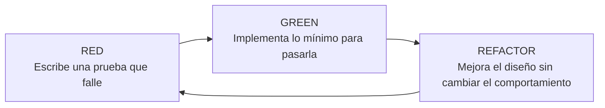
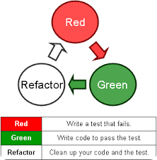
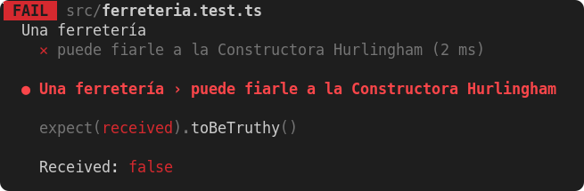
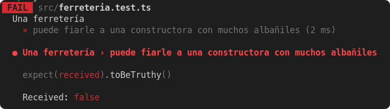

## 5.2 Test de unidad y TDD

En este bloque vamos a centrarnos en dos ideas que suelen ir de la mano en un entorno profesional: **probar el código a nivel de unidad** y **usar esas pruebas para orientar el diseño**. La primera nos ayuda a detectar errores pronto; la segunda nos obliga a pensar mejor qué debería hacer el software antes de lanzarnos a implementarlo.

La normativa del módulo conecta este contenido con la verificación del software, el diseño de casos de prueba y la automatización de comprobaciones durante el desarrollo.

| Código | Descripción |
| --- | --- |
| RA3 | Verifica el funcionamiento de programas diseñando y realizando pruebas. |
| CE b | Se han definido casos de prueba. |
| CE f | Se han efectuado pruebas unitarias de clases y funciones. |
| CE g | Se han implementado pruebas automáticas. |
| CE i | Se han utilizado dobles de prueba para aislar los componentes durante las pruebas. |

!!! abstract "Qué vas a aprender en este apartado"
    - Entender qué es una prueba unitaria y qué valor aporta.
    - Diferenciar pruebas unitarias y desarrollo guiado por pruebas.
    - Diseñar casos de prueba usando clases de equivalencia y valores límite.
    - Escribir tests más expresivos y fáciles de mantener.

### 1. Idea clave del tema

Lo importante aquí es entender que una prueba unitaria no solo sirve para "comprobar si algo funciona". Bien planteada, también sirve para **documentar el comportamiento esperado**, **detectar regresiones** y **diseñar código más claro y mantenible**.

### 2. Qué es una prueba unitaria

Una **prueba unitaria** es una comprobación automatizada sobre una parte pequeña del sistema, normalmente una clase, una función o un método. Su objetivo es verificar que esa unidad se comporta como esperamos en un escenario concreto.

Dicho de forma sencilla: si una pieza del programa tiene una responsabilidad clara, deberíamos poder probarla de forma aislada y comprobar si responde bien ante distintas entradas.

En la práctica, estas pruebas suelen ejecutarse durante el desarrollo y forman parte del trabajo habitual del equipo técnico. Lo más frecuente es que las escriba el propio equipo de desarrollo, aunque también pueden intervenir perfiles de QA cuando el proyecto lo requiere.

!!! note "Qué significa aislar una unidad"
    Aislar una unidad no siempre implica dejarla completamente sola, pero sí evitar que el resultado del test dependa de factores externos como una base de datos, una API remota o el sistema de ficheros, salvo que eso sea precisamente lo que queremos probar.

### 3. Por qué merece la pena hacer pruebas unitarias

Existe el mito de que escribir pruebas hace perder tiempo. En realidad, lo habitual es lo contrario: **el tiempo que inviertes en probar antes lo recuperas cuando corriges menos fallos tarde**.

Las pruebas unitarias aportan valor porque:

- detectan errores en fases tempranas;
- facilitan refactorizaciones seguras;
- documentan el comportamiento esperado del código;
- mejoran la comprensión del proyecto por parte del equipo;
- reducen el coste de corregir errores descubiertos demasiado tarde;
- permiten automatizar comprobaciones que, de otro modo, repetiríamos manualmente.

Cuando una batería de pruebas está bien construida, el equipo puede cambiar el diseño interno del código con más confianza, porque dispone de una red de seguridad que avisa si algo se rompe.

### 4. Qué hace que un test unitario sea útil

No basta con "tener tests". Un test aporta valor cuando cumple varias condiciones:

- es **claro**: al leerlo se entiende qué comportamiento describe;
- es **pequeño**: cubre una idea concreta, no cinco a la vez;
- es **estable**: no falla a veces sí y a veces no;
- es **automático**: puede ejecutarse tantas veces como haga falta;
- es **relevante**: comprueba algo importante para el comportamiento del sistema.

Una buena regla práctica es esta: si el nombre del test no deja claro qué pretende demostrar, probablemente el diseño del propio test necesita revisión.

### 5. Desarrollo guiado por pruebas: qué es TDD

El **desarrollo guiado por pruebas** o **TDD** (*Test Driven Development*) propone una forma distinta de trabajar: en lugar de escribir primero la implementación y probarla después, **escribimos antes la prueba que describe el comportamiento esperado**.

Esto puede resultar incómodo al principio, porque obliga a pensar antes de programar. Precisamente por eso es útil: TDD no consiste solo en generar pruebas, sino en **utilizar las pruebas como herramienta de diseño**.

> TDD no es "hacer muchos tests". TDD consiste en diseñar el comportamiento del software desde fuera, pensando primero en su uso y después en su implementación.

#### 5.1. Las dos ideas de fondo

Podemos resumir la técnica en dos ideas muy directas:

1. No escribas funcionalidad sin una prueba que falle antes.
2. Si no sabes cómo expresar una prueba, probablemente todavía no tienes claro el requisito.

La consecuencia práctica es importante: **si no puedes formular qué debería pasar, aún no deberías estar programando cómo hacerlo**.

#### 5.2. El ciclo RED, GREEN, REFACTOR

TDD suele explicarse mediante un ciclo muy corto:



También puedes verlo en el esquema clásico del tema:

<figure markdown>
  
  <figcaption>Ciclo TDD: prueba que falla, implementación mínima y refactorización.</figcaption>
</figure>

Cada fase tiene un objetivo distinto:

- **RED**: obligarte a definir el comportamiento esperado.
- **GREEN**: resolver solo lo necesario para cumplir esa expectativa.
- **REFACTOR**: mejorar el diseño una vez que el comportamiento ya está protegido por las pruebas.

Lo importante aquí es no saltarse la tercera fase. Si solo escribes pruebas y código mínimo, pero nunca refactorizas, terminarás con una solución que funciona pero que puede degradarse con rapidez.

### 6. Diseñar casos de prueba con criterio

Una de las dificultades reales al empezar no es escribir la sintaxis del test, sino **decidir qué escenarios merece la pena probar**.

Para eso conviene pensar en términos de:

- reglas de negocio;
- clases de equivalencia;
- valores límite;
- casos representativos;
- errores frecuentes.

#### 6.1. Dominio de ejemplo

Vamos a trabajar con este requisito:

> Una ferretería decide si puede fiar a un cliente según su tipo y su deuda.
>
> - A un cliente particular solo le fía si no debe nada.
> - A una constructora le fía según el número de albañiles:
>   - con 5 o más albañiles, hasta 10.000 €;
>   - con menos de 5 albañiles, hasta 5.000 €.

Este ejemplo es útil porque obliga a probar varias combinaciones sin ser excesivamente complejo.

#### 6.2. Clases de equivalencia

Una **clase de equivalencia** agrupa entradas que deberían producir el mismo comportamiento. Usarla nos evita escribir tests redundantes.

Para el cliente particular tenemos dos escenarios relevantes:

- no debe nada;
- debe algo.

Para una constructora aparecen dos grupos por número de albañiles:

- **pocos albañiles**: menos de 5;
- **muchos albañiles**: 5 o más.

Si combinamos tipo de cliente, número de albañiles y deuda, podemos definir los escenarios de prueba sin probar infinitas combinaciones.

#### 6.3. Escenarios representativos

Una posible selección razonable sería esta:

- Cliente particular sin deuda: se le puede fiar.
- Cliente particular con deuda: no se le puede fiar.
- Constructora con muchos albañiles y deuda de hasta 10.000 €: se le puede fiar.
- Constructora con muchos albañiles y deuda superior a 10.000 €: no se le puede fiar.
- Constructora con pocos albañiles y deuda de hasta 5.000 €: se le puede fiar.
- Constructora con pocos albañiles y deuda superior a 5.000 €: no se le puede fiar.

Fíjate en una idea importante: para representar la frontera entre "pocos" y "muchos" elegimos valores cercanos al límite, por ejemplo **4** y **5**. Esto ayuda a detectar errores típicos en condiciones del tipo `>` frente a `>=`.

### 7. Cómo agrupar y nombrar los tests

Un error habitual es escribir pruebas correctas desde el punto de vista técnico, pero difíciles de leer. Si eso ocurre, el test funciona como comprobación automática, pero falla como documentación.

En frameworks como Kotest es habitual agrupar escenarios con bloques `describe` e `it`.

```kotlin
describe("Un cliente particular") {
    // escenarios de cliente particular
}

describe("Una constructora con pocos albañiles") {
    // escenarios con menos de 5 albañiles
}

describe("Una constructora con muchos albañiles") {
    // escenarios con 5 o más albañiles
}
```

Esta organización mejora la cohesión porque:

- separa contextos de negocio distintos;
- evita mezclar fixtures innecesarios;
- facilita leer el resultado cuando un test falla.

#### 7.1. Nombres expresivos

Si llamas a una variable `constructoraHurlingham` y el test falla, el nombre aporta muy poca información sobre el escenario de negocio. En cambio, `constructoraConMuchosAlbaniles` deja claro qué representa esa instancia dentro del caso de prueba.

Veamos un ejemplo con poca expresividad:

```kotlin
class FerreteriaTest : DescribeSpec({
    describe("Una ferretería") {
        it("puede fiarle a la Constructora Hurlingham") {
            val constructoraHurlingham = EmpresaConstructora(
                albaniles = 5,
                deuda = 7000
            )

            constructoraHurlingham.puedePedirFiado().shouldBeTrue()
        }
    }
})
```

Si además el código de negocio tiene un error como este:

```kotlin
class EmpresaConstructora(
    val cantidadAlbaniles: Int,
    deuda: Int
) : Cliente(deuda) {

    // Error: debería ser >= 5
    fun montoMaximoDeuda() = if (cantidadAlbaniles > 5) 10000 else 5000

    override fun puedePedirFiado() = deuda <= montoMaximoDeuda()
}
```

<figure markdown>
  
  <figcaption>Cuando el test no es expresivo, cuesta más entender por qué falla.</figcaption>
</figure>

Ahora el mismo caso, pero con nombres más cercanos al dominio:

```kotlin
class FerreteriaTest : DescribeSpec({
    describe("Una ferretería") {
        it("puede fiarle a una constructora con muchos albañiles") {
            val constructoraConMuchosAlbaniles = EmpresaConstructora(
                albaniles = 5,
                deuda = 7000
            )

            constructoraConMuchosAlbaniles.puedePedirFiado().shouldBeTrue()
        }
    }
})
```

<figure markdown>
  
  <figcaption>Un nombre más expresivo hace que el fallo del test sea más informativo.</figcaption>
</figure>

En la práctica esto significa que el test no solo te dice que algo ha fallado, sino también **qué regla del negocio parecía incumplirse**.

### 8. Patrón AAA: Arrange, Act, Assert

Una forma muy extendida de estructurar pruebas es el patrón **AAA**:

- **Arrange**: preparar datos, objetos y contexto;
- **Act**: ejecutar la operación que queremos probar;
- **Assert**: comprobar el resultado esperado.

No es una ley rígida, pero sí una guía útil para revisar si un test está bien enfocado.

```kotlin
describe("Un ave") {
    it("pierde energía al volar") {
        // Arrange
        val pepita = Ave(1000)

        // Act
        pepita.volar()

        // Assert
        pepita.energia.shouldBe(900)
    }
}
```

Cuando un test mezcla demasiadas cosas en cada fase, suele ser señal de que estamos probando demasiado en un único caso.

### 9. Buenas prácticas al trabajar con tests unitarios

Como cierre operativo, conviene quedarse con estas pautas:

- prueba comportamientos, no detalles internos irrelevantes;
- usa nombres que expliquen el escenario;
- evita fixtures innecesariamente complejos;
- selecciona casos representativos y valores límite;
- escribe tests pequeños y fáciles de leer;
- refactoriza también los tests cuando sea necesario.

!!! tip "Lo que debería recordar el alumnado"
    Un buen test no es solo el que pasa, sino el que ayuda a entender el comportamiento del sistema y detecta con claridad cuándo algo deja de funcionar.

### 10. Conclusión

Las pruebas unitarias son una herramienta de calidad, pero también una herramienta de diseño. TDD lleva esta idea un paso más allá: obliga a pensar primero en el comportamiento esperado y después en la implementación.

Si te quedas con una sola idea de este tema, que sea esta: **cuando una prueba está bien elegida y bien escrita, no solo verifica código; también explica qué problema resuelve ese código y cómo debería comportarse**.

## Fuentes y referencias

- [¿Qué es TDD?](https://www.digite.com/es/agile/desarrollo-dirigido-por-pruebas-tdd/)
- [Cómo elaborar casos de prueba](https://surprograma.github.io/libro-disenio-oop/docs/pruebas-automatizadas/elaborar-casos-prueba/)
- [Test unitario avanzado](http://wiki.uqbar.org/wiki/articles/testeo-unitario-avanzado.html)
- [Diseño de software](https://surprograma.github.io/libro-disenio-oop/docs/intro/)
- [TDD Veloz](https://www.youtube.com/watch?v=8MGtLPFtbQ8)
