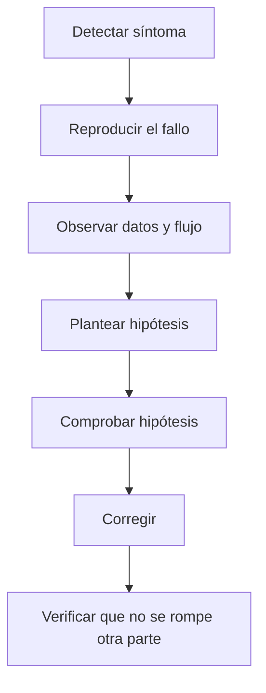
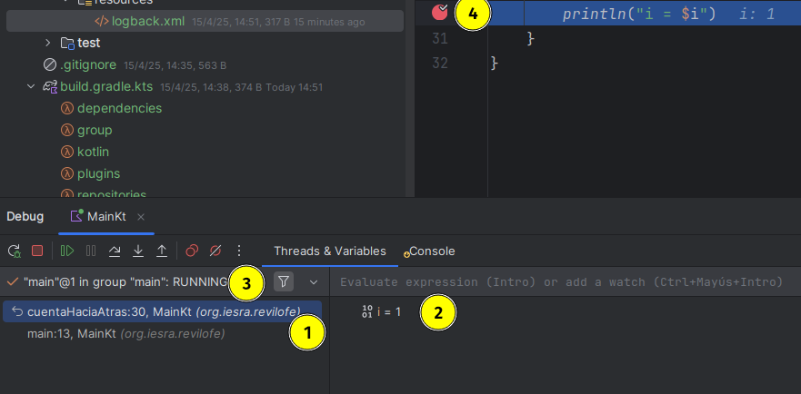

## 5.3 Depuración

Depurar no consiste solo en "arreglar un fallo". En realidad, depurar significa **entender qué está ocurriendo en el programa, por qué ocurre y en qué punto se rompe la lógica esperada**. Esa diferencia es importante, porque si solo parcheamos el síntoma sin comprender la causa, el error volverá a aparecer de otra forma.

En este tema vamos a trabajar la depuración como una habilidad técnica del día a día: observar el comportamiento del programa, formular hipótesis, verificar qué está pasando y corregir el código con criterio.

| Código | Descripción literal |
| --- | --- |
| RA 3 | Verifica el funcionamiento de programas diseñando y realizando pruebas. |
| CE c | Se han identificado las herramientas de depuración y prueba de aplicaciones ofrecidas por el entorno de desarrollo. |
| CE d | Se han utilizado herramientas de depuración para definir puntos de ruptura y seguimiento. |
| CE e | Se han utilizado las herramientas de depuración para examinar y modificar el comportamiento de un programa en tiempo de ejecución. |

!!! abstract "Qué debes entender al terminar este tema"
    - Qué significa depurar y por qué no equivale simplemente a corregir errores.
    - Qué herramientas ofrece un IDE para observar la ejecución de un programa.
    - Qué estrategias ayudan a encontrar la causa real de un fallo.
    - Cómo aplicar la depuración a código Kotlin de forma ordenada y profesional.

### 1. Qué es depurar y por qué importa

La depuración es el proceso de **identificar, analizar y corregir errores** en un programa. Esto incluye errores de lógica, problemas en tiempo de ejecución, condiciones inesperadas y comportamientos que no coinciden con lo que el equipo esperaba.

Dicho de forma sencilla: cuando el programa no hace lo que debería, depurar consiste en averiguar **qué dato, condición o decisión está rompiendo el comportamiento esperado**.

La depuración importa por varias razones:

- ayuda a encontrar fallos antes de que lleguen a producción;
- reduce tiempo perdido en cambios a ciegas;
- mejora la calidad del software;
- permite comprender mejor el propio código;
- facilita el mantenimiento cuando el proyecto crece.

> Lo importante aquí es entender que depurar no es una fase separada del desarrollo. Es parte del trabajo normal de programar.

### 2. La idea clave: observar antes de tocar

Un error suele generar una reacción impulsiva: cambiar código enseguida. Sin embargo, eso muchas veces empeora el problema. Una buena depuración empieza observando.

Cuando aparece un fallo, conviene responder a estas preguntas antes de modificar nada:

- ¿qué debería ocurrir?;
- ¿qué está ocurriendo de verdad?;
- ¿en qué punto exacto divergen ambos comportamientos?;
- ¿con qué datos se reproduce?;
- ¿el fallo es constante o depende del contexto?



### 3. Tipos de ayuda que ofrece el entorno de desarrollo

La mayoría de IDE modernos ofrecen un conjunto de herramientas que facilitan muchísimo la depuración. En vez de mirar el código e imaginar qué está pasando, podemos parar la ejecución y observar el estado real del programa.

Las ayudas más habituales son estas:

- **puntos de ruptura** (*breakpoints*): detienen la ejecución en una línea concreta;
- **ejecución paso a paso**: permite avanzar instrucción a instrucción;
- **inspección de variables**: muestra nombres, tipos y valores actuales;
- **pila de llamadas**: explica desde qué funciones se ha llegado al punto actual;
- **evaluación de expresiones**: permite comprobar expresiones durante la pausa;
- **modificación de variables en caliente**: ayuda a probar hipótesis sin recompilar.

!!! note "Idea práctica"
    Un breakpoint no sirve solo para "parar". Sirve para congelar el programa en el momento útil y poder entender el contexto real del fallo.

### 4. Técnicas de depuración que conviene conocer

No siempre hace falta abrir un depurador complejo. Dependiendo del problema, pueden servir técnicas más simples. La clave está en elegir la herramienta adecuada para cada situación.

#### 4.1. Trazas rápidas con `println`

La técnica más simple consiste en imprimir valores o mensajes en puntos estratégicos del programa.

```kotlin
fun main() {
    val x = 5
    val y = 7
    val z = x + y
    println("z vale $z")
}
```

Esto puede resultar útil al empezar, pero tiene límites:

- si imprimes demasiado, pierdes visibilidad;
- si imprimes poco, puede que no veas la pista relevante;
- después tendrás que limpiar ese código auxiliar.

#### 4.2. Logging

El *logging* es una evolución más profesional de las trazas por consola. En lugar de imprimir mensajes sueltos, registras eventos con niveles, formato y destinos configurables.

En la práctica, esto significa que puedes ver solo lo relevante, guardar histórico y no depender de mensajes improvisados repartidos por el código.

#### 4.3. Depuración por bisección

Cuando no sabes dónde está el fallo, una estrategia útil es dividir el problema en dos zonas e intentar averiguar en cuál aparece.

Dicho de forma sencilla:

1. compruebas un punto intermedio;
2. si ahí ya falla, buscas antes;
3. si ahí todavía va bien, buscas después.

Esta técnica reduce mucho el espacio de búsqueda cuando el flujo es largo.

#### 4.4. Depuración del patito de goma

Puede sonar informal, pero funciona. Consiste en explicar el problema en voz alta, paso a paso, como si se lo contaras a otra persona o incluso a un objeto.

La utilidad real no está en "hablar con un pato", sino en que al verbalizar la lógica:

- ordenas tus ideas;
- detectas saltos mentales;
- localizas contradicciones entre lo que crees y lo que hace el código.

#### 4.5. Checks de sanidad y consistencia

Un **sanity check** comprueba si una condición básica tiene sentido antes de seguir. Un **consistency check** verifica si los datos siguen siendo coherentes dentro del sistema.

Ejemplo de *sanity check*:

```kotlin
fun calcularRaizCuadrada(numero: Double): Double {
    require(numero >= 0) { "El numero no puede ser negativo." }
    return kotlin.math.sqrt(numero)
}
```

Ejemplo de *consistency check*:

```kotlin
fun asignarRolAUsuario(usuario: Usuario, rol: String, rolesValidos: List<String>) {
    require(rol in rolesValidos) { "Rol no valido." }
    usuario.rol = rol
}
```

Estas comprobaciones no sustituyen a la depuración, pero ayudan a detectar antes situaciones incoherentes.

### 5. Flujo de trabajo razonable ante un bug

Un error no debería resolverse con cambios aleatorios hasta que "parezca funcionar". Eso genera soluciones frágiles y difíciles de mantener.

Un flujo de trabajo más sólido sería este:

1. **Reproduce el error** de forma fiable.
2. **Describe el comportamiento esperado** y el observado.
3. **Aísla el contexto**: datos, entrada, versión, entorno.
4. **Inspecciona el flujo de ejecución** con breakpoints o trazas.
5. **Formula una hipótesis** sobre la causa.
6. **Comprueba la hipótesis**.
7. **Corrige y vuelve a verificar**.
8. **Anota la incidencia** si el equipo lo necesita.

#### 5.1. Qué conviene documentar

Si el error debe compartirse con otra persona del equipo, conviene registrar:

- una descripción clara del fallo;
- pasos para reproducirlo;
- datos o configuración necesarios;
- entorno donde ocurre;
- capturas, logs o mensajes de error;
- comportamiento esperado y real.

Esto acelera muchísimo la corrección y evita que el bug se convierta en un "a veces pasa".

### 6. Uso del depurador en Kotlin con IntelliJ IDEA

En la unidad trabajaremos principalmente con Kotlin, así que tiene sentido centrarse en un entorno común como IntelliJ IDEA.

<figure markdown>
  
  <figcaption>Vista general del depurador en IntelliJ IDEA: breakpoints, variables, hilos y pila de llamadas.</figcaption>
</figure>

#### 6.1. Breakpoints

Un *breakpoint* es una marca que detiene la ejecución en una línea concreta. Desde ahí puedes inspeccionar variables, ver la pila de llamadas y avanzar paso a paso.

En IntelliJ IDEA suele bastar con pulsar en el margen izquierdo de la línea de código.

#### 6.2. Inspección de variables

Cuando la ejecución se detiene, el panel de variables muestra el valor actual de cada dato visible en ese punto.

Esto es especialmente útil cuando:

- un valor no debería ser `null` y lo es;
- una condición entra por una rama inesperada;
- una colección tiene un tamaño distinto del previsto;
- una variable cambia antes o después de lo esperado.

#### 6.3. Pila de llamadas

La pila de llamadas explica qué secuencia de funciones ha llevado al punto actual. Esto ayuda a entender el contexto, especialmente cuando el fallo aparece lejos del lugar donde realmente se originó.

#### 6.4. Modificación de variables en tiempo de ejecución

Algunos depuradores permiten cambiar un valor mientras el programa está detenido. Esto no sustituye a la corrección real, pero sirve para comprobar hipótesis con rapidez.

### 7. Casos en los que la depuración se complica

No todos los errores son iguales. Hay situaciones donde depurar resulta más difícil:

- **código asíncrono**: el flujo no es lineal y cuesta seguir qué ocurre primero;
- **multihilo**: varios hilos pueden interactuar y generar condiciones difíciles de reproducir;
- **errores intermitentes**: aparecen solo con ciertos datos o en ciertos momentos;
- **integraciones externas**: el fallo puede depender de una API, una base de datos o un servicio externo;
- **pruebas automáticas**: un test puede fallar no por el código principal, sino por cómo está montado el escenario.

En esos casos, lo importante es reducir incertidumbre:

- aislar dependencias;
- simplificar el escenario;
- registrar mejor el contexto;
- repetir el fallo con datos controlados.

### 8. Ejemplos prácticos

#### 8.1. Error por acceso nulo

```kotlin
fun main() {
    val texto: String? = null
    println(texto!!.length)
}
```

Aquí el problema no es "que Kotlin falle", sino que estamos forzando una suposición falsa: que `texto` no es nulo.

La depuración útil consistiría en:

1. detener la ejecución antes del acceso;
2. inspeccionar el valor de `texto`;
3. comprobar por qué llega `null`;
4. corregir el diseño para no forzar un valor inexistente.

#### 8.2. Error de lógica en un cálculo

```kotlin
fun main() {
    val listaNumeros = listOf(1, 2, 3, 4, 5)
    var suma = 0

    for (numero in listaNumeros) {
        suma = numero
    }

    println(suma)
}
```

El programa compila, pero la lógica está mal: `suma` no acumula, solo reemplaza.

Aquí el depurador ayuda mucho porque, al avanzar dentro del bucle, se observa que `suma` nunca crece como debería.

#### 8.3. Error de tipo o de conversión

```kotlin
fun main() {
    val num1: Int = 10
    val num2: Double = num1.toDouble()
    println(num2)
}
```

En este caso no hay error, pero sirve para recordar algo importante: muchas veces el fallo aparece porque el programa no expresa con claridad el cambio de tipo que necesita. Leer el mensaje del compilador y explicarlo paso a paso suele ser suficiente para entenderlo.

### 9. Errores frecuentes al depurar

- cambiar varias cosas a la vez sin saber cuál resolvió el problema;
- no reproducir el fallo de forma estable;
- ignorar el mensaje de error;
- quedarse solo con `println` incluso cuando el depurador daría más información;
- corregir el síntoma sin identificar la causa;
- no volver a probar el flujo completo tras la corrección.

!!! warning "Error habitual"
    La peor estrategia de depuración es la modificación aleatoria del código hasta que algo deja de fallar. Puede arreglar el síntoma, pero normalmente empeora el diseño.

## Conclusión

La idea principal de este tema es que **depurar consiste en observar con método para entender la causa real de un fallo**, no en tocar código a ciegas. Cuanto mejor domines el uso de breakpoints, variables, pila de llamadas, trazas y técnicas de análisis, más rápido podrás corregir errores y más fiable será el software que desarrolles.

## Presentación

Puedes utilizar la presentación asociada a este tema en:

- <https://revilofe.github.io/slides/section3-ed/ED-U5.3.-Depuracion.html>

## Fuentes y referencias

- Documentación de IntelliJ IDEA sobre depuración: <https://www.jetbrains.com/help/idea/debugging-code.html>
- Documentación de IntelliJ IDEA sobre breakpoints: <https://www.jetbrains.com/help/idea/using-breakpoints.html>
- Wikipedia, *Rubber duck debugging*: <https://en.wikipedia.org/wiki/Rubber_duck_debugging>
- Documentación oficial de Logback: <https://logback.qos.ch/manual/>
