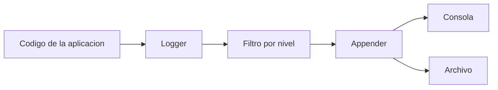

## 5.3.1 Logging

Cuando un programa crece, imprimir mensajes con `println()` deja de ser suficiente. Puede servir para una prueba rápida, pero no para analizar una aplicación real con varias clases, distintos entornos y errores que aparecen cuando nadie está mirando la pantalla.

Por eso existe el **logging**: un sistema de registro que permite saber qué está ocurriendo en la aplicación, con qué nivel de detalle y en qué contexto.

| Código | Descripción literal |
| --- | --- |
| RA 3 | Verifica el funcionamiento de programas diseñando y realizando pruebas. |
| CE c | Se han identificado las herramientas de depuración y prueba de aplicaciones ofrecidas por el entorno de desarrollo. |
| CE e | Se han utilizado las herramientas de depuración para examinar y modificar el comportamiento de un programa en tiempo de ejecución. |

!!! abstract "Qué debes entender al terminar este tema"
    - Qué problema resuelve un sistema de logging y por qué es mejor que `println()` para un proyecto real.
    - Qué elementos forman un sistema de logging moderno.
    - Cómo se configuran niveles, destinos y formato de mensajes.
    - Cómo usar SLF4J y Logback en un proyecto Kotlin/JVM.

### 1. Qué es el logging

El *logging* es el registro estructurado de eventos que ocurren durante la ejecución de un programa. Esos eventos pueden describir acciones normales, advertencias, errores o detalles internos útiles para diagnóstico.

Dicho de forma sencilla: un sistema de logging permite dejar "pistas ordenadas" sobre lo que hace la aplicación.

Eso sirve para:

- entender el flujo de ejecución;
- detectar errores;
- analizar fallos en producción;
- revisar qué ocurrió antes de una incidencia;
- sustituir trazas improvisadas por un sistema configurable.

> Lo importante aquí es entender que el logging no es solo para cuando algo falla. También sirve para observar el comportamiento normal del sistema.

### 2. Por qué `println()` se queda corto

Imprimir mensajes por consola puede ayudar al principio, pero en proyectos reales presenta problemas:

- no clasifica mensajes por gravedad;
- no permite filtrar fácilmente;
- mezcla depuración puntual con ejecución normal;
- obliga a modificar código para activar o desactivar mensajes;
- no suele dejar rastro persistente si solo escribe en consola.

Con logging, en cambio, puedes decidir:

- qué mensajes quieres ver;
- en qué entorno quieres verlos;
- dónde se guardan;
- con qué formato aparecen.

### 3. Cómo funciona un sistema de logging

Un sistema de logging moderno suele apoyarse en varios elementos que trabajan juntos:



#### 3.1. Logger

Es el objeto que emite mensajes desde el código. Lo habitual es que cada clase tenga su propio logger.

#### 3.2. Niveles de log

Sirven para clasificar mensajes por importancia. Los más comunes son:

| Nivel | Uso habitual |
| --- | --- |
| `TRACE` | Información extremadamente detallada |
| `DEBUG` | Datos útiles durante el desarrollo |
| `INFO` | Eventos normales del sistema |
| `WARN` | Situaciones anómalas no críticas |
| `ERROR` | Problemas que afectan al funcionamiento |

En algunas herramientas aparecen también `FATAL`, `OFF` o `ALL`, pero los anteriores son los más frecuentes en clase y en muchos proyectos JVM.

#### 3.3. Appenders

Un *appender* define el destino del mensaje:

- consola;
- archivo;
- servidor remoto;
- base de datos;
- herramientas de monitorización.

#### 3.4. Filtros y configuración

La configuración permite aceptar o rechazar mensajes según nivel, paquete, clase u otras reglas. Esto evita saturar el sistema con información irrelevante.

#### 3.5. Formato del mensaje

Un buen sistema de logging suele incluir:

- fecha y hora;
- nivel;
- nombre del logger;
- hilo de ejecución;
- mensaje;
- contexto adicional cuando haga falta.

### 4. Herramientas habituales en Kotlin/JVM

En el ecosistema Java y Kotlin es habitual encontrar estas piezas:

- **SLF4J**: una fachada común para no acoplar el código a una implementación concreta;
- **Logback**: una implementación muy extendida, flexible y cómoda de configurar;
- **Log4j**: otra implementación conocida, aunque en muchos proyectos actuales Logback ha ganado terreno;
- **Kotlin Logging**: una capa más idiomática para usar logging desde Kotlin.

En esta unidad tomaremos como referencia **SLF4J + Logback**, porque es una combinación muy habitual y suficientemente profesional para aprender bien el concepto.

### 5. Configuración básica con SLF4J y Logback

#### 5.1. Dependencias en Gradle

En un proyecto con `build.gradle.kts`, una configuración básica podría ser esta:

```kotlin
dependencies {
    implementation("org.slf4j:slf4j-api:2.0.9")
    implementation("ch.qos.logback:logback-classic:1.4.11")
}
```

La idea de fondo es simple:

- SLF4J ofrece la API;
- Logback ofrece la implementación real.

#### 5.2. Archivo `logback.xml`

Logback suele configurarse con un archivo `logback.xml` dentro de `src/main/resources`.

```xml
<configuration>
    <appender name="CONSOLE" class="ch.qos.logback.core.ConsoleAppender">
        <encoder>
            <pattern>%d{HH:mm:ss.SSS} [%thread] %-5level %logger - %msg%n</pattern>
        </encoder>
    </appender>

    <root level="DEBUG">
        <appender-ref ref="CONSOLE" />
    </root>
</configuration>
```

Este ejemplo indica:

- que los mensajes se mostrarán por consola;
- que el nivel mínimo será `DEBUG`;
- que el formato incluirá hora, hilo, nivel, logger y mensaje.

### 6. Uso desde el código Kotlin

Una vez configurado el sistema, el uso en código suele ser directo:

```kotlin
import org.slf4j.LoggerFactory

private val logger = LoggerFactory.getLogger("MiAplicacion")

fun main() {
    logger.trace("Mensaje TRACE")
    logger.debug("Mensaje DEBUG")
    logger.info("Mensaje INFO")
    logger.warn("Mensaje WARN")
    logger.error("Mensaje ERROR")
}
```

Si el nivel configurado es `DEBUG`, el mensaje `TRACE` no aparecerá. Esto no es un error: es exactamente el comportamiento esperado.

### 7. Qué aporta cada nivel en la práctica

No se trata solo de memorizar nombres. Cada nivel tiene una intención distinta:

- usa `TRACE` cuando necesites ver detalle extremo del flujo;
- usa `DEBUG` para información de desarrollo útil al depurar;
- usa `INFO` para eventos normales importantes;
- usa `WARN` para algo anómalo que no rompe el proceso;
- usa `ERROR` cuando hay un fallo real que requiere atención.

#### 7.1. Ejemplo razonable

```kotlin
fun autenticar(usuario: String, password: String): Boolean {
    logger.debug("Intentando autenticar al usuario {}", usuario)

    if (usuario.isBlank()) {
        logger.warn("Se ha intentado autenticar con un nombre de usuario vacio")
        return false
    }

    val autenticado = password == "1234"

    if (!autenticado) {
        logger.error("Autenticacion fallida para el usuario {}", usuario)
    }

    return autenticado
}
```

Aquí se ve bien una idea importante: el log no sustituye a la lógica del programa, pero sí ayuda a interpretarla cuando algo falla o cuando necesitamos revisar qué ocurrió.

### 8. Buenas prácticas

#### 8.1. Qué conviene hacer

- usar un logger por clase o por contexto;
- elegir bien el nivel del mensaje;
- registrar información que ayude a diagnosticar;
- configurar destinos y rotación de archivos si el proyecto lo necesita;
- revisar logs de forma periódica.

#### 8.2. Qué conviene evitar

- abusar de `DEBUG` o `TRACE` en producción;
- usar logs para controlar el flujo del programa;
- repetir información irrelevante;
- registrar contraseñas, tokens o datos sensibles;
- dejar mensajes ambiguos del tipo "ha fallado algo".

!!! warning "Error habitual"
    Un mal sistema de logging genera ruido en lugar de información. Si todo se registra sin criterio, luego no se encuentra nada útil cuando aparece el problema real.

### 9. Comprobación y problemas típicos

Si configuras logging y no ves mensajes, conviene revisar:

- que las dependencias estén bien añadidas;
- que `logback.xml` esté en la ruta correcta;
- que el nivel configurado permita mostrar ese mensaje;
- que el logger se esté creando correctamente;
- que no haya varias configuraciones de logging compitiendo entre sí.

#### 9.1. Cálculos costosos y comprobación previa

Cuando generar el mensaje implica trabajo costoso, puede ser útil comprobar si ese nivel está habilitado:

```kotlin
if (logger.isDebugEnabled) {
    logger.debug("El resultado del calculo es {}", calculoLargo())
}
```

Así evitas hacer cálculos innecesarios cuando ese mensaje ni siquiera se va a mostrar.

### 10. Relación entre logging y depuración

El logging no sustituye al depurador, pero sí lo complementa muy bien.

- El **depurador** sirve para detener y observar el estado actual.
- El **logging** sirve para dejar rastro de lo que ha ido ocurriendo, incluso cuando ya no puedes pausar la ejecución.

En desarrollo, ambos pueden convivir. En producción, normalmente el logging es la herramienta más realista para entender incidencias.

## Conclusión

La idea principal de este tema es que **el logging convierte la observación del programa en algo estructurado, configurable y útil para diagnóstico profesional**. Frente a `println()`, ofrece contexto, filtrado, persistencia y una forma mucho más sólida de analizar qué está pasando en una aplicación real.

## Presentación

Puedes utilizar la presentación asociada a este tema en:

- <https://revilofe.github.io/slides/section3-ed/ED-U5.3.1.-LoggingCode.html>

## Fuentes y referencias

- Manual oficial de Logback: <https://logback.qos.ch/manual/>
- Documentación de SLF4J: <https://www.slf4j.org/>
- Ayuda de IntelliJ IDEA sobre depuración: <https://www.jetbrains.com/help/idea/debugging-code.html>
