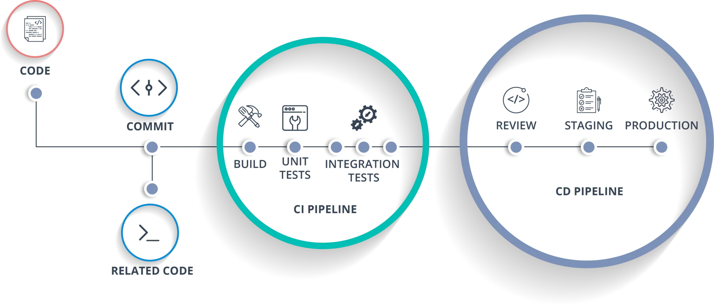

## 1.1. DevOps y términos relacionados
En esta unidad se introduce el concepto de **DevOps**, su importancia en el desarrollo de software moderno, y los términos clave asociados como **CI/CD** (Integración Continua y Entrega/Despliegue Continuo). Se explica cómo estas prácticas mejoran la colaboración entre desarrolladores y administradores de sistemas, agilizando la entrega de software de alta calidad. En definitiva como DevOps es la base para entender el despliegue de aplicaciones web.

### 1. ¿Qué es DevOps?
Se entiende por DevOps las prácticas, herramientas y una filosofía cultural que **unifica el desarrollo de software (Dev)** y **las operaciones de TI (Ops)**.

**DevOps** es la unión de dos mundos que tradicionalmente estaban separados:    

- **Dev (Desarrollo):** programadores, que desarrollan el código para crear aplicaciones y prueban ese código para asegurarse de que funciona.    

- **Ops (Operaciones):** administradores de sistemas, que despliegan y mantienen las aplicaciones en servidores, asegurándose de que estén disponibles y funcionando correctamente.

El objetivo de DevOps es **mejorar la colaboración entre ambos** para que las aplicaciones lleguen más rápido al usuario, con mayor calidad y menos errores.

Un ingeniero o perfil DevOps no solo instala aplicaciones en servidores, sino que también:    

- Automatiza despliegues.   
- Supervisa el rendimiento de aplicaciones.   
- Configura sistemas en la nube.   
- Define buenas prácticas para asegurar que el software se entrega de forma continua.   

DevOps persigue **pasar del código en el IDE al software funcionando en un servidor real** de la forma más rápida, segura y eficiente posible.

### 2. ¿Por qué es importante DevOps?

- Porque hoy en día las empresas necesitan **entregar software constantemente** (actualizaciones de apps, parches de seguridad, nuevas funcionalidades).
- Porque evita problemas clásicos como *“en mi ordenador funciona, pero en producción no”*, por tanto reduce errores humanos al automatizar tareas repetitivas.
- Porque permite que el software sea **más seguro y confiable**.
- Porque facilita la **colaboración entre equipos**.
- Porque agiliza la **entrega de valor al cliente**.
- Es un perfil muy demandado en el mercado laboral.

### 3. Términos clave en DevOps
DevOps incluye varias prácticas y herramientas, pero las más conocidas son **CI/CD**

#### 3.1. CI – Integración Continua (*Continuous Integration*)

- Consiste en **integrar de forma frecuente** el código de todos los programadores en un repositorio común.
- Cada vez que alguien hace un cambio, el sistema **lanza pruebas automáticas** para comprobar que todo funciona y finalmente se integra el código si pasa las pruebas.
- ¿Por qué es importante?
    - Detecta errores pronto.
    - Evita “sorpresas” al final del proyecto.
    - Permite avanzar todos juntos en lugar de que cada uno trabaje aislado.

Ejemplo: al hacer un *push* en GitHub, se ejecutan tests que verifican si el código compila y pasa las pruebas.

#### 3.2. CD – Entrega Continua (*Continuous Delivery*) y Despliegue Continuo (*Continuous Deployment*)

- **Entrega Continua (Continuous Delivery):**  
  El software siempre está listo para ser desplegado. Es decir, en cualquier momento, con un solo clic, podría ponerse en producción. Queda a criterio del equipo cuándo hacer ese despliegue, y este proceso puede ser manual o automatizado.

- **Despliegue Continuo (Continuous Deployment):**  
  Es el siguiente paso: el sistema despliega automáticamente las nuevas versiones en producción sin intervención manual.

¿Para qué sirve?    

- Para que los usuarios reciban las mejoras rápidamente.    
- Para reducir riesgos: se despliegan cambios pequeños y frecuentes, no “grandes actualizaciones” que pueden fallar.     

#### 3.3. Ejemplo de CI/CD 

<figure markdown>   
     
  <figcaption>Pipeline DevOps</figcaption>   
</figure>   

La imagen muestra un flujo típico de CI/CD dividido en dos grandes etapas: CI Pipeline y CD Pipeline, cada una con sus pasos específicos. A continuación se explica el significado de estas etapas y sus respectivos pasos.[1]

- **Code**: Es la escritura del código fuente del software; aquí los desarrolladores implementan nuevas funciones o corrigen errores.

- **Related Code**: Se refiere a cualquier código relacionado que también deba actualizarse en paralelo, como librerías usadas, scripts auxiliares, o documentación técnica.

- **Commit**: Acción de guardar los cambios realizados en el código en el sistema de control de versiones (por ejemplo, Git). Este paso marca un punto de partida para activar el pipeline automatizado.

**CI Pipeline (Integración Continua)**    

- **Build**: Compilación o ensamblado del código fuente para asegurarse de que todo se une correctamente y produce los artefactos necesarios.   

- **Unit Tests**: Ejecución de pruebas unitarias que comprueban que cada componente individual del software funciona de forma correcta y aislada.   

- **Integration Tests**: Pruebas para verificar que diferentes componentes o módulos funcionan correctamente cuando interactúan entre sí. Validan las dependencias y la comunicación entre partes del sistema.

**CD Pipeline (Despliegue Continuo)**   

- **Review**: Revisión del build y procesos; generalmente incluye validación manual o automática por parte de otros desarrolladores o herramientas de calidad, asegurando que todo cumpla los estándares antes de avanzar.   

- **Staging**: Despliegue en un entorno de pruebas que simula la producción. Permite probar el sistema completo en condiciones casi reales para detectar posibles problemas antes del lanzamiento final.   

- **Production**: Despliegue final del software en el entorno de producción real. El código está accesible para los usuarios finales y soporta la carga y operación real del negocio.

Como resumen, decir que cada paso realiza una función específica y secuencial: escritura de código, inclusión en el control de versiones, pruebas y compilación automatizadas (CI), revisión y despliegue controlado y seguro (CD).

El flujo asegura una entrega rápida y segura, minimizando errores y permitiendo una mejora continua del software.

#### 3.3. Otras prácticas relacionadas

- **Automatización:** scripts y herramientas que evitan repetir tareas manuales.
- **Infraestructura como código (IaC):** configurar servidores y redes con código (por ejemplo, con Ansible o Terraform).
- **Monitorización:** controlar el estado de los servidores y aplicaciones (con Grafana, Prometheus, etc.), para detectar problemas y optimizar el rendimiento.
- **Contenedores:** empaquetar aplicaciones con Docker o Kubernetes para que se ejecuten igual en cualquier entorno.

### 4. Conexión con el módulo de Despliegue de Aplicaciones Web

En el módulo intentaremos trabajar con:     

- **Servidores web y de aplicaciones**, donde desplegar software.    
- **Tecnologías de virtualización y contenedores** (como Docker).    
- **Control de versiones e integración continua** (Git y GitHub Actions).   
- **Documentación y automatización** para que los despliegues sean rápidos, seguros y reproducibles.    

Por tanto, conocer DevOps y sus términos es la **base** para entender el resto de unidades del módulo.

## Bibliografía y fuentes
- Humble, J. & Farley, D. [Continuous Delivery](https://proweb.md/ftp/carti/Continuous-Delivery-Jez%20Humble-David-Farley.pdf). Addison-Wesley.
- Atlassian: [¿Qué es DevOps?](https://www.atlassian.com/devops)
- Red Hat: [Guía sobre DevOps](https://www.redhat.com/es/topics/devops)

