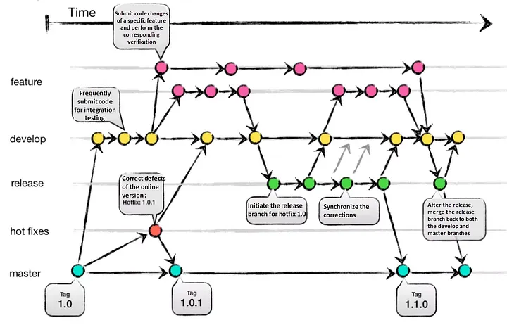
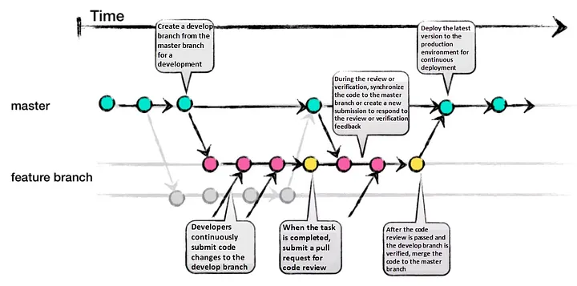
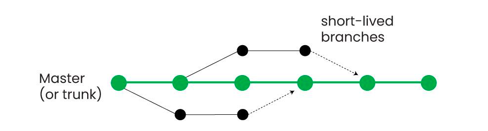

## 1.3. Git y GitHub
En el vasto y dinámico mundo del desarrollo de software, dos pilares se erigen como esenciales para la eficiencia, la calidad y la colaboración: el control de versiones y la documentación del código visto en el punto atnerior. Este tema explora en profundidad cómo Git y GitHub han revolucionado la forma en que los equipos gestionan sus proyectos.


### 1. Control de Versiones con Git y GitHub

El **control de versiones** es, en esencia, un sistema que registra los cambios realizados en un archivo o un conjunto de archivos a lo largo del tiempo. Su propósito principal es permitir a los desarrolladores recuperar versiones específicas de sus proyectos en cualquier momento, lo que resulta invaluable para rastrear la evolución del software, revertir errores y, fundamentalmente, coordinar el trabajo de múltiples personas en archivos compartidos. Sin un sistema robusto de control de versiones, el desarrollo colaborativo sería caótico, propenso a la pérdida de trabajo y lleno de conflictos irresolubles.

### 2. Introducción a Git

**Git** es un *software* de control de versiones distribuido, diseñado por Linus Torvalds en 2005, inicialmente para gestionar el desarrollo del núcleo Linux. Su creación se basó en la necesidad de un sistema eficiente, fiable y compatible para mantener versiones de aplicaciones con un gran número de archivos de código fuente. A diferencia de los sistemas centralizados (como Subversion), Git otorga a cada desarrollador una copia local completa del historial de desarrollo del proyecto. Esto significa que los cambios se propagan entre repositorios locales, y cada desarrollador puede trabajar de forma independiente, incluso sin conexión a la red. Esta naturaleza distribuida fomenta el desarrollo no lineal y agiliza la gestión de ramas y la fusión de diferentes versiones del código.

### 3. Conceptos Clave en Git

Para comprender Git, es fundamental familiarizarse con algunos conceptos primordiales:

*   **Repositorio (Repository)**: Es el corazón del proyecto. Un repositorio es el lugar donde se almacenan todos los datos actualizados y el historial completo de cambios de un proyecto. Se puede concebir como una base de datos o un sistema de archivos en un disco duro que contiene todas las versiones previas a un cambio determinado, incluyendo ramas y etiquetas. Cuando se clona un repositorio, se obtiene una copia de casi todos los datos que tiene el servidor, lo que significa que cada versión de cada archivo en la historia del proyecto se descarga por defecto.

*   **Commit (Confirmación)**: Un `commit` es un punto de control en el proceso de desarrollo. Es una "instantánea" de tu proyecto en un momento específico. Cada vez que realizas un `commit`, guardas una versión del área de preparación, una copia instantánea de tu proyecto. Cada `commit` está identificado de forma única por un código hash SHA-1 de 40 caracteres, que actúa como su "nombre" y garantiza su integridad. Los `commits` también incluyen metadatos como el autor, la fecha y un mensaje descriptivo que explica los cambios realizados. Es crucial que los mensajes de `commit` sean claros y concisos, comenzando con una línea de no más de 50 caracteres que resuma los cambios, seguida de una línea en blanco y luego una explicación más detallada si es necesario.

*   **Rama (Branch)**: Las ramas representan líneas de desarrollo independientes. La ramificación es una de las características más potentes de Git, ya que permite a los desarrolladores trabajar en nuevas funcionalidades, corregir errores o experimentar con ideas sin afectar la base de código principal (comúnmente llamada `master` o `main`). Una rama no es más que un simple puntero a una confirmación específica. Crear y destruir ramas en Git es una operación extremadamente rápida y económica, a diferencia de otros sistemas de control de versiones que requieren copiar todos los archivos del proyecto. Esto fomenta que los desarrolladores utilicen ramas con frecuencia, incluso varias veces al día, para aislar su trabajo.

*   **Área de Preparación (Staging Area / Index)**: Esta es una zona intermedia donde se seleccionan los cambios que se incluirán en el próximo `commit`. Antes de realizar una confirmación, los archivos modificados deben "prepararse" o "añadirse al *staging area*". Esto permite construir la instantánea del `commit` de forma precisa, eligiendo exactamente qué cambios se guardarán. Si un archivo ha sido modificado desde la última vez que se obtuvo del repositorio pero ha sido añadido al área de preparación, se considera "preparado" (`staged`).

*   **Directorio de Trabajo (Working Directory)**: Es la copia de los archivos del proyecto que tienes en tu máquina local. Aquí es donde realizas las modificaciones directamente. Los archivos se extraen de la base de datos comprimida del directorio Git y se colocan en el disco para que puedan ser usados o modificados. Si un archivo ha sufrido cambios desde que se obtuvo del repositorio, pero no se ha preparado, se considera "modificado" (`modified`).

*   **HEAD**: Es un puntero a la referencia de rama actual, que a su vez es un puntero al último `commit` realizado en esa rama. En términos más sencillos, `HEAD` representa la instantánea del último `commit` en tu rama activa y será el padre del próximo `commit` que crees.

### 4. Ciclo de Vida de los Archivos en Git

El flujo de trabajo básico en Git sigue una secuencia lógica:

1.  **Modificar archivos**: Realizas cambios en uno o varios archivos dentro de tu **directorio de trabajo**.
2.  **Preparar archivos**: Añades los archivos modificados al **área de preparación**. Esto le indica a Git qué cambios específicos deseas incluir en la próxima instantánea.
3.  **Confirmar cambios**: Realizas un `commit`, lo que toma los archivos tal como están en el área de preparación y almacena esa instantánea de forma permanente en tu **directorio de Git (repositorio local)**.

Los archivos en un proyecto Git pueden encontrarse en tres estados principales:
*   **Confirmado (Committed)**: Los datos están almacenados de forma segura en tu base de datos local (directorio Git).
*   **Modificado (Modified)**: Has modificado un archivo en tu directorio de trabajo, pero aún no lo has añadido al área de preparación.
*   **Preparado (Staged)**: Has marcado un archivo modificado en su versión actual para que se incluya en la próxima confirmación.

### 5. Comandos Git Esenciales con Ejemplos Prácticos

Dominar Git requiere tiempo, pero algunos comandos son utilizados con mucha frecuencia. Aquí se detallan los más importantes con ejemplos:

#### 5.1. Configuración Inicial
Antes de empezar, es crucial configurar Git con tu identidad. Estas configuraciones solo necesitan hacerse una vez por máquina.

*   **`git config`**: Este comando se usa para establecer las opciones de configuración para Git.
    ```bash
    git config --global user.name "Tu Nombre"
    git config --global user.email "tu.email@ejemplo.com"
    git config --global core.editor "code --wait" # Configura VS Code como editor por defecto
    git config --global color.ui auto # Activa el coloreado de la salida de Git
    ```
    El parámetro `--global` asegura que estas configuraciones se apliquen a todos tus repositorios locales.

#### 5.2. Creación y Clonación de Repositorios

*   **`git init`**: Inicializa un nuevo repositorio Git en el directorio actual o en un nuevo directorio especificado. Esto crea un subdirectorio `.git` que contiene todos los archivos necesarios del repositorio.
    ```bash
    # Para inicializar un nuevo repositorio en el directorio actual
    mkdir mi-proyecto
    cd mi-proyecto
    git init
    # Salida: Initialized empty Git repository in /ruta/a/mi-proyecto/.git/
    ```

*   **`git clone <URL>`**: Descarga una copia idéntica de un repositorio remoto existente (por ejemplo, desde GitHub) y la guarda en tu ordenador.
    ```bash
    # Clonar un repositorio desde una URL HTTPS
    git clone https://github.com/usuario/repositorio.git
    # Salida: Cloning into 'repositorio'...
    # remote: Enumerating objects: 3, done.
    # remote: Counting objects: 100% (3/3), done.
    # remote: Total 3 (delta 0), reused 0 (delta 0), pack-reused 0
    # Unpacking objects: 100% (3/3), done.
    ```
    Luego de clonar, debes ir al directorio del repositorio: `cd repositorio`.

#### 5.3. Gestión de Cambios (Add, Commit, Status, Diff)

*   **`git status`**: Muestra el estado actual del directorio de trabajo y del área de preparación. Indica qué archivos han sido modificados, cuáles están preparados para el `commit` y cuáles no están siendo rastreados.
    ```bash
    # Después de crear o modificar un archivo
    touch nuevo_archivo.txt
    git status
    # Salida:
    # On branch master
    # No commits yet
    # Untracked files:
    #   (use "git add <file>..." to include in what will be committed)
    #   nuevo_archivo.txt
    # nothing added to commit but untracked files present (use "git add" to track)
    ```

*   **`git add <archivo>` / `git add .`**: Añade los cambios de uno o varios archivos al área de preparación para el siguiente `commit`. `git add .` añade todos los archivos modificados y no rastreados en el directorio actual y sus subdirectorios.
    ```bash
    # Añadir un archivo específico al staging area
    git add nuevo_archivo.txt
    git status
    # Salida:
    # On branch master
    # No commits yet
    # Changes to be committed:
    #   (use "git rm --cached <file>..." to unstage)
    #   new file:   nuevo_archivo.txt

    # Modificar el archivo y añadir todos los cambios pendientes
    echo "Contenido importante" >> nuevo_archivo.txt
    git add .
    git status # Verá que el archivo está en el staging area
    ```

*   **`git commit -m "mensaje"`**: Registra los cambios preparados en el historial del proyecto, creando una nueva instantánea. El mensaje entre comillas describe los cambios realizados.
    ```bash
    # Confirmar los cambios preparados
    git commit -m "Primer commit: Añadido nuevo_archivo.txt con contenido inicial"
    # Salida:
    # [master (root-commit) 7cff591] Primer commit: Añadido nuevo_archivo.txt con contenido inicial
    #  1 file changed, 1 insertion(+)
    #  create mode 100644 nuevo_archivo.txt
    ```
    También puedes usar `git commit --amend` para modificar el `commit` más reciente, útil si olvidas preparar un archivo o incluyes un mensaje de `commit` erróneo, siempre y cuando no se haya publicado.

*   **`git diff`**: Muestra las diferencias entre el directorio de trabajo y el área de preparación (`git diff`), o entre el área de preparación y el último `commit` (`git diff --staged` o `git diff --cached`), o entre dos `commits` específicos.
    ```bash
    # Modificar el archivo sin añadir al staging
    echo "Segunda línea de contenido" >> nuevo_archivo.txt
    git diff # Muestra los cambios no preparados
    # Salida:
    # diff --git a/nuevo_archivo.txt b/nuevo_archivo.txt
    # index 7cff591..1a410ef 100644
    # --- a/nuevo_archivo.txt
    # +++ b/nuevo_archivo.txt
    # @@ -1 +1,2 @@
    #  Contenido importante
    # +Segunda línea de contenido

    git add nuevo_archivo.txt
    git diff --staged # Muestra los cambios preparados
    ```

#### 5.4. Historial y Deshacer Cambios

*   **`git log`**: Permite explorar las revisiones anteriores de un proyecto. Muestra el historial de `commits` ordenado cronológicamente, incluyendo el código hash, autor, fecha, hora y mensaje asociado.
    ```bash
    git log
    # Salida (ejemplo):
    # commit 7cff591a2b3c4d5e6f7a8b9c0d1e2f3a4b5c6d7e (HEAD -> master)
    # Author: Tu Nombre <tu.email@ejemplo.com>
    # Date:   Thu Jul 25 10:00:00 2024 +0200
    #
    #     Primer commit: Añadido nuevo_archivo.txt con contenido inicial

    git log --oneline # Muestra cada commit en una sola línea
    # Salida:
    # 7cff591 Primer commit: Añadido nuevo_archivo.txt con contenido inicial
    ```

*   **`git show <commit>`**: Muestra los detalles de un `commit` específico, incluyendo el autor, fecha, mensaje y las diferencias con el `commit` anterior.
    ```bash
    # Mostrar el último commit
    git show HEAD
    # O un commit específico usando su hash (los primeros caracteres son suficientes)
    git show 7cff591
    ```

*   **`git blame <fichero>`**: Muestra el contenido de un fichero, anotando cada línea con información del `commit` en el que se introdujo o se modificó por última vez. Incluye los primeros 8 dígitos del hash del `commit`, el autor, la fecha y el contenido de la línea.
    ```bash
    git blame nuevo_archivo.txt
    # Salida (ejemplo):
    # 7cff591a (Tu Nombre 2024-07-25 10:00:00 +0200 1) Contenido importante
    # 1a410efb (Tu Nombre 2024-07-25 10:05:00 +0200 2) Segunda línea de contenido
    ```

*   **`git revert <hash_commit>`**: Deshace los cambios introducidos por un `commit` específico creando un *nuevo* `commit` inverso, manteniendo así el historial original intacto. Es una forma segura de deshacer cambios que ya han sido publicados.
    ```bash
    # Revertir un commit (por ejemplo, el último)
    git revert HEAD
    # Se abrirá un editor para que confirmes el mensaje de revert
    ```

*   **`git reset --hard HEAD`**: Elimina los cambios realizados en el directorio de trabajo y en el área de preparación que aún no se hayan confirmado, volviendo al estado del último `commit`. **¡Úsese con extrema precaución, ya que puede resultar en la pérdida de trabajo no guardado!**
    ```bash
    # Eliminar todos los cambios no confirmados y restaurar el último commit
    git reset --hard HEAD
    ```

*   **`git reset --soft <commit_hash>`**: Mueve el puntero `HEAD` de la rama al `commit` especificado, pero mantiene el área de preparación y el directorio de trabajo sin cambios. Esto es útil para volver a empaquetar una serie de `commits`.

*   **`git rm <archivo>`**: Elimina un archivo tanto del directorio de trabajo como del área de preparación, y programa su eliminación para el próximo `commit`.
    ```bash
    # Eliminar un archivo
    touch archivo_a_eliminar.txt
    git add archivo_a_eliminar.txt
    git commit -m "Añadido archivo_a_eliminar.txt"
    git rm archivo_a_eliminar.txt
    git commit -m "Eliminado archivo_a_eliminar.txt"
    ```
    Si quieres mantener el archivo en tu directorio de trabajo pero dejar de rastrearlo, usa `git rm --cached <archivo>`. Esto es útil para archivos que se añadieron accidentalmente y deberían haber estado en `.gitignore`.

#### 5.5. Ramificación y Fusión (Branch, Checkout, Merge, Rebase)

*   **`git branch <nombre_rama>`**: Crea una nueva rama local.
    ```bash
    # Crear una rama llamada 'feature-nueva'
    git branch feature-nueva
    git branch # Lista las ramas existentes
    # Salida:
    #   feature-nueva
    # * master
    ```

*   **`git checkout <nombre_rama>`**: Cambia el directorio de trabajo y el `HEAD` a la rama especificada.
    ```bash
    # Cambiar a la rama 'feature-nueva'
    git checkout feature-nueva
    # Salida: Switched to branch 'feature-nueva'
    # Ahora estás trabajando en 'feature-nueva'
    ```
    También puedes usar `git checkout -b <nombre_rama>` para crear una nueva rama y cambiarte a ella en un solo comando.

*   **`git merge <rama>`**: Integra los cambios de una rama especificada en la rama actual (a la que apunta `HEAD`). Si las historias han divergido, Git realizará una fusión a tres bandas, usando las instantáneas de los extremos de ambas ramas y el ancestro común. Pueden surgir **conflictos** si los mismos archivos se modifican en ambas ramas de formas incompatibles, los cuales deberán resolverse manualmente.
    ```bash
    # Estando en la rama 'master', fusionar los cambios de 'feature-nueva'
    git checkout master
    git merge feature-nueva
    # Si hay conflictos, se indicará. Debes resolverlos, hacer 'git add' de los archivos resueltos
    # y luego 'git commit' para finalizar la fusión.
    ```

*   **`git rebase`**: Permite reorganizar la historia del proyecto. En lugar de crear un `commit` de fusión, `git rebase` reescribe la historia, moviendo los `commits` de tu rama a la punta de otra rama, creando un historial más lineal y limpio. Esto puede ser muy útil para integrar cambios de tu rama principal en tu rama de característica sin crear `commits` de fusión innecesarios.
    ```bash
    # Estando en la rama 'feature-nueva', rebasar sobre 'master'
    git checkout feature-nueva
    git rebase master
    # Si hay conflictos, resuélvelos y usa 'git rebase --continue'
    # Una vez completado, cambia a master y haz un fast-forward merge
    git checkout master
    git merge feature-nueva
    ```
    **Regla de Oro del Rebase**: Nunca uses `git rebase` en ramas *públicas* que ya han sido compartidas con otros, ya que reescribe el historial, lo cual puede causar problemas a los colaboradores que ya han basado su trabajo en el historial original. Es ideal para limpiar el historial de tu rama local antes de publicarla.

#### 5.6. Ignorar Archivos

*   **`.gitignore`**: Es un archivo de texto donde se listan los ficheros, directorios y patrones que Git debe ignorar y no incluir en el control de versiones. Esto es crucial para evitar que archivos generados automáticamente (logs, ejecutables, dependencias de paquetes, etc.) se añadan accidentalmente al repositorio.
    ```
    # Ejemplo de archivo .gitignore
    # Ignorar todos los archivos .log
    *.log
    # Ignorar el directorio 'node_modules'
    node_modules/
    # Ignorar archivos temporales de editores
    *~
    # Ignorar archivos compilados de Java
    *.class
    # No ignorar lib.a, incluso si el patrón *.a lo ignoraría
    !lib.a
    ```
    Es una buena práctica crear este archivo al inicio del proyecto.

#### 5.7. Etiquetado (Tags)

*   **`git tag`**: Permite etiquetar puntos específicos e importantes en el historial del proyecto. Típicamente, se usa para marcar versiones de lanzamiento (por ejemplo, `v1.0`, `v2.0-beta`). Git admite dos tipos de etiquetas:
    *   **Ligeras (Lightweight)**: Un simple puntero a un `commit` específico, como una rama que no cambia.
    *   **Anotadas (Annotated)**: Se guardan en la base de datos de Git como objetos completos, con un checksum, nombre del etiquetador, correo electrónico, fecha y un mensaje asociado. Se recomienda usar etiquetas anotadas para tener toda esta información.
    ```bash
    # Crear una etiqueta anotada para el último commit
    git tag -a v1.0.0 -m "Versión 1.0.0 estable del proyecto"
    # Ver las etiquetas existentes
    git tag
    # Mostrar detalles de una etiqueta
    git show v1.0.0
    ```
    Para que las etiquetas locales se compartan con el repositorio remoto, deben subirse explícitamente: `git push origin --tags`.

#### 5.8. Trabajar con Remotos (Remote, Push, Pull, Fetch)

*   **`git remote add <nombre> <URL>`**: Crea un enlace con un nombre fácil de recordar (por ejemplo, `origin`) a un repositorio remoto.
    ```bash
    # Añadir un repositorio remoto llamado 'origin'
    git remote add origin https://github.com/usuario/mi-proyecto.git
    # Ver los remotos configurados
    git remote -v
    # Salida:
    # origin https://github.com/usuario/mi-proyecto.git (fetch)
    # origin https://github.com/usuario/mi-proyecto.git (push)
    ```

*   **`git push <remoto> <rama>`**: Sube los `commits` de tu rama local al repositorio remoto.
    ```bash
    # Subir la rama 'master' al remoto 'origin'
    git push origin master
    # Salida:
    # To https://github.com/usuario/mi-proyecto.git
    #  * [new branch]      master -> master
    ```
    Si es la primera vez que subes una rama, puedes usar `git push -u origin master` para establecerla como rama de seguimiento remoto.

*   **`git fetch <remoto>`**: Descarga los cambios (ramas, `commits`, etc.) del repositorio remoto, pero **no los integra** en tu rama local. Esto te permite inspeccionar los cambios antes de fusionarlos.
    ```bash
    git fetch origin
    # Salida:
    # remote: Enumerating objects: 5, done.
    # remote: Counting objects: 100% (5/5), done.
    # remote: Compressing objects: 100% (3/3), done.
    # remote: Total 3 (delta 2), reused 0 (delta 0), pack-reused 0
    # Unpacking objects: 100% (3/3), done.
    # From https://github.com/usuario/mi-proyecto
    #  * [new branch]      feature-remota -> origin/feature-remota
    ```

*   **`git pull <remoto> <rama>`**: Unifica los comandos `git fetch` y `git merge` en un único comando. Descarga los cambios del repositorio remoto y los fusiona automáticamente con tu rama local actual.
    ```bash
    # Obtener y fusionar los cambios de la rama 'master' del remoto 'origin'
    git pull origin master
    # Salida:
    # From https://github.com/usuario/mi-proyecto
    #  * branch            master     -> FETCH_HEAD
    # Updating 7cff591..1a410ef
    # Fast-forward
    #  nuevo_archivo_remoto.txt | 1 +
    #  1 file changed, 1 insertion(+)
    #  create mode 100644 nuevo_archivo_remoto.txt
    ```

### 6. GitHub para la Colaboración

**GitHub** es una plataforma de alojamiento de repositorios Git que va más allá de ser un simple servidor. Es un centro de colaboración, gestión de proyectos y una red social para desarrolladores. Facilita enormemente el trabajo en equipo, la revisión de código y la contribución a proyectos de código abierto.

#### 6.1. Pull Requests (Solicitudes de Incorporación de Cambios)

Una **Pull Request (PR)** o Solicitud de Extracción es una **herramienta de comunicación fundamental en el desarrollo colaborativo**. Los desarrolladores las utilizan para proponer sus cambios, explicar su trabajo y solicitar una revisión de código antes de que este se fusione con una rama principal (como `main` o `master`).

**Componentes Clave de una Pull Request:**

*   **Resumen de las actualizaciones**: Se debe explicar qué se intentaba lograr (corrección de errores, nueva función, refactorización, etc.).
*   **Contexto**: Proporcionar la mayor información posible para que el revisor entienda el problema que se está intentando resolver.
*   **Casos de prueba**: Documentar cómo se ha probado el nuevo código.
*   **Comentarios en línea**: Es buena práctica dejar comentarios directamente en el código para explicar elecciones o cambios confusos.
*   **Título y Descripción Claras**: Un buen título indica claramente lo que se ha cambiado (ej., "Se añadió caso de prueba para la función X"). La descripción debe complementar el título, ofreciendo más detalles.

**Flujo de una Pull Request:**

1.  Un desarrollador crea una nueva rama para su trabajo (`feature-X`).
2.  Realiza cambios y los `commitea` a su rama local.
3.  Sube la rama a su repositorio remoto (`git push origin feature-X`).
4.  Desde la interfaz de GitHub, abre una Pull Request, seleccionando la rama `feature-X` como origen y la rama de destino (ej., `main`).
5.  Otros miembros del equipo revisan el código, dejando comentarios y sugerencias.
6.  Una vez aprobado y resuelto cualquier conflicto, la Pull Request se **fusiona** (`merge`) con la rama de destino.

**Buenas Prácticas para Pull Requests:**

*   **Revisión Independiente**: Antes de crear una PR, el propio desarrollador debe revisar su código para detectar errores comunes.
*   **Cortas y Enfocadas**: Se recomienda mantener las PRs concisas, dividiéndolas en unidades lógicas pequeñas. Las PRs largas son más difíciles de revisar y pueden introducir más problemas.
*   **Títulos Descriptivos**: Indicar claramente el propósito del cambio.
*   **Plantillas**: Muchos equipos usan plantillas de PR para asegurar que se incluya toda la información relevante.

#### 6.2. Fork (Bifurcación)

Un **Fork** consiste en crear una **copia de un repositorio existente en tu propia cuenta de GitHub**. Esto es especialmente común en proyectos de código abierto donde no tienes permisos de escritura directos en el repositorio original. El `fork` te permite trabajar de forma independiente en tu copia del proyecto, realizar todos los cambios que desees y, una vez que tu trabajo esté listo, proponer esos cambios al repositorio original a través de una Pull Request.

**Flujo de Trabajo con un Fork:**

1.  En GitHub, se selecciona el repositorio original y se hace clic en el botón "Fork".
2.  Esto crea una copia del repositorio en tu cuenta.
3.  Clonas tu `fork` a tu máquina local: `git clone https://github.com/tu-usuario/nombre-del-fork.git`.
4.  Creas una nueva rama en tu `fork` local, realizas los cambios y los `commiteas`.
5.  Subes tus cambios a tu `fork` remoto: `git push origin nombre-de-tu-rama`.
6.  Desde la interfaz de GitHub, creas una Pull Request desde tu `fork` (tu rama) hacia el repositorio original (su rama `main`).

### 7. Flujos de Trabajo Comunes en Git

Para coordinar el trabajo de un equipo, es necesario acordar cómo se utilizará Git. A estos acuerdos se les llama **flujos de trabajo**.    

#### 7.3. GitFlow 

Una metodología más estructurada y compleja, popular para proyectos con entregables y ciclos de desarrollo bien definidos. Utiliza dos ramas de larga vida y varias ramas temporales:   

*   **`master`**: Almacena el historial de las versiones de producción estables y publicadas.
*   **`develop`**: Sirve como rama de integración para el desarrollo activo de nuevas funcionalidades. El código aquí puede ser inestable.
*   **`feature-*`**: Ramas temporales que se originan de `develop` y se usan para desarrollar nuevas características. Una vez completadas, se fusionan de nuevo en `develop`.
*   **`release-*`**: Ramas temporales que se bifurcan de `develop` cuando el desarrollo ha adquirido suficientes funcionalidades para una publicación. En estas ramas se hacen los últimos ajustes y correcciones antes del lanzamiento. Luego se fusionan en `master` (y se etiquetan) y de nuevo en `develop`.
*   **`hotfix-*`**: Ramas temporales que se originan directamente de `master` para reparar rápidamente errores urgentes en producción. Una vez corregido el error, se fusionan tanto en `master` (y se etiquetan) como en `develop`.

<figure markdown>   
     
  <figcaption>Git-Flow</figcaption>   
</figure>   

#### 7.2. GitHub Flow

Un flujo de trabajo simple y ágil, centrado en ramas de vida corta y despliegues continuos. Se basa en cinco principios:

1.  Todo lo que está en la rama `master` (o `main`) está listo para ser desplegado en producción.
2.  Para trabajar en algo nuevo, se crea una nueva rama a partir de `master` con un nombre descriptivo.
3.  Cuando el trabajo está listo o se necesita retroalimentación, se abre una Pull Request.
4.  Alguien revisa y aprueba los cambios antes de fusionarlos con `master`.
5.  Los cambios integrados en `master` se despliegan en producción de inmediato.
    Este flujo es conocido por impulsar la entrega continua.


<figure markdown>   
     
  <figcaption>GitHub-Flow</figcaption>   
</figure>   


#### 7.3. Trunk Based Development

Un flujo de trabajo simple y directo, ideal para equipos pequeños o proyectos con ciclos de desarrollo rápidos. Este enfoque minimiza la complejidad de la gestión de ramas, pero puede ser arriesgado si no se tienen prácticas sólidas de revisión y pruebas, ya que cualquier error puede afectar a toda la base de código. Algunas de sus características clave son:

1.  Todos los desarrolladores trabajan en la rama principal. (comúnmente llamada `master` o `main`), promoviendo la entrega continua (CD).
2.  Se realizan `commits` pequeños y frecuentes para mantener el código actualizado
3.  Se utilizan pruebas automatizadas para asegurar la calidad del código, promoviendo la integración continua (CI).
4.  Se fomenta la comunicación constante entre los miembros del equipo para coordinar cambios y evitar conflictos.
5. Se promueve una cultura de colaboración y responsabilidad compartida por la calidad del código.

<figure markdown>   
     
  <figcaption>Trunk-Based Development</figcaption>   
</figure>   


### 8. Herramientas Complementarias para Git y GitHub

Además de la línea de comandos, existen diversas herramientas que mejoran la experiencia de uso de Git y GitHub:

*   **Visual Studio Code (VS Code)**: Un editor de código muy popular con una fuerte integración con Git. Ofrece extensiones como:
    *   **Git Lens**: Para manejar la autoría de líneas (`blame`) e información detallada de `commits`.
    *   **Git Graph**: Para visualizar el historial de `commits` y ramas de forma gráfica e interactiva.
    *   **Gitflow Actions Sidebar**: Proporciona una interfaz gráfica para manejar los comandos del flujo de trabajo GitFlow.

*   **GitKraken**: Considerado por muchos como la mejor herramienta GUI (Graphical User Interface) para manejar Git. Ofrece una interfaz visual e interactiva para gestionar repositorios, ramas, `merges` y resolver conflictos. Tiene soporte integrado para GitFlow y una consola de *logs* que muestra los comandos Git ejecutados para cada acción, lo cual es excelente para el aprendizaje. Se integra con plataformas como GitHub, GitLab y Bitbucket.

*   **GitHub Desktop**: Un cliente gráfico desarrollado por GitHub para Windows y Mac. Simplifica las operaciones comunes de Git con una interfaz intuitiva, enfocándose en el flujo de trabajo de GitHub, como crear ramas, `commits` y Pull Requests.

## Bibliografía y fuentes

- [Repositorio de Jose Luis Gonzalez](https://github.com/joseluisgs/DespliegueAplicacionesWeb-01-2025-2026)
- [Estrategias de Branching](https://openwebinars.net/blog/estrategias-de-branching-gitflow-gitlab-flow-oneflow-github-flow/)
- [Git-Flow vs GitHub-Flow](https://quangnguyennd.medium.com/git-flow-vs-github-flow-620c922b2cbd)
- [Pro Git Book](https://git-scm.com/book/es/v2)
- [Documentación oficial de Git](https://git-scm.com/doc)
- [Documentación oficial de GitHub](https://docs.github.com/es)
- [Tutorial de Git y GitHub](https://github.com/joseluisgs/git-tutorial)
- [Estrategia de Ramas en GIT](https://youtu.be/53zXredJGtM)
