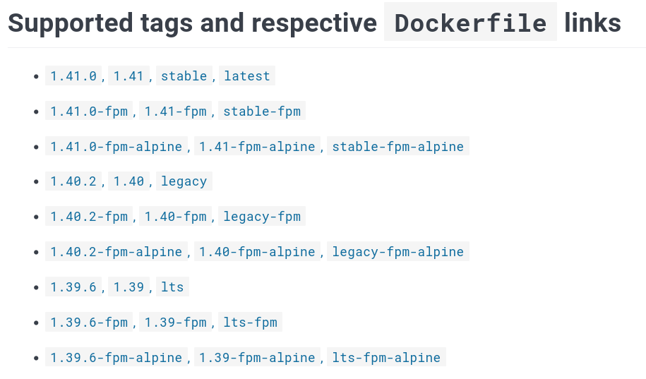
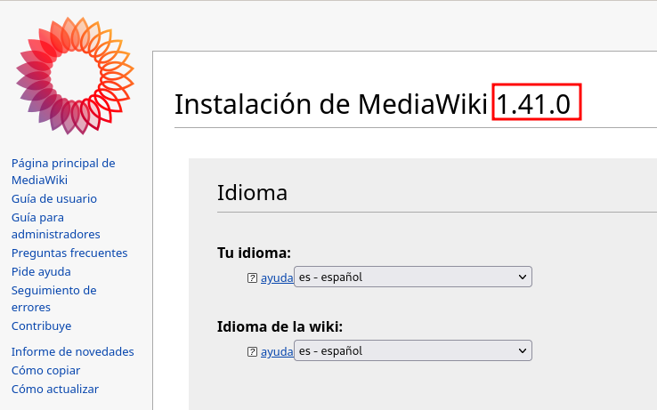

# Ejemplo: Desplegando la aplicación mediawiki

La mediawiki en una aplicación web escrita en PHP que nos permite gestionar una wiki. En este ejemplo vamos a hacer un ejemplo simple de despliegue en contenedor usando la imagen [`mediawiki`](https://hub.docker.com/_/mediawiki) que encontramos en DockerHub. 

En este ejemplo nos vamos a fijar cómo por medio de la etiqueta del nombre de la imagen podemos tener distintas versiones de la aplicación.

En concreto, si estudiamos la [documentación](https://hub.docker.com/_/mediawiki) de la imagen `mediawiki`, podemos ver las etiquetas disponibles para la imagen que corresponden a versiones distintas de la aplicación. En enero de 2024 serían las siguientes:



## La etiqueta `latest`

Si utilizamos el nombre de una imagen sin indicar la etiqueta, se toma por defecto la etiqueta `latest` que suele corresponder a la última versión de la aplicación. en el caso concreto de `mediawiki` observamos que la etiqueta `latest` corresponde a la última versión la `1.39.1`. Es más, podemos usar las siguientes etiquetas para indicar la misma versión: `1.41.0, 1.41, stable, latest`.

## Las imágenes bases y la arquitectura también son indicadas con las etiquetas

Podemos seguir observando que algunas etiquetas, nos indican además de la versión, los servicios que tienen instalada la imagen, por ejemplo si usamos la etiqueta `1.41.0-fpm` estaremos creando un contenedor con la ultima versión de la aplicación pero que además tendrá un servidor de aplicaciones php-fpm para servir la aplicación.

Otro ejemplo: si usamos la etiqueta `1.41.0-fpm-alpine`, además de la última versión y que tiene instalado php-fpm, nos indica que la imagen base que se ha usado para crear la imagen es una distribución `alpine` que se caracteriza por ser una distribución muy liviana.

## Instalación de distintas versiones de la mediawiki

Vamos a crear distintos contenedores usando etiquetas distintas al indicar el nombre de la imagen, posteriormente accederemos a la aplicación y podremos ver la versión instalada:

En primer lugar vamos a instalar la última versión:

```bash
docker run -d -p 8080:80 --name mediawiki1 mediawiki
```

Si accedemos a la ip de nuestro ordenador, al puerto 8080, podemos observar que hemos instalado la versión 1.41.0:



A continuación vamos a instalar otra versión de la mediawiki, la 1.40.2, creamos otro contenedor con otro nombre y mapeamos otro puerto:

```bash
docker run -d -p 8081:80 --name mediawiki2 mediawiki:1.40.2
```

Si accedemos a la ip de nuestro ordenador, al puerto 8081, podemos observar que hemos instalado la versión 1.40.2:


Y finalmente vamos a instalar otra versión en otro contenedor:

```bash
docker run -d -p 8082:80 --name mediawiki3 mediawiki:1.39.6
```

Si accedemos a la ip de nuestro ordenador, al puerto 8082, podemos observar que hemos instalado la versión 1.39.6:


**Nota: Puedes observar que la primera imagen que se baja, descargas todas las capas, sin embargo al descargar las otras versiones de la imagen, sólo se bajan las capas que difieren de la primera.**

---

* [Módulo 3: Almacenamiento y redes en Docker](../../..#3-almacenamiento-y-redes-en-docker)
