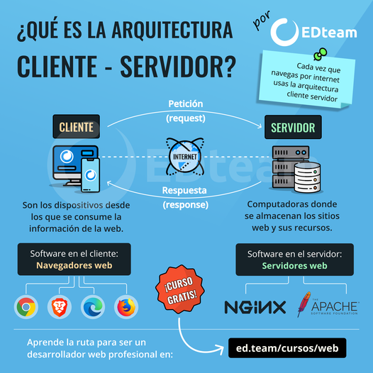
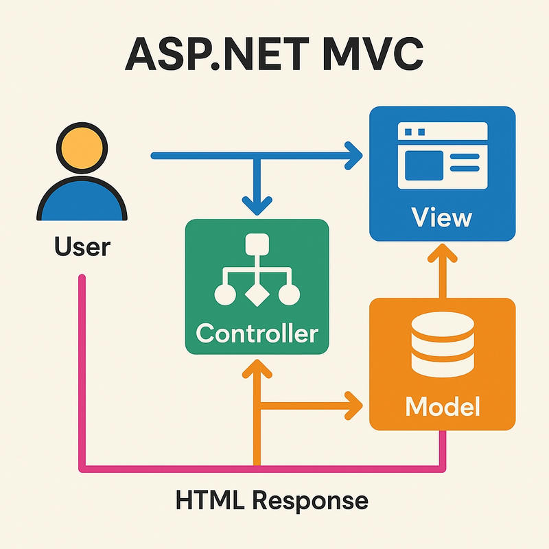

## 3.1. Arquitectura Web y Fundamentos del Despliegue

En las unidades anteriores habéis aprendido sobre los fundamentos del despliegue de aplicaciones, desde DevOps hasta contenedores Docker. Ahora es momento de profundizar en cómo se estructuran las aplicaciones web modernas y cómo estas arquitecturas influyen directamente en la forma en que desplegamos nuestras aplicaciones.

Entender las arquitecturas web no es solo una cuestión teórica: cada decisión arquitectónica tiene implicaciones directas en cómo configuraremos nuestros servidores, cómo escalaremos nuestras aplicaciones y cómo garantizaremos su disponibilidad y rendimiento.

### 1. Aspectos generales y evolución de las arquitecturas web

Las arquitecturas web son modelos que describen la forma en que los distintos elementos que participan en el intercambio y procesamiento de información a través de Internet se relacionan y funcionan. El modelo fundamental es la **Arquitectura Cliente-Servidor**, donde uno o varios clientes (navegadores web) solicitan servicios a un servidor.

#### 1.1. El modelo Cliente-Servidor

El modelo Cliente-Servidor es la base sobre la que se construyen todas las aplicaciones web. En este modelo, el cliente (típicamente un navegador web) realiza peticiones a un servidor, que procesa esas peticiones y devuelve las respuestas correspondientes.

<figure markdown="span">
  
  <figcaption>Modelo básico de arquitectura cliente-servidor mostrando la comunicación entre clientes y servidor</figcaption>
</figure>

Este modelo, aunque simple en concepto, ha demostrado ser extremadamente flexible y escalable. Los componentes principales son:

- **Cliente**: Aplicación que solicita servicios, típicamente un navegador web
- **Servidor**: Sistema que proporciona servicios y recursos a los clientes
- **Red**: Medio de comunicación, normalmente Internet, que conecta clientes y servidores

#### 1.2. Ventajas de la arquitectura Cliente-Servidor

La arquitectura Cliente-Servidor ofrece numerosas ventajas que la han convertido en el estándar para aplicaciones web:

- **Centralización del control**: El servidor gestiona accesos, recursos y la integridad de los datos, facilitando actualizaciones.
    
    - Cuando necesitamos actualizar la lógica de negocio, solo debemos modificar el servidor
    - Los cambios se propagan automáticamente a todos los clientes
    - Se facilita el mantenimiento y la gestión de versiones
    
- **Escalabilidad**: Se puede aumentar la capacidad de clientes y servidores por separado.
    
    - Podemos añadir más servidores para atender a más clientes
    - Los clientes pueden conectarse desde cualquier dispositivo
    - Es posible escalar vertical u horizontalmente según las necesidades
    
- **Portabilidad**: La ejecución de la aplicación web en un navegador web independiza el software del sistema operativo cliente.
    
    - Las aplicaciones funcionan en Windows, macOS, Linux, móviles, tablets...
    - No es necesario instalar software específico en cada cliente
    - Se reduce significativamente la complejidad de distribución
    
- **Fácil mantenimiento**: Al distribuir las funciones y responsabilidades entre varios ordenadores independientes, es posible reemplazar, reparar, actualizar, o incluso trasladar un servidor, sin que sus clientes se vean afectados (o mínimamente). Esta independencia de los cambios también se conoce como **encapsulación**.

- **Tecnologías maduras**: Existen tecnologías suficientemente desarrolladas para seguridad en transacciones, usabilidad de la interfaz y facilidad de uso.

#### 1.3. Desventajas y su mitigación

Como toda arquitectura, el modelo Cliente-Servidor también presenta algunos desafíos. Es importante conocerlos para poder aplicar las técnicas adecuadas de mitigación:

- **Congestión del tráfico**: Puede ocurrir sobrecarga si muchos clientes envían peticiones simultáneas.
    
    - Se mitiga con **balanceadores de carga** que distribuyen las peticiones
    - **Caching** para reducir peticiones repetidas
    - **CDN** (Content Delivery Networks) para contenido estático
    
- **Fallo del servidor**: Si el servidor cae, las peticiones no pueden ser satisfechas.
    
    - Se soluciona con **clusters** de servidores y **alta disponibilidad**
    - **Replicación** de servidores para redundancia
    - **Sistemas de failover** automáticos
    
- **Software y hardware específico**: Puede requerir soluciones específicas que aumentan el coste.
    
    - Se minimizan con **virtualización** y **contenedores**
    - **Cloud computing** para reducir costes de infraestructura
    - **Automatización** para optimizar el uso de recursos

!!! note "Importancia de las técnicas de mitigación"
    Las desventajas mencionadas no son problemas insuperables. Muchas de ellas las hemos trabajado en unidades anteriores, como la contenerización con Docker o la automatización con CI/CD. En las próximas unidades profundizaremos en técnicas de escalabilidad y alta disponibilidad.

#### 1.4. Evolución de la web

La web ha experimentado una notable evolución desde sus inicios hasta la actualidad. Esta evolución no solo ha cambiado la forma en que interactuamos con las aplicaciones web, sino también cómo las desarrollamos y desplegamos.

**Web 1.0 - La web estática (1991-2004)**

La primera generación de la web se caracterizaba por contenidos estáticos y escasa interacción:

- Páginas HTML simples sin capacidad de interacción
- Contenido unidireccional: solo lectura
- Actualización manual del contenido
- Sin bases de datos ni contenido dinámico

**Web 1.5 - Primeras aplicaciones dinámicas (1999-2005)**

Una etapa de transición donde surgieron las primeras aplicaciones web con bases de datos:

- Primeras aplicaciones con contenido dinámico
- Uso de CGI, PHP, ASP para generar contenido
- Integración con bases de datos
- Formularios con procesamiento en servidor

**Web 2.0 - La web social (2004-2010)**

Marcó la transición hacia aplicaciones centradas en el usuario final:

- Trabajo colaborativo y redes sociales
- Contenido generado por usuarios
- AJAX para interactividad sin recargar páginas
- Plataformas como YouTube, Facebook, Twitter
- Aplicaciones web enriquecidas (Rich Internet Applications)

**Web 2.5 - La web simbiótica (2010-2015)**

Los servicios web comienzan a usar los datos del usuario de forma más sofisticada:

- Personalización del contenido basada en datos del usuario
- Publicidad dirigida y recomendaciones
- Integración de múltiples servicios web
- Primeros servicios de cloud computing masivos

**Web 3.0 - La web semántica (2015-presente)**

Se orienta hacia una web más inteligente y descentralizada:

- Web semántica con datos estructurados
- Inteligencia artificial y machine learning
- APIs robustas y microservicios
- Internet de las Cosas (IoT)
- Blockchain y aplicaciones descentralizadas

**Web 4.0 - La web del futuro (concepto emergente)**

Aunque aún es más un concepto que una realidad, se especula sobre:

- Interacción ultra-personalizada mediante IA
- Realidad aumentada y virtual integradas
- Interfaces naturales (voz, gestos, pensamiento)
- Autonomía y predicción avanzada

Esta evolución histórica es fundamental para entender por qué las arquitecturas modernas son como son. Cada etapa ha respondido a nuevas necesidades y posibilidades tecnológicas.

### 2. Modelos de arquitectura software

Una arquitectura de software se refiere a la estructura organizativa fundamental de un sistema de software. Define cómo se dividen, combinan y coordinan sus componentes para lograr los objetivos del sistema.

En el contexto del desarrollo de aplicaciones web del lado del servidor (backend), entender estos modelos arquitectónicos es crucial porque determinarán cómo desplegamos, escalamos y mantenemos nuestras aplicaciones. Cada modelo presenta ventajas y desventajas que debemos conocer para tomar decisiones informadas.

<figure markdown="span">
  
  <figcaption>Evolución visual de las diferentes arquitecturas de software web</figcaption>
</figure>

#### 2.1. Arquitectura monolítica

La arquitectura monolítica es el enfoque tradicional donde todos los componentes de una aplicación web se agrupan en un solo bloque. La lógica de negocio, la interfaz de usuario y la capa de acceso a datos se encuentran dentro de la misma aplicación.

**Características principales:**

- Todos los componentes se ejecutan en el mismo proceso
- Comparten recursos de memoria y CPU
- Se despliegan como una única unidad
- Una única base de código

**Ventajas:**

- **Simplicidad inicial**: Es fácil de desarrollar y desplegar al principio del proyecto
- **Desarrollo rápido**: Para proyectos pequeños, permite avanzar rápidamente
- **Depuración más sencilla**: Todo el código está en un solo lugar
- **Testing más simple**: Las pruebas de extremo a extremo son más directas
- **Rendimiento**: Las llamadas internas son más rápidas al estar en memoria

**Desventajas:**

- **Escalabilidad limitada**: Se debe escalar toda la aplicación aunque solo una parte tenga alta demanda
- **Complejidad creciente**: A medida que crece, se vuelve difícil de mantener
- **Acoplamiento fuerte**: Los cambios en una parte pueden afectar a otras
- **Despliegues complejos**: Cada cambio requiere redesplegar toda la aplicación
- **Tecnología única**: Difícil cambiar o incorporar nuevas tecnologías
- **Riesgo alto**: Un error en un componente puede tumbar toda la aplicación

**Cuándo usar una arquitectura monolítica:**

- Proyectos pequeños o MVPs (Minimum Viable Product)
- Equipos pequeños sin experiencia en arquitecturas distribuidas
- Aplicaciones con requisitos simples y claros
- Cuando el tiempo de comercialización es crítico

!!! tip "Monolitos bien diseñados"
    No todos los monolitos son malos. Un monolito bien diseñado con capas claras y bajo acoplamiento puede ser la mejor opción para muchos proyectos. El problema surge cuando crecen sin una estructura adecuada.

#### 2.2. Arquitectura de capas

Esta arquitectura divide la aplicación en diferentes capas lógicas, donde cada capa tiene una responsabilidad específica. Es una evolución natural del monolito que busca mejorar la organización del código.

**Capas típicas:**

- **Capa de presentación**: Interfaz de usuario y lógica de presentación
- **Capa de lógica de negocio**: Reglas de negocio y procesamiento
- **Capa de acceso a datos**: Interacción con bases de datos y servicios externos
- **Capa de persistencia**: Almacenamiento de datos

**Principios fundamentales:**

- Cada capa solo se comunica con la capa inmediatamente inferior
- Las dependencias fluyen en una sola dirección
- Cada capa oculta los detalles de implementación de las inferiores

**Ventajas:**

- **Organización clara**: Estructura bien definida del código
- **Mantenibilidad**: Los cambios en una capa no afectan necesariamente a otras
- **Reutilización**: Las capas pueden reutilizarse en diferentes contextos
- **Testing**: Cada capa puede probarse de forma independiente
- **División de trabajo**: Equipos diferentes pueden trabajar en capas diferentes

**Desventajas:**

- **Overhead de comunicación**: La comunicación entre capas puede añadir latencia
- **Rigidez**: La estructura rígida puede dificultar algunos cambios
- **Aún es un monolito**: Aunque mejor organizado, sigue siendo una única aplicación

#### 2.3. Arquitectura de servicios web

Esta arquitectura se basa en la comunicación entre diferentes servicios a través de protocolos web estándar, como HTTP. Cada servicio es una unidad independiente que se puede desarrollar, desplegar y escalar de forma independiente.

**Características:**

- **Servicios independientes**: Cada servicio es una unidad autónoma
- **Comunicación por API**: Los servicios se comunican mediante APIs REST o SOAP
- **Despliegue independiente**: Cada servicio puede desplegarse por separado
- **Tecnologías diversas**: Cada servicio puede usar tecnologías diferentes

**Ventajas:**

- **Modularidad**: Separación clara de responsabilidades
- **Flexibilidad tecnológica**: Diferentes servicios, diferentes tecnologías
- **Escalabilidad selectiva**: Escalar solo los servicios que lo necesitan
- **Despliegues independientes**: Cambios en un servicio no afectan a otros
- **Integración**: Facilita la integración con sistemas externos

**Desventajas:**

- **Complejidad operacional**: Más componentes que gestionar
- **Latencia de red**: La comunicación entre servicios es más lenta
- **Gestión de transacciones**: Las transacciones distribuidas son complejas
- **Depuración difícil**: Los errores pueden propagarse entre servicios

#### 2.4. Arquitectura basada en microservicios

La arquitectura de microservicios es una evolución de la arquitectura de servicios web, donde los servicios se dividen en componentes aún más pequeños y autónomos. Cada microservicio se enfoca en una tarea específica del dominio del negocio.

**Principios fundamentales:**

- **Servicios pequeños y enfocados**: Cada microservicio hace una cosa y la hace bien
- **Independencia**: Desarrollo, despliegue y escalado independientes
- **Comunicación ligera**: Protocolos HTTP/REST, mensajería asíncrona
- **Descentralización**: De datos, de gobierno, de decisiones tecnológicas
- **Diseño para fallos**: Asumen que los fallos ocurrirán y están preparados

**Ventajas:**

- **Agilidad**: Equipos pequeños trabajando de forma autónoma
- **Escalabilidad granular**: Escalar solo lo necesario
- **Resiliencia**: El fallo de un servicio no tumba toda la aplicación
- **Flexibilidad tecnológica**: Cada equipo elige su stack tecnológico
- **Despliegue continuo**: Facilita la entrega continua de valor
- **Facilita el testing**: Servicios pequeños son más fáciles de probar

**Desventajas:**

- **Complejidad distribuida**: Gestión de múltiples servicios y sus interacciones
- **Overhead operacional**: Requiere DevOps maduro y automatización
- **Consistencia de datos**: Mantener consistencia entre servicios es complejo
- **Latencia**: Las llamadas entre servicios añaden latencia
- **Depuración compleja**: Rastrear errores a través de múltiples servicios
- **Costes**: Puede ser más costoso en infraestructura y personal

**Ejemplo real: Netflix**

Netflix es uno de los ejemplos más citados de arquitectura de microservicios exitosa. Su plataforma consta de cientos de microservicios que gestionan:

- Autenticación y gestión de usuarios
- Recomendaciones personalizadas
- Streaming de video
- Gestión de suscripciones
- Análisis y métricas

<figure markdown="span">
  
  <figcaption>Representación simplificada de la arquitectura de microservicios de Netflix</figcaption>
</figure>

**Cuándo usar microservicios:**

- Aplicaciones grandes y complejas
- Equipos múltiples trabajando de forma independiente
- Necesidad de escalabilidad granular
- Ciclos de despliegue frecuentes
- Cuando la organización está preparada (DevOps, CI/CD, monitorización)

!!! warning "No empezar con microservicios"
    Es una práctica común comenzar con un monolito bien diseñado y evolucionar a microservicios cuando sea necesario. Empezar directamente con microservicios puede añadir complejidad innecesaria en las primeras etapas de un proyecto.

#### 2.5. Arquitectura serverless

En el modelo serverless, el proveedor de nube gestiona toda la infraestructura del servidor, y los desarrolladores solo se preocupan por escribir el código de la aplicación. Ofrece escalabilidad automática y pago por uso.

**Características:**

- **Sin gestión de servidores**: El proveedor gestiona toda la infraestructura
- **Escalado automático**: Se escala automáticamente según la demanda
- **Pago por uso**: Solo se paga por el tiempo de ejecución real
- **Event-driven**: Responde a eventos (peticiones HTTP, mensajes, timers...)

**Ventajas:**

- **Reducción de costes**: Pago solo por uso real
- **Escalabilidad automática**: No hay que preocuparse por el escalado
- **Sin mantenimiento de servidores**: El proveedor se encarga de todo
- **Desarrollo rápido**: Enfoque en la lógica de negocio
- **Alta disponibilidad**: Gestionada por el proveedor

**Desventajas:**

- **Vendor lock-in**: Dependencia del proveedor cloud
- **Cold starts**: Latencia inicial al arrancar funciones inactivas
- **Límites de ejecución**: Restricciones en tiempo de ejecución y recursos
- **Depuración compleja**: Difícil depurar en entornos serverless
- **Costes impredecibles**: En casos de alto uso continuo puede ser caro

**Servicios populares:**

- AWS Lambda
- Azure Functions
- Google Cloud Functions
- Cloudflare Workers

#### 2.6. Tabla comparativa de arquitecturas

Para facilitar la comprensión de las diferencias entre las arquitecturas, presentamos una tabla comparativa:

| Característica | Monolítica | De Capas | Microservicios | Serverless |
|:---------------|:-----------|:---------|:---------------|:-----------|
| **Complejidad Inicial** | Baja (fácil desarrollo y despliegue) | Media (modular, pero aún una única aplicación) | Alta (gestión y despliegue complejos) | Media (abstracción, pero desafíos de monitoreo) |
| **Escalabilidad** | Difícil de escalar componentes individuales | Buena (facilita la escalabilidad y mantenimiento) | Independiente por servicio (alta) | Automática (muy alta) |
| **Resiliencia** | Un fallo puede afectar toda la aplicación | Un fallo en una capa afecta a su funcionalidad | Alta (fallo de un servicio no afecta al resto) | Alta (proveedor gestiona tolerancia a fallos) |
| **Mantenimiento** | Se vuelve complejo a medida que crece | Facilita el mantenimiento | Flexible y ágil, fácil de actualizar individualmente | Reducción de la administración del servidor |
| **Flexibilidad Tecnológica** | Baja (todo en una pila tecnológica) | Baja (puede permitir diferentes lenguajes por capa) | Alta (diferentes tecnologías por microservicio) | Muy alta (independencia tecnológica por función) |
| **Coste** | Puede ser bajo inicialmente | Moderado | Puede ser más alto por complejidad de infraestructura | Pago por uso (potencialmente bajo si el uso es esporádico) |
| **Tiempo de Despliegue** | Largos ciclos de despliegue | Moderados | Agilidad en despliegue de pequeños cambios | Muy rápido para funciones individuales |
| **Comunicación** | En memoria (rápida) | En memoria o a través de interfaces bien definidas | Mayor sobrecarga entre servicios (red) | Vía eventos o API Gateway (latencia de "arranque en frío") |
| **Ideal para** | Proyectos pequeños, MVPs | Aplicaciones empresariales con requisitos claros | Aplicaciones complejas, grandes empresas (ej. Netflix) | Funciones esporádicas, microservicios específicos |

#### 2.7. Arquitecturas complementarias: SOA y EDA

Además de las arquitecturas principales, existen enfoques arquitectónicos que pueden complementar o coexistir con ellas:

**Service-Oriented Architecture (SOA)**

SOA es un enfoque de diseño de software donde los componentes del sistema se organizan como servicios independientes que se comunican entre sí a través de interfaces bien definidas.

- Cada servicio es una unidad autónoma con una función específica
- Puede ser reutilizado en diferentes aplicaciones
- Promueve la interoperabilidad y la flexibilidad
- Adecuado para organizaciones grandes con sistemas heredados

**Event Driven Architecture (EDA)**

En esta arquitectura, los componentes del sistema se comunican mediante eventos:

- Un componente emite un evento cuando ocurre una acción significativa
- Otros componentes pueden suscribirse a estos eventos para reaccionar
- Permite mayor flexibilidad y desacoplamiento
- Especialmente útil en sistemas distribuidos
- Mejora la escalabilidad y la resiliencia mediante comunicación asíncrona

!!! tip "Combinar arquitecturas"
    No es necesario elegir una sola arquitectura. En la práctica, muchas organizaciones combinan diferentes enfoques: un monolito para el core del negocio, microservicios para funcionalidades específicas, y funciones serverless para tareas puntuales.

### 3. Modelo-Vista-Controlador (MVC)

El **Modelo-Vista-Controlador (MVC)** es un patrón de arquitectura que separa los datos y la lógica de negocio de la interfaz de usuario y el componente encargado de gestionar los eventos y las comunicaciones. Este patrón ha sido fundamental en el desarrollo web y sigue siendo ampliamente utilizado.

#### 3.1. Componentes del patrón MVC

Al separar los componentes en elementos conceptuales, MVC permite reutilizar el código y mejorar su organización y mantenimiento.

<figure markdown="span">
  
  <figcaption>Diagrama del patrón Modelo-Vista-Controlador mostrando el flujo de información</figcaption>
</figure>

**Modelo**

El Modelo representa la información y gestiona todos los accesos a ésta, tanto consultas como actualizaciones:

- Encapsula los datos de la aplicación
- Contiene la lógica de negocio
- Gestiona el acceso a la base de datos
- Notifica cambios a la Vista
- Es independiente de la presentación

**Vista**

La Vista presenta al usuario de forma visual el Modelo y los datos preparados por el Controlador:

- Es responsable de la presentación de los datos
- Renderiza la interfaz de usuario
- Puede haber múltiples vistas para el mismo modelo
- No contiene lógica de negocio
- Recibe notificaciones del Modelo para actualizarse

**Controlador**

El Controlador responde a las acciones del usuario y realiza peticiones al Modelo:

- Gestiona las peticiones del usuario
- Interpreta las acciones del usuario
- Solicita información al Modelo
- Selecciona la Vista apropiada
- Coordina Modelo y Vista

#### 3.2. Flujo de ejecución en MVC

El funcionamiento del patrón MVC sigue este flujo:

1. **El usuario interactúa con la Vista** (hace clic en un botón, envía un formulario, etc.)

2. **La Vista notifica al Controlador** de la acción del usuario

3. **El Controlador procesa la petición**
    
    - Interpreta qué acción realizar
    - Valida los datos de entrada
    - Decide qué operación ejecutar en el Modelo
    
4. **El Controlador solicita al Modelo** los datos o la actualización necesaria
    
    - El Modelo ejecuta la lógica de negocio
    - Accede a la base de datos si es necesario
    - Procesa la información requerida
    
5. **El Modelo notifica los cambios** (si los hay) a las Vistas registradas

6. **El Controlador selecciona la Vista** apropiada para mostrar la respuesta

7. **La Vista renderiza** la información actualizada del Modelo y se la presenta al usuario

#### 3.3. Ventajas del patrón MVC

- **Separación de responsabilidades**: Cada componente tiene una función clara
- **Mantenibilidad**: Cambios en la presentación no afectan a la lógica de negocio
- **Reutilización**: El mismo Modelo puede servir a múltiples Vistas
- **Testing más sencillo**: Cada componente puede probarse de forma independiente
- **Desarrollo paralelo**: Diferentes equipos pueden trabajar en cada capa
- **Flexibilidad**: Fácil cambiar la presentación sin tocar la lógica

#### 3.4. MVC en aplicaciones web tradicionales

En el contexto web tradicional, el servidor lleva el peso principal tanto del procesamiento de la información como de su representación:

- El cliente web se dedica a enviar las peticiones al servidor
- El servidor genera el HTML completo con el contenido
- El navegador recibe y representa la página
- Cada interacción requiere una nueva petición al servidor
- La página se recarga completamente con cada acción

**Características del MVC tradicional en web:**

- El código HTML se genera en el servidor
- Cada petición produce una respuesta HTML completa
- La aplicación no es **reactiva**
- Se produce un refresco completo de la página
- Tiempos de respuesta mayores

!!! note "MVC vs. MVC moderno"
    El MVC tradicional que hemos descrito contrasta con las aplicaciones modernas de una sola página (SPA), donde gran parte de la lógica MVC se ejecuta en el navegador. En SPAs, el servidor suele proporcionar solo datos (JSON), no HTML completo.

#### 3.5. Frameworks MVC populares

Muchos frameworks web implementan el patrón MVC o variantes del mismo:

**Backend:**

- **Spring MVC** (Java): Framework maduro para aplicaciones empresariales
- **Laravel** (PHP): Framework PHP con implementación completa de MVC
- **Django** (Python): Framework que implementa MTV (Model-Template-View), similar a MVC
- **Ruby on Rails** (Ruby): Popularizó el patrón MVC en desarrollo web
- **ASP.NET MVC** (C#): Framework de Microsoft para aplicaciones web

**Frontend (variaciones):**

- **Angular**: Implementa MVVM (Model-View-ViewModel)
- **React**: No es un framework MVC, pero puede integrarse con arquitecturas similares
- **Vue.js**: Implementa MVVM de forma reactiva

### 4. Patrones de diseño introductorios

Los patrones de diseño son soluciones generalmente aplicables a problemas comunes en el diseño de software. Proporcionan un enfoque probado y estructurado para resolver problemas recurrentes y mejorar la calidad y flexibilidad del código.

Aunque profundizaremos en patrones específicos en otras unidades, es importante conocer algunos principios fundamentales que guían el diseño de software de calidad.

#### 4.1. Principios SOLID

Los **Principios SOLID** son cinco principios que guían el diseño de software orientado a objetos para crear sistemas más robustos, mantenibles y escalables.

<figure markdown="span">
  
  <figcaption>Representación visual de los cinco principios SOLID</figcaption>
</figure>

**S - Principio de Responsabilidad Única (Single Responsibility Principle)**

Una clase debe tener una, y solo una, razón para cambiar:

- Cada clase debe enfocarse en una única funcionalidad
- Facilita el mantenimiento y la comprensión del código
- Reduce el acoplamiento entre componentes
- Hace que los cambios sean más seguros

Ejemplo: Una clase `UserRepository` solo debe ocuparse de acceder a datos de usuarios, no de validar contraseñas ni enviar emails.

**O - Principio Abierto/Cerrado (Open/Closed Principle)**

Las entidades de software deben estar abiertas para la extensión, pero cerradas para la modificación:

- Se debe poder añadir nueva funcionalidad sin modificar código existente
- Se logra mediante abstracción e interfaces
- Facilita el mantenimiento y reduce bugs
- Promueve la reutilización de código

Ejemplo: Usar interfaces y herencia para añadir nuevos tipos de pago sin modificar el código de procesamiento de pagos existente.

**L - Principio de Sustitución de Liskov (Liskov Substitution Principle)**

Los objetos de una superclase deben poder ser reemplazados por objetos de una subclase sin afectar la corrección del programa:

- Las subclases deben cumplir el contrato de la superclase
- No se deben eliminar o debilitar comportamientos heredados
- Garantiza la consistencia del comportamiento
- Fundamental para el polimorfismo efectivo

Ejemplo: Si tienes una clase `Ave` con un método `volar()`, la clase `Pingüino` no debería heredar de ella, ya que los pingüinos no vuelan.

**I - Principio de Segregación de Interfaces (Interface Segregation Principle)**

Los clientes no deben ser forzados a depender de interfaces que no usan:

- Es mejor tener muchas interfaces específicas que una general
- Evita dependencias innecesarias
- Facilita la implementación de clases
- Reduce el impacto de los cambios

Ejemplo: En lugar de una interfaz `IWorker` con métodos `work()` y `eat()`, crear `IWorkable` e `IFeedable` separadas.

**D - Principio de Inversión de Dependencias (Dependency Inversion Principle)**

Los módulos de alto nivel no deben depender de módulos de bajo nivel; ambos deben depender de abstracciones:

- Las abstracciones no deben depender de los detalles
- Los detalles deben depender de abstracciones
- Facilita el cambio de implementaciones
- Mejora la testabilidad mediante inyección de dependencias

Ejemplo: Un servicio no debe depender directamente de una clase de base de datos concreta, sino de una interfaz que puede tener múltiples implementaciones.

#### 4.2. Importancia de los principios SOLID en arquitecturas modernas

Los principios SOLID son especialmente relevantes en las arquitecturas que hemos estudiado:

- **En microservicios**: Cada servicio debe tener una responsabilidad única (S)
- **En arquitecturas de capas**: Las abstracciones permiten cambiar implementaciones (D)
- **En cualquier arquitectura**: El código debe ser extensible sin modificación (O)

!!! tip "SOLID en la práctica"
    No se trata de aplicar religiosamente todos los principios en todo momento. Son guías que nos ayudan a tomar mejores decisiones de diseño. Con la experiencia, aprenderéis cuándo aplicar cada principio.

#### 4.3. Otros tipos de patrones de diseño

Además de los principios SOLID, existen categorías de patrones de diseño que abordan problemas específicos:

**Patrones de Creación**

Se enfocan en cómo se instancian los objetos:

- **Singleton**: Garantiza una única instancia de una clase
- **Factory Method**: Delega la creación de objetos a subclases
- **Abstract Factory**: Crea familias de objetos relacionados
- **Builder**: Construye objetos complejos paso a paso
- **Prototype**: Clona objetos existentes

**Patrones Estructurales**

Se centran en cómo se componen las clases y objetos:

- **Adapter**: Convierte la interfaz de una clase en otra
- **Decorator**: Añade funcionalidad a objetos dinámicamente
- **Facade**: Proporciona una interfaz simplificada a un subsistema
- **Proxy**: Controla el acceso a un objeto
- **Composite**: Compone objetos en estructuras de árbol

**Patrones de Comportamiento**

Describen cómo interactúan los objetos:

- **Observer**: Notifica cambios a múltiples objetos
- **Strategy**: Encapsula familias de algoritmos
- **Command**: Encapsula una petición como un objeto
- **Template Method**: Define el esqueleto de un algoritmo
- **Iterator**: Accede secuencialmente a elementos de una colección

**Patrones Arquitectónicos**

Estructuras globales de las aplicaciones:

- **MVC** (Modelo-Vista-Controlador): Ya lo hemos estudiado en detalle
- **MVVM** (Model-View-ViewModel): Variante de MVC común en aplicaciones frontend modernas
- **Microservicios**: Arquitectura de servicios pequeños e independientes
- **Event-Driven**: Arquitectura basada en eventos
- **Layered Architecture**: Arquitectura de capas

!!! note "Profundización futura"
    En unidades posteriores, cuando trabajemos con frameworks específicos y desarrollemos proyectos, veremos estos patrones en acción. Por ahora, es importante entender que existen y cuál es su propósito general.

## Resumen de la unidad

En esta unidad hemos aprendido los fundamentos de las arquitecturas web modernas:

1. **El modelo Cliente-Servidor** es la base de todas las aplicaciones web, con sus ventajas (centralización, escalabilidad, portabilidad) y desafíos (que podemos mitigar).

2. **La evolución de la web** nos muestra cómo hemos pasado de páginas estáticas a aplicaciones complejas y distribuidas.

3. **Los modelos de arquitectura** (monolítica, capas, microservicios, serverless) cada uno tiene su lugar y propósito. No hay una "mejor" arquitectura, sino la más adecuada para cada situación.

4. **El patrón MVC** sigue siendo fundamental para entender cómo se estructuran las aplicaciones web, separando datos, lógica y presentación.

5. **Los principios SOLID** nos proporcionan guías para escribir código de calidad, mantenible y extensible.

Estos conocimientos son fundamentales para las próximas unidades, donde profundizaremos en protocolos HTTP/HTTPS, APIs, y veremos cómo desplegar estas diferentes arquitecturas en entornos reales.

## Referencias y bibliografía

- [Jose Luis González](https://github.com/joseluisgs). *Despliegue de aplicaciones Web - 2025 2026*. [https://github.com/joseluisgs/DespliegueAplicacionesWeb-00-2025-2026](https://github.com/joseluisgs/DespliegueAplicacionesWeb-00-2025-2026)
- Fowler, M. (2002). *Patterns of Enterprise Application Architecture*. Addison-Wesley.
- Martin, R. C. (2017). *Clean Architecture: A Craftsman's Guide to Software Structure and Design*. Prentice Hall.
- Newman, S. (2021). *Building Microservices: Designing Fine-Grained Systems* (2nd ed.). O'Reilly Media.
- Richardson, C. (2018). *Microservices Patterns*. Manning Publications.
- Gamma, E., Helm, R., Johnson, R., & Vlissides, J. (1994). *Design Patterns: Elements of Reusable Object-Oriented Software*. Addison-Wesley.

## Recursos adicionales

- [Microservices.io](https://microservices.io/) - Patrones y prácticas de microservicios
- [Martin Fowler's Blog](https://martinfowler.com/) - Artículos sobre arquitectura de software
- [The Twelve-Factor App](https://12factor.net/) - Metodología para construir aplicaciones SaaS
- [AWS Architecture Center](https://aws.amazon.com/architecture/) - Patrones de arquitectura en la nube
