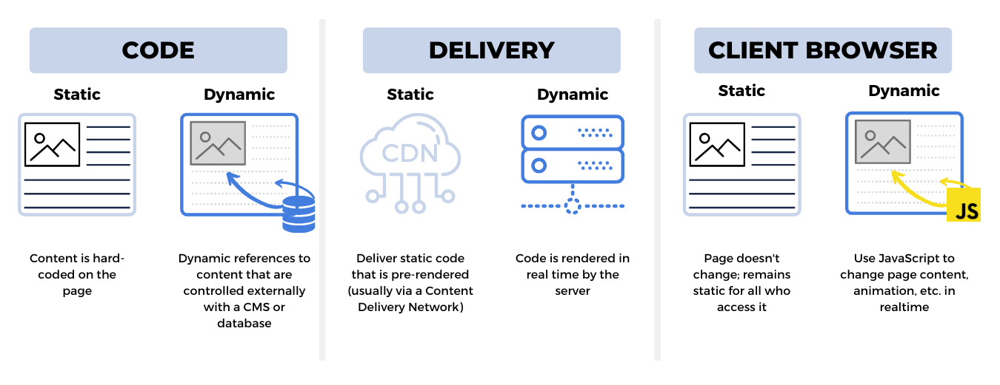

## 3.5. Funcionamiento de una Web Dinámica

En las unidades anteriores hemos explorado cómo se comunican las aplicaciones web mediante HTTP y APIs. Sin embargo, aún no hemos profundizado en una pregunta fundamental: **¿cómo se genera realmente el contenido que vemos en el navegador?** 

Cuando visitáis una red social y veis vuestro feed personalizado, cuando consultáis vuestro saldo bancario online, o cuando buscáis productos en una tienda web, estáis interactuando con **páginas web dinámicas**. Estas páginas no existen como archivos estáticos esperando en el servidor, sino que se construyen en el momento exacto en que las solicitáis, adaptándose a vuestras necesidades específicas.

Esta capacidad de generar contenido personalizado y adaptativo es lo que diferencia a la web moderna de los primeros sitios web estáticos de los años 90. Entender cómo funciona este proceso es fundamental para cualquier profesional del desarrollo y despliegue de aplicaciones web.

### 1. La evolución: de lo estático a lo dinámico

Para comprender completamente las páginas web dinámicas, primero debemos entender de dónde venimos. La web no comenzó siendo dinámica; su evolución ha sido progresiva y responde a las crecientes necesidades de interactividad y personalización.

#### 1.1. El inicio: páginas web estáticas

En los primeros días de Internet (años 90), todas las páginas web eran **estáticas**. Tim Berners-Lee, cuando creó la primera página web en 1991, simplemente escribió un documento HTML que describía el proyecto World Wide Web. Ese archivo HTML se guardaba en un servidor y se enviaba exactamente igual a cualquier persona que lo solicitara.

**¿Qué es una página web estática?**

Una página web estática es como un libro impreso: su contenido está fijado en el momento de su creación y no cambia a menos que alguien edite manualmente el archivo. Son páginas compuestas por archivos predefinidos (HTML, CSS, JavaScript) que se almacenan directamente en el servidor.

**El proceso es extremadamente simple:**

1. Un desarrollador crea un archivo `index.html` con todo el contenido    
2. El archivo se sube al servidor web    
3. Cuando un usuario solicita la página, el servidor simplemente lee el archivo del disco y lo envía   
4. Todos los usuarios reciben exactamente el mismo contenido   

**Ejemplo de página estática simple:**

```html
<!DOCTYPE html>
<html lang="es">
<head>
    <meta charset="UTF-8">
    <title>Mi Portfolio</title>
    <link rel="stylesheet" href="estilos.css">
</head>
<body>
    <header>
        <h1>Bienvenidos a mi portfolio</h1>
        <nav>
            <a href="index.html">Inicio</a>
            <a href="proyectos.html">Proyectos</a>
            <a href="contacto.html">Contacto</a>
        </nav>
    </header>
    
    <main>
        <h2>Sobre mí</h2>
        <p>Soy un desarrollador web con 5 años de experiencia...</p>
        
        <h2>Mis proyectos destacados</h2>
        <ul>
            <li>Aplicación de gestión de tareas</li>
            <li>Tienda online de productos artesanales</li>
            <li>Blog personal sobre tecnología</li>
        </ul>
    </main>
    
    <footer>
        <p>&copy; 2025 Mi Portfolio</p>
    </footer>
</body>
</html>
```

**Características de las páginas estáticas:**

- **Contenido fijo**: El contenido es idéntico para todos los usuarios   
- **Velocidad excepcional**: No hay procesamiento, solo lectura y envío de archivos   
- **Simplicidad**: Fáciles de crear y desplegar   
- **Sin servidor de aplicaciones**: Solo se necesita un servidor web básico   
- **Mantenimiento manual**: Cada cambio requiere editar el HTML y volver a subir   

**Ventajas que aún hoy las hacen valiosas:**

- **Rendimiento óptimo**: Son las páginas más rápidas posibles    
- **Seguridad**: Sin código del servidor, sin vulnerabilidades de ejecución   
- **Coste mínimo**: Hosting muy económico (incluso gratuito en GitHub Pages)   
- **Escalabilidad perfecta**: Sirven millones de usuarios con recursos mínimos   
- **SEO excelente**: Fáciles de indexar por motores de búsqueda   

**Limitaciones que motivaron la evolución:**

Sin embargo, las páginas estáticas tienen limitaciones fundamentales que rápidamente se hicieron evidentes:

- **Sin personalización**: Todos ven lo mismo   
- **Sin interacción real**: No hay formularios funcionales, ni login, ni comentarios   
- **Actualización tediosa**: Cambiar el contenido requiere editar archivos manualmente   
- **Sin datos dinámicos**: No pueden mostrar información actualizada de bases de datos   
- **Funcionalidad limitada**: No pueden ser tiendas online, redes sociales, o aplicaciones complejas   

<figure markdown="span">
  { width="700" }
  <figcaption>Comparativa visual entre elementos que pueden ser estáticos (logo, layout, imágenes) y elementos que deben ser dinámicos (contenido de usuario, feeds personalizados, datos en tiempo real). La línea entre ambos mundos muestra dónde la web moderna necesita generar contenido al vuelo</figcaption>
</figure>

Estas limitaciones llevaron a una pregunta inevitable: **¿cómo podemos hacer que las páginas se adapten a cada usuario y situación?** La respuesta fue el desarrollo de las páginas web dinámicas.

#### 1.2. La revolución: páginas web dinámicas

A mediados de los años 90, surgió la necesidad de crear páginas que pudieran **cambiar su contenido** según diferentes factores: el usuario que las visita, la hora del día, datos almacenados en bases de datos, o las acciones del usuario.

**¿Qué es una página web dinámica?**

Una página web dinámica es aquella que **se genera en el momento** de la solicitud. El servidor no simplemente lee un archivo y lo envía; en su lugar, **ejecuta código** que construye la página HTML específicamente para esa petición.

Es como un chef que prepara cada plato al momento según las preferencias del cliente, en lugar de servir platos pre-cocinados.

**El cambio de paradigma:**

Lo revolucionario de las páginas dinámicas no es solo que el contenido cambie, sino que **se genera mediante programación**. Esto significa que el servidor ejecuta código (PHP, Python, Java, etc.) que:

1. Puede consultar bases de datos   
2. Puede realizar cálculos   
3. Puede tomar decisiones basadas en condiciones   
4. Puede personalizar el contenido para cada usuario   
5. Puede procesar datos enviados por formularios   

**Ejemplo conceptual de la diferencia:**

**Página estática (todos ven lo mismo):**
```html
<h1>Bienvenido a nuestra web</h1>
<p>Últimas noticias del 15 de noviembre de 2025</p>
```

**Página dinámica (cada usuario ve contenido personalizado):**
```php
<?php
// Este código se ejecuta en el servidor
$nombreUsuario = obtenerNombreUsuarioSesion();
$fechaActual = date('d \de F \de Y');
?>

<h1>Bienvenido, <?php echo $nombreUsuario; ?></h1>
<p>Últimas noticias del <?php echo $fechaActual; ?></p>
```

**Características fundamentales de las páginas dinámicas:**

- **Contenido variable**: Diferente según usuario, hora, datos, etc.    
- **Interactividad real**: Formularios funcionales, login, comentarios, búsquedas    
- **Conexión con bases de datos**: Almacena y recupera información   
- **Lógica de negocio**: Puede tomar decisiones y ejecutar procesos complejos   
- **Actualización sencilla**: Cambiar datos en la BD actualiza automáticamente el sitio   

Esta capacidad de generar contenido dinámicamente abrió las puertas a toda la web moderna que conocemos hoy: redes sociales, comercio electrónico, banca online, aplicaciones web complejas, y mucho más.

### 2. Cómo funciona una página web dinámica: el proceso completo

Ahora que entendemos **por qué** necesitamos páginas dinámicas, profundicemos en **cómo** funcionan exactamente. El proceso es fascinante y es importante que lo comprendáis bien, ya que es la base de todo el desarrollo web backend.

#### 2.1. Los actores del proceso

Antes de ver el flujo completo, identifiquemos a los participantes:

**1. Cliente (Navegador)**

- El navegador del usuario que solicita la página   
- Envía peticiones HTTP   
- Recibe y renderiza el HTML final   

**2. Servidor Web**

- Software como Apache o Nginx   
- Recibe las peticiones HTTP   
- Decide si la petición es para contenido estático o dinámico   
- Sirve archivos estáticos directamente   
- Delega páginas dinámicas al módulo correspondiente    

**3. Módulo de Ejecución / Servidor de Aplicaciones**

- Ejecuta el código del lado del servidor   
- Puede ser un módulo integrado (mod_php) o externo (Tomcat, Gunicorn)   
- Procesa el código dinámico (PHP, Python, Java, etc.)   

**4. Base de Datos**

- Almacena la información de la aplicación   
- Responde a consultas del código dinámico   
- MySQL, PostgreSQL, MongoDB, etc.   

**5. Sistema de Archivos**

- Almacena los scripts del servidor y recursos estáticos   
- El código dinámico lee archivos de plantillas, configuración, etc.   

#### 2.2. El flujo completo: paso a paso

Veamos qué sucede exactamente cuando un usuario solicita una página dinámica. Imaginemos que un usuario quiere ver su perfil en una red social:

<figure markdown="span">
  { width="700" }
  <figcaption>Diagrama del flujo completo de una petición web dinámica: el navegador solicita una página, el servidor web la recibe, el servidor de aplicaciones ejecuta el código, se consulta la base de datos, se genera el HTML dinámicamente y finalmente se envía al navegador del usuario</figcaption>
</figure>

**Paso 1: El usuario solicita la página**

```
Usuario hace clic en: https://redsocial.com/perfil/ana
```

El navegador envía una petición HTTP GET al servidor:

```http
GET /perfil/ana HTTP/1.1
Host: redsocial.com
Cookie: session_id=abc123def456
User-Agent: Mozilla/5.0 ...
```

**Paso 2: El servidor web recibe la petición**

El servidor web (por ejemplo, Apache) recibe la petición en el puerto 80 (HTTP) o 443 (HTTPS). Analiza la URL solicitada: `/perfil/ana`

El servidor web **toma una decisión**:

- Si fuera `/imagen.jpg` → Archivo estático, lo sirve directamente   
- Si es `/perfil/ana` → Página dinámica, necesita procesamiento   

Como es una página dinámica, el servidor web **no puede servirla directamente**. En su lugar, debe delegar la tarea.

**Paso 3: Delegación al módulo de ejecución**

El servidor web identifica qué tecnología debe manejar esta petición (basándose en la configuración y la extensión del archivo):

- Si es PHP: Llama a `mod_php` o PHP-FPM    
- Si es Python: Llama a Gunicorn/uWSGI   
- Si es Java: Redirige a Tomcat   
- Si es Node.js: Redirige al proceso Node   

El servidor web le dice al módulo: *"Ejecuta el script en /perfil/ana y dame el resultado"*

**Paso 4: El código dinámico se ejecuta**

Ahora el código del lado del servidor entra en acción. Veamos un ejemplo en PHP:

```php
<?php
// Archivo: perfil.php
session_start(); // Iniciar sesión

// 1. Obtener el nombre de usuario de la URL
$username = $_GET['usuario']; // "ana"

// 2. Verificar que el usuario está logueado
if (!isset($_SESSION['usuario_id'])) {
    header('Location: /login');
    exit();
}

// 3. Conectar a la base de datos
$db = new PDO('mysql:host=localhost;dbname=redsocial', 'user', 'pass');

// 4. Consultar información del usuario
$stmt = $db->prepare('SELECT * FROM usuarios WHERE username = ?');
$stmt->execute([$username]);
$usuario = $stmt->fetch();

// 5. Si el usuario no existe, mostrar error
if (!$usuario) {
    http_response_code(404);
    echo "Usuario no encontrado";
    exit();
}

// 6. Consultar las publicaciones del usuario
$stmt = $db->prepare('SELECT * FROM posts WHERE usuario_id = ? ORDER BY fecha DESC LIMIT 10');
$stmt->execute([$usuario['id']]);
$posts = $stmt->fetchAll();

// 7. Generar el HTML dinámicamente
?>
<!DOCTYPE html>
<html lang="es">
<head>
    <meta charset="UTF-8">
    <title>Perfil de <?php echo htmlspecialchars($usuario['nombre']); ?></title>
    <link rel="stylesheet" href="/css/estilos.css">
</head>
<body>
    <header>
        <h1>Red Social</h1>
        <nav>
            <a href="/inicio">Inicio</a>
            <a href="/perfil/<?php echo $_SESSION['username']; ?>">Mi Perfil</a>
            <a href="/logout">Salir</a>
        </nav>
    </header>
    
    <main>
        <div class="perfil">
            " 
                 alt="Foto de perfil">
            <h2><?php echo htmlspecialchars($usuario['nombre']); ?></h2>
            <p><?php echo htmlspecialchars($usuario['bio']); ?></p>
            <p>Miembro desde: <?php echo date('d/m/Y', strtotime($usuario['fecha_registro'])); ?></p>
        </div>
        
        <section class="publicaciones">
            <h3>Publicaciones recientes</h3>
            <?php foreach ($posts as $post): ?>
                <article class="post">
                    <p><?php echo htmlspecialchars($post['contenido']); ?></p>
                    <small>Publicado el <?php echo date('d/m/Y H:i', strtotime($post['fecha'])); ?></small>
                </article>
            <?php endforeach; ?>
            
            <?php if (count($posts) == 0): ?>
                <p>Este usuario aún no ha publicado nada.</p>
            <?php endif; ?>
        </section>
    </main>
    
    <footer>
        <p>&copy; 2025 Red Social</p>
    </footer>
</body>
</html>
```

**Lo que acaba de suceder es extraordinario:**

El servidor ha **construido una página HTML única** para esta petición específica:

- Verificó la sesión del usuario   
- Consultó la base de datos para obtener información de "ana"   
- Obtuvo sus publicaciones recientes   
- Generó HTML personalizado con toda esa información   
- Incluyó la fecha actual formateada   
- Aplicó lógica condicional (si no hay posts, muestra un mensaje diferente)   

**Paso 5: Consultas a la base de datos**

Durante la ejecución del código, se realizaron varias consultas SQL:

```sql
-- Primera consulta: obtener datos del usuario
SELECT * FROM usuarios WHERE username = 'ana';

-- Segunda consulta: obtener publicaciones
SELECT * FROM posts WHERE usuario_id = 42 ORDER BY fecha DESC LIMIT 10;
```

La base de datos busca en sus tablas, recupera los datos y los devuelve al código PHP. Estas operaciones pueden tomar desde milisegundos hasta segundos, dependiendo de:

- La complejidad de las consultas   
- El tamaño de las tablas   
- Los índices definidos   
- La carga del servidor de base de datos   

**Paso 6: Generación del HTML final**

El código PHP ha mezclado:

- **HTML estático**: Estructura básica, estilos, navegación    
- **Datos de la base de datos**: Nombre, bio, publicaciones de Ana     
- **Lógica condicional**: Mostrar u ocultar elementos según condiciones    
- **Datos de sesión**: Identificar al usuario logueado    
- **Fecha actual**: Generada en el momento   

El resultado es un **documento HTML completo** listo para enviar al navegador.

**Paso 7: El servidor web envía la respuesta**

El módulo PHP devuelve el HTML generado al servidor web (Apache), que construye la respuesta HTTP completa:

```http
HTTP/1.1 200 OK
Date: Tue, 19 Nov 2025 19:30:00 GMT
Server: Apache/2.4.41
Content-Type: text/html; charset=utf-8
Content-Length: 2847
Set-Cookie: session_id=abc123def456; Path=/; HttpOnly

<!DOCTYPE html>
<html lang="es">
<head>
    <meta charset="UTF-8">
    <title>Perfil de Ana García</title>
    ...
```

**Paso 8: El navegador recibe y renderiza**

El navegador del usuario recibe esta respuesta HTTP. Para el navegador, **no hay diferencia** entre una página estática y una dinámica: ambas llegan como HTML.

El navegador:

1. Parsea el HTML  
2. Construye el DOM    
3. Descarga CSS y JavaScript referenciados   
4. Descarga imágenes    
5. Renderiza la página visualmente    
6. Ejecuta JavaScript del lado del cliente    

El usuario ve su página personalizada, ¡sin saber todo el proceso que acaba de ocurrir!

#### 2.3. Diferencias clave en el tiempo de respuesta

Es importante entender que las páginas dinámicas son **más lentas** que las estáticas, pero esta "lentitud" es el precio de la funcionalidad:

**Página estática:**
```
Petición → Leer archivo del disco → Enviar
Tiempo típico: 5-20 ms
```

**Página dinámica:**
```
Petición → Ejecutar código → Consultar BD → Generar HTML → Enviar
Tiempo típico: 50-500 ms (o más si las consultas son complejas)
```

Sin embargo, esta diferencia es **totalmente aceptable** porque:

- Los usuarios esperan algo de delay para operaciones complejas    
- Se pueden aplicar técnicas de caché    
- El hardware moderno es muy rápido    
- La funcionalidad obtenida justifica ampliamente el coste    

!!! note "Optimización es clave"
    Aunque las páginas dinámicas son más lentas, un buen desarrollador debe optimizar:
    - Consultas SQL eficientes con índices
    - Caché de resultados frecuentes
    - Código eficiente sin operaciones innecesarias
    - Uso de CDN para recursos estáticos
    - Técnicas como lazy loading

### 3. Tecnologías de generación de páginas web dinámicas

Ahora que comprendemos el proceso, exploremos las **tecnologías** que hacen posible la generación dinámica de contenido. A lo largo de la historia de la web, han surgido múltiples lenguajes y frameworks, cada uno con sus fortalezas y casos de uso ideales.

#### 3.1. Panorama general de tecnologías

El desarrollo web del lado del servidor ha evolucionado enormemente, pero todos los enfoques comparten el mismo objetivo fundamental: **ejecutar código en el servidor que genera HTML dinámicamente**.

Las principales familias de tecnologías son:

**1. PHP**: El lenguaje más popular de la web, presente en WordPress, Facebook inicial, Wikipedia   
**2. Python**: Con frameworks como Django y Flask, usado por Instagram, Spotify   
**3. Java**: Robusto y empresarial, con JSP, Servlets, Spring Boot 
**4. JavaScript/Node.js**: JavaScript en el servidor, usado por Netflix, LinkedIn      
**5. Ruby**: Con Ruby on Rails, usado por GitHub, Shopify    
**6. C#/ASP.NET**: De Microsoft, popular en entornos empresariales Windows    

Cada una de estas tecnologías representa una forma diferente de resolver el mismo problema, y la elección depende de múltiples factores: el equipo de desarrollo, los requisitos del proyecto, el ecosistema de librerías, y las preferencias personales.

#### 3.2. PHP: el lenguaje que construyó la web

PHP (Hypertext Preprocessor) es, sin lugar a dudas, el lenguaje más ubicuo en el desarrollo web. A pesar de las críticas que a veces recibe, PHP sigue siendo el motor detrás de una parte masiva de Internet.

**¿Por qué PHP tuvo tanto éxito?**

PHP fue diseñado específicamente para la web desde su creación en 1995. Su propuesta era simple: permitir a los desarrolladores **incrustar código directamente en HTML**. Esta simplicidad lo hizo extremadamente accesible.

**Ejemplo "Hola Mundo" en PHP:**

```php
<!DOCTYPE html>
<html lang="es">
<head>
    <meta charset="UTF-8">
    <title>Ejemplo PHP</title>
</head>
<body>
    <h1>Hola Mundo desde PHP</h1>
    
    <?php
    // Todo el código entre <?php y ?> se ejecuta en el servidor
    $nombre = "Estudiante";
    $hora = date('H');
    
    // Saludo personalizado según la hora
    if ($hora < 12) {
        $saludo = "Buenos días";
    } elseif ($hora < 20) {
        $saludo = "Buenas tardes";
    } else {
        $saludo = "Buenas noches";
    }
    
    echo "<p>$saludo, $nombre! Son las " . date('H:i') . "</p>";
    ?>
    
    <h2>Lista dinámica</h2>
    <ul>
    <?php
    $lenguajes = ['PHP', 'Python', 'JavaScript', 'Java', 'Ruby'];
    foreach ($lenguajes as $index => $lenguaje) {
        echo "<li>Lenguaje #" . ($index + 1) . ": $lenguaje</li>";
    }
    ?>
    </ul>
    
    <?php
    // Conectar a base de datos
    $db = new PDO('mysql:host=localhost;dbname=ejemplo', 'user', 'pass');
    $usuarios = $db->query('SELECT nombre FROM usuarios LIMIT 5')->fetchAll();
    ?>
    
    <h2>Usuarios registrados</h2>
    <ul>
    <?php foreach ($usuarios as $usuario): ?>
        <li><?php echo htmlspecialchars($usuario['nombre']); ?></li>
    <?php endforeach; ?>
    </ul>
</body>
</html>
```

**Frameworks PHP modernos:**

Aunque PHP puro es poderoso, los frameworks modernos añaden estructura y mejores prácticas:

**Laravel** - El framework PHP más popular actualmente:
```php
// routes/web.php
Route::get('/perfil/{username}', function ($username) {
    $usuario = Usuario::where('username', $username)->firstOrFail();
    return view('perfil', ['usuario' => $usuario]);
});

// resources/views/perfil.blade.php
<!DOCTYPE html>
<html>
<head>
    <title>Perfil de {{ $usuario->nombre }}</title>
</head>
<body>
    <h1>{{ $usuario->nombre }}</h1>
    <p>{{ $usuario->bio }}</p>
    
    @if($usuario->posts->count() > 0)
        <h2>Publicaciones</h2>
        @foreach($usuario->posts as $post)
            <article>
                <p>{{ $post->contenido }}</p>
                <small>{{ $post->created_at->diffForHumans() }}</small>
            </article>
        @endforeach
    @else
        <p>Sin publicaciones aún.</p>
    @endif
</body>
</html>
```

Laravel proporciona: ORM (Eloquent), sistema de plantillas (Blade), routing, autenticación, y mucho más.

**Ventajas de PHP:**

- Hosting económico y universal   
- Curva de aprendizaje suave   
- Enorme ecosistema (WordPress, Laravel, Symfony)   
- Documentación exhaustiva    
- Gran comunidad   

**Desventajas:**

- Inconsistencias históricas en el lenguaje    
- Rendimiento inferior a lenguajes compilados    
- Algunas prácticas antiguas persisten    

#### 3.3. Python: elegancia y versatilidad

Python se ha convertido en uno de los lenguajes más queridos para desarrollo web, especialmente con frameworks como Django y Flask.

**Django** - El framework "batteries included":

```python
# models.py
from django.db import models

class Usuario(models.Model):
    username = models.CharField(max_length=50, unique=True)
    nombre = models.CharField(max_length=100)
    bio = models.TextField()
    fecha_registro = models.DateTimeField(auto_now_add=True)
    
    def __str__(self):
        return self.nombre

class Post(models.Model):
    usuario = models.ForeignKey(Usuario, on_delete=models.CASCADE, related_name='posts')
    contenido = models.TextField()
    fecha = models.DateTimeField(auto_now_add=True)

# views.py
from django.shortcuts import render, get_object_or_404
from .models import Usuario

def perfil(request, username):
    usuario = get_object_or_404(Usuario, username=username)
    posts = usuario.posts.all().order_by('-fecha')[:10]
    
    context = {
        'usuario': usuario,
        'posts': posts
    }
    
    return render(request, 'perfil.html', context)

# urls.py
from django.urls import path
from . import views

urlpatterns = [
    path('perfil/<str:username>/', views.perfil, name='perfil'),
]
```

```django
<!-- templates/perfil.html -->
<!DOCTYPE html>
<html lang="es">
<head>
    <meta charset="UTF-8">
    <title>Perfil de {{ usuario.nombre }}</title>
</head>
<body>
    <h1>{{ usuario.nombre }}</h1>
    <p>@{{ usuario.username }}</p>
    <p>{{ usuario.bio }}</p>
    <p>Miembro desde: {{ usuario.fecha_registro|date:"d/m/Y" }}</p>
    
    <h2>Publicaciones</h2>
    
        
            <article>
                <p>{{ post.contenido }}</p>
                <small>{{ post.fecha|timesince }} atrás</small>
            </article>
        
    
        <p>Sin publicaciones todavía.</p>
    
</body>
</html>
```

**Flask** - El microframework minimalista:

```python
from flask import Flask, render_template
from flask_sqlalchemy import SQLAlchemy

app = Flask(__name__)
app.config['SQLALCHEMY_DATABASE_URI'] = 'sqlite:///redsocial.db'
db = SQLAlchemy(app)

class Usuario(db.Model):
    id = db.Column(db.Integer, primary_key=True)
    username = db.Column(db.String(50), unique=True)
    nombre = db.Column(db.String(100))
    bio = db.Column(db.Text)

@app.route('/perfil/<username>')
def perfil(username):
    usuario = Usuario.query.filter_by(username=username).first_or_404()
    posts = usuario.posts.order_by(Post.fecha.desc()).limit(10).all()
    return render_template('perfil.html', usuario=usuario, posts=posts)

if __name__ == '__main__':
    app.run(debug=True)
```

**Ventajas de Python:**

- Sintaxis limpia y legible    
- Excelente para aplicaciones complejas    
- Fuerte en machine learning e IA    
- Gran ecosistema científico    

**Desventajas:**

- Hosting menos común que PHP    
- Rendimiento (aunque mejora con PyPy)    
- Global Interpreter Lock (GIL) limita concurrencia    

#### 3.4. Java: robustez empresarial

Java ha sido durante décadas la opción preferida para aplicaciones empresariales de gran escala.

**JSP (JavaServer Pages)** - El enfoque clásico:

```jsp
<%@ page contentType="text/html;charset=UTF-8" language="java" %>
<%@ page import="com.ejemplo.modelo.Usuario, java.util.List" %>
<!DOCTYPE html>
<html>
<head>
    <title>Ejemplo JSP</title>
</head>
<body>
    <h1>Hola Mundo desde JSP</h1>
    
    <%
        String nombre = "Estudiante";
        int hora = java.time.LocalTime.now().getHour();
        String saludo;
        
        if (hora < 12) {
            saludo = "Buenos días";
        } else if (hora < 20) {
            saludo = "Buenas tardes";
        } else {
            saludo = "Buenas noches";
        }
    %>
    
    <p><%= saludo %>, <%= nombre %>!</p>
    
    <h2>Lista dinámica</h2>
    <ul>
    <%
        String[] lenguajes = {"Java", "Python", "JavaScript", "Ruby", "Go"};
        for (int i = 0; i < lenguajes.length; i++) {
            out.println("<li>Lenguaje #" + (i+1) + ": " + lenguajes[i] + "</li>");
        }
    %>
    </ul>
</body>
</html>
```

**Spring Boot** - El framework moderno:

```java
// Modelo
@Entity
public class Usuario {
    @Id
    @GeneratedValue(strategy = GenerationType.IDENTITY)
    private Long id;
    private String username;
    private String nombre;
    private String bio;
    
    @OneToMany(mappedBy = "usuario")
    private List<Post> posts;
    
    // Getters y setters...
}

// Controlador
@Controller
public class PerfilController {
    
    @Autowired
    private UsuarioRepository usuarioRepo;
    
    @GetMapping("/perfil/{username}")
    public String perfil(@PathVariable String username, Model model) {
        Usuario usuario = usuarioRepo.findByUsername(username)
                .orElseThrow(() -> new UsuarioNoEncontradoException());
        
        List<Post> posts = usuario.getPosts().stream()
                .sorted(Comparator.comparing(Post::getFecha).reversed())
                .limit(10)
                .collect(Collectors.toList());
        
        model.addAttribute("usuario", usuario);
        model.addAttribute("posts", posts);
        
        return "perfil";
    }
}
```

```html
<!-- perfil.html con Thymeleaf -->
<!DOCTYPE html>
<html xmlns:th="http://www.thymeleaf.org">
<head>
    <meta charset="UTF-8">
    <title th:text="${usuario.nombre}">Perfil</title>
</head>
<body>
    <h1 th:text="${usuario.nombre}">Nombre</h1>
    <p th:text="${usuario.bio}">Biografía</p>
    
    <h2>Publicaciones</h2>
    <div th:if="${#lists.isEmpty(posts)}">
        <p>Sin publicaciones.</p>
    </div>
    <div th:each="post : ${posts}">
        <article>
            <p th:text="${post.contenido}"></p>
            <small th:text="${#temporals.format(post.fecha, 'dd/MM/yyyy HH:mm')}"></small>
        </article>
    </div>
</body>
</html>
```

**Ventajas de Java:**
- Rendimiento excelente
- Tipado fuerte previene errores
- Ideal para aplicaciones grandes
- Ecosistema empresarial maduro

**Desventajas:**
- Verbosidad del código
- Curva de aprendizaje pronunciada
- Configuración compleja (aunque Spring Boot mejora esto)

#### 3.5. Node.js: JavaScript en todas partes

Node.js revolucionó el desarrollo web al permitir usar JavaScript tanto en el frontend como en el backend.

**Express.js** - El framework minimalista:

```javascript
const express = require('express');
const { sequelize, Usuario, Post } = require('./models');
const app = express();

// Motor de plantillas
app.set('view engine', 'ejs');

// Ruta del perfil
app.get('/perfil/:username', async (req, res) => {
    try {
        const usuario = await Usuario.findOne({
            where: { username: req.params.username },
            include: [{
                model: Post,
                limit: 10,
                order: [['fecha', 'DESC']]
            }]
        });
        
        if (!usuario) {
            return res.status(404).send('Usuario no encontrado');
        }
        
        res.render('perfil', { usuario });
    } catch (error) {
        console.error(error);
        res.status(500).send('Error del servidor');
    }
});

app.listen(3000, () => {
    console.log('Servidor escuchando en puerto 3000');
});
```

```html
<!-- views/perfil.ejs -->
<!DOCTYPE html>
<html lang="es">
<head>
    <meta charset="UTF-8">
    <title>Perfil de <%= usuario.nombre %></title>
</head>
<body>
    <h1><%= usuario.nombre %></h1>
    <p>@<%= usuario.username %></p>
    <p><%= usuario.bio %></p>
    
    <h2>Publicaciones</h2>
    <% if (usuario.Posts && usuario.Posts.length > 0) { %>
        <% usuario.Posts.forEach(post => { %>
            <article>
                <p><%= post.contenido %></p>
                <small><%= new Date(post.fecha).toLocaleString() %></small>
            </article>
        <% }); %>
    <% } else { %>
        <p>Sin publicaciones aún.</p>
    <% } %>
</body>
</html>
```

**Ventajas de Node.js:**

- Un solo lenguaje (JavaScript) para todo    
- Excelente para I/O intensivo    
- NPM: el mayor ecosistema de paquetes    
- Ideal para aplicaciones en tiempo real   

**Desventajas:**

- Single-threaded (aunque asíncrono)   
- JavaScript puede ser propenso a errores     
- Menos maduro para aplicaciones empresariales tradicionales    

### 4. Tabla comparativa de tecnologías

| Tecnología   | Lenguaje   | Framework Popular | Paradigma           | Ventaja Principal        | Ideal Para                 |
|:-------------|:-----------|:------------------|:--------------------|:-------------------------|:---------------------------|
| **PHP**      | PHP        | Laravel           | Código embebido/MVC | Hosting universal        | Blogs, CMS, e-commerce     |
| **Python**   | Python     | Django, Flask     | MVC                 | Elegancia y versatilidad | Aplicaciones complejas, ML |
| **Java**     | Java       | Spring Boot       | MVC                 | Robustez empresarial     | Grandes empresas, banca    |
| **Node.js**  | JavaScript | Express           | Event-driven        | JavaScript everywhere    | APIs, tiempo real          |
| **Ruby**     | Ruby       | Rails             | MVC                 | Productividad dev        | Startups, MVPs             |
| **C#**       | C#         | ASP.NET Core      | MVC                 | Integración Microsoft    | Entornos Windows           |

## Resumen de la unidad

En esta unidad hemos realizado un viaje completo por el funcionamiento de las páginas web dinámicas:

1. **Evolución histórica**: De las páginas estáticas simples a las complejas aplicaciones dinámicas actuales.

2. **Proceso completo**: Entendimos paso a paso cómo se solicita, procesa, genera y entrega una página dinámica.

3. **Tecnologías diversas**: Exploramos PHP, Python, Java y Node.js, cada una con sus fortalezas.

4. **Arquitectura**: Comprendimos la interacción entre servidor web, servidor de aplicaciones y base de datos.

Las páginas web dinámicas son la columna vertebral de la web moderna. Sin ellas, no existirían las redes sociales, el comercio electrónico, la banca online, ni la mayoría de servicios que usamos diariamente.

## Referencias y bibliografía

- [Jose Luis González](https://github.com/joseluisgs). *Despliegue de aplicaciones Web - 2025 2026*. [https://github.com/joseluisgs/DespliegueAplicacionesWeb-00-2025-2026](https://github.com/joseluisgs/DespliegueAplicacionesWeb-00-2025-2026)     
- Mozilla Developer Network. (2024). *Server-side website programming*      
- W3C. (2024). *Dynamic web content*  
- Laravel Documentation. (2024). [https://laravel.com/docs](https://laravel.com/docs)    
- Django Documentation. (2024). [https://docs.djangoproject.com/](https://docs.djangoproject.com/)    

## Presentación

Puedes acceder a la presentación de esta unidad aquí:

[Presentación DAW-U3.5 - Funcionamiento de una Web Dinámica](https://revilofe.github.io/slides/section4-daw/DAW-U3.5.-WebDinamica.html)

## Recursos adicionales

- [PHP.net](https://www.php.net/) - Documentación oficial de PHP
- [Django Tutorial](https://docs.djangoproject.com/en/stable/intro/tutorial01/) - Tutorial oficial de Django
- [Express.js Guide](https://expressjs.com/en/guide/routing.html) - Guía de Express
- [Spring Boot Guides](https://spring.io/guides) - Tutoriales de Spring Boot
