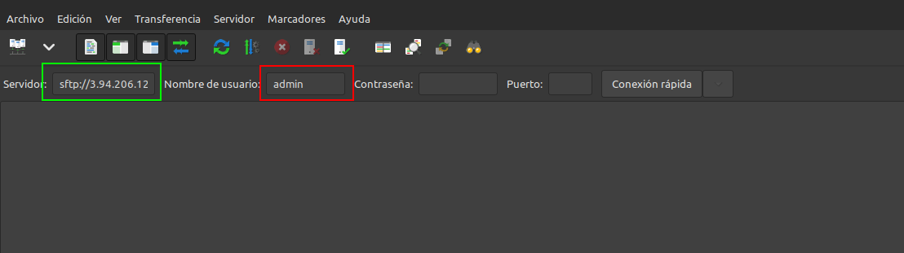
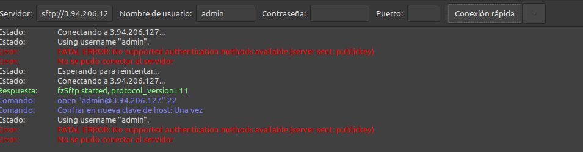
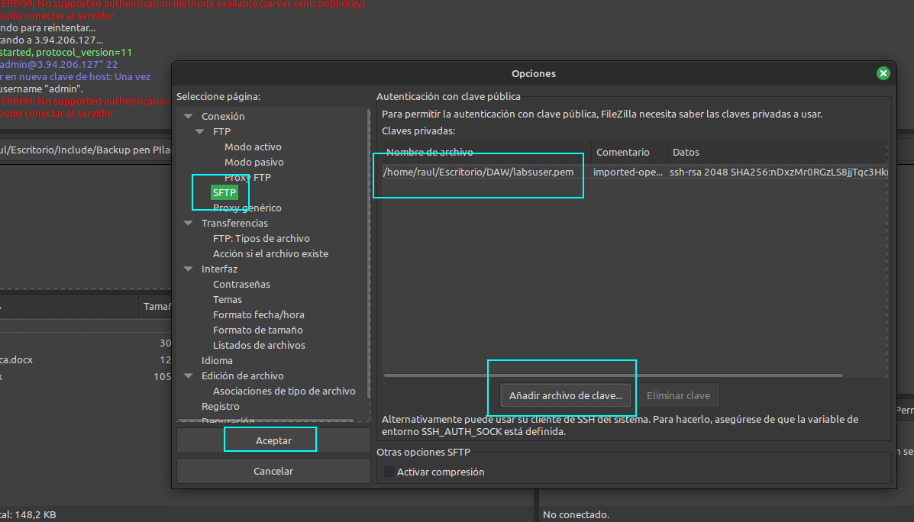

## P4.1 - Instalación y configuración de servidor web Nginx

Antes de nada, recordar que ya hablamos de servidores web en la [unidad anterior](../../u03/teoria/DAW-U3.7.-ServidoresWeb/), así que si tenéis dudas sobre qué es un servidor web, su función, tipos, etc., podéis volver a esa unidad para refrescar conceptos.

!!! warning "Advertencia"
    Durante esta práctica, aprenderemos a instalar y configurar un servidor web Nginx, así como a transferir archivos mediante SFTP y a asegurar el servidor con HTTPS. Los puntos desde el 1 hasta 6 son de contexto previo, pero  luego tendrás que llevarlos a cabo durante los puntos 7 y 8, es decir, en estos dos últimos puntos pondrás en práctica todo lo visto en 1 hasta 6, y aprenderás a crear una infraestructura de servidor web. El punto 9 es una checklist de evaluación y evidencias.

### 1. Introducción y caso de uso

El servidor web Nginx (pronunciado "engine x") es un servidor web de código abierto y de alto rendimiento que se utiliza para alojar sitios web y aplicaciones web. Fue desarrollado inicialmente por Igor Sysoev en 2004 y desde entonces ha ganado una gran popularidad debido a su eficiencia, escalabilidad y capacidad para manejar grandes volúmenes de tráfico. Nginx se destaca por su arquitectura basada en eventos, que le permite manejar múltiples conexiones simultáneas de manera eficiente, lo que lo hace ideal para sitios web con alto tráfico. 

Además de ser un servidor web tradicional (su origen), Nginx se ha convertido en una navaja suiza para la infraestructura moderna gracias a su rendimiento y bajo consumo de recursos. Aquí tienes sus casos de uso principales explicados de forma práctica:

#### 1.1 Servidor de Contenido Estático (Web Server)
Este es el uso más básico y eficiente. Nginx es extremadamente rápido sirviendo archivos que no cambian (imágenes, HTML, CSS, JavaScript).

* **Por qué usarlo:** Consume mucha menos memoria que Apache para esta tarea.    
* **Ejemplo:** Alojar un blog estático (Hugo/Jekyll) o el frontend compilado de una aplicación React/Vue.    

#### 1.2. Proxy Inverso (Reverse Proxy)
Actúa como intermediario: recibe las peticiones de Internet y las pasa a tu aplicación real (Node.js, Python, Java) que suele estar en otro puerto interno.

* **Por qué usarlo:** Añade una capa de seguridad (oculta tu backend real), gestiona la compresión gzip y puede servir los archivos estáticos mientras tu aplicación se dedica solo a la lógica.    
* **Tu caso:** Es lo que harías para poner delante de tu contenedor SFTP o cualquier servicio web en tu servidor Linux.

#### 1.3. Balanceador de Carga (Load Balancer)
Si tienes mucho tráfico, puedes tener 3 servidores con la misma aplicación. Nginx recibe el tráfico y lo reparte entre ellos (round-robin, menos conexiones, ip-hash, etc.).    

* **Por qué usarlo:** Si un servidor se cae, Nginx deja de enviarle tráfico automáticamente y tus usuarios no notan nada.

#### 1.4. Terminación SSL/TLS (SSL Offloading)
Nginx se encarga de cifrar y descifrar el tráfico HTTPS. Tu aplicación interna puede trabajar en HTTP simple (más rápido), ahorrándose el trabajo de criptografía.    

* **Por qué usarlo:** Centralizas los certificados en un solo lugar en vez de configurarlos en cada microservicio.

#### 1.5. Caché de Contenido (Content Caching)
Puede guardar en memoria o disco las respuestas de tu backend. Si 100 usuarios piden lo mismo, Nginx responde a 99 de ellos desde su caché sin molestar a tu base de datos.

#### 1.6. Mail Proxy
Aunque menos común hoy en día, Nginx nació también con capacidad para actuar como proxy de correo (IMAP/POP3/SMTP), redirigiendo tráfico de email a los servidores correctos.

#### 1.7 Tabla comparativa rápida
| Caso de uso       | Función principal        | Beneficio clave                     |
|:------------------|:-------------------------|:------------------------------------|
| **Web Server**    | Servir archivos físicos  | Velocidad extrema y bajo uso de RAM |
| **Proxy Inverso** | Intermediario de tráfico | Seguridad y flexibilidad            |
| **Load Balancer** | Repartir carga           | Alta disponibilidad y escalabilidad |
| **Caché**         | Guardar respuestas       | Reducción de carga en base de datos |

### 2. Instalación servidor web Nginx

Para instalar el servidor nginx en nuestra Debian, primero actualizamos los repositorios y después instalamos el paquete correspondiente:

```sh
sudo apt update

sudo apt install nginx
```

Comprobamos que nginx se ha instalado y que está funcionando correctamente:

```sh
systemctl status nginx
```

!!! info "Info"
    * **Esta práctica se ha hecho con Nginx 1.18.0**, pero eres libre de actualizar a la última versión si lo deseas.
    * En docker cambiará la forma de ver que esté funcionando, y tendrás que validar que el contenedor de Nginx está en funcionamiento con `docker compose ps`.


### 3. Creación de las carpetas del sitio web

Igual que ocurre en Apache, todos los archivos que formarán parte de un sitio web que servirá nginx se organizarán en carpetas. Estas carpetas, típicamente están dentro de `/var/www`.

Así pues, vamos a crear la carpeta de nuestro sitio web o dominio:

```sh
sudo mkdir -p /var/www/nombre_web/html
```

Donde el nombre de dominio puede ser la palabra que queráis, sin espacios.

Ahí, dentro de esa carpeta html, debéis clonar el siguiente repositorio:

`https://github.com/cloudacademy/static-website-example`

Además, haremos que el propietario de esta carpeta y todo lo que haya dentro sea el usuario `www-data`, típicamente el usuario del servicio web.

```sh
sudo chown -R www-data:www-data /var/www/nombre_web/html
```

Y le daremos los permisos adecuados para que no nos de un error de acceso no autorizado al entrar en el sitio web:

```sh
sudo chmod -R 755 /var/www/nombre_web
```

Para comprobar que el servidor está funcionando y sirviendo páginas correctamente, podéis acceder desde vuestro cliente a:

```sh
http://IP-del-servidor  # Maquina virtual, docker, etc.
```

Y os deberá aparecer algo así:

<figure markdown>
  
  <figcaption>Página por defecto de Nginx</figcaption>
</figure>

Lo que demuestra que todo es correcto hasta ahora.

#### 3.1. Estructura de Nginx

La estructura de directorios y archivos más importante de Nginx es la siguiente:

```
/etc/nginx/
├── nginx.conf              # Configuración principal
├── sites-available/        # Sitios disponibles
├── sites-enabled/          # Sitios habilitados (enlaces)
├── conf.d/                 # Configuraciones adicionales
└── snippets/               # Fragmentos reutilizables

/var/www/                   # Directorio web por defecto
└── html/
    └── index.nginx-debian.html

/var/log/nginx/             # Logs
├── access.log
└── error.log
```

#### 3.2. Configuración básica de Nginx

El archivo `/etc/nginx/nginx.conf` contiene la configuración global:

```nginx
user www-data;          # Usuario del proceso NGINX
worker_processes auto;  # Procesos worker (normalmente 1 por CPU)
pid /run/nginx.pid;

events {
    worker_connections 1024;  # Conexiones por worker
}

http {
    # Configuración HTTP
    include /etc/nginx/mime.types;
    default_type application/octet-stream;
    
    # Logs
    access_log /var/log/nginx/access.log;
    error_log /var/log/nginx/error.log;
    
    # Performance
    sendfile on;
    tcp_nopush on;
    tcp_nodelay on;
    keepalive_timeout 65;
    
    # Gzip
    gzip on;
    gzip_types text/plain text/css application/json application/javascript;
    
    # Incluir configuraciones de sitios
    include /etc/nginx/conf.d/*.conf;
    include /etc/nginx/sites-enabled/*;
}
```

Las directivas más importantes para el nginx.conf son:

- `user`: Define el usuario bajo el cual se ejecuta NGINX.   
- `worker_processes`: Especifica el número de procesos worker (normalmente igual al número de CPU).    
- `events`: Configura las conexiones por worker.   
- `http`: Contiene la configuración global para el manejo de solicitudes HTTP, incluyendo tipos MIME, logs, optimizaciones de rendimiento y compresión Gzip.    
- `include`: Permite incluir otros archivos de configuración, como los sitios habilitados.    

Para más directivas y explicaciones, podéis consultar la [documentación oficial de Nginx](https://nginx.org/en/docs/).


En cuanto al **Server Block (equivalente a Virtual Host):**

```nginx
# Archivo: /etc/nginx/sites-available/ejemplo

server {
    listen 80;
    listen [::]:80;
    
    server_name www.ejemplo.com ejemplo.com;
    root /var/www/ejemplo;
    index index.html index.php;
    
    # Logs específicos
    access_log /var/log/nginx/ejemplo_access.log;
    error_log /var/log/nginx/ejemplo_error.log;
    
    # Servir archivos estáticos
    location / {
        try_files $uri $uri/ =404;
    }
    
    # PHP con PHP-FPM
    location ~ \.php$ {
        include snippets/fastcgi-php.conf;
        fastcgi_pass unix:/var/run/php/php8.1-fpm.sock;
    }
    
    # Denegar acceso a archivos ocultos
    location ~ /\. {
        deny all;
    }
}
```
Algunas de las directivas que aparecen en la configuración de un server block son:

- `listen`: Define los puertos y direcciones IP en los que el servidor escucha.   
- `server_name`: Especifica los nombres de dominio que el servidor manejará.    
- `root`: Define el directorio raíz desde donde se servirán los archivos.   
- `index`: Especifica los archivos predeterminados que se buscarán al acceder a un directorio.    
- `location`: Configura cómo manejar diferentes tipos de solicitudes o rutas específicas.    
- `access_log` y `error_log`: Permiten definir archivos de log específicos para el sitio.    
- `fastcgi_pass`: Configura la conexión a PHP-FPM para procesar archivos PHP.    
- `deny all`: Utilizado para denegar el acceso a ciertos archivos o directorios, como archivos ocultos.    
- `try_files`: Intenta servir archivos específicos y maneja errores 404 si no se encuentran.    
- `include`: Permite incluir configuraciones adicionales, como las relacionadas con FastCGI para PHP.     

Para más directivas y más detalles, podéis consultar la [documentación oficial de Nginx sobre Server Blocks](https://nginx.org/en/docs/http/server_names.html).

### 4. Configuración de servidor web NGINX

En Nginx hay dos rutas importantes. La primera de ellas es **`sites-available`**, que contiene los archivos de configuración de los hosts virtuales o bloques disponibles en el servidor. Es decir, cada uno de los sitios webs que alberga el servido. La otra es **`sites-enabled`**, que contiene los archivos de configuración de los sitios habilitados, es decir, los que funcionan en ese momento.

Dentro de `sites-available` hay un archivo de configuración por defecto (default), que es la página que se muestra si accedemos al servidor sin indicar ningún sitio web o cuando el sitio web no es encontrado en el servidor (debido a una mala configuración por ejemplo). Esta es la página que nos ha aparecido en el apartado anterior.

!!! info "Estructura de archivos en Docker"
    Puede que la imagen oficial de Nginx (que usarás en Docker) no use la estructura `sites-available` / `sites-enabled` de Debian. Una opción es que use directamente `/etc/nginx/conf.d/default.conf`.

Para que Nginx presente el contenido de nuestra web, es necesario crear un bloque de servidor con las directivas correctas. En vez de modificar el archivo de configuración predeterminado directamente, crearemos uno nuevo en `/etc/nginx/sites-available/nombre_web`:

```console
sudo nano /etc/nginx/sites-available/vuestro_dominio
```

Y el contenido de ese archivo de configuración:

```aconf
server {
        listen 80;
        listen [::]:80;
        root /var/www/nombre_web/html;
        index index.html index.htm index.nginx-debian.html;
        server_name nombre_web;
        location / {
                try_files $uri $uri/ =404;
        }
}
```

Aquí la directiva `root` debe ir seguida de la ruta absoluta dónde se encuentra el contenido de nuestra página web.

Aquí tenéis un ejemplo de un sitio webs con su ruta (directorios que hay) antes del archivo index.html:

<figure markdown>
  
  <figcaption>Estructura de directorios del sitio web</figcaption>
</figure>

!!! info "Configuración de la ruta"
    Ruta → `/var/www/ejemplo2/html/2016_soft_landing`

Y crearemos un archivo simbólico entre este archivo y el de sitios que están habilitados, para que se dé de alta automáticamente.

```console
sudo ln -s /etc/nginx/sites-available/vuestro_dominio /etc/nginx/sites-enabled/vuestro_dominio
```

Ahora debemos recargar el servicio nginx para que se lean los nuevos cambios realizados en la configuración:

```console
sudo systemctl reload nginx
```

Para comprobar que todo ha funcionado correctamente accedemos nuevamente a la dirección IP de la máquina virtual:

```sh
http://IP-del-servidor  # Maquina virtual, docker, etc.
```

Y veremos que nos aparece el contenido de nuestra página web.

Además de esto, para mejorar nuestra experiencia durante la práctica, nos aseguraremos de que el archivo `/etc/hosts` de nuestra máquina física (cliente) contenga una línea que apunte a nuestro servidor con el nombre que le hemos dado. De esta forma podremos acceder a nuestro sitio web simplemente escribiendo el nombre del sitio en la barra de direcciones del navegador, en lugar de tener que escribir la dirección IP.

En Windows: `C:\Windows\System32\drivers\etc\hosts`
En Linux: `/etc/hosts`

```
IP-del-servidor     nombre_web
```


### 5. Archivos de log

Nginx almacena información importante sobre el servidor en dos archivos de registro, que se encuentran en:

- **`/var/log/nginx/access.log`**: cada solicitud a su servidor web se registra en este archivo de registro, a menos que Nginx esté configurado para hacer algo diferente.

- **`/var/log/nginx/error.log`**: cualquier error de Nginx se asentará en este registro.

!!! info
    Si no os aparece nada en los logs, podría pasar que el navegador ha cacheado la página web y que, por tanto, ya no está obteniendo la página del navegador sino de la propia memoria.
    Para solucionar esto, podéis acceder con el *modo privado* del navegador y ya os debería registrar esa actividad en los logs.

Si queremos tener varios dominios o sitios web en el mismo servidor nginx (es decir, que tendrán la misma IP) debemos repetir todo el proceso anterior con el nuevo nombre de dominio que queramos configurar.

### 6. FTP - Transferencia de archivos

A la hora de transferir archivos entre distintos sistemas, existen múltiples métodos. Lo más común hoy en día es utilizar sistemas de control de versiones como GitHub, GitLab o Bitbucket. Estos sistemas permiten gestionar el código fuente de manera eficiente y colaborativa, facilitando la transferencia de archivos entre diferentes entornos.
 
No obstante, el currículum del módulo obliga a enseñar un método un tanto obsoleto a día de hoy, así que vamos a ello, os presento al FTP.

#### 6.1. ¿Cómo transferir archivos desde nuestra máquina local/anfitrión a nuestra máquina virtual Debian/servidor remoto?

[El FTP](https://es.wikipedia.org/wiki/Protocolo_de_transferencia_de_archivos) es un protocolo de transferencia de archivos entre sistemas conectados a una red TCP. Como su nombre indica, se trata de un protocolo que permite transferir archivos directamente de un dispositivo a otro. Actualmente, es un protocolo que poco a poco va abandonándose, pero ha estado vigente más de 50 años.

El protocolo FTP tal cual es un protocolo inseguro, ya que su información no viaja cifrada. Sin embargo, en 2001 esto se solucionó con el protocolo **SFTP**, que le añade una capa SSH para hacerlo más seguro y privado.

**SFTP** no es más que el mismo protocolo FTP pero implementado por un canal seguro. Son las siglas de SSH File Transfer Protocol y consiste en una extensión de Secure Shell Protocol (SSH) creada para poder hacer transmisiones de archivos.

La seguridad que nos aporta **SFTP** es importante para la transferencia de archivos porque, si no disponemos de ella, los archivos viajarán tal cual por la red, sin ningún tipo de encriptación. Así pues, usando FTP tradicional, si algún agente consigue escuchar las transferencias, podría ocurrir que la información quedase al descubierto. Esto sería especialmente importante si los archivos que subimos contienen información confidencial o datos personales.

Dado que usar **SFTP** aporta mayor seguridad a las transmisiones, es recomendable utilizarlo, más aún sabiendo que realmente no hay mucha dificultad en establecer las conexiones por el protocolo seguro.

#### 6.2. Configurar servidor SFTP en instancia EC2 (Debian)

Por lo explicado en el apartado anterior, no necesitamos un software que haga de servidor FTP para nuestro objetivo, sino únicamente un servidor de SSH. Si estuvieramos utilizando un servidor en la nube (EC2 de AWS), en donde estamos desplegando nuestro servidro web, ya tendriamos un servidor SFTP instalado en nuestra instancia EC2 (OpenSSH).

**Sí necesitaremos un cliente de FTP para realizar la conexión, como por ejemplo [Filezilla](https://filezilla-project.org/)** o [WinSCP](https://winscp.net/eng/index.php). En este caso, usaremos Filezilla. Ambos son gratuitos y de código abierto, y soportan SFTP.

Tras descargar **el cliente FTP** en nuestro ordenador, introducimos los datos necesarios para conectarnos a nuestro servidor FTP (nuestra instancia EC2 Debian), o donde tenemos alojado nuestro servidor web Nginx.

<figure markdown>
  
  <figcaption>Conexión SFTP en Filezilla - Paso 1</figcaption>
</figure>

- En el caso de EC2, la IP pública de nuestra instancia EC2  (recuadro verde). Debe ir precedida de `sftp://` o en caso contrario habría que indicar que el puerto es el 22.
- El nombre de usuario de Debian (recuadro rojo)

Tras darle al botón de *Conexión rápida*, se nos muestra un error:

<figure markdown>
  
  <figcaption>Conexión SFTP en Filezilla - Error de autenticación</figcaption>
</figure>

Nos está avisando de algo que ya sabemos. Para conectarnos a esta máquina mediante SSH (puerto 22), o lo que es lo mismo, SFTP, sólo podemos hacerlo mediante el uso de claves. Así pues, necesitamos decirle a *Filezilla* qué clave debe usar. Tan fácil como ir a `Edición > Opciones`y explicitarlo:

<figure markdown>
  
  <figcaption>Configuración de claves en Filezilla</figcaption>
</figure>

Tras ello, la conexión será exitosa y accederemos directamente a la carpeta `home` de nuestro usuario `admin`:

<figure markdown>
  
  <figcaption>Conexión SFTP exitosa en Filezilla</figcaption>
</figure>

!!! Note "Autenticación con usuario/contraseña"
    Si estás en una máquina local y usas usuario/contraseña, no necesitas configurar el archivo de claves en Filezilla, basta con elegir modo de logueo 'Normal'.

Una vez conectados, buscamos la carpeta de nuestro ordenador en donde tengamos el contenido que deseamos subir, normalmente en un formato comprimido como zip, tgz, etc, (en la parte izquierda de la pantalla) y en la parte derecha de la pantalla, buscamos la carpeta donde queremos subirla. Con un doble click o utilizando *botón derecho > subir*, la subimos al servidor.

Recordemos que debemos tener nuestro sitio web en la carpeta `/var/www` y darle los permisos adecuados, de forma similiar a cómo se ha explicado anteriormente.

El comando que nos permite descomprimir un *.zip* en un directorio concreto es:

```sh
unzip archivo.zip -d /nombre/directorio
```

Si no tuvieráis unzip instalado, lo instaláis:

```sh
sudo apt-get update && sudo apt-get install unzip
```

### 7. Infraestructura inmutable con Docker

En los apartados anteriores hemos visto como configurar los servicios "a mano" sobre el sistema operativo. Sin embargo, en la industria actual, lo estándar es "contenerizar" estos servicios para que sean fáciles de desplegar y replicar.

**Vuestro objetivo:** Crear un entorno en **Docker Compose** que replique lo que habeis visto, pero de forma aislada y automatizada.

Debéis crear un archivo `docker-compose.yml` que levante una infraestructura con las siguientes características:

#### 7.1. Requisitos de la infraestructura

1.  **Servicio Web (Nginx):**
    *   Debe usar una imagen oficial de Nginx.
    *   El puerto 80 del contenedor debe estar mapeado al puerto **8080** de vuestra máquina anfitriona (para no entrar en conflicto con el Nginx que ya tenéis instalado en el sistema).
    *   Debe servir los archivos que se encuentren en un volumen compartido.

2.  **Servicio de Transferencia (SFTP):**
    *   Debe usar una imagen de SFTP (se recomienda investigar la imagen `atmoz/sftp` o similar).
    *   El puerto 22 del contenedor debe estar mapeado al puerto **2222** de vuestra máquina anfitriona.
    *   Debéis configurar un usuario y contraseña para la conexión.

3.  **Persistencia y Comunicación (La clave del ejercicio):**
    *   Los dos contenedores deben **compartir un volumen** (o una carpeta montada del anfitrión).
    *   El objetivo es que, cuando subáis un archivo mediante Filezilla al puerto 2222 (SFTP), este aparezca **inmediatamente** visible en el navegador web en el puerto 8080 (Nginx) sin necesidad de reiniciar nada.

#### 7.2. Tarea de despliegue

Una vez tengáis el `docker-compose` funcionando (comando `docker compose up`), debéis utilizar un cliente FTP (Filezilla) para conectaros a vuestro contenedor y desplegar las siguientes dos aplicaciones web:

1.  **Web Principal:**
    *   **Repositorio:** [https://github.com/cloudacademy/static-website-example](https://github.com/cloudacademy/static-website-example)
    *   **Ubicación:** Debe cargarse en la raíz del servidor. Al entrar a `http://localhost:8080`, debe verse esta web.

2.  **Web Secundaria:**
    *   **Repositorio:** [https://github.com/ArchiDep/static-clock-website](https://github.com/ArchiDep/static-clock-website)
    *   **Ubicación:** Debéis crear una carpeta llamada `/reloj` y subirla ahí. Al entrar a `http://localhost:8080/reloj`, debe verse el reloj funcionando.


!!! tip "Pistas para la resolución"
    * **Volúmenes:** Fijaos bien en las rutas internas de los contenedores. Nginx suele servir archivos desde `/usr/share/nginx/html`. Tendréis que averiguar en qué ruta guarda los archivos el contenedor SFTP que elijáis y "conectar" ambas rutas usando el mismo volumen.
    * **Usuarios:** Si usáis la imagen `atmoz/sftp`, leed su documentación sobre cómo pasar el usuario y la contraseña en la configuración del `command` o variables de entorno.
    * **Permisos con SFTP:** Si intentan subir archivos con Filezilla directamente a /var/www/nombre_web/html (como sugieres en el texto: "buscamos la carpeta donde queremos subirla... la subimos al servidor"), les dará un error de "Permiso denegado", porque su usuario no tiene permisos de escritura en una carpeta propiedad de www-data. Para la solución: Subir los archivos a una carpeta temporal y luego los muevan con `sudo mv` desde la la terminal, o añadir un paso donde añaden su usuario al grupo www-data y dan permisos de escritura al grupo (chmod g+w).

### 8. HTTPS

Ahora que ya tenéis vuestra infraestructura funcionando con contenedores, vamos a dar el paso final de seguridad. Vuestro objetivo es modificar el entorno `docker-compose` para que el servidor Nginx sirva el contenido a través de **HTTPS** utilizando un certificado autofirmado.

A diferencia de la instalación nativa (donde editaríamos archivos directamente en `/etc/nginx`), en Docker los contenedores son efímeros. Por tanto, como ya sabemos, hay que **inyectar la configuración y los certificados** desde fuera.

Para ello, a modo de prueba de concepto, nos generaremos unos certificados autofirmados y, en el fichero de configuración de nuestros hosts virtuales (los sitios web que hemos configurado), deberemos cambiar los parámetros necesarios.

Aunque os doy algo de información, la idea es que os apoyeis en una búsqueda en Internet para conseguir vuestro objetivo.


#### 8.1. Generación de certificados y Volúmenes

Lo primero es generar los certificados SSL (archivo `.crt` y `.key`) en vuestra máquina anfitriona (la misma carpeta donde tenéis el `docker-compose.yml`).

Podéis usar `openssl` para generar un certificado autofirmado válido por 365 días:

```bash
openssl req -x509 -nodes -days 365 -newkey rsa:2048 -keyout nginx-selfsigned.key -out nginx-selfsigned.crt
```

**El Reto:**
Modificad vuestro `docker-compose.yml` para:

1.  Hacer que estos dos archivos de certificado estén disponibles **dentro** del contenedor de Nginx mediante volúmenes (bind mounts).    
2.  Abrir/Mapear el puerto **443** del contenedor a un puerto libre de vuestra máquina (por ejemplo, el `8443` o el `443` si no lo estáis usando).    

#### 8.2. Inyección de la configuración de Nginx

La imagen oficial de Nginx viene con una configuración por defecto que no soporta SSL. No podemos entrar al contenedor a editarla con `nano` porque si reiniciamos el contenedor, los cambios se perderán.

**La Tarea:**

1.  Cread un archivo llamado `default.conf` en vuestra carpeta del proyecto (al lado del `docker-compose.yml`).    
2.  Buscad en internet cómo configurar un `server block` de Nginx para SSL (usando las directivas `listen 443 ssl`, `ssl_certificate`, etc.).    
3.  En esa configuración, las rutas a los certificados deben ser las **rutas internas del contenedor** donde los montasteis en el paso anterior.    
4.  Modificad el `docker-compose.yml` para montar vuestro archivo `default.conf` local sobre la configuración interna de Nginx (usualmente en `/etc/nginx/conf.d/default.conf`).    


#### 8.3. Redirección HTTP a HTTPS

Cuando hayáis cumplido con la tarea de dotar de HTTPS a vuestros sitios web, podréis pasar a esta.

Fijáos que con el estado de la configuración actual, a vuestro sitio web se puede acceder aún de dos formas simultáneas, por el puerto 80 (HTTP e inseguro) y por el puerto 443 (HTTPS, seguro). Puesto que queremos dejar la configuración bien hecha y sin posibles fisuras, vuestro objetivo es que si el usuario accede a vuestro sitio web mediante el puerto 80 (HTTP) automáticamente, por motivos de seguridad, se le redirija a HTTPS, en el puerto 443.

Configurad vuestro archivo `default.conf` para que tenga **dos bloques `server`**:

1.  Uno que escuche en el puerto 80 y redirija todo el tráfico al puerto 443 (HTTPS).     
2.  Otro que escuche en el puerto 443 y sirva la web que tenéis en el volumen compartido.

Realizad la búsqueda de información adecuada para conseguir esta redirección automática mediante los cambios necesarios en vuestros archivos de hosts virtuales.

!!! tip "Pista sobre rutas en Docker"
    Si en vuestro `docker-compose.yml` ponéis algo como:     `- ./nginx-selfsigned.crt:/etc/ssl/certs/mi-cert.crt`, entonces, en vuestro archivo `default.conf`, la directiva debe ser:     `ssl_certificate /etc/ssl/certs/mi-cert.crt;`


### 9. Checklist y evidencías

Aquí tienes una **Lista de Verificación (Checklist) de Evaluación** que tendrás que cumplir. 

1. Indica que item has completado con un ✅.
2. Adjunta una captura de pantalla como evidencia para cada requisito cumplido.


**Fase 1: Instalación y Configuración**

|  ✅   | Requisito a cumplir                                                                                                  | 📸 Evidencia requerida (Captura)                                                                                                                                                                           |
|:----:|:---------------------------------------------------------------------------------------------------------------------|:-----------------------------------------------------------------------------------------------------------------------------------------------------------------------------------------------------------|
|  1   | **Servicio Nginx activo:** El servidor web está instalado y corriendo en el sistema base.                            | Captura del comando `docker compose ps` (desde fuera) o `service nginx status` (desde dentro del contenedor) mostrando el servicio activo. Nota: `systemctl` no suele funcionar dentro de Docker.          |
|  2   | **Configuración cargada**: Se ha cargado el archivo de configuración del sitio.                                      | Captura listando el directorio de configuración dentro del contenedor (ej: `ls -l /etc/nginx/conf.d/` o `sites-enabled` según la imagen usada) donde se vea tu archivo .conf.                              |
|  3   | **Resolución de nombres:** El alumno ha configurado `/etc/hosts` (o en Windows) para usar un nombre en vez de la IP. | Captura del navegador web donde la **barra de direcciones** muestre `http://nombre_web` (no la IP) y se vea la página cargada.                                                                             |
|  4   | **Contenido Web:** Se visualiza la web de "Cloud Academy" en lugar de la página por defecto de Nginx.                | La misma captura anterior sirve, pero debe verse claramente el diseño de la web importada.                                                                                                                 |

**Fase 2: Transferencia SFTP (Filezilla)**

|  ✅   | Requisito a cumplir                                                                               | 📸 Evidencia requerida (Captura)                                                                                                                                                                                        |
|:----:|:--------------------------------------------------------------------------------------------------|:------------------------------------------------------------------------------------------------------------------------------------------------------------------------------------------------------------------------|
|  5   | **Conexión SFTP exitosa:** Conexión establecida mediante claves (o usuario/pass) al servidor.     | Captura de Filezilla mostrando en el panel de registro (arriba) "Status: Connected to..." y en el panel derecho el listado de carpetas remoto. Nota: En Docker la ruta suele ser `/home/usuario/upload`, no `/var/www`. |
|  6   | **Permisos de escritura:** El usuario ha logrado subir archivos sin error de "Permission denied". | Captura de Filezilla mostrando la transferencia completada o los archivos ya presentes en el servidor remoto.                                                                                                           |

**Fase 3: Infraestructura Docker** 

|  ✅   | Requisito a cumplir                                                                    | 📸 Evidencia requerida (Captura)                                                                                                                                                                   |
|:----:|:---------------------------------------------------------------------------------------|:---------------------------------------------------------------------------------------------------------------------------------------------------------------------------------------------------|
|  7   | **Contenedores activos:** Nginx y SFTP están corriendo simultáneamente.                | Captura del comando `docker compose ps` donde se vean los dos servicios con estado `Up` y los puertos `0.0.0.0:8080->80/tcp` y `0.0.0.0:2222->22/tcp`.                                             |
|  8   | **Persistencia (Volumen Compartido):** Lo que se sube al SFTP se ve en la Web.         | **Evidencia Cruzada:** Una captura con Filezilla abierto a un lado (mostrando archivos en `/upload`) y el navegador al otro (mostrando `localhost:8080`), demostrando que son los mismos archivos. |
|  9   | **Despliegue Multi-sitio:** Se ha desplegado la segunda web (Reloj) en una subcarpeta. | Captura del navegador en la ruta `http://localhost:8080/reloj` mostrando el reloj funcionando.                                                                                                     |

**Fase 4: Seguridad HTTPS**

|  ✅   | Requisito a cumplir                                         | 📸 Evidencia requerida (Captura)                                                                                                                                        |
|:----:|:------------------------------------------------------------|:------------------------------------------------------------------------------------------------------------------------------------------------------------------------|
|  10  | **Cifrado SSL:** El servidor responde a peticiones seguras. | Captura del navegador accediendo por `https://...` mostrando el candado (o la alerta de certificado autofirmado) y el puerto configurado (ej. 8443).                    |
|  11  | **Redirección Forzada:** HTTP redirige a HTTPS.             | Captura de la pestaña **"Red" (Network)** de las herramientas de desarrollador (F12) mostrando un código de estado `301 Moved Permanently` al intentar entrar por HTTP. |


## Referencias y bibliografía

Este contenido ha sido adaptado a partir del material original disponible en:

- [Despliegue - P1.1](https://raul-profesor.github.io/Despliegue/P1.1/) - Práctica original de Raúl Profesor

## Recursos adicionales

- [Documentación oficial de Nginx](https://nginx.org/en/docs/)
- [Guía de configuración de Nginx](https://www.digitalocean.com/community/tutorials/how-to-install-nginx-on-debian-10)
- [SFTP y Filezilla](https://wiki.filezilla-project.org/)
