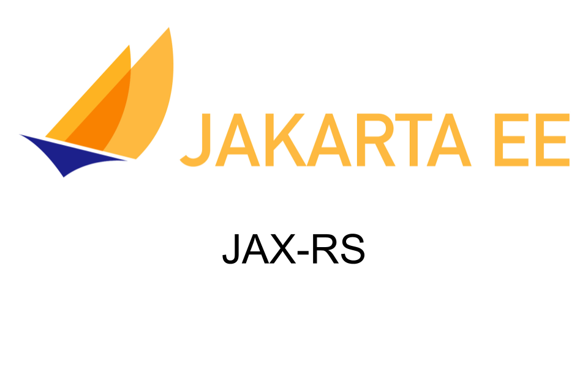

## P5.1 - Despliegue de una API RESTful con Jakarta (Java) mediante Maven en WildFly

### 1. Introducción y contexto

Aún a día de hoy, muchísimos proyectos siguen utilizando Java 8 por cuestiones legacy y por la dificultad de migración. La última versión de JDK, la 21, aún no está ampliamente extendida. Estas dos razones provocan que Java 17 se esté convirtiendo en una alternativa bastante atractiva y plausible, ya que proporciona un buen equilibrio entre compatibilidad y funcionalidades del lenguaje.

#### 1.1. REST

**REST (Representational State Transfer)** es un estilo arquitectónico para diseñar servicios web. Se basa en la idea de que los recursos de un sistema (por ejemplo, datos o servicios) deben ser identificados mediante URLs, y los métodos HTTP estándar (GET, POST, PUT, DELETE) deben usarse para interactuar con esos recursos. A diferencia de otros protocolos como SOAP, REST es ligero, simple y fácil de usar.

<figure markdown>
  
  <figcaption>REST como estilo arquitectónico para APIs web.</figcaption>
</figure>

Los principios clave de REST incluyen:

- **Stateless (sin estado)**: cada solicitud HTTP es independiente y contiene toda la información necesaria para ser procesada. El servidor no mantiene estado entre peticiones.
- **Client-Server (cliente-servidor)**: separación de responsabilidades entre cliente y servidor.
- **Cacheable (almacenable en caché)**: las respuestas pueden marcarse como cacheables.
- **Uniform Interface (interfaz uniforme)**: reglas comunes para interactuar con recursos de forma consistente.
- **Layered System (sistema en capas)**: los sistemas pueden estar organizados en capas sin que el cliente lo sepa.

#### 1.2. REST en el ecosistema Java y Jakarta

En el ecosistema Java, REST se implementa principalmente con **JAX-RS**, una especificación que forma parte de Java EE (ahora Jakarta EE). JAX-RS permite definir recursos disponibles vía HTTP con anotaciones como `@GET`, `@POST`, `@PUT` y `@DELETE`, facilitando la exposición de datos en JSON o XML.

Jakarta RESTful Web Services es la continuación de JAX-RS bajo la nueva iniciativa Jakarta EE, después de que Oracle cediera Java EE a la Fundación Eclipse. En esta transición, los paquetes Java EE se renombraron a Jakarta EE, y JAX-RS pasó a llamarse Jakarta RESTful Web Services.

<figure markdown>
  
  <figcaption>Jakarta EE como evolución de Java EE.</figcaption>
</figure>

### 2. Objetivos

- Instalar y configurar Maven y WildFly en un entorno Debian.
- Configurar un proyecto Jakarta RESTful con Maven.
- Generar un archivo WAR y desplegarlo en WildFly.
- Probar la API con navegador y con `curl`.
- Revisar logs del servidor y evidenciar el despliegue.

### 3. Pasos a seguir

#### 3.1. Instalación de Maven

Para instalar Maven tenemos varias opciones. Puedes consultarlas aquí:

- https://phoenixnap.com/kb/install-maven-debian
- https://www.how2shout.com/linux/how-to-install-apache-maven-on-debian-11-bullseye/

Si optamos por el método más sencillo, basta con actualizar repositorios e instalar el paquete:

```sh
sudo apt update
sudo apt install maven
```

Para comprobar que todo ha ido correctamente, ejecuta:

```sh
mvn --v
```

#### 3.2. Instalación de WildFly

##### 3.2.1. Instalar Java Development Kit (JDK)

WildFly requiere un JDK. Puedes usar OpenJDK:

```shell-session
sudo apt update
sudo apt -y install default-jdk
```

A fecha de estos apuntes, WildFly soporta Java 11 y Java 17. Comprueba tu versión:

```shell-session
java --version
```

##### 3.2.2. Descargar WildFly

Instala `curl` y `wget` si no los tienes:

```shell-session
sudo apt install curl wget
```

Descarga la última versión de WildFly:

```shell-session
WILDFLY_RELEASE=$(curl -s https://api.github.com/repos/wildfly/wildfly/releases/latest|grep tag_name|cut -d '"' -f 4)

wget https://github.com/Wildfly/wildfly/releases/download/${WILDFLY_RELEASE}/wildfly-${WILDFLY_RELEASE}.tar.gz
```

Descomprime y mueve a `/opt`:

```shell-session
tar xvf wildfly-${WILDFLY_RELEASE}.tar.gz
sudo mv wildfly-${WILDFLY_RELEASE} /opt/wildfly
```

##### 3.2.3. Configurar WildFly como servicio de systemd

Crea el usuario del servicio:

```shell-session
sudo groupadd --system wildfly
sudo useradd -s /sbin/nologin --system -d /opt/wildfly -g wildfly wildfly
```

Crea el directorio de configuración y copia los scripts:

```shell-session
sudo mkdir /etc/wildfly
sudo cp /opt/wildfly/docs/contrib/scripts/systemd/wildfly.conf /etc/wildfly/
sudo cp /opt/wildfly/docs/contrib/scripts/systemd/wildfly.service /etc/systemd/system/
sudo cp /opt/wildfly/docs/contrib/scripts/systemd/launch.sh /opt/wildfly/bin/
sudo chmod +x /opt/wildfly/bin/launch.sh
```

Ajusta permisos y habilita el servicio:

```shell-session
sudo chown -R wildfly:wildfly /opt/wildfly
sudo systemctl daemon-reload
sudo systemctl start wildfly
sudo systemctl enable wildfly
```

Verifica el estado:

```shell-session
sudo systemctl status wildfly
```

##### 3.2.4. Crear usuario de administración

Ejecuta el script de alta:

```console
sudo /opt/wildfly/bin/add-user.sh
```

Selecciona usuario de gestion:

```console
What type of user do you wish to add?
a) Management User (mgmt-users.properties)
b) Application User (application-users.properties)
(a): a
```

Introduce tu nombre y contraseña. Finaliza con `yes`.

##### 3.2.5. Acceder a la consola de administración

Añade `/opt/wildfly/bin/` al PATH:

```console
cat >> ~/.bashrc <<EOF
export WILDFLY_BIN="/opt/wildfly/bin/"
export PATH=$PATH:$WILDFLY_BIN
EOF
```

Aplica cambios:

```console
source ~/.bashrc
```

Comprueba que puedes conectar con el CLI:

```console
jboss-cli.sh --connect
```

###### Acceso web a la consola

Edita `/opt/wildfly/bin/launch.sh` para permitir acceso remoto a la consola:

```bash
#!/bin/bash

if [ "x$wildfly_HOME" = "x" ]; then
    wildfly_HOME="/opt/wildfly"
fi

if [[ "$1" == "domain" ]]; then
    $wildfly_HOME/bin/domain.sh -c $2 -b $3
else
    $wildfly_HOME/bin/standalone.sh -c $2 -b $3 -bmanagement=0.0.0.0
fi
```

Reinicia el servicio:

```console
sudo systemctl restart wildfly
```

Accede a `http://IP-EC2:9990` y autentica con tu usuario.

!!! tip "Recordatorio"
    Asegúrate de abrir el puerto 9990 en el grupo de seguridad.

#### 3.3. Configuración del proyecto Maven

Está práctica se centra en despliegue, no en desarrollo. Usaremos un proyecto base:

https://github.com/raul-profesor/practica-jakarta-wildfly

Clona el repositorio y revisa el `pom.xml`.

Dependencia Jakarta API:

```xml
<dependencies>
    <dependency>
        <groupId>jakarta.platform</groupId>
        <artifactId>jakarta.jakartaee-api</artifactId>
        <version>10.0.0</version>
        <scope>provided</scope>
    </dependency>
</dependencies>
```

Propiedades recomendadas:

```xml
<properties>
    <project.build.sourceEncoding>UTF-8</project.build.sourceEncoding>
    <java.version>17</java.version>
    <maven.compiler.source>${java.version}</maven.compiler.source>
    <maven.compiler.target>${java.version}</maven.compiler.target>
    <failOnMissingWebXml>false</failOnMissingWebXml>
</properties>
```

Si usas JDK 17 con una versión antigua del plugin, verás este error:

```console
Fatal error compiling: error: release version 17 not supported
```

Solucion con el plugin de compilación actualizado:

```xml
<plugin>
    <groupId>org.apache.maven.plugins</groupId>
    <artifactId>maven-compiler-plugin</artifactId>
    <version>3.12.1</version>
    <configuration>
        <release>${java.version}</release>
    </configuration>
</plugin>
```

Plugin para generar WAR:

```xml
<plugin>
    <groupId>org.apache.maven.plugins</groupId>
    <artifactId>maven-war-plugin</artifactId>
    <version>3.4.0</version>
</plugin>
```

Plugin para despliegue en WildFly:

```xml
<plugin>
    <groupId>org.wildfly.plugins</groupId>
    <artifactId>wildfly-maven-plugin</artifactId>
    <version>4.2.2.Final</version>
</plugin>
```

POM completo de referencia:

```xml
<project xmlns="http://maven.apache.org/POM/4.0.0" xmlns:xsi="http://www.w3.org/2001/XMLSchema-instance"
         xsi:schemaLocation="http://maven.apache.org/POM/4.0.0 http://maven.apache.org/xsd/maven-4.0.0.xsd">
    <modelVersion>4.0.0</modelVersion>
    <groupId>com.mycompany.myproject</groupId>
    <artifactId>modulename.backend</artifactId>
    <version>0.0.1-SNAPSHOT</version>
    <packaging>war</packaging>

    <properties>
        <project.build.sourceEncoding>UTF-8</project.build.sourceEncoding>
        <java.version>17</java.version>
        <maven.compiler.source>${java.version}</maven.compiler.source>
        <maven.compiler.target>${java.version}</maven.compiler.target>
        <failOnMissingWebXml>false</failOnMissingWebXml>
    </properties>

    <dependencies>
        <dependency>
            <groupId>jakarta.platform</groupId>
            <artifactId>jakarta.jakartaee-api</artifactId>
            <version>10.0.0</version>
            <scope>provided</scope>
        </dependency>
    </dependencies>

    <build>
        <finalName>${project.artifactId}</finalName>
        <plugins>
            <plugin>
                <groupId>org.apache.maven.plugins</groupId>
                <artifactId>maven-compiler-plugin</artifactId>
                <version>3.12.1</version>
                <configuration>
                    <release>${java.version}</release>
                </configuration>
            </plugin>
            <plugin>
                <groupId>org.apache.maven.plugins</groupId>
                <artifactId>maven-war-plugin</artifactId>
                <version>3.4.0</version>
            </plugin>
            <plugin>
                <groupId>org.wildfly.plugins</groupId>
                <artifactId>wildfly-maven-plugin</artifactId>
                <version>4.2.2.Final</version>
            </plugin>
        </plugins>
    </build>
</project>
```

#### 3.4. Breve explicación del código

Definicion de la aplicación REST:

```java
package com.mycompany.myproject.module;

import jakarta.ws.rs.ApplicationPath;
import jakarta.ws.rs.core.Application;

@ApplicationPath("/api")
public class RestApplication extends Application {
  // NOP
}
```

Esto establece `/api` como raíz de la API. Un servicio REST de ejemplo:

```java
package com.mycompany.myproject.module.services;

import java.util.Arrays;
import java.util.List;
import java.util.UUID;

import com.mycompany.myproject.module.Pojo;

import jakarta.servlet.http.HttpServletRequest;
import jakarta.ws.rs.Consumes;
import jakarta.ws.rs.DELETE;
import jakarta.ws.rs.GET;
import jakarta.ws.rs.POST;
import jakarta.ws.rs.PUT;
import jakarta.ws.rs.Path;
import jakarta.ws.rs.PathParam;
import jakarta.ws.rs.Produces;
import jakarta.ws.rs.QueryParam;
import jakarta.ws.rs.core.Context;
import jakarta.ws.rs.core.MediaType;
import jakarta.ws.rs.core.Response;

@Path("myservice")
public class MyService {

 @GET
 @Path("/hello")
 public Response sayHello(@Context HttpServletRequest request) {
  Response response = Response.ok("hello!").build();
  return response;
 }

 @GET
 @Path("/pojo/list")
 @Produces({ MediaType.APPLICATION_JSON })
 public List<Pojo> getAll() {
  return Arrays.asList(new Pojo(1, "LALALA"), new Pojo(2, "LElele"));
 }

 @GET
 @Path("/pojo/find/{id}")
 @Produces({ MediaType.APPLICATION_JSON })
 public Pojo find(@PathParam("id") Integer id) {
  return new Pojo(1, UUID.randomUUID().toString());
 }

 @POST
 @Path("/pojo/new")
 @Consumes({ MediaType.APPLICATION_JSON })
 public Response create(Pojo pojo) {
  System.out.println("Creating new Pojo: " + pojo);
  return Response.status(201).build();
 }

 @PUT
 @Path("/pojo/update")
 @Consumes({ MediaType.APPLICATION_JSON })
 public Response update(Pojo pojo) {
  System.out.println("Updating the Pojo: " + pojo);
  return Response.status(204).build();
 }

 @DELETE
 @Path("/pojo/remove")
 public Response delete(@QueryParam("id") Integer id) {
  System.out.println("Removing pojo with id: " + id);
  return Response.status(204).build();
 }
}
```

#### 3.5. Build y despliegue

Para generar el WAR:

```console
mvn clean package
```

Se generará `target/module.backend-0.0.1-snapshot.war`.

Para desplegar en WildFly:

```shell-session
mvn wildfly::deploy
```

Si todo va bien, verás una salida similar:

<figure markdown>
  
  <figcaption>Despliegue de la aplicación en WildFly.</figcaption>
</figure>

#### 3.6. Pruebas de la API

Prueba el endpoint `hello` en el navegador:

`http://IP-EC2:8080/myproject/module/backend/api/myservice/hello`

<figure markdown>
  
  <figcaption>Respuesta del endpoint hello.</figcaption>
</figure>

Comprueba `/pojo/list`:

<figure markdown>
  
  <figcaption>Respuesta JSON del endpoint /pojo/list.</figcaption>
</figure>

#### 3.7. Pruebas con curl y logs

Ver el log en tiempo real:

```shell-session
tail -f /opt/wildfly/standalone/log/server.log
```

Ejecuta peticiones desde la instancia:

- Crear nueva entrada:

```shell
curl -d '{"id":"2023", "name":"Despliegue"}' -H "Content-Type: application/json" -X POST http://localhost:8080/myproject/module/backend/api/myservice/pojo/new
```

- Actualizar una entrada:

```shell
curl -d '{"id":"55", "name":"Raul"}' -H "Content-Type: application/json" -X PUT http://localhost:8080/myproject/module/backend/api/myservice/pojo/update
```

- Eliminar una entrada:

```shell
curl -X DELETE http://localhost:8080/myproject/module/backend/api/myservice/pojo/remove?id=3
```

### 4. Ejercicios

1. Adjunta una captura de la consola de WildFly mostrando el estado `active (running)`.
2. Realiza una llamada a `/hello` y `/pojo/list` y adjunta las evidencias.
3. Responde a la siguiente tarea con las lineas de log correspondientes:

!!! task
    Muestra las entradas de los logs que se corresponden con estas peticiones.

## Referencias

- https://phoenixnap.com/kb/install-maven-debian
- https://computingforgeeks.com/install-WildFly-jboss-on-debian-12-bookworm/
- https://levelup.gitconnected.com/rest-maven-java-17-WildFly-30-51d1a465cae5
