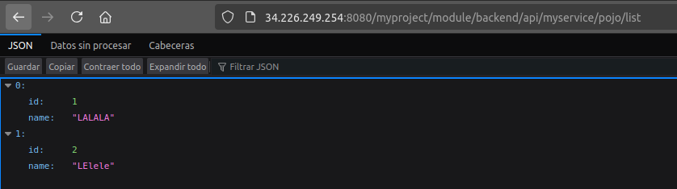

## P5.2 - Despliegue de una API RESTful con Jakarta (Java) usando Gradle en WildFly (contenedor)

### 1. Introducción y contexto

En esta práctica vamos a repetir el despliegue de una API REST, pero con dos cambios clave:

- El servidor WildFly se ejecuta en un contenedor Docker.
- El proyecto se construye con **Gradle** en lugar de Maven.

El objetivo es que puedas trabajar con un entorno reproducible y moderno, donde el servidor se levanta en segundos y la build es rápida y flexible.

### 2. Objetivos

- Levantar WildFly en un contenedor Docker.
- Configurar un proyecto Jakarta RESTful con Gradle.
- Generar un WAR y desplegarlo en WildFly dentro del contenedor.
- Probar la API con navegador y con `curl`.
- Revisar logs del servidor y evidenciar el despliegue.

### 3. Pasos a seguir

#### 3.1. Preparar el entorno Docker

Asegúrate de tener Docker instalado y funcionando. Comprueba la versión:

```sh
docker --version
```

Descarga la imagen oficial de WildFly:

```sh
docker pull quay.io/wildfly/wildfly:latest
```

Levanta el contenedor exponiendo los puertos 8080 (aplicaciones) y 9990 (consola):

```sh
docker run -d --name wildfly -p 8080:8080 -p 9990:9990 quay.io/wildfly/wildfly:latest
```

Comprueba que el contenedor está activo:

```sh
docker ps
```

#### 3.2. Crear usuario de administración en el contenedor

Necesitas un usuario de gestión para acceder a la consola:

```sh
docker exec -it wildfly /opt/jboss/wildfly/bin/add-user.sh
```

Selecciona usuario de gestión (Management User) y crea tu usuario y contraseña.

Para reiniciar el contenedor si es necesario:

```sh
docker restart wildfly
```

Accede a la consola web:

`http://localhost:9990`

#### 3.3. Preparar el proyecto con Gradle

Usaremos el mismo proyecto base que en la práctica anterior:

https://github.com/raul-profesor/practica-jakarta-wildfly

Clona el repositorio. En este caso trabajaremos con Gradle, por lo que debes tener un archivo `build.gradle`.

Ejemplo de configuración mínima para generar un WAR con Jakarta EE:

```groovy
plugins {
    id 'java'
    id 'war'
}

group = 'com.mycompany.myproject'
version = '0.0.1-SNAPSHOT'

repositories {
    mavenCentral()
}

dependencies {
    providedCompile 'jakarta.platform:jakarta.jakartaee-api:10.0.0'
    testImplementation 'org.junit.jupiter:junit-jupiter:5.10.2'
}

test {
    useJUnitPlatform()
}
```

Si el proyecto ya trae `gradlew`, usa el wrapper para evitar problemas de versión:

```sh
./gradlew --version
```

#### 3.4. Build del WAR con Gradle

Genera el WAR:

```sh
./gradlew clean build
```

El archivo se genera en:

`build/libs/modulename.backend-0.0.1-SNAPSHOT.war`

#### 3.5. Despliegue en WildFly (contenedor)

Hay dos formas sencillas de desplegar el WAR en el contenedor. Usaremos la más directa: copiar al directorio `deployments`.

```sh
docker cp build/libs/modulename.backend-0.0.1-SNAPSHOT.war wildfly:/opt/jboss/wildfly/standalone/deployments/
```

Comprueba logs del contenedor:

```sh
docker logs -f wildfly
```

Si todo va bien, verás que el WAR se despliega automáticamente.

#### 3.6. Pruebas de la API

Prueba el endpoint `hello` en el navegador:

`http://localhost:8080/myproject/module/backend/api/myservice/hello`

<figure markdown>
  
  <figcaption>Respuesta del endpoint hello.</figcaption>
</figure>

Comprueba `/pojo/list`:

<figure markdown>
  
  <figcaption>Respuesta JSON del endpoint /pojo/list.</figcaption>
</figure>

#### 3.7. Pruebas con curl

- Crear nueva entrada:

```sh
curl -d '{"id":"2023", "name":"Despliegue"}' -H "Content-Type: application/json" -X POST http://localhost:8080/myproject/module/backend/api/myservice/pojo/new
```

- Actualizar una entrada:

```sh
curl -d '{"id":"55", "name":"Raul"}' -H "Content-Type: application/json" -X PUT http://localhost:8080/myproject/module/backend/api/myservice/pojo/update
```

- Eliminar una entrada:

```sh
curl -X DELETE http://localhost:8080/myproject/module/backend/api/myservice/pojo/remove?id=3
```

### 4. Ejercicios

1. Adjunta una captura de `docker ps` mostrando el contenedor `wildfly` activo.
2. Adjunta evidencia de despliegue en logs (`docker logs -f wildfly`).
3. Realiza llamadas a `/hello` y `/pojo/list` y adjunta evidencias.
4. Responde a la tarea con las lineas de log correspondientes.

!!! task
    Muestra las entradas de los logs que se corresponden con estas peticiones.

## Referencias

- https://www.wildfly.org/
- https://quay.io/repository/wildfly/wildfly
- https://docs.gradle.org/current/userguide/war_plugin.html
