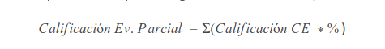

<!-- Con # se ponen los títulos -->

# Incidentes de ciberseguridad

---

## Indice

---

# Nos presentamos

## Profesor. Actualizar al 2023!!

* Eduardo Fernández Oliver
  * _[efernandez@iesrafaelalberti\.es](mailto:efernandez@iesrafaelalberti.es)_
  * _[https://www.linkedin.com/in/efoliver/](https://www.linkedin.com/in/efoliver/)_
  
_[Programación didáctica ](https://drive.google.com/file/d/1_NBHFvUpToCpRCow8i-xNGtTAMcRiCgj/view?usp=sharing)_

Note: Recomendado, consultar la programación.

---

# Objetivos fundamentales

## Objetivos generales

La formación del módulo contribuye a alcanzar los objetivos generales a), b), c), d), q), r), s), t), u) y v) del curso de especialización

## Objetivos RA

|  RA  | LOGRO               | *OBJETO*                                                  | *ACCIONES EN EL CONTEXTO DE APRENDIZAJE*                                                    |
| :----: | :-------------------- | :---------------------------------------------------------- | :-------------------------------------------------------------------------------------------- |
| RA 1 | Desarrolla          | planes de prevención y concienciación en ciberseguridad | estableciendo normas y medidas de protección                                               |
| RA 2 | Analiza             | incidentes de ciberseguridad                              | utilizando herramientas, mecanismos de detección y alertas de seguridad                    |
| RA 3 | Investiga           | incidentes de ciberseguridad                              | analizando los riesgos implicados y definiendo las posibles medidas a adoptar               |
| RA 4 | Implementa          | medidas de ciberseguridad en redes y sistemas             | respondiendo a los incidentes detectados y aplicando las técnicas de protección adecuadas |
| RA 5 | Detecta y documenta | incidentes de ciberseguridad                              | siguiendo procedimientos de actuación establecidos.                                        |

## Competencias PPS

La formación del módulo contribuye a alcanzar las competencias a), b), k), l), m), n) y ñ) del curso de especialización

_[Programación didáctica ](https://drive.google.com/file/d/1_NBHFvUpToCpRCow8i-xNGtTAMcRiCgj/view?usp=sharing)_

---

# Horarios y planificación

## Horario. Actualizar al 2023!!

Horario (X horas semanales)

|     HORA     |   L   | M | X | J | V |
| :-------------: | :------: | :--: | :-: | :--: | :-: |
| 08:00 - 09:00 |        | IS |  | IS |  |
| 09:00 - 10:00 |        | IS |  | IS |  |
| 10:00 - 11:00 |        | IS |  | IS |  |
| 11:00 - 11:30 | Recreo |    |  |    |  |
| 11:30 - 12:30 |        |    |  |    |  |
| 12:30 - 13:30 |        |    |  |    |  |
| 13:30 - 14:30 |        |    |  |    |  |

## Planificación. Actualizar al 2023!!

_[Programación didáctica ](https://drive.google.com/file/d/1_NBHFvUpToCpRCow8i-xNGtTAMcRiCgj/view?usp=sharing)_

---

# Contenidos

## Contenido. Actualizar al 2023!!

|                                               Unidades didácticas                                               | Descripción unidad                                      | Sesiones | RA | Criterios |                          |
| :-----------------------------------------------------------------------------------------------------------------: | :--------------------------------------------------------- | :--------: | :---: | :---------: | :------------------------: |
|                                                        UD1                                                        | Desarrollo de planes de prevención y concienciación    |    24    | RA1 |  a)..e)  | 1er trimestre (72 horas) |
|                                                        UD2                                                        | Analiza incidentes de ciberseguridad                     |    36    | RA2 |  a)..e)  |                          |
|                                                        UD3                                                        | Investiga incidentes de ciberseguridad                   |    12    | RA3 |   a),b)   |                          |
|                                                        UD3                                                        | Investiga incidentes de ciberseguridad                   |    18    | RA3 |  c)..e)  | 2o  trimestre (72 horas) |
|                                                        UD4                                                        | Implementa medidas de ciberseguridad en redes y sistemas |    42    | RA4 |  a)..f)  |                          |
|                                                        UD5                                                        | Documenta y notifica incidentes de ciberseguridad        |    12    | RA5 |  a)..e)  |                          |
| _[Programación didáctica ](https://drive.google.com/file/d/1_NBHFvUpToCpRCow8i-xNGtTAMcRiCgj/view?usp=sharing)_ |                                                          |          |    |          |                          |

---

# Evaluación y recuperación

## Evaluación. Actualizar al 2023!!

* Se supera el módulo con una calificación mayor o igual a 5.
* La nota se obtiene según la calificación de los resultados de aprendizaje (RA).
* Un RA no superado, implica no superar el módulo.
* Los RA se evalúan y califican en base a la evaluación y calificación de los criterios de evaluación (CE).
* Los CE se evalúan y califican a través del trabajo en clases y la realización de trabajos y pruebas especificas.
* Hay 2 Evaluaciones Parciales
  * Finales ¿Febrero?
  * Finales ¿Mayo?
* 1 Evaluación Final
  * Finales Junio

## Recuperación

La recuperación de los RA pendientes durante el mes de junio

Consistirá en un conjunto de prácticas y/o pruebas sobre los contenidos a los que están asociados los resultados de aprendizaje no superados.

---

# Metodología y comunicación

## Metodología

Por unidad:

* Explicar contenidos, resultados de aprendizaje y criterios de evaluación relacionados.
* Trabajar los contenidos en grupo e individualmente, guiados por diapositivas, materiales de la red y discusión en grupo.
* Puesta en práctica con trabajos.

## Comunicación

* Comunicación **oficial, preferida y obligada**: Asistiendo al aula y hablando directamente con el profesor.
* Otros medios secundarios: Correo electrónico y Moodle

---

# Recomendaciones y dudas

## Recomendaciones

* Recomendaciones al alumnado:
  * Leer y entender la programación.
  * Poner foto actualizada en moodle.
  * Añadir correo electrónico correcto.

## Dudas

---

# Fin!

¡¡Gracias!!
