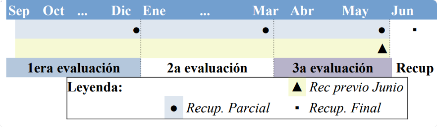

<!-- Con # se ponen los títulos -->

# Incidentes de ciberseguridad

---

# Indice

---

# Presentación

## Nos conocemos. Profesor.

* Eduardo Fernández Oliver
  * _[efernandez@iesrafaelalberti\.es](mailto:efernandez@iesrafaelalberti.es)_
  * _[https://www.linkedin.com/in/efoliver/](https://www.linkedin.com/in/efoliver/)_
  * _[https://revilofe.github.io/](https://revilofe.github.io/)_
  
_[Programación didáctica ](https://drive.google.com/file/d/1_NBHFvUpToCpRCow8i-xNGtTAMcRiCgj/view?usp=sharing)_

Note: Recomendado, consultar la programación.

---

# Objetivos fundamentales

## Objetivos generales

La formación del módulo contribuye a alcanzar los objetivos generales a), b), c), d), q), r), s), t), u) y v) del curso de especialización

## Objetivos RA

|  RA  | LOGRO               | *OBJETO*                                                  | *ACCIONES EN EL CONTEXTO DE APRENDIZAJE*                                                    |
| :----: | :-------------------- | :---------------------------------------------------------- | :-------------------------------------------------------------------------------------------- |
| RA 1 | Desarrolla          | planes de prevención y concienciación en ciberseguridad | estableciendo normas y medidas de protección                                               |
| RA 2 | Analiza             | incidentes de ciberseguridad                              | utilizando herramientas, mecanismos de detección y alertas de seguridad                    |
| RA 3 | Investiga           | incidentes de ciberseguridad                              | analizando los riesgos implicados y definiendo las posibles medidas a adoptar               |
| RA 4 | Implementa          | medidas de ciberseguridad en redes y sistemas             | respondiendo a los incidentes detectados y aplicando las técnicas de protección adecuadas |
| RA 5 | Detecta y documenta | incidentes de ciberseguridad                              | siguiendo procedimientos de actuación establecidos.                                        |
<!-- .element.table: style="font-size:50%;" -->

## Competencias PPS

La formación del módulo contribuye a alcanzar las competencias a), b), k), l), m), n) y ñ) del curso de especialización

_[Programación didáctica ](https://drive.google.com/file/d/1_NBHFvUpToCpRCow8i-xNGtTAMcRiCgj/view?usp=sharing)_

---

# Horarios y planificación

## Horario. Actualizar al 2023!!

Horario (X horas semanales)

|     HORA     |   L   | M | X | J | V |
| :-------------: | :------: | :--: | :-: | :--: | :-: |
| 08:00 - 09:00 |    IS    |  | IS |  |  |
| 09:00 - 10:00 |    IS    |  | IS |  |  |
| 10:00 - 11:00 |    IS    |  |  |  |  |
| 11:00 - 11:30 | Recreo |    |  |    |  |
| 11:30 - 12:30 |        |    |  |    |  |
| 12:30 - 13:30 |        |    |  |    |  |
| 13:30 - 14:30 |        |    |  |    |  |
<!-- .element.table: style="font-size:50%;" -->

## Planificación. Actualizar al 2023!!

_[Programación didáctica ](https://drive.google.com/file/d/1_NBHFvUpToCpRCow8i-xNGtTAMcRiCgj/view?usp=sharing)_

---

# Contenidos

## Contenido. Actualizar al 2023!!

|                                               Unidades didácticas                                               | Descripción unidad                                      | Sesiones | RA | Criterios |                          |
| :-----------------------------------------------------------------------------------------------------------------: | :--------------------------------------------------------- | :--------: | :---: | :---------: | :------------------------: |
|                                                        UD1                                                        | Desarrollo de planes de prevención y concienciación    |    24    | RA1 |  a)..e)  | 1er trimestre (72 horas) |
|                                                        UD2                                                        | Analiza incidentes de ciberseguridad                     |    36    | RA2 |  a)..e)  |                          |
|                                                        UD3                                                        | Investiga incidentes de ciberseguridad                   |    12    | RA3 |   a),b)   |                          |
|                                                        UD3                                                        | Investiga incidentes de ciberseguridad                   |    18    | RA3 |  c)..e)  | 2o  trimestre (72 horas) |
|                                                        UD4                                                        | Implementa medidas de ciberseguridad en redes y sistemas |    42    | RA4 |  a)..f)  |                          |
|                                                        UD5                                                        | Documenta y notifica incidentes de ciberseguridad        |    12    | RA5 |  a)..e)  |                          |
<!-- .element.table: style="font-size:50%;" -->

_[Programación didáctica ](https://drive.google.com/file/d/1_NBHFvUpToCpRCow8i-xNGtTAMcRiCgj/view?usp=sharing)_

---

# Evaluación y recuperación

## Evaluación I
* Se supera el módulo con una calificación mayor o igual a 5.
* La nota se obtiene haciendo la media ponderada de los resultados de aprendizaje (RA).
* Un RA no superado, implica no superar el módulo.

## Evaluación II
* Los calificación de los RA se obtienen de la media ponderada de la calificación de los criterios de evaluación (CE).
* Los CE se evalúan y califican a través del trabajo en clases y la realización de prácticas y pruebas especificas.

## Evaluación III
* Hay 3 Evaluaciones Parciales
  * Diciembre
  * Marzo
  * Mayo
* 1 Evaluación Final
  * Junio
<!-- .element height="50%" width="50%" -->

## Recuperación
* La recuperación de los RA pendientes se realiza durante el mes de junio.
* Consistirá en un conjunto de prácticas y/o pruebas sobre los criterios de evaluación relacionados con el resultado de aprendizaje no superado.

## Resumen

<!-- .element height="50%" width="50%" -->

---

# Metodología y comunicación

## Metodología
Por unidad:

* Explicar contenidos relacionados con criterios de evaluación  asociados al RA con el que se está trabajando.
* Trabajar los contenidos en grupo e individualmente, guiados por diapositivas, materiales de la red y discusión en grupo.
* Puesta en práctica con trabajos.

## Comunicación
* Comunicación **oficial, preferida y obligada**: Asistiendo al aula y hablando directamente con el profesor.
* Otros medios secundarios **opcionales**: Correo electrónico y Moodle.

 <!-- .element height="25%" width="25%" -->

---

# Recomendaciones y aclaraciones

## Recomendaciones
* Recomendaciones al alumnado:
  * Leer y entender la programación del módulo.
  * Poner foto actualizada en moodle.
  * Añadir correo electrónico correcto en moodle.

## Aclaraciones I
* Formación presencial, por tanto la comunicación presencial.
* Como regla general:
  - Los ejercicios individuales se corregirán en clase delante del profesor.
  - Los ejercicios en grupo se podrán presentar en grupo o un componente del grupo de forma aleatoria. El método será elegido por el profesor.

## Aclaraciones II
* Causas para no corregir una prueba (ejercicio, práctica, examen)
  - No se cumple las condiciones de entrega.
  - Se ha detectado la posibilidad de copiado de todo o parte de la prueba. Esto incluye textos (total o parcial) de internet y/o sin hacer referencia a la fuente
  - Se entrega fuera de plazo (aunque sean unos segundos).
  - En caso de código, no compila.

## Aclaraciones III
* Causas para no corregir una prueba (ejercicio, práctica, examen)
  - Si la entrega es el git, añadir en el README.md instrucciones para compilar y ejecutar el código, descripción de la aplicación, autoría y referencias.

## Aclaraciones IV
* Es responsabilidad del alumnado la custodia y guarda de los trabajos, documentos, y cualquier otro material que realice durante las prácticas o en clase, por tanto, tendrán que asegurarse que quedan a salvo siempre que abandonen el aula, no siendo responsabilidad del profesorado la perdida de este material.

## Aclaraciones V
* En cuando a las fechas de entrega de prácticas/trabajos/ejercicios, tendrán una fecha de entrega clara, **que no se podrá cambiar bajo ninguna circunstancia**. Quedando a elección del profesor posibles excepciones justificadas.

---

# Dudas

---

# Fin!

 <!-- .element height="50%" width="50%" -->

¡¡Gracias!!

---

# Primeros pasos

1. Identificar tu **email: correo electrónico**: xxx@g.educaand.es
2. Acceder a moodle. Configurar tu usuario con email y foto.
3. Rellenar los formularios que hay en la moodle. Sirven para entornos.
4. Darte de alta en github.com con tu email, solicitan acceso PRO por ser estudiante.
5. Darte de alta en jetbrains con tu email, solicitando acceso a las herramientas por ser estudiante.
