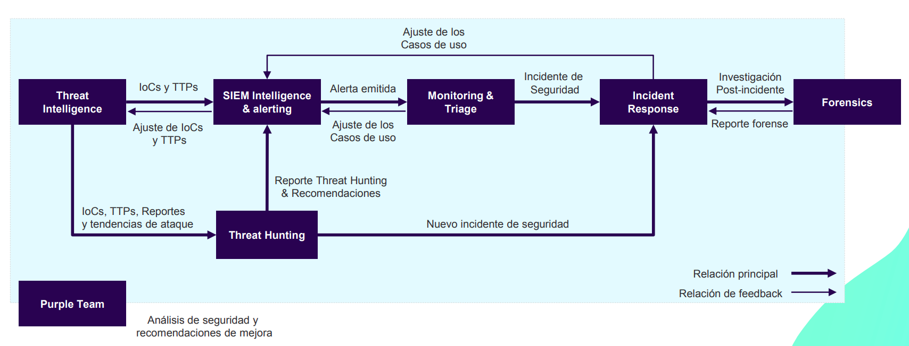

<!-- Con # se ponen los títulos -->

## 2.2.1 - SOC: Servicios y herramientas

---

 <!-- .element height="50%" width="50%" -->

---

## Introducción a los SOC

### ¿Qué es un SOC?

* Un SOC (Centro de Operaciones de Seguridad) gestiona la ciberseguridad organizacional.
* Está compuesto por personas, procesos y tecnologías.
* Su misión: supervisar, detectar y responder a amenazas.

Note: Introduce el SOC como un pilar de la seguridad organizacional, destacando su estructura integral y propósito operativo.

### Funciones principales del SOC

* **Supervisión continua:** Monitoreo 24/7 de la infraestructura tecnológica.
* **Detección de amenazas:** Identifica actividades sospechosas en tiempo real.
* **Respuesta a incidentes:** Actúa para mitigar impactos de ciberataques.
* **Mejora continua:** Analiza incidentes pasados para prevenir futuros ataques.

Note: Detalla las funciones esenciales que definen la operativa de un SOC, resaltando su papel proactivo y reactivo.

### ¿Por qué es importante un SOC?

* **Protege activos críticos:** Sistemas, datos y reputación organizacional.
* **Minimiza el impacto de incidentes:** Respuesta oportuna reduce daños.
* **Cumple normativas:** Ayuda a cumplir regulaciones como GDPR, ISO 27001.
* **Fortalece la confianza:** Clientes y socios confían en su preparación.

Note: Explica cómo un SOC añade valor estratégico a una organización al garantizar la continuidad del negocio y la confianza de sus partes interesadas.

---

## SOC vs CERT, CIRT y CSIRT

### Definición de términos

* **SOC:** Supervisa y coordina la ciberseguridad de forma integral.
* **CERT:** Responde a emergencias críticas, como DDoS o ransomware.
* **CIRT:** Maneja incidentes específicos, enfocado en contención.
* **CSIRT:** Variante estratégica, con enfoque en políticas y análisis.

Note: Diferencia los términos relacionados con SOC, destacando sus enfoques y funciones específicas.

### Relación y diferencias clave

* **SOC:** Proactivo y abarca todas las operaciones de seguridad.
* **CERT/CIRT/CSIRT:** Reactivos, activados ante incidentes críticos.
* **Analogía:** SOC es como un hospital completo; CERT/CIRT/CSIRT son las unidades de emergencias.

Note: Proporciona una comparación clara entre las funciones del SOC y los equipos de respuesta a incidentes, utilizando una analogía visual.

---

## Componentes del SOC

### Personas en un SOC

* **Roles clave:**
  - **Gerente del SOC:** Coordina operaciones y estrategias.
  - **Analistas SOC:** Monitorean, analizan y gestionan incidentes.
  - **Threat Hunters:** Detectan amenazas avanzadas proactivamente.
  - **Ingenieros de Seguridad:** Configuran y mantienen herramientas.
* **Capacitación:** Formación continua para afrontar amenazas emergentes.

Note: Enumera los roles esenciales en un SOC y la importancia de la formación para mantener un equipo eficiente.

### Procesos en un SOC

* **Monitoreo:** Supervisión continua de redes, sistemas y aplicaciones.
* **Detección:** Identificación de comportamientos sospechosos.
* **Respuesta:** Contención y mitigación de incidentes.
* **Recuperación:** Restauración de sistemas tras un ataque.

Note: Explica los procesos principales que estructuran el funcionamiento del SOC, destacando su carácter cíclico y estandarizado.

### Tecnologías clave en un SOC

* **SIEM (Gestión de eventos e información de seguridad):**
  - Centraliza y correlaciona eventos de múltiples fuentes.
  - Genera alertas en tiempo real.
* **SOAR (Orquestación y respuesta automatizada):**
  - Automatiza tareas repetitivas.
  - Integra herramientas y gestiona incidentes.
* **EDR/NDR (Detección y respuesta en dispositivos/red):**
  - Monitorean y protegen endpoints y tráfico de red.
* **IDS/IPS:** Detectan y bloquean intrusiones.

Note: Detalla las tecnologías más relevantes en un SOC y cómo contribuyen al monitoreo y la respuesta.

---

## Servicios de un SOC

### Servicio: Threat Intelligence

* Recopila información sobre amenazas externas.
* Identifica indicadores de compromiso (IoCs).
* Informa sobre tácticas y procedimientos de actores maliciosos.

Note: Describe cómo Threat Intelligence ayuda al SOC a anticiparse a las amenazas mediante la recopilación de información crítica.

### Servicio: Monitoring & Triage

* Valida y prioriza alertas del SIEM.
* Determina si una amenaza es real o un falso positivo.
* Escala incidentes confirmados al equipo de respuesta.

Note: Explica la función de este servicio como el filtro inicial que asegura que solo los incidentes relevantes sean escalados.

### Servicio: Incident Response

* Maneja incidentes confirmados para contener y mitigar daños.
* Coordina la recuperación de sistemas comprometidos.
* Implementa medidas preventivas tras un ataque.

Note: Presenta Incident Response como el servicio que toma acción directa ante incidentes, minimizando su impacto.

### Servicio: Forensics

* Analiza incidentes para identificar su origen y alcance.
* Recolecta y preserva evidencias digitales.
* Proporciona recomendaciones para evitar ataques similares.

Note: Detalla cómo el análisis forense ayuda a fortalecer defensas futuras tras investigar un incidente.

### Servicio: Threat Hunting

* Busca proactivamente amenazas avanzadas que evaden detección.
* Utiliza hipótesis basadas en Threat Intelligence.
* Mejora reglas y configuraciones del SOC.

Note: Explica el rol de Threat Hunting en la detección temprana de amenazas que pasan desapercibidas por herramientas automáticas.

### Servicio: Purple Team

* Evalúa la efectividad del SOC mediante simulaciones.
* Combina defensas del Blue Team con pruebas del Red Team.
* Identifica áreas de mejora y ajustes necesarios.

Note: Introduce el Purple Team como un servicio crítico para probar y fortalecer las capacidades del SOC.

---

## Diseño y estructura del SOC

### SOC interno vs tercerizado

* **Interno:** Control total y personalización, pero alto costo.
* **Tercerizado (MSSP):** Rápido y económico, pero menos control.
* **Modelo híbrido:** Combina ventajas de ambos enfoques.

Note: Discute las opciones para estructurar un SOC, ayudando a decidir según el contexto organizacional.

### Pasos para implementar un SOC

1. **Definición de objetivos:** ¿Qué activos deben protegerse?
2. **Selección de personal:** Identificar roles clave.
3. **Diseño de procesos:** Basados en marcos como NIST CSF.
4. **Implementación tecnológica:** Integrar herramientas como SIEM y SOAR.
5. **Lanzamiento de servicios:** Comenzar con monitoreo y respuesta.

Note: Proporciona un plan estructurado para establecer un SOC desde cero, enfatizando la planificación.

---

## Retos y tendencias del SOC

### Retos actuales

* Sobrecarga de alertas: Necesidad de priorización.
* Costos de implementación: Herramientas y personal.
* Evolución de amenazas: Mantenerse actualizado constantemente.

Note: Presenta los principales desafíos en la gestión de un SOC y cómo enfrentarlos.

### Tendencias futuras

* Uso de IA y ML para mejorar detección.
* Integración de tecnologías cloud-native.
* Foco en automatización para reducir tiempos de respuesta.

Note: Explora cómo la tecnología está transformando el futuro de los SOC, haciéndolos más eficientes y escalables.

---

 <!-- .element height="100%" width="100%" -->

Note: La imagen proporciona una visión general de cómo interactúan los servicios del SOC.

---

## ¡Gracias por su atención!

Note: ¿Alguna pregunta sobre lo visto?
