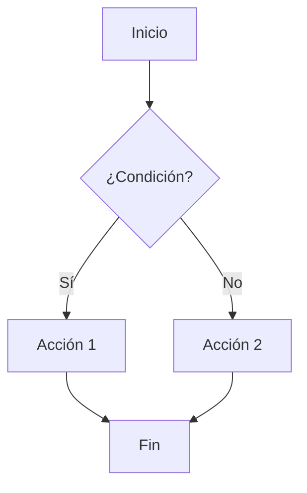

# Guía de Plugins - Reveal.js 5.2.1

## 📦 Plugins Instalados y Funcionando

✅ **RevealMenu** - Menú de navegación lateral (FUNCIONA)  
✅ **RevealPointer** - Puntero láser virtual (FUNCIONA)  
❌ **RevealChalkboard** - Pizarra y anotaciones (NO COMPATIBLE)  
❌ **RevealMermaid** - Diagramas desde código (NO PROBADO)  
❌ **RevealAnimate** - Animaciones avanzadas (NO PROBADO)

---

## 🎯 Presentación de Ejemplo

**Archivo:** `section2-is/exampleSlidesV5_2_1.html`

**Ubicación:** La presentación está en la carpeta `section2-is/` porque las rutas relativas funcionan correctamente desde ahí.

Contiene **33 secciones** con ejemplos de:
- Uso de Reveal.js 5.2.1
- Formato de texto, código, tablas
- Fragmentos y animaciones
- Todos los temas documentados
- Ejercicios prácticos
- **Secciones 26-33:** Documentación de plugins (aunque Chalkboard y Mermaid no funcionan)

---

## ⌨️ Atajos de Teclado

### Navegación
- `→` / `↓` - Siguiente slide
- `←` / `↑` - Slide anterior
- `ESC` / `O` - Vista general
- `F` - Pantalla completa

### Plugins Funcionando
- `M` - **Menu** - Abrir/cerrar menú lateral
- `Q` - **Pointer** - Activar/desactivar puntero láser
- `S` - **Notes** - Vista presentador

### Plugins Básicos
- `Ctrl + Shift + F` - Buscar (si se añade RevealSearch)
- `Alt + Click` - Zoom (si se añade RevealZoom)

---

## 🔧 Configuración HTML

```html
<!-- CSS de Plugins -->
<link rel="stylesheet" href="node_modules/reveal.js-menu/menu.css">
<link rel="stylesheet" href="node_modules/reveal.js-pointer/dist/pointer.css">

<!-- Scripts de Plugins -->
<script src="node_modules/reveal.js-menu/menu.js"></script>
<script src="node_modules/reveal.js-chalkboard/plugin.js"></script>
<script src="node_modules/reveal.js-pointer/dist/pointer.js"></script>
<script src="https://cdn.jsdelivr.net/npm/reveal.js-mermaid-plugin@2.0.0/plugin/mermaid/mermaid.js"></script>

<!-- Inicialización -->
<script>
Reveal.initialize({
    plugins: [ 
        RevealMarkdown, 
        RevealHighlight, 
        RevealNotes,
        RevealMath.KaTeX,
        RevealSearch,
        RevealZoom,
        RevealMenu,
        RevealChalkboard,
        RevealPointer,
        RevealMermaid
    ]
});
</script>
```

---

## 📚 Plugin Menu

### Características
- Navegación lateral entre slides
- Cambio de tema en tiempo real
- Lista de todas las secciones
- Marcadores de progreso

### Configuración
```javascript
menu: {
    side: 'left',
    width: 'normal',
    numbers: false,
    themes: true,
    transitions: true,
    markers: true,
    openButton: true,
    keyboard: true
}
```

---

## ✏️ Plugin Chalkboard

### Características
- Dibujar sobre slides
- Pizarra virtual independiente
- Múltiples colores
- Guardar y descargar anotaciones

### Modos
**Canvas (`C`):** Dibuja sobre la slide actual  
**Pizarra (`B`):** Pizarra independiente completa

### Colores
- Rojo, Azul, Verde, Naranja, Púrpura, Amarillo, Negro/Blanco
- Cambiar con `X` (siguiente) o `Y` (anterior)

---

## 🖱️ Plugin Pointer

### Características
- Puntero láser virtual
- Personalizable (color, tamaño, opacidad)
- Ideal para presentaciones remotas

### Uso
1. Presiona `Q` para activar
2. Mueve el ratón para señalar
3. Presiona `Q` de nuevo para desactivar

### Configuración
```javascript
pointer: {
    key: "q",
    color: "red",
    opacity: 0.8,
    pointerSize: 12,
    alwaysVisible: false
}
```

---

## 📐 Plugin Mermaid

### Características
- Diagramas desde código
- Múltiples tipos: flujo, secuencia, clases, Gantt, ER

### Ejemplo
````markdown

````

### Tipos disponibles
- `graph` - Diagramas de flujo
- `sequenceDiagram` - Diagramas de secuencia
- `classDiagram` - Diagramas de clases
- `stateDiagram` - Diagramas de estado
- `erDiagram` - Diagramas Entidad-Relación
- `gantt` - Diagramas de Gantt

---

## 🎬 Workflows Recomendados

### Para Docencia
1. **Navegar** (`M`) - Ir rápido a la sección
2. **Señalar** (`Q`) - Destacar elementos importantes
3. **Anotar** (`B` o `C`) - Dibujar explicaciones
4. **Guardar** (`D`) - Exportar anotaciones

### Para Presentaciones
1. **Menu** (`M`) - Navegación profesional
2. **Pointer** (`Q`) - Guiar la atención
3. **Zoom** (`Alt+Click`) - Detalles específicos
4. **Notes** (`S`) - Vista presentador

---

## 💡 Mejores Prácticas

### Menu
✅ Estructura clara de secciones  
✅ Títulos descriptivos  
❌ Evitar demasiadas subsecciones

### Chalkboard
✅ Dejar espacios para anotar  
✅ Colores consistentes  
❌ No dibujar sobre texto pequeño

### Pointer
✅ Movimientos suaves  
✅ Apagar cuando no se use  
❌ No mover erráticamente

### Mermaid
✅ Diagramas simples  
✅ Etiquetas claras  
❌ Evitar diagramas complejos

---

## 🚀 Próximos Pasos

1. ✅ Abre `http://localhost:8000/exampleSlidesV5_2_1.html`
2. ✅ Practica con cada plugin
3. ✅ Experimenta con los atajos
4. ✅ Crea tu primera presentación con plugins
5. ✅ Combina plugins para presentaciones efectivas

---

## 📖 Recursos

- [Reveal.js Docs](https://revealjs.com)
- [RevealMenu](https://github.com/denehyg/reveal.js-menu)
- [RevealChalkboard](https://github.com/rajgoel/reveal.js-plugins)
- [RevealPointer](https://github.com/burnpiro/reveal.js-pointer)
- [Mermaid Docs](https://mermaid.js.org/)

---

**¡Feliz presentación!** 🎉
