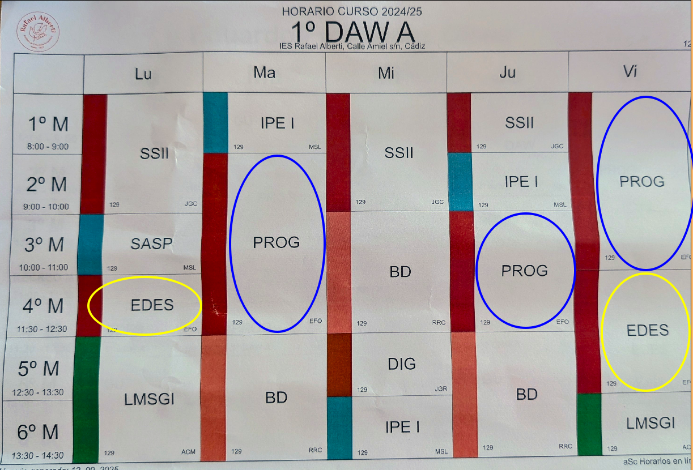

<!-- Con # se ponen los títulos -->

## Programación  
<!-- .element height="50%" width="50%" -->

**2024/2025**

---
## Indice

---
## Presentación profesor.  
* Profesor: Eduardo Fernández Oliver  
  * _[efernandez@iesrafaelalberti\.es](mailto:efernandez@iesrafaelalberti.es)_
  * _[eferoli398@g.educaand\.es](mailto:eferoli398@g.educaand.es)_
  * _[https://www.linkedin.com/in/efoliver/](https://www.linkedin.com/in/efoliver/)_
  * _[https://revilofe.github.io/](https://revilofe.github.io/)_
* Tutor + Tutor Dual de DAW A

## Alumnos.  
Presentación entre vosotros:
  * Edad
  * Estudios previos
  * Conocimiento de programación
  * Aspiraciones

---
## Info ciclo.  
[Información del módulo obtenida de la normativa vigente](https://drive.google.com/file/d/1m0ScGvyFUNazalNCOQFjBW_9gaQIJXll/view?usp=sharing)

## Info módulo: Objetivos generales y Competencias PPS.    
[Información del módulo obtenida de la normativa vigente](https://drive.google.com/file/d/1m0ScGvyFUNazalNCOQFjBW_9gaQIJXll/view?usp=sharing)

## Info módulo: Objetivos RA.  
|  RA  | LOGRO                | *OBJETO*                                                   | *ACCIONES EN EL CONTEXTO DE APRENDIZAJE*                                                                      |
| :--: | :------------------- | :--------------------------------------------------------- | :------------------------------------------------------------------------------------------------------------ |
| RA 1 | **Conoce**           | **la estructura de un programa informático**              | **identificando y relacionando los elementos propios del lenguaje de programación utilizado**                |
| RA 2 | **Escribe y prueba** | **programas sencillos**                                    | **reconociendo y aplicando los fundamentos de la programación orientada a objetos.**                         |
| RA 3 | **Escribe y depura** | **código**                                                | **analizando y utilizando las estructuras de control del lenguaje.**                                          |
| RA 4 | **Desarrolla**       | **programas organizados en clases**                        | **analizando y aplicando los principios de la programación orientada a objetos.**                            |
| RA 5 | **Realiza**          | **operaciones de entrada y salida de información**        | **utilizando procedimientos específicos del lenguaje y librerías de clases**                                |
| RA 6 | **Escribe**          | **programas que manipulen información**                   | **seleccionando y utilizando tipos avanzados de datos.**                                                      |
| RA 7 | **Desarrolla**       | **programas**                                              | **aplicando características avanzadas de los lenguajes orientados a objetos y del entorno de programación** |
| RA 8 | **Utiliza**          | **bases de datos orientadas a objetos**                    | **analizando sus características y aplicando técnicas para mantener la persistencia de la información**    |
| RA 9 | **Gestiona**         | **información almacenada en bases de datos relacionales** | **manteniendo la integridad y consistencia de los datos**                                                     |

<!-- .element.table: style="font-size:50%;" -->

---
## Contenidos.  
<!-- .element height="50%" width="50%" -->

---
## Planificación.  
<!-- .element height="75%" width="75%" -->

Como toda planificación, puede sufrir cambios. Los sufrirá, hay que adaptarla a la dual.

## Horario.  
Horario (8 horas semanales)  
<!-- .element height="75%" width="75%" -->

---
## Evaluación I.  
* Se supera el módulo con una calificación mayor o igual a 5.
* La nota se obtiene haciendo la media de los resultados de aprendizaje (RA).
* Un RA no superado, implica no superar el módulo.

## Evaluación II.  
* Los calificación de los RA se obtienen de la media de la calificación de los criterios de evaluación (CE).
* Los CE se evalúan y califican a través del trabajo en clases y la realización de prácticas y pruebas específicas.  

## Evaluación III.  
* Hay 3 Evaluaciones Parciales
  * Diciembre
  * Marzo
  * Mayo
* 1 Evaluación Final
  * Junio

## Evaluación IV.  
Este año tenemos la formación dual, por tanto, habrá que adaptar la evaluación a la formación dual, y habrá cambios que se irán comunicando.

## Recuperación.  
* La recuperación de los RA pendientes se realiza durante el mes de junio.
* Consistirá en un conjunto de prácticas y/o pruebas sobre los criterios de evaluación relacionados con el resultado de aprendizaje no superado, que tendrán que defenderse.

## Resumen.  

---
## Metodología I.    
Por unidad:  
* Explicar contenidos relacionados con criterios de evaluación asociados al RA con el que se está trabajando. Vuestros apuntes son importantes.
* Trabajar los contenidos en grupo e individualmente, guiados por diapositivas, materiales de la red y discusión en grupo.

## Metodología II.  
Por unidad:  
* Realización de ejercicios en los que aplicar los contenidos.
* Puesta en práctica con trabajos y ejercicios que tendrán que defender en clase.

## Comunicación.  
* Comunicación **oficial, preferida y obligada**: Asistiendo al aula y hablando directamente con el profesor.
* Otros medios secundarios **opcionales**: Correo electrónico y Moodle.

**ATENCIÓN!!!:** ***TEN EN CUENTA QUE ESTAS EN UNA FORMACIÓN PRESENCIAL.***

---
## Recomendaciones.  
* Recomendaciones al alumnado:
  * Leer y entender la programación del módulo.
  * Poner foto actualizada en moodle.
  * Añadir correo electrónico correcto en moodle.

## Aclaraciones I.  
* Formación presencial, por tanto la comunicación presencial.
* Como regla general:
  - Los ejercicios individuales se corregirán en clase delante del profesor. Defendiendo el trabajo.
  - Los ejercicios en grupo se podrán presentar en grupo o un componente del grupo de forma aleatoria. El método será elegido por el profesor.

## Aclaraciones II.  
* Causas para no corregir una prueba (ejercicio, práctica, examen)
  - No se cumple las condiciones de entrega.
  - Se ha detectado la posibilidad de copiado de todo o parte de la prueba. Esto incluye textos (total o parcial) de internet y/o sin hacer referencia a la fuente.
  - Se entrega fuera de plazo (aunque sean unos segundos).
  - En caso de código, no compila.

## Aclaraciones II.  
* OJO con Chat GPT, Copilot, etc. -> Asegurate de saber que haces.

## Aclaraciones III.  
* Causas para no corregir una prueba (ejercicio, práctica, examen)
  - Si la entrega es el git, añadir en el README.md instrucciones para compilar y ejecutar el código, descripción de la aplicación, autoría y referencias.

## Aclaraciones IV.  
* Es responsabilidad del alumnado la custodia y guarda de los trabajos, documentos, y cualquier otro material que realice durante las prácticas o en clase, por tanto, tendrán que asegurarse que quedan a salvo siempre que abandonen el aula, no siendo responsabilidad del profesorado la perdida de este material.
* Cloud google, github, gitlab, bitbucket, etc.

## Aclaraciones V.  
* En cuando a las fechas de entrega de prácticas/trabajos/ejercicios, tendrán una fecha de entrega clara, **que no se podrá cambiar bajo ninguna circunstancia**. Quedando a elección del profesor posibles excepciones justificadas.
* La entrega consiste en: subida a la plataforma (por defecto) en fecha + defensa en clase.

---
## Tutorias.    
En clase, acordáis hablar conmigo.

## Módulos.   
 <!-- .element height="75%" width="75%" -->

## Equipo educativo
 <!-- .element height="75%" width="75%" -->

## Cursos de especialización.
 <!-- .element height="75%" width="75%" -->

## Centro I. Planta baja.   
 <!-- .element height="75%" width="75%" -->

## Centro II. Primera planta.   
 <!-- .element height="75%" width="75%" -->

## Centro III. Última planta.   
  <!-- .element height="75%" width="75%" -->

## Herramientas.  
- iPasen: Información, contacto, asistencia, calificaciones, etc.

## Tareas.    
- Los módulos ya cursados y aprobados: SOLICITUD DE CONVALIDACIÓN DE MÓDULOS (antes del 30 de septiembre).
– Salidas anticipadas/Llegadas tarde: INCOMPATIBILIDADES HORARIAS POR EL TRABAJO (se analiza y estudia con la jefa de estudios).
– Otros asuntos (comentar con el tutor si es necesario rellenar el formulario).

## Observaciones
- Faltas: deben justificarse antes de 5 días. Posibles causas: enfermedad (debe acudir al médico), causas laborales ”puntuales” (debidamente justificadas)…
- Curso presencial: Además de los exámenes, debidamente notificados con antelación, el profes@r podrá poner prácticas evaluables en cualquiera de las clases diarias.
- Falta de asistencia de un profes@r: No justifica la falta del alumnado.

## Espacios
- Acceso prohibido: zona de despachos y sala de profesores.
- Acceso a aseos: durante el horario de clase con permiso del profes@r.
- Durante el recreo: No está permitido permanecer en las aulas, pasillos ni escaleras.

## Comportamiento I.
- Elige tu sitio, será el tuyo para todo el año.
- Se respeta el turno de palabra. 
- **No hablar por encima del profesor.**
- Si hay dudas, apuntarlas en un papel y se pregunta al final de la explicación y en tu turno.

## Comportamiento II.   
- Respeto: a los compañeros, profesores, personal del centro, instalaciones, etc. Se comparten con otrßs compañer@s.
- No está permitido: comer, beber, mascar chicle, usar el móvil, etc.
- Se finaliza la clase y se sale.

## Comportamiento III.  
- A la entrada: puntualidad, orden y silencio.
- Llegar tarde, implica que quede registrado tu retraso.
- Salir antes implica falta de asistencia.
- Las justificaciones se entregan al tutor. 

## Comportamiento IV.  
- Antes de salir del aula: recoger y dejar el aula en condiciones, eso quiere decir que los Monitores y pcs se apagan, sillas en su sitio, etc.
- A última hora: Se cierran las ventanas y se apagan las luces.
- Retraso: los conserjes pueden deciros que no podéis entrar hasta la siguiente hora.

## Asistencia.  
Bajas de oficio: 10 faltas injustificadas implica la baja de oficio, existe una lista de espera muy grande.

## Delegado y subdelegado.  
- Elección del delegado de clase: antes del 30 de septiembre.
- Eñlegir bien a vuestros representantes. Son muy importantes, son  interlocutores con el profesorado y la dirección del centro.

## RRSS Centro.
- https://es-es.facebook.com/IESAlbertiCadiz/
- https://twitter.com/iesalberticadiz
- https://www.instagram.com/iesalberticadiz/?hl=es
 
 
## RRSS otras.
- Emprendimiento: https://x.com/AE_IESRACadiz
- IA&BD: https://x.com/FPIABigData
- Ciber: https://x.com/FPCiberSec
- Videojuegos: https://x.com/FPVideojuegosRV

---
## Dudas?.    

---
## Fin!  
 <!-- .element height="50%" width="50%" -->

¡¡Gracias y buen curso!!

---

# Primeros pasos.

1. Identificar tu **email: correo electrónico**: xxx@g.educaand.es
2. Acceder a moodle. Configurar tu usuario con email y foto.
3. Rellenar los formularios que hay en la moodle. Sirven para entornos.
4. Darte de alta en github.com con tu email, solicitan acceso PRO por ser estudiante.
5. Darte de alta en jetbrains con tu email, solicitando acceso a las herramientas por ser estudiante.
