<!-- Presentación de Ejemplo - Reveal.js 5.2.1 -->

# Reveal.js 5.2.1
## Guía Completa de Características

Presentación de ejemplo con todas las funcionalidades

---
# Índice

---
# 1. Estructura Básica

## Diapositivas Horizontales

Se crean con `---`

Las diapositivas horizontales representan temas principales


## Diapositivas Verticales

Se crean con líneas en blanco dobles

Representan subtemas o detalles

---
# 2. Formato de Texto


## Énfasis de Texto

**Texto en negrita** con `**texto**`

*Texto en cursiva* con `*texto*`

***Texto en negrita y cursiva*** con `***texto***`

~~Texto tachado~~ con `~~texto~~`


## Listas

**Lista sin ordenar:**
* Item 1
* Item 2
  * Subitem 2.1
  * Subitem 2.2
* Item 3


## Listas Numeradas

**Lista ordenada:**
1. Primer elemento
2. Segundo elemento
3. Tercer elemento
   1. Subelemento 3.1
   2. Subelemento 3.2


## Citas y Código Inline

> Esto es una cita en bloque
> Puede ocupar varias líneas

Para código inline usa: `código en línea`

---
# 3. Código de Programación


## Código con Resaltado

```python
def ejemplo_python():
    """Función de ejemplo"""
    numeros = [1, 2, 3, 4, 5]
    resultado = sum(numeros)
    return resultado

print(f"Resultado: {ejemplo_python()}")
```


## Código JavaScript

```javascript
// Función flecha en ES6
const saludar = (nombre) => {
    return `Hola, ${nombre}!`;
};

console.log(saludar('Estudiante'));
```


## Código Java

```java
public class Ejemplo {
    private String mensaje;
    
    public Ejemplo(String msg) {
        this.mensaje = msg;
    }
    
    public void mostrar() {
        System.out.println(mensaje);
    }
}
```


## Código con Números de Línea

```python [1-2|3-4|5]
def calcular_factorial(n):
    if n <= 1:
        return 1
    else:
        return n * calcular_factorial(n-1)
```

Note: El código se puede animar línea por línea


## Código SQL

```sql
SELECT 
    estudiantes.nombre,
    estudiantes.apellidos,
    cursos.nombre_curso
FROM estudiantes
INNER JOIN matriculas 
    ON estudiantes.id = matriculas.estudiante_id
INNER JOIN cursos 
    ON matriculas.curso_id = cursos.id
WHERE cursos.activo = true;
```

---
# 4. Tablas


## Tabla Simple

| Columna 1 | Columna 2 | Columna 3 |
|-----------|-----------|-----------|
| Dato 1    | Dato 2    | Dato 3    |
| Dato 4    | Dato 5    | Dato 6    |
| Dato 7    | Dato 8    | Dato 9    |


## Tabla con Alineación

| Izquierda | Centro | Derecha |
|:----------|:------:|--------:|
| Texto 1   | Texto 2| Texto 3 |
| Dato A    | Dato B | Dato C  |
| Item X    | Item Y | Item Z  |


## Tabla Compleja con Formato

| Módulo | Horas | Trimestre | Estado |
|:-------|:-----:|:---------:|:------:|
| **Programación** | 240 | 1º y 2º | ✅ |
| **Bases de Datos** | 180 | 1º y 2º | ✅ |
| **Entornos** | 90 | 1º | ⚠️ |
| **Lenguajes** | 120 | 2º | ❌ |


## Tabla Reducida

| RA | Descripción | Peso |
|:--:|:------------|:----:|
| RA1 | Desarrolla planes de prevención | 20% |
| RA2 | Analiza incidentes | 25% |
| RA3 | Investiga incidentes | 20% |
| RA4 | Implementa medidas | 25% |
| RA5 | Documenta incidentes | 10% |
<!-- .element: style="font-size:70%;" -->

---
# 5. Fragmentos (Animaciones)


## Aparición Gradual

* Item visible desde el inicio <!-- .element: class="fragment" -->
* Este aparece segundo <!-- .element: class="fragment" -->
* Este aparece tercero <!-- .element: class="fragment" -->
* Este es el último <!-- .element: class="fragment" -->


## Diferentes Estilos de Fragmentos

<span class="fragment fade-in">Aparece gradualmente</span>

<span class="fragment fade-out">Desaparece</span>

<span class="fragment fade-up">Sube apareciendo</span>


## Más Estilos de Fragmentos

<span class="fragment fade-down">Baja apareciendo</span>

<span class="fragment fade-left">Viene desde la derecha</span>

<span class="fragment fade-right">Viene desde la izquierda</span>


## Fragmentos con Efectos

<span class="fragment fade-in-then-out">Aparece y luego desaparece</span>

<span class="fragment fade-in-then-semi-out">Aparece y se atenúa</span>


## Fragmentos con Resaltado

<span class="fragment highlight-red">Resaltado en rojo</span>

<span class="fragment highlight-green">Resaltado en verde</span>

<span class="fragment highlight-blue">Resaltado en azul</span>


## Fragmentos con Índice

<span class="fragment" data-fragment-index="3">Aparece tercero</span>

<span class="fragment" data-fragment-index="1">Aparece primero</span>

<span class="fragment" data-fragment-index="2">Aparece segundo</span>

---
# 6. Imágenes


## Imagen Simple


## Imagen con Tamaño

 <!-- .element: height="100px" width="100px" -->

 <!-- .element: height="200px" width="200px" -->


## Imagen con Estilo

 <!-- .element: style="border: 5px solid #333; border-radius: 10px;" -->


## Múltiples Imágenes

<div style="display: flex; justify-content: space-around;">
  
  
</div>

---
# 7. Enlaces y Referencias


## Enlaces Básicos

[Sitio web del IES](https://www.iesrafaelalberti.es)

[Documentación Reveal.js](https://revealjs.com)

[GitHub del proyecto](https://github.com)


## Enlaces con Título

[Visita nuestro sitio](https://www.iesrafaelalberti.es "IES Rafael Alberti")


## Referencias a Secciones

Usa navegación vertical para ver más detalles ⬇️

---
# 8. Elementos HTML Avanzados


## Contenedores Flex

<div style="display: flex; justify-content: space-between;">
  <div style="flex: 1; padding: 20px; background: #e74c3c; color: white;">
    <h3>Columna 1</h3>
    <p>Contenido izquierda</p>
  </div>
  <div style="flex: 1; padding: 20px; background: #3498db; color: white;">
    <h3>Columna 2</h3>
    <p>Contenido centro</p>
  </div>
  <div style="flex: 1; padding: 20px; background: #2ecc71; color: white;">
    <h3>Columna 3</h3>
    <p>Contenido derecha</p>
  </div>
</div>


## Cajas de Información

<div style="background: #3498db; color: white; padding: 20px; border-radius: 10px; margin: 20px;">
  <h3>💡 Información</h3>
  <p>Esto es una caja de información importante</p>
</div>


## Cajas de Advertencia

<div style="background: #e67e22; color: white; padding: 20px; border-radius: 10px; margin: 20px;">
  <h3>⚠️ Advertencia</h3>
  <p>Presta atención a este contenido</p>
</div>


## Cajas de Éxito

<div style="background: #2ecc71; color: white; padding: 20px; border-radius: 10px; margin: 20px;">
  <h3>✅ Éxito</h3>
  <p>La operación se completó correctamente</p>
</div>


## Cajas de Error

<div style="background: #e74c3c; color: white; padding: 20px; border-radius: 10px; margin: 20px;">
  <h3>❌ Error</h3>
  <p>Ha ocurrido un error en el proceso</p>
</div>

---
# 9. Fondos


## Fondo de Color

<!-- .slide: data-background="#FF6B6B" -->

Esta diapositiva tiene un fondo rojo


## Fondo Degradado

<!-- .slide: data-background="linear-gradient(to right, #667eea 0%, #764ba2 100%)" -->

Fondo con degradado de colores


## Fondo con Imagen

<!-- .slide: data-background="assets/logo-iesra.png" data-background-size="contain" data-background-repeat="no-repeat" -->

---
# 10. Notas del Presentador


## Diapositiva con Notas

Esta diapositiva tiene notas del presentador.

Presiona `S` para ver las notas.

Note: Estas son las notas del presentador. Solo son visibles cuando presionas la tecla 'S' para abrir la vista de presentador. Aquí puedes poner recordatorios, explicaciones adicionales o cualquier información que necesites durante la presentación.


## Más Notas

Contenido visible para la audiencia.

Note: 
- Punto importante 1
- Punto importante 2
- Recordar mencionar el ejemplo
- Hacer énfasis en la conclusión

---
# 11. Matemáticas (MathJax)


## Ecuaciones Inline

La fórmula de Einstein: $E = mc^2$

La ecuación cuadrática: $x = \frac{-b \pm \sqrt{b^2-4ac}}{2a}$


## Ecuaciones en Bloque

$$
\int_{-\infty}^{\infty} e^{-x^2} dx = \sqrt{\pi}
$$


## Ecuaciones Complejas

$$
\frac{\partial u}{\partial t} = h^2 \left( \frac{\partial^2 u}{\partial x^2} + \frac{\partial^2 u}{\partial y^2} + \frac{\partial^2 u}{\partial z^2} \right)
$$

---
# 12. Layouts de Dos Columnas


## Columnas con Markdown

<div style="display: flex;">
<div style="flex: 1;">

**Columna Izquierda**

* Punto 1
* Punto 2
* Punto 3

</div>
<div style="flex: 1;">

**Columna Derecha**

1. Primero
2. Segundo
3. Tercero

</div>
</div>


## Texto e Imagen

<div style="display: flex; align-items: center;">
<div style="flex: 1; padding: 20px;">

### Contenido

Aquí va el texto explicativo que acompaña a la imagen de la derecha.

</div>
<div style="flex: 1;">

 <!-- .element: height="200px" -->

</div>
</div>


## Código y Explicación

<div style="display: flex;">
<div style="flex: 1;">

```python
def fibonacci(n):
    if n <= 1:
        return n
    return fibonacci(n-1) + fibonacci(n-2)
```

</div>
<div style="flex: 1; font-size: 0.8em; padding-left: 20px;">

**Explicación:**

Esta función calcula el n-ésimo número de Fibonacci usando recursividad.

</div>
</div>

---
# 13. Emojis y Símbolos


## Emojis Comunes

✅ Correcto  
❌ Incorrecto  
⚠️ Advertencia  
💡 Idea  
🚀 Lanzamiento  
📚 Documentación  


## Más Emojis

🎓 Educación  
💻 Programación  
🔒 Seguridad  
🌐 Internet  
📊 Datos  
🎯 Objetivo  


## Símbolos Especiales

→ Flecha derecha  
← Flecha izquierda  
↑ Flecha arriba  
↓ Flecha abajo  
⬆️ Navegación  
⬇️ Ver más  

---
# 14. Stack de Diapositivas


## Stack Automático

<div class="r-stack">
  <div class="fragment fade-out" data-fragment-index="0" style="background: #e74c3c; padding: 40px; color: white;">
    Primera capa
  </div>
  <div class="fragment fade-in-then-out" data-fragment-index="0" style="background: #3498db; padding: 40px; color: white;">
    Segunda capa
  </div>
  <div class="fragment fade-in" data-fragment-index="1" style="background: #2ecc71; padding: 40px; color: white;">
    Tercera capa
  </div>
</div>


## Stack de Imágenes

<div class="r-stack">
  
  
</div>

---
# 15. Transiciones


## Transición Slide

<!-- .slide: data-transition="slide" -->

Esta diapositiva usa transición "slide"


## Transición Fade

<!-- .slide: data-transition="fade" -->

Esta diapositiva usa transición "fade"


## Transición Zoom

<!-- .slide: data-transition="zoom" -->

Esta diapositiva usa transición "zoom"


## Transición Convex

<!-- .slide: data-transition="convex" -->

Esta diapositiva usa transición "convex"

---
# 16. Ejercicios Prácticos


## Ejercicio 1: HTML Básico

**Tarea:** Crear una página web simple

```html
<!DOCTYPE html>
<html>
<head>
    <title>Mi Página</title>
</head>
<body>
    <h1>Hola Mundo</h1>
    <p>Esta es mi primera página</p>
</body>
</html>
```


## Ejercicio 2: Función Recursiva

**Tarea:** Implementar factorial

```python
def factorial(n):
    """
    Calcula el factorial de n
    """
    # TODO: Implementar
    pass
```

Note: Recordar explicar el caso base (n=0 o n=1)


## Ejercicio 3: CSS

**Tarea:** Aplicar estilos

```css
.container {
    display: flex;
    justify-content: center;
    align-items: center;
    background-color: #3498db;
    padding: 20px;
    border-radius: 10px;
}
```

---
# 17. Casos de Uso


## Caso de Uso 1: Login

**Actor:** Usuario  
**Objetivo:** Acceder al sistema

**Flujo principal:**
1. Usuario introduce credenciales
2. Sistema valida datos
3. Sistema concede acceso
4. Usuario accede al dashboard


## Caso de Uso 2: Registro

<div style="text-align: left; font-size: 0.9em;">

**Precondiciones:**
* Usuario no registrado
* Email válido disponible

**Flujo:**
1. Usuario rellena formulario
2. Sistema valida datos
3. Sistema crea cuenta
4. Sistema envía email confirmación

**Postcondiciones:**
* Cuenta creada en BD
* Email de confirmación enviado

</div>

---
# 18. Diagramas con Mermaid


## Diagrama de Flujo

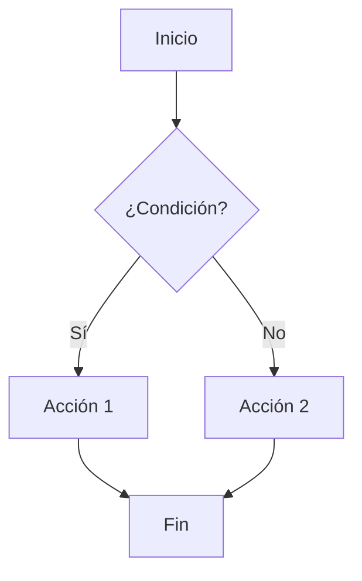

Note: Mermaid puede no funcionar directamente en Markdown, requiere plugin adicional


## Diagrama de Secuencia

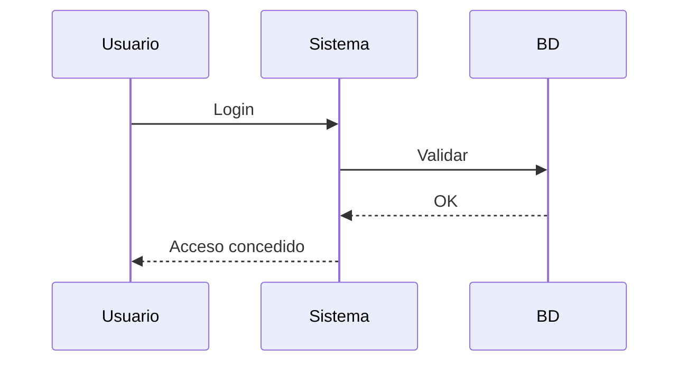

---
# 19. Best Practices


## Principios de Diseño

<div style="text-align: left;">

✅ **KISS** - Keep It Simple, Stupid  
✅ **DRY** - Don't Repeat Yourself  
✅ **YAGNI** - You Aren't Gonna Need It  
✅ **SOLID** - Principios de diseño OO

</div>


## Código Limpio

```python
# ❌ Mal ejemplo
def calc(a,b,c):
    return a+b*c

# ✅ Buen ejemplo
def calcular_total_con_descuento(precio_base, cantidad, descuento):
    """
    Calcula el total aplicando descuento.
    
    Args:
        precio_base (float): Precio unitario
        cantidad (int): Número de unidades
        descuento (float): Porcentaje de descuento
    
    Returns:
        float: Total con descuento aplicado
    """
    subtotal = precio_base * cantidad
    total = subtotal * (1 - descuento)
    return total
```


## Nomenclatura

| Tipo | Convención | Ejemplo |
|:-----|:-----------|:--------|
| Variables | snake_case | `numero_estudiantes` |
| Constantes | UPPER_CASE | `MAX_INTENTOS` |
| Clases | PascalCase | `EstudianteGrado` |
| Funciones | snake_case | `calcular_media()` |
| Métodos | snake_case | `obtener_datos()` |

---
# 20. Recursos Útiles


## Documentación Oficial

📚 **Reveal.js**  
[https://revealjs.com](https://revealjs.com)

📚 **Markdown Guide**  
[https://www.markdownguide.org](https://www.markdownguide.org)


## Plugins Recomendados

* **RevealMarkdown** - Soporte Markdown
* **RevealHighlight** - Resaltado de código
* **RevealNotes** - Notas del presentador
* **RevealSearch** - Búsqueda en presentación
* **RevealZoom** - Zoom en diapositivas
* **RevealMath** - Ecuaciones matemáticas


## Atajos de Teclado

| Tecla | Acción |
|:------|:-------|
| `F` | Pantalla completa |
| `S` | Vista presentador |
| `O` | Vista general |
| `B` | Pantalla negra |
| `?` | Ayuda de teclado |
| `ESC` | Salir de modo |


## Consejos de Presentación

💡 **Menos es más** - No sobrecargues las diapositivas

💡 **Una idea por diapositiva** - Mantén el foco

💡 **Usa imágenes** - Vale más que mil palabras

💡 **Practica** - Ensaya antes de presentar

💡 **Interactúa** - Involucra a la audiencia

---
# 21. Configuración Avanzada


## Opciones de Reveal.js

Las opciones se configuran en el archivo HTML:

```javascript
Reveal.initialize({
    // Tamaño de presentación
    width: 960,
    height: 700,
    
    // Márgenes
    margin: 0.1,
    
    // Numeración
    slideNumber: 'c/t',
    
    // Transiciones
    transition: 'slide',
    
    // Plugins
    plugins: [ RevealMarkdown, RevealHighlight ]
});
```


## Temas Disponibles

* **black** - Fondo negro (default)
* **white** - Fondo blanco
* **league** - Gris oscuro
* **beige** - Beige claro
* **sky** - Azul cielo
* **night** - Negro con texto naranja
* **serif** - Tipo serif
* **simple** - Minimalista
* **solarized** - Solarized

---
# 22. Integración Git


## Workflow Recomendado

```bash
# Crear nueva presentación
cd slides/sectionX-XX/
touch MODULO-UX.Y.-Tema.md

# Añadir a git
git add .
git commit -m "feat: añadir presentación UX.Y"

# Subir cambios
git push origin main
```


## Estructura de Commit

```
feat: nueva presentación sobre Docker
^--^  ^---------------------------^
│     │
│     └─> Descripción del cambio
│
└──────> Tipo: feat, fix, docs, style, refactor
```

---
# 23. Tips para Docentes


## Organización de Contenidos

📁 **Por unidades didácticas**
```
sectionX-XX/
├── MODULO-U1.1.-Tema1.md
├── MODULO-U1.2.-Tema2.md
└── assets/
    ├── U1-imagen1.png
    └── U1-diagrama.png
```


## Reutilización de Slides

Puedes incluir slides de otras presentaciones:

```markdown
<!-- Incluir desde otro archivo -->
@import "MODULO-U1.1.-Introduccion.md"
```

Note: Esta característica puede requerir configuración adicional


## Ejercicios Interactivos

Alterna entre teoría y práctica:

1. 📖 Explicar concepto (2-3 slides)
2. 💻 Mostrar código ejemplo
3. ✏️ Proponer ejercicio
4. ✅ Resolver en clase
5. 🔄 Repetir ciclo

---
# 24. Checklist de Presentación


## Antes de Crear

- [ ] Definir objetivos de aprendizaje
- [ ] Preparar ejemplos prácticos
- [ ] Seleccionar imágenes relevantes
- [ ] Preparar ejercicios
- [ ] Revisar tiempo disponible


## Durante la Creación

- [ ] Usar nomenclatura consistente
- [ ] Añadir notas del presentador
- [ ] Incluir código con resaltado
- [ ] Usar fragmentos para animaciones
- [ ] Agregar imágenes en assets/


## Después de Crear

- [ ] Probar en navegador
- [ ] Verificar todos los enlaces
- [ ] Comprobar que imágenes cargan
- [ ] Revisar ortografía
- [ ] Hacer commit en git
- [ ] Probar en modo presentador

---
# 25. Troubleshooting


## Problemas Comunes

**Problema:** Las imágenes no cargan
```
✅ Solución: Verificar ruta relativa
assets/imagen.png (mismo nivel)
../assets/imagen.png (nivel superior)
```


## Problemas con Código

**Problema:** Código no se resalta

```
✅ Solución: Especificar lenguaje
```python
def ejemplo():
    pass
```\u0020\u0020\u0020(sin estos espacios)
```


## Problemas con Markdown

**Problema:** Saltos de línea no funcionan

```
❌ Esto no funciona
Línea 1
Línea 2

✅ Esto sí funciona
Línea 1  
Línea 2
(dos espacios al final)
```

---
# Fin de la Presentación

## ¡Gracias!

Esta presentación cubre las principales características de **Reveal.js 5.2.1**

---

## Referencias y Créditos

**Creado con:**
* Reveal.js 5.2.1
* Markdown
* Highlight.js

**Autor:** IES Rafael Alberti  
**Fecha:** Octubre 2025

**Documentación:**
* [Reveal.js Docs](https://revealjs.com)
* [Markdown Guide](https://www.markdownguide.org)

---

## Próximos Pasos

1. ✅ Crear tu primera presentación
2. ✅ Experimentar con fragmentos
3. ✅ Añadir código con resaltado
4. ✅ Personalizar temas
5. ✅ Usar notas del presentador

**¡A crear presentaciones increíbles!** 🚀

---
# 26. Plugin Menu 🍔


## ¿Qué es Menu?

Plugin que añade un **menú lateral navegable** a la presentación

**Atajos:**
- `M` - Abrir/cerrar menú
- Clic en icono hamburguesa (☰)


## Características del Menu

✅ **Navegación rápida** entre slides  
✅ **Cambio de tema** en tiempo real  
✅ **Lista de transiciones** disponibles  
✅ **Configuración personalizable**


## Usando el Menu

**Pruébalo ahora:**

1. Presiona `M` o haz clic en el icono ☰
2. Navega por las secciones
3. Cambia el tema desde el menú
4. Explora las transiciones

Note: El menú es especialmente útil en presentaciones largas para saltar entre secciones


## Configuración del Menu

```javascript
menu: {
    side: 'left',        // Posición: left/right
    width: 'normal',     // Ancho: normal/wide/third
    numbers: false,      // Mostrar números
    themes: true,        // Selector de temas
    transitions: true,   // Selector de transiciones
    markers: true,       // Marcadores de progreso
    openButton: true,    // Botón de apertura
    keyboard: true       // Atajos de teclado
}
```

---
# 27. Plugin Chalkboard ✏️


## ¿Qué es Chalkboard?

Plugin para **dibujar sobre las slides** en tiempo real

**Atajos:**
- `C` - Toggle canvas de notas
- `B` - Toggle pizarra
- `DEL` - Limpiar dibujos
- `BACKSPACE` - Reset slide actual
- `D` - Descargar dibujos


## Características de Chalkboard

✅ **Dibujo libre** sobre slides  
✅ **Múltiples colores**  
✅ **Pizarra virtual** independiente  
✅ **Guarda los dibujos**  
✅ **Exporta anotaciones**


## Probando Chalkboard

**¡Pruébalo ahora!**

1. Presiona `B` para activar pizarra
2. Dibuja sobre esta slide
3. Presiona `X` para cambiar color
4. Presiona `DEL` para limpiar

<div style="height: 300px; border: 2px dashed #666; display: flex; align-items: center; justify-content: center; margin: 20px;">
  <p style="color: #666;">Área de práctica - ¡Dibuja aquí!</p>
</div>

Note: Muy útil para explicar conceptos en vivo durante las clases


## Canvas vs Pizarra

**Canvas de Notas (`C`):**
- Dibuja **sobre** la slide actual
- Se mantiene al cambiar de slide
- Ideal para anotar puntos importantes

**Pizarra (`B`):**
- Pizarra **independiente**
- Pantalla completa negra/verde
- Ideal para resolver ejercicios


## Colores Disponibles

Presiona `X` para avanzar o `Y` para retroceder:

🔴 Rojo  
🔵 Azul  
🟢 Verde  
🟠 Naranja  
🟣 Púrpura  
🟡 Amarillo  
⚫ Negro/Blanco


## Ejercicio con Chalkboard

**Resuelve en la pizarra:**

Dada la ecuación: $3x + 5 = 20$

1. Presiona `B` para abrir pizarra
2. Resuelve paso a paso
3. Encuentra el valor de x

Note: x = 5

---
# 28. Plugin Pointer 🖱️


## ¿Qué es Pointer?

Plugin que añade un **puntero láser virtual**

**Atajo:**
- `Q` - Activar/desactivar puntero


## Características del Pointer

✅ **Puntero visual** personalizable  
✅ **Color y tamaño** configurables  
✅ **Opacidad ajustable**  
✅ **Ideal para presentaciones remotas**  
✅ **Señalar detalles específicos**


## Usando el Pointer

**¡Pruébalo ahora!**

1. Presiona `Q` para activar el puntero
2. Mueve el ratón
3. Señala elementos importantes
4. Presiona `Q` de nuevo para desactivar


## Casos de Uso del Pointer

**Útil para:**

🎯 Señalar código específico  
🎯 Destacar áreas en diagramas  
🎯 Guiar la atención en gráficos  
🎯 Presentaciones online  
🎯 Clases virtuales


## Ejemplo con Código

**Señala la línea del bug:**

```python
def calcular_promedio(numeros):
    total = sum(numeros)
    cantidad = len(numeros)
    promedio = total / cantidad  # ¿Y si cantidad es 0?
    return promedio

notas = [8, 9, 7, 10]
print(calcular_promedio(notas))
```

Note: Usa el pointer (Q) para señalar la línea problemática


## Configuración del Pointer

```javascript
pointer: {
    key: "q",           // Tecla de activación
    color: "red",       // Color del puntero
    opacity: 0.8,       // Transparencia
    pointerSize: 12,    // Tamaño en pixels
    alwaysVisible: false // Siempre visible
}
```

---
# 29. Plugin Mermaid 📐


## ¿Qué es Mermaid?

Plugin para crear **diagramas desde código**

**Tipos de diagramas:**
- Flujo
- Secuencia
- Gantt
- Clases
- Estado
- ER (Entidad-Relación)


## Diagrama de Flujo

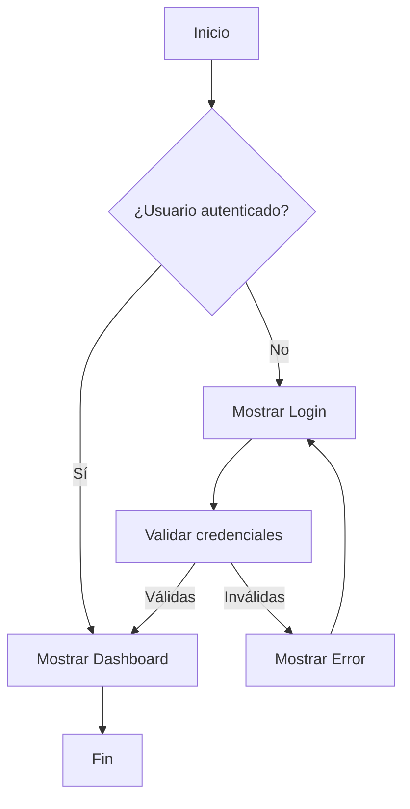


## Diagrama de Secuencia

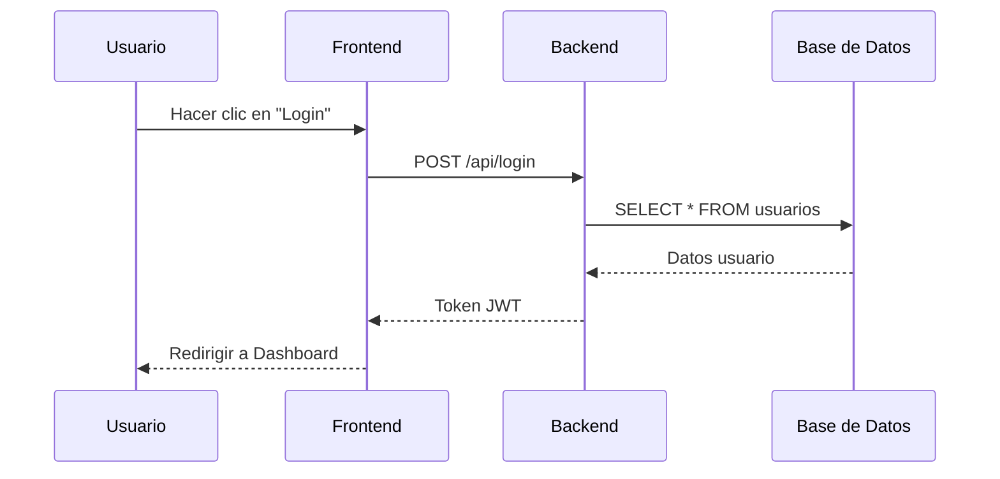


## Diagrama de Clases

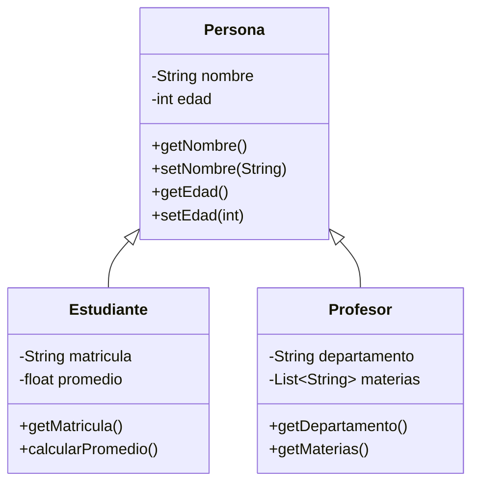


## Diagrama de Estado

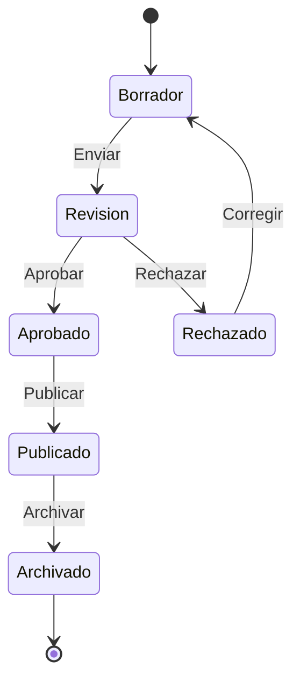


## Diagrama ER

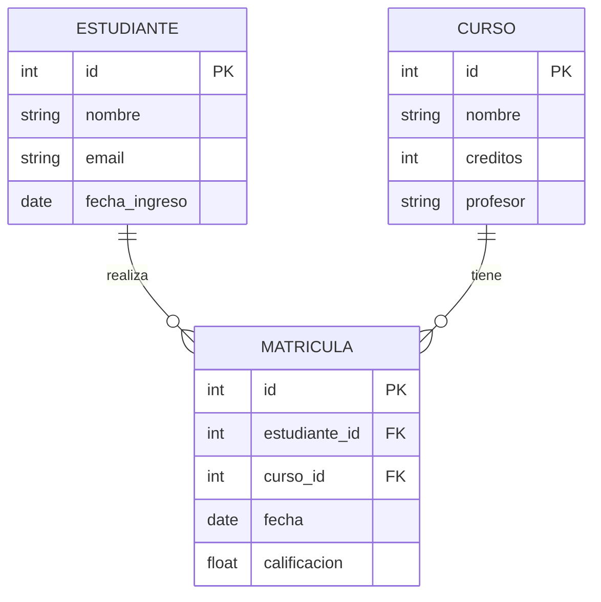


## Diagrama Gantt

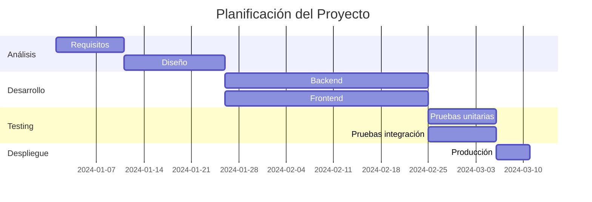


## Diagrama de Flujo - Bucle

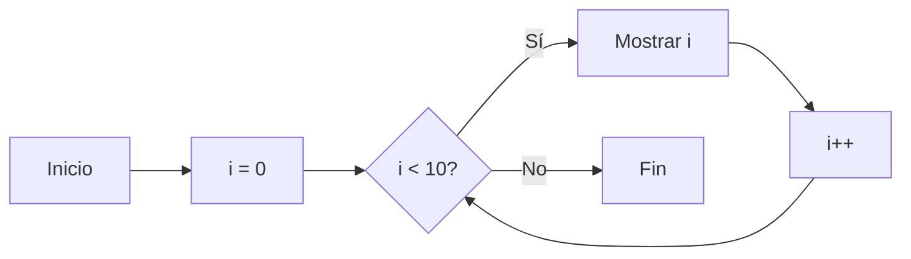


## Código Mermaid

**Sintaxis básica:**

````markdown
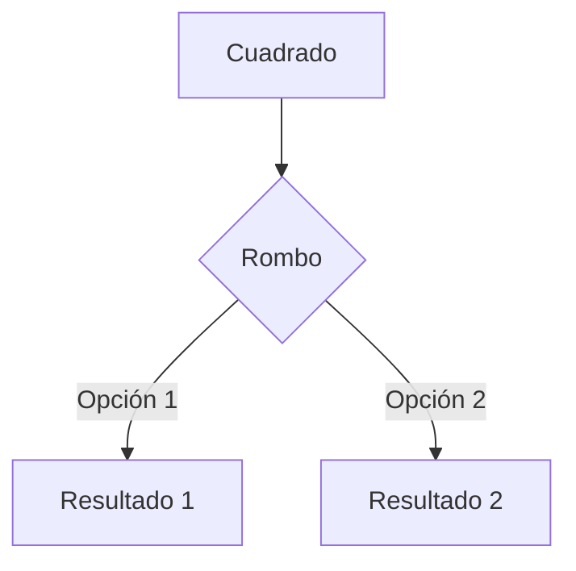
````

Note: Mermaid convierte texto en diagramas profesionales


## Ejercicio Mermaid

**Crea un diagrama de flujo para:**

Algoritmo que determine si un número es par o impar

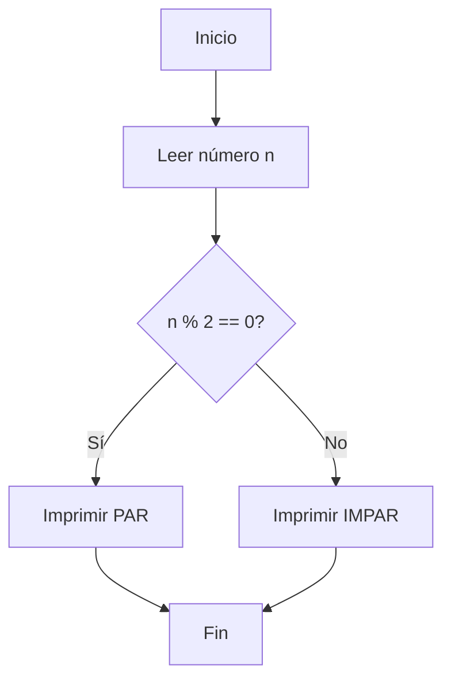

---
# 30. Combinando Plugins


## Menu + Chalkboard

**Navegación + Anotaciones:**

1. Usa `M` para navegar rápido
2. Encuentra la slide que necesitas
3. Presiona `B` para anotar
4. Explica conceptos visualmente


## Pointer + Código

**Señalar código específico:**

```javascript
function validarEmail(email) {
    const regex = /^[^\s@]+@[^\s@]+\.[^\s@]+$/;
    return regex.test(email);  // ← Usa Q para señalar
}

// Pruebas
console.log(validarEmail("test@example.com"));  // true
console.log(validarEmail("invalid-email"));     // false
```

Note: Combina Q (pointer) para señalar la regex


## Mermaid + Chalkboard

**Diagramas + Anotaciones:**

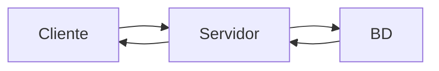

**Ejercicio:** Usa `B` para añadir:
- Tipo de peticiones HTTP
- Formato de respuestas
- Códigos de estado


## Menu + Pointer + Chalkboard

**Workflow completo:**

1. 📚 `M` - Navegar a sección
2. 🖱️ `Q` - Señalar elementos importantes
3. ✏️ `B` - Anotar y explicar
4. 💾 `D` - Guardar anotaciones

---
# 31. Atajos de Teclado - Resumen


## Navegación Básica

| Tecla | Acción |
|:------|:-------|
| `→` / `↓` | Siguiente slide |
| `←` / `↑` | Slide anterior |
| `Home` | Primera slide |
| `End` | Última slide |
| `ESC` / `O` | Vista general |


## Plugins - Atajos

| Tecla | Plugin | Acción |
|:------|:-------|:-------|
| `M` | Menu | Abrir/cerrar menú |
| `S` | Notes | Vista presentador |
| `F` | - | Pantalla completa |
| `B` | Chalkboard | Toggle pizarra |
| `C` | Chalkboard | Toggle canvas |
| `Q` | Pointer | Toggle puntero |
| `?` | - | Ayuda |


## Chalkboard - Atajos

| Tecla | Acción |
|:------|:-------|
| `B` | Toggle pizarra |
| `C` | Toggle canvas |
| `DEL` | Limpiar dibujos |
| `BACKSPACE` | Reset slide |
| `D` | Descargar |
| `X` | Color siguiente |
| `Y` | Color anterior |


## Búsqueda y Zoom

| Atajo | Acción |
|:------|:-------|
| `Ctrl + Shift + F` | Buscar en presentación |
| `Alt + Click` | Zoom en área |
| `Ctrl + Click` | Zoom (Mac) |

---
# 32. Mejores Prácticas


## Uso de Menu

✅ **Estructura bien las secciones**  
✅ **Usa títulos descriptivos**  
✅ **Agrupa contenido relacionado**  
✅ **No sobrecargues de secciones**

❌ Evita secciones sin título  
❌ Evita demasiadas subsecciones


## Uso de Chalkboard

✅ **Prepara las slides para anotar**  
✅ **Deja espacios en blanco**  
✅ **Usa colores consistentes**  
✅ **Guarda anotaciones importantes**

❌ No dibujes sobre texto pequeño  
❌ No uses demasiados colores


## Uso de Pointer

✅ **Señala elementos específicos**  
✅ **Usa movimientos suaves**  
✅ **Apaga cuando no lo uses**  
✅ **Color que contraste con fondo**

❌ No muevas el puntero erráticamente  
❌ No lo dejes activado siempre


## Uso de Mermaid

✅ **Diagramas simples y claros**  
✅ **Etiquetas descriptivas**  
✅ **Colores por defecto**  
✅ **Tamaño legible**

❌ Evita diagramas muy complejos  
❌ No uses abreviaturas sin explicar

---
# 33. Recursos de los Plugins


## Documentación Oficial

📚 **RevealMenu**  
[https://github.com/denehyg/reveal.js-menu](https://github.com/denehyg/reveal.js-menu)

📚 **RevealChalkboard**  
[https://github.com/rajgoel/reveal.js-plugins](https://github.com/rajgoel/reveal.js-plugins)


## Más Recursos

📚 **RevealPointer**  
[https://github.com/burnpiro/reveal.js-pointer](https://github.com/burnpiro/reveal.js-pointer)

📚 **Mermaid**  
[https://mermaid.js.org/](https://mermaid.js.org/)


## Plugins Adicionales

🔌 **RevealAnimate**  
[https://github.com/rajgoel/reveal.js-plugins](https://github.com/rajgoel/reveal.js-plugins)

🔌 **Más plugins comunidad**  
[https://github.com/hakimel/reveal.js/wiki/Plugins](https://github.com/hakimel/reveal.js/wiki/Plugins)

---
# Fin - Plugins Incluidos

## ¡Presentación Completa!

Ahora tienes una guía completa de **Reveal.js 5.2.1** con todos los plugins instalados:

✅ Menu 🍔  
✅ Chalkboard ✏️  
✅ Pointer 🖱️  
✅ Mermaid 📐  
✅ Animate 🎬

**¡Explora y practica cada plugin!** 🚀

