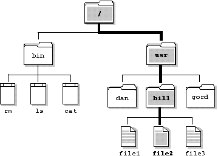
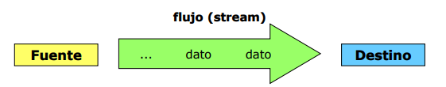

# PR-U7.1 - Sistema de archivos

Note: En esta presentación abrimos la unidad 7 explicando qué es el **sistema de archivos** y por qué aparece en cuanto un programa necesita **persistencia**. Quiero que el alumnado vea con claridad el cambio de idea: pasar de la **memoria temporal**, que desaparece al cerrar el programa, a un almacenamiento organizado que puede recuperarse después.

---

 <!-- .element height="50%" width="50%" -->

Note: Situad este tema dentro del **RA5**, porque aquí empezamos a relacionar programa, **rutas**, **ficheros** y **flujos de datos** como partes del mismo problema. Esta base conceptual es la que luego permitirá entender con naturalidad `File`, la **lectura**, la **escritura** y el trabajo con **ficheros de texto**.

---

## Índice

Note: En esta presentación situamos la unidad 7.1 dentro del **RA5** y marcamos el mapa general del tema. El objetivo no es memorizar nombres todavía, sino entender por qué un programa necesita **persistencia**, cómo se organiza un **sistema de archivos** y qué papel tienen los **flujos de entrada/salida** y las APIs de Kotlin y Java.


### Índice I

- 1. Persistencia y necesidad de almacenar datos
- 2. Qué es un sistema de archivos
- 2.1. Conceptos básicos: fichero, directorio, ruta y metadatos
- 2.2. Rutas absolutas y relativas

Note: En esta primera parte conectamos **memoria** y **persistencia**, que es la gran frontera conceptual del tema. Después aterrizamos la idea de **sistema de archivos** y fijamos el vocabulario básico que ya no podremos soltar: **fichero**, **directorio**, **ruta** y **metadatos**.


### Índice II

- 3. Ficheros de texto y binarios. Tipos de acceso
- 4. Flujos de entrada/salida
- 5. Consola: `System.in`, `System.out` y `System.err`
- 6. APIs: `kotlin.io`, `java.io` y `java.nio.file`
- 7. Buenas prácticas y resumen

Note: La segunda mitad baja a lo operativo y convierte la teoría en herramientas mentales más concretas. Distinguimos tipos de ficheros y de acceso, explicamos qué significa trabajar con un **flujo**, repasamos la consola como ejemplo de **entrada/salida** y terminamos con las **APIs** y las primeras **buenas prácticas**.

---

## 1. ¿Por qué necesitamos almacenar datos?

Note: Abrimos el tema con una idea muy simple, pero fundamental: la **memoria** del programa es rápida y útil, pero también es **temporal**. Si cerramos la aplicación, los datos desaparecen, y por eso necesitamos mecanismos de **entrada/salida** que nos permitan conservar y recuperar información más allá de una ejecución concreta.


### 1.1. Memoria temporal frente a persistencia

- Las variables guardan datos mientras el programa se ejecuta
- Al terminar la aplicación, lo almacenado en memoria se pierde
- Muchas aplicaciones necesitan conservar datos entre sesiones
- Ahí aparece la necesidad de **persistencia**

 <!-- .element: style="max-width: 50%;" -->

Note: Conviene insistir en que una **variable** no es un almacén permanente, sino una herramienta de trabajo mientras el programa está vivo. La **persistencia** aparece justo para resolver ese límite y permitir que notas, incidencias, configuraciones o informes sigan disponibles cuando el proceso ya ha terminado.


### 1.2. Cuándo hace falta guardar información

- Cuando los datos no vienen fijos en el código
- Cuando el usuario no puede reintroducir todo cada vez
- Cuando hace falta registrar actividad o incidencias
- Cuando el programa lee configuración al arrancar
- Cuando se exportan resultados a un informe

Note: Estos ejemplos acercan el concepto al trabajo real y evitan que el tema parezca algo abstracto. Una app de notas, una configuración, un **log** o un informe son casos claros en los que la memoria no basta, y la palabra clave que quiero que se recuerde es **persistir** la información fuera del proceso.

---

## 2. ¿Qué es un sistema de archivos?

Note: En esta sección explicamos el mecanismo que ofrece el sistema operativo para organizar información en discos, SSD o memorias USB de forma ordenada. El alumnado debe visualizar el **sistema de archivos** como una estructura jerárquica de **carpetas**, **ficheros** y **rutas**, no como un conjunto caótico de datos sueltos.


### 2.1. Organización jerárquica de la información

- El sistema operativo organiza datos en soportes persistentes
- Normalmente se representa como una jerarquía de carpetas
- Dentro de esa jerarquía encontramos ficheros y subdirectorios
- Las rutas permiten localizar cada elemento

 <!-- .element: style="max-width: 48%;" -->

Note: La metáfora del **árbol** ayuda mucho porque convierte algo técnico en algo fácil de imaginar: unas carpetas contienen otras y, al final, cada fichero se localiza por su posición en esa jerarquía. Desde un programa operamos con esa organización lógica y no necesitamos conocer el detalle físico del disco para crear, leer, mover, copiar o borrar.


### 2.2. Conceptos básicos del tema

- **Fichero**: unidad de información almacenada
- **Directorio**: contenedor para organizar ficheros y carpetas
- **Ruta**: secuencia que identifica una localización
- **Directorio de trabajo**: referencia para rutas relativas
- **Metadatos**: nombre, tamaño, fecha o permisos

Note: Este vocabulario va a aparecer durante toda la unidad, así que aquí conviene fijarlo bien y sin prisas. También quiero remarcar un matiz importante: la **extensión** orienta y ayuda, pero no garantiza por sí sola el contenido real del fichero; es una **convención**, no una prueba absoluta.


### 2.3. Rutas absolutas y relativas

- La ruta absoluta parte desde la raíz del sistema
- La ruta relativa parte del directorio de trabajo actual
- Las rutas relativas facilitan la portabilidad del proyecto
- Una ruta absoluta escrita a mano suele fallar en otro equipo

```text
Windows: C:\Usuarios\ana\documentos\notas.txt
Linux/macOS: /home/ana/documentos/notas.txt
Relativas: datos/notas.txt o ./config/app.properties
```

Note: La comparación entre **rutas absolutas** y **rutas relativas** es importante porque luego afecta directamente al código y a la portabilidad del programa. En proyectos educativos y profesionales suele convenir trabajar con **rutas relativas** para que el software no dependa de una carpeta concreta de un único ordenador.

---

## 3. Ficheros, directorios y tipos de acceso

Note: Una vez ubicado el **sistema de archivos**, el siguiente paso lógico es distinguir tipos de datos y formas de acceso. Esto prepara el terreno para entender que no se trabaja igual con una línea de **texto** que con una secuencia de **bytes**, y que esa diferencia condiciona herramientas y APIs.


### 3.1. Texto, binario y lectura humana

- Los ficheros de texto almacenan caracteres
- Suelen servir para configuraciones, CSV, logs o informes
- Los ficheros binarios no son legibles a simple vista
- Son habituales en imágenes, audio o datos serializados
- La forma de leer y escribir cambia según el tipo

Note: El punto clave es que el tipo de contenido condiciona la **API** y también la forma de pensar el problema. Cuando hablamos de **texto** pensamos en caracteres, líneas y legibilidad; cuando hablamos de **binario**, pensamos en **bytes** y estructuras que no están diseñadas para ser leídas directamente por una persona.


### 3.2. Acceso secuencial y acceso aleatorio

- El acceso secuencial procesa los datos en orden
- Normalmente se lee de principio a fin
- El acceso aleatorio permite saltar a una posición concreta
- En esta unidad empezamos por los casos secuenciales

Note: Aquí interesa que el alumnado entienda la idea general antes que la implementación concreta. El acceso **secuencial** es el más frecuente al principio porque encaja muy bien con la lectura y escritura de **texto**, y porque simplifica mucho la forma de recorrer la información.

---

## 4. ¿Qué es un flujo de entrada/salida?

Note: Esta es una de las ideas centrales del tema y merece decirse despacio: un **flujo** es una abstracción que modela el paso de datos entre una **fuente** y un **destino**. Esa misma idea sirve para teclado, pantalla, ficheros, red o memoria, y por eso simplifica mucho el mapa mental del alumnado.


### 4.1. Fuente, destino y secuencia de datos

- Un flujo representa datos que circulan secuencialmente
- Entre una fuente y un destino hay operaciones repetidas
- Las acciones típicas son abrir, leer, escribir y cerrar
- El mismo modelo se reutiliza en muchos contextos

 <!-- .element: style="max-width: 52%;" -->

Note: El valor didáctico del concepto está en la **unificación** que aporta. Aunque cambie el dispositivo físico, seguimos pensando en una secuencia de datos y en operaciones parecidas, y eso reduce la complejidad mental porque evita aprender un modelo completamente distinto para cada caso.


### 4.2. Tipos de flujos que encontraremos

- Flujos de **caracteres** para texto
- Flujos de **bytes** para datos binarios
- Flujos de **objetos** cuando serializamos estructuras
- La abstracción permite trabajar de forma uniforme

Note: Conviene subrayar que no todos los **flujos** transportan lo mismo y que el tipo de dato condiciona las clases y métodos que veremos después. Si el alumnado tiene que quedarse con una definición, que sea esta: un flujo permite **leer** o **escribir** datos secuencialmente entre una fuente y un destino.

---

## 5. Entrada estándar, salida estándar y error

Note: Antes de trabajar con ficheros, es útil recordar que un programa ya hace **entrada/salida** cuando usa la **consola**, porque así conectamos la teoría con algo que el alumnado ya conoce desde las primeras prácticas. Esta conexión ayuda a entender que consola y ficheros no son mundos separados, sino variantes del mismo problema.


### 5.1. Los tres canales básicos de consola

- **Entrada estándar**: normalmente el teclado
- **Salida estándar**: normalmente la consola
- **Salida de error**: canal específico para mensajes de error
- En la JVM aparecen como `System.in`, `System.out` y `System.err`

 <!-- .element: style="max-width: 45%;" -->

Note: Es importante distinguir **salida normal** y **salida de error**, porque aunque ambas se vean en consola no cumplen la misma función. Esta separación será muy útil más adelante cuando el alumnado trabaje con **scripts**, **redirecciones** o tareas de **depuración**.


### 5.2. Kotlin sobre la JVM: entrada y salida simples

- Kotlin ofrece funciones de más alto nivel para consola
- `print()` y `println()` escriben en salida estándar
- `readln()` y `readlnOrNull()` leen desde entrada estándar
- Son cómodas para ejemplos y ejercicios iniciales

```kotlin
fun main() {
    print("Introduce tu nombre: ")
    val nombre = readln()
    println("Hola, $nombre")
}
```

Note: Este ejemplo todavía no usa ficheros, pero sí muestra una operación completa de **entrada/salida**: el programa lee desde teclado y escribe en pantalla siguiendo un flujo claro. Sirve para conectar la **consola** con el concepto general de **flujo** y para que el alumnado vea una aplicación inmediata del modelo.

---

## 6. APIs que usaremos en la unidad

Note: Ahora situamos las bibliotecas principales para que el alumnado sepa orientarse sin necesidad de memorizarlo todo todavía. La idea es entender qué familia de **APIs** resuelve cada necesidad cuando trabajamos con consola, **rutas**, **ficheros** y **flujos**.


### 6.1. `kotlin.io`: utilidades de alto nivel

- Lectura desde consola con `readln()` y `readlnOrNull()`
- Lectura de texto con `readText()` y `readLines()`
- Escritura simple con `writeText()` y `appendText()`
- Resulta cómoda para tareas frecuentes y ejemplos cortos

Note: Esta familia de utilidades es especialmente útil para empezar porque reduce mucho el ruido sintáctico y deja ver mejor la intención del código. Permite trabajar pronto con **lectura** y **escritura** sin tener que entrar todavía en detalles más bajos de la plataforma Java.


### 6.2. `java.io` y `java.nio.file`

- `java.io` es la API clásica de Java para ficheros y flujos
- Aquí aparece la clase `File`
- `java.nio.file` es la API más moderna para rutas y operaciones
- Destacan `Path` y `Files` para un trabajo más robusto

 <!-- .element: style="max-width: 52%;" -->

Note: Conviene presentar estas APIs como **complementarias**, no como rivales. Kotlin hereda la potencia del ecosistema Java y además añade utilidades de más alto nivel, así que durante la unidad nos iremos moviendo con naturalidad entre **`kotlin.io`**, **`java.io`** y **`java.nio.file`** según lo que haga falta.

---

## 7. De la teoría a la práctica

Note: Antes de cerrar, hacemos la traducción directa del tema a un programa real para que la teoría no se quede flotando. El alumnado debe reconocer en este ejemplo varias ideas a la vez: **entrada**, **salida**, **persistencia** y elección de una librería adecuada para resolver el problema.


### 7.1. Ejemplo guiado: guardar una incidencia

```kotlin
import java.io.File

fun main() {
    print("Escribe una incidencia: ")
    val incidencia = readln()

    File("incidencias.txt").appendText("$incidencia\n")
    println("Incidencia guardada")
}
```

- Lee una incidencia desde teclado
- Escribe confirmación en consola
- Guarda información en un fichero de texto
- Usa una ruta relativa dentro del proyecto

Note: Este ejemplo resume muy bien el tema porque junta varias piezas sin complicarse innecesariamente. Leemos por **entrada estándar**, mostramos información por **salida estándar** y persistimos el dato en un **fichero**, además usando una **ruta relativa**, que es una buena práctica dentro de un proyecto.


### 7.2. Buenas prácticas iniciales

- Usa rutas relativas cuando trabajes en un proyecto
- Distingue claramente texto y binario
- Valida la entrada antes de guardarla
- No des por hecho que un fichero existe
- Maneja con cuidado errores de lectura y escritura
- Usa APIs de alto nivel cuando simplifiquen el código

Note: Este bloque final sirve como lista de control para cerrar el tema con criterio práctico y no solo con definiciones. También conviene remarcar un error muy frecuente: **tener una ruta** escrita como texto no significa que el **fichero exista** realmente en el sistema.

---

## 8. Resumen

Note: Cerramos recuperando las ideas esenciales del apartado para que no se pierda la visión global entre tantos conceptos nuevos. El alumnado debería salir de aquí con un mapa mental claro antes de entrar en **consola**, clase **`File`** y **lectura/escritura** de ficheros en los siguientes subtemas.


### 8.1. Ideas clave para continuar la unidad

- La memoria no basta cuando necesitamos persistencia
- El sistema de archivos organiza información con rutas y carpetas
- La entrada/salida se modela mediante flujos
- Consola y ficheros forman parte del mismo problema general
- Kotlin y Java aportan APIs específicas para resolverlo

Note: Si esta slide queda clara, el grupo ya tiene la base conceptual que necesitábamos para toda la unidad. La siguiente etapa será aplicar estas ideas en ejercicios con **consola**, con **`File`** y con **lectura/escritura real** de información, pero ya sobre una base conceptual mucho más sólida.
