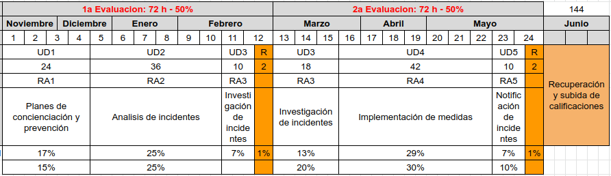
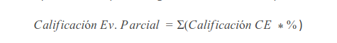
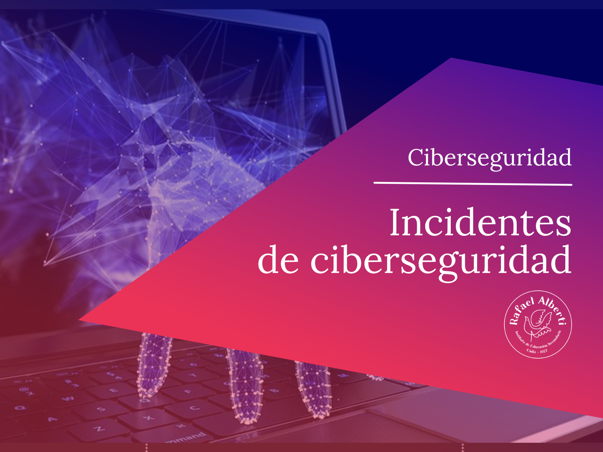

<!-- Con # se ponen los títulos -->

## Incidentes de ciberseguridad

---
# Indice

---
# Presentación

## Eduardo Fernández Oliver

* _[efernandez@iesrafaelalberti\.es](mailto:efernandez@iesrafaelalberti.es)_
* _[https://www.linkedin.com/in/efoliver/](https://www.linkedin.com/in/efoliver/)_
* _[https://revilofe.github.io/](https://revilofe.github.io/)_
  
_[Programación didáctica ](https://drive.google.com/file/d/1_NBHFvUpToCpRCow8i-xNGtTAMcRiCgj/view?usp=sharing)_

Note: Recomendado, consultar la programación.

---
# Objetivos

## Objetivos fundamentales

La formación del módulo contribuye a alcanzar los objetivos generales a), b), c), d), q), r), s), t), u) y v) del curso de especialización.

## Objetivos RA

|   RA    | LOGRO                  | *OBJETO*                                                     | *ACCIONES EN EL CONTEXTO DE APRENDIZAJE*                                                       |
|:-------:|:-----------------------|:-------------------------------------------------------------|:-----------------------------------------------------------------------------------------------|
|  RA 1   | Desarrolla             | planes de prevención y concienciación en ciberseguridad      | estableciendo normas y medidas de protección                                                   |
|  RA 2   | Analiza                | incidentes de ciberseguridad                                 | utilizando herramientas, mecanismos de detección y alertas de seguridad                        |
|  RA 3   | Investiga              | incidentes de ciberseguridad                                 | analizando los riesgos implicados y definiendo las posibles medidas a adoptar                  |
|  RA 4   | Implementa             | medidas de ciberseguridad en redes y sistemas                | respondiendo a los incidentes detectados y aplicando las técnicas de protección adecuadas      |
|  RA 5   | Detecta y documenta    | incidentes de ciberseguridad                                 | siguiendo procedimientos de actuación establecidos.                                            |
<!-- .element.table: style="font-size:50%;" -->

## Competencias PPS

La formación del módulo contribuye a alcanzar las competencias a), b), k), l), m), n) y ñ) del curso de especialización

_[Programación didáctica ](https://drive.google.com/file/d/1_NBHFvUpToCpRCow8i-xNGtTAMcRiCgj/view?usp=sharing)_

---
# Horarios

## Horario del curso 2025/2026

Horario (5 horas semanales)

|       HORA        |    L     |    M    |    X     |   J    |   V    |
|:-----------------:|:--------:|:-------:|:--------:|:------:|:------:|
|   08:00 - 09:00   |    IS    |         |    IS    |        |        |
|   09:00 - 10:00   |    IS    |         |    IS    |        |        |
|   10:00 - 11:00   |          |         |    IS    |        |        |
|   11:00 - 11:30   |  Recreo  | Recreo  |  Recreo  | Recreo | Recreo |
|   11:30 - 12:30   |          |         |          |        |        |
|   12:30 - 13:30   |          |         |          |        |        |
|   13:30 - 14:30   |          |         |          |        |        |
<!-- .element.table: style="font-size:50%;" -->

**Lunes:** 08:00 - 10:00 (2 horas)  
**Miércoles:** 08:00 - 11:00 (3 horas)

## Planificación del curso

**Consulta siempre la programación didáctica actualizada:**

_[Programación didáctica ](https://drive.google.com/file/d/1_NBHFvUpToCpRCow8i-xNGtTAMcRiCgj/view?usp=sharing)_

---
# Contenidos

## Contenidos del módulo

|   Unidades didácticas    | Descripción unidad                                          |  Sesiones   |   RA   |  Criterios   |          Trimestre          |
|:------------------------:|:------------------------------------------------------------|:-----------:|:------:|:------------:|:---------------------------:|
|           UD1            | Desarrollo de planes de prevención y concienciación         |     24      |  RA1   |    a)..e)    |  1er trimestre (72 horas)   |
|           UD2            | Analiza incidentes de ciberseguridad                        |     36      |  RA2   |    a)..e)    |                             |
|           UD3            | Investiga incidentes de ciberseguridad                      |     12      |  RA3   |    a),b)     |                             |
|           UD3            | Investiga incidentes de ciberseguridad (continuación)       |     18      |  RA3   |    c)..e)    |   2º trimestre (72 horas)   |
|           UD4            | Implementa medidas de ciberseguridad en redes y sistemas    |     42      |  RA4   |    a)..f)    |                             |
|           UD5            | Documenta y notifica incidentes de ciberseguridad           |     12      |  RA5   |    a)..e)    |                             |
<!-- .element.table: style="font-size:50%;" -->

_[Programación didáctica ](https://drive.google.com/file/d/1_NBHFvUpToCpRCow8i-xNGtTAMcRiCgj/view?usp=sharing)_

---
# Evaluación y recuperación

## Evaluación I
* Se supera el módulo con una calificación **mayor o igual a 5**.
* La nota se obtiene haciendo la **media ponderada** de los resultados de aprendizaje (RA).
* **Un RA no superado implica no superar el módulo**.

## Evaluación II
* La calificación de los RA se obtiene de la **media ponderada** de los criterios de evaluación (CE).
* Los CE se evalúan y califican a través de:
  * Trabajo en clase
  * Realización de prácticas
  * Pruebas específicas

## Evaluación III
* **2 Evaluaciones Parciales:**
  * 1ª Evaluación: Enero
  * 2ª Evaluación: Mayo
* **1 Evaluación Final:**
  * Evaluación Final: Junio

## Recuperación
* La recuperación de los RA pendientes se realiza **durante el mes de junio**.
* Consistirá en:
  * Conjunto de prácticas y/o pruebas específicas
  * Sobre los criterios de evaluación del RA no superado

---
# Metodología y comunicación

## Metodología I
Por cada unidad didáctica:
* Explicación de contenidos relacionados con los criterios de evaluación del RA correspondiente.
* **Vuestros apuntes son importantes.**
* Trabajo en grupo e individual:
  * Guiados por diapositivas
  * Materiales de internet
  * Discusión grupal

## Metodología II
Por cada unidad didáctica:
* Exámenes tipo test sobre los contenidos trabajados
* Realización de ejercicios prácticos
* Trabajos y ejercicios que **SE DEBERÁN DEFENDER EN CLASE**

Note: La defensa oral de los trabajos es obligatoria y forma parte de la evaluación.

## Comunicación
* **Comunicación oficial, preferida y obligada:**
  * Presencial en el aula
  * Hablar directamente con el profesor
  
* **Medios secundarios (opcionales):**
  * Correo electrónico
  * Plataforma Moodle

  <!-- .element height="25%" width="25%" -->

**⚠️ ATENCIÓN:** Estás en una **FORMACIÓN PRESENCIAL**

---
# Recomendaciones y aclaraciones

## Recomendaciones
Recomendaciones al alumnado:
* Leer y entender la **programación didáctica del módulo**
* Configurar tu perfil en Moodle:
  * Foto actualizada
  * Correo electrónico correcto (@g.educaand.es)

## Aclaraciones I
* **Formación presencial** → Comunicación presencial
* **Regla general de corrección:**
  * Ejercicios individuales: Corrección en clase delante del profesor (defensa obligatoria)
  * Ejercicios en grupo: Presentación grupal O por un componente aleatorio del grupo (el profesor decide el método)

## Aclaraciones II
**Causas para NO corregir una prueba:**
* No se cumplen las condiciones de entrega
* Posible plagio o copiado (total o parcial):
  * De otros compañeros
  * De internet sin citar la fuente
* **Entrega fuera de plazo** (aunque sean segundos)
* En caso de código: **no compila**

## Aclaraciones III
**⚠️ OJO con ChatGPT, Copilot, etc.:**
* Asegúrate de **entender lo que haces**
* Debes ser capaz de **defender y explicar** tu código

## Aclaraciones IV
**Si la entrega es mediante Git:**

El archivo **README.md** debe incluir:
* Instrucciones para compilar y ejecutar
* Descripción de la aplicación
* Autoría
* Referencias y fuentes consultadas

## Aclaraciones V
**Custodia de trabajos y materiales:**
* Es **responsabilidad del alumnado** guardar y custodiar:
    * Trabajos realizados
    * Documentos
    * Cualquier material de prácticas
* **NO es responsabilidad del profesorado** la pérdida de material

**Soluciones recomendadas:**
  * Google Drive, GitHub, GitLab, Bitbucket, etc.

## Aclaraciones VI
**Fechas de entrega:**
* Tendrán una fecha **clara y fija**
* **NO se podrá cambiar bajo ninguna circunstancia**
* Excepciones: Solo a criterio del profesor y debidamente justificadas
* **NO SE RECIBIRÁ ENTREGAS POR CORREO ELECTRÓNICO**

**La entrega completa consiste en:**
1. Subida a la plataforma en fecha
2. **Defensa en clase** (obligatorio)

---
# Dudas

---
# Fin!

 <!-- .element height="50%" width="50%" -->

 ¡¡Gracias y buen curso!! 
 

---
# Seguimos  

## Primeros pasos
**Tareas inmediatas:**
1. Identificar tu **email corporativo**: xxx@g.educaand.es
2. Acceder a Moodle y configurar tu perfil:
   * Email corporativo
   * Foto actualizada
3. Rellenar los formularios de Moodle
4. Darte de alta en **GitHub.com**:
   * Usa tu email corporativo
   * Solicita acceso GitHub Student (cuenta PRO gratuita)

