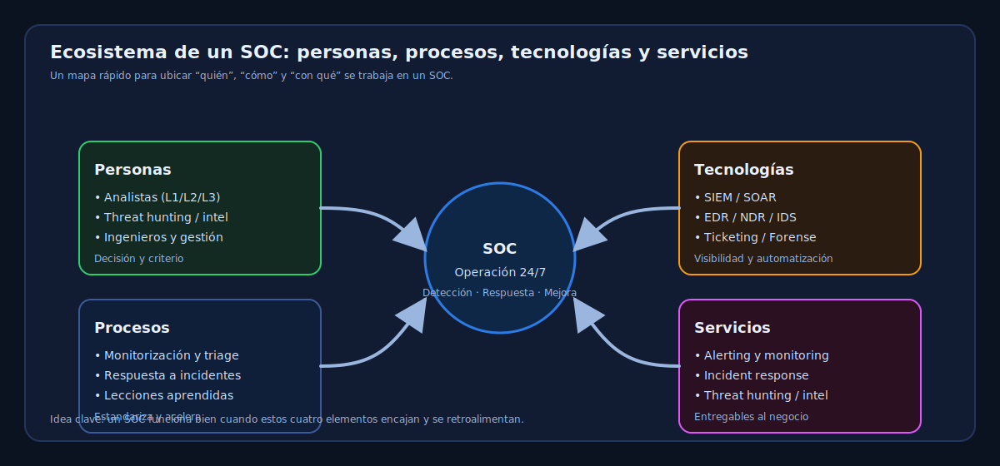
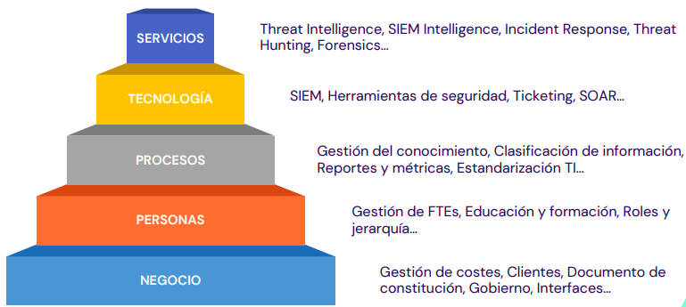
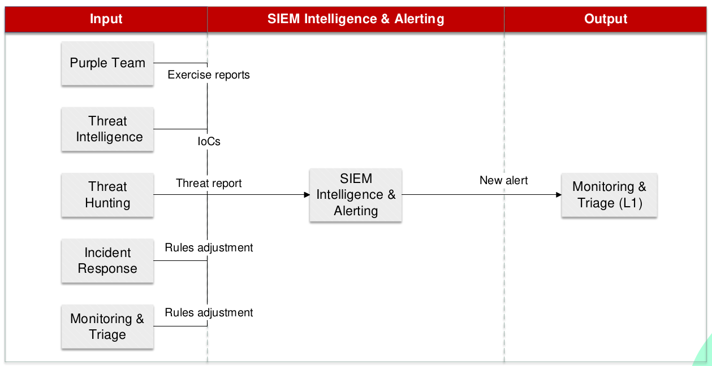
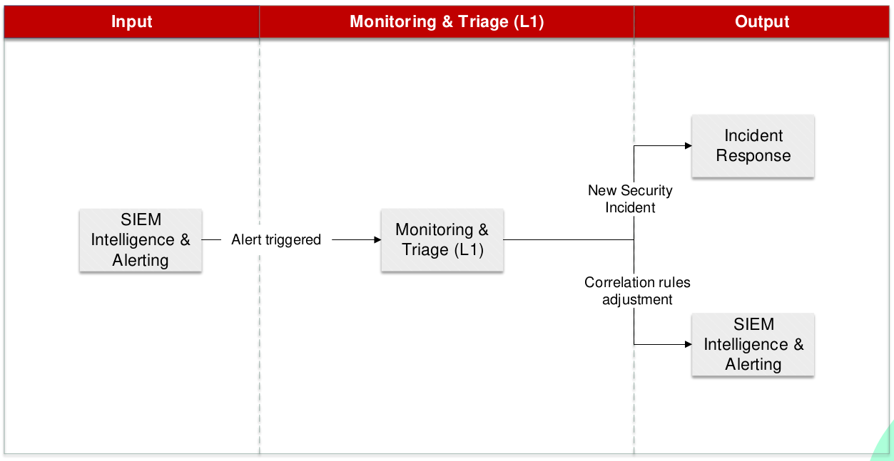
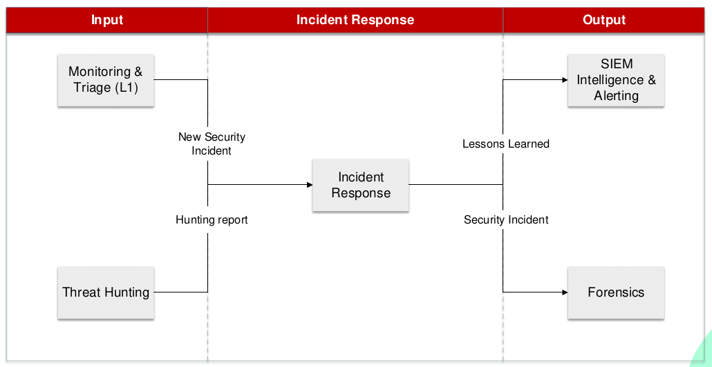
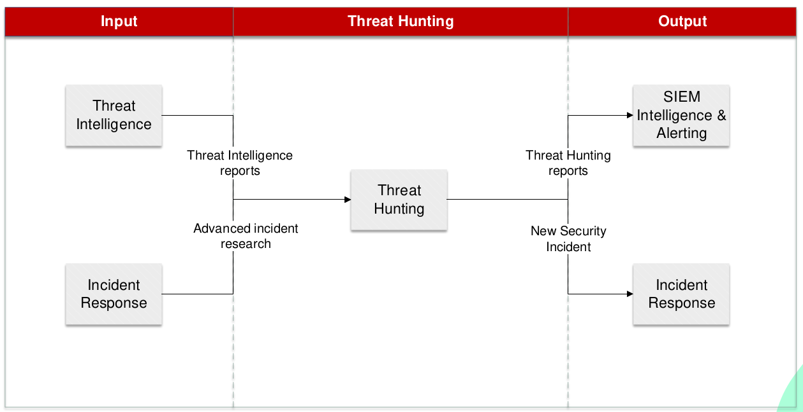

# U2.2.1 - SOC: Servicios y herramientas

Note: Presentación de la **UD 2, apartado 2.2.1**. Explica que el objetivo es
entender el **ecosistema de un SOC**: qué es, qué objetivos persigue, qué
componentes lo forman (personas, procesos, tecnologías y servicios) y cómo se
diseña e implanta. Remarca que no es solo “herramientas”: es **operación
organizada** para detectar y responder a incidentes.

---

 <!-- .element: style="max-width:50%;" -->

Note: Da la bienvenida y contextualiza: estamos en un módulo de **Incidentes de
Seguridad** y hoy aterrizamos en el **SOC** como pieza operativa para la
**detección** y la **respuesta**. Indica que se verá el SOC desde una visión
práctica: roles, procesos, tecnologías y servicios.

---

## Índice

* 1. Introducción y objetivos del SOC
* 2. Componentes: personas, procesos, tecnologías y servicios
* 3. Diseño y estructura del SOC
* Anexo I: IoC y MISP
* Referencias

Note: Explica el recorrido. Señala que primero se define **qué es un SOC** y por
qué importa, después se descompone en **componentes** (quién, cómo y con qué) y
finalmente se revisan decisiones de **diseño e implantación**. Termina con
conceptos de apoyo: **IoC** y **MISP**.

---

## 1. Introducción

Note: Arranca el bloque 1. La idea es que el alumnado entienda el SOC como
**corazón operativo** de la ciberseguridad: vigilancia continua, detección,
respuesta y mejora. Enlaza con lo visto en incidentes y con la necesidad de
herramientas y servicios para operar de forma **repetible**.

### RA2 y CEb (qué se evalúa)

* **RA2:** Analizar incidentes con herramientas y mecanismos de detección
* **CEb:** Controles y mecanismos de monitorización y alerta establecidos

Note: Conecta con evaluación: el SOC es el “lugar” donde se aplican herramientas
(SIEM, EDR, IDS/IPS), mecanismos de **detección** (reglas, correlación) y
**alerta**. Destaca que el objetivo no es memorizar marcas, sino comprender
**cómo** se organiza la detección y la respuesta.

### SOC: representación

 <!-- .element: style="max-width:70%;" -->

Note: Usa la imagen para ubicar mentalmente el SOC como centro de operaciones.
Subraya que un SOC aglutina **personas**, **procesos** y **tecnología** con un
objetivo: reducir **tiempo de detección** y **tiempo de respuesta**.

### Ecosistema de un SOC (imagen)

 <!-- .element width="75%" -->

Note: Presenta el mapa del ecosistema: explica que en un SOC conviven
**personas** (roles), **procesos** (flujos), **tecnologías** (SIEM/SOAR/EDR) y
**servicios** (alerting, triage, IR, forense). Indica que la efectividad viene
de la **integración** entre todo.

### 1.1. ¿Qué es un SOC?

* Centro de operaciones **centralizado** de ciberseguridad
* Combina **profesionales**, **procesos** y **tecnologías**
* Supervisa, detecta, responde y **previene** amenazas

Note: Define SOC: no es una herramienta, es una **capacidad operativa**. Marca
en **negrita**: **centralizado**, **24/7 cuando aplica**, y la combinación de
**personas + procesos + tecnología**. Explica que la prevención en un SOC se
apoya en **aprendizaje** y mejora de controles.

### 1.1. ¿Qué es un SOC? (Analogía)

* “Centro de control aéreo” de la ciberseguridad
* Vigila el “tráfico digital” y coordina respuestas
* Prioriza incidencias para actuar con rapidez

Note: Usa la analogía: un control aéreo no “vuela aviones”, **coordina** y evita
accidentes. Igual el SOC: no sustituye a TI, pero **coordina** detección y
respuesta. Recalca la idea de **priorización**: no todas las alertas son
iguales.

### 1.1. Funciones principales del SOC

* Supervisión continua de infraestructura y datos
* Detección de amenazas y actividades sospechosas. Aún no sabe si es incidente.
* Respuesta y mitigación de incidentes
* Prevención mediante **mejora continua**

Note: Repasa las 4 funciones y destaca en **negrita**: **supervisión continua**
y **mejora continua**. Explica que prevenir no es “adivinar”, sino reducir
exposición: hardening, reglas, y lecciones aprendidas. Se habla de amenazas, 
porque el SOC no solo reacciona a incidentes confirmados, sino que también busca 
señales de actividad maliciosa.

### 1.2. Objetivos principales de un SOC

* **Prevención:** controles (firewall, IDS/IPS, hardening)
* **Detección:** reglas y correlación (SIEM)
* **Respuesta:** contención y erradicación
* **Recuperación:** restaurar y volver a operar

Note: Explica el ciclo completo: antes, durante y después del incidente. Marca
en **negrita** que el SOC no termina en “detectar”: tiene que **actuar** y
ayudar a **recuperar**. Da ejemplos rápidos: bloqueo de fuerza bruta, alerta de
acceso inusual, aislamiento de servidor, restore de backup.

### 1.3. SOC, CERT, CIRT y CSIRT (términos)

* **SOC:** operaciones completas (supervisión, detección, respuesta)
* **CERT:** respuesta a **emergencias** (DDoS, ransomware)
* **CIRT/CSIRT:** respuesta a **incidentes** y coordinación
* Activación típica: CERT/CSIRT ante **incidentes críticos**

Note: Aclara que a veces se usan como sinónimos, pero el SOC suele ser el
paraguas operativo. Remarca en **negrita**: **SOC = operación continua**,
**CERT/CSIRT = foco en respuesta**. Menciona que CERT es también un término
histórico con uso como marca.

### 1.3. Relación y diferencias (ejemplo)

* El SOC detecta y genera una **alerta**. El SIEM detecta, pero el SOC opera.
* Respuesta investiga y coordina **contención** y **erradicación**
* Luego viene **recuperación** y ajuste de defensas

Note: Recorre el ejemplo como una historia: detección → investigación →
contención → recuperación. Destaca en **negrita** que el valor está en el flujo
completo y en cerrar el ciclo: mejorar reglas y procesos. Real mente no es el SOC quien detecta, ni quien responde sino que detecta el SIEM, y responde el equipo de IR, pero el SOC es el marco organizativo que hace que todo esto funcione.

### 1.4. Importancia del SOC (amenazas crecientes)

* Más frecuencia y sofisticación de ataques
* Superficie de ataque en aumento
* Necesidad de detectar antes de que el daño sea mayor

Note: Explica que el SOC aparece por presión del entorno: más endpoints, cloud,
trabajo remoto, phishing avanzado. Marca en **negrita**: **reducir el impacto**
depende de **detectar pronto**.

### 1.4. Beneficios de contar con un SOC

* **Protección proactiva** (reglas y controles)
* **Respuesta rápida** (menos tiempo de exposición)
* **Cumplimiento** (GDPR, ISO 27001, NIST CSF)
* **Confianza** de clientes y socios

Note: Explica cada beneficio con un ejemplo breve. Destaca en **negrita**:
**tiempo** (minutos vs horas) en la respuesta, y el papel de informes y
evidencias para auditorías. Conecta con continuidad de negocio.

### 1.4. Relevancia estratégica

* Habilita **continuidad de negocio**
* Reduce impacto reputacional y regulatorio
* Alinea seguridad con objetivos del negocio

Note: Refuerza la idea de SOC como “habilitador”: permite operar en digital con
menor riesgo. Marca en **negrita**: **continuidad**, **reputación** y
**sanciones**. Pregunta al grupo: ¿qué le duele más a una empresa: caída del
servicio, fuga de datos o multa? Todas son malas, pero la respuesta puede variar 
según el sector y el contexto.

---

## 2. Componentes de un SOC

Note: Bloque 2: descomponer el SOC en **personas**, **procesos**,
**tecnologías** y **servicios**. Explica que un SOC maduro equilibra los cuatro;
si falla uno (p. ej., sin procesos), la operación se degrada.

### 2. Componentes de un SOC (imagen)

 <!-- .element width="70%" -->

Note: Usa la imagen para resumir: **personas** toman decisiones, **procesos**
guían, **tecnologías** aportan datos y automatización, y **servicios** entregan
valor al negocio. Señala que el SOC se mide por resultados: detección, respuesta
y aprendizaje.

### 2.1. Personas (idea principal)

* El equipo humano es el **núcleo** del SOC
* Decide, interpreta y actúa ante incidentes
* Necesita coordinación y formación continua

Note: Recalca en **negrita**: **criterio humano**. Las herramientas generan
señales; el equipo decide prioridad, valida evidencias y ejecuta acciones.
Introduce que hay roles por niveles y especialidades.

### 2.1.1. Roles en un SOC I

* **Gerente del SOC:** coordina operaciones y crisis
* **Analista L1:** monitoriza y filtra alertas
* **Analista L2:** investiga y confirma incidentes
* **Analista L3:** casos complejos y forense avanzado

Note: Explica niveles: L1 reduce ruido, L2 analiza con más contexto, L3 resuelve
lo difícil. Marca en **negrita** la idea de **escalado**: no todo llega a
expertos.

### 2.1.1. Roles en un SOC II

* **Threat Hunter:** búsqueda proactiva de amenazas
* **Threat Intelligence:** IoC/TTP y tendencias
* **Ingeniero/a de seguridad:** mantiene herramientas y reglas

Note: Aclara diferencias: **TI** aporta información externa/indicadores;
**hunting** busca dentro con hipótesis; ingeniería asegura que SIEM/SOAR/EDR
funcionen y que las reglas se mantengan. Enfatiza **colaboración**.

### 2.1.2. Formación y desarrollo

* Amenazas cambian → formación **continua**
* Nuevas técnicas (p. ej., ransomware) requieren adaptación
* Aprender de incidentes reales y simulaciones

Note: Marca en **negrita**: **formación continua**. Explica que la herramienta
no compensa falta de conocimiento. Recomienda aprendizaje por: casos,
laboratorios, revisiones post-incidente y ejercicios.

### 2.2. Procesos (qué son)

* Pasos **estructurados** y repetibles
* Guían detección, gestión de incidentes y recuperación
* Permiten consistencia y mejora continua

Note: Define procesos como “recetas operativas”. Destaca en **negrita**:
**repetibles** y **medibles**. Sin proceso, la respuesta depende del azar o de
quien esté de guardia.

### 2.2. Procesos (para qué sirven)

* Estandarizar operaciones
* Reducir tiempo de respuesta
* Facilitar comunicación del equipo
* Promover mejora continua

Note: Explica cada punto con ejemplos: checklist de triage, canales y handoffs,
lecciones aprendidas. Enfatiza en **negrita** la reducción de **MTTD/MTTR**
(aunque no se mida aún formalmente).

### 2.2.1. Procesos en un SOC

* **Monitoreo continuo** (24/7 si aplica)
* **Reportes y métricas** para dirección y auditoría
* **Gestión del conocimiento** (lecciones aprendidas)

Note: Explica que monitorear es continuo, pero reportar y aprender consolidan la
madurez. Marca en **negrita**: **base de conocimiento**: acelera investigaciones
futuras y evita repetir errores.

### 2.2.2. Estandarización (imagen)

 <!-- .element: style="max-width:72%;" -->

Note: Presenta NIST CSF como marco sencillo: **Identificar, Proteger, Detectar,
Responder, Recuperar**. Explica que un SOC madura cuando su operación encaja en
un marco y se puede auditar y mejorar.

### 2.2.2. Marcos de referencia

* **NIST CSF:** 5 funciones clave
* **ISO/IEC 27001:** gestión de seguridad de la información
* **ITIL:** gestión de servicios TI

Note: Aclara que no son “papeles”, son guías para operar mejor. Marca en
**negrita**: **NIST CSF** como puerta de entrada por ser práctico. Explica que
ISO 27001 suele empujar a documentación y evidencias.

### 2.3. Tecnologías (visión general)

* Habilitan monitorización, detección y respuesta
* Automatizan tareas repetitivas y reducen errores
* Deben integrarse en un ecosistema coherente

Note: Define tecnología como “multiplicador”. Marca en **negrita**:
**integración**; si cada herramienta va por su lado, aumenta ruido y baja
eficacia.

### 2.3.1. Herramientas principales (mapa)

* SIEM, SOAR, Threat Intelligence
* EDR/NDR y monitorización de red/endpoints
* IDS/IPS, ticketing y forense

Note: Presenta el mapa de herramientas. Explica que se agrupan por función:
**recoger**, **correlacionar**, **automatizar**, **investigar** y **gestionar
casos**.

### 2.3.1.1. SIEM (funciones clave)

* Recolecta logs de múltiples fuentes
* Correlaciona patrones y eventos
* Genera alertas ante comportamientos sospechosos

Note: Marca en **negrita**: **correlación**. Explica ejemplo típico: fallos de
login + éxito desde ubicación rara → posible fuerza bruta. Señala que SIEM
moderno puede ayudar con IA, pero necesita ajuste.

### 2.3.1.1. SIEM (ejemplos)

* Splunk, IBM QRadar, ArcSight, LogRhythm
* Elastic Security, Microsoft Sentinel, Graylog
* ManageEngine Log360, Sumo Logic, SolarWinds SEM

Note: Indica que son ejemplos para situar el mercado. Recalca que lo importante
es entender el rol del SIEM, no memorizar marcas. Si el alumnado conoce alguna,
pídeles que la nombren.

### 2.3.1.2. SOAR (funciones clave)

* Automatiza respuestas a amenazas comunes
* Orquesta herramientas (SIEM, EDR, ticketing)
* Gestiona casos: tareas, asignación y seguimiento

Note: Marca en **negrita**: **playbooks**. Explica ejemplo: SIEM detecta malware
→ SOAR aísla equipo y abre ticket. Destaca que automatiza lo repetible para
liberar tiempo a analistas.

### 2.3.1.2. SOAR (ejemplos)

* Cortex XSOAR, IBM Resilient, Splunk Phantom
* Siemplify, Swimlane, DFLabs IncMan, CyberSponse

Note: Igual que antes, son referencias. Remarca que el reto real está en
integraciones y en definir qué acciones son seguras de automatizar.

### 2.3.1.3. Threat Intelligence (funciones)

* Recopila **IoC**: IP, URL, hashes
* Analiza **TTP** de actores maliciosos
* Anticipa amenazas antes de impactar

Note: Marca en **negrita**: **IoC** y **TTP**. Explica que TI no es “noticias”,
es información accionable para reglas del SIEM, hunting y priorización.

### 2.3.1.3. Threat Intelligence (ejemplos)

* Recorded Future, ThreatConnect, Anomali
* IBM X-Force Exchange, AlienVault OTX, VirusTotal
* OpenCTI

Note: Explica que hay herramientas comerciales y open source. VirusTotal se usa
mucho para hashes y URLs. OpenCTI ayuda a modelar y compartir conocimiento de
amenazas.

### 2.3.1.4. Monitorización de red y endpoints

* **EDR:** seguridad y respuesta en endpoints
* **NDR:** detección de anomalías en tráfico de red
* Visibilidad y telemetría para análisis forense

Note: Marca en **negrita**: **visibilidad en tiempo real**. Explica ejemplos del
texto: archivo sospechoso en portátil (EDR) y exfiltración por transferencia
anómala (NDR).

### 2.3.1.4. EDR (ejemplos)

* CrowdStrike Falcon, Carbon Black, SentinelOne
* Cylance, McAfee ENS, Microsoft Defender for Endpoint

Note: Aclara que en empresas suele haber uno. Lo importante es que el SOC reciba
eventos y pueda responder: aislar host, matar proceso, bloquear hash, etc.

### 2.3.1.5. IDS/IPS (funciones)

* **IDS:** detecta intentos de intrusión y alerta
* **IPS:** bloquea tráfico malicioso automáticamente
* Protege red frente a ataques conocidos y anómalos

Note: Marca en **negrita**: IDS detecta, IPS previene. Explica el ejemplo:
escaneo de puertos detectado y IP bloqueada. Comenta que pueden integrarse con
SIEM para correlación.

### 2.3.1.5. IDS/IPS (ejemplos)

* Snort, Suricata
* Cisco Firepower, Fortinet, Palo Alto, Check Point

Note: Señala que Snort/Suricata son conocidos en entornos de laboratorio. En
producción hay appliances o servicios integrados. Lo importante es la función en
el flujo del SOC.

### 2.3.1.6. Ticketing (por qué)

* Documenta incidentes: fecha, gravedad, acciones
* Asigna tareas y facilita colaboración
* Asegura trazabilidad y seguimiento

Note: Marca en **negrita**: **trazabilidad**. Explica que sin ticketing se
pierde contexto y no hay métricas. Relaciona con auditoría: qué pasó, quién hizo
qué, cuándo y por qué.

### 2.3.1.6. Ticketing (ejemplos)

* TheHive, Jira, ServiceNow, Freshdesk, OTRS
* Algunos SOAR incluyen gestión de casos

Note: Comenta que a veces el ticketing es corporativo (Jira/ServiceNow) o
especializado (TheHive). Lo importante es integrarlo con alertas del SIEM y
acciones de respuesta.

### 2.3.1.7. Análisis forense (funciones)

* Preservar evidencias digitales
* Reconstruir la secuencia de eventos
* Generar hallazgos para mejorar defensas

Note: Marca en **negrita**: **evidencias** y **línea de tiempo**. Explica que
forense no es solo “post-mortem”: también alimenta nuevas reglas y controles.

### 2.3.1.7. Forense (ejemplos)

* EnCase, FTK, Autopsy, Volatility, SIFT
* Sleuth Kit, X-Ways, Magnet AXIOM, Cellebrite

Note: Aclara que hay herramientas para disco, memoria y móvil. Lo importante es
el proceso: recolectar, guardar, analizar y reportar.

### 2.3.2. Integración de tecnologías

* **Centralización:** SIEM como hub
* **Automatización:** SOAR conecta y ejecuta playbooks
* **Interoperabilidad:** compatibilidad entre herramientas

Note: Marca en **negrita**: SIEM como “hub”. Explica que integrar reduce tiempos
y permite correlación real. También reduce “cambiar de pantalla” entre
herramientas.

### 2.3.2. Ejemplo de integración (flujo)

1. SIEM recopila logs (firewall, EDR, IDS/IPS, apps)
2. SIEM detecta actividad sospechosa y alerta
3. SOAR ejecuta playbook y abre ticket
4. Analista revisa, hace forense y ajusta reglas

Note: Recorre el flujo como una cadena. Marca en **negrita**: **alerta →
playbook → ticket → mejora**. Conecta con mejora continua: el cierre del caso
incluye **ajustar detecciones**.

### 2.3.3. Retos en el uso de tecnologías

* Sobrecarga de alertas y **fatiga**
* Coste de implantación y mantenimiento
* Falta de habilidades especializadas

Note: Explica los 3 retos. Marca en **negrita**: **fatiga por alertas** como el
enemigo nº1. Comenta soluciones del texto: afinar reglas, priorizar, formación y
evaluar alternativas open/cloud.

---

## 2.4. Servicios

Note: Bloque de servicios: cómo el SOC “entrega” valor en forma de servicios
operativos. Explica que los servicios se apoyan en personas, procesos y
tecnología, y que su coordinación forma el **flujo de trabajo** del SOC.

### 2.4. Servicios (imagen de interconexión)

 <!-- .element: style="max-width:72%;" -->

Note: Usa la imagen como mapa. Indica que veremos el flujo típico: **Threat
Intelligence → SIEM → Triage → Incident Response → Forensics/Hunting/Purple
Team** y vuelta a mejorar reglas y procesos.

### 2.4.1. Flujo de servicios (visión general)

* Servicios trabajan de forma independiente, pero conectada
* Objetivo: protección integral y mejora continua
* El valor real está en la **interacción** constante

Note: Refuerza en **negrita**: **interacción**. Un servicio aislado tiene poco
impacto; el valor aparece al conectar outputs y feedback. Introduce que habrá
roles y relaciones por servicio.

### 2.4.1.1. Threat Intelligence

* Recopila y analiza amenazas externas
* Entrega **IoC** y **TTP** para guiar detección
* Alimenta reglas del SIEM e hipótesis de hunting

Note: Marca en **negrita**: **IoC** y **TTP**. Explica ejemplo: campaña
ransomware en aumento → actualizar reglas SIEM con IP/URL. Señala que TI también
prioriza lo urgente.

### 2.4.1.2. SIEM Intelligence & Alerting

* Correlaciona eventos en tiempo real
* Genera alertas basadas en casos de uso
* Se ajusta con hallazgos de respuesta e inteligencia

Note: Marca en **negrita**: **casos de uso**. Explica que alerting no es “todo
lo raro”, sino lo definido como riesgo. Indica la retroalimentación: IR ajusta
reglas; TI aporta IoC/TTP.

### 2.4.1.2. SIEM Intelligence & Alerting (imagen)

 <!-- .element: style="max-width:72%;" -->

Note: Señala elementos típicos de una vista de alertas: severidad, evidencias,
correlación. Marca en **negrita** que una buena alerta debe traer **contexto**
para investigar rápido.

### 2.4.1.3. Monitoring & Triage

* Primer nivel (L1): valida y prioriza alertas
* Escala incidentes confirmados a Incident Response
* Se apoya en playbooks, ticketing y SOAR

Note: Marca en **negrita**: **validar y priorizar**. Explica falsos positivos:
el triage filtra ruido. Señala que en muchos SOC esto requiere disponibilidad
**24/7**.

### 2.4.1.3. Monitoring & Triage (imagen)

 <!-- .element: style="max-width:72%;" -->

Note: Usa la imagen para explicar cómo se ve el trabajo de triage: colas,
severidad, asignación. Recalca en **negrita** que triage rápido evita que una
alerta crítica “muera” en la cola.

### 2.4.1.4. Incident Response

* Niveles 2/3: contención y mitigación
* Aísla sistemas, bloquea IP, coordina recuperación
* Envía ajustes al SIEM y datos a Forensics

Note: Marca en **negrita**: **contención** primero. Explica que en IR la
prioridad es parar el daño. Después erradicar y recuperar. Remarca el feedback:
nuevas reglas, IoC/TTP y mejoras de playbooks.

### 2.4.1.4. Incident Response (imagen)

 <!-- .element: style="max-width:72%;" -->

Note: Comenta que IR suele trabajar con tickets y evidencias. Marca en
**negrita** la coordinación con negocio: ventanas de mantenimiento, impacto y
comunicación.

### 2.4.1.5. Forensics

* Investiga cómo ocurrió el incidente y su impacto
* Recolecta y preserva evidencias digitales
* Produce reportes y recomendaciones de mejora

Note: Recalca en **negrita**: **cómo ocurrió** y **por qué**. Forense alimenta
prevención: parches, hardening y reglas. Ejemplo: vulnerabilidad explotada en
servidor web → parche y detecciones nuevas.

### 2.4.1.6. Threat Hunting

* Búsqueda proactiva de amenazas no detectadas
* Hipótesis basadas en Threat Intelligence
* Hallazgos alimentan IR y mejoras del SIEM

Note: Marca en **negrita**: **proactivo**. Hunting no espera la alerta; busca
señales débiles. Explica ejemplo: archivo malicioso que “pasó” el SIEM. Destaca
reportes y recomendaciones.

### 2.4.1.6. Threat Hunting (imagen)

 <!-- .element: style="max-width:72%;" -->

Note: Usa la imagen para hablar de búsquedas, queries y pivotes. Marca en
**negrita** que hunting requiere conocer bien el entorno (baseline) y tener
telemetría (EDR/NDR/SIEM).

### 2.4.1.7. Purple Team

* Simula ataques controlados (Red + Blue)
* Evalúa detección y tiempos de respuesta
* Retroalimenta mejoras de procesos y reglas

Note: Explica Purple Team como colaboración: no es “pelear”, es **mejorar
defensas** con ejercicios. Marca en **negrita**: **simulación controlada** y
**mejora continua**. Ejemplo: phishing avanzado y reducción del tiempo de
clasificación.

### 2.4.2. Interacción entre servicios (flujo)

1. TI → SIEM: IoC/TTP y reglas
2. SIEM → Triage: alertas priorizadas
3. Triage → IR: incidentes confirmados
4. IR/Forense → SIEM/TI: mejora de detecciones

Note: Resume el flujo básico y recalca en **negrita**: **retroalimentación**.
Explica que sin feedback el SOC no madura: repetiría los mismos errores y
tendría los mismos falsos positivos.

### 2.4.2. Interacción (hunting y purple team)

* TI → Hunting: hipótesis y guías
* Purple Team prueba defensas y detecta huecos
* Todos reciben mejoras y ajustes continuos

Note: Cierra el circuito: TI alimenta hunting, hunting descubre y mejora, Purple
Team valida. Marca en **negrita** que el SOC maduro combina **detección**,
**respuesta** y **validación**.

### 2.4.3. Retos en la prestación de servicios

* Falta de integración entre herramientas y procesos
* Sobrecarga de alertas en triage
* Coste de servicios avanzados (hunting, purple)

Note: Explica retos y soluciones del texto: centralizar, afinar reglas,
priorizar, empezar por lo esencial y crecer con madurez. Marca en **negrita**:
empezar con **servicios esenciales** y ampliar progresivamente.

---

## 3. Diseño y estructura de un SOC

Note: Bloque 3: decisiones organizativas. El mismo SOC no sirve igual para todas
las empresas. Hay que ajustar a tamaño, presupuesto, criticidad y objetivos. Se
revisan modelos: interno, MSSP y mixto.

### 3.1. Interno vs tercerizado (MSSP)

* Decisión clave: SOC interno o gestionado (MSSP)
* Se valora control, coste, rapidez y expertise
* Puede existir un modelo **híbrido**

Note: Presenta el dilema. Marca en **negrita**: **control vs coste/rapidez**.
Explica que el contexto manda: sector regulado, sensibilidad de datos y
capacidad interna.

### 3.1.1. SOC interno (ventajas)

* **Control total** de operación y datos
* **Personalización** al riesgo de la organización
* Mayor **confidencialidad**

Note: Explica que interno permite adaptar reglas y procesos. Marca en
**negrita**: **confidencialidad**. Da el ejemplo del texto: empresa tecnológica
protegiendo propiedad intelectual.

### 3.1.1. SOC interno (desafíos)

* Coste alto en personal, tecnología y formación
* Tiempo de puesta en marcha (meses/años)

Note: Remarca en **negrita**: **tiempo y coste**. Un SOC no se “compra”, se
construye. Conecta con falta de talento en el mercado y rotación.

### 3.1.2. SOC tercerizado (ventajas)

* Reducción de costes iniciales
* Acceso a expertise y tecnología avanzada
* Implantación más rápida

Note: Explica que un MSSP ofrece escala y experiencia. Marca en **negrita**:
**rapidez**. Ejemplo del texto: pequeña empresa que contrata para detección y
respuesta.

### 3.1.2. SOC tercerizado (desafíos)

* Menor control sobre incidentes y prioridades
* Riesgos de confidencialidad al compartir datos

Note: Marca en **negrita**: **dependencia del proveedor**. Explica necesidad de
SLA claros, reporting y acuerdos de tratamiento de datos.

### 3.1.3. Modelos híbridos

* Mezcla de funciones internas y tercerizadas
* Interno para incidentes críticos, MSSP para 24/7
* Se ajusta a madurez y presupuesto

Note: Explica que es común: el MSSP monitoriza, y el equipo interno gestiona lo
crítico. Marca en **negrita**: **lo crítico se queda dentro**.

### 3.2. Capacidades, servicios y procesos

* **Capacidades:** competencias (detectar, responder, recuperar)
* **Servicios:** funciones (TI, IR, hunting)
* **Procesos:** pasos definidos para operar

Note: Aclara los términos y por qué importan. Marca en **negrita** que
confundirlos lleva a diseños incorrectos: comprar herramientas no crea capacidad
si no hay proceso y roles.

### 3.2.1. Ejemplo (capacidad, servicio, proceso)

* Capacidad: detectar phishing
* Servicio: Threat Intelligence avisa campañas
* Proceso: detección → contención → recuperación → post-incidente

Note: Recorre el ejemplo y marca en **negrita**: el servicio aporta información,
el proceso define actuación, y la capacidad es lo que el SOC “sabe hacer” de
forma consistente.

### 3.2.2. Sinergia entre componentes

* Capacidades habilitan servicios (detección → SIEM alerting)
* Procesos aseguran eficiencia y consistencia
* Ejemplo: hunting guiado por TI con flujo estructurado

Note: Marca en **negrita**: **sinergia**. Si falta proceso, el servicio es
caótico; si falta capacidad, el servicio es “de papel”. Conecta con hipótesis →
búsqueda → reporte.

### 3.2.3. Importancia de la integración

* Integración reduce tiempos de respuesta
* Evita retrasos entre IR y forense
* Hace flujos de trabajo más fluidos

Note: Explica que integrar no es solo técnico: es también proceso y
comunicación. Marca en **negrita** que cada handoff sin integración añade
minutos u horas.

### 3.3. Fases de implementación (visión general)

* Negocio, personas, procesos, tecnologías y servicios
* Enfoque estructurado para ser sostenible
* Medir y mejorar desde el inicio

Note: Introduce el “checklist” de implantación. Marca en **negrita**:
**sostenible**. No vale montar un SOC si no se puede operar y mejorar.

### 3.3.1. Negocio

* Definir objetivos del SOC
* Gestionar costes y presupuesto
* Documento de constitución: misión y alcance

Note: Marca en **negrita**: **objetivos**. Si no hay objetivo, no hay
prioridades. Explica que el documento de constitución ayuda a evitar “scope
creep” y alinear a dirección.

### 3.3.2. Personas

* Seleccionar roles necesarios
* Capacitación inicial y continua
* Ajustar guardias y escalado

Note: Marca en **negrita**: **roles** y **guardias**. Explica que sin cobertura
y escalado, el SOC no cumple. Conecta con formación para herramientas SIEM/TI.

### 3.3.3. Procesos

* Definir flujos de trabajo de IR y forense
* Estandarizar con marcos (NIST CSF)
* Documentar y practicar (ejercicios)

Note: Recalca en **negrita**: **documentar y practicar**. Sin ejercicios, el
proceso no funciona en crisis.

### 3.3.4. Tecnologías

* Seleccionar SIEM, SOAR, EDR (según riesgo)
* Integrar herramientas y fuentes de datos
* Equilibrar precisión y coste

Note: Marca en **negrita**: **integrar fuentes**. Explica que más fuentes no
siempre es mejor si no hay normalización y reglas adecuadas.

### 3.3.5. Servicios

* Empezar por monitoreo y respuesta a incidentes
* Añadir hunting y purple team al madurar
* Definir métricas para justificar inversión

Note: Marca en **negrita**: **empezar por lo esencial**. Explica que métricas
permiten demostrar valor y priorizar mejoras. Conecta con escalado por madurez.

---

## Anexo I

Note: Cierre conceptual: definimos IoC y MISP porque aparecen en Threat
Intelligence y en el flujo del SOC. Recalca que son conceptos prácticos que el
alumnado verá en herramientas reales.

### Indicador de compromiso (IoC)

* Información que sugiere actividad maliciosa
* Ejemplos: IP, URL, hash, patrones en logs
* Útil en detección en tiempo real y a posteriori

Note: Marca en **negrita**: **indicador**, no “prueba absoluta”. Un IoC orienta
la investigación y la detección, pero debe contextualizarse para evitar falsos
positivos.

### Ejemplos de IoC

* IP usada para **C2** (Command and Control)
* Hash de malware conocido
* Dominio/URL de phishing
* Muchos intentos de login (posible fuerza bruta)

Note: Explica cada ejemplo. Marca en **negrita**: **C2** y **fuerza bruta** como
patrones típicos. Enfatiza que el IoC se integra en SIEM (reglas) y en hunting
(búsquedas).

### MISP

* Plataforma para compartir, almacenar y correlacionar IoC
* Permite añadir contexto (taxonomías, referencias)
* Mejora detección y respuesta colaborativa

Note: Marca en **negrita**: **compartir de forma estructurada**. Explica que
MISP facilita colaboración entre organizaciones y equipos, y que el valor está
en el **contexto** asociado a los indicadores.

---

## Referencias

* Imágenes del curso de ciberseguridad defensiva (Udemy)

Note: Indica que la referencia aporta material visual de apoyo. Recuerda al
alumnado que además de las slides, el estudio debe apoyarse en la teoría y en
prácticas con herramientas en laboratorio.

---

 <!-- .element: style="max-width: 55%;" -->

Note: Cierre. Repasa en 20 segundos: **qué es un SOC**, sus **componentes**, y
por qué SOAR/ticketing e integración son claves. Lanza una pregunta final: ¿qué
componente os parece más difícil de implantar en una pyme y por qué?
