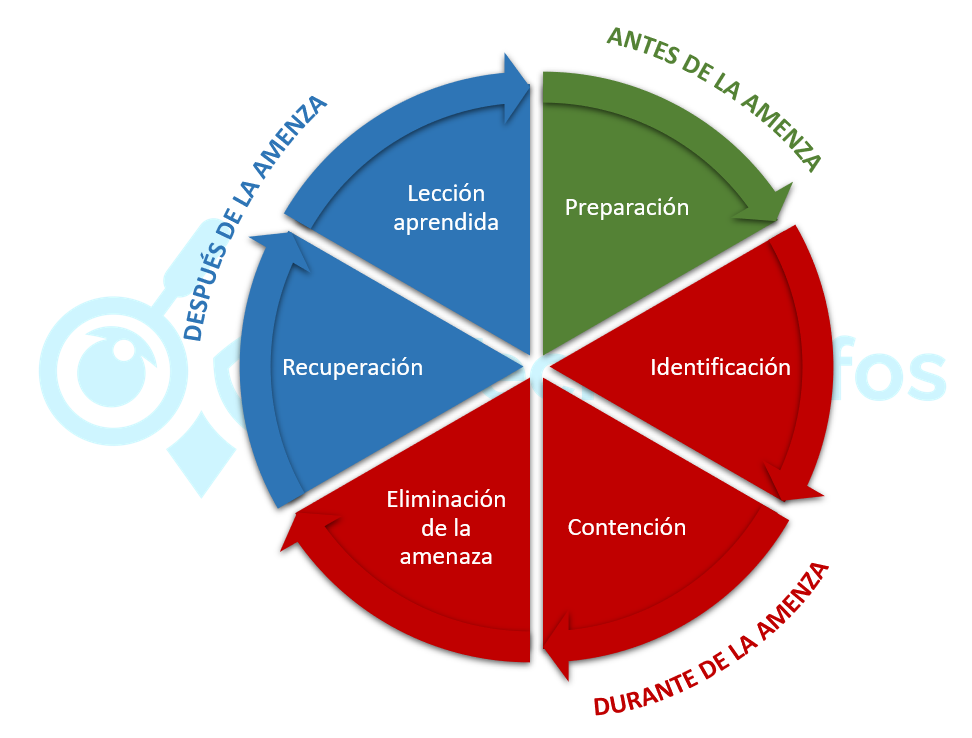

# U2.4.1 - Documentación de incidentes

---

<!-- .element height="50%" width="50%" -->

Note: Presenta la unidad U2.4.1 sobre cómo documentar incidentes: qué registrar,
por qué es crítico y cómo usar esa documentación para mejorar la seguridad.

---

## Índice

* 1. Introducción
* 2. Gestión de incidentes: marco general
* 3. Por qué documentar es estratégico
* 4. Qué documentar en un incidente
* 5. Seguimiento y lecciones aprendidas
* 6. Cómo documentar: informes técnicos
* 7. Bibliografía
* 8. Actividad práctica y recursos

Note: Explica el recorrido: contexto y ciclo de vida; valor de documentar; lista
de qué registrar; seguimiento, aprendizaje y una actividad final.

---

## 1. Introducción

Note: Enlaza con el RA 2 (CE 2.e): clasificar, valorar, documentar y hacer
seguimiento de incidentes dentro de una organización.

### 1. Introducción I

* CE 2.e (RA 2): clasificar, valorar, documentar y dar seguimiento
* Ya sabemos: taxonomía, detección (SIEM/IDS) e investigación (OSINT)
* Ahora: convertir la gestión en un proceso profesional y repetible

Note: Recalca que detectar es solo el inicio. Lo que diferencia a un profesional
es registrar bien qué ocurrió, qué hicimos y qué aprendimos, para mejorar.

### 1. Introducción II

<!-- .element height="55%" width="55%" -->

Note: Usa la imagen para introducir la idea de documentación como pieza central:
sin documentación no hay trazabilidad, ni aprendizaje, ni mejora continua.

---

## 2. La gestión de incidentes: marco general

Note: La documentación no es una tarea aislada. Forma parte de la gestión de
incidentes y atraviesa todo su ciclo de vida.

### 2. La gestión de incidentes: marco general

* Documentar es parte de un proceso estructurado: la gestión de incidentes
* Objetivo: responder bien y aprender para reducir futuros impactos
* La documentación guía y justifica decisiones durante la respuesta

Note: Sitúa la documentación dentro del marco general: no es burocracia, es una
herramienta operativa y estratégica que soporta la respuesta y el aprendizaje.

### 2.1. ¿Qué es un incidente de seguridad? I

* Suceso que afecta a CIA: confidencialidad, integridad o disponibilidad
* Ejemplos: acceso no autorizado, fuga de datos, destrucción de info
* Ejemplos: modificación indebida o interrupción de servicios críticos

Note: Define incidente de seguridad usando la triada CIA y pon ejemplos típicos.

### 2.1. ¿Qué es un incidente de seguridad? II

* Un incidente no es una incidencia (ITIL): no todo fallo compromete seguridad
* Incidente: impacto negativo real o potencial en seguridad de la información
* Incidencia: interrupción o degradación de un servicio (puede no ser seguridad)

Note: Aclara la diferencia con ITIL. Una caída por mantenimiento es incidencia;
si hay explotación o fuga de datos, hablamos de incidente de seguridad.

### 2.2. ¿Qué es la gestión de incidentes?

* Plan de acción estructurado para atender, resolver y aprender
* Atender: organizar la respuesta y coordinar equipos
* Resolver: minimizar el impacto y restaurar operación
* Medir: calidad del sistema, tendencias y mejora continua

Note: Insiste en que no es "apagar fuegos". Incluye métricas y aprendizaje para
elevar la madurez de la organización.

### 2.3. El ciclo de vida de un incidente I

* 1) Preparación
* 2) Identificación
* 3) Contención
* 4) Erradicación
* 5) Recuperación
* 6) Lecciones aprendidas

Note: Presenta el ciclo de vida clásico y deja claro que documentar
es transversal en todas las fases, sobre todo en identificación y respuesta.

### 2.3. El ciclo de vida de un incidente II

<!-- .element height="55%" width="55%" -->

Note: Señala los 6 pasos como referencia (SANS). Conecta la idea de que, sin
documentación, la organización repite errores y no mejora defensas.

---

## 3. ¿Por qué es tan importante documentar?

Note: Documentar incidentes no es un trámite. Es una herramienta estratégica que
aporta valor técnico, organizativo, legal y formativo.

### 3. ¿Por qué documentar? I

* La documentación aporta valor en muchas dimensiones a la organización
* Permite aprender, mejorar defensas y justificar decisiones e inversiones
* Facilita comunicación entre técnicos, dirección y legal

Note: Introduce el valor transversal: reglas SIEM, cumplimiento legal y
concienciación interna.

### 3. ¿Por qué documentar? II

<!-- .element height="55%" width="55%" -->

Note: Usa la imagen para resumir beneficios: inteligencia, aprendizaje y ajuste
de controles; sensibilización; legal; y conocimiento del adversario.

### 3.1. Generación de inteligencia de amenazas

* Identifica IOCs: hashes, IPs, dominios, URLs y artefactos
* Extrae TTPs: cómo operan y qué técnicas usan los atacantes
* Mejora detección (SIEM/IDS), anticipa ataques y comparte con CERTs

Note: Define IOC y TTP. Explica que un IOC sin contexto no basta: documentar
permite convertir evidencias en inteligencia reutilizable.

### 3.2. Lecciones aprendidas y mejora continua

* Documenta lo que falló y lo que funcionó durante la respuesta
* Fortalece defensas y optimiza planes y procedimientos
* Evita repetir errores en incidentes similares

Note: Remarca que aprender también es reconocer aciertos y consolidarlos como
mejores prácticas, no solo señalar fallos.

### 3.3. Sistemas de seguridad: análisis y parametrización

* Ajusta firewalls, IDS/IPS, EDR y reglas de correlación del SIEM
* Actualiza políticas basadas en amenazas reales
* Prioriza inversiones con datos y evidencias

Note: Explica que "mejorar seguridad" exige saber exactamente qué pasó y cómo
entraron. Sin datos, las mejoras son intuiciones, no decisiones.

### 3.4. Campañas de sensibilización efectivas

* Casos reales documentados = material didáctico de alto impacto
* Formación dirigida a amenazas y debilidades detectadas
* Evidencias para justificar inversión ante dirección

Note: Casos reales (anonimizados) persuaden más que ejemplos genéricos.

### 3.5. Cumplimiento normativo y legal

* Soporta notificaciones: INCIBE-CERT, AEPD y otros (según el caso)
* Gestiona implicaciones legales y posibles delitos
* Aporta evidencias válidas y demuestra diligencia debida

Note: Explica que la documentación puede acabar en auditoría o en un juzgado.
Debe ser precisa, trazable y cuidando la cadena de custodia.

### 3.6. Conocimiento del adversario

* Identifica si es ataque automático o dirigido y su sofisticación
* Detecta patrones y campañas sostenidas contra la organización
* Permite atribución cuando sea posible (con cautela)

Note: Subraya que atribución no es "adivinar": se basa en evidencias, contexto y
correlación con TTPs, infra y objetivos.

### 3. Principio fundamental

* Un incidente no documentado es una oportunidad perdida
* Una organización que no aprende está condenada a repetir incidentes

Note: Lee la frase clave y conéctala con madurez: documentar es la base del
aprendizaje, y el aprendizaje reduce coste futuro.

---

## 4. ¿Qué debemos documentar?

Note: Vamos a listar la información concreta a registrar, siguiendo referencias
como la Guía Nacional de INCIBE-CERT. La clave: detalle, precisión y estructura.

### 4. ¿Qué debemos documentar? I

* Documentación útil = detallada, precisa y estructurada
* Empieza desde la detección, no al final
* Registra acciones, decisiones y hallazgos en tiempo real

Note: Insiste en el "minuto uno": tu yo del futuro y tus compañeros agradecerán
una timeline completa y decisiones justificadas.

### 4.1. Información general del incidente I

* Asunto: descripción breve y única del incidente
* Ejemplos: ransomware en PROD-FS-01, phishing a contabilidad
* OSE/PSD: operador o proveedor (si aplica por normativa)
* Afectado: organización o particular, identificado de forma completa

Note: Explica que el asunto es el "identificador humano". OSE/PSD aplica en
contexto NIS. La identificación evita ambigüedades en informes y tickets.

### 4.1. Información general del incidente II

* Sector estratégico (si aplica): energía, transporte, sanidad, etc.
* Fechas y horas clave con máxima precisión posible
* Hora del incidente (real) y hora de detección (cuando nos dimos cuenta)
* Diferencia = dwell time: tiempo del atacante sin ser detectado

Note: Explica dwell time como métrica de madurez. Puede requerir forense para
determinar la hora real del inicio del incidente.

### 4.1. Información general del incidente III

* Descripción detallada y cronológica de lo observado
* Cómo se detectó: alerta SIEM, usuario, hunting, análisis proactivo
* Sistemas afectados y alcance conocido en cada momento

Note: Recalca que la narración debe ser cronológica. Lo que "sabíamos entonces"
es importante para justificar decisiones durante la respuesta.

### 4.1. Información general del incidente IV

* Origen (conocido o sospechado): adjunto malicioso o USB infectado
* Origen: web comprometida o credenciales comprometidas
* Origen: explotación de vulnerabilidad (conocida o 0-day)
* Origen: fuerza bruta exitosa u otros vectores

Note: Explica que el origen puede ser hipótesis inicialmente. Se marca como
confirmado cuando hay evidencias suficientes.

### 4.2. Clasificación y valoración I

* Taxonomía (INCIBE): clasifica según la taxonomía estándar
* Ejemplos: contenido abusivo, código dañino y recopilación de información
* Ejemplos: intento de intrusión e intrusión (compromiso real)

Note: Recuerda que clasificar bien permite comparar incidentes y priorizar
recursos. Conecta con la taxonomía vista en 2.1.1.

### 4.2. Clasificación y valoración II

* Categorías: disponibilidad (DoS/DDoS) y seguridad de la información
* Categorías: fraude, vulnerable y otros
* Impacto transfronterizo: afecta a otros estados UE (si aplica)

Note: Explica que algunas categorías son "comportamiento" (fraude) y otras son
estado de exposición (vulnerable). No olvides impacto transfronterizo en NIS.

### 4.2. Clasificación y valoración III

* Peligrosidad: capacidad potencial de causar daño (la amenaza en sí)
* Impacto: daño real o potencial en la organización (consecuencias)
* Niveles (guía INCIBE): crítico, alto, medio, bajo

Note: Aclara la diferencia: peligrosidad describe al ataque; impacto describe a
tu organización y lo que ha sufrido o podría sufrir.

### 4.2. Clasificación y valoración IV

* Ejemplo 1: ransomware sofisticado aislado en pruebas = impacto bajo
* Ejemplo 2: phishing simple al CEO con fraude = impacto crítico
* No confundas peligrosidad alta con impacto alto de forma automática

Note: Usa los ejemplos para fijar el concepto. La valoración guía prioridades y
comunicación a dirección, legal y autoridades.

### 4.3. Detalles técnicos I

* Recursos afectados: inventario detallado de activos comprometidos
* IPs internas y públicas, hostnames y FQDN
* SO y versiones, aplicaciones y versiones, servicios interrumpidos
* BBDD comprometidas u otros activos relevantes

Note: Explica que sin inventario no puedes contener ni erradicar. El detalle
ayuda a buscar IOCs y a hacer hunting en el resto de la red.

### 4.3. Detalles técnicos II

* IOCs: hashes (MD5/SHA1/SHA256) y nombres de ficheros
* IOCs: dominios, IPs C2, URLs de phishing o descarga
* IOCs: claves de registro, procesos y patrones característicos

Note: Recuerda que un IOC debe ser accionable: se usa para búsquedas en SIEM/EDR
y para reglas de bloqueo o detección.

### 4.3. Detalles técnicos III

* IoAs: tácticas y técnicas usadas (no solo artefactos)
* Mapea con MITRE ATT&CK (TTPs) cuando sea posible
* Ejemplos: T1566.001 (phishing adjunto) y T1486 (cifrado)

Note: Diferencia IOC (qué vemos) e IoA (qué hace). MITRE ayuda a normalizar y
comparar comportamientos entre incidentes.

### 4.4. Gestión y respuesta I

* Plan de acción y contramedidas con hora y detalle
* Ejemplos: aislar servidor, bloquear IPs, capturar memoria RAM
* Ejemplos: desplegar reglas YARA y restaurar desde backup verificado

Note: Explica que la respuesta debe ser trazable. Los ejemplos muestran el nivel
de detalle esperado en acciones y tiempos.

### 4.4. Gestión y respuesta II

* Herramientas usadas: SIEM, EDR y herramientas forenses
* Forense: FTK, Autopsy, Volatility, Wireshark (según necesidad)
* Sandboxes: Cuckoo, Any.Run, Joe Sandbox (análisis de malware)

Note: No se trata de listar por listar: documenta qué herramienta se usó, para
qué, con qué versión si es relevante y qué resultado produjo.

### 4.4. Gestión y respuesta III

* Colaboraciones internas: sistemas, redes, legal, comunicación
* Colaboraciones externas: INCIBE-CERT, fabricantes, proveedores
* Ejemplo: apoyo de threat intelligence para análisis del malware

Note: Explica que colaboración afecta tiempos y decisiones. Documentarlo ayuda a
mejorar coordinaciones futuras y responsabilidades.

### 4.4. Gestión y respuesta IV

* Timeline de acciones: fecha/hora, quién, acción y resultado
* La timeline es fundamental para el análisis post-incidente
* También ayuda a detectar cuellos de botella y dependencias críticas

Note: Remarca que una timeline bien hecha permite entender el incidente en pocos
minutos y es base de lecciones aprendidas.

### 4.4. Gestión y respuesta V

* Recursos consumidos: jornadas-persona, horas extra, ayuda externa
* Ejemplo: 5 JP SOC y 2 JP sistemas (más guardias o fines de semana)
* Útil para estimar coste real y justificar mejoras o refuerzos

Note: Explica que el coste de respuesta es parte del impacto. Medirlo permite
decidir inversiones (EDR, SOAR, formación, segmentación, etc.).

### 4.5. Consecuencias y análisis post-incidente I

* Afectación: empresa, clientes, empleados y terceros
* Incluye servicios interrumpidos y datos expuestos (si aplica)
* Considera también proveedores y partners afectados

Note: Afectación no es solo "qué sistema". Es quién sufre consecuencias y quién
necesita información o acciones posteriores.

### 4.5. Consecuencias y análisis post-incidente II

* Impacto económico: costes directos e indirectos
* Directos: horas del equipo, externos, reparación, notificación
* Indirectos: pérdida negocio, multas, reputación, seguros

Note: Explica que muchas veces el coste indirecto supera al directo. Si no se
conoce, se estima y se justifica con supuestos claros.

### 4.5. Consecuencias y análisis post-incidente III

* Extensión geográfica: local, autonómica, nacional o supranacional
* Daño reputacional: medios, redes sociales, confianza, cotización
* Este análisis guía comunicación y decisiones de continuidad

Note: Conecta con el plan de comunicación y con la necesidad de gestionar el
mensaje. La reputación puede ser un impacto crítico.

### 4.5. Consecuencias y análisis post-incidente IV

* Regulación afectada: ENS, RGPD y NIS (o Ley PIC)
* Otras sectoriales: PCI-DSS, HIPAA u otras aplicables
* Define obligaciones y plazos de notificación

Note: Explica que la regulación depende del sector y del tipo de datos. Legal
debe validar obligaciones y comunicaciones.

### 4.5. Consecuencias y análisis post-incidente V

* FFCCSE: denuncia, investigación judicial, intervención (si procede)
* Adjuntos/evidencias: capturas, logs sanitizados, correos y malware seguro
* Adjuntos: informes forenses y comunicaciones con autoridades y afectados

Note: Enfatiza que evidencias deben manejarse con cuidado (legal y forense).
Sanitizar logs protege datos sensibles sin perder valor probatorio.

### 4. Máxima fundamental

* Si dudas de la legalidad de una acción, consulta a legal antes de actuar
* Mejor perder tiempo que perder evidencias o asumir responsabilidades

Note: Lee la máxima. Conecta con cadena de custodia, privacidad y posibles
implicaciones penales o regulatorias.

---

## 5. Seguimiento de incidentes: más allá de la resolución

Note: Resolver técnicamente no cierra el trabajo. El seguimiento verifica que el
incidente está erradicado y captura aprendizaje para mejorar.

### 5. Seguimiento de incidentes I

* El trabajo no termina cuando "parece resuelto"
* Objetivo 1: confirmar eficacia de medidas y resolución real
* Objetivo 2: evitar recurrencia (backdoors, persistencia, reinfección)
* Objetivo 3: aprender y mejorar defensas y procesos

Note: Presenta los tres objetivos. El seguimiento cierra el ciclo de vida del
incidente y reduce la probabilidad de repetición.

### 5.1. Seguimiento durante la resolución

* Mantén visibilidad del estado para todas las partes interesadas
* Actualiza el estado de forma continua y consistente
* Evita "doble verdad": una versión para técnicos y otra para dirección

Note: Explica que la misma base de información alimenta standups, informes a
dirección y decisiones operativas. Consistencia evita caos.

### 5.1.1. Información de estado a mantener I

* Estado actual: identificación, contención, erradicación, recuperación
* Acciones pendientes: lista priorizada de tareas por realizar
* Ejemplo: forense en PROD-DB-02, cambio de credenciales, parcheo masivo

Note: Da ejemplos de acciones pendientes. Explica que priorizar reduce riesgos y
facilita coordinación entre equipos.

### 5.1.1. Información de estado a mantener II

* Responsables asignados por tarea (SOC, sistemas, infraestructura)
* Tiempos estimados: ETR por tarea y ETA para hitos críticos
* Bloqueos: aprobaciones, dependencias o espera de fabricante

Note: Explica que los bloqueos deben hacerse visibles. Sin esto, se "pierde"
tiempo sin que nadie entienda por qué no avanzamos.

### 5.1.2. Comunicación continua

* Interna: standups, informes a dirección y coordinación entre equipos
* Externa: clientes afectados, autoridades (INCIBE-CERT) y medios (comunicación)
* Frecuencia y formato dependen de la criticidad del incidente

Note: Insiste en definir canales y responsables. Evita filtraciones o mensajes
contradictorios en incidentes públicos.

### 5.1. Herramientas de seguimiento

* Un sistema de ticketing es clave para seguimiento efectivo
* Ejemplos: Jira, ServiceNow, OTRS y TheHive (IR)
* SOAR: Splunk SOAR, Cortex XSOAR (automatización)
* Alternativa simple: issues de GitHub/GitLab para equipos pequeños

Note: Explica que el ticketing centraliza timeline, asignaciones, evidencias y
decisiones. Sin herramienta, se pierde trazabilidad.

### 5.2. Seguimiento post-resolución

* Tras la resolución técnica: verificar y cerrar formalmente
* Verificar: erradicación completa, no solo ausencia de síntomas
* Cerrar: informe final, lecciones, mejoras y notificaciones

Note: Explica que post-resolución es la fase que evita recaídas y formaliza el
cierre con evidencias y aprendizaje.

### 5.2.1. Verificación de la resolución

* Confirmar que la amenaza está erradicada por completo
* Barrer red, validar IOCs y comprobar funcionamiento con usuarios
* Aumenta temporalmente monitorización y reduce gradualmente

Note: Aclara que la verificación suele durar días o semanas según criticidad.

### 5.2.1.1. Monitorización intensiva post-incidente

* Incrementa monitorización en sistemas afectados
* Duración: mínimo 72h; ideal 1-2 semanas
* Busca IOCs, anomalías, comunicaciones C2 y creación de cuentas sospechosas

Note: Explica qué es C2 y por qué es clave. Subraya que esta fase detecta
persistencia y reintentos del atacante.

### 5.2.1.2. Verificación de IOCs

* Barridos completos con IOCs: hashes, IPs/dominios y patrones
* Usa EDR para endpoints y SIEM para logs históricos
* Monitorización de red para detectar tráfico sospechoso

Note: Explica que la verificación debe ser amplia: no solo máquinas afectadas,
también "vecinos" de red y segmentos relacionados.

### 5.2.1.3. Validación con usuarios

* Confirma con usuarios que los sistemas funcionan correctamente
* Verifica ausencia de: anomalías, pérdida de datos, degradación y fallos acceso
* Documenta incidencias residuales y su resolución

Note: El usuario final detecta síntomas que no salen en logs: lentitud, errores
de aplicación o datos faltantes.

### 5.2.2. Cierre formal del incidente

* Criterios: erradicación verificada y sistemas recuperados
* Criterios: informe final, lecciones aprendidas y mejoras planificadas
* Criterios: notificaciones obligatorias realizadas (si aplican)
* En ticketing: fecha/hora, responsable, verificación y enlaces a entregables

Note: Recalca que cerrar sin verificación crea una falsa sensación de seguridad.
El cierre formal deja trazabilidad y responsabilidades claras.

### 5.3. Lecciones aprendidas: el verdadero valor

* Cada incidente es una oportunidad de aprendizaje y mejora
* Captura aciertos, fallos y acciones para elevar madurez
* Sin lecciones aprendidas, el incidente se repetirá con mayor coste

Note: Enfatiza que esta fase es la más valiosa. Sin ella, la organización
reacciona una y otra vez, sin evolucionar.

### 5.3.1. Estructura del análisis de lecciones aprendidas

* Tres bloques: qué salió bien, qué salió mal y qué mejorar
* Objetivo: reforzar fortalezas, identificar debilidades y planificar acciones
* Enfoque: procesos y sistemas, no buscar culpables

Note: Explica que el análisis debe ser accionable. No sirve "nos fue mal", sino
"por qué" y "qué cambiamos" con responsable y plazo.

### 5.3.1.1. ¿Qué salió bien?

* Aciertos: detección temprana, respuesta coordinada y procedimientos efectivos
* Aciertos: herramientas útiles y buena comunicación
* Aciertos: colaboraciones exitosas con terceros

Note: Da el ejemplo de la regla SIEM SP-032: detectar rápido y mantener la regla
como modelo para otras. Documentar aciertos crea mejores prácticas.

### 5.3.1.2. ¿Qué salió mal?

* Fallos: retrasos de detección o respuesta (y causas)
* Fallos: procedimientos inexistentes o que no funcionaron
* Fallos: falta de herramientas, coordinación o dependencias críticas
* Errores humanos: analizar sin culpar, mejorar el proceso

Note: Usa el ejemplo: tardar 2h en aprobar aislamiento permitió propagación.
Aprendizaje: definir escalado nocturno y decisiones 24/7.

### 5.3.1.3. Mejoras (A): Prevención

* Parcheo: automatizar y actualizar software crítico
* Configuración: MFA admin, segmentación y refuerzo WAF
* Formación: campañas anti-phishing y formación técnica SOC
* Políticas: contraseñas y gestión de vulnerabilidades (48h críticas)

Note: Explica que prevención reduce probabilidad. Segmentación y MFA son medidas
con impacto alto. Las políticas deben ser realistas y medibles.

### 5.3.1.3. Mejoras (B): Detección

* Alertas SIEM: escaneo interno, uso de herramientas (mimikatz, psexec)
* Threat intel: feeds (INCIBE/CCN) e integración en EDR
* Monitorización: sensores de red y log forwarding a SIEM

Note: Explica que detección reduce dwell time. Integrar threat intel permite
enriquecer alertas y priorizar eventos con contexto.

### 5.3.1.3. Mejoras (C): Respuesta

* Playbooks/runbooks: ransomware y escalado 24/7 con árbol de decisión
* Comunicación: canal dedicado y plantillas para audiencias
* Herramientas: forense automatizado y servicio IR retainer
* Capacidades: ampliar SOC y MDR/EDR gestionado si aplica

Note: Explica que respuesta reduce impacto. Playbooks aceleran acciones bajo
presión. Plantillas evitan errores de comunicación en crisis.

### 5.3.2. Sesión de post-mortem o retrospectiva

* Reunión dedicada para analizar el incidente con el equipo involucrado
* Objetivo: discutir aciertos, fallos y acordar plan de mejora
* Debe quedar documentada con notas y acciones

Note: Explica que es el método más efectivo para capturar aprendizaje: junta a
quienes participaron y estructura la conversación.

### 5.3.2.1. Organización de la sesión

* Cuándo: 1-2 semanas tras el cierre (fresco pero con perspectiva)
* Duración: 1-2 horas según criticidad
* Participantes: respuesta, responsables de sistemas y dirección
* Facilitador neutral: CISO o consultor externo (si procede)

Note: Recalca la importancia del facilitador neutral para evitar culpabilizar y
centrarse en acciones de mejora.

### 5.3.2.2. Reglas fundamentales

* Sin culpables: enfoque en procesos y sistemas
* Confianza: lo discutido se usa para mejoras, no para señalar
* Basado en hechos: datos, evidencias y timeline
* Accionable y documentado: problemas -> acciones con responsables

Note: Estas reglas evitan defensividad. Sin confianza no hay análisis
honesto; sin acciones, no hay mejora.

### 5.3.2.3. Agenda típica I

* 1) Cronología del incidente: reconstruir timeline y decisiones
* 2) Qué salió bien: aciertos y mejores prácticas a mantener
* 3) Qué salió mal: problemas y análisis de causa raíz

Note: Empezar por timeline alinea a todos. Luego aciertos y fallos se discuten
con la misma evidencia.

### 5.3.2.3. Agenda típica II

* 4) Qué mejorar: brainstorming y priorización (crítico/alto/medio/bajo)
* 5) Cierre: resumen de acciones, responsables, plazos y agradecimientos
* Técnica útil: "5 porqués" para llegar a causa raíz

Note: La agenda termina con compromisos concretos. Introduce 5 porqués como
herramienta práctica para ir más allá del síntoma.

### 5.3.2. Técnica de los 5 porqués I

* Problema: "El ransomware cifró 50 servidores"
* Por qué: propagación lateral por la red
* Por qué: mismo segmento sin restricciones
* Por qué: sin segmentación implementada

Note: Cada "por qué" debe basarse en evidencia. Evita la respuesta superficial y
encuentra la causa que se puede corregir.

### 5.3.2. Técnica de los 5 porqués II

* Por qué: no se priorizó en el presupuesto de seguridad
* Por qué: no se demostró el riesgo con datos concretos
* Acción: elaborar análisis de riesgos para justificar segmentación de red

Note: Cierra el ejemplo mostrando que el resultado debe ser una acción concreta
que cambia la organización, no solo una conclusión teórica.

### 5.3.3. Actualización de documentación y sistemas

* Las lecciones aprendidas deben materializarse en cambios tangibles
* Actualiza políticas, procedimientos, detección y formación interna
* Documenta cambios y enlázalos al incidente que los motivó

Note: El aprendizaje se convierte en controles. Si no se cambia nada, la
retrospectiva se queda en charla y no mejora la seguridad.

### 5.3.3.1. Actualización de políticas de seguridad

* Revisa Política de Seguridad de la Información y controles derivados
* Actualiza políticas específicas: accesos, backups, etc.
* Asegura que reflejan nuevos controles implementados

Note: Explica que las políticas deben "bajar a tierra": si se exige MFA, debe
estar escrito y aplicado con alcance y excepciones claras.

### 5.3.3.2. Playbooks y runbooks

* Playbooks: qué hacer ante cada tipo de incidente (crear o actualizar)
* Runbooks: cómo ejecutar tareas específicas con pasos técnicos
* Ejemplos: aislamiento Windows y captura RAM para forense

Note: Diferencia playbook (estrategia) y runbook (procedimiento técnico). Ambos
aceleran respuesta bajo presión.

### 5.3.3.3. Casos de uso nuevos en el SIEM

* Implementa reglas de detección nuevas identificadas
* Ajusta umbrales que generaron falsos positivos o negativos
* Documenta cada regla con referencia al incidente origen

Note: Explica que si no se documenta, se olvida por qué existe la regla y se
rompe con cambios futuros. El contexto es parte del mantenimiento.

### 5.3.3.4. Formación y concienciación

* Crea casos prácticos basados en el incidente (anonimizados)
* Actualiza el programa de concienciación con lecciones aprendidas
* Usa vídeos o presentaciones internas para formación continua

Note: Explica que la formación basada en incidentes reales es más efectiva y
conecta con el trabajo diario del personal.

### 5.3.3.5. Planes de respuesta y continuidad

* Actualiza Plan de Respuesta a Incidentes corporativo
* Actualiza BCP (continuidad) y DRP (recuperación) si aplica
* Refuerza roles, escalado, tiempos y responsabilidades

Note: Explica que incidentes descubren puntos débiles de continuidad. Actualizar
planes reduce impacto de futuras crisis.

### 5.3.4. Seguimiento de mejoras implementadas

* Registro de acciones: mejora, responsable, plazo y estado
* Revisiones periódicas: mensuales o trimestrales
* Métricas: MTTD, MTTR, recurrencia y % mejoras implementadas

Note: Identificar mejoras no sirve si no se ejecutan. Métricas ayudan a ver
avance real y a justificar recursos.

### 5. Frase para recordar

* Cada incidente es inversión en el futuro, si aprendemos de él
* Si no aprendemos, repetimos incidentes con mayor coste

Note: Lee la frase y conéctala con el retorno: aprendizaje reduce impacto
y también reduce tiempo de respuesta y coste total a medio plazo.

### 5. Indicador de madurez

* Madurez no es "cero incidentes": eso es imposible
* Madurez es detectar rápido, responder bien y aprender siempre
* Disciplina: documentar, cerrar, mejorar y verificar resultados

Note: Explica que este indicador resume la madurez real. La documentación y el
seguimiento son los signos más claros de profesionalidad.

---

## 6. ¿Cómo documentar un incidente? El arte de escribir informes técnicos

Note: Ya sabemos contexto, por qué, qué y cuándo. Ahora toca el cómo: plasmar la
información en un informe claro, útil y profesional.

### 6. ¿Cómo documentar? I

* Hemos cubierto: contexto (gestión), motivación (valor), qué y cuándo
* Ahora: cómo convertir datos en un informe que se entienda y se use
* Un buen informe cuenta una historia con evidencias y estructura

Note: Introduce el paso de "lista de datos" a "narración estructurada". La
calidad del informe afecta decisiones, cumplimiento y aprendizaje.

### 6.1. La importancia de saber comunicar

* Audiencias distintas: técnicos, dirección, legal y auditoría
* Información recuperable y reutilizable para incidentes futuros
* Cumplimiento legal y soporte a decisiones basadas en datos

Note: Explica que comunicar bien no es simplificar en exceso: es adaptar el
mensaje, separar anexos y dejar trazabilidad.

### 6.2. Enlace con la guía de redacción (2.4.2)

* 2.4.1 te dice QUÉ documentar de un incidente
* 2.4.2 te enseña CÓMO escribirlo profesionalmente
* Incluye: estrategia, estructura, redacción y plantillas

Note: Recomienda revisar la guía 2.4.2. Explica que ambas piezas son necesarias:
sin qué no hay contenido; sin cómo no hay impacto ni claridad.

---

## 7. Bibliografía

Note: Recursos para profundizar: guías oficiales, estándares y referencias sobre
evidencias y gestión de incidentes.

### 7.1. Guías nacionales (INCIBE-CERT)

* Guía Nacional de Notificación y Gestión de Ciberincidentes
* Incluye: taxonomía, notificación, peligrosidad e impacto
* Guía de gestión para sector privado: plantillas y casos de uso

Note: En la bibliografía del documento están los enlaces. Recomienda usar la
guía como checklist para completar documentación e informes.

### 7.2. Marcos y estándares internacionales

* NIST SP 800-61: referencia para manejo de incidentes
* ISO/IEC 27035: gestión de incidentes de seguridad
* Útiles para alinear procesos con buenas prácticas

Note: Explica que estos estándares son base para auditorías y para diseñar
procedimientos consistentes en organizaciones.

### 7.3. Forense y evidencias

* RFC 3227: recogida y archivo de evidencias
* ENISA: recursos y publicaciones sobre gestión de incidentes
* Útil para asegurar validez y trazabilidad de evidencias

Note: Conecta con la máxima legal: evidencias mal recogidas pueden no servir.

---

## 8. Actividad práctica y recursos

Note: Actividad para aplicar lo aprendido: documentar un incidente real o
simulado con estructura completa, valoración y lecciones aprendidas.

### 8.1. Actividad práctica: documentación completa

* Objetivo: aplicar todo el proceso de documentación de un incidente
* Incidente: real (noticia) o simulado por el profesor
* Entregable: informe con secciones, valoración y mejora propuesta

Note: Explica que el objetivo es practicar el "qué" y el "cómo": estructura,
claridad y justificación de valoración y acciones.

### 8.1.1. Descripción de la actividad I

* 1) Selección del incidente: opción A (real) u opción B (simulado)
* Opción A: recopila info en noticias, blogs, informes y CERT
* Opción B: usa el escenario proporcionado en clase

Note: Remarca que, en incidentes reales, faltará información. Eso no es fallo:
se documenta como "no disponible en fuentes abiertas".

### 8.1.1. Descripción de la actividad II

* 2) Investigación: recopila info y notas por secciones del documento
* 3) Elaboración: sigue la estructura vista en la sección 4
* No inventes: marca la información ausente de forma explícita

Note: El alumnado debe construir el informe con rigor: separar hechos de
hipótesis y citar siempre fuentes.

### 8.1.1. Descripción de la actividad III

* Incluye: info general (4.1) y clasificación/valoración (4.2)
* Incluye: detalles técnicos (4.3) y gestión/respuesta (4.4)
* Incluye: consecuencias (4.5) y lecciones aprendidas (5.3)

Note: Explica que la estructura debe cubrir todas las secciones requeridas. Las
lecciones pueden ser simuladas pero deben ser realistas y accionables.

### 8.1.2. Formato del entregable

* Formato: PDF
* Extensión: 6-8 páginas (sin anexos)
* Estructura: portada, índice, contenido y anexos opcionales
* Estilo: profesional, siguiendo recomendaciones de la guía 2.4.2

Note: Insiste en claridad y concisión. Los anexos se usan para capturas, IOCs y
referencias sin saturar el cuerpo principal.

### 8.1.3. Criterios de evaluación

* Completitud de la documentación: 40%
* Clasificación INCIBE correcta: 15%
* Valoración justificada (peligrosidad/impacto): 15%
* Aspectos legales identificados: 10%
* Lecciones aprendidas y redacción: 20%

Note: Explica cada criterio: completitud = secciones con contenido relevante;
valoración = argumentos; legal = obligaciones; lecciones = mejoras realistas.

### 8.1.4. Consejos para realizar la actividad

* Lee primero todo el documento y crea una plantilla con secciones vacías
* No inventes: usa "no disponible en fuentes abiertas" cuando aplique
* Sé crítico en lecciones aprendidas y cita fuentes fidedignas
* Apóyate en la guía 2.4.2 para redacción profesional

Note: Remarca el enfoque profesional: rigor, citas, claridad y propuestas
accionables. Lo importante no es "tener todo", sino documentar bien.

### 8.1. Ejemplos de incidentes recientes

* Ransomware al SEPE (2021)
* Fuga de datos de Meta/Facebook (2021-2023)
* Log4Shell y explotación masiva (2021)
* Ataques a hospitales (COVID-19) e infraestructuras críticas

Note: Son ejemplos para elegir y analizar. Selecciona uno con información
suficiente y varias fuentes disponibles.

### 8.2. Recursos adicionales I

* Ticketing: TheHive Project y RTIR
* Plantillas: NIST SP 800-61 e INCIBE-CERT
* Frameworks: MITRE ATT&CK, Kill Chain y Diamond Model

Note: Explica para qué sirve cada recurso: ticketing para seguimiento y
plantillas para estructura; frameworks para análisis y comunicación técnica.

### 8.2. Recursos adicionales II

* INCIBE-CERT y CCN-CERT: alertas, avisos y boletines
* Comunidades: netsec/cybersecurity, Honeynet Project, OWASP
* Mantén aprendizaje continuo: herramientas y amenazas cambian

Note: Subraya la importancia del aprendizaje continuo. Las fuentes oficiales y
comunidades ayudan a estar al día y mejorar criterio.

### 8. Conclusión del documento

* Entiendes por qué documentar es crítico y qué información registrar
* Sabes cómo hacer seguimiento y convertir incidentes en mejoras
* Recuerda: documentar bien = lección aprendida; documentar mal = pérdida

Note: Cierra con el mensaje final: la diferencia entre una organización madura y
una reactiva se ve en cómo documenta, aprende e implementa mejoras.
