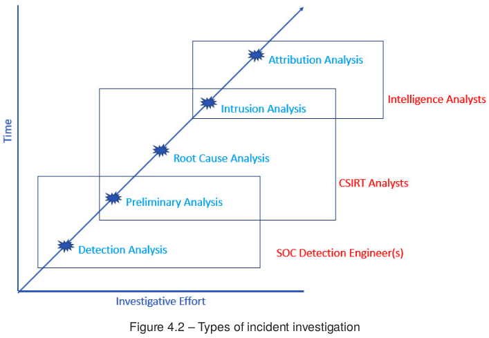
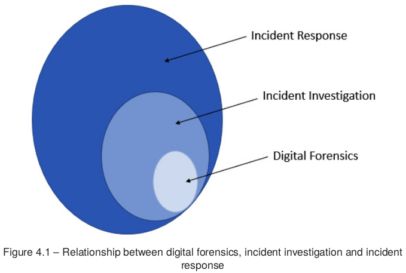
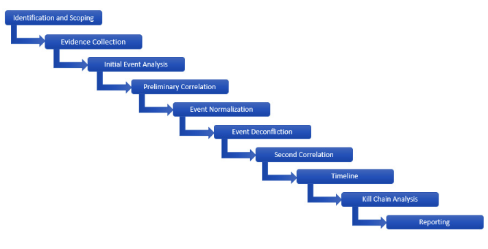
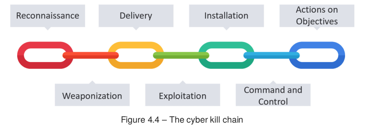

# IS-U3.3.2 - Investigación de incidentes

Note: En esta presentación vamos a trabajar la **investigación de incidentes** como un proceso ordenado. La idea clave es que un incidente no se entiende por intuición, sino mediante **hipótesis**, **evidencias** y una explicación técnica coherente.

---

 <!-- .element height="50%" width="50%" -->

Note: Antes de empezar, situad esta sesión dentro de la unidad de **investigación de incidentes**. Lo que vamos a ver aquí conecta directamente con el trabajo real de un **CSIRT** o de un equipo técnico que necesita entender qué ha pasado y justificar sus decisiones.

---

## Índice

Note: Primero veremos para qué sirve una **investigación de incidentes** y qué tipos de análisis existen. Después estudiaremos la **metodología forense**, los modelos de **Cyber Kill Chain** y **diamante**, y terminaremos con un caso guiado de **phishing**.

### Índice I

- 1. Objetivo real de una investigación
- 2. Tipos de análisis de incidentes
- 3. Metodología funcional forense
- 4. Hipótesis, evidencias y correlación

Note: En esta primera parte vamos a centrarnos en el **método**. Quiero que os quedéis con que investigar no es mirar logs sin rumbo, sino avanzar con una **pregunta clara**, reunir **evidencias** y relacionar hechos hasta sostener o descartar una hipótesis.

### Índice II

- 5. Cyber Kill Chain
- 6. Modelo de diamante
- 7. Caso guiado de phishing
- 8. Ideas clave para estudio

Note: En la segunda parte añadiremos **contexto analítico**. La **cadena de ciberataque** nos ayuda a ubicar la fase del ataque, y el **modelo de diamante** nos ayuda a relacionar **adversario**, **capacidad**, **infraestructura** y **víctima**.

---

## 3.3.2. Investigación de incidentes de ciberseguridad

Note: Abrimos el punto 3.3.2 de la unidad. La pregunta central es sencilla: cómo pasamos de una **alerta** a una explicación fiable sobre **qué ha pasado**, **cómo ha pasado**, **qué alcance tiene** y **qué debemos cambiar** para reducir el riesgo futuro.

### Contexto y objetivo de la unidad

- Una alerta no explica por sí sola un incidente
- Hay que delimitar alcance, causa e impacto
- La investigación orienta contención y erradicación
- Meta: explicar el caso con evidencias verificables

Note: El objetivo de esta parte no es solo detectar algo raro, sino **entenderlo**. Una investigación útil sirve para decidir mejor la **contención**, apoyar la **erradicación** y dejar una explicación técnica que la organización pueda usar después.

### RA3 y criterio asociado

- RA3: investigar incidentes de ciberseguridad
- CE 3.c: realizar la investigación del incidente
- Enfoque: método, evidencias y explicación técnica
- Resultado esperado: conclusiones accionables

Note: Este contenido está alineado con el **RA3** y, en concreto, con el criterio **3.c**. No basta con decir que "algo ha ocurrido"; el alumnado debe ser capaz de **investigar**, sostener conclusiones con **evidencias** y proponer medidas útiles para la respuesta.

---

## 1. Para qué sirve investigar un incidente

Note: Aquí quiero romper una idea equivocada muy común: investigar no es buscar "el fichero malo" y ya está. Investigar sirve para reconstruir el caso, entender la **causa raíz** y convertir datos dispersos en una explicación que permita actuar.

### Finalidades reales de la investigación

- Delimitar el alcance del incidente
- Identificar la causa raíz o vía de entrada
- Reconstruir la secuencia completa de hechos
- Extraer indicadores y TTP útiles
- Documentar conclusiones y recomendaciones

Note: Fijaos en estas finalidades porque resumen el valor de la investigación. Queremos saber **hasta dónde llega** el incidente, **por dónde empezó**, qué **secuencia** siguió el atacante y qué **indicadores** podemos reutilizar para buscar más casos y mejorar la defensa.

### Idea clave: investigar orienta la respuesta

- No es una tarea aislada
- Ayuda a priorizar la contención
- Justifica decisiones técnicas
- Reduce improvisación y ruido

Note: La idea importante de esta diapositiva es que la **investigación** no va por un lado y la **respuesta** por otro. Cuanto mejor entendemos el incidente, mejor decidimos qué aislar, qué bloquear, qué preservar y qué corregir.

---

## 2. Tipos de análisis de investigación

Note: No todas las investigaciones tienen la misma profundidad. El tipo de análisis depende del **impacto**, del **tiempo disponible**, de la **evidencia** y de los **recursos** del equipo.

### Vista general de niveles de análisis

- Detección: confirmar o descartar la alerta
- Preliminar: obtener alcance e impacto inicial
- Causa raíz: explicar cómo empezó el incidente
- Intrusión: reconstruir la actividad del adversario
- Atribución: vincular con un actor concreto

 <!-- .element: style="max-width: 45%;" -->

Note: Esta clasificación nos muestra cinco niveles habituales. Empezamos por la **detección**, seguimos con una visión **preliminar**, profundizamos en la **causa raíz**, pasamos al análisis completo de **intrusión** y, solo en casos más avanzados, llegamos a la **atribución**.

### Detección y análisis preliminar

- Detección: ¿falso positivo o incidente real?
- Preliminar: visión rápida de alcance e impacto
- Busca ganar tiempo sin trabajar a ciegas
- Permite decidir si hay que escalar y contener

Note: En la práctica, muchas investigaciones empiezan aquí. Primero decidimos si la alerta apunta a un incidente **real**. Después intentamos conseguir una foto rápida del caso para saber si hay **persistencia**, **movimiento lateral** o riesgo de expansión.

### Causa raíz, intrusión y atribución

- Causa raíz: qué permitió el compromiso inicial
- Intrusión: cómo avanzó el adversario por el entorno
- Atribución: qué actor podría estar detrás
- La atribución suele requerir inteligencia avanzada

Note: La **causa raíz** busca la debilidad que hizo posible el incidente. El análisis de **intrusión** ya reconstruye con más detalle la operación del adversario. La **atribución**, en cambio, suele quedar para equipos especializados porque exige mucho contexto e inteligencia de amenazas.

---

## 3. Metodología funcional de informática forense digital

Note: A partir de aquí entramos en el núcleo metodológico. La idea central es que una investigación útil parte de una **hipótesis** y la contrasta con **evidencias**. Si la evidencia no sostiene la hipótesis, la hipótesis cambia.

### Investigar no es "a ver qué sale"

- Se formula una hipótesis inicial
- Se recopilan evidencias relevantes
- Se correlacionan hechos y eventos
- Se confirma o descarta la explicación inicial

Note: Este es el cambio de mentalidad importante. No investigamos "a ver qué aparece", sino para probar una **hipótesis**. Por ejemplo, podemos sospechar de **phishing**, de **credenciales robadas** o de un **servicio expuesto**, pero la conclusión solo llega cuando la evidencia lo confirma.

### Las 10 fases de trabajo

- Identificación y alcance
- Recopilación de evidencia
- Análisis inicial y correlación preliminar
- Normalización, desconflicción y segunda correlación
- Línea temporal, modelos de ataque e informe

 <!-- .element: style="max-width: 55%;" -->

Note: Esta secuencia organiza la investigación completa. Empezamos delimitando el caso, seguimos con la **recopilación**, revisamos y **correlacionamos** eventos, construimos una **línea temporal**, usamos modelos de intrusión y cerramos con un **informe** claro y útil.

### Identificación, alcance y evidencia

- Qué activó la investigación
- Qué activos pueden estar implicados
- Qué datos son más volátiles
- Qué fuentes conviene preservar primero

Note: Las primeras decisiones son críticas. Necesitamos saber **qué ha disparado** la investigación, qué **activos** podrían estar afectados y qué evidencias son más **volátiles**, porque memoria, procesos o ciertos logs pueden desaparecer muy rápido.

### Correlación, normalización y línea temporal

- Unir hechos que por separado dicen poco
- Expresar eventos con lenguaje común
- Eliminar ruido, duplicidades y contradicciones
- Ordenar cronológicamente lo ocurrido

Note: Aquí es donde la investigación gana valor. La **correlación** conecta el correo, el endpoint y la red. La **normalización** permite describir lo visto con un lenguaje común, por ejemplo con **MITRE ATT&CK**, y la **línea temporal** responde qué ocurrió primero y qué vino después.

### El informe no es un trámite final

- Explica qué ocurrió y cómo ocurrió
- Delimita activos afectados e impacto
- Muestra evidencias que sostienen la conclusión
- Propone medidas posteriores

Note: El **informe** no es un papel administrativo. Es la forma de convertir la investigación en una explicación **usable**. Si el informe no deja claras las **evidencias**, el **alcance** y las **medidas recomendadas**, el trabajo queda a medias.

---

## 4. La cadena de ciberataque

Note: La **Cyber Kill Chain** nos ayuda a responder en qué **fase** se encuentra la intrusión. No sustituye a la evidencia, pero sí le da **contexto** para entender mejor el avance del ataque.

### Las siete fases del ataque

- Reconocimiento
- Armamentización
- Entrega
- Explotación
- Instalación
- Mando y control
- Acciones sobre los objetivos

 <!-- .element: style="max-width: 55%;" -->

Note: Estas siete fases representan la secuencia típica de una intrusión. El adversario primero **reconoce**, luego prepara su **capacidad**, la **entrega**, consigue la **explotación**, establece **persistencia**, abre un canal de **mando y control** y finalmente ejecuta sus **objetivos**.

### Qué aporta al analista

- Sitúa cada evidencia dentro de una fase
- Ayuda a decidir qué buscar a continuación
- Permite orientar mejor la respuesta
- Muestra que una intrusión es una secuencia

Note: La utilidad práctica está en que cada fase nos sugiere qué buscar. Si estamos en **Entrega**, revisamos correos, URLs o adjuntos. Si estamos en **Instalación**, buscamos **persistencia**. Si vemos **mando y control**, analizamos tráfico, dominios e infraestructura externa.

### Ejemplo rápido con phishing

- Entrega: llega el correo al buzón
- Explotación: la víctima pulsa o habilita macros
- Instalación: se activa una carga con persistencia
- Mando y control: el equipo contacta con un C2

Note: En un caso de **phishing**, la cadena se ve con mucha claridad. El correo es la **entrega**, la acción de la víctima activa la **explotación**, después aparece la **instalación** de la carga y, si el equipo sale a internet para recibir órdenes, ya estamos viendo **mando y control**.

---

## 5. El modelo de diamante

Note: El modelo de diamante no se centra en la secuencia, sino en la relación entre los elementos del ataque. Nos obliga a pensar quién ataca, con qué, desde dónde y contra quién.

### Los cuatro vértices

- Adversario
- Capacidad
- Infraestructura
- Víctima

 <!-- .element: style="max-width: 45%;" -->

Note: Estos cuatro vértices resumen la intrusión. El **adversario** impulsa la acción, la **capacidad** es la técnica o herramienta que usa, la **infraestructura** es el soporte técnico y la **víctima** es la persona, equipo o servicio al que dirige el ataque.

### Qué significa relacionar los vértices

- El adversario usa o desarrolla una capacidad
- La despliega sobre una infraestructura
- La dirige contra una víctima concreta
- El valor está en las relaciones, no solo en los nombres

 <!-- .element: style="max-width: 50%;" -->

Note: Lo importante no es memorizar cuatro palabras, sino entender la **relación** entre ellas. Cuando conectamos **infraestructura**, **capacidad** y **víctima**, empezamos a ver patrones que apuntan a una misma forma de operar o incluso a un mismo **adversario**.

### Utilidad práctica del modelo

- Convierte datos sueltos en preguntas de análisis
- Ayuda a agrupar evidencias relacionadas
- Mejora la visión de campañas y patrones
- Evita conclusiones aisladas o superficiales

Note: Si encontramos un **dominio sospechoso**, una **web shell**, una cuenta comprometida y comandos repetidos, el diamante nos ayuda a ordenarlo. El dominio encaja como **infraestructura**, la web shell como **capacidad** y la cuenta afectada como **víctima**.

---

## 6. Combinar ambos modelos

Note: Estos dos modelos no compiten. De hecho, funcionan mejor cuando se usan juntos porque responden preguntas distintas y complementarias.

### Kill Chain + Diamante

- Kill Chain: en qué fase está el ataque
- Diamante: qué elementos intervienen
- Juntos: secuencia más relaciones
- Resultado: análisis más completo y comunicable

Note: La **Cyber Kill Chain** responde en qué **fase** nos encontramos. El **modelo de diamante** responde qué **elementos** participan y cómo se relacionan. Usados a la vez, nos dan una visión mucho más rica de la intrusión.

---

## 7. Ejemplo aplicado: investigación guiada de phishing

Note: Ahora vamos a recorrer un caso sencillo de **phishing** para ver cómo se aplica todo lo anterior en una investigación realista y paso a paso.

### Escenario e hipótesis inicial

- Una persona recibe un correo aparentemente legítimo
- Abre un enlace o un adjunto
- Poco después aparece actividad anómala
- Hipótesis: el incidente empezó por phishing

Note: La **hipótesis inicial** no demuestra nada todavía. Solo marca una dirección de trabajo. A partir de aquí debemos comprobar si el correo, el endpoint y la red aportan **evidencias** que sostengan o desmonten esa idea.

### Qué evidencias buscaríamos

- Mensaje original y cabeceras completas
- Enlaces, adjuntos y destino real de URLs
- Eventos del endpoint y procesos ejecutados
- Registros de correo, proxy, DNS y firewall

Note: Fijaos en que no nos quedamos con la apariencia del correo. Queremos el **mensaje original**, sus **cabeceras**, los **adjuntos**, la actividad del **endpoint** y la telemetría de **red**. La investigación vale más cuanto más consigue unir estas fuentes.

### Línea temporal simplificada

- 09:14 llega el correo a la víctima
- 09:17 la víctima abre el mensaje
- 09:18 pulsa el enlace o abre el adjunto
- 09:19 se ejecuta un proceso sospechoso
- 09:20 aparece conexión a infraestructura externa

Note: Esta **línea temporal** transforma una sospecha difusa en una secuencia explicable. El valor aparece cuando el correo, la acción de la víctima, el proceso anómalo y la conexión externa encajan en el mismo relato técnico.

### Lectura del caso con los modelos

- Kill Chain: entrega, explotación, instalación y C2
- Diamante: adversario, capacidad, infraestructura y víctima
- Ambos modelos dan contexto a la misma evidencia
- La conclusión deja de ser una intuición

Note: En este caso, la **Kill Chain** nos dice que estamos viendo **entrega**, **explotación**, **instalación** y posible **mando y control**. El **diamante** añade quién actúa, qué usa, dónde se apoya y contra qué víctima se dirige.

### Qué debería recoger el informe final

- Hipótesis inicial y su validación
- Evidencias principales del correo, equipo y red
- Línea temporal del incidente
- Causa raíz, alcance y medidas recomendadas

Note: Un buen **informe final** debe poder leerse y entenderse sin rehacer toda la investigación. Tiene que dejar claras la **causa raíz**, el **alcance**, las **evidencias principales** y las **acciones** que la organización debe tomar a continuación.

---

## 8. Ideas clave para estudio

Note: Cerramos con las ideas que debéis retener para estudiar y también para trabajar casos prácticos.

### Resumen final

- Investigar es convertir evidencias en explicación técnica
- No todos los análisis tienen la misma profundidad
- La hipótesis guía, pero la evidencia decide
- Kill Chain aporta fase; diamante aporta relación
- El informe cierra y hace útil la investigación

Note: Si os quedáis con una sola frase, que sea esta: una investigación útil se basa en **método**, **evidencias**, **contexto** y capacidad para **explicar** lo ocurrido con claridad. Sin eso, solo tendríamos datos sueltos y conclusiones frágiles.

### Cierre

- Pensar como analistas, no como adivinadores
- Preservar, correlacionar y contextualizar
- Explicar con rigor para poder responder mejor

Note: El objetivo final de esta unidad es que penséis como **analistas**. Eso
significa preservar bien, **correlacionar** con criterio, dar **contexto** a la
evidencia y comunicar conclusiones que realmente ayuden a responder al
incidente.
