# U3.2 - Diagrama de Clases en UML

---

 <!-- .element height="50%" width="50%" -->

---

## Índice

- 1. Introducción
- 2. Elementos del Diagrama de Clases
- 3. Clases
- 4. Interfaces: Contratos de comportamiento
- 5. Relaciones entre Clases e Interfaces
- 6. Mejores Prácticas en Diagramas de Clases
- 7. Ejemplos Completos de Diagramas de Clases
- 8. Herramientas para Crear Diagramas de Clases

---

## 1. Introducción

### 1.1. ¿Qué es el diagrama de clases?

* Diagrama incluido en UML 2.5
* Clasificado como diagrama de estructura
* Representa elementos desde un punto de vista **estático**
* NO muestra el comportamiento durante la ejecución
* Es uno de los diagramas más importantes de UML

Note: El diagrama de clases es fundamental en UML para representar la estructura estática de un sistema. No incluye comportamiento dinámico - esa función la cumplen otros diagramas como el de secuencia o casos de uso.


### 1.2. Aspectos principales

* **Orientado a objetos**: Define clases para la construcción
* **Vista estática**: Muestra estructura, no comportamiento
* **Modelo lógico**: Similar al diagrama E/R de bases de datos
* **Fundamental**: Uno de los más usados en UML

Note: El diagrama de clases comparte similitudes con el diagrama Entidad-Relación que los estudiantes conocen de bases de datos. Ambos representan el modelo lógico de datos.


### 1.3. ¿Qué describe el diagrama de clases?

* Los tipos de objetos (clases) del sistema
* Las relaciones estáticas entre las clases
* Los atributos y operaciones de cada clase
* Las restricciones de conexión entre objetos
* La estructura general del sistema

Note: El diagrama responde preguntas como: ¿qué objetos tengo? ¿qué propiedades tienen? ¿cómo se relacionan entre sí?


### 1.4. Objetivo según la fase

* **Durante el análisis**:
    - Modelado del dominio del problema
    - Comprensión de requisitos
    - Enfoque en conceptos del mundo real
* **Durante el diseño**:
    - Detalles de implementación técnica
    - Decisiones tecnológicas y restricciones

Note: El mismo diagrama de clases se usa en dos fases diferentes con objetivos distintos. En análisis nos centramos en entender el problema y los conceptos del negocio. En diseño, refinamos el diagrama añadiendo detalles técnicos.

---

## 2. Elementos del Diagrama de Clases

### 2.1. Elementos principales

* **Clases**: Objetos y conceptos del mundo real
* **Relaciones**: Asociaciones y dependencias entre clases
* **Interfaces**: Contratos que las clases implementan
* Trabajan conjuntamente para representar el sistema
* Sin relaciones, las clases estarían aisladas

Note: Estos tres elementos son los pilares del diagrama. Las clases son los "actores principales", las relaciones muestran cómo interactúan, y las interfaces definen contratos de comportamiento.

---

## 3. Clases

### 3.1. ¿Qué representa una clase?

* Conjunto de objetos con características comunes
* Agrupa responsabilidades similares
* Ejemplos: Paciente, Doctor, Coche, CuentaBancaria
* Pieza básica de la POO
* Favorece especialización y comunicación por mensajes

Note: Una clase es una plantilla o molde para crear objetos. Representa conceptos del dominio del problema.


### 3.2. Estructura de una clase

```
┌─────────────────────────┐
│    Nombre de Clase      │  ← 1ª zona: Nombre
├─────────────────────────┤
│    Atributos            │  ← 2ª zona: Atributos
├─────────────────────────┤
│    Métodos              │  ← 3ª zona: Métodos
└─────────────────────────┘
```

* **Nombre**: Identificador único (PascalCase)
* **Atributos**: Propiedades o características
* **Métodos**: Operaciones o comportamiento

Note: La clase se representa con una caja dividida en tres zonas mediante líneas horizontales.


### 3.3. Ejemplo: Clase Persona

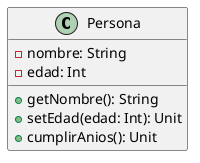

[Ver/Editar en PlantUML](https://www.plantuml.com/plantuml/uml/JP2nJiGm38RtF4LbPwW5HLKnHQ0fNc0jMkZhZJI9MRmYxhzwq8Y91IxzvvkRuCLpAQR31dV0u3_fxlnw8Pb0Pw4ioAhKk4jdW2dG5JG4BmN8bUNQ7hNkDnkzqhtsX_N0FxN7tqMdG7OyqqwF88hHAHH_Bp_6Rm00)

**En Kotlin:**
```kotlin
class Persona(private var nombre: String, private var edad: Int) {
    fun getNombre(): String = nombre
    fun setEdad(edad: Int) { this.edad = edad }
    fun cumplirAnios() { edad++ }
}
```

Note: Este ejemplo muestra una clase simple con atributos privados y métodos públicos. La visibilidad se indica con + (público) y - (privado).


### 3.4. Visibilidad

* **+ público**: Accesible desde cualquier lugar
* **- privado**: Solo accesible dentro de la clase
* **# protegido**: Accesible en la clase y subclases
* **~ paquete**: Accesible en el mismo paquete
* Principio de encapsulación

Note: La visibilidad controla quién puede acceder a atributos y métodos. El encapsulamiento recomienda atributos privados con métodos públicos.


### 3.5. Atributos estáticos

* Se subrayan en el diagrama
* Compartidos por todas las instancias
* Pertenecen a la clase, no a objetos individuales
* Ejemplo: contador de instancias

```
- cantidadLibros: Int  (estático, subrayado)
```

Note: Los atributos de clase pertenecen a la clase misma, no a cada objeto. Por ejemplo, un contador de instancias creadas.


### 3.6. Métodos estáticos

* Subrayados en el diagrama
* Pertenecen a la clase, no a instancias
* Ejemplo: `crear(): Persona`
* **Constructores**: Sin tipo de retorno
* **Métodos abstractos**: En cursiva

Note: Los métodos de clase se pueden invocar sin crear un objeto. Los constructores inicializan objetos nuevos.


### 3.7. Clases abstractas

* No se pueden instanciar directamente
* Sirven como plantillas para otras clases
* Nombre en **cursiva**
* Pueden tener métodos abstractos (sin implementación)
* Ejemplo: Figura, Animal, Vehículo

Note: Las clases abstractas representan conceptos generales que no tienen sentido por sí solos. No creas objetos de tipo "Figura", sino "Círculo" o "Cuadrado".

---

## 4. Interfaces: Contratos de comportamiento

### 4.1. ¿Qué es una interfaz?

* Contrato que define comportamiento
* Solo declara métodos, no los implementa
* No tiene atributos de instancia
* Pueden tener constantes
* Las clases las implementan

Note: Una interfaz es un contrato que dice "si implementas esta interfaz, debes proporcionar estos métodos".


### 4.2. Representación gráfica

* Dos formas de representación:
    1. Rectángulo con `<<interface>>` en la parte superior
    2. Círculo con nombre de la interfaz
* Contiene nombre y métodos
* Sin atributos de instancia
* Todos los métodos son públicos y abstractos

Note: La más común es el rectángulo con el estereotipo <<interface>> arriba del nombre.


### 4.3. Ejemplo: Interfaz IVolador

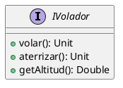

[Ver/Editar en PlantUML](https://www.plantuml.com/plantuml/uml/JOun2iCm30NtVOglS1F7gwINQXrWCJ44g58TtYiX_txwQ2w96-_yzxvVrD6W3dEyGH4WwIKiTfaG5w5M8QxKJaUhbBL7MR1ZaMLOw5EeDK_pdsqbr-TdhTnlrUG_)

**En Kotlin:**
```kotlin
interface IVolador {
    fun volar()
    fun aterrizar()
    fun getAltitud(): Double
}
```

Note: Este ejemplo muestra una interfaz simple con tres métodos públicos que deben ser implementados por cualquier clase que la use.


### 4.4. Diferencias con clases abstractas I

* **Interfaces**:
    - Solo métodos abstractos (sin implementación)
    - No tienen atributos de instancia
    - Una clase puede implementar múltiples interfaces
    - Definen "qué" debe hacer

Note: La diferencia clave es que las interfaces son contratos puros sin implementación. Java y Kotlin permiten implementar múltiples interfaces.


### 4.5. Diferencias con clases abstractas II

* **Clases abstractas**:
    - Pueden tener métodos implementados
    - Pueden tener atributos de instancia
    - Herencia simple (solo una superclase)
    - Definen "qué" y parcialmente "cómo"

Note: Las clases abstractas pueden proporcionar implementación parcial, no solo declaraciones. Usa interfaces para capacidades (Volador) y clases abstractas para jerarquías de tipos relacionados (Animal).

---

## 5. Relaciones entre Clases e Interfaces

### 5.1. Tipos de relaciones

* **Asociación**: Conexión entre clases
* **Agregación**: Relación "tiene un" (partes independientes)
* **Composición**: Relación "es parte de" (partes dependientes)
* **Herencia**: Relación "es un tipo de"
* **Dependencia**: Uso temporal
* **Implementación**: Realización de interfaz

Note: Las relaciones son tan importantes como las clases mismas. Cada tipo de relación tiene un significado específico y una notación propia.


### 5.2. Asociación

* Relación estructural entre clases
* Indica que hay comunicación entre ellas
* Representada con línea continua
* Puede tener nombre y dirección
* Ejemplo: Persona —trabaja en→ Empresa

Note: La asociación es la relación más general. Indica que dos clases están conectadas de alguna forma.


### 5.3. Ejemplo de Asociación

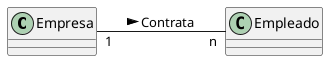

[Ver/Editar en PlantUML](https://www.plantuml.com/plantuml/uml/SoWkIImgAStDuN9MAinFBL5GKiXCJbLmIr5OICrB0Pa00000)

**En Kotlin:**
```kotlin
class Empresa(val nombre: String) {
    val empleados: MutableList<Empleado> = mutableListOf()
    
    fun contratarEmpleado(empleado: Empleado) {
        empleados.add(empleado)
        empleado.empresa = this
    }
}

class Empleado(val nombre: String) {
    var empresa: Empresa? = null
}
```

Note: Una empresa contrata múltiples empleados. La multiplicidad indica "1 a n".


### 5.4. Multiplicidad (Cardinalidad)

| Notación     | Significado                       |
|--------------|-----------------------------------|
| `1`          | Exactamente uno                   |
| `0..1`       | Cero o uno                        |
| `*` o `0..*` | Cero o muchos                     |
| `1..*`       | Uno o muchos (al menos uno)       |
| `n`          | Exactamente n (número específico) |
| `m..n`       | Desde m hasta n                   |

Note: La multiplicidad indica cuántos objetos participan en una relación. Es fundamental para entender las restricciones del dominio.


### 5.5. Agregación

* Relación "tiene un" o "contiene"
* Partes pueden existir independientemente del todo
* Representada con rombo blanco (◇)
* Ejemplo: Universidad ◇—→ Departamento
* Departamento puede existir sin Universidad

Note: La agregación indica que un objeto está formado por otros, pero las partes tienen vida propia.


### 5.6. Ejemplo de Agregación

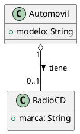

[Ver/Editar en PlantUML](https://www.plantuml.com/plantuml/uml/SoWkIImgAStDuKhEIImkLd1DJgNY8YA0KmkIIw9A30dIImfAIYxAB4bDJ4vLi5Am0d2i0000)

**En Kotlin:**
```kotlin
class Automovil(val modelo: String) {
    var radioCD: RadioCD? = null  // Puede o no tener radio
    
    fun instalarRadio(radio: RadioCD) {
        radioCD = radio
    }
}

class RadioCD(val marca: String)
```

Note: El radio puede existir sin el automóvil. La relación es débil - agregación.


### 5.7. Composición

* Relación "es parte de" más fuerte
* Partes NO existen independientemente del todo
* Representada con rombo negro (♦)
* Ejemplo: Casa ♦—→ Habitación
* Si destruyes la casa, las habitaciones desaparecen

Note: La composición es la relación más fuerte de contenencia. Las partes nacen y mueren con el todo.


### 5.8. Ejemplo de Composición

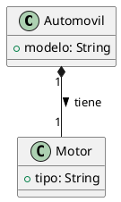

[Ver/Editar en PlantUML](https://www.plantuml.com/plantuml/uml/SoWkIImgAStDuKhEIImkLd1DJgNY8YA0Kmk AIw9A30dIIqfAIYxAB4bDJ4t9JCqhKGXEBl000)

**En Kotlin:**
```kotlin
class Automovil(val modelo: String) {
    val motor: Motor = Motor("V8")  // Motor creado con el automóvil
    
    inner class Motor(val tipo: String) {
        fun motorInfo() = "Motor $tipo del automóvil $modelo"
    }
}
```

Note: El motor no puede existir sin el automóvil. La relación es fuerte - composición.


### 5.9. Herencia (Generalización)

* Relación "es un tipo de"
* Representa especialización/generalización
* Representada con flecha de triángulo blanco (▷)
* La flecha apunta a la superclase
* Ejemplo: Perro ▷—→ Animal

Note: La herencia es fundamental en POO. Indica que una clase (subclase) hereda atributos y métodos de otra (superclase).


### 5.10. Ejemplo de Herencia

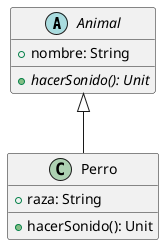

[Ver/Editar en PlantUML](https://www.plantuml.com/plantuml/uml/SoWkIImgAStDuKhEIImkLd2jICmjo2_EBInAJCv9pCzBB4bDI2nMS0e0)

**En Kotlin:**
```kotlin
abstract class Animal(val nombre: String) {
    abstract fun hacerSonido()
    fun comer() = println("$nombre está comiendo")
}

class Perro(nombre: String, val raza: String) : Animal(nombre) {
    override fun hacerSonido() {
        println("El perro $nombre de raza $raza ladra")
    }
}
```

Note: Perro hereda de Animal. La flecha apunta hacia la superclase (Animal).


### 5.11. Dependencia

* Relación de uso temporal
* Una clase usa otra pero no la contiene
* Representada con flecha discontinua (- - →)
* Cambios en una clase pueden afectar a la otra
* Ejemplo: Servicio - - → BaseDatos

Note: La dependencia es la relación más débil. Indica que una clase usa temporalmente otra, típicamente como parámetro de método.


### 5.12. Implementación (Realización)

* Clase implementa una interfaz
* La clase proporciona implementación concreta
* Representada con flecha discontinua y triángulo (- - ▷)
* Flecha apunta a la interfaz
* Ejemplo: Avion - - ▷ IVolador

Note: Esta relación indica que una clase concreta implementa todos los métodos definidos en una interfaz.


### 5.13. Ejemplo de Implementación

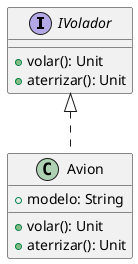

[Ver/Editar en PlantUML](https://www.plantuml.com/plantuml/uml/NOz12i8m44NtFSMebRv05TI5Wep5K8u24MX9aXIwtjlqKT91EJ_V_oR-OwSVg0S0IaQq0-4b4l92cJnSsArKajU6P8vG_iD7WKMBbQ3Vz--e0wCrlNqGVm00)

**En Kotlin:**
```kotlin
interface IVolador {
    fun volar()
    fun aterrizar()
}

class Avion(val modelo: String) : IVolador {
    override fun volar() {
        println("Avión $modelo despegando")
    }
    
    override fun aterrizar() {
        println("Avión $modelo aterrizando")
    }
}
```

Note: Avion implementa IVolador proporcionando código concreto para los métodos volar() y aterrizar().


### 5.14. Resumen de Relaciones

| Relación           | Símbolo  | Fuerza       |
|--------------------|----------|--------------|
| **Dependencia**    | `- - →`  | Muy débil    |
| **Asociación**     | `───`    | Débil        |
| **Agregación**     | `◇───`   | Media        |
| **Composición**    | `♦───`   | Fuerte       |
| **Herencia**       | `───▷`   | Muy fuerte   |
| **Implementación** | `- - ▷`  | Muy fuerte   |

Note: Este cuadro resume los tipos de relaciones ordenados por fuerza de acoplamiento.

---

## 6. Mejores Prácticas en Diagramas de Clases

### 6.1. Responsabilidad Única (SRP)

* Cada clase debe tener una única responsabilidad
* Solo una razón para cambiar
* Clases cohesivas y enfocadas
* Facilita mantenimiento y reutilización
* Evita clases "Dios"

Note: Una clase debe hacer una cosa y hacerla bien. Si al describir la clase usas "y" múltiples veces, probablemente viola SRP.


### 6.2. Gestión de Complejidad

* Dividir diagramas grandes por módulos
* Crear vistas por capas de arquitectura
* Organizar por casos de uso o funcionalidades
* No más de 10-15 clases por diagrama
* Mantener claridad visual

Note: Un diagrama con 50+ clases es ilegible. Es mejor crear varios diagramas: uno de alto nivel con módulos principales, y diagramas detallados por subsistema.


### 6.3. Claridad Visual

**Hacer**:

* Evitar cruces de líneas
* Agrupar clases relacionadas
* Distribución equilibrada
* Usar espacio en blanco

**Evitar**:

* Diagramas abarrotados
* Líneas superpuestas
* Mezclar niveles de detalle

Note: Un buen diagrama no solo es correcto técnicamente, sino también visualmente claro.


### 6.4. Uso Estratégico del Color

* 🔵 **Azul**: Clases del dominio/modelo
* 🟢 **Verde**: Clases de servicios/lógica
* 🟡 **Amarillo**: Clases de utilidades/helpers
* 🟣 **Púrpura**: Interfaces
* ⚫ **Gris**: Clases del framework/externas

Note: Los colores mejoran significativamente la legibilidad cuando se usan con propósito. No uses demasiados colores (máximo 5-6).


### 6.5. Nombrado Consistente

**Clases**: PascalCase, sustantivos singulares

- ✅ `Usuario`, `CarritoCompras`
- ❌ `usuario`, `Carritos`

**Métodos**: camelCase, verbos

- ✅ `calcularTotal()`, `esValido()`
- ❌ `CalcularTotal()`, `validacion()`

**Atributos**: camelCase, sustantivos

- ✅ `nombre`, `fechaCreacion`
- ❌ `Nombre`, `fecha_creacion`

Note: Las convenciones de nombres mejoran la legibilidad y profesionalismo del diagrama.

---

## 7. Ejemplos Completos de Diagramas de Clases

### 7.1. Sistema de Biblioteca

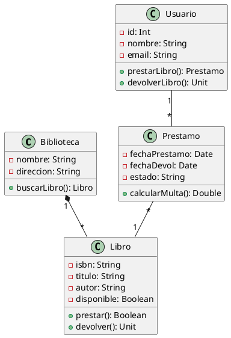

[Ver/Editar en PlantUML](https://www.plantuml.com/plantuml/uml/ZP51QiCm44Ntd89dHfUGj1g1TmfuKIXOcgPYUg6kSl0aqYUTxoYjrWqBpjttytpzpBVpE2yiGR3a5c2LKX3vu8A8Wq2N3AuWO9X4GH3hXX8G2pTcF0dYT-WEPYfHHaD4EB2P8aE9oI8C1y3kgK0e8i0y4gEOg9Bp0vO86VuN0C6eHOp0Pq1IG6BWmgq1q0p6A0y4dP0ByiBi0wm2h0_G80_O3Y_W50_u5 Y_W70_u7Y_W90_G9Y_WA0_GB0__0W00)


### 7.1. (continuación) - Código Kotlin

**En Kotlin:**
```kotlin
data class Libro(val isbn: String, val titulo: String, 
                 val autor: String, var disponible: Boolean = true) {
    fun prestar(): Boolean = if (disponible) {
        disponible = false; true
    } else false
    fun devolver() { disponible = true }
}

class Usuario(val id: Int, val nombre: String, val email: String) {
    private val prestamos = mutableListOf<Prestamo>()
    fun prestarLibro(libro: Libro): Prestamo? {
        return if (libro.prestar()) {
            Prestamo(this, libro).also { prestamos.add(it) }
        } else null
    }
}

class Prestamo(val usuario: Usuario, val libro: Libro) {
    var estado: String = "ACTIVO"
    fun calcularMulta(): Double = 0.0 // Lógica de multa
}

class Biblioteca(val nombre: String, val direccion: String) {
    private val libros = mutableListOf<Libro>()
    fun buscarLibro(titulo: String) = 
        libros.filter { it.titulo.contains(titulo, true) }
}
```

Note: Este ejemplo muestra una biblioteca con libros, usuarios, préstamos y relaciones de composición, asociación y agregación.


### 7.2. Sistema Universitario

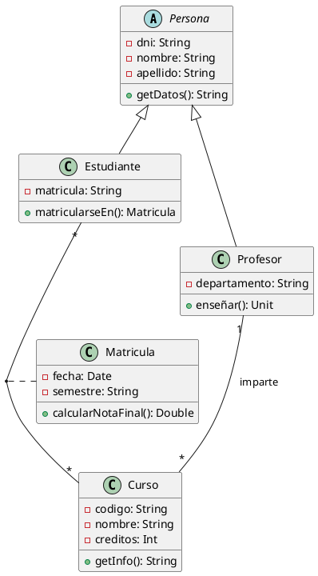

[Ver/Editar en PlantUML](https://www.plantuml.com/plantuml/uml/bP9TQiCm48NlzodU8SYF61XbQT58CGGXPLA5cXjDcMcQyq6MxzqMM4pWqJQ-l_VdysFG6tMaHY26nBd68W5Gn4K9PW8n4LPBXq8PW9B4rHM9KH4GY9GCafxD20DY3GK5Q0Y9P4XGE5Y1PKPQ2HI5e0Pa1Pi1y3g8G8C5e0Ba1u4hK0hm3u4pg2hq2w5h82_m3O_W4Y_m5Y_W6Y_m7Y_W8Y_m9Y_W0Y_G0__000)


### 7.2. (continuación) - Código Kotlin

**En Kotlin:**
```kotlin
abstract class Persona(val dni: String, var nombre: String, 
                       var apellido: String) {
    fun getDatos() = "$nombre $apellido (DNI: $dni)"
}

class Estudiante(dni: String, nombre: String, 
                 apellido: String, val matricula: String) 
    : Persona(dni, nombre, apellido) {
    private val matriculas = mutableListOf<Matricula>()
    fun matricularseEn(curso: Curso): Matricula {
        return Matricula(this, curso).also { matriculas.add(it) }
    }
}

class Profesor(dni: String, nombre: String, apellido: String,
               val departamento: String) 
    : Persona(dni, nombre, apellido) {
    private val cursosImpartidos = mutableListOf<Curso>()
    fun enseñar(curso: Curso) { cursosImpartidos.add(curso) }
}

class Curso(val codigo: String, val nombre: String, 
            val creditos: Int, val profesor: Profesor)

class Matricula(val estudiante: Estudiante, val curso: Curso,
                var semestre: String = "2024-1") {
    private val notas = mutableMapOf<String, Double>()
    fun calcularNotaFinal() = notas.values.average()
}
```

Note: Sistema que modela estudiantes, cursos, profesores y matrículas con herencia de Persona.


### 7.3. Sistema de E-Commerce

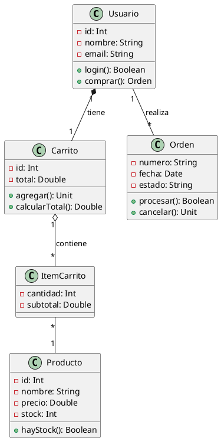

[Ver/Editar en PlantUML](https://www.plantuml.com/plantuml/uml/bLHDRzim3Bxl5u8zHJI5bO1XjTgYgf60CJPAYXqQ9I8QzUQIRdNRz-WlIhOKWAaZ2R_tUpRt-VpRbKbCH1aGkH0WGf3WeQKGH2WGf3WeQKGH3WeQKGH4WeQKG H5WeQKGH6WGf3WGf30__G0)


### 7.3. (continuación) - Código Kotlin

**En Kotlin:**
```kotlin
class Producto(val id: Int, var nombre: String, 
               var precio: Double, var stock: Int) {
    fun hayStock(cantidad: Int = 1) = stock >= cantidad
}

class ItemCarrito(val producto: Producto, var cantidad: Int) {
    val subtotal get() = producto.precio * cantidad
}

class Carrito(val usuario: Usuario) {
    private val items = mutableListOf<ItemCarrito>()
    val total get() = items.sumOf { it.subtotal }
    
    fun agregarProducto(producto: Producto, cantidad: Int) {
        items.find { it.producto.id == producto.id }
            ?.let { it.cantidad += cantidad }
            ?: items.add(ItemCarrito(producto, cantidad))
    }
}

class Usuario(val id: Int, var nombre: String, var email: String) {
    val carrito = Carrito(this)
    private val ordenes = mutableListOf<Orden>()
    
    fun comprar(): Orden? = carrito.crearOrden()?.also {
        ordenes.add(it)
        carrito.vaciar()
    }
}

class Orden(val usuario: Usuario, items: List<ItemCarrito>) {
    var estado = "PENDIENTE"
    fun procesar(): Boolean { /* lógica */ return true }
}
```

Note: Sistema completo de tienda online con usuarios, productos, carritos y órdenes.

---

## 8. Herramientas para Crear Diagramas de Clases

### 8.1. Herramientas Online

* **Draw.io / Diagrams.net**: Gratuito, sin registro
* **Lucidchart**: Colaborativo, freemium
* **PlantUML Online**: Diagramas desde texto
* Accesibles desde navegador
* Facilitan colaboración

Note: Las herramientas online son ideales para empezar. Draw.io es completamente gratuito y no requiere registro.


### 8.2. Herramientas de Escritorio

* **Visual Paradigm**: Community Edition gratuita
* **StarUML**: Open source, $89 licencia completa
* **Enterprise Architect**: Estándar de la industria
* Más potentes y completas
* Soporte para ingeniería directa/inversa

Note: Las herramientas de escritorio ofrecen funcionalidades avanzadas como generación de código desde diagramas y creación de diagramas desde código.


### 8.3. IDEs con soporte UML

* **IntelliJ IDEA**: Plugin UML nativo
* **Eclipse + Papyrus**: Gratuito, completo
* **Visual Studio**: Class Designer integrado
* Sincronización código-diagrama
* Ideal para desarrollo activo

Note: Los IDEs modernos incluyen herramientas UML integradas. IntelliJ IDEA puede generar diagramas de clases desde código existente automáticamente.


### 8.4. PlantUML - Ejemplo

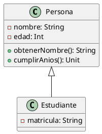

[Ver/Editar en PlantUML](https://www.plantuml.com/plantuml/uml/JP4nJiGm48Nt_8gh7uW8HT_w0mj5Q5aH3A5IPijIslOjhlztq8Y91IxzvzlyI-v8MKCI92MP0f7eqVqh3JcEwfKe8Eay0dW0e3TW6CW1pU49nqKS3Ku8zUNQ7FNkDtlzqhp-D_50FxN7tqadm7dyqqrV88hHP7R_d95_83S00)

**En Kotlin:**
```kotlin
open class Persona(private var nombre: String, private var edad: Int) {
    fun obtenerNombre() = nombre
    fun cumplirAnios() { edad++ }
}

class Estudiante(nombre: String, edad: Int, 
                 private val matricula: String) 
    : Persona(nombre, edad)
```

Note: PlantUML permite crear diagramas mediante código texto. Facilita control de versiones con git y automatización en CI/CD.

---

## ¡Gracias por vuestra atención!

### Preguntas

¿Alguna pregunta sobre diagramas de clases?

Note: Abrimos espacio para preguntas. Preguntad cualquier duda sobre conceptos vistos: notación, relaciones, herramientas, implementación en Kotlin, etc.
