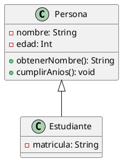

# U3.2 - Diagrama de Clases en UML

---

 <!-- .element height="50%" width="50%" -->

---

## Índice 1

- Introducción
    - ¿Qué es el diagrama de clases?
    - Aspectos principales
    - Comparación con otros modelos
    - Objetivos según la fase
- Elementos del Diagrama
    - Clases
    - Relaciones
    - Interfaces


## Índice 2

- Clases
    - ¿Qué representa una clase?
    - Representación gráfica
    - Atributos
    - Métodos
    - Visibilidad
    - Clases abstractas


## Índice 3

- Interfaces
    - Definición de interfaces
    - Representación gráfica
    - Diferencias con clases abstractas
- Relaciones entre Clases
    - Asociación
    - Agregación
    - Composición


## Índice 4

- Relaciones entre Clases (cont.)
    - Herencia
    - Dependencia
    - Implementación
    - Multiplicidad
- Ejemplos Prácticos
- Conclusión

---

## Introducción


### ¿Qué es el diagrama de clases?

* Diagrama incluido en UML 2.5
* Clasificado como diagrama de estructura
* Representa elementos desde un punto de vista estático
* No muestra el comportamiento durante la ejecución
* Es uno de los diagramas más importantes de UML

Note: El diagrama de clases es fundamental en UML para representar la estructura estática de un sistema. Es importante destacar que no incluye comportamiento dinámico - esa función la cumplen otros diagramas como el de secuencia o casos de uso. Es el diagrama más utilizado en el desarrollo orientado a objetos.


### Aspectos principales

* **Orientado a objetos**: Define clases para la construcción
* **Vista estática**: Muestra estructura, no comportamiento
* **Modelo lógico**: Similar al diagrama E/R de bases de datos
* **Fundamental**: Uno de los más usados en UML
* Describe tipos de objetos y sus relaciones estáticas

Note: El diagrama de clases comparte similitudes con el diagrama Entidad-Relación que los estudiantes conocen de bases de datos. Ambos representan el modelo lógico de datos. Recordad que al ser estático, captura la estructura en un momento dado, no cómo evolucionan los objetos durante la ejecución del programa.


### ¿Qué describe el diagrama de clases?

* Los tipos de objetos (clases) del sistema
* Las relaciones estáticas entre las clases
* Los atributos y operaciones de cada clase
* Las restricciones de conexión entre objetos
* La estructura general del sistema

Note: El diagrama responde preguntas como: ¿qué objetos tengo? ¿qué propiedades tienen? ¿cómo se relacionan entre sí? Es una fotografía de la arquitectura del sistema que nos permite entender su organización antes de implementarlo.


### Comparación con otros modelos

* Equiparable al diagrama Entidad-Relación (E/R)
* Ambos muestran el modelo lógico de datos
* Representan datos y su interacción
* E/R para bases de datos, clases para POO
* Utilidad similar en sus respectivos contextos

Note: Si ya conocéis el diagrama E/R, tenéis ventaja. Las entidades son similares a las clases, los atributos son los mismos conceptos, y las relaciones también existen aunque con más tipos. La principal diferencia es que las clases incluyen comportamiento (métodos), no solo datos.


### Objetivos según la fase

* **Durante el análisis**:
    - Modelado del dominio del problema
    - Comprensión de requisitos
    - Enfoque en conceptos del mundo real
* **Durante el diseño**:
    - Detalles de implementación técnica
    - Decisiones tecnológicas y restricciones

Note: El mismo diagrama de clases se usa en dos fases diferentes con objetivos distintos. En análisis nos centramos en entender el problema y los conceptos del negocio (Paciente, Doctor, Cita). En diseño, refinamos el diagrama añadiendo detalles técnicos como tipos de datos concretos, patrones de diseño, y consideraciones de la plataforma de implementación.

---

## Elementos del Diagrama


### Elementos principales

* **Clases**: Objetos y conceptos del mundo real
* **Relaciones**: Asociaciones y dependencias entre clases
* **Interfaces**: Contratos que las clases implementan
* Trabajan conjuntamente para representar el sistema
* Sin relaciones, las clases estarían aisladas

Note: Estos tres elementos son los pilares del diagrama. Las clases son los "actores principales", las relaciones muestran cómo interactúan, y las interfaces definen contratos de comportamiento. Un sistema sin relaciones sería un conjunto de clases desconectadas sin sentido práctico.

---

## Clases


### ¿Qué representa una clase?

* Conjunto de objetos con características comunes
* Agrupa responsabilidades similares
* Ejemplos: Paciente, Doctor, Coche, CuentaBancaria
* Pieza básica de la POO
* Favorece especialización y comunicación por mensajes

Note: Una clase es una plantilla o molde para crear objetos. Representa conceptos del dominio del problema. Por ejemplo, la clase Coche define qué propiedades tiene todo coche (marca, modelo, color) y qué puede hacer (arrancar, frenar, acelerar). Los objetos individuales son instancias concretas de esa clase.


### Origen de las clases I

* **Cosas tangibles**: Avión, auto, televisor, computador
* **Roles o papeles**: Gerente, cliente, vendedor, profesor
* **Organizaciones**: Universidad, empresa, departamento
* Estas son las fuentes más comunes

Note: La mayoría de las clases provienen de sustantivos en los requisitos del sistema. Las cosas tangibles y los roles son las fuentes más frecuentes. Por ejemplo, en un sistema hospitalario: Paciente y Doctor son roles, mientras que Quirófano y Camilla son cosas tangibles.


### Origen de las clases II

* **Interacciones**: Transacción, matrícula, contrato
* **Eventos o incidencias**: Vuelo, accidente, suceso
* Menos comunes pero importantes
* Las categorías se solapan frecuentemente

Note: Las interacciones y eventos también generan clases. Por ejemplo, una Reserva de hotel es una interacción, y un Incidente de seguridad es un evento. Estas categorías no son exclusivas - un Vuelo puede considerarse tanto un evento como una interacción.


### Representación gráfica de una clase

* Rectángulo dividido en tres compartimentos:
    1. **Nombre** (obligatorio): Identifica la clase
    2. **Atributos**: Propiedades de la clase
    3. **Métodos**: Operaciones que puede realizar
* Nombre en negrita, centrado
* Puede omitirse atributos o métodos según nivel de detalle

Note: La representación es un rectángulo con tres secciones. El nombre siempre es obligatorio, en negrita y centrado (ejemplo: Persona). Los atributos y métodos pueden omitirse si no son relevantes en ese nivel de abstracción del diagrama. Es común mostrar solo el nombre en diagramas de alto nivel.


### Atributos de una clase I

* Representan propiedades o características
* Sintaxis: `visibilidad nombre: tipo = valorInicial`
* Ejemplos:
    - `- nombre: String`
    - `+ edad: Int = 0`
    - `# saldo: Double = 0.0`
* Pueden tener valores por defecto

Note: Los atributos definen el estado de los objetos. La sintaxis completa incluye visibilidad (+ público, - privado, # protegido), nombre descriptivo, tipo de dato y opcionalmente un valor inicial. Por ejemplo, en CuentaBancaria podríamos tener "- saldo: Double = 0.0" que indica que el saldo es privado, de tipo decimal y empieza en cero.


### Atributos de una clase II

* **Atributos de clase** (estáticos):
    - Se subrayan en el diagrama
    - Compartidos por todas las instancias
    - Ejemplo: `contador: Int`
* **Atributos derivados**:
    - Se calculan a partir de otros
    - Se marcan con `/`
    - Ejemplo: `/edad` (derivado de fechaNacimiento)

Note: Los atributos de clase pertenecen a la clase misma, no a cada objeto. Por ejemplo, un contador de instancias creadas. Los atributos derivados no se almacenan, se calculan. La edad puede derivarse de la fecha de nacimiento y la fecha actual, por eso se marca con "/edad".


### Métodos de una clase I

* Representan operaciones o comportamiento
* Sintaxis: `visibilidad nombre(parámetros): tipoRetorno`
* Ejemplos:
    - `+ obtenerNombre(): String`
    - `- calcular(valor: Int): Double`
    - `# validar(): Boolean`

Note: Los métodos definen qué puede hacer un objeto. La sintaxis incluye visibilidad, nombre descriptivo (normalmente verbos), parámetros entre paréntesis, y tipo de retorno. Por ejemplo, "calcularDescuento(cantidad: Double): Double" indica que el método es público, recibe un decimal y devuelve otro decimal.


### Métodos de una clase II

* **Métodos de clase** (estáticos):
    - Subrayados en el diagrama
    - Pertenecen a la clase, no a instancias
    - Ejemplo: `crear(): Persona`
* **Constructores**: Sin tipo de retorno
* **Métodos abstractos**: En cursiva

Note: Los métodos de clase se pueden invocar sin crear un objeto, como Math.sqrt(). Los constructores inicializan objetos nuevos y no tienen tipo de retorno. Los métodos abstractos (en cursiva) se declaran pero no se implementan en esa clase, obligando a las subclases a implementarlos.


### Visibilidad

* **+ público**: Accesible desde cualquier lugar
* **- privado**: Solo accesible dentro de la clase
* **# protegido**: Accesible en la clase y subclases
* **~ paquete**: Accesible en el mismo paquete
* Principio de encapsulación

Note: La visibilidad controla quién puede acceder a atributos y métodos. El encapsulamiento recomienda atributos privados con métodos públicos (getters/setters). Público (+) para interfaces expuestas, privado (-) para implementación interna, protegido (#) para compartir con herencia, paquete (~) para clases del mismo módulo.


### Clases abstractas

* No se pueden instanciar directamente
* Sirven como plantillas para otras clases
* Nombre en cursiva
* Pueden tener métodos abstractos (sin implementación)
* Ejemplo: Figura, Animal, Vehículo

Note: Las clases abstractas representan conceptos generales que no tienen sentido por sí solos. No creas objetos de tipo "Figura", sino "Círculo" o "Cuadrado". La clase abstracta define comportamiento común y obliga a las subclases a implementar métodos específicos. El nombre se escribe en cursiva para identificarlas visualmente.

---

## Interfaces


### Definición de interfaces

* Contrato que define comportamiento
* Solo declara métodos, no los implementa
* No tiene atributos de instancia
* Pueden tener constantes
* Las clases las implementan

Note: Una interfaz es un contrato que dice "si implementas esta interfaz, debes proporcionar estos métodos". Es una forma de definir qué debe hacer algo sin especificar cómo. Por ejemplo, una interfaz "Volador" podría declarar el método "volar()", y tanto Avion como Pajaro podrían implementarla de formas diferentes.


### Representación gráfica

* Dos formas de representación:
    1. Rectángulo con `<<interface>>` en la parte superior
    2. Círculo con nombre de la interfaz
* Contiene nombre y métodos
* Sin atributos de instancia
* Todos los métodos son públicos y abstractos

Note: Existen dos notaciones válidas. La más común es el rectángulo con el estereotipo <<interface>> arriba del nombre. La notación de círculo (lollipop) es más compacta y se usa cuando no necesitas mostrar los métodos. En la notación de rectángulo se listan todos los métodos que la interfaz define.


### Diferencias con clases abstractas I

* **Interfaces**:
    - Solo métodos abstractos (sin implementación)
    - No tienen atributos de instancia
    - Una clase puede implementar múltiples interfaces
    - Definen "qué" debe hacer

Note: La diferencia clave es que las interfaces son contratos puros sin implementación. Son como un menú de restaurante: te dice qué platos hay pero no cómo se cocinan. Java y Kotlin permiten implementar múltiples interfaces pero solo heredar de una clase, lo que hace a las interfaces más flexibles para definir capacidades.


### Diferencias con clases abstractas II

* **Clases abstractas**:
    - Pueden tener métodos implementados
    - Pueden tener atributos de instancia
    - Herencia simple (solo una superclase)
    - Definen "qué" y parcialmente "cómo"

Note: Las clases abstractas pueden proporcionar implementación parcial, no solo declaraciones. Son como una receta a medio completar: tiene algunos pasos definidos y otros que cada cocinero debe especificar. Usa interfaces para capacidades (Volador, Nadador) y clases abstractas para jerarquías de tipos relacionados (Animal, Vehiculo).

---

## Relaciones entre Clases


### Tipos de relaciones

* **Asociación**: Conexión entre clases
* **Agregación**: Relación "tiene un" (partes independientes)
* **Composición**: Relación "es parte de" (partes dependientes)
* **Herencia**: Relación "es un tipo de"
* **Dependencia**: Uso temporal
* **Implementación**: Realización de interfaz

Note: Las relaciones son tan importantes como las clases mismas. Cada tipo de relación tiene un significado específico y una notación propia. Es crucial elegir la relación correcta porque comunica el tipo de interacción entre clases. Las veremos una por una en detalle.


### Asociación I

* Relación estructural entre clases
* Indica que hay comunicación entre ellas
* Representada con línea continua
* Puede tener nombre y dirección
* Ejemplo: Persona —trabaja en→ Empresa

Note: La asociación es la relación más general. Indica que dos clases están conectadas de alguna forma. La línea continua une ambas clases. Puede incluir un nombre que describe la relación (como "trabaja en") y una flecha que indica la dirección de lectura. Por ejemplo: "Persona trabaja en Empresa".


### Asociación II - Tipos

* **Asociación binaria**: Entre dos clases (la más común)
* **Asociación reflexiva**: Una clase consigo misma
    - Ejemplo: Persona —es amigo de→ Persona
* **Asociación n-aria**: Entre tres o más clases
    - Menos común, representada con rombo

Note: La mayoría de asociaciones son binarias, conectando dos clases. Las reflexivas son útiles para relaciones como "empleado-jefe" o "amistades" donde ambos extremos son de la misma clase. Las asociaciones n-arias (tres o más clases) se usan raramente, como en Estudiante-Curso-Profesor en un sistema de matrícula.


### Navegabilidad

* Indica dirección de conocimiento entre clases
* Flecha apuntando a la clase conocida
* Sin flechas: navegabilidad bidireccional
* Con flecha: navegabilidad unidireccional
* Ejemplo: Cliente → Pedido (Cliente conoce sus Pedidos)

Note: La navegabilidad indica qué clase conoce a la otra. Si Cliente tiene una flecha hacia Pedido, significa que un cliente conoce sus pedidos (tiene referencias a ellos). Si no hay flecha en Pedido hacia Cliente, el pedido podría no saber a qué cliente pertenece. Bidireccional significa que ambas clases se conocen mutuamente.


### Roles en asociaciones

* Etiquetas en los extremos de la asociación
* Describen el papel que juega cada clase
* Útiles cuando la relación no es obvia
* Ejemplo: Persona —(empleado)—trabaja en—(empleador)→ Empresa
* Clarifican relaciones complejas

Note: Los roles especifican el papel de cada participante en la relación. Son especialmente útiles en asociaciones reflexivas. Por ejemplo, en Persona-Persona con roles "padre" e "hijo" se aclara la naturaleza de la relación. También ayudan cuando una clase tiene múltiples relaciones con otra.


### Agregación

* Relación "tiene un" o "contiene"
* Partes pueden existir independientemente del todo
* Representada con rombo blanco (◇)
* Ejemplo: Universidad ◇—→ Departamento
* Departamento puede existir sin Universidad

Note: La agregación indica que un objeto está formado por otros, pero las partes tienen vida propia. Un departamento puede existir aunque la universidad desaparezca - podría transferirse a otra institución. El rombo blanco va en el lado del contenedor (Universidad). Es una relación de pertenencia débil.


### Composición

* Relación "es parte de" más fuerte
* Partes NO existen independientemente del todo
* Representada con rombo negro (♦)
* Ejemplo: Casa ♦—→ Habitación
* Si destruyes la casa, las habitaciones desaparecen

Note: La composición es la relación más fuerte de contenencia. Las partes nacen y mueren con el todo. Una habitación no tiene sentido sin la casa que la contiene. El rombo negro va en el contenedor (Casa). Implica ciclo de vida compartido y propiedad exclusiva - una habitación no puede pertenecer a dos casas simultáneamente.


### Diferencia: Agregación vs Composición

* **Agregación** (◇):
    - Relación débil
    - Partes independientes
    - Ejemplo: Equipo ◇—→ Jugador
* **Composición** (♦):
    - Relación fuerte
    - Partes dependientes
    - Ejemplo: Coche ♦—→ Motor

Note: La diferencia clave es la dependencia del ciclo de vida. Un jugador puede cambiar de equipo o existir sin equipo. Pero el motor de un coche se destruye con el coche. Regla práctica: ¿La parte puede existir sin el todo? Si la respuesta es sí, usa agregación. Si es no, usa composición.


### Herencia (Generalización)

* Relación "es un tipo de"
* Representa especialización/generalización
* Representada con flecha de triángulo blanco (▷)
* La flecha apunta a la superclase
* Ejemplo: Perro ▷—→ Animal

Note: La herencia es fundamental en POO. Indica que una clase (subclase) hereda atributos y métodos de otra (superclase). Perro es un tipo de Animal, por tanto hereda características como edad, nombre, y puede comer o dormir. La flecha siempre apunta hacia la clase más general. Permite reutilización de código y polimorfismo.


### Herencia - Características

* Permite reutilización de código
* La subclase hereda todo lo público/protegido
* Puede sobrescribir métodos (polimorfismo)
* Puede añadir nuevos atributos y métodos
* Evita duplicación de código

Note: Con herencia, no necesitas repetir código común en cada subclase. Perro, Gato y Pájaro pueden heredar de Animal las propiedades comunes (edad, nombre) y cada uno añadir las específicas (Perro tiene raza, Pájaro tiene envergaduraAlas). Pueden sobrescribir métodos heredados para comportamiento específico.


### Dependencia

* Relación de uso temporal
* Una clase usa otra pero no la contiene
* Representada con flecha discontinua (- - →)
* Cambios en una clase pueden afectar a la otra
* Ejemplo: Servicio - - → BaseDatos

Note: La dependencia es la relación más débil. Indica que una clase usa temporalmente otra, típicamente como parámetro de método o variable local. Por ejemplo, un método que recibe un objeto Configuración como parámetro. No hay pertenencia permanente. La flecha discontinua apunta a la clase de la que se depende.


### Implementación (Realización)

* Clase implementa una interfaz
* La clase proporciona implementación concreta
* Representada con flecha discontinua y triángulo (- - ▷)
* Flecha apunta a la interfaz
* Ejemplo: Perro - - ▷ Animal (si Animal es interfaz)

Note: Esta relación indica que una clase concreta implementa todos los métodos definidos en una interfaz. La clase se compromete a proporcionar implementación para cada método de la interfaz. En Kotlin usamos la palabra clave "implements" o ":". Una clase puede implementar múltiples interfaces.


### Multiplicidad I

* Indica cuántos objetos participan en una relación
* Se coloca en los extremos de la asociación
* Valores comunes:
    - `1`: Exactamente uno
    - `0..1`: Cero o uno (opcional)
    - `*` o `0..*`: Cero o muchos

Note: La multiplicidad responde "¿cuántos?". Por ejemplo, en Persona-Coche: si pones "1" en Persona y "0..*" en Coche significa "una persona puede tener cero o muchos coches, pero cada coche pertenece exactamente a una persona". Se lee desde la clase opuesta: "¿cuántos de estos puede tener?".


### Multiplicidad II

* Valores comunes (continuación):
    - `1..*`: Uno o muchos (al menos uno)
    - `2..4`: Entre dos y cuatro
    - `5`: Exactamente cinco
* Ejemplo: Curso `1` —→ `1..*` Estudiante
    - Un curso tiene al menos un estudiante

Note: La multiplicidad permite expresar restricciones de cardinalidad. "1..*" significa "obligatoriamente uno o más". "2..4" permite expresar rangos específicos como "un equipo debe tener entre 2 y 4 jugadores". Estas restricciones son reglas del negocio que se reflejan en el diseño y deben implementarse en el código.

---

## Ejemplos Prácticos


### Ejemplo: Sistema Biblioteca I

* **Clases principales**:
    - Biblioteca
    - Libro
    - Usuario
    - Préstamo
* **Relaciones**:
    - Biblioteca ♦—→ Libro (composición)
    - Usuario —→ Préstamo (asociación)

Note: Un sistema de biblioteca ilustra varios tipos de relaciones. Los libros son parte de la biblioteca (composición fuerte). Los usuarios realizan préstamos (asociación). Los préstamos conectan usuarios con libros. Este ejemplo muestra cómo diferentes relaciones coexisten en un mismo sistema.


### Ejemplo: Sistema Biblioteca II

```
┌─────────────┐         ┌─────────────┐
│ Biblioteca  │♦───1──*│    Libro    │
│             │         │             │
│ + nombre    │         │ + titulo    │
│ + direccion │         │ + autor     │
└─────────────┘         │ + ISBN      │
                        └─────────────┘
                              │
                              │ *
                              │
                              │
┌─────────────┐         ┌─────────────┐
│   Usuario   │───1───* │  Préstamo   │
│             │         │             │
│ + nombre    │         │ + fecha     │
│ + id        │         │ + devuelto  │
└─────────────┘         └─────────────┘
```

Note: Este diagrama muestra la estructura completa. Una biblioteca tiene muchos libros (composición 1..*). Un usuario puede tener muchos préstamos (asociación 1..*). Cada préstamo conecta un usuario con un libro. Las multiplicidades indican que un libro puede estar en múltiples préstamos históricos.


### Ejemplo: Jerarquía de Vehículos

```
        ┌──────────┐
        │ Vehiculo │ (abstracta)
        │          │
        │ + marca  │
        │ + modelo │
        │ + arrancar() │
        └────▲─────┘
             │
      ┌──────┴──────┐
      │             │
┌─────┴────┐  ┌─────┴────┐
│  Coche   │  │   Moto   │
│          │  │          │
│ + puertas│  │ + cilindrada│
└──────────┘  └──────────┘
```

Note: Este ejemplo muestra herencia clásica. Vehículo es clase abstracta con propiedades comunes. Coche y Moto heredan de Vehículo y añaden sus características específicas. Ambos pueden usar el método arrancar() heredado o sobrescribirlo con comportamiento específico. La flecha apunta hacia la superclase.


### Ejemplo: Interfaces

```
┌────────────────┐
│  <<interface>> │
│    Volador     │
│                │
│ + volar()      │
│ + aterrizar()  │
└───────▲────────┘
        │
    ┌───┴───┬────────┐
    │       │        │
┌───┴───┐ ┌─┴────┐ ┌─┴────┐
│ Avion │ │Pajaro│ │Dragon│
└───────┘ └──────┘ └──────┘
```

Note: Las interfaces definen capacidades compartidas entre clases no relacionadas. Avion, Pajaro y Dragon pueden volar, pero son conceptos muy diferentes sin jerarquía común. Cada uno implementa volar() y aterrizar() de forma distinta. Las interfaces permiten tratar objetos diferentes de forma uniforme por su capacidad compartida.


### Ejemplo: Agregación vs Composición

```
Universidad ◇────1───* Departamento
(Agregación)

Casa ♦────1───* Habitación
(Composición)
```

* Departamento sobrevive sin Universidad
* Habitación no tiene sentido sin Casa
* Ciclo de vida dependiente vs independiente

Note: Comparar directamente agregación y composición. Si la universidad cierra, los departamentos pueden fusionarse o integrarse en otras universidades. Si demolemos una casa, las habitaciones dejan de existir como entidades. El ciclo de vida compartido (composición) vs independiente (agregación) es la diferencia fundamental.

---

## Buenas Prácticas


### Nombres de clases

* Usar sustantivos en singular
* CamelCase (PascalCase)
* Nombres descriptivos y significativos
* Evitar abreviaturas confusas
* Ejemplos: Usuario, CuentaBancaria, PedidoCompra

Note: Los nombres de clases deben ser sustantivos claros que representen conceptos del dominio. Usa mayúscula inicial y CamelCase. "Usuario" es mejor que "Usr", "CuentaBancaria" mejor que "CB". El código se lee más que se escribe, así que la claridad es crucial.


### Nombres de métodos

* Usar verbos o frases verbales
* camelCase con minúscula inicial
* Descriptivos del comportamiento
* Ejemplos: calcular(), obtenerNombre(), validarDatos()
* Getters: getNombre(), Setters: setNombre()

Note: Los métodos realizan acciones, así que sus nombres deben ser verbos. camelCase con primera letra minúscula. "calcularDescuento()" es claro, "cd()" no lo es. En Kotlin puedes usar propiedades en lugar de getters/setters explícitos para código más limpio.


### Cohesión y acoplamiento

* **Alta cohesión**: Clase con propósito único bien definido
* **Bajo acoplamiento**: Mínimas dependencias entre clases
* Facilita mantenimiento y pruebas
* Cada clase una responsabilidad (SRP)
* Reduce efectos de cambios

Note: Diseña clases cohesivas (todo en la clase está relacionado) con bajo acoplamiento (pocas dependencias externas). Una clase "GestorUniversal" que hace todo tiene baja cohesión. Muchas clases interdependientes tienen alto acoplamiento. El equilibrio correcto hace el código más mantenible y testeable.


### Simplicidad en los diagramas

* No incluir todos los detalles en un diagrama
* Diferentes niveles de abstracción según audiencia
* Diagramas de alto nivel: solo nombres de clases
* Diagramas detallados: atributos, métodos, tipos
* Evitar diagramas sobrecargados

Note: No todos los diagramas necesitan todos los detalles. Para reunión con clientes: solo nombres de clases principales y relaciones. Para desarrolladores: atributos y métodos completos. Un diagrama debe comunicar eficazmente, no documentar exhaustivamente. Usa el nivel de detalle apropiado para tu audiencia y propósito.


### Validación del diseño

* Revisar con casos de uso
* Verificar que soporta todos los requisitos
* Buscar clases con múltiples responsabilidades
* Identificar dependencias circulares
* Aplicar principios SOLID

Note: Un buen diagrama debe soportar todos los casos de uso del sistema. Recorre mentalmente escenarios: "¿puede un usuario hacer un pedido con este diseño? ¿dónde se valida el stock?". Busca code smells como clases tipo "Dios" que hacen demasiado. Las dependencias circulares indican mal diseño.

---

## Herramientas de Modelado


### Herramientas online

* **Draw.io / Diagrams.net**: Gratuito, sin registro
* **Lucidchart**: Colaborativo, freemium
* **PlantUML Online**: Diagramas desde texto
* Accesibles desde navegador
* Facilitan colaboración

Note: Las herramientas online son ideales para empezar. Draw.io es completamente gratuito y no requiere registro. Lucidchart permite colaboración en tiempo real pero tiene límites en versión gratuita. PlantUML usa código para generar diagramas, perfecto para control de versiones y automatización.


### Herramientas de escritorio

* **Visual Paradigm**: Community Edition gratuita
* **StarUML**: Open source, $89 licencia completa
* **Enterprise Architect**: Estándar de la industria
* Más potentes y completas
* Soporte para ingeniería directa/inversa

Note: Las herramientas de escritorio ofrecen funcionalidades avanzadas como generación de código desde diagramas (forward engineering) y creación de diagramas desde código (reverse engineering). Visual Paradigm Community Edition es excelente para aprender. Enterprise Architect es usado profesionalmente pero tiene costo.


### IDEs con soporte UML

* **IntelliJ IDEA**: Plugin UML nativo
* **Eclipse + Papyrus**: Gratuito, completo
* **Visual Studio**: Class Designer integrado
* Sincronización código-diagrama
* Ideal para desarrollo activo

Note: Los IDEs modernos incluyen herramientas UML integradas. IntelliJ IDEA puede generar diagramas de clases desde código existente automáticamente. Eclipse con Papyrus es gratuito y muy completo. La ventaja es la sincronización bidireccional: cambios en el diagrama actualizan código y viceversa.


### PlantUML - Ejemplo



Note: PlantUML permite crear diagramas mediante código texto. Esto facilita control de versiones con git, revisiones de código, y automatización en CI/CD. El código es más compacto que herramientas gráficas y genera diagramas visualmente correctos automáticamente. Ideal para documentación técnica que evoluciona con el código.

---

## Generación de Código


### Forward Engineering

* Generar código desde diagramas UML
* Automatiza creación de estructura básica
* Crea clases, atributos y métodos vacíos
* Ahorra tiempo en fase inicial
* Requiere completar implementación

Note: Forward engineering es el proceso de generar código desde diagramas. Las herramientas crean esqueletos de clases con todos los atributos y firmas de métodos, pero los métodos están vacíos. Es útil para establecer estructura inicial rápidamente, pero debes escribir la lógica. No es una solución mágica, es un punto de partida.


### Reverse Engineering

* Generar diagramas desde código existente
* Documenta código legacy
* Facilita comprensión de sistemas complejos
* Identificar problemas de diseño
* Mantener documentación actualizada

Note: Reverse engineering extrae diagramas desde código. Es valioso para sistemas existentes sin documentación, o para visualizar el estado actual de tu código. Ayuda a identificar problemas como alto acoplamiento o clases con demasiadas responsabilidades. Los IDEs modernos lo hacen automáticamente.


### Sincronización bidireccional

* Mantener código y diagramas sincronizados
* Cambios en diagrama actualizan código
* Cambios en código actualizan diagrama
* Reduce inconsistencias
* Herramientas: Visual Paradigm, Enterprise Architect

Note: Lo ideal es que código y diagramas estén siempre sincronizados. Algunas herramientas avanzadas lo permiten bidireccionalmente. Modificas el diagrama añadiendo un método y se genera en el código automáticamente. Modificas el código y el diagrama se actualiza. Reduce significativamente las inconsistencias entre diseño e implementación.

---

## Relación con Kotlin


### Clases en Kotlin

```kotlin
class Persona(
    private val nombre: String,
    private var edad: Int
) {
    fun obtenerNombre(): String = nombre
    
    fun cumplirAnios() {
        edad++
    }
}
```

Note: Así se traduce una clase UML a Kotlin. Los atributos privados (-) se declaran con "private val" (inmutable) o "private var" (mutable). Los métodos públicos (+) sin modificador. Kotlin permite sintaxis concisa con constructor primario. Este código implementa exactamente lo que mostraría un diagrama UML.


### Herencia en Kotlin

```kotlin
open class Animal(val nombre: String) {
    open fun hacerSonido() {
        println("...")
    }
}

class Perro(nombre: String, val raza: String) 
    : Animal(nombre) {
    
    override fun hacerSonido() {
        println("Guau!")
    }
}
```

Note: En Kotlin, las clases son finales por defecto. Usa "open" para permitir herencia. La superclase se indica con ": Animal(nombre)". Los métodos sobrescritos usan "override". Este código implementa la jerarquía Animal→Perro que veríamos en un diagrama UML con flecha de herencia.


### Interfaces en Kotlin

```kotlin
interface Volador {
    fun volar()
    fun aterrizar()
}

class Avion : Volador {
    override fun volar() {
        println("Motores encendidos, despegando...")
    }
    
    override fun aterrizar() {
        println("Descendiendo en pista...")
    }
}
```

Note: Las interfaces Kotlin se declaran con "interface" y se implementan usando ":". La clase debe proporcionar implementación para todos los métodos de la interfaz usando "override". Una clase puede implementar múltiples interfaces separándolas por comas: "class Avion : Volador, Motorizado".


### Relaciones de Composición

```kotlin
class Casa(val direccion: String) {
    private val habitaciones = mutableListOf<Habitacion>()
    
    fun agregarHabitacion(hab: Habitacion) {
        habitaciones.add(hab)
    }
    
    inner class Habitacion(val nombre: String) {
        // Clase interna - depende de Casa
    }
}
```

Note: La composición se implementa creando objetos dentro de la clase contenedora. Las habitaciones se crean y pertenecen a la casa. Si usas "inner class", la clase interna puede acceder a miembros de la externa, reforzando la dependencia. Cuando destruyes la Casa, las Habitaciones se destruyen también (garbage collection).

---

## Errores Comunes


### Error: Demasiadas relaciones

* Diagrama sobrecargado con líneas cruzadas
* Dificulta comprensión
* **Solución**:
    - Dividir en múltiples diagramas
    - Diferentes niveles de abstracción
    - Enfocarse en subsistemas

Note: Un diagrama con 30 clases y 100 relaciones es ilegible. Es mejor crear varios diagramas: uno de alto nivel con módulos principales, y diagramas detallados por subsistema. Como un mapa: primero ves el país completo, luego acercas a cada ciudad. No intentes mostrar todo en un solo diagrama.


### Error: Atributos de tipo clase como atributos

* Confundir relaciones con atributos
* Incorrecto: `CuentaBancaria { cliente: Cliente }`
* Correcto: Asociación Cliente —→ CuentaBancaria
* Los atributos deben ser tipos primitivos o simples
* Las clases relacionadas se representan con relaciones

Note: Un error común de principiantes: poner "cliente: Cliente" como atributo en lugar de dibujar una asociación. Si algo es una clase propia, debe ser una relación, no un atributo. Los atributos son para tipos simples: String, Int, Boolean, Date. Las conexiones entre clases son relaciones.


### Error: Confundir agregación y composición

* Usar agregación cuando debería ser composición y viceversa
* Pregúntate: ¿la parte puede existir sin el todo?
* Si no puede existir → Composición (♦)
* Si puede existir independientemente → Agregación (◇)
* Ejemplo: Motor en Coche = Composición

Note: La distinción puede ser sutil. La clave es el ciclo de vida. Un motor está diseñado para ese coche específico y no tiene sentido sin él (composición). Un profesor puede existir sin la universidad (agregación). Cuando dudes, piensa: "si destruyo el contenedor, ¿las partes siguen teniendo sentido?".


### Error: Clases con responsabilidad múltiple

* Clases "Dios" que hacen demasiado
* Viola el principio de responsabilidad única (SRP)
* Dificulta mantenimiento y pruebas
* **Solución**: Dividir en clases más pequeñas y cohesivas
* Cada clase un propósito claro

Note: Una clase "GestorSistema" que maneja usuarios, productos, pedidos, inventario y facturación viola SRP. Es difícil de entender, mantener y testear. Mejor tener GestorUsuarios, GestorProductos, GestorPedidos, cada una con responsabilidad única. Busca verbos múltiples en el nombre de la clase como señal de alerta.


### Error: No mostrar multiplicidad

* Omitir multiplicidades hace el diagrama ambiguo
* No se entienden las restricciones del sistema
* ¿Un cliente tiene uno o muchos pedidos?
* ¿Es obligatorio u opcional?
* Siempre incluir multiplicidades en asociaciones

Note: Sin multiplicidades, el diagrama está incompleto. La diferencia entre "1" (obligatorio exactamente uno) y "0..1" (opcional) es crucial. Entre "1..*" (al menos uno) y "*" (cero o más) también. Estas son reglas del negocio que deben ser explícitas. Un diagrama sin multiplicidades es como un contrato sin números.

---

## Ejercicio Práctico


### Diseña: Sistema de Universidad

**Requisitos**:

* Una universidad tiene múltiples departamentos
* Cada departamento tiene profesores
* Los profesores imparten cursos
* Los estudiantes se matriculan en cursos
* Un curso tiene un profesor pero puede tener varios estudiantes
* Estudiantes y profesores son personas

Note: Este es un ejercicio de diseño completo que integra todos los conceptos: herencia (Persona→Estudiante, Profesor), composición (Universidad♦Departamento), asociación (Profesor-Curso, Estudiante-Curso), multiplicidades (un curso con muchos estudiantes). Tomaos tiempo para pensarlo antes de ver la solución.


### Solución - Estructura básica

```
        ┌──────────┐
        │ Persona  │ (abstracta)
        │          │
        │ + nombre │
        │ + edad   │
        └────▲─────┘
             │
      ┌──────┴──────┐
      │             │
┌─────┴────┐  ┌─────┴────┐
│Estudiante│  │ Profesor │
│          │  │          │
│+matricula│  │+departamento│
└──────────┘  └──────────┘
```

Note: Primera parte de la solución. Usamos herencia porque Estudiante y Profesor comparten características comunes de Persona. Cada uno añade sus atributos específicos. Persona es abstracta porque no creamos personas genéricas, solo estudiantes o profesores concretos.


### Solución - Relaciones

```
Universidad ♦──1──* Departamento
                      │
                      │ 1
                      │
Estudiante *──────* Curso *────1 Profesor
(matricula)     (imparte)

Departamento ◇──1──* Profesor
```

Note: Universidad contiene Departamentos (composición ♦). Departamento agrupa Profesores (agregación ◇ - profesor puede cambiar de departamento). Curso necesita un Profesor (asociación 1). Estudiantes y Cursos tienen relación muchos-a-muchos (*-*) - un estudiante toma varios cursos, un curso tiene varios estudiantes.


### Mejoras posibles

* Añadir clase Matrícula entre Estudiante y Curso
* Incluir notas en la Matrícula
* Añadir horarios a los Cursos
* Crear clase Aula
* Añadir prerrequisitos entre Cursos
* Modelar calificaciones y evaluaciones

Note: Un diseño puede refinarse iterativamente. La clase asociativa Matrícula permite almacenar información sobre la relación (fecha de inscripción, nota final). Los prerrequisitos serían una asociación reflexiva en Curso. Las mejoras dependen de los requisitos específicos del sistema. El diseño evoluciona con el entendimiento del problema.

---

## Principios de Diseño


### Principios SOLID - Introducción

* **S**: Single Responsibility (Responsabilidad Única)
* **O**: Open/Closed (Abierto/Cerrado)
* **L**: Liskov Substitution (Sustitución de Liskov)
* **I**: Interface Segregation (Segregación de Interfaces)
* **D**: Dependency Inversion (Inversión de Dependencias)

Note: Los principios SOLID son fundamentales para diseño orientado a objetos de calidad. No son específicos de diagramas de clases pero se reflejan en ellos. Un buen diagrama de clases debe respetar estos principios. Los veremos brevemente para que podáis aplicarlos en vuestros diseños.


### Single Responsibility Principle

* Cada clase debe tener una única responsabilidad
* Solo una razón para cambiar
* Clases cohesivas y enfocadas
* Facilita mantenimiento y reutilización
* Evita clases "Dios"

Note: Ya mencionamos esto. Una clase debe hacer una cosa y hacerla bien. Si al describir la clase usas "y" múltiples veces, probablemente viola SRP. "Usuario gestiona autenticación Y permisos Y preferencias" → dividir en tres clases. Pregúntate: ¿por qué cambiaría esta clase? Si hay múltiples razones, refactoriza.


### Open/Closed Principle

* Clases abiertas a extensión, cerradas a modificación
* Usa herencia e interfaces para extender comportamiento
* No modifiques código existente para nuevas funcionalidades
* Reduce riesgo de romper código funcionando
* Ejemplo: usar estrategias o patrones de diseño

Note: Debes poder añadir nuevas funcionalidades sin cambiar código existente. Si para añadir un nuevo tipo de pago debes modificar la clase GestorPagos, viola OCP. Mejor: crea interfaz ProcesadorPago, implementaciones TarjetaPago, PayPalPago, etc., y GestorPagos trabaja con la interfaz. Añades nuevos tipos sin tocar código existente.


### Liskov Substitution Principle

* Objetos de subclases deben poder sustituir a la superclase
* No romper el contrato de la superclase
* Las subclases deben cumplir las expectativas de la superclase
* Ejemplo clásico: Cuadrado no debería heredar de Rectángulo
* Mantén coherencia en jerarquías

Note: Si tienes código que trabaja con Animal, debe funcionar igual recibiendo Perro o Gato. Las subclases no deben romper el comportamiento esperado. El ejemplo Cuadrado-Rectángulo: si Rectángulo permite setWidth() y setHeight() independientes, Cuadrado rompe esa expectativa. Piensa bien tus jerarquías de herencia.


### Interface Segregation Principle

* Interfaces pequeñas y específicas
* Clientes no deben depender de métodos que no usan
* Mejor muchas interfaces pequeñas que una grande
* Ejemplo: separar ILeer, IEscribir en lugar de IOperacionArchivo
* Evita implementaciones vacías

Note: No fuerces a las clases a implementar métodos que no necesitan. Si ArchivoDeSoloLectura debe implementar IArchivo con método escribir(), viola ISP. Mejor: interfaces ILegible y IEscribible separadas. Las clases implementan solo lo que necesitan. Interfaces cohesivas y enfocadas.


### Dependency Inversion Principle

* Depende de abstracciones, no de implementaciones concretas
* Módulos de alto nivel no deben depender de módulos bajo nivel
* Ambos deben depender de abstracciones (interfaces)
* Facilita testing y cambio de implementaciones
* Usa inyección de dependencias

Note: En lugar de crear objetos concretos dentro de una clase, recíbelos como parámetros (inyección). En lugar de "new MySQLDatabase()", recibe "IDatabase". Esto te permite cambiar a PostgreSQL sin tocar código. Facilita testing con mocks. Invierte la dependencia: la abstracción no depende de detalles, los detalles dependen de abstracciones.

---

## Patrones de Diseño


### ¿Qué son los patrones de diseño?

* Soluciones probadas a problemas comunes
* Vocabulario compartido entre desarrolladores
* 23 patrones clásicos del "Gang of Four"
* Tres categorías: Creación, Estructura, Comportamiento
* Se reflejan en diagramas de clases

Note: Los patrones de diseño son recetas para problemas recurrentes. En lugar de reinventar la rueda, usas patrones probados. Decir "usemos un Factory" comunica inmediatamente un diseño específico. Los patrones se documentan frecuentemente con diagramas de clases UML. Veremos algunos ejemplos básicos.


### Patrón Singleton

```
┌─────────────────┐
│   Singleton     │
│                 │
│ - instancia     │ (estático)
│                 │
│ + getInstance() │ (estático)
│ - constructor() │ (privado)
└─────────────────┘
```

* Garantiza una única instancia
* Constructor privado
* Método estático para obtener la instancia

Note: Singleton asegura que solo existe una instancia de la clase. Se representa con constructor privado (-) y método estático público (+) getInstance(). El atributo estático instancia guarda la única instancia. Útil para configuraciones, loggers, o conexiones a BD. Ojo: puede dificultar testing.


### Patrón Factory Method

```
      ┌──────────────┐
      │   Creator    │ (abstracta)
      │              │
      │ + factoryMethod() │ (abstracta)
      │ + operacion()     │
      └──────▲───────┘
             │
    ┌────────┴────────┐
    │                 │
┌───┴─────────┐ ┌────┴────────┐
│ConcreteCreator1│ │ConcreteCreator2│
│                │ │             │
│+factoryMethod()│ │+factoryMethod()│
└────────────────┘ └─────────────┘
```

Note: Factory Method delega la creación de objetos a subclases. La clase abstracta Creator define factoryMethod() abstracto. Cada ConcreteCreator implementa factoryMethod() retornando un tipo específico de producto. Permite añadir nuevos tipos de productos sin modificar código existente (Open/Closed).


### Patrón Strategy

```
┌─────────┐       ┌────────────┐
│ Context │◇─────│  Strategy  │ (interfaz)
│         │       │            │
│+setStrategy()│  │ + execute()│
│+ejecutar() │   └─────▲──────┘
└─────────┘           │
                ┌─────┴─────┐
                │           │
        ┌───────┴─────┐ ┌──┴──────────┐
        │ConcreteStrategyA│ │ConcreteStrategyB│
        │             │ │             │
        │+ execute()  │ │+ execute()  │
        └─────────────┘ └─────────────┘
```

Note: Strategy permite cambiar el algoritmo en tiempo de ejecución. Context mantiene una referencia a Strategy (interfaz). Diferentes ConcreteStrategies implementan el algoritmo de formas distintas. Ejemplo: diferentes algoritmos de ordenamiento, estrategias de descuento, métodos de pago. El Context delega en la estrategia actual.


### Cuándo usar patrones

* No uses patrones por usarlos
* Úsalos cuando resuelven un problema real
* Simplifican o clarrifican el diseño
* No añadas complejidad innecesaria
* "The simplest thing that could possibly work"

Note: Los patrones son herramientas, no objetivos. No diseñes "voy a usar Singleton, Factory y Strategy". Diseña para resolver tu problema, y si un patrón encaja naturalmente, úsalo. El sobre-diseño (over-engineering) es tan malo como el sub-diseño. Empieza simple, refactoriza cuando identifiques un problema que un patrón resuelve.

---

## Documentación


### Documentar decisiones de diseño

* Explica por qué elegiste ese diseño
* Documenta alternativas consideradas
* Justifica relaciones complejas
* Registra restricciones y suposiciones
* Facilita mantenimiento futuro

Note: El diagrama muestra el "qué", la documentación explica el "por qué". Documenta decisiones importantes: "usamos composición porque el ciclo de vida es dependiente". "Consideramos herencia múltiple pero Kotlin no la soporta". "Asumimos máximo 100 productos por pedido". Tu yo del futuro (o tus compañeros) te lo agradecerán.


### Comentarios en diagramas UML

* Usa notas y comentarios (rectángulo con esquina doblada)
* Conecta con línea punteada al elemento
* Explica decisiones no obvias
* Documenta restricciones
* Referencia requisitos específicos

Note: UML tiene notación para comentarios: un rectángulo con esquina superior derecha doblada, conectado con línea punteada al elemento que comenta. Usa comentarios para aclaraciones que no caben en la notación estándar, como restricciones de negocio complejas o decisiones de diseño importantes.


### Versionado de diagramas

* Mantén diagramas bajo control de versiones (Git)
* Usa formato texto cuando sea posible (PlantUML)
* Registra cambios significativos
* Sincroniza con versiones del código
* Documenta evolución del diseño

Note: Los diagramas deben evolucionar con el código. Usa Git para versionar diagramas igual que código. PlantUML y formatos texto facilitan ver diferencias en commits. Registra en commits: "Añadida clase CacheManager para optimizar consultas". Mantén diagramas actualizados - un diagrama desactualizado es peor que ningún diagrama.

---

## Consejos Finales


### Practica con proyectos reales

* No aprendas solo teoría
* Diseña sistemas que te interesen
* Intenta modelar aplicaciones conocidas
* Compara tu diseño con otros
* Busca feedback de desarrolladores experimentados

Note: La mejor forma de aprender es practicando. Modela sistemas que conoces: biblioteca, tienda online, red social, juego. Después implementa tu diseño y observa qué funciona y qué no. Busca diagramas de proyectos open source conocidos y compara con lo que habrías hecho tú. Pide feedback, acepta críticas constructivas.


### Itera y refactoriza

* El primer diseño raramente es el mejor
* Refactoriza cuando aprendas más del problema
* No temas cambiar el diseño temprano
* Es más barato cambiar diagramas que código
* Valida con casos de uso

Note: No esperes perfección en el primer intento. El diseño iterativo es normal y saludable. A medida que comprendes mejor el problema, refinasturno diseño. Es mucho más barato cambiar líneas en un diagrama que refactorizar miles de líneas de código. Por eso diseñamos antes de implementar.


### Comunica con tu equipo

* Usa diagramas en revisiones de diseño
* Explica tu razonamiento
* Escucha perspectivas diferentes
* Los diagramas son herramientas de comunicación
* Busca consenso en decisiones importantes

Note: Los diagramas son herramientas de comunicación, no arte solitario. Presenta tu diseño al equipo, explica decisiones, escucha objeciones y sugerencias. Otra persona puede ver problemas que no viste. Las mejores soluciones surgen de la colaboración. Un diseño que el equipo entiende es mejor que uno "perfecto" que nadie comprende.


### Mantén actualizada la documentación

* Actualiza diagramas cuando cambies código
* Elimina diagramas obsoletos
* Marca diagramas draft si están en progreso
* Un diagrama desactualizado confunde más que ayuda
* Automatiza cuando sea posible

Note: Nada peor que documentación desactualizada que contradice el código. Si cambias el diseño, actualiza los diagramas. Si no los vas a mantener actualizados, mejor no tenerlos. Considera herramientas que generan diagramas automáticamente desde código para mantener sincronización. Marca borradores claramente para evitar confusiones.


### Recursos para seguir aprendiendo

* Lee código open source con buenos diseños
* Estudia patrones de diseño (Gang of Four)
* Practica con katas de diseño
* Participa en code reviews
* Lee "Clean Code", "Design Patterns", "UML Distilled"

Note: Sigue aprendiendo continuamente. GitHub tiene miles de proyectos bien diseñados para estudiar. Los patrones de diseño son vocabulario esencial. Las katas de diseño son ejercicios que puedes hacer regularmente. Participa en revisiones de código para aprender de otros y que otros aprendan de ti. Los libros mencionados son referencias clásicas imprescindibles.

---

## Conclusión


### Resumen de conceptos clave

* Diagramas de clases: representación estática de sistemas OO
* Tres elementos: Clases, Relaciones, Interfaces
* Visibilidad y encapsulación
* Múltiples tipos de relaciones con significados específicos
* Multiplicidad define cardinalidad
* Herramientas facilitan creación y mantenimiento

Note: Hemos cubierto todos los fundamentos: qué son los diagramas de clases, sus elementos principales, cómo representar clases con atributos y métodos, los diferentes tipos de relaciones y cuándo usar cada una, y cómo las herramientas nos ayudan. Los diagramas de clases son fundamentales en el desarrollo de software orientado a objetos.


### Importancia en el desarrollo

* Facilita comprensión antes de implementar
* Comunica diseño al equipo
* Detecta problemas tempranamente
* Documenta arquitectura del sistema
* Guía la implementación
* Ahorra tiempo y esfuerzo a largo plazo

Note: No subestimes la importancia de diseñar antes de codificar. Un buen diagrama te ahorra horas de refactorización posterior. Comunica claramente a todo el equipo cómo está organizado el sistema. Permite detectar problemas de diseño cuando solo son líneas en un diagrama, no miles de líneas de código. Es inversión, no pérdida de tiempo.


### Próximos pasos

* Practica diseñando sistemas pequeños
* Implementa tus diseños en Kotlin
* Experimenta con herramientas de modelado
* Estudia diagramas de proyectos reales
* Aplica principios SOLID en tus diseños
* Aprende patrones de diseño

Note: Ahora que conocéis la teoría, la práctica es fundamental. Empezad con sistemas pequeños: una biblioteca, una agenda, un juego simple. Diseñad primero, implementad después, reflexionad sobre qué funcionó y qué no. Experimentad con diferentes herramientas hasta encontrar la que os resulte más cómoda. El aprendizaje continúa con la práctica.


### Reflexión final

* Los diagramas de clases trascienden tecnologías
* Buenos principios de diseño son permanentes
* El tiempo invertido en diseñar vale la pena
* La práctica hace al maestro
* Los mejores desarrolladores diseñan antes de codificar

Note: Los conceptos que habéis aprendido hoy son independientes del lenguaje. Ya programéis en Java, Kotlin, Python o C#, los principios de diseño orientado a objetos permanecen. Las horas dedicadas a aprender diagramas de clases se traducen en código más mantenible, menos bugs y mayor productividad. Recordad: no se trata de escribir más código, sino de diseñar mejor.

---

## ¡Gracias por vuestra atención!

### Preguntas

¿Alguna pregunta sobre diagramas de clases?

Note: Abrimos espacio para preguntas. Preguntad cualquier duda sobre conceptos vistos: notación, relaciones, herramientas, implementación en Kotlin, etc. También podéis plantear escenarios específicos para diseñar entre todos. No hay preguntas tontas, todas ayudan a clarificar conceptos.
