# U3.2 - Diagrama de Clases en UML

---

 <!-- .element height="50%" width="50%" -->

---

## Índice

- 1. Introducción
- 2. Elementos del Diagrama de Clases
- 3. Clases
- 4. Interfaces: Contratos de comportamiento
- 5. Relaciones entre Clases e Interfaces
- 6. Mejores Prácticas en Diagramas de Clases
- 7. Ejemplos Completos de Diagramas de Clases
- 8. Herramientas para Crear Diagramas de Clases

---

## 1. Introducción


### 1.1. ¿Qué es el diagrama de clases?

* Diagrama incluido en UML 2.5
* Clasificado como diagrama de estructura
* Representa elementos desde un punto de vista **estático**
* NO muestra el comportamiento durante la ejecución
* Es uno de los diagramas más importantes de UML

Note: El diagrama de clases es fundamental en UML para representar la estructura estática de un sistema. No incluye comportamiento dinámico - esa función la cumplen otros diagramas como el de secuencia o casos de uso.


### 1.2. Aspectos principales

* **Orientado a objetos**: Define clases para la construcción
* **Vista estática**: Muestra estructura, no comportamiento
* **Modelo lógico**: Similar al diagrama E/R de bases de datos
* **Fundamental**: Uno de los más usados en UML

Note: El diagrama de clases comparte similitudes con el diagrama Entidad-Relación que los estudiantes conocen de bases de datos. Ambos representan el modelo lógico de datos.


### 1.3. ¿Qué describe el diagrama de clases?

* Los tipos de objetos (clases) del sistema
* Las relaciones estáticas entre las clases
* Los atributos y operaciones de cada clase
* Las restricciones de conexión entre objetos
* La estructura general del sistema

Note: El diagrama responde preguntas como: ¿qué objetos tengo? ¿qué propiedades tienen? ¿cómo se relacionan entre sí?


### 1.4. Objetivo según la fase

* **Durante el análisis**:
    - Modelado del dominio del problema
    - Comprensión de requisitos
    - Enfoque en conceptos del mundo real
* **Durante el diseño**:
    - Detalles de implementación técnica
    - Decisiones tecnológicas y restricciones

Note: El mismo diagrama de clases se usa en dos fases diferentes con objetivos distintos. En análisis nos centramos en entender el problema y los conceptos del negocio. En diseño, refinamos el diagrama añadiendo detalles técnicos.

---

## 2. Elementos del Diagrama de Clases


### 2.1. Elementos principales

* **Clases**: Objetos y conceptos del mundo real
* **Relaciones**: Asociaciones y dependencias entre clases
* **Interfaces**: Contratos que las clases implementan
* Trabajan conjuntamente para representar el sistema
* Sin relaciones, las clases estarían aisladas

Note: Estos tres elementos son los pilares del diagrama. Las clases son los "actores principales", las relaciones muestran cómo interactúan, y las interfaces definen contratos de comportamiento.


### 2.2. Herramientas para crear diagramas de clases
Vamos a usar esta herramienta:
[plantuml: https://editor.plantuml.com/uml](https://editor.plantuml.com/uml)
[plantuml: Diagrama de clases](https://plantuml.com/es/class-diagram)
---

## 3. Clases
[](https://editor.plantuml.com/uml/RP9HYiGW38RVSuemJxjtAAKtALcROOHgIanXvlPJqMeBcoU_FyRyHgTafBQ75UWlcP8ph75oJxYLKa9yt8K7K8nYP5vYhMmCpgjR6LiKXfzVl4MHv_GIjVaf6g3swZio_w_EoLXP48UXhEopyJZ2GaRNWiQmU0eIbtPCPHZ6kwsgNtrnD6-VlgNm8U_XMfaP-EruwsF1nk3ZOVH9xfnCOmXyDzqODXKJ9-lPucHGTgBzCbWO-YoAtFb8wTuVEgSomyHnoJ_X2m00)


### 3.1. ¿Qué representa una clase? I

* Conjunto de objetos con características comunes. Ejemplo: todos los coches.
* Agrupa responsabilidades similares. Ejemplo: todas las operaciones bancarias.
* Juega un rol en el dominio del problema. Ejemplo: un paciente en un sistema hospitalario.
* Ejemplos: Coche, Paciente, CuentaBancaria
* Pieza básica de la POO
* Favorece especialización y comunicación por mensajes

Note: Una clase es una plantilla o molde para crear objetos. Representa conceptos del dominio del problema. La POO se basa en clases para organizar el código y modelar el mundo real. 


### 3.1. ¿Qué representa una clase? II 
Origen de las Clases

Las clases pueden originarse de:

1. **Cosas tangibles**: Avión, auto, televisor, computador
2. **Roles o papeles**: Gerente, cliente, vendedor, profesor
3. **Organizaciones**: Universidad, empresa, departamento
4. **Interacciones**: Transacción, matrícula, contrato
5. **Eventos**: Vuelo, accidente, reunión

Note: Identificar clases es una habilidad fundamental en el diseño OO. La mayoría provienen de sustantivos en los requisitos. Las cosas tangibles y roles son las fuentes más comunes. Las interacciones y eventos son menos obvios pero igualmente importantes. Un "Pedido" es una interacción, un "Vuelo" es un evento.


### 3.2. Estructura de una clase I

```
┌─────────────────────────┐
│    Nombre de Clase      │  ← 1ª zona: Nombre
├─────────────────────────┤
│    Atributos            │  ← 2ª zona: Atributos
├─────────────────────────┤
│    Métodos              │  ← 3ª zona: Métodos
└─────────────────────────┘
```

* **Nombre**: Identificador único (PascalCase)
* **Atributos**: Propiedades o características
* **Métodos**: Operaciones o comportamiento

Note: La clase se representa con una caja dividida en tres zonas mediante líneas horizontales.


### 3.2. Estructura de una clase II
**Nombre de clase**:
- Los nombres de clase siguen la convención **PascalCase** (cada palabra inicia con mayúscula, sin espacios ni guiones bajos).
- Debe ser un sustantivo que represente el concepto o entidad.
- Ejemplos: `CuentaBancaria`, `Empleado`, `Producto`.
- Debe ser único dentro del paquete o módulo.
- Evitar abreviaciones confusas o nombres genéricos como `Clase1`.
- Debe reflejar claramente el propósito de la clase.

Note: El nombre de la clase es crucial para la claridad del diagrama. Debe ser descriptivo y seguir las convenciones de nomenclatura. La claridad en el nombre facilita la comprensión del modelo. 


### 3.2. Estructura de una clase III
**Atributos**:
- Representan las propiedades o características de la clase.
- Cada atributo tiene un nombre, tipo de dato y visibilidad.
- Formato: `+ nombreAtributo: TipoDato`
- Ejemplos: `- fechaNacimiento: Date`, `+ nombre: String`.
- Pueden tener valores predeterminados.
- Se recomienda usar nombres descriptivos y evitar abreviaciones.
- Deben reflejar claramente la información que almacenan.

Note: Los atributos definen el estado de los objetos de la clase. La visibilidad indica quién puede acceder a ellos. Es importante elegir nombres claros y tipos adecuados para facilitar el mantenimiento del código.


### 3.2. Estructura de una clase IV
**Métodos**: I
- Representan las operaciones o comportamientos de la clase.
- Cada método tiene un nombre, parámetros, tipo de retorno y visibilidad.
- Formato: `+ nombreMetodo(param1: Tipo1, param2: Tipo2): TipoRetorno`
- Ejemplos: `+ calcularEdad(): Int`, `- jubilar(): Unit`.

Note: Los métodos definen lo que los objetos de la clase pueden hacer. La visibilidad indica quién puede invocarlos. Es crucial elegir nombres claros y definir correctamente los parámetros y tipos de retorno para facilitar la comprensión y uso del código. Existen otros tipos especiales de métodos como los constructores y los métodos abstractos que tienen reglas específicas. Los constructores inicializan objetos y no tienen tipo de retorno. Los métodos abstractos se declaran en clases abstractas y no tienen implementación.


### 3.2. Estructura de una clase V
**Métodos**: II

- Pueden tener parámetros opcionales y valores predeterminados.
- Se recomienda usar nombres descriptivos y evitar abreviaciones.
- Deben reflejar claramente la acción que realizan.
- **Constructores**: Sin tipo de retorno y **Métodos abstractos**: En cursiva

Note: Los métodos definen lo que los objetos de la clase pueden hacer. La visibilidad indica quién puede invocarlos. Es crucial elegir nombres claros y definir correctamente los parámetros y tipos de retorno para facilitar la comprensión y uso del código. Existen otros tipos especiales de métodos como los constructores y los métodos abstractos que tienen reglas específicas. Los constructores inicializan objetos y no tienen tipo de retorno. Los métodos abstractos se declaran en clases abstractas y no tienen implementación.


### 3.3. Ejemplo: Clase Persona I

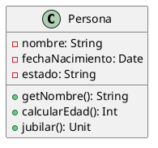
[](https://editor.plantuml.com/uml/LSun3i8m30NGFQVmI8MuGASECB1KI8W3k8ufHeaZ9Sw4k3jf9hg-__NrfsAOhSRWA60fSEDSaY9y7C09DCKbymXtow9hfoVJ2sSaYS9gQOGp6lU4svHFV-KZh6npdpWCEoSCL0FcYqU_HLUrxk-wIEED7YhclcvYzUtT3m00)

Note: Este ejemplo muestra una clase simple con atributos privados y métodos públicos. La visibilidad se indica con + (público) y - (privado).


### 3.3. Ejemplo: Clase Persona II

**Implementación en Kotlin:**

```kotlin
class Persona(private var nombre: String, private var edad: Int, private var estado: String = "activo") {
    fun getNombre(): String = nombre
    fun setEdad(edad: Int) { this.edad = edad }
    fun calcularEdad(): Int = edad
    fun jubilar() {
        estado = "jubilado"
    }
}

fun main() {
    val persona = Persona("Juan", 65)
    println("Nombre: ${persona.getNombre()}, Edad: ${persona.calcularEdad()}")
    persona.jubilar()
}
```

Note: Los atributos privados (-) se declaran en el constructor con 'private var'. Los métodos públicos (+) son funciones sin modificador. La visibilidad del diagrama UML se traduce directamente a modificadores de acceso en Kotlin.


### 3.4. Visibilidad I
Los miembros de una clase (atributos, métodos) pueden tener diferentes niveles de visibilidad:

* **+ público**: Accesible desde cualquier lugar
* **- privado**: Solo accesible dentro de la clase
* **# protegido**: Accesible en la clase y subclases
* **~ paquete**: Accesible en el mismo paquete
* Principio de encapsulación: ocultar detalles internos

Note: La visibilidad controla quién puede acceder a atributos y métodos. El encapsulamiento recomienda atributos privados con métodos públicos. Reduce acoplamiento y mejora mantenimiento. Normalmente no está permitido acceder directamente a atributos privados desde fuera de la clase.


### 3.4. Visibilidad II
* Privado (-): 
    * Los atributos nombre, fechaNacimiento y estado están marcados como privados. 
    * Esto implica que solo son accesibles desde dentro de la propia clase, siguiendo el principio de encapsulamiento. 
    * Es una buena práctica para proteger la integridad del estado del objeto.

* Público (+)
    * Los métodos getNombre(), calcularEdad() y jubilar() son públicos. 
    * Esto significa que pueden ser invocados desde cualquier parte del programa que tenga acceso a una instancia de Persona. 
    * Son la interfaz pública del objeto.

Note: Este diseño promueve un estilo orientado a objetos robusto, donde el acceso al estado está estrictamente controlado a través de métodos públicos, asegurando así coherencia y seguridad.  No hay miembros protegidos (#) en esta clase, pero vale la pena recordar que permiten el acceso desde clases hijas y desde el mismo paquete, siendo útiles en escenarios de herencia.


### 3.5. Miembros estáticos I
**Atributos estáticos**: Existen atributos que pertenecen a la clase en sí, no a instancias individuales:

* Se subrayan en el diagrama
* Compartidos por todas las instancias
* Pertenecen a la clase, no a objetos individuales
* Ejemplo: posicionVolante

Note: Los atributos de clase pertenecen a la clase misma, no a cada objeto. Por ejemplo, la posición del volante es la misma para todos los coches de un sistema, implantado en un Pais. Se accede a ellos usando el nombre de la clase.


### 3.5. Miembros estáticos II
**Métodos estáticos**: Existen métodos que pertenecen a la clase en sí, no a instancias individuales

* Subrayados en el diagrama
* Pertenecen a la clase, no a instancias
* Ejemplo: `configurarPorPais(): Unit`

Note: Los métodos de clase se pueden invocar sin crear un objeto. Los constructores inicializan objetos nuevos.


### 3.5. Ejemplo: Miembros estáticos I
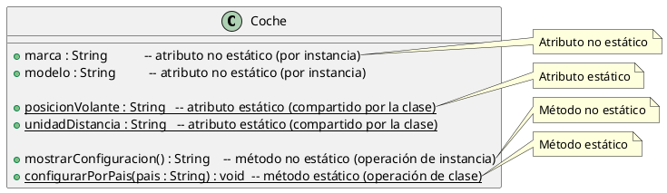

[Ver/Editar en PlantUML](https://www.plantuml.com/plantuml/uml/)

Note: En este ejemplo, `posicionVolante` y `unidadDistancia` son atributos estáticos, compartidos por todos los coches. `configurarPorPais` es un método estático que afecta a la configuración global de la clase Coche. Los atributos y métodos no estáticos pertenecen a instancias individuales.


### 3.5. Ejemplo: Miembros estáticos II

[](https://editor.plantuml.com/uml/fPCzRiCm38LtduAZZI8Ny9GYNGi4AD2TbHI7W4qQafmbo64wTkuHVB5IZTlAgOC6g0P1F-3to4Tf7IBwE7HjOLeC0JPYzWwE1S0TTEWDGWrFqHCty3DMAq0zUncY00ku4CVNI4QWxCK3iJBP45PdYbZNoWBcPefYZhhHkvFoUWbaIFXPMkJeSd1Ep716kbwB92kGo2r2gjLLS-x0PD4-q2Jx7-vKTuWU_KPuHytWCULSLZCVbDkDRr7ifG7IknGmlZDODpSqozXyeVrM_1OfbBrEtmf9wo1aPpfNHQRKJqN1egvwQlOHP7T-47Nz-HPK_dwfOuLZ2odiIl15otBCpOmbEnNqkE3VNwXVlcMS1SXQL-c3V000)

Note: En este ejemplo, `posicionVolante` y `unidadDistancia` son atributos estáticos, estan subrayados. `configurarPorPais` es un método estático y tambien se ve subrayado. 


### 3.5. Ejemplo: Miembros estáticos III
**Implementación en Kotlin:**

```kotlin
class Coche(val marca: String, val modelo: String) {

    // Método no estático que muestra la configuración del coche (acceso a propiedades de instancia y estáticas)
    fun mostrarConfiguracion(): String {
        return "Coche: $marca $modelo, Volante: ${posicionVolante}, Unidad de distancia: ${unidadDistancia}"
    }

    companion object {
        // Atributos estáticos, compartidos por toda la clase
        var posicionVolante: String = "Izquierda"
        var unidadDistancia: String = "Kilómetros"

        // Método estático que configura la clase según el país
        fun configurarPorPais(pais: String) {
            when (pais.lowercase()) {
                "españa" -> {
                    posicionVolante = "Izquierda"
                    unidadDistancia = "Kilómetros"
                }
                "eeuu", "estados unidos" -> {
                    posicionVolante = "Derecha"
                    unidadDistancia = "Millas"
                }
                "japón" -> {
                    posicionVolante = "Derecha"
                    unidadDistancia = "Kilómetros"
                }
                else -> {
                    posicionVolante = "Izquierda"
                    unidadDistancia = "Kilómetros"
                }
            }
        }
    }
}
```

Note: En Kotlin, los miembros estáticos se implementan dentro de un `companion object`. Los atributos `posicionVolante` y `unidadDistancia` son compartidos por todos los objetos de la clase Coche. El método `configurarPorPais` es estático y afecta a estos atributos compartidos. El método `mostrarConfiguracion` es un método de instancia que puede acceder tanto a atributos de instancia como a los estáticos.


### 3.6. Atributos derivados 

* Se calculan a partir de otros atributos
* Se marcan con barra diagonal `/`
* No se almacenan directamente
* Ejemplo: `/edad` derivado de `fechaNacimiento`
* Reducen redundancia de datos

Note: Los atributos derivados ahorran espacio y evitan inconsistencias. La edad cambia cada año, así que almacenarla sería problemático. Mejor calcularla cuando se necesite a partir de la fecha de nacimiento. En UML se marca con / para indicar que es derivado.


### 3.7. Ejemplo: Atributo Derivado I

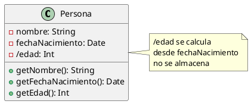

[](https://editor.plantuml.com/uml/NO-n2W8n38RtFaL6HSJzfXjKS3a4do2skRj2cqARcyHtDpaKrAtz_lnVqxu9LbboSZvXQt2bsWeZF1p0dak-L-hW9ZNoP6GaF-E0FkP8BAM38mfPSA20eOCBYzvs4ycmTZVRhxRXyw_0yhV2qfDA39dcwHmN8QXncWNA-5bDHzV7e15uJ7v9XWArGF2tdd8kDeSfeoVj4WSmg-lrfBz-0G00)

Note: En Kotlin, los atributos derivados se implementan como propiedades calculadas (custom getter). No ocupan memoria para almacenamiento, se calculan cada vez que se acceden. Esto garantiza que la edad siempre esté actualizada sin necesidad de mantener manualmente el valor. Representación. /Edad es un atributo que se obtiene a partir del atributo fechaNacimiento. Por tanto, no se debe poder modificar, y se calcula cada vez que se llama. Tenerlo en cuenta al pasarlo a código. 


### 3.7. Ejemplo: Atributo Derivado II

**Implementación en Kotlin:**

```kotlin
import java.time.LocalDate
import java.time.Period

class Persona(
    val nombre: String, 
    val fechaNacimiento: LocalDate
) {
    // Atributo derivado - se calcula, no se almacena
    val edad: Int
        get() = Period.between(fechaNacimiento, LocalDate.now()).years
    
    fun getNombre() = nombre
    fun getFechaNacimiento() = fechaNacimiento
}

fun main() {
    val persona = Persona("Juan", LocalDate.of(1990, 5, 15))
    println("${persona.nombre} tiene ${persona.edad} años")  // La edad se calcula cada vez que se accede
}
```

Note: El atributo derivado /edad se implementa con un custom getter (get() = ...). No ocupa memoria, se calcula cada vez. Period.between() calcula automáticamente los años transcurridos. Esto garantiza que la edad siempre esté actualizada sin almacenarla.

---

## 4. Interfaces: Contratos de comportamiento


### 4.1. ¿Qué es una interfaz?

* Contrato que define comportamiento
* Solo declara métodos, no los implementa
* No tiene atributos de instancia
* Pueden tener constantes
* Las clases las implementan

Note: Una interfaz es un contrato que dice "si implementas esta interfaz, debes proporcionar estos métodos".


### 4.2. Representación gráfica

* Dos formas de representación:
    1. Rectángulo con `<<interface>>` en la parte superior
    2. Círculo con nombre de la interfaz
* Contiene nombre y métodos
* Sin atributos de instancia
* Todos los métodos son públicos y abstractos

Note: La más común es el rectángulo con el estereotipo <<interface>> arriba del nombre.


### 4.3. Ejemplo: Interfaz IVolador I

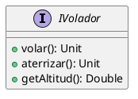
[](https://editor.plantuml.com/uml/SoWkIImgAStDuShCAqajIajCJbNm3ClFIKp9BrAevb9Gq5Oe0_AAD3Ij54BpCal08eb0bKMPLMYYwQabZZabcIMbAI1Xb_pIf9nKhbekXzIy5A3v0000)

Note: Este ejemplo muestra una interfaz simple con tres métodos públicos que deben ser implementados por cualquier clase que la use. Interfaz = contrato sin estado. Los tres métodos son públicos (+) y obligan a cualquier clase implementadora a proporcionar comportamiento. La representación, en vez del rectángulo con <<interface>> aparece una I en un circulo. 


### 4.3. Ejemplo: Interfaz IVolador II

**Implementación en Kotlin:**

```kotlin
interface IVolador {
    fun volar()
    fun aterrizar()
    fun getAltitud(): Double
}
```

Note: Código Kotlin que implementa el diagrama UML anterior. Traducción directa del contrato UML: interface con tres funciones. En Kotlin puedes omitir : Unit en procedimientos (volar, aterrizar). Recuerda que en Kotlin las interfaces pueden tener implementaciones por defecto, útiles para lógica común (p. ej., normalizar límites de altitud).


### 4.4. Clases abstractas

* No se pueden instanciar directamente
* Sirven como plantillas para otras clases
* Nombre en **cursiva**
* Pueden tener métodos abstractos (sin implementación)
* Ejemplo: Figura, Animal, Vehículo

Note: Las clases abstractas representan conceptos generales que no tienen sentido por sí solos. No creas objetos de tipo "Figura", sino "Círculo" o "Cuadrado".


### 4.5. Ejemplo: Clases abstractas I

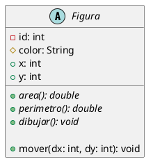

[](https://editor.plantuml.com/uml/TOz12i8m44NtESK75rRK2tHL4Bo09vWsGucaZKmcHIczkwar6y7Tv_t7VAQ9Ig9fy6QFYwV8e3QgKAU4g-kJa2a0NUxZbs8sm1dErd2Zvhn35toG6ZSLD_QP7F4ivH6lBUOybtjBnYHCrQ663Qdr_Di-MDp0Ak6_ObsRxYIhC0LdpMTi21DBPRVv4-msNfJ5D3pQzUKt)

Note: En el ejemplo representamos una clase abstracta Figura, en la que indicamos como que comportamiento tendrá la clase pero no indicamos como lo hará. Los metodos area, perimetro y dibujar son abstractos, mientras que mover tiene implementación. En este caso, se representa con una A, indicando que es una clase abstracta. También se representan en cursiva los métodos que son abstractos.


### 4.5. Ejemplo: Clases abstractas II

**Implementación en Kotlin:**

```kotlin
// Figura abstracta
abstract class Figura(
  private val id: Int,         // UML: - id
  protected var color: String, // UML: # color
  var x: Int,                  // UML: + x
  var y: Int                   // UML: + y
) {
  abstract fun area(): Double
  abstract fun perimetro(): Double
  abstract fun dibujar()

  open fun mover(dx: Int, dy: Int) {
    x += dx
    y += dy
  }

  override fun toString(): String =
    "Figura(id=$id, color=$color, x=$x, y=$y)"
}

// Circulo concreto
class Circulo(
  id: Int,
  color: String,
  x: Int,
  y: Int,
  private val radio: Double     // UML: - radio
) : Figura(id, color, x, y) {

  init {
    require(radio > 0) { "El radio debe ser > 0." }
  }

  override fun area(): Double = Math.PI * radio * radio
  override fun perimetro(): Double = 2 * Math.PI * radio

  override fun dibujar() {
    println("Dibujando Círculo en ($x,$y), radio=$radio, color=$color")
  }
}

// Rectangulo concreto
class Rectangulo(
  id: Int,
  color: String,
  x: Int,
  y: Int,
  private val ancho: Double,    // UML: - ancho
  private val alto: Double      // UML: - alto
) : Figura(id, color, x, y) {

  init {
    require(ancho > 0 && alto > 0) { "Ancho y alto deben ser > 0." }
  }

  override fun area(): Double = ancho * alto
  override fun perimetro(): Double = 2 * (ancho + alto)

  override fun dibujar() {
    println("Dibujando Rectángulo en ($x,$y), ${ancho}x${alto}, color=$color")
  }
}

// --- Ejemplo de uso rápido ---
fun main() {
  val c = Circulo(id = 1, color = "rojo", x = 10, y = 5, radio = 2.5)
  println("Área círculo: ${c.area()}")
  println("Perímetro círculo: ${c.perimetro()}")
  c.mover(3, -2)
  c.dibujar()

  val r = Rectangulo(id = 2, color = "azul", x = 0, y = 0, ancho = 4.0, alto = 2.0)
  println("Área rectángulo: ${r.area()}")
  println("Perímetro rectángulo: ${r.perimetro()}")
  r.mover(-1, 4)
  r.dibujar()
}

```

Note: Implementación en Kotlin del UML de Figura. Traducción directa: {abstract}→abstract; +/#/-/~→public/protected/private/internal; atributos→propiedades (val/var); operaciones→funciones; generalización→herencia (:); asociaciones→referencias/colecciones (multiplicidad 1→objeto, 0..*→List); invariantes del modelo→require(...).


### 4.6. Diferencias con clases abstractas I

* **Interfaces**:
    - Solo métodos abstractos (sin implementación)
    - No tienen atributos de instancia
    - Una clase puede implementar múltiples interfaces
    - Definen "qué" debe hacer

Note: La diferencia clave es que las interfaces son contratos puros sin implementación. Java y Kotlin permiten implementar múltiples interfaces.


### 4.7. Diferencias con clases abstractas II

* **Clases abstractas**:
    - Pueden tener métodos implementados
    - Pueden tener atributos de instancia
    - Herencia simple (solo una superclase)
    - Definen "qué" y parcialmente "cómo"

Note: Las clases abstractas pueden proporcionar implementación parcial, no solo declaraciones. Usa interfaces para capacidades (Volador) y clases abstractas para jerarquías de tipos relacionados (Animal).

---

## 5. Relaciones entre Clases/Interfaces
[](https://editor.plantuml.com/uml/SoWkIImgAStDuNBEIImkDZ1KiAdHrLM0S8oWWiOAMd0n4wYOgK8-NCmCAcQkeAS75RA02bagm5GP6d0vfEQbWAm20000)
[](https://editor.plantuml.com/uml/SoWkIImgAStDuNBEIImkDZHKiAdHqrE0S8oWWiOAkhfsK34Jg9YfWfuUJCmCAcOE5Ak12Lf01IqLR7HrjI22HWPS3gbvAI3h0000)


### 5.1. Tipos de relaciones

* **Asociación (Reflexiva, Binaria, N-aria)**: Conexión entre clases 
* **Agregación**: Relación "tiene un" (partes independientes)
* **Composición**: Relación "es parte de" (partes dependientes)
* **Herencia**: Relación "es un tipo de"
* **Dependencia**: Uso temporal
* **Implementación**: Realización de interfaz

Note: Las relaciones son tan importantes como las clases mismas. Cada tipo de relación tiene un significado específico y una notación propia.


### 5.2. Asociación

* Relación estructural entre clases
* Indica que hay comunicación entre ellas
* Representada con línea continua
* Puede tener nombre y dirección
* Ejemplo: Persona —trabaja en→ Empresa

Note: La asociación es la relación más general. Indica que dos clases están conectadas de alguna forma.


### 5.3. Ejemplo de Asociación I

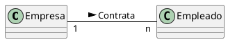
- La empresa contrata 1 o n empleados. 
- Un empleado es contratado por una empresa.
[](https://editor.plantuml.com/uml/HOqx2e0m40NxdEAnVGfR2mc81rdCge5yPBFUNmlHScQA2TrOxIhPPTaCrg1fFmmngQoMMdLhvjwnb5EbyqzPE3RtQj10y1vKwMiOCRTgoiQON90QdyiD)

Note: Asociación binaria en la que una empresa contrata múltiples empleados. La multiplicidad indica "1 a n". La flecha indica que Empresa conoce a Empleado, pero no necesariamente al revés. La empresa contrata 1 o n empleados. Un empleado es contratado por una empresa.


### 5.3. Ejemplo de Asociación II

**Implementación en Kotlin:**

```kotlin
class Empresa(val nombre: String) {
    val empleados: MutableList<Empleado> = mutableListOf()
    
    fun contratarEmpleado(empleado: Empleado) {
        empleados.add(empleado)
        empleado.empresa = this
    }
}

class Empleado(val nombre: String) {
    var empresa: Empresa? = null
}
```

Note: Código Kotlin que implementa el diagrama UML anterior. Observa la traducción directa: clases → class, atributos → propiedades, métodos → funciones, relaciones → referencias/colecciones.


### 5.4. Tipos de Asociación
3 tipos principales de asociación:
- **Binaria**: entre dos clases. Mas común
- **Reflexiva**: una clase se relaciona consigo misma
- **N-aria**: entre tres o más clases

Note: Estos tres tipos cubren la mayoría de los casos de asociación en diagramas de clases. 


#### 5.4.1. Asociación Binaria

* Conecta **dos clases**
* Es la forma más común de asociación
* Puede ser unidireccional o bidireccional
* Ejemplo: Persona - Mascota, Empresa - Empleado

Note: La asociación binaria es el tipo más frecuente. Conecta exactamente dos clases. La bidireccionalidad significa que ambas clases se conocen mutuamente, mientras que en unidireccional solo una clase conoce a la otra.


#### 5.4.2. Asociación Reflexiva

* Una clase se relaciona **consigo misma**
* Útil para jerarquías y relaciones entre objetos del mismo tipo
* Ejemplo: Empleado supervisa a otros Empleados
* Necesita roles claros para distinguir los extremos

Note: Las asociaciones reflexivas son comunes en estructuras jerárquicas. Un empleado puede ser jefe de otros empleados. Los roles (como "jefe" y "subordinado") son esenciales para clarificar la naturaleza de la relación.


#### 5.4.3. Asociación N-aria

* Involucra **más de dos clases** (3 o más)
* Menos común que la binaria
* Se representa con un rombo conectando todas las clases
* Ejemplo: Estudiante - Curso - Profesor (matrícula)

Note: Las asociaciones n-arias son raras pero útiles cuando necesitas relacionar tres o más clases simultáneamente. Por ejemplo, la matrícula de un estudiante involucra al estudiante, el curso y potencialmente un período académico.


### 5.4.4. Ejemplo: Asociación Reflexiva I

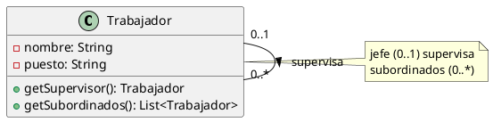

[Ver/Editar en PlantUML](https://www.plantuml.com/plantuml/uml/)

Note: En este ejemplo, un Trabajador puede supervisar a otros Trabajadores. La multiplicidad 0..1 en "jefe" indica que un empleado puede tener cero o un supervisor. La multiplicidad 0..* en "subordinados" indica que puede supervisar a ninguno o varios empleados.


### 5.4.4. Ejemplo: Asociación Reflexiva II
- Un trabajador puedo o no ser superfisado por otro trabajador.
- Un trabajador puede supervisar a 0 o muchos trabajadores.
[](https://editor.plantuml.com/uml/LL113e8m4Bpt5HjEW87ebHZY0xpX1ueiM08jsLsy6FzkIupKssHcTcQo5nPDiiwJka-Q6MwaMptgpX6y541XtTmILj086Ji4PbcHnKNCOK1frWNfQTXHcbLHo4zk7NN6Ueg3uMfOphkhLc-bekRaM9Qd18fYGtaIhwg0lrqQQcMT890P7WAk_-yTiKT8GrAsdtYUeosRdcSARGSXIbqyyi_u0000)

Note: En este ejemplo, un Trabajador puede supervisar a otros Trabajadores. La multiplicidad 0..1 en "jefe" indica que un empleado puede tener cero o un supervisor. La multiplicidad 0..* en "subordinados" indica que puede supervisar a ninguno o varios empleados.


### 5.4.4. Ejemplo: Asociación Reflexiva III

**Implementación en Kotlin:**

```kotlin
class Trabajador(val nombre: String, val puesto: String) {
    private var jefe: Trabajador? = null
    private val subordinados: MutableList<Trabajador> = mutableListOf()
    
    fun setSupervisor(supervisor: Trabajador) {
        this.jefe = supervisor
        supervisor.subordinados.add(this)
    }
    
    fun getSupervisor(): Trabajador? = jefe
    fun getSubordinados(): List<Trabajador> = subordinados.toList()
}

fun main() {
    val gerente = Trabajador("María", "Gerente")
    val empleado1 = Trabajador("Juan", "Desarrollador")
    val empleado2 = Trabajador("Ana", "Diseñadora")
    
    empleado1.setSupervisor(gerente)
    empleado2.setSupervisor(gerente)
    
    println("${gerente.nombre} supervisa a:")
    gerente.getSubordinados().forEach { println("  - ${it.nombre}") }
}
```

Note: Código Kotlin que implementa el diagrama UML anterior. Observa la traducción directa: clases → class, atributos → propiedades, métodos → funciones, relaciones → referencias/colecciones.


### 5.5. Multiplicidad

| Notación     | Significado                       |
|--------------|-----------------------------------|
| `1`          | Exactamente uno                   |
| `0..1`       | Cero o uno                        |
| `*` o `0..*` | Cero o muchos                     |
| `1..*`       | Uno o muchos (al menos uno)       |
| `n`          | Exactamente n (número específico) |
| `m..n`       | Desde m hasta n                   |

Note: La multiplicidad indica cuántos objetos participan en una relación. Es fundamental para entender las restricciones del dominio. 


### 5.6. Navegabilidad

* Indica la **dirección** del conocimiento entre clases
* Flecha apunta a la clase conocida
* Sin flechas: navegabilidad bidireccional (ambas se conocen)
* Con flecha: navegabilidad unidireccional (solo una conoce a la otra)
* Importante para la implementación

Note: La navegabilidad es crucial en el diseño. Si Cliente → Pedido, el cliente conoce sus pedidos pero el pedido podría no conocer al cliente. Esto se traduce directamente en el código: Cliente tendría una lista de Pedidos, pero Pedido no tendría referencia a Cliente.


### 5.7. Ejemplo: Navegabilidad I

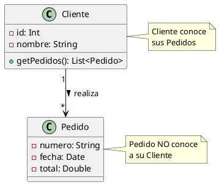

[Ver/Editar en PlantUML](https://www.plantuml.com/plantuml/uml/)

Note: El cliente navega hacia el pedido


### 5.7. Ejemplo: Navegabilidad II
- El cliente puede tener muchos pedidos.
- El pedido pertenece a un solo cliente.
- El cliente ve los pedidos, pero el pedido no tiene porque ver el cliente.
[](https://editor.plantuml.com/uml/NP3F2i8m3CRlVOgmat_emMkHCT2B82hu1DsMpKBNG9jT5D_TbgrJlENxak-Nj5LWxNaSh6Yi3W4Erg1ZX9S0aAPLS7ASIaT3xL71dRrnVNIsFV8DMzDIMAqLd4tW_QHByHOpRJ8cc1i7zFH3a1qs3wtWg1cJP69jewInjfWO-PPYLu2K9HIR8XCLUDJMF3MKGZYAGzxq3mRgyWiYCUSRSjGa8upvf23GjP22__6f7uVdJPVhDwyZOU4lW2fMyGC_)

Note: El cliente navega hacia el pedido


### 5.7. Ejemplo: Navegabilidad III

**En Kotlin (unidireccional):**
```kotlin
import java.time.LocalDate

class Pedido(val numero: String, val fecha: LocalDate, var total: Double) {
    // Pedido NO tiene referencia a Cliente
}

class Cliente(val id: Int, val nombre: String) {
    private val pedidos: MutableList<Pedido> = mutableListOf()
    
    fun realizarPedido(pedido: Pedido) {
        pedidos.add(pedido)
    }
    
    fun getPedidos(): List<Pedido> = pedidos.toList()
}

fun main() {
    val cliente = Cliente(1, "Juan Pérez")
    val pedido1 = Pedido("P001", LocalDate.now(), 150.0)
    val pedido2 = Pedido("P002", LocalDate.now(), 230.0)
    
    cliente.realizarPedido(pedido1)
    cliente.realizarPedido(pedido2)
    
    println("Pedidos de ${cliente.nombre}:")
    cliente.getPedidos().forEach { println("  - ${it.numero}: ${it.total}€") }
}
```

Note: Este es un ejemplo de asociación unidireccional. Cliente tiene una colección de Pedidos y puede acceder a ellos, pero Pedido no tiene forma de saber a qué Cliente pertenece. Esto reduce el acoplamiento y simplifica el código cuando no necesitas navegación inversa.


### 5.8. Roles en Asociaciones

* Etiquetas que describen el **papel** de cada clase
* Se colocan cerca del extremo de la línea de relación
* Útiles cuando la relación no es obvia
* Especialmente importantes en asociaciones reflexivas
* Pueden incluir visibilidad (+, -)

Note: Los roles clarifican el significado de cada extremo de la relación. En una asociación Persona-Persona, los roles "esposo" y "esposa" o "padre" e "hijo" aclaran la naturaleza específica de la relación. En asociaciones reflexivas son prácticamente obligatorios.


### 5.9. Ejemplo: Roles en Asociaciones I

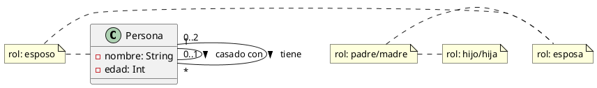

[Ver/Editar en PlantUML](https://www.plantuml.com/plantuml/uml/)

Note: Los roles se traducen directamente a nombres de propiedades en el código. "conyuge", "hijos" y "padres" son roles que clarifican las relaciones entre objetos Persona. Esto hace el código mucho más legible que usar nombres genéricos como "relacionados".


### 5.9. Ejemplo: Roles en Asociaciones II

**Implementación en Kotlin:**

```kotlin
class Persona(val nombre: String, var edad: Int) {
    // Rol: esposo/esposa
    var conyuge: Persona? = null
    
    // Rol: padre/madre
    private val hijos: MutableList<Persona> = mutableListOf()
    
    // Rol: hijo/hija
    private val padres: MutableList<Persona> = mutableListOf()
    
    fun casarseCon(pareja: Persona) {
        this.conyuge = pareja
        pareja.conyuge = this
    }
    
    fun agregarHijo(hijo: Persona) {
        hijos.add(hijo)
        hijo.padres.add(this)
    }
    
    fun getHijos(): List<Persona> = hijos.toList()
    fun getPadres(): List<Persona> = padres.toList()
}
```

Note: Código Kotlin que implementa el diagrama UML anterior. Observa la traducción directa: clases → class, atributos → propiedades, métodos → funciones, relaciones → referencias/colecciones.


### 5.10. Agregación

* Relación "tiene un" o "contiene"
* Partes pueden existir independientemente del todo
* Representada con rombo blanco (◇)
* Ejemplo: Universidad ◇—→ Departamento
* Departamento puede existir sin Universidad

Note: La agregación indica que un objeto está formado por otros, pero las partes tienen vida propia.


### 5.11. Ejemplo de Agregación I

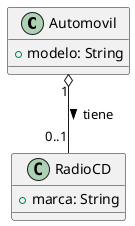

[Ver/Editar en PlantUML](https://www.plantuml.com/plantuml/uml/)

Note: El radio puede existir sin el automóvil. La relación es débil - agregación.


### 5.11. Ejemplo de Agregación II

**Implementación en Kotlin:**

```kotlin
class Automovil(val modelo: String) {
    var radioCD: RadioCD? = null  // Puede o no tener radio
    
    fun instalarRadio(radio: RadioCD) {
        radioCD = radio
    }
}

class RadioCD(val marca: String)
```

Note: Código Kotlin que implementa el diagrama UML anterior. Observa la traducción directa: clases → class, atributos → propiedades, métodos → funciones, relaciones → referencias/colecciones.


### 5.12. Composición

* Relación "es parte de" más fuerte
* Partes NO existen independientemente del todo
* Representada con rombo negro (♦)
* Ejemplo: Casa ♦—→ Habitación
* Si destruyes la casa, las habitaciones desaparecen

Note: La composición es la relación más fuerte de contenencia. Las partes nacen y mueren con el todo.


### 5.13. Ejemplo de Composición I

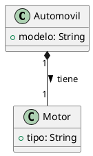

[Ver/Editar en PlantUML](https://www.plantuml.com/plantuml/uml/)

Note: El motor no puede existir sin el automóvil. La relación es fuerte - composición.


### 5.13. Ejemplo de Composición II

**Implementación en Kotlin:**

```kotlin
class Automovil(val modelo: String) {
    val motor: Motor = Motor("V8")  // Motor creado con el automóvil
    
    inner class Motor(val tipo: String) {
        fun motorInfo() = "Motor $tipo del automóvil $modelo"
    }
}
```

Note: Código Kotlin que implementa el diagrama UML anterior. Observa la traducción directa: clases → class, atributos → propiedades, métodos → funciones, relaciones → referencias/colecciones.


### 5.14. Herencia (Generalización)

* Relación "es un tipo de"
* Representa especialización/generalización
* Representada con flecha de triángulo blanco (▷)
* La flecha apunta a la superclase
* Ejemplo: Perro ▷—→ Animal

Note: La herencia es fundamental en POO. Indica que una clase (subclase) hereda atributos y métodos de otra (superclase).


### 5.15. Ejemplo de Herencia I

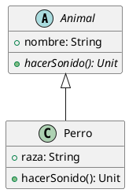

[Ver/Editar en PlantUML](https://www.plantuml.com/plantuml/uml/)

Note: Perro hereda de Animal. La flecha apunta hacia la superclase (Animal).


### 5.15. Ejemplo de Herencia II

**Implementación en Kotlin:**

```kotlin
abstract class Animal(val nombre: String) {
    abstract fun hacerSonido()
    fun comer() = println("$nombre está comiendo")
}

class Perro(nombre: String, val raza: String) : Animal(nombre) {
    override fun hacerSonido() {
        println("El perro $nombre de raza $raza ladra")
    }
}
```

Note: Código Kotlin que implementa el diagrama UML anterior. Observa la traducción directa: clases → class, atributos → propiedades, métodos → funciones, relaciones → referencias/colecciones.


### 5.16. Dependencia

* Relación de uso temporal
* Una clase usa otra pero no la contiene
* Casos típicos son: parámetros de método, variables locales, creación, etc.
* Representada con flecha discontinua (- - →)
* Cambios en una clase pueden afectar a la otra
* Ejemplo: Servicio - - → BaseDatos

Note: La dependencia es la relación más débil. Indica que una clase usa temporalmente otra, típicamente como parámetro de método.


### 5.17. Ejemplo de Dependencia I

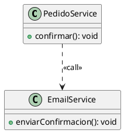
[](https://editor.plantuml.com/uml/LOun2iCm301tlK9ZIo4F2C44GlT2NY1a5GIo3NBg9VJl8P0Xtk-Ec-j6llsI0HlLYX-96iigtfG5Tq1ySSbVzKJ-U8xOYaRuN_0xaLh7IcvAlbm6Qyat2VhuC8I-CE8qCPc50BFaU4uT)

Note: En este ejemplo, PedidoService depende de EmailService para enviar confirmaciones. La relación es débil y temporal. Es una dependencia típica donde un servicio utiliza otro para realizar una tarea específica, por tanto dependencia por uso.


### 5.17. Ejemplo de Dependencia II

**Implementación en Kotlin:**
```Kotlin
class PedidoService {
    fun confirmar(emailService: EmailService) {
        // Llama a una operación de EmailService (dependencia por llamada)
        emailService.enviarConfirmacion()
    }
}

class EmailService {
    fun enviarConfirmacion() {
        println("Enviando email de confirmación…")
    }
}

// Uso
fun main() {
    val servicio = PedidoService()
    servicio.confirmar(EmailService())
}
```

Note: Código Kotlin que implementa el diagrama UML anterior. Observa la traducción directa: clases → class, atributos → propiedades, métodos → funciones, relaciones → referencias/colecciones. La dependencia se refleja en el parámetro del método confirmar() que recibe un EmailService para enviar la confirmación.


### 5.18. Implementación (Realización)

* Clase implementa una interfaz
* La clase proporciona implementación concreta
* Representada con flecha discontinua y triángulo (- - ▷)
* Flecha apunta a la interfaz
* Ejemplo: Avion - - ▷ IVolador

Note: Esta relación indica que una clase concreta implementa todos los métodos definidos en una interfaz.


### 5.19. Ejemplo de Implementación I

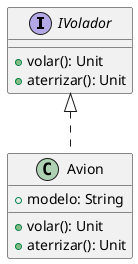

[Ver/Editar en PlantUML](https://www.plantuml.com/plantuml/uml/)

Note: Avion implementa IVolador proporcionando código concreto para los métodos volar() y aterrizar().


### 5.19. Ejemplo de Implementación II

**Implementación en Kotlin:**

```kotlin
interface IVolador {
    fun volar()
    fun aterrizar()
}

class Avion(val modelo: String) : IVolador {
    override fun volar() {
        println("Avión $modelo despegando")
    }
    
    override fun aterrizar() {
        println("Avión $modelo aterrizando")
    }
}
```

Note: Código Kotlin que implementa el diagrama UML anterior. Observa la traducción directa: clases → class, atributos → propiedades, métodos → funciones, relaciones → referencias/colecciones.


### 5.20. Resumen de Relaciones

| Relación           | Símbolo   | Fuerza       |
|--------------------|-----------|--------------|
| **Dependencia**    | `- - →`   | Muy débil    |
| **Asociación**     | `─────`   | Débil        |
| **Agregación**     | `◇────`   | Media        |
| **Composición**    | `♦────`   | Fuerte       |
| **Herencia**       | `────▷`   | Muy fuerte   |
| **Implementación** | `- - ▷`   | Muy fuerte   |

[](https://editor.plantuml.com/uml/SoWkIImgAStDuNBEIImkDZ1KiAdHrLM0S8oWWiOAMd0n4wYOgK8-NCmCAcQkeAS75RA02bagm5GP6d0vfEQbWAm20000)

Note: Este cuadro resume los tipos de relaciones ordenados por fuerza de acoplamiento.


### 5.21. Propiedades de las Relaciones: Resumen

* **Multiplicidad**: Cuántos objetos participan (1, 0..1, *, 1..*)
* **Nombre**: Describe la relación (verbo)
* **Roles**: Papel de cada clase en la relación
* **Navegabilidad**: Dirección del conocimiento (→, ↔)
* **Visibilidad**: De los roles (+, -, #)

Note: Estas propiedades son fundamentales para documentar completamente una relación. La multiplicidad define restricciones de cardinalidad, el nombre clarifica el significado, los roles especifican papeles, la navegabilidad indica dependencias de código, y la visibilidad controla el acceso a las referencias.

---

## 6. Mejores Prácticas en Diagramas de Clases


### 6.1. Responsabilidad Única (SRP)

* Cada clase debe tener una única responsabilidad
* Solo una razón para cambiar
* Clases cohesivas y enfocadas
* Facilita mantenimiento y reutilización
* Evita clases "Dios"

Note: Una clase debe hacer una cosa y hacerla bien. Si al describir la clase usas "y" múltiples veces, probablemente viola SRP.


### 6.2. Gestión de Complejidad

* Dividir diagramas grandes por módulos
* Crear vistas por capas de arquitectura
* Organizar por casos de uso o funcionalidades
* No más de 10-15 clases por diagrama
* Mantener claridad visual

Note: Un diagrama con 50+ clases es ilegible. Es mejor crear varios diagramas: uno de alto nivel con módulos principales, y diagramas detallados por subsistema.


### 6.3. Claridad Visual

**Hacer**:

* Evitar cruces de líneas
* Agrupar clases relacionadas
* Distribución equilibrada
* Usar espacio en blanco

**Evitar**:

* Diagramas abarrotados
* Líneas superpuestas
* Mezclar niveles de detalle

Note: Un buen diagrama no solo es correcto técnicamente, sino también visualmente claro.


### 6.4. Uso Estratégico del Color

* 🔵 **Azul**: Clases del dominio/modelo
* 🟢 **Verde**: Clases de servicios/lógica
* 🟡 **Amarillo**: Clases de utilidades/helpers
* 🟣 **Púrpura**: Interfaces
* ⚫ **Gris**: Clases del framework/externas

Note: Los colores mejoran significativamente la legibilidad cuando se usan con propósito. No uses demasiados colores (máximo 5-6).


### 6.5. Nombrado Consistente

**Clases**: PascalCase, sustantivos singulares
- ✅ `Usuario`, `CarritoCompras`
- ❌ `usuario`, `Carritos`

**Métodos**: camelCase, verbos
- ✅ `calcularTotal()`, `esValido()`
- ❌ `CalcularTotal()`, `validacion()`

**Atributos**: camelCase, sustantivos
- ✅ `nombre`, `fechaCreacion`
- ❌ `Nombre`, `fecha_creacion`

Note: Las convenciones de nombres mejoran la legibilidad y profesionalismo del diagrama.


### 6.6. Validación con Casos de Uso

* Recorre mentalmente los casos de uso sobre el diagrama
* Verifica que el diseño soporta todos los requisitos
* Pregunta: ¿Puede realizarse esta operación?
* Identifica clases o relaciones faltantes
* Busca responsabilidades mal asignadas

Note: Un buen diagrama debe poder "ejecutar" todos los casos de uso del sistema. Por ejemplo, si hay un caso de uso "Cliente realiza pedido", traza el camino: ¿Cliente tiene acceso a Carrito? ¿Carrito puede crear Pedido? ¿Pedido puede acceder a Productos? Si falta alguna relación, el diseño es incompleto.


### 6.7. Errores Comunes


#### Error 1: Atributos en lugar de Relaciones

* ❌ Incorrecto: `Pedido { cliente: Cliente }`
* ✅ Correcto: `Cliente "1" -- "*" Pedido`
* Los tipos complejos deben ser relaciones, no atributos

Note: Un error de principiantes es poner clases como atributos. Si algo es una clase, debe ser una relación. Los atributos son para tipos primitivos (String, Int, Boolean, Date). Las conexiones entre clases se representan con líneas de relación.


#### Error 2: Confundir Agregación y Composición

* Pregunta clave: ¿La parte existe sin el todo?
* Si SÍ → Agregación (◇)
* Si NO → Composición (♦)
* Ejemplo: Motor en Coche = Composición

Note: La distinción puede ser sutil pero es importante. Un jugador puede cambiar de equipo (agregación). Un motor de coche no tiene sentido sin el coche (composición). Piensa en el ciclo de vida: ¿se destruye la parte cuando se destruye el todo?


#### Error 3: Clases "Dios"

* Una clase que hace demasiado
* Viola el Principio de Responsabilidad Única
* Difícil de mantener y testear
* Solución: Dividir en clases más pequeñas

Note: Si una clase tiene 20 métodos y 15 atributos, probablemente hace demasiado. GestorSistema que maneja usuarios, productos, pedidos, inventario y facturación debería ser UserManager, ProductManager, OrderManager, etc. Cada clase debe tener una responsabilidad clara y única.

---

## 7. Ejemplos Completos de Diagramas de Clases


### 7.1. Sistema de Biblioteca I

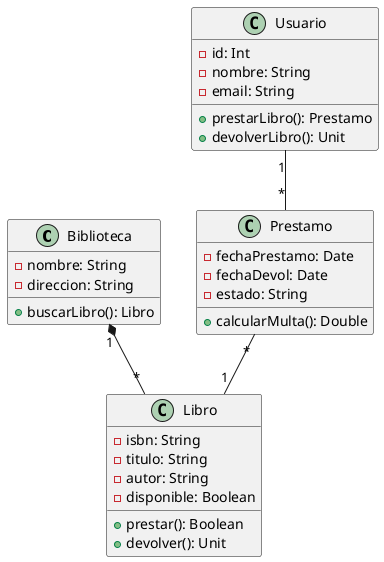

[Ver/Editar en PlantUML](https://www.plantuml.com/plantuml/uml/)


### 7.1. Sistema de Biblioteca II

**Implementación en Kotlin:**

```kotlin
data class Libro(val isbn: String, val titulo: String, 
                 val autor: String, var disponible: Boolean = true) {
    fun prestar(): Boolean = if (disponible) {
        disponible = false; true
    } else false
    fun devolver() { disponible = true }
}

class Usuario(val id: Int, val nombre: String, val email: String) {
    private val prestamos = mutableListOf<Prestamo>()
    fun prestarLibro(libro: Libro): Prestamo? {
        return if (libro.prestar()) {
            Prestamo(this, libro).also { prestamos.add(it) }
        } else null
    }
}

class Prestamo(val usuario: Usuario, val libro: Libro) {
    var estado: String = "ACTIVO"
    fun calcularMulta(): Double = 0.0 // Lógica de multa
}

class Biblioteca(val nombre: String, val direccion: String) {
    private val libros = mutableListOf<Libro>()
    fun buscarLibro(titulo: String) = 
        libros.filter { it.titulo.contains(titulo, true) }
}
```

Note: Este ejemplo muestra una biblioteca con libros, usuarios, préstamos y relaciones de composición, asociación y agregación. Código Kotlin que implementa el diagrama UML anterior. Observa la traducción directa: clases → class, atributos → propiedades, métodos → funciones, relaciones → referencias/colecciones.


### 7.2. Sistema Universitario I

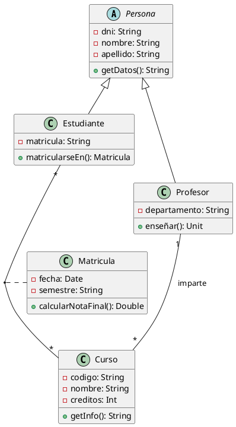

[Ver/Editar en PlantUML](https://www.plantuml.com/plantuml/uml/)


### 7.2. Sistema Universitario II

**Implementación en Kotlin:**

```kotlin
abstract class Persona(val dni: String, var nombre: String, 
                       var apellido: String) {
    fun getDatos() = "$nombre $apellido (DNI: $dni)"
}

class Estudiante(dni: String, nombre: String, 
                 apellido: String, val matricula: String) 
    : Persona(dni, nombre, apellido) {
    private val matriculas = mutableListOf<Matricula>()
    fun matricularseEn(curso: Curso): Matricula {
        return Matricula(this, curso).also { matriculas.add(it) }
    }
}

class Profesor(dni: String, nombre: String, apellido: String,
               val departamento: String) 
    : Persona(dni, nombre, apellido) {
    private val cursosImpartidos = mutableListOf<Curso>()
    fun enseñar(curso: Curso) { cursosImpartidos.add(curso) }
}

class Curso(val codigo: String, val nombre: String, 
            val creditos: Int, val profesor: Profesor)

class Matricula(val estudiante: Estudiante, val curso: Curso,
                var semestre: String = "2024-1") {
    private val notas = mutableMapOf<String, Double>()
    fun calcularNotaFinal() = notas.values.average()
}
```
Note: Sistema que modela estudiantes, cursos, profesores y matrículas con herencia de Persona. Código Kotlin que implementa el diagrama UML anterior. Observa la traducción directa: clases → class, atributos → propiedades, métodos → funciones, relaciones → referencias/colecciones.


### 7.3. Sistema de E-Commerce I

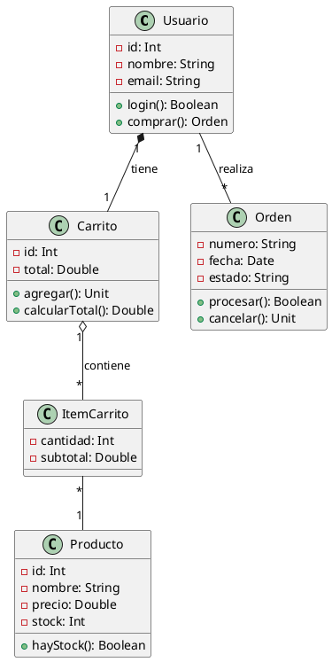

[Ver/Editar en PlantUML](https://www.plantuml.com/plantuml/uml/)


### 7.3. Sistema de E-Commerce II

Note: Sistema completo de tienda online con usuarios, productos, carritos y órdenes.


**Implementación en Kotlin:**

```kotlin
class Producto(val id: Int, var nombre: String, 
               var precio: Double, var stock: Int) {
    fun hayStock(cantidad: Int = 1) = stock >= cantidad
}

class ItemCarrito(val producto: Producto, var cantidad: Int) {
    val subtotal get() = producto.precio * cantidad
}

class Carrito(val usuario: Usuario) {
    private val items = mutableListOf<ItemCarrito>()
    val total get() = items.sumOf { it.subtotal }
    
    fun agregarProducto(producto: Producto, cantidad: Int) {
        items.find { it.producto.id == producto.id }
            ?.let { it.cantidad += cantidad }
            ?: items.add(ItemCarrito(producto, cantidad))
    }
}

class Usuario(val id: Int, var nombre: String, var email: String) {
    val carrito = Carrito(this)
    private val ordenes = mutableListOf<Orden>()
    
    fun comprar(): Orden? = carrito.crearOrden()?.also {
        ordenes.add(it)
        carrito.vaciar()
    }
}

class Orden(val usuario: Usuario, items: List<ItemCarrito>) {
    var estado = "PENDIENTE"
    fun procesar(): Boolean { /* lógica */ return true }
}
```

Note: Código Kotlin que implementa el diagrama UML anterior. Observa la traducción directa: clases → class, atributos → propiedades, métodos → funciones, relaciones → referencias/colecciones.

---

## 8. Herramientas para Crear Diagramas de Clases


### 8.1. Herramientas Online

* **Draw.io / Diagrams.net**: Gratuito, sin registro
* **Lucidchart**: Colaborativo, freemium
* **PlantUML Online**: Diagramas desde texto
* Accesibles desde navegador
* Facilitan colaboración

Note: Las herramientas online son ideales para empezar. Draw.io es completamente gratuito y no requiere registro.


### 8.2. Herramientas de Escritorio

* **Visual Paradigm**: Community Edition gratuita
* **StarUML**: Open source, $89 licencia completa
* **Enterprise Architect**: Estándar de la industria
* Más potentes y completas
* Soporte para ingeniería directa/inversa

Note: Las herramientas de escritorio ofrecen funcionalidades avanzadas como generación de código desde diagramas y creación de diagramas desde código.


### 8.3. IDEs con soporte UML

* **IntelliJ IDEA**: Plugin UML nativo
* **Eclipse + Papyrus**: Gratuito, completo
* **Visual Studio**: Class Designer integrado
* Sincronización código-diagrama
* Ideal para desarrollo activo

Note: Los IDEs modernos incluyen herramientas UML integradas. IntelliJ IDEA puede generar diagramas de clases desde código existente automáticamente.


### 8.4. PlantUML - Ejemplo I

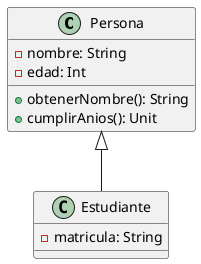

[Ver/Editar en PlantUML](https://www.plantuml.com/plantuml/uml/)

Note: PlantUML permite crear diagramas mediante código texto. Facilita control de versiones con git y automatización en CI/CD.


### 8.4. PlantUML - Ejemplo II

**Implementación en Kotlin:**

```kotlin
open class Persona(private var nombre: String, private var edad: Int) {
    fun obtenerNombre() = nombre
    fun cumplirAnios() { edad++ }
}

class Estudiante(nombre: String, edad: Int, 
                 private val matricula: String) 
    : Persona(nombre, edad)
```

Note: Código Kotlin que implementa el diagrama UML anterior. Observa la traducción directa: clases → class, atributos → propiedades, métodos → funciones, relaciones → referencias/colecciones.

---

## 9. Puntos Clave: Resumen Rápido


### 9.1. Notación Esencial

* Clases: 3 zonas (Nombre, Atributos, Métodos)
* Visibilidad: + público, - privado, # protegido
* Subrayado: miembros estáticos
* Cursiva: clases/métodos abstractos
* / atributo derivado

Note: Esta es la notación básica que debes dominar. El 90% de los diagramas usan solo estos elementos. Enfócate primero en estos antes de explorar notaciones más avanzadas.


### 9.2. Relaciones: Cuándo usar cada una

* **Herencia (▷)**: "Es un" - Perro es Animal
* **Implementación (- -▷)**: Implementa contrato - Avion implementa IVolador
* **Composición (♦)**: Parte de, vida dependiente - Motor en Coche
* **Agregación (◇)**: Tiene, vida independiente - Jugador en Equipo
* **Asociación (─)**: Conexión general - Cliente realiza Pedido
* **Dependencia (- - →)**: Uso temporal - Servicio usa Logger

Note: Usa este orden para decidir: primero pregúntate si es herencia, luego implementación, después composición/agregación, luego asociación, y finalmente dependencia. Cada tipo tiene un significado específico que se traduce directamente al código.


### 9.3. Checklist Antes de Finalizar

✅ Nombres significativos en todas las clases  
✅ Multiplicidad especificada en todas las relaciones  
✅ Tipos de datos en atributos y métodos  
✅ Visibilidad en todos los miembros  
✅ Roles nombrados cuando es necesario  
✅ Sin cruces innecesarios de líneas  
✅ Tamaño adecuado (no más de 15 clases por diagrama)  

Note: Usa este checklist antes de dar un diagrama por terminado. Un diagrama profesional debe cumplir todos estos puntos. Si tienes más de 15 clases, considera dividir en varios diagramas o crear un diagrama de alto nivel con agrupaciones.


### 9.4. Del Diagrama al Código

El proceso típico es:

1. **Clases** → Crear clases Kotlin
2. **Atributos** → Propiedades con visibilidad
3. **Métodos** → Funciones con implementación
4. **Herencia** → `: SuperClase()`
5. **Implementación** → `: Interfaz`
6. **Composición** → inner class o inicialización
7. **Agregación** → Propiedad nullable
8. **Asociación** → Referencia o colección

Note: Cada elemento del diagrama tiene una traducción directa a código. Herencia usa dos puntos y nombre de superclase. Implementación también usa dos puntos. Composición crea objetos dentro de la clase. Agregación usa propiedades nullables. Las asociaciones son referencias o colecciones.

---

## ¡Gracias por vuestra atención!

### Preguntas

¿Alguna pregunta sobre diagramas de clases?

Note: Abrimos espacio para preguntas. Preguntad cualquier duda sobre conceptos vistos: notación, relaciones, herramientas, implementación en Kotlin, etc.
