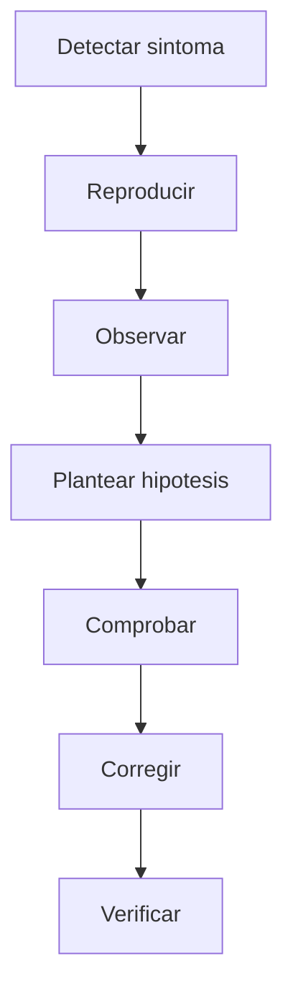

# U5.3 - Depuración

---

 <!-- .element height="50%" width="50%" -->

Note: Presenta la unidad como un bloque sobre **depuración con método** y aclara que no se trata de tocar código al azar, sino de **observar, formular hipótesis y verificar**.

---

## Introducción


### ¿Qué significa depurar?

* No es solo corregir un fallo.
* Es entender por qué ocurre.
* Busca localizar la causa real del problema.
* Forma parte del trabajo normal de desarrollo.
* Ayuda a mantener el software bajo control.

Note: Explica que la **depuración** es una actividad de análisis y que el error se resuelve de forma sólida cuando entendemos su causa, no solo cuando el síntoma deja de verse.


### Por qué importa

* Reduce cambios hechos a ciegas.
* Mejora la calidad del software.
* Ahorra tiempo en mantenimiento.
* Permite reproducir y explicar incidencias.
* Da más confianza al corregir.

Note: Relaciona la depuración con el trabajo profesional y subraya que un equipo técnico no solo programa: también necesita **investigar** y justificar qué ha pasado.

---

## Observar Antes De Tocar


### Primer principio

* Antes de modificar nada:
  * ¿qué debería ocurrir?
  * ¿qué ocurre de verdad?
  * ¿con qué datos se reproduce?
  * ¿dónde divergen ambos comportamientos?

Note: Repite la idea más importante del tema: **observar antes de tocar**. Muchos errores empeoran cuando se hacen cambios impulsivos sin comprender el contexto.


### Flujo de depuración



Note: Usa este diagrama para fijar una rutina mental: depurar bien implica **reproducir, observar y comprobar**, no una secuencia de cambios aleatorios.

---

## Herramientas Del IDE


### Qué ofrece un depurador

* Breakpoints o puntos de ruptura.
* Ejecución paso a paso.
* Inspección de variables.
* Pila de llamadas.
* Evaluación de expresiones.
* Cambio temporal de valores.

Note: Presenta el depurador como la herramienta principal cuando necesitamos ver el **estado real** del programa durante la ejecución.


### Qué mirar en el depurador

* Breakpoint activo en la línea relevante.
* Panel de variables con valores reales.
* Pila de llamadas para ver el contexto.
* Hilos de ejecución si el caso es complejo.
* Botones para avanzar paso a paso.

Note: Sustituye aquí la captura por una lectura guiada del depurador para que la slide siga siendo útil aunque la interfaz cambie entre versiones del IDE.

---

## Técnicas Útiles


### `println` y trazas rápidas

* Sirven para comprobar algo puntual.
* Son rápidas de añadir.
* Pero tienen límites:
  * ensucian el código;
  * generan ruido;
  * no muestran todo el contexto.

```kotlin
println("z vale $z")
```

Note: Explica que `println` puede ser útil al principio, pero no debe convertirse en la única estrategia de análisis.


### Otras técnicas de apoyo

* Depuración por bisección.
* Depuración del patito de goma.
* Checks de sanidad.
* Checks de consistencia.
* Logging como apoyo a la observabilidad.

Note: Resume varias técnicas complementarias y deja claro que el depurador no es la única herramienta, aunque sí la más potente para observar la ejecución.

---

## Depuración Con Método


### Qué conviene hacer

1. Reproducir el error.
2. Describir lo esperado y lo observado.
3. Aislar datos y contexto.
4. Plantear una hipótesis.
5. Comprobarla con pruebas o debugger.
6. Corregir y verificar.

Note: Insiste en la idea de **método**: cada paso reduce incertidumbre y evita la llamada programación de caminata aleatoria.


### Qué conviene documentar

* Descripción clara del fallo.
* Pasos para reproducirlo.
* Entorno y datos necesarios.
* Mensajes de error o logs.
* Comportamiento esperado y real.

Note: Vincula esta parte con el trabajo en equipo y remarca que una incidencia bien documentada se corrige antes y mejor.

---

## Kotlin E IntelliJ


### Breakpoints e inspección

* El breakpoint detiene la ejecución.
* Desde ahí se puede:
  * ver variables;
  * seguir la ejecución;
  * entrar y salir de funciones;
  * revisar la pila de llamadas.

Note: Aclara que el breakpoint no es solo una pausa, sino una forma de congelar el programa en el punto útil para **entender el contexto real**.


### Contextos más complejos

* Código asíncrono.
* Aplicaciones multihilo.
* Fallos intermitentes.
* Integraciones externas.
* Tests automáticos que fallan.

Note: Señala que no todos los errores tienen la misma dificultad y transmite que, cuando la ejecución es compleja, hay que reducir el escenario y ganar visibilidad.

---

## Ejemplos


### Error por nulabilidad

```kotlin
fun main() {
    val texto: String? = null
    println(texto!!.length)
}
```

* El fallo aparece por forzar una suposición falsa.
* El debugger permite ver que `texto` es `null`.

Note: Explica que Kotlin no “falla sin más”: el problema es asumir que un valor existe cuando no existe, y la depuración ayuda a localizar esa suposición.


### Error de lógica

```kotlin
for (numero in listaNumeros) {
    suma = numero
}
```

* Compila correctamente.
* Pero la suma no acumula.
* El problema está en la lógica, no en la sintaxis.

Note: Recuérdales que no todos los errores lanzan excepciones; muchos son de **lógica** y solo se descubren observando valores y flujo de ejecución.

---

## Cierre


### Errores frecuentes al depurar

* Cambiar varias cosas a la vez.
* No reproducir antes de corregir.
* Ignorar el mensaje de error.
* Corregir el síntoma y no la causa.
* No verificar después del cambio.

Note: Termina con errores comunes para que el alumnado los identifique en su propia práctica diaria.


### Idea final

* Depurar no es adivinar.
* Depurar es investigar con método.
* Cuanto mejor observes, mejores correcciones harás.

Note: Cierra dejando la idea fuerte: **depurar es investigar con método** y esa es la enseñanza principal que deben recordar al salir de clase.
