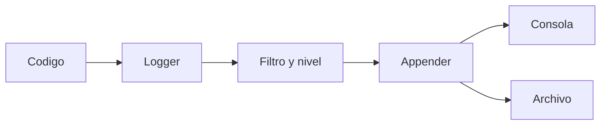

# U5.3.1 - Logging

---

 <!-- .element height="50%" width="50%" -->

Note: Presenta esta parte como continuidad natural del tema de depuración y sitúa el foco en la **observabilidad**, es decir, en cómo dejar rastro útil de lo que hace una aplicación.

---

## Introducción


### ¿Qué problema resuelve el logging?

* `println()` sirve para pruebas rápidas.
* Pero no escala bien en proyectos reales.
* El logging registra eventos con estructura.
* Ayuda a entender qué pasó y cuándo pasó.
* Funciona incluso sin depuración interactiva.

Note: Explica que el logging aparece cuando el depurador no basta o no está disponible y que la idea clave es **hacer observable** el comportamiento del sistema.


### Para qué se utiliza

* Diagnosticar errores.
* Analizar incidencias en producción.
* Seguir el flujo de ejecución.
* Dejar trazabilidad de acciones importantes.
* Sustituir trazas improvisadas.

Note: Recalca que el logging no es solo para fallos y que también ayuda a entender el funcionamiento normal del sistema.

---

## Cómo Funciona


### Flujo básico del logging



Note: Usa este esquema para presentar los conceptos clave: logger, filtro, nivel y appender. Con eso el alumnado entiende la arquitectura general.


### Elementos principales

* **Logger**: emite mensajes desde el código.
* **Nivel**: marca la importancia del mensaje.
* **Appender**: define el destino.
* **Formato**: decide cómo se ve el mensaje.
* **Configuración**: controla el comportamiento.

Note: Resume la teoría para que tengan un mapa mental simple y puedan conectar luego cada elemento con más detalle.

---

## Niveles De Log


### Niveles habituales

| Nivel | Uso |
| --- | --- |
| `TRACE` | Detalle extremo |
| `DEBUG` | Depuración |
| `INFO` | Funcionamiento normal |
| `WARN` | Situación anómala |
| `ERROR` | Fallo relevante |

Note: Explica que el nivel no es decorativo y que sirve para **filtrar** qué se ve según el entorno y el problema que queremos investigar.


### Qué significa en la práctica

* `TRACE`: seguimiento muy fino.
* `DEBUG`: útil durante desarrollo.
* `INFO`: eventos normales importantes.
* `WARN`: algo no va ideal, pero sigue.
* `ERROR`: algo falla y requiere atención.

Note: Conviene aterrizar cada nivel con una intención clara para que el alumnado pueda decidir mejor qué tipo de mensaje escribir.

---

## Herramientas En JVM


### Piezas habituales

* **SLF4J**: API o fachada común.
* **Logback**: implementación muy extendida.
* **Log4j**: otra implementación conocida.
* **Kotlin Logging**: capa idiomática para Kotlin.

Note: Sitúa las herramientas sin convertir la slide en una enciclopedia y ayuda a entender la relación entre API e implementación.


### Referencia de la unidad

* En clase usaremos **SLF4J + Logback**.
* Es una combinación frecuente en proyectos JVM.
* Permite configurar niveles y destinos.
* Se adapta bien a Kotlin.

Note: Justifica por qué se elige Logback como referencia principal y deja claro que el foco es aprender el concepto con una herramienta realista.

---

## Configuración Básica


### Dependencias en Gradle

```kotlin
dependencies {
    implementation("org.slf4j:slf4j-api:2.0.9")
    implementation("ch.qos.logback:logback-classic:1.4.11")
}
```

Note: Explica la separación entre la API `slf4j` y la implementación `logback-classic`; esa distinción es muy importante en el ecosistema JVM.


### Archivo `logback.xml`

```xml
<configuration>
    <appender name="CONSOLE"
              class="ch.qos.logback.core.ConsoleAppender">
        <encoder>
            <pattern>%d{HH:mm:ss.SSS} [%thread] %-5level %logger - %msg%n</pattern>
        </encoder>
    </appender>

    <root level="DEBUG">
        <appender-ref ref="CONSOLE" />
    </root>
</configuration>
```

Note: Destaca tres ideas: destino consola, nivel `DEBUG` y formato del mensaje. No hace falta memorizar el XML, pero sí entender qué controla.

---

## Uso En Kotlin


### Logger básico

```kotlin
import org.slf4j.LoggerFactory

private val logger = LoggerFactory.getLogger("MiAplicacion")
```

* El logger emite mensajes desde el código.
* Lo habitual es tener uno por clase o contexto.

Note: Explica que el logger es el punto de entrada al sistema de logging desde el código de la aplicación.


### Mensajes por nivel

```kotlin
logger.trace("Mensaje TRACE")
logger.debug("Mensaje DEBUG")
logger.info("Mensaje INFO")
logger.warn("Mensaje WARN")
logger.error("Mensaje ERROR")
```

* Si el nivel es `DEBUG`, `TRACE` no se mostrará.

Note: Aquí conviene remarcar que el comportamiento final depende de la configuración, no solo del código.

---

## Caso Realista


### Ejemplo de autenticación

```kotlin
fun autenticar(usuario: String, password: String): Boolean {
    logger.debug("Intentando autenticar al usuario {}", usuario)

    if (usuario.isBlank()) {
        logger.warn("Usuario vacio")
        return false
    }

    val autenticado = password == "1234"
    if (!autenticado) logger.error("Autenticacion fallida")
    return autenticado
}
```

Note: Usa este ejemplo para distinguir niveles: hay información de desarrollo, advertencia de entrada anómala y error cuando falla el proceso.


### Qué aporta este enfoque

* Permite reconstruir el flujo.
* Deja rastro de decisiones importantes.
* Ayuda a diagnosticar sin detener la app.
* Complementa al depurador.

Note: Relaciona el ejemplo con la idea general de observabilidad y deja claro que el log sirve para **reconstruir contexto**.

---

## Buenas Prácticas


### Qué conviene hacer

* Un logger por clase o componente.
* Elegir bien el nivel del mensaje.
* Registrar información útil.
* Configurar destinos y rotación.
* Revisar periódicamente los logs.

Note: Resume criterios prácticos de uso profesional y recuerda que la clave es registrar mejor, no registrar más.


### Qué conviene evitar

* Abusar de `DEBUG` o `TRACE` en producción.
* Usar logs para controlar el flujo.
* Registrar datos sensibles.
* Dejar mensajes ambiguos.
* Generar ruido innecesario.

Note: Cierra esta parte con errores comunes y ayuda a asociar logging útil con mensajes claros, medidos y seguros.

---

## Logging Y Depuración


### No compiten: se complementan

* **Debugger**:
  * pausa la ejecución;
  * muestra el estado actual.
* **Logging**:
  * deja rastro continuo;
  * ayuda cuando no puedes pausar.

Note: Esta comparación es muy importante porque ayuda a decidir qué herramienta usar según el contexto del problema.


### Idea final

* `println()` sirve para una comprobación rápida.
* El logging sirve para observabilidad real.
* Un buen sistema de logs facilita mantener software profesional.

Note: Cierra dejando una idea recordable: el logging no es un adorno, sino una herramienta profesional de diagnóstico y mantenimiento.
